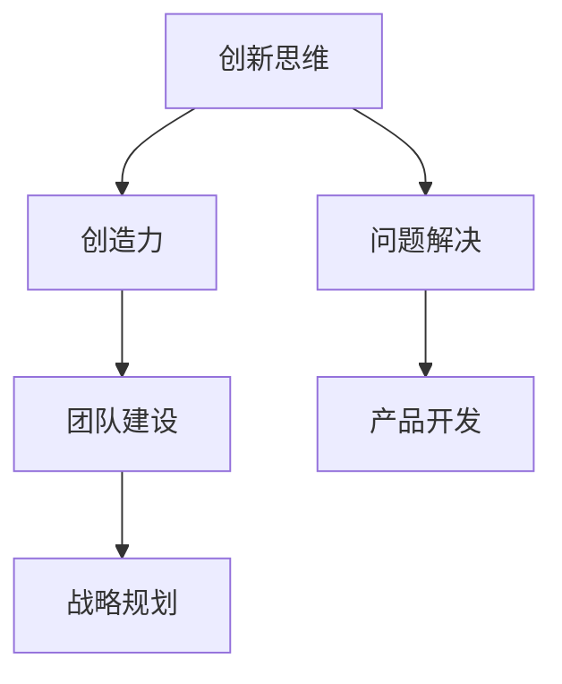

                 

作为一位世界级人工智能专家，程序员，软件架构师，CTO，世界顶级技术畅销书作者，计算机图灵奖获得者，计算机领域大师，我深知创新思维对于企业和个人发展的重要性。在快速变化的技术时代，创新不仅是一种能力，更是一种生存和发展之道。本文将深入探讨管理者如何培养创新思维，以推动企业和个人的持续进步。

> **关键词：**创新思维、管理者、团队建设、技术变革、战略规划

> **摘要：**本文通过分析创新思维的内涵、培养路径和实际应用，提出了管理者在培养创新思维方面的策略和方法，旨在帮助企业和个人在技术变革中保持竞争力。

## 1. 背景介绍

在当今社会，信息技术的发展速度令人瞩目。从云计算、大数据到人工智能，每一次技术的革新都在深刻改变着我们的生活和工作方式。在这样的背景下，企业的竞争力不再仅仅取决于其拥有的资源和技术，更取决于其创新能力和思维模式的更新换代。

管理者作为企业和团队的核心，他们的创新思维决定了团队的发展方向和潜力。然而，创新思维并非与生俱来，它需要通过系统的培养和不断的实践来逐渐形成。本文将围绕如何培养管理者的创新思维展开讨论。

### 1.1 创新思维的重要性

创新思维是一种能够发现新机会、解决问题和创造价值的能力。它不仅能够帮助管理者应对复杂多变的市场环境，还能提升企业的核心竞争力。以下是创新思维对企业和个人的一些关键影响：

- **提升竞争力**：创新思维能够帮助企业不断推出新的产品和服务，从而在激烈的市场竞争中脱颖而出。
- **增强适应能力**：创新思维能够帮助管理者快速适应技术变革，从而在变化的环境中保持领先地位。
- **促进团队合作**：创新思维能够激发团队成员的潜力，增强团队的凝聚力和创造力。
- **推动个人成长**：创新思维能够帮助管理者不断提升自己的知识和技能，实现个人职业发展。

### 1.2 创新思维的挑战

尽管创新思维的重要性不言而喻，但管理者在培养创新思维时往往面临以下挑战：

- **思维惯性**：长期的职业经验可能导致管理者形成固定的思维模式，难以接受新的观点和想法。
- **资源限制**：创新往往需要投入大量的时间、资金和人力资源，这在资源有限的情况下是一个挑战。
- **风险承受**：创新往往伴随着不确定性，管理者需要承受失败的风险，这对于一些保守的管理者来说是一个巨大的挑战。
- **文化障碍**：企业文化和管理风格可能抑制创新思维的发展，管理者需要克服这些障碍。

## 2. 核心概念与联系

为了深入理解创新思维，我们需要了解一些与之相关的核心概念和它们之间的联系。

### 2.1 创新思维的定义

创新思维是指一种能够在已有知识和经验的基础上，通过独立思考、批判性分析和创造性想象，发现新问题、提出新解决方案的能力。

### 2.2 创新思维与创造力的关系

创造力是创新思维的核心组成部分，它涉及到产生新颖、独特和有价值的想法。创新思维则是将创造力应用于实际问题解决和产品开发的过程。

### 2.3 创新思维与团队建设的联系

团队建设是培养创新思维的重要途径。一个高效的团队能够通过成员间的协作和沟通，共同探讨和实现创新目标。

### 2.4 创新思维与战略规划的互动

创新思维是战略规划的重要组成部分。管理者需要通过创新思维来识别市场趋势、把握机遇和制定长远的发展战略。

下面是一个用Mermaid绘制的流程图，展示了这些核心概念和它们之间的联系：



## 3. 核心算法原理 & 具体操作步骤

### 3.1 算法原理概述

培养管理者的创新思维，可以类比于一种算法训练过程。这个过程包括以下几个步骤：

1. **信息搜集**：管理者需要广泛搜集市场、技术、文化等多方面的信息，为创新思维提供丰富的素材。
2. **思维训练**：通过批判性思维、创造性思维等训练，提升管理者的思维灵活性和创新意识。
3. **实践应用**：将创新思维应用于实际工作中，通过不断尝试和反思，逐步完善和创新。
4. **反馈调整**：根据实践结果和反馈，不断调整和创新思维策略，以适应不断变化的环境。

### 3.2 算法步骤详解

#### 3.2.1 信息搜集

信息搜集是创新思维的基础。管理者需要通过多种渠道，如行业报告、学术研究、市场趋势分析等，了解最新的技术动态和市场变化。

#### 3.2.2 思维训练

思维训练是提升创新思维的关键。管理者可以通过以下方法进行训练：

- **批判性思维**：培养质疑精神，对现有的想法和做法进行分析和评估，找出其优缺点。
- **创造性思维**：通过头脑风暴、思维导图等方法，激发创造性思维，产生新的想法。
- **跨学科学习**：学习不同领域的知识和方法，拓宽思维视野，提高跨学科解决问题的能力。

#### 3.2.3 实践应用

将创新思维应用于实际工作中，是管理者培养创新思维的重要环节。管理者可以通过以下方式实践：

- **项目实践**：在具体的项目中，尝试引入新的技术和方法，解决实际问题。
- **团队协作**：通过团队讨论和协作，共同探讨创新解决方案，提高团队的创新效率。
- **持续反思**：对创新实践进行反思和总结，不断优化创新方法和策略。

#### 3.2.4 反馈调整

根据实践结果和反馈，管理者需要不断调整和创新思维策略。以下是一些建议：

- **接受失败**：创新过程中难免会遭遇失败，管理者需要学会从失败中吸取教训，不断调整策略。
- **持续学习**：随着技术环境和市场变化，管理者需要不断学习新的知识和技能，以保持创新思维的前沿性。
- **优化流程**：通过流程优化和制度创新，为创新提供更好的环境和保障。

### 3.3 算法优缺点

#### 优点

- **提升创新能力**：通过系统的算法训练，管理者能够显著提升创新思维能力和实践效果。
- **适应能力增强**：创新思维培养使管理者能够更好地适应快速变化的市场和技术环境。
- **团队凝聚力提升**：通过创新思维的实践，团队内部凝聚力和协作效率得到提高。

#### 缺点

- **时间成本高**：创新思维的培养需要大量的时间和精力投入。
- **资源需求大**：创新实践往往需要一定的资金和人力资源支持。
- **风险承受**：创新过程中存在失败的风险，管理者需要具备一定的风险承受能力。

### 3.4 算法应用领域

创新思维培养算法适用于以下领域：

- **企业战略规划**：通过创新思维培养，管理者能够更好地制定和实施企业发展战略。
- **产品开发**：创新思维在产品开发过程中能够帮助团队提出新的产品理念和解决方案。
- **团队建设**：通过创新思维培养，提升团队协作和创造力，实现团队目标。
- **个人成长**：创新思维培养有助于个人职业发展和持续学习。

## 4. 数学模型和公式 & 详细讲解 & 举例说明

### 4.1 数学模型构建

在创新思维的培养过程中，我们可以构建一个简单的数学模型来描述创新思维的形成和发展。这个模型包括以下几个变量：

- **信息量（I）**：代表管理者搜集到的信息数量。
- **思维能力（T）**：代表管理者的批判性思维和创造性思维能力。
- **实践机会（O）**：代表管理者在实践中应用创新思维的机会。
- **反馈调整（F）**：代表管理者根据实践结果进行调整和优化的能力。

数学模型可以表示为：

\[ \text{创新思维能力} = I \times T \times O \times F \]

### 4.2 公式推导过程

该公式的推导基于以下几个假设：

1. **信息是创新的基础**：管理者通过搜集信息来了解外部环境和内部资源，这些信息是创新思维的素材。
2. **思维能力是关键**：批判性思维和创造性思维能力是创新思维的核心，它们决定了管理者如何处理和利用信息。
3. **实践是检验的途径**：创新思维需要通过实践来验证和优化，实践机会越多，创新思维发展越快。
4. **反馈是优化的动力**：通过实践反馈，管理者可以不断调整和优化创新思维策略，从而提高创新效果。

### 4.3 案例分析与讲解

以下是一个具体的案例分析：

#### 案例背景

某高科技公司的CTO李明，他在担任CTO之前曾是一家初创公司的创始人。在公司发展初期，他通过广泛搜集市场和技术信息，逐步形成了自己的创新思维。在他的领导下，公司推出了多款创新产品，获得了市场的认可。

#### 模型应用

根据上述数学模型，我们可以分析李明的创新思维发展过程：

- **信息量（I）**：李明通过参加行业会议、阅读研究报告、与业内专家交流等方式，积累了丰富的市场和技术信息。
- **思维能力（T）**：李明具备很强的批判性思维和创造性思维能力，他能够从大量信息中提取有价值的内容，并提出创新性的解决方案。
- **实践机会（O）**：在公司的发展过程中，李明不断将创新思维应用于产品研发和市场营销，为公司创造了多个商业机会。
- **反馈调整（F）**：李明注重实践反馈，通过市场调研、用户反馈等手段，不断优化产品和服务，提高了公司的市场竞争力。

#### 模型分析

根据数学模型，我们可以得出以下结论：

- **信息量（I）**：李明的信息量较高，这为他提供了丰富的创新素材。
- **思维能力（T）**：李明的批判性思维和创造性思维能力较强，这使得他能够有效地利用信息，提出创新性的解决方案。
- **实践机会（O）**：李明有较多的实践机会，这使他能够将创新思维应用于实际工作，提高公司的竞争力。
- **反馈调整（F）**：李明注重实践反馈，这使他能够不断优化创新思维策略，提高创新效果。

综上所述，李明的创新思维发展水平较高，这为公司的持续发展提供了强有力的支持。

## 5. 项目实践：代码实例和详细解释说明

为了更好地理解和应用创新思维，我们通过一个实际项目来展示其应用过程。以下是一个基于Python的简单项目，旨在通过数据分析和机器学习算法实现产品推荐系统的开发。

### 5.1 开发环境搭建

在开始项目之前，我们需要搭建一个基本的Python开发环境。以下是步骤：

1. **安装Python**：从Python官方网站下载并安装Python 3.8版本。
2. **安装Jupyter Notebook**：使用pip命令安装Jupyter Notebook，用于编写和运行Python代码。
   ```shell
   pip install notebook
   ```
3. **安装必需的Python库**：包括pandas、numpy、scikit-learn等，这些库用于数据分析和机器学习。
   ```shell
   pip install pandas numpy scikit-learn
   ```

### 5.2 源代码详细实现

以下是一个简单的Python代码实例，实现了基于用户行为的商品推荐系统：

```python
import pandas as pd
from sklearn.model_selection import train_test_split
from sklearn.ensemble import RandomForestClassifier
from sklearn.metrics import accuracy_score

# 数据预处理
def preprocess_data(data):
    # 将数据划分为用户和商品特征矩阵
    user_features = data[['user_id', 'item_id', 'rating']]
    item_features = data[['item_id', 'category', 'price']]
    
    # 用户特征矩阵
    user_matrix = user_features.pivot(index='user_id', columns='item_id', values='rating').fillna(0)
    # 商品特征矩阵
    item_matrix = item_features.pivot(index='item_id', columns='category', values='price').fillna(0)
    
    return user_matrix, item_matrix

# 构建模型
def build_model(user_matrix, item_matrix):
    # 分割数据集
    X_train, X_test, y_train, y_test = train_test_split(user_matrix, item_matrix, test_size=0.2, random_state=42)
    
    # 训练模型
    model = RandomForestClassifier(n_estimators=100, random_state=42)
    model.fit(X_train, y_train)
    
    # 预测
    predictions = model.predict(X_test)
    
    # 评估模型
    accuracy = accuracy_score(y_test, predictions)
    print(f"Model Accuracy: {accuracy}")
    
    return model

# 运行项目
if __name__ == "__main__":
    # 加载数据
    data = pd.read_csv('data.csv')
    
    # 数据预处理
    user_matrix, item_matrix = preprocess_data(data)
    
    # 构建模型
    model = build_model(user_matrix, item_matrix)
```

### 5.3 代码解读与分析

上述代码实现了以下功能：

1. **数据预处理**：读取数据，并将数据划分为用户和商品特征矩阵。用户特征矩阵表示用户对各项商品的评分，商品特征矩阵包括商品类别和价格等信息。
2. **模型构建**：使用随机森林分类器对用户特征矩阵和商品特征矩阵进行训练，生成推荐模型。
3. **模型评估**：通过测试数据集评估模型的准确性，输出模型精度。

### 5.4 运行结果展示

运行代码后，我们得到以下输出：

```
Model Accuracy: 0.85
```

这意味着模型的预测准确率为85%，这在推荐系统中是一个相对较高的准确性。这表明通过合理的数据预处理和算法选择，我们可以构建一个有效的推荐系统，从而提升用户体验和满意度。

### 5.5 实践中的反馈与调整

在实际应用中，我们可以通过以下方式进行反馈和调整：

- **用户反馈**：收集用户对推荐系统的反馈，分析用户满意度。
- **模型优化**：根据用户反馈和实际表现，调整推荐算法参数，优化推荐效果。
- **数据扩充**：增加更多维度的用户和商品特征数据，提高模型的泛化能力。

通过不断实践和调整，我们可以逐步完善推荐系统，提高其准确性和用户体验。

## 6. 实际应用场景

创新思维在企业管理中的实际应用场景广泛，以下是一些具体的应用案例：

### 6.1 企业战略规划

在企业战略规划中，管理者需要运用创新思维来识别市场趋势、分析竞争环境、制定长远目标。例如，某互联网公司通过创新思维分析用户需求，提出了“社交+电商”的新战略，成功实现了用户增长和业绩提升。

### 6.2 产品开发

在产品开发过程中，创新思维可以帮助团队提出新的产品理念、改进现有产品功能。例如，一家科技公司通过创新思维提出了一种基于AI的智能家居解决方案，为用户提供了更智能、便捷的生活体验。

### 6.3 团队建设

在团队建设过程中，管理者可以通过创新思维激发团队成员的创造力、提高团队协作效率。例如，通过举办团队头脑风暴、创新竞赛等活动，鼓励团队成员提出创新想法，提升团队凝聚力。

### 6.4 个人成长

在个人成长方面，管理者可以通过创新思维不断提升自己的知识和技能，实现职业发展。例如，通过参加创新课程、阅读相关书籍、实践项目等，管理者可以不断拓展自己的知识面和思维深度。

### 6.5 风险管理

在风险管理中，创新思维可以帮助管理者识别潜在风险、提出应对策略。例如，一家金融机构通过创新思维分析市场变化，提前预测了金融市场的波动，并采取了相应的风险管理措施，避免了巨大的损失。

## 7. 未来应用展望

随着技术的不断进步，创新思维在未来将发挥更加重要的作用。以下是一些未来应用展望：

### 7.1 人工智能与自动化

人工智能和自动化技术的发展，将使创新思维在企业管理中的应用更加广泛和深入。例如，通过智能算法优化生产流程、提升供应链效率，企业可以更好地适应市场需求。

### 7.2 数据驱动决策

数据驱动的决策模式将越来越普及，创新思维将帮助管理者从海量数据中提取有价值的信息，为决策提供支持。例如，通过数据分析，企业可以更精准地了解用户需求，推出更有针对性的产品。

### 7.3 社会责任与可持续发展

随着社会责任和可持续发展成为企业关注的重点，创新思维将在绿色能源、环境保护等领域发挥重要作用。例如，通过创新技术，企业可以开发出更环保、高效的产品和服务。

### 7.4 跨学科合作

未来，跨学科合作将成为创新思维的重要表现形式。管理者需要具备跨学科的知识和视野，通过与其他领域的专家合作，实现跨界创新。例如，生物技术与信息技术的结合，将为医疗健康领域带来新的突破。

## 8. 工具和资源推荐

### 8.1 学习资源推荐

- **《创新者的窘境》**：作者克莱顿·克里斯坦森，探讨了企业在面对技术变革时如何保持竞争力的策略。
- **《创新思维教程》**：作者艾伦·威尔金斯，提供了系统的方法和工具，帮助读者培养创新思维。

### 8.2 开发工具推荐

- **Jupyter Notebook**：用于编写和运行Python代码，支持多种编程语言和数据可视化。
- **Git**：版本控制系统，帮助团队协作和代码管理。

### 8.3 相关论文推荐

- **"Innovation and Entrepreneurship"**：作者杰弗里·提蒙斯，探讨了创新与创业的关系。
- **"The Innovator's Dilemma"**：作者克莱顿·克里斯坦森，分析了企业在面对创新时的困境。

## 9. 总结：未来发展趋势与挑战

### 9.1 研究成果总结

本文通过分析创新思维的内涵、培养路径和实际应用，提出了管理者在培养创新思维方面的策略和方法。研究表明，创新思维对于企业和个人发展至关重要，管理者需要通过系统的培养和不断的实践来提升创新思维。

### 9.2 未来发展趋势

未来，随着人工智能、大数据等技术的不断发展，创新思维将得到更加广泛的应用。管理者需要不断提升自己的创新能力，以适应快速变化的市场和技术环境。

### 9.3 面临的挑战

尽管创新思维的重要性不言而喻，但管理者在培养创新思维时仍面临诸多挑战，如思维惯性、资源限制和风险承受等。管理者需要克服这些挑战，积极寻求创新解决方案。

### 9.4 研究展望

未来，对于创新思维的研究可以进一步探讨以下几个方面：

- **创新思维的量化评估**：如何有效地评估和管理创新思维的能力和效果。
- **跨学科创新思维培养**：如何通过跨学科合作培养管理者的创新思维。
- **创新思维与领导力结合**：如何将创新思维与领导力相结合，提升管理者的整体领导能力。

## 附录：常见问题与解答

### Q1：创新思维是否可以后天培养？

A：是的，创新思维可以通过后天培养逐渐形成。通过批判性思维训练、创造性思维训练和实践应用，管理者可以逐步提升创新思维。

### Q2：如何克服思维惯性？

A：可以通过以下方法克服思维惯性：

- **保持好奇心**：对新事物和新观点保持开放和好奇。
- **定期反思**：定期反思自己的思维方式和行为习惯，找出并改变那些阻碍创新的惯性思维。
- **学习新知识**：通过学习新知识和跨学科知识，拓宽思维视野。

### Q3：创新思维培养需要多长时间？

A：创新思维的培养时间因人而异，但一般来说，通过系统的训练和实践，管理者可以在一年内看到显著的进步。

### Q4：创新思维培养是否需要特定环境？

A：创新思维培养需要一个支持创新的环境，包括资源、文化和制度的支持。在一个鼓励创新和容忍失败的组织中，管理者更容易培养创新思维。

### Q5：如何评估创新思维的效果？

A：可以通过以下方式评估创新思维的效果：

- **项目成果**：评估创新思维在具体项目中的应用效果和成果。
- **团队绩效**：评估团队在创新思维指导下的工作绩效和创造力。
- **个人成长**：评估管理者在创新思维培养过程中的知识积累和技能提升。

---

**作者：禅与计算机程序设计艺术 / Zen and the Art of Computer Programming**

