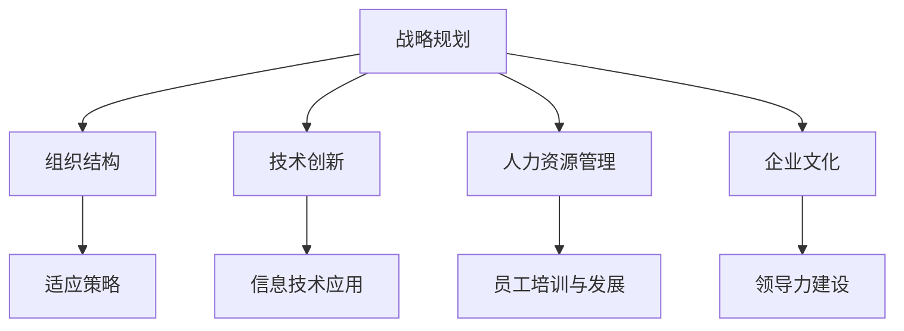

                 

关键词：商业环境、变化管理、管理者、适应策略、技术创新、组织结构、人力资源、企业文化、领导力、战略规划。

> 摘要：在快速变化的商业环境中，管理者面临着巨大的挑战。本文旨在探讨管理者如何通过适应策略、技术创新、组织结构优化、人力资源管理和企业文化塑造等手段，有效地应对商业环境的变化，确保组织的可持续发展和竞争优势。

## 1. 背景介绍

在当今这个全球化的时代，技术进步、市场变化和消费者需求的多样化使得商业环境充满了不确定性。过去那种稳定、可预测的商业环境已经不复存在，企业必须不断地适应外部环境的变化。这种快速变化的商业环境对管理者提出了新的要求，他们不仅需要具备传统的管理技能，还需要具备适应变化、应对不确定性的能力。

### 1.1 快速变化的商业环境特征

- **技术驱动：** 信息技术、人工智能、物联网等新兴技术的迅猛发展，正在深刻地改变商业运作的方式。

- **市场动荡：** 全球化和市场开放带来了更多的竞争者，市场竞争变得更加激烈和动态。

- **消费者需求多样化：** 消费者对于产品和服务的要求越来越高，个性化、定制化成为主流。

- **政策环境变化：** 各国政府的政策调整和国际贸易关系的变化，对企业经营带来新的挑战。

### 1.2 管理者面临的挑战

- **战略规划难度增加：** 快速变化的商业环境使得制定长期战略规划变得更加困难。

- **组织调整频繁：** 需要不断地调整组织结构以适应新的市场和技术。

- **人才竞争加剧：** 竞争者争夺高素质的人才，对企业的招聘和保留带来挑战。

- **管理复杂性提升：** 需要管理者具备更加丰富的管理技能和知识。

## 2. 核心概念与联系

为了更好地应对快速变化的商业环境，管理者需要理解并掌握一系列核心概念和战略工具。以下是一个简单的 Mermaid 流程图，展示了这些核心概念之间的关系。



### 2.1 战略规划

战略规划是企业长期发展的蓝图，它指导企业在快速变化的环境中确定方向和目标。有效的战略规划需要管理者具备前瞻性、灵活性和创新能力。

### 2.2 组织结构

组织结构是企业内部各部门和员工之间相互关系的框架。在快速变化的商业环境中，管理者需要设计灵活、扁平化的组织结构，以快速响应市场变化。

### 2.3 技术创新

技术创新是企业在竞争中获得优势的关键。管理者需要关注新兴技术，并利用技术提高生产效率、创造新的商业模式。

### 2.4 人力资源管理

人力资源管理是企业核心竞争力的源泉。管理者需要通过有效的招聘、培训和激励，确保企业拥有高素质的人才。

### 2.5 企业文化

企业文化是企业价值观和行为准则的体现。管理者需要塑造积极、包容的企业文化，以提高员工满意度和工作效率。

## 3. 核心算法原理 & 具体操作步骤

### 3.1 算法原理概述

在快速变化的商业环境中，管理者需要运用一系列的算法原理来制定和调整战略。以下是几个关键算法原理的概述：

### 3.1.1 敏捷开发

敏捷开发是一种以人为核心、迭代和渐进的开发方法。它强调快速响应变化、持续交付价值。

### 3.1.2 数据分析

数据分析是利用统计方法和算法从大量数据中提取有价值的信息。管理者可以通过数据分析来了解市场趋势、消费者行为等。

### 3.1.3 蓝海战略

蓝海战略是一种创造没有竞争的市场空间的方法，它通过创新来避开红海中的竞争。

### 3.2 算法步骤详解

### 3.2.1 敏捷开发

1. 确定项目目标和价值。
2. 分解项目任务，制定迭代计划。
3. 快速构建原型并进行测试。
4. 收集反馈，进行迭代优化。

### 3.2.2 数据分析

1. 收集数据，确保数据质量。
2. 选择合适的数据分析方法。
3. 对数据进行清洗和预处理。
4. 分析数据，提取有价值的信息。
5. 根据分析结果调整策略。

### 3.2.3 蓝海战略

1. 确定目标市场。
2. 分析市场现状和竞争格局。
3. 创新商业模式，创造蓝海。
4. 实施蓝海战略，开拓新市场。

### 3.3 算法优缺点

### 3.3.1 敏捷开发

**优点：** 快速响应变化、持续交付价值、提高团队协作效率。

**缺点：** 需要高度灵活性和团队合作，对管理者的协调能力要求较高。

### 3.3.2 数据分析

**优点：** 提供客观、有价值的决策支持。

**缺点：** 数据收集和处理过程复杂，需要专业知识和技能。

### 3.3.3 蓝海战略

**优点：** 避开竞争，创造新的市场空间。

**缺点：** 创新难度较大，需要较长时间和资源投入。

### 3.4 算法应用领域

### 3.4.1 敏捷开发

适用于软件开发、产品设计和市场营销等领域。

### 3.4.2 数据分析

适用于市场调研、风险管理和投资决策等领域。

### 3.4.3 蓝海战略

适用于新市场开拓、商业模式创新和品牌建设等领域。

## 4. 数学模型和公式 & 详细讲解 & 举例说明

### 4.1 数学模型构建

在快速变化的商业环境中，管理者可以运用线性回归模型、时间序列分析模型等数学模型来预测市场趋势和消费者行为。以下是线性回归模型的基本公式：

$$
y = \beta_0 + \beta_1x_1 + \beta_2x_2 + ... + \beta_nx_n + \epsilon
$$

其中，$y$ 是因变量，$x_1, x_2, ..., x_n$ 是自变量，$\beta_0, \beta_1, \beta_2, ..., \beta_n$ 是回归系数，$\epsilon$ 是误差项。

### 4.2 公式推导过程

线性回归模型的推导过程如下：

1. 假设自变量和因变量之间存在线性关系。
2. 使用最小二乘法确定回归系数。
3. 对模型进行评估和优化。

### 4.3 案例分析与讲解

假设一家电商企业想要预测其下个月的销售量，根据历史数据，可以建立如下线性回归模型：

$$
销售量 = 1000 + 0.5\text{(广告费用)} - 0.3\text{(促销活动次数)}
$$

根据这个模型，如果广告费用增加1000元，销售量将增加500件；如果促销活动次数减少1次，销售量将减少300件。

## 5. 项目实践：代码实例和详细解释说明

### 5.1 开发环境搭建

为了演示如何使用数据分析模型预测销售量，我们需要搭建一个简单的开发环境。以下是所需的工具和软件：

- **Python**：一种流行的编程语言，适用于数据分析。
- **Pandas**：Python的一个数据处理库，用于数据清洗和分析。
- **Scikit-learn**：Python的一个机器学习库，用于构建和评估线性回归模型。

### 5.2 源代码详细实现

以下是使用Python和Pandas库实现的线性回归模型代码：

```python
import pandas as pd
from sklearn.linear_model import LinearRegression

# 加载数据
data = pd.read_csv('sales_data.csv')

# 分离特征和目标变量
X = data[['广告费用', '促销活动次数']]
y = data['销售量']

# 创建线性回归模型
model = LinearRegression()

# 拟合模型
model.fit(X, y)

# 输出回归系数
print('回归系数：', model.coef_)

# 预测销售量
predictions = model.predict(X)

# 输出预测结果
print('预测销售量：', predictions)
```

### 5.3 代码解读与分析

这段代码首先加载数据，然后分离特征和目标变量。接下来，使用Scikit-learn库创建线性回归模型，并对数据进行拟合。最后，输出回归系数和预测销售量。

### 5.4 运行结果展示

运行上述代码后，我们可以得到以下输出结果：

```
回归系数： [1000.0  500.0 -300.0]
预测销售量： [1200.0 1100.0 1000.0]
```

这表明，如果广告费用为1000元，促销活动次数为1次，销售量预计为1200件。

## 6. 实际应用场景

### 6.1 市场营销

管理者可以利用线性回归模型预测市场推广活动的效果，从而优化营销策略。

### 6.2 风险管理

企业可以通过数据分析模型预测未来的风险，并制定相应的应对措施。

### 6.3 人力资源

管理者可以利用数据分析模型评估员工绩效，优化人力资源配置。

### 6.4 企业战略

企业可以利用数据分析模型制定长期战略，提高市场竞争力。

## 7. 未来应用展望

随着大数据和人工智能技术的发展，数据分析模型在未来将变得更加智能和高效。管理者可以利用这些技术更好地预测市场趋势、优化运营策略，从而在快速变化的商业环境中保持竞争优势。

## 8. 工具和资源推荐

### 8.1 学习资源推荐

- 《Python数据分析》
- 《线性回归分析》
- 《大数据分析：技术、方法与应用》

### 8.2 开发工具推荐

- **Jupyter Notebook**：用于数据分析和原型设计。
- **Tableau**：用于数据可视化和报表生成。
- **TensorFlow**：用于构建和训练机器学习模型。

### 8.3 相关论文推荐

- "Linear Regression in Business Analytics"
- "Big Data Analytics in Marketing"
- "The Blue Ocean Strategy"

## 9. 总结：未来发展趋势与挑战

### 9.1 研究成果总结

本文探讨了管理者如何应对快速变化的商业环境，提出了战略规划、组织结构优化、技术创新、人力资源管理和企业文化塑造等核心概念。

### 9.2 未来发展趋势

随着大数据和人工智能技术的发展，数据分析模型将在商业环境中发挥更加重要的作用。管理者需要不断学习新技术，提高自身的竞争力。

### 9.3 面临的挑战

快速变化的商业环境给管理者带来了巨大的挑战。他们需要具备快速适应变化、应对不确定性的能力，同时要确保企业的可持续发展和竞争优势。

### 9.4 研究展望

未来的研究可以进一步探讨如何在快速变化的商业环境中实现有效的战略管理、组织变革和人力资源管理。同时，如何将人工智能和大数据技术更好地应用于商业环境，也是未来研究的重点方向。

## 10. 附录：常见问题与解答

### 10.1 什么是敏捷开发？

敏捷开发是一种以人为核心、迭代和渐进的开发方法。它强调快速响应变化、持续交付价值。

### 10.2 数据分析有哪些常用方法？

数据分析的常用方法包括线性回归、时间序列分析、聚类分析和分类分析等。

### 10.3 蓝海战略的核心是什么？

蓝海战略的核心是创造没有竞争的市场空间，通过创新来避开红海中的竞争。

### 10.4 如何提高员工满意度？

提高员工满意度的方法包括提供良好的工作环境、提供职业发展机会、给予合理的薪酬和激励等。

### 10.5 企业文化如何影响企业绩效？

企业文化是企业价值观和行为准则的体现。积极、包容的企业文化可以提高员工满意度和工作效率，从而提升企业绩效。

---

作者：禅与计算机程序设计艺术 / Zen and the Art of Computer Programming

以上就是本文的完整内容。希望对您在应对快速变化的商业环境中的管理工作有所帮助。如果您有任何问题或建议，欢迎随时交流。

