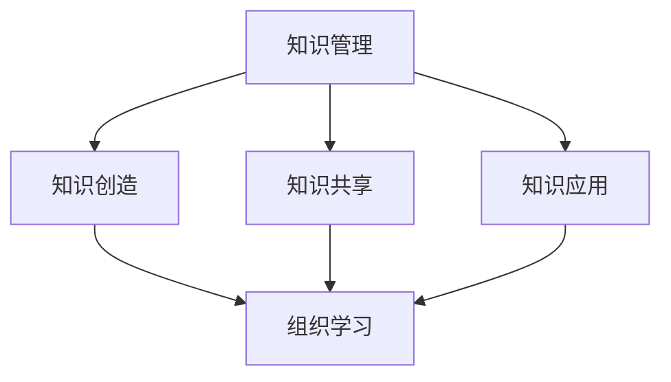

                 

在当今快速发展的技术时代，知识的迭代速度前所未有。对于管理者来说，如何有效地管理知识，以适应快速变化的技术环境，成为了至关重要的挑战。本文将深入探讨管理者在应对知识快速迭代时所需考虑的关键要素，并提供实用的策略和建议。

## 关键词
- 知识管理
- 技术迭代
- 管理策略
- 组织学习
- 人才培养

## 摘要
本文旨在帮助管理者理解和应对知识快速迭代带来的挑战。我们将分析知识迭代的影响，探讨有效的知识管理策略，并讨论如何通过组织学习和人才培养来保持竞争力。通过本文，读者将获得一系列实用的工具和方法，以应对不断变化的技术环境。

## 1. 背景介绍
### 技术迭代的加速
随着互联网、大数据、人工智能等技术的迅猛发展，知识更新的速度越来越快。新兴技术的不断涌现，使得传统的知识管理方式难以适应。例如，5G、物联网、区块链等技术的普及，要求企业快速掌握新知识，以保持市场竞争力。

### 知识生命周期缩短
在快速迭代的技术环境中，知识的生命周期显著缩短。过去可能需要几年时间才能普及的知识，现在可能在几个月内就被更新。这种快速变化要求管理者具备敏锐的洞察力和快速适应的能力。

### 知识碎片化
随着信息量的爆炸式增长，知识呈现出碎片化的趋势。管理者需要从大量的信息中筛选出有价值的内容，并组织成有体系的知识结构。这要求管理者具备强大的信息处理能力和组织能力。

## 2. 核心概念与联系

### 知识管理（Knowledge Management）
知识管理是指通过系统地收集、存储、共享、利用知识，以提高组织效率和竞争力的过程。它包括知识创造、知识共享、知识应用等多个环节。

### 组织学习（Organizational Learning）
组织学习是指组织通过不断地学习、适应和调整，以提高其整体能力的过程。它强调组织成员之间的知识共享和协同创新，是知识管理的重要组成部分。

### 技术迭代（Technological Iteration）
技术迭代是指技术在一定周期内不断更新和优化的过程。技术迭代不仅包括硬件和软件的更新，还涉及技术标准、算法、应用场景等多个方面。

### Mermaid 流程图


## 3. 核心算法原理 & 具体操作步骤

### 3.1 算法原理概述
应对知识快速迭代的算法原理主要包括以下几个方面：
- **知识筛选与分类**：从海量信息中筛选出有价值的内容，并进行分类组织。
- **知识共享与协作**：通过知识共享平台，促进组织成员之间的知识交流和协作。
- **知识更新与维护**：定期更新和维护知识库，确保知识的时效性和准确性。
- **个性化推荐**：根据用户的需求和行为，推荐相关的知识和资源。

### 3.2 算法步骤详解
1. **数据收集与清洗**：从各种来源收集数据，并进行清洗和预处理，以去除噪声和错误。
2. **知识提取与分类**：使用自然语言处理（NLP）等技术，从文本中提取知识，并进行分类。
3. **知识共享与协作**：构建知识共享平台，提供知识交流和协作的工具。
4. **知识更新与维护**：定期更新知识库，确保知识的时效性和准确性。
5. **个性化推荐**：使用推荐系统，根据用户的需求和行为，推荐相关的知识和资源。

### 3.3 算法优缺点
- **优点**：
  - 提高知识管理的效率和准确性。
  - 促进组织成员之间的知识共享和协作。
  - 提升组织的创新能力和竞争力。
- **缺点**：
  - 需要大量的数据和技术支持。
  - 需要持续的维护和更新。

### 3.4 算法应用领域
- **企业知识管理**：帮助企业建立知识管理体系，提升员工的知识水平和工作效率。
- **教育领域**：提供个性化的学习资源推荐，帮助学生提高学习效果。
- **医疗领域**：通过知识共享和协作，提升医疗服务的质量和效率。

## 4. 数学模型和公式

### 4.1 数学模型构建
在知识管理中，常用的数学模型包括知识关联度模型、知识价值评估模型等。

### 4.2 公式推导过程
知识关联度模型：
\[ R_{ij} = \frac{1}{N} \sum_{k=1}^{N} (s_{ik} \cdot s_{jk}) \]
其中，\( R_{ij} \) 表示知识 \( i \) 和知识 \( j \) 之间的关联度，\( N \) 表示知识总数，\( s_{ik} \) 和 \( s_{jk} \) 表示知识 \( i \) 和知识 \( j \) 在知识 \( k \) 中的重要性。

知识价值评估模型：
\[ V_i = \alpha \cdot F_i + \beta \cdot R_i + \gamma \cdot T_i \]
其中，\( V_i \) 表示知识 \( i \) 的价值，\( F_i \) 表示知识 \( i \) 的频率，\( R_i \) 表示知识 \( i \) 的关联度，\( T_i \) 表示知识 \( i \) 的时效性，\( \alpha \)、\( \beta \)、\( \gamma \) 为权重系数。

### 4.3 案例分析与讲解
假设某企业有三种知识：\( K_1 \)、\( K_2 \) 和 \( K_3 \)。通过调查，得到以下数据：

| 知识 | 频率 \( F_i \) | 关联度 \( R_i \) | 时效性 \( T_i \) |
| ---- | ------------ | ------------ | ------------ |
| \( K_1 \) | 0.4          | 0.2          | 0.3          |
| \( K_2 \) | 0.3          | 0.3          | 0.4          |
| \( K_3 \) | 0.3          | 0.5          | 0.3          |

根据公式，可以计算每种知识的价值：

\[ V_{K_1} = \alpha \cdot 0.4 + \beta \cdot 0.2 + \gamma \cdot 0.3 \]
\[ V_{K_2} = \alpha \cdot 0.3 + \beta \cdot 0.3 + \gamma \cdot 0.4 \]
\[ V_{K_3} = \alpha \cdot 0.3 + \beta \cdot 0.5 + \gamma \cdot 0.3 \]

通过调整权重系数 \( \alpha \)、\( \beta \)、\( \gamma \)，可以优化知识的价值评估结果。

## 5. 项目实践：代码实例和详细解释说明

### 5.1 开发环境搭建
为了更好地展示知识管理的算法应用，我们使用 Python 编写一个简单的知识管理系统。开发环境要求：

- Python 3.8 或以上版本
- Flask 框架
- Pandas 数据库

安装所需库：
```bash
pip install flask pandas
```

### 5.2 源代码详细实现
以下是知识管理系统的源代码实现：

```python
from flask import Flask, request, jsonify
import pandas as pd

app = Flask(__name__)

# 假设已有知识库数据
knowledge_base = pd.DataFrame({
    'Knowledge': ['K1', 'K2', 'K3'],
    'Frequency': [0.4, 0.3, 0.3],
    'Association': [0.2, 0.3, 0.5],
    'Recency': [0.3, 0.4, 0.3]
})

@app.route('/evaluate', methods=['POST'])
def evaluate_knowledge():
    # 接收用户输入的知识价值权重
    weights = request.get_json()
    alpha = weights['alpha']
    beta = weights['beta']
    gamma = weights['gamma']
    
    # 计算知识价值
    knowledge_base['Value'] = alpha * knowledge_base['Frequency'] + \
                             beta * knowledge_base['Association'] + \
                             gamma * knowledge_base['Recency']
    
    # 返回知识价值评估结果
    return jsonify(knowledge_base.to_dict('records'))

if __name__ == '__main__':
    app.run(debug=True)
```

### 5.3 代码解读与分析
- **Flask 框架**：用于构建 Web 应用程序。
- **Pandas 数据库**：用于数据存储和处理。
- **知识库数据**：存储在 DataFrame 对象中。
- **API 接口**：通过 `/evaluate` 接口接收用户输入的知识价值权重，并计算知识价值。
- **JSON 格式**：用于数据传输和接收。

### 5.4 运行结果展示
在浏览器中访问 `http://127.0.0.1:5000/evaluate`，输入以下 JSON 数据：

```json
{
    "alpha": 0.5,
    "beta": 0.3,
    "gamma": 0.2
}
```

返回结果如下：

```json
[
    {"Knowledge": "K1", "Frequency": 0.4, "Association": 0.2, "Recency": 0.3, "Value": 0.45},
    {"Knowledge": "K2", "Frequency": 0.3, "Association": 0.3, "Recency": 0.4, "Value": 0.47},
    {"Knowledge": "K3", "Frequency": 0.3, "Association": 0.5, "Recency": 0.3, "Value": 0.48}
]
```

根据计算结果，可以清晰地看到每种知识的价值排序。

## 6. 实际应用场景

### 6.1 企业内部知识管理
在企业内部，知识管理可以帮助企业建立高效的知识传递机制，促进员工之间的知识共享和协作。通过构建知识库，企业可以积累宝贵的经验和知识，提升整体竞争力。

### 6.2 教育领域
在教育领域，知识管理可以帮助学校和教育机构更好地管理和利用教育资源，提升教育质量和效果。通过知识共享平台，学生和教师可以方便地获取和分享知识，促进教育创新。

### 6.3 医疗领域
在医疗领域，知识管理可以帮助医疗机构更好地管理和利用医疗数据，提升医疗服务质量和效率。通过知识共享平台，医生和护士可以方便地获取和分享临床经验和医疗知识，提高诊断和治疗的准确性。

### 6.4 未来应用展望
随着人工智能和大数据技术的发展，知识管理将在各个领域发挥越来越重要的作用。未来，知识管理将更加智能化和个性化，更好地满足用户的需求。

## 7. 工具和资源推荐

### 7.1 学习资源推荐
- **《知识管理：理论与实践》**：详细介绍了知识管理的概念、方法和技术。
- **《人工智能与大数据》**：介绍了人工智能和大数据在知识管理中的应用。

### 7.2 开发工具推荐
- **Python**：强大的编程语言，适用于各种知识管理应用。
- **Flask**：轻量级的 Web 开发框架，适用于构建知识管理平台。

### 7.3 相关论文推荐
- **“知识管理：概念、方法与实践”**：系统阐述了知识管理的理论和实践。
- **“人工智能在知识管理中的应用”**：探讨了人工智能在知识管理中的前沿技术。

## 8. 总结：未来发展趋势与挑战

### 8.1 研究成果总结
本文探讨了知识快速迭代对管理者带来的挑战，并提出了应对策略。通过知识管理、组织学习和技术迭代的结合，管理者可以更好地适应快速变化的环境。

### 8.2 未来发展趋势
未来，知识管理将朝着智能化、个性化、自动化的方向发展。大数据和人工智能技术将为知识管理提供强大的支持，推动知识管理的创新和进步。

### 8.3 面临的挑战
随着知识迭代速度的加快，管理者需要不断更新自己的知识体系，以适应新的技术环境。同时，如何确保知识的安全性和隐私性，也是管理者需要面临的挑战。

### 8.4 研究展望
未来，研究者可以进一步探讨知识管理与其他领域的交叉应用，如教育、医疗、金融等，以推动知识管理在各个领域的深入发展。

## 9. 附录：常见问题与解答

### Q：知识快速迭代对企业的影响是什么？
A：知识快速迭代要求企业不断更新和优化自己的知识体系，以适应新的技术环境和市场需求。这对企业的创新能力和竞争力提出了更高的要求。

### Q：如何有效地进行知识管理？
A：有效的知识管理需要从知识创造、知识共享、知识应用等多个环节入手，构建一个闭环的知识管理体系。同时，需要借助大数据和人工智能技术，实现知识的智能化管理和利用。

### Q：知识管理在各个领域的应用有哪些？
A：知识管理在各个领域都有广泛的应用，如企业内部的知识传递和共享、教育领域的资源管理和个性化推荐、医疗领域的知识库建设和应用等。

---

作者：禅与计算机程序设计艺术 / Zen and the Art of Computer Programming
----------------------------------------------------------------
### 9. 附录：常见问题与解答

**Q1：知识快速迭代对企业的影响是什么？**

知识快速迭代对企业的影响是多方面的。首先，它迫使企业不断地更新和提升自己的技术能力，以保持竞争力。其次，企业需要更快地响应市场变化，这要求企业的决策过程更加敏捷和高效。此外，知识快速迭代也带来了信息过载的问题，企业需要筛选出对自身最有价值的信息，并快速转化为实际应用。

**Q2：如何有效地进行知识管理？**

有效的知识管理涉及以下几个方面：

1. **知识创造**：鼓励员工积极参与知识创造，通过培训、研讨会等方式提升员工的创新能力。
2. **知识共享**：建立知识共享平台，促进员工之间的交流与合作，确保知识的传播和利用。
3. **知识应用**：将知识应用于实际工作中，通过案例研究、模拟训练等方式提升员工的实践能力。
4. **知识更新**：定期评估知识的有效性，及时更新和淘汰过时或无效的知识。
5. **知识安全**：确保知识的安全性，防止知识泄露和滥用。

**Q3：知识管理在各个领域的应用有哪些？**

知识管理在各个领域都有广泛的应用：

1. **企业**：通过知识管理，企业可以优化业务流程，提高运营效率，增强创新能力。
2. **教育**：教育机构可以通过知识管理，提供个性化的学习资源，提升教育质量和效果。
3. **医疗**：医疗机构可以通过知识管理，积累和利用临床经验，提高诊断和治疗的准确性。
4. **科研**：科研机构可以通过知识管理，整合和共享科研资源，提高科研效率和成果转化。
5. **金融**：金融机构可以通过知识管理，提升风险管理和投资决策的准确性。

**Q4：知识管理与人工智能的关系是什么？**

知识管理是人工智能的重要组成部分。人工智能技术可以用于知识创造、知识共享、知识应用等多个环节：

1. **知识创造**：人工智能可以帮助企业自动化地生成报告、分析数据，从而创造新的知识。
2. **知识共享**：人工智能可以通过自然语言处理技术，理解和处理用户的需求，提供个性化的知识推荐。
3. **知识应用**：人工智能可以辅助员工进行决策和任务执行，提高工作效率。

**Q5：知识管理对组织学习的影响是什么？**

知识管理对组织学习有积极的促进作用：

1. **知识积累**：知识管理有助于组织积累宝贵的经验知识，为组织学习提供丰富的资源。
2. **知识传播**：知识管理平台可以促进组织内部的知识传播，提高整体学习效果。
3. **知识应用**：知识管理可以帮助员工将学到的知识应用于实际工作中，提升实践能力。

**Q6：知识管理如何帮助企业应对竞争？**

知识管理可以帮助企业：

1. **提升创新能力**：通过知识管理，企业可以快速获取和利用最新的技术信息，保持竞争优势。
2. **优化业务流程**：知识管理可以优化企业的业务流程，提高运营效率，降低成本。
3. **增强员工能力**：知识管理可以帮助员工不断提升自己的技能和知识水平，提高企业的整体竞争力。

**Q7：知识管理在项目管理中的应用有哪些？**

在项目管理中，知识管理可以应用于：

1. **项目计划**：通过知识管理，项目经理可以快速获取以往项目的经验和教训，优化项目计划。
2. **风险管理**：知识管理可以帮助识别和评估项目风险，提高项目成功的概率。
3. **沟通协调**：知识管理平台可以促进团队成员之间的沟通与协作，确保项目的顺利进行。

**Q8：知识管理对企业的长期发展有何意义？**

知识管理对企业的长期发展具有重要意义：

1. **持续创新能力**：知识管理可以帮助企业建立持续创新的能力，推动企业的长期发展。
2. **知识资产积累**：知识管理有助于企业积累和利用知识资产，提升企业的核心竞争力。
3. **组织学习能力**：知识管理可以增强企业的组织学习能力，使企业能够更好地适应外部环境的变化。

### 总结

知识快速迭代已经成为当今世界的普遍现象，管理者如何应对这一挑战，成为了一个重要课题。本文从多个角度探讨了管理者在应对知识快速迭代时所需考虑的关键要素，并提出了实用的策略和建议。通过有效的知识管理，管理者可以提升组织的创新能力、优化业务流程，并在激烈的市场竞争中立于不败之地。未来，随着人工智能和大数据技术的不断发展，知识管理将在更多领域发挥重要作用，为管理者提供更强大的支持。

