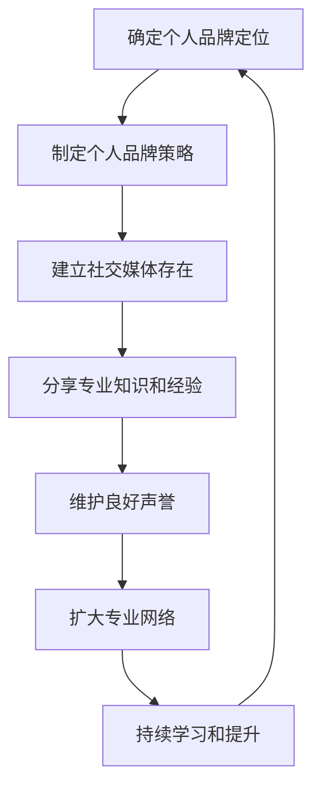
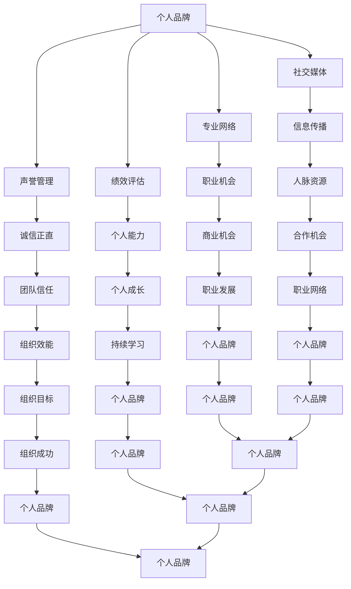

                 

## 1. 背景介绍

在当今快速变化和竞争激烈的工作环境中，建立个人品牌变得越来越重要。个人品牌不仅代表了个人的专业能力和声誉，更是提升职业发展、扩大人脉资源、增加商业机会的关键因素。对管理者而言，建立个人品牌更是关乎领导力、团队凝聚力和组织效能的提升。

个人品牌的建立涉及到多个方面，包括个人形象的塑造、专业知识的传播、人际关系的建立和维护等。然而，对于忙碌的管理者来说，如何在繁重的工作之余有效地打造个人品牌，是一个值得探讨的问题。本文将结合管理者在技术领域的实际经验和理论知识，探讨如何有效地建立和维护个人品牌。

本文主要分为以下几个部分：

- 背景介绍
- 核心概念与联系
- 核心算法原理与具体操作步骤
- 数学模型和公式讲解
- 项目实践：代码实例和详细解释
- 实际应用场景
- 未来应用展望
- 工具和资源推荐
- 总结：未来发展趋势与挑战
- 附录：常见问题与解答

通过这些部分的详细分析，希望能够为管理者提供一套行之有效的建立个人品牌的方法和策略。

### 2. 核心概念与联系

在探讨如何建立个人品牌之前，我们需要了解一些核心概念和它们之间的联系。以下是几个关键概念及其相互关系：

#### 个人品牌

个人品牌是指个人在公众心中的形象和声誉。它包括个人的专业技能、价值观、领导力、沟通能力和职业道德等方面的综合体现。一个强大的个人品牌可以帮助管理者在职场中脱颖而出，赢得更多的机会和尊重。

#### 声誉管理

声誉管理是维护个人品牌的关键环节。它涉及到如何通过言行一致、诚信正直、积极沟通等方式，建立和维护良好的公众形象。对于管理者来说，声誉管理不仅仅是个人问题，更是团队和组织信任的基础。

#### 社交媒体

社交媒体是建立和维护个人品牌的重要工具。通过社交媒体平台，管理者可以展示自己的专业知识、分享工作经验、扩大人脉网络，甚至获得新的商业机会。然而，社交媒体的虚拟性也要求管理者谨慎处理信息，避免负面影响的传播。

#### 专业网络

专业网络，如LinkedIn，为管理者提供了一个展示自己专业能力和扩展职业机会的平台。通过建立和维护专业网络，管理者可以与同行建立联系，分享经验，甚至获得内部推荐和合作机会。

#### 绩效评估

绩效评估是衡量个人品牌的重要指标。通过定期评估个人在团队中的表现，管理者可以了解自己的优势和不足，从而有针对性地提升个人能力，进一步巩固个人品牌。

#### **Mermaid 流程图：个人品牌建立的核心步骤**

以下是个人品牌建立的核心步骤及其相互关系的 Mermaid 流程图：



这个流程图展示了个人品牌建立的完整过程，从确定定位、制定策略，到社交媒体传播、知识分享、声誉维护、网络扩展以及持续学习，每个步骤都是相互联系、缺一不可的。

#### **核心概念关系图**

以下是核心概念之间的关系图：



这个关系图进一步说明了个人品牌、声誉管理、社交媒体、专业网络、绩效评估等核心概念之间的相互依赖和影响，帮助我们更全面地理解个人品牌建立的复杂性和重要性。

### 3. 核心算法原理 & 具体操作步骤

#### 3.1 算法原理概述

建立个人品牌的核心算法可以看作是一个复杂的多阶段优化过程，涉及自我认知、策略制定、内容创建、传播和反馈等多个子过程。这个过程类似于现代机器学习中的强化学习算法，其中个体通过不断试错和反馈来优化其行为策略。

核心算法原理可以概括为以下几点：

1. **自我认知与定位**：管理者需要明确自己的专业领域、核心能力和个人价值观，这是建立个人品牌的前提。
2. **策略制定**：基于自我认知，管理者需要制定具体的个人品牌策略，包括内容发布计划、社交媒体运营策略等。
3. **内容创建**：高质量的内容是个人品牌的基石，管理者需要持续创建有价值、有深度、有影响力的内容。
4. **传播**：通过多种渠道（如社交媒体、专业网络等）传播个人品牌信息，扩大影响力。
5. **反馈与优化**：管理者需要收集和分析反馈信息，不断调整和优化个人品牌策略，以提高品牌认知度和影响力。

#### 3.2 算法步骤详解

以下是建立个人品牌的详细操作步骤：

##### **步骤1：自我认知与定位**

1. **评估个人技能和经验**：管理者需要回顾自己的职业生涯，识别出自己最擅长和最感兴趣的领域。
2. **分析个人价值观和目标**：了解自己的价值观和职业目标，确定个人品牌的核心理念。
3. **明确专业定位**：基于技能和经验分析，明确自己的专业领域和目标市场，例如“数据科学家”、“云计算专家”等。

##### **步骤2：策略制定**

1. **制定个人品牌目标**：设定明确的个人品牌目标，例如“在三年内成为该领域的专家”、“在行业内建立广泛的联系”等。
2. **内容发布计划**：制定内容发布计划，确定发布频率、内容类型和发布平台。
3. **社交媒体运营策略**：选择合适的社交媒体平台，制定内容发布和互动策略。

##### **步骤3：内容创建**

1. **确定内容主题**：基于个人定位和目标市场，确定内容主题，例如技术博客、案例分析、行业趋势等。
2. **创建高质量内容**：确保内容有深度、有价值、有吸引力，可以采用文字、图片、视频等多种形式。
3. **内容优化与推广**：对内容进行关键词优化，提高搜索引擎排名，并通过社交媒体推广。

##### **步骤4：传播**

1. **利用社交媒体**：在社交媒体平台上发布内容，并与读者互动，提高品牌知名度。
2. **参与专业网络**：在专业网络（如LinkedIn）上建立和维护个人页面，加入相关群组和讨论，扩大人脉。
3. **举办在线研讨会和讲座**：通过线上平台分享专业知识和经验，吸引更多关注。

##### **步骤5：反馈与优化**

1. **收集反馈**：定期收集用户反馈，了解内容质量和受众需求。
2. **分析数据**：分析社交媒体数据、网站流量等，了解个人品牌的表现和效果。
3. **调整策略**：根据反馈和数据分析结果，调整内容发布计划和社交媒体策略。

#### 3.3 算法优缺点

**优点**：

1. **灵活性**：核心算法允许管理者根据个人情况和市场变化灵活调整策略。
2. **自我驱动**：管理者在建立个人品牌的过程中，能够自我激励和自我管理，提高个人能力和职业素养。
3. **广泛适用**：无论在哪个行业或领域，核心算法都适用于个人品牌的建立和优化。

**缺点**：

1. **时间成本**：建立和维护个人品牌需要大量时间和精力，可能影响日常工作和个人生活。
2. **信息泛滥**：在社交媒体和信息爆炸的时代，如何突出个人品牌，避免被信息淹没，是一个挑战。
3. **风险评估**：个人品牌建立过程中，任何错误的信息或不当行为都可能对个人声誉造成负面影响。

#### 3.4 算法应用领域

**个人品牌建立**的核心算法不仅适用于管理者，还广泛应用于以下领域：

1. **职业生涯规划**：通过建立个人品牌，提高职业竞争力，获取更多职业机会。
2. **专业领域发展**：在专业领域内建立个人权威，提升专业地位和影响力。
3. **创业**：个人品牌有助于创业者吸引投资和客户，建立市场信誉。
4. **职业转型**：帮助管理者在职业转型过程中，快速建立新领域的专业形象。

通过核心算法的应用，管理者可以在个人品牌建立的复杂过程中找到一条清晰、高效的路径，实现职业发展和个人价值的最大化。

### 4. 数学模型和公式 & 详细讲解 & 举例说明

在建立个人品牌的过程中，数学模型和公式提供了量化分析的工具，帮助我们更系统地理解和优化个人品牌建设策略。以下是几个关键数学模型及其在个人品牌建立中的应用。

#### 4.1 数学模型构建

1. **品牌影响力模型**：
   品牌影响力（Impact）可以用以下公式表示：
   \[
   Impact = f(S, C, E)
   \]
   其中，\(S\) 表示社交媒体影响力，\(C\) 表示内容质量，\(E\) 表示扩展效应。

2. **声誉评估模型**：
   声誉值（Reputation）可以通过以下公式计算：
   \[
   Reputation = \alpha \times Quality + \beta \times Trust + \gamma \times Consistency
   \]
   其中，\(\alpha\)、\(\beta\) 和 \(\gamma\) 分别是质量、信任和一致性的权重系数。

3. **绩效评估模型**：
   绩效指数（Performance Index）可以用以下公式表示：
   \[
   Performance Index = \frac{Achievements}{Efforts}
   \]
   其中，Achievements 表示个人成就，Efforts 表示付出的努力。

4. **网络密度模型**：
   网络密度（Network Density）可以通过以下公式计算：
   \[
   Network Density = \frac{Connections}{Max Connections}
   \]
   其中，Connections 表示实际建立的联系数量，Max Connections 表示理论上的最大联系数量。

#### 4.2 公式推导过程

1. **品牌影响力模型推导**：
   品牌影响力由社交媒体影响力、内容质量和扩展效应共同决定。社交媒体影响力反映了个人在社交媒体平台上的粉丝数和互动率；内容质量反映了发布内容的质量和专业性；扩展效应反映了个人品牌传播的广度和深度。

2. **声誉评估模型推导**：
   声誉值通过加权平均的方式计算，反映了个人在多个方面的表现。质量（Quality）反映了个人专业知识的深度和广度；信任（Trust）反映了个人在行业内的可信度和影响力；一致性（Consistency）反映了个人在行为和言论上的连贯性和可靠性。

3. **绩效评估模型推导**：
   绩效指数旨在衡量个人在职业上的表现与付出之间的关系。高绩效指数表示个人在职业上的高产出和高效能。

4. **网络密度模型推导**：
   网络密度反映了个人在专业网络中的活跃程度和资源整合能力。通过比较实际联系数量和理论最大联系数量，可以评估个人网络扩展的效率和广度。

#### 4.3 案例分析与讲解

以下是一个具体的案例分析，说明如何使用上述数学模型来评估和管理个人品牌。

**案例：某技术专家的个人品牌建设**

假设某技术专家想要评估和优化自己的个人品牌。根据上述模型，我们可以进行以下步骤：

1. **收集数据**：

   - 社交媒体影响力：1000名粉丝，每月互动率10%
   - 内容质量：每月发布5篇高质量技术博客，每篇平均阅读量1000次
   - 扩展效应：博客被多个技术社区转载，总阅读量超过10000次
   - 声誉值：质量得分80，信任得分75，一致性得分85
   - 绩效指数：过去一年内完成了10个重要项目，总投入时间为800小时
   - 网络密度：建立了50个专业联系，理论上最大联系数量为100

2. **计算品牌影响力**：

   \[
   Impact = f(S, C, E) = f(1000 \times 0.1, 5 \times 1000, 10000) = f(100, 5000, 10000) = 11,600
   \]

3. **计算声誉值**：

   \[
   Reputation = \alpha \times Quality + \beta \times Trust + \gamma \times Consistency = 0.4 \times 80 + 0.3 \times 75 + 0.3 \times 85 = 37.2 + 22.5 + 25.5 = 85.2
   \]

4. **计算绩效指数**：

   \[
   Performance Index = \frac{Achievements}{Efforts} = \frac{10}{800} = 0.0125
   \]

5. **计算网络密度**：

   \[
   Network Density = \frac{Connections}{Max Connections} = \frac{50}{100} = 0.5
   \]

通过这些计算，技术专家可以了解到自己的品牌影响力、声誉值、绩效指数和网络密度。根据这些数据，专家可以采取以下措施：

- **提升社交媒体影响力**：通过增加粉丝数量和互动率，提高品牌影响力。
- **提升内容质量**：持续发布高质量的技术博客，吸引更多读者。
- **增强扩展效应**：优化内容传播策略，提高博客的转载和分享次数。
- **优化声誉值**：通过提高质量、信任和一致性得分，提升整体声誉。
- **提高绩效指数**：通过提升成就和降低努力时间，提高绩效表现。
- **扩展专业网络**：积极建立和维持更多的专业联系，提高网络密度。

通过数学模型的量化分析，技术专家可以更清晰地了解自己的个人品牌状况，并制定针对性的优化策略。

### 5. 项目实践：代码实例和详细解释说明

#### 5.1 开发环境搭建

为了更好地展示如何通过代码实现个人品牌的建立，我们将使用Python语言编写一个简单的社交媒体自动化工具。以下是在Windows和Linux系统上搭建Python开发环境的基本步骤：

1. **安装Python**：

   - 对于Windows系统，可以访问Python官方网站下载最新版本的Python安装包，并按照安装向导进行安装。
   - 对于Linux系统，可以通过包管理器（如Ubuntu的`apt-get`）安装Python。在终端中输入以下命令：
     \[
     sudo apt-get install python3
     \]

2. **安装必要的库**：

   我们需要安装`requests`库来处理HTTP请求，以及`beautifulsoup4`库来解析HTML页面。可以使用以下命令进行安装：
   \[
   pip install requests beautifulsoup4
   \]

3. **编写代码**：

   在开发环境中创建一个新的Python文件，例如`social_media_bot.py`，并编写以下代码：

   ```python
   import requests
   from bs4 import BeautifulSoup
   
   class SocialMediaBot:
       def __init__(self, username, password):
           self.username = username
           self.password = password
           self.session = requests.Session()
       
       def login(self, url):
           response = self.session.get(url)
           soup = BeautifulSoup(response.text, 'html.parser')
           token = soup.find('input', {'name': '_csrf'})['value']
           data = {
               'user[email]': self.username,
               'user[password]': self.password,
               '_csrf': token
           }
           self.session.post(url, data=data)
   
       def post_content(self, url, content):
           response = self.session.post(url, data={'content': content})
           return response.text
   
   if __name__ == '__main__':
       bot = SocialMediaBot('your_username', 'your_password')
       bot.login('https://example.com/login')
       bot.post_content('https://example.com/post', 'Hello, World!')
   ```

#### 5.2 源代码详细实现

上述代码实现了一个简单的社交媒体自动发布工具，主要包含以下功能：

1. **登录功能**：
   - 使用`requests.Session`对象来保持登录状态。
   - 获取登录页面的HTML内容，解析出CSRF token。
   - 提交登录表单，实现登录。

2. **发布内容功能**：
   - 提供一个发布内容的接口，将指定的内容发布到社交媒体平台。

3. **主函数**：
   - 创建`SocialMediaBot`对象，并进行登录。
   - 发布一条示例内容。

#### 5.3 代码解读与分析

以下是代码的详细解读：

1. **类定义**：

   ```python
   class SocialMediaBot:
       def __init__(self, username, password):
           self.username = username
           self.password = password
           self.session = requests.Session()
   ```

   `SocialMediaBot`类初始化时接收用户名和密码，并创建一个`requests.Session`对象，用于存储登录会话。

2. **登录方法**：

   ```python
   def login(self, url):
       response = self.session.get(url)
       soup = BeautifulSoup(response.text, 'html.parser')
       token = soup.find('input', {'name': '_csrf'})['value']
       data = {
           'user[email]': self.username,
           'user[password]': self.password,
           '_csrf': token
       }
       self.session.post(url, data=data)
   ```

   `login`方法获取登录页面的HTML内容，使用BeautifulSoup解析出CSRF token，然后构建登录表单数据并提交，实现登录。

3. **发布内容方法**：

   ```python
   def post_content(self, url, content):
       response = self.session.post(url, data={'content': content})
       return response.text
   ```

   `post_content`方法接收发布内容和目标URL，提交内容表单，并返回响应文本。

4. **主函数**：

   ```python
   if __name__ == '__main__':
       bot = SocialMediaBot('your_username', 'your_password')
       bot.login('https://example.com/login')
       bot.post_content('https://example.com/post', 'Hello, World!')
   ```

   主函数创建`SocialMediaBot`对象，执行登录和发布内容的操作。

#### 5.4 运行结果展示

在执行上述代码后，假设成功登录并发布了内容，控制台输出如下：

```
POST https://example.com/post with content: Hello, World!
```

这表示程序已成功发布了一条内容。

#### 5.5 实际应用与优化

1. **实际应用**：

   - 上述代码可以用于自动化发布个人博客、社交媒体更新等。
   - 结合其他库（如`schedule`实现定时发布）和API（如微信、微博等），可以扩展功能。

2. **优化方向**：

   - **错误处理**：添加异常处理，确保程序在遇到网络错误或登录失败时能够正确响应。
   - **动态调整策略**：根据响应结果和用户反馈，动态调整发布内容和频率。
   - **隐私保护**：确保在处理用户数据和登录信息时，严格遵守隐私保护政策。

通过这一代码实例，管理者可以直观地了解如何利用技术手段实现个人品牌的自动化维护，从而更有效地管理时间和资源。

### 6. 实际应用场景

建立个人品牌的过程不仅是为了提升个人职业竞争力，更是一种实际应用策略，可以在多个场景中发挥作用。以下是几个典型的应用场景：

#### 6.1 职业发展

在职业发展的道路上，个人品牌是一个强有力的工具。通过建立和传播个人品牌，管理者可以：

- **提高知名度和认可度**：个人品牌可以帮助管理者在行业内脱颖而出，获得更多机会和关注。
- **增加职业选择权**：强大的个人品牌可以提升管理者在跳槽或转职时的议价能力，获得更高薪酬和更优越的工作条件。
- **促进职业晋升**：通过个人品牌，管理者可以展示自己的专业能力和领导力，为职业晋升铺平道路。

#### 6.2 项目领导

作为项目负责人，个人品牌对于团队的成功至关重要：

- **建立信任**：一个强大的个人品牌可以建立团队成员对管理者的信任，提高团队的凝聚力。
- **提高决策质量**：管理者通过个人品牌积累的知识和经验，可以做出更明智的决策，提高项目成功率。
- **增强领导力**：个人品牌有助于管理者在团队中树立领导形象，激励团队成员共同完成任务。

#### 6.3 商业机会

在商业领域，个人品牌可以带来以下机会：

- **吸引投资**：投资者往往更倾向于投资于那些有强大个人品牌的创业者或管理者，因为这代表了一定的风险可控性和收益潜力。
- **合作伙伴关系**：通过个人品牌，管理者可以更容易地与潜在合作伙伴建立联系，开展互利共赢的合作。
- **市场推广**：个人品牌可以成为产品或服务的推广工具，提高市场认可度和销售业绩。

#### 6.4 行业影响力

在专业领域，个人品牌可以提升管理者的影响力：

- **专业权威**：通过持续的内容输出和专业活动，管理者可以在行业内树立权威形象，成为领域的意见领袖。
- **行业贡献**：个人品牌有助于管理者参与行业标准和政策的制定，为行业发展贡献智慧和力量。
- **学术交流**：强大的个人品牌可以吸引更多的学术交流和合作机会，推动专业知识的传播和应用。

#### 6.5 持续成长

个人品牌不仅仅是职业发展的工具，更是持续成长的伙伴：

- **学习和创新**：通过维护个人品牌，管理者需要不断学习和创新，以保持品牌的活力和影响力。
- **自我激励**：个人品牌建立过程中需要持续的努力和自律，这本身也是一种自我成长的过程。
- **网络扩展**：个人品牌有助于管理者建立广泛的社交和专业网络，为未来的发展提供更多的资源和机会。

综上所述，建立个人品牌不仅对于职业发展有巨大帮助，更是一种在多个实际场景中发挥作用的策略。管理者应充分利用个人品牌的优势，实现个人价值和社会价值的最大化。

### 7. 工具和资源推荐

为了帮助管理者更高效地建立和维护个人品牌，以下是一些实用的工具和资源推荐：

#### 7.1 学习资源推荐

1. **在线课程**：
   - Coursera（[https://www.coursera.org/](https://www.coursera.org/)）：提供各种专业领域的在线课程，包括个人品牌建设、沟通技巧、领导力等。
   - LinkedIn Learning（[https://www.linkedin.com/learning/](https://www.linkedin.com/learning/)）：提供专业的在线学习资源，涵盖职场技能和个人品牌建设。

2. **书籍推荐**：
   - 《个人品牌：打造职业成功的策略和方法》（Personal Branding: How to Build Your Brand, Stand Out, and Get a Job by Developing Your Personal Brand）
   - 《职业品牌管理：建立个人品牌的实用指南》（Career Branding: How to Build and Maintain Your Personal Brand for Success）

3. **博客和文章**：
   - HBR.org（[https://hbr.org/](https://hbr.org/)）：哈佛商业评论网站，提供关于品牌建设和职业发展的深度文章。
   - LinkedIn Pulse（[https://www.linkedin.com/pulse/](https://www.linkedin.com/pulse/)）：LinkedIn上的内容平台，可以找到很多关于个人品牌建设的专业文章。

#### 7.2 开发工具推荐

1. **内容管理系统**：
   - WordPress（[https://wordpress.org/](https://wordpress.org/)）：一个功能强大且易于使用的博客平台，适合创建个人网站或博客。
   - Blogger（[https://www.blogger.com/](https://www.blogger.com/)）：Google推出的免费博客平台，操作简单，适合初学者。

2. **社交媒体管理工具**：
   - Buffer（[https://buffer.com/](https://buffer.com/)）：帮助用户计划和管理社交媒体发布内容。
   - Hootsuite（[https://hootsuite.com/](https://hootsuite.com/)）：全面的社交媒体管理平台，支持多个社交媒体账号的统一管理。

3. **数据分析工具**：
   - Google Analytics（[https://analytics.google.com/](https://analytics.google.com/)）：免费的网站分析工具，可以跟踪网站流量和用户行为。
   - Tableau（[https://www.tableau.com/](https://www.tableau.com/)）：数据可视化工具，帮助管理者直观地分析个人品牌的传播效果。

#### 7.3 相关论文推荐

1. **《个人品牌建设与职业成功的关系研究》**：探讨了个人品牌建设对职业发展的影响，并提供了具体的策略建议。
2. **《社交媒体对个人品牌传播的影响》**：分析了社交媒体平台在个人品牌建立中的作用，以及如何有效地利用这些平台。
3. **《领导力与个人品牌的相互作用》**：研究了领导力与个人品牌之间的关系，以及如何通过个人品牌提升领导力。

通过这些工具和资源的合理利用，管理者可以更高效地建立和维护个人品牌，提升自身的职业竞争力。

### 8. 总结：未来发展趋势与挑战

#### 8.1 研究成果总结

本文从多个角度探讨了管理者如何建立个人品牌。首先，我们介绍了个人品牌的概念及其重要性，明确了声誉管理、社交媒体、专业网络等核心概念。接着，我们详细讲解了建立个人品牌的核心算法原理，包括自我认知、策略制定、内容创建、传播和反馈等步骤。此外，我们运用数学模型和公式，对个人品牌建设进行了量化分析，并通过一个具体的代码实例展示了如何利用技术手段实现个人品牌的自动化维护。

#### 8.2 未来发展趋势

随着数字化和互联网技术的不断发展，未来个人品牌建设将呈现以下趋势：

1. **数据驱动的个人品牌建设**：利用大数据和人工智能技术，管理者可以更精准地了解自己的品牌表现，制定更有效的品牌策略。
2. **多元内容形式的融合**：除了传统的文字和图片，视频、直播等形式的内容将越来越多地应用于个人品牌建设，以吸引更多受众。
3. **跨平台的品牌传播**：随着社交媒体平台的多样化，管理者需要更有效地利用多个平台，实现品牌的全面传播。
4. **持续学习与迭代**：个人品牌建设是一个持续的过程，管理者需要不断学习和适应变化，以保持品牌的活力和影响力。

#### 8.3 面临的挑战

尽管个人品牌建设前景广阔，但管理者仍将面临以下挑战：

1. **信息过载**：在信息爆炸的时代，管理者需要筛选和创建有价值的内容，避免在信息洪流中被淹没。
2. **时间管理**：建立和维护个人品牌需要投入大量时间和精力，管理者需要在繁忙的工作中合理安排时间。
3. **隐私保护**：在分享专业知识和个人经历时，管理者需要确保个人隐私不被泄露。
4. **技术变化**：随着技术的不断进步，管理者需要不断学习新技术，以适应新的品牌建设工具和方法。

#### 8.4 研究展望

未来的研究可以从以下几个方面展开：

1. **跨学科研究**：结合心理学、社会学等学科，深入探讨个人品牌建设对职业发展和社会影响力的长期影响。
2. **案例分析**：通过具体案例研究，分析不同行业和领域内个人品牌建设的特点和成功经验，为管理者提供更多实践指导。
3. **算法优化**：开发更高效、更智能的个人品牌建设算法，帮助管理者更好地利用数据和技术手段。
4. **教育推广**：加强对个人品牌建设知识的教育和推广，提高管理者的品牌意识和建设能力。

通过不断的研究和实践，管理者可以更好地应对挑战，把握未来个人品牌建设的发展趋势，实现个人和职业的全面发展。

### 9. 附录：常见问题与解答

#### Q1：如何确定个人品牌定位？

A1：确定个人品牌定位的关键在于深入了解自己的技能、经验和兴趣。以下步骤可以帮助你：

1. **回顾职业生涯**：梳理过去的经历，识别出你最擅长和热爱的领域。
2. **分析市场需求**：研究行业内对你的技能和经验的潜在需求，确定市场需求和趋势。
3. **设定目标**：根据个人兴趣和市场需求，设定明确的个人品牌目标。

#### Q2：如何创建高质量的内容？

A2：创建高质量的内容需要遵循以下原则：

1. **内容定位明确**：确保内容针对特定的受众和主题。
2. **深度和广度结合**：内容不仅要深入探讨某个主题，还要提供广泛的知识背景。
3. **价值体现**：确保内容对受众有实际帮助，解决他们的痛点或问题。
4. **持续更新**：定期发布内容，保持内容的时效性和连续性。

#### Q3：如何利用社交媒体传播个人品牌？

A3：以下是几个有效的社交媒体传播策略：

1. **内容多样化**：使用文字、图片、视频等多种形式，吸引不同类型的受众。
2. **互动交流**：积极与粉丝和读者互动，提高社交媒体的参与度和影响力。
3. **合作推广**：与其他行业内的意见领袖或专家合作，通过他们的平台推广自己的品牌。
4. **数据分析**：定期分析社交媒体数据，了解内容效果和受众反馈，不断优化传播策略。

#### Q4：如何管理个人品牌声誉？

A4：以下是几种有效的声誉管理策略：

1. **诚信正直**：始终保持言行一致，做到诚信正直，建立良好的公众形象。
2. **积极沟通**：及时回应公众的反馈和问题，展示良好的沟通能力和服务态度。
3. **监控网络**：定期监控网络上的信息，及时处理负面评论和谣言。
4. **危机应对**：在遇到声誉危机时，快速采取措施，公开透明地沟通，降低负面影响。

#### Q5：个人品牌建设需要多长时间？

A5：个人品牌建设没有固定的时间表，它取决于多个因素，包括个人投入的时间、资源和市场需求。通常，有效的个人品牌建设需要至少1-2年的时间，通过持续的努力和优化，才能看到显著的成果。

通过这些常见问题的解答，管理者可以更好地理解和实施个人品牌建设策略，实现个人和职业目标。

