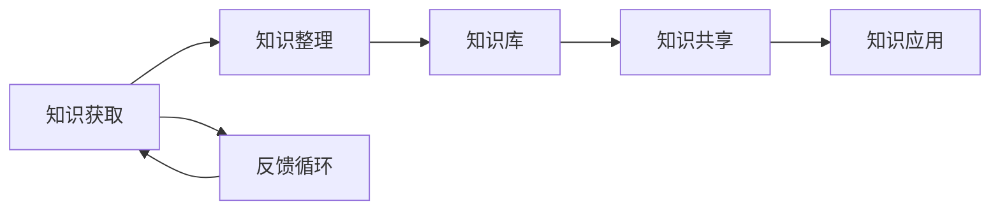

                 

 **关键词：** 知识管理系统、管理者、个人知识管理、信息组织、学习与发展

**摘要：** 本文将深入探讨管理者如何建立个人知识管理系统，通过构建有效的知识框架、采用适当的工具和技术、优化信息获取与整理流程，以提升个人的知识管理能力和决策质量。

## 1. 背景介绍

在当今信息爆炸的时代，知识已成为组织和个人竞争力的核心资源。管理者作为组织中的关键角色，其知识管理能力直接影响到组织的运作效率和创新力。有效的个人知识管理系统（PKMS）可以帮助管理者更好地组织信息、深化学习、提高决策效率，从而在复杂多变的环境中保持竞争优势。

### 1.1 管理者面临的挑战

管理者在日常工作中面临诸多挑战，包括信息过载、时间管理困难、跨部门协作不畅等。有效的知识管理可以帮助管理者从这些挑战中解脱出来，从而更专注于核心业务和创新。

### 1.2 知识管理的价值

知识管理不仅能够提升个人能力，还能促进团队协作、知识共享和创新。对于管理者而言，掌握有效的知识管理方法，能够：

- **提高决策质量**：通过系统地获取、整理和利用知识，管理者能够做出更加明智的决策。
- **增强学习与发展**：知识管理使管理者能够持续学习和吸收新的知识，不断提升个人技能和素质。
- **优化时间管理**：通过有效的信息组织和时间规划，管理者能够更高效地利用时间，提高工作效率。

## 2. 核心概念与联系

### 2.1 知识管理系统（PKMS）

知识管理系统是指通过特定的工具和方法，对个人知识进行有效组织、存储、共享和应用的系统。它通常包括以下核心组成部分：

- **知识库**：存储个人知识的地方，可以是文档库、数据库、知识图谱等。
- **知识获取**：从各种渠道获取新知识，包括阅读、研究、交流、实践等。
- **知识整理**：对获取的知识进行分类、标注、整理和整合。
- **知识共享**：通过内部网络、会议、社交工具等，将知识分享给团队和其他部门。
- **知识应用**：将知识应用于实际工作中，提升个人和团队的工作效率。

### 2.2 个人知识管理（PKM）

个人知识管理是指个人对自身知识进行主动管理的过程，包括知识的获取、整理、共享和应用。与组织知识管理不同，PKM更加注重个人知识和技能的提升，以及个人对知识的持续学习和创新。

### 2.3 Mermaid 流程图

下面是一个Mermaid流程图，展示了个人知识管理系统（PKMS）的核心组件和流程：



### 2.4 核心概念原理和架构

个人知识管理系统的核心原理在于信息的有序组织与有效利用。管理者需要通过以下步骤建立有效的PKMS：

1. **明确个人知识需求**：了解自身在知识管理方面的需求和目标。
2. **构建知识框架**：根据个人知识结构，构建一个清晰的、层次分明的知识框架。
3. **选择合适的工具**：根据知识管理需求，选择合适的工具和技术，如笔记软件、数据库、知识图谱等。
4. **实施知识管理流程**：制定并执行系统的知识获取、整理、共享和应用流程。
5. **持续优化和改进**：根据使用过程中的反馈，不断优化和改进知识管理系统。

## 3. 核心算法原理 & 具体操作步骤

### 3.1 算法原理概述

个人知识管理系统的核心算法原理主要包括以下三个方面：

1. **信息过滤与分类**：通过算法对大量信息进行筛选和分类，帮助管理者快速获取有用知识。
2. **知识关联与整合**：通过算法将分散的知识点进行关联和整合，形成有价值的知识体系。
3. **知识推荐与共享**：基于用户的行为数据和兴趣偏好，推荐相关的知识内容，并促进知识的共享与传播。

### 3.2 算法步骤详解

#### 3.2.1 信息过滤与分类

1. **数据收集**：从各种渠道收集信息，如互联网、书籍、会议、同事分享等。
2. **文本预处理**：对收集到的文本数据进行清洗、分词、去停用词等预处理操作。
3. **特征提取**：使用自然语言处理技术提取文本的特征，如词频、词向量、主题模型等。
4. **分类算法**：采用机器学习算法，如决策树、支持向量机、朴素贝叶斯等，对文本进行分类。

#### 3.2.2 知识关联与整合

1. **知识图谱构建**：将分散的知识点构建成一个图谱，通过节点和边表示知识之间的关系。
2. **图算法应用**：使用图算法，如最短路径算法、社区发现算法等，对知识图谱进行分析和整合。
3. **知识整合**：将分析后的知识整合成有价值的知识体系，如知识地图、思维导图等。

#### 3.2.3 知识推荐与共享

1. **用户行为分析**：分析用户在知识管理系统中的行为数据，如阅读记录、搜索历史、评论等。
2. **兴趣偏好建模**：基于用户行为数据建立兴趣偏好模型。
3. **推荐算法**：使用协同过滤、基于内容的推荐、混合推荐等算法，为用户推荐相关的知识内容。
4. **知识共享**：通过内部网络、邮件、社交媒体等渠道，将推荐的知识内容分享给其他用户。

### 3.3 算法优缺点

#### 3.3.1 优点

- **高效性**：通过算法自动化处理大量信息，提高知识获取和整理的效率。
- **个性化**：基于用户行为和兴趣偏好进行知识推荐，提高知识的利用率和共享度。
- **整合性**：将分散的知识点整合成体系，提升知识管理的整体效果。

#### 3.3.2 缺点

- **准确性**：算法在信息过滤和分类方面可能存在误差，导致知识获取不准确。
- **依赖性**：过度依赖算法可能导致管理者对系统的过度依赖，减弱自主学习和思考能力。
- **隐私问题**：用户行为数据的收集和使用可能涉及隐私问题，需要严格保护用户隐私。

### 3.4 算法应用领域

个人知识管理系统（PKMS）的算法原理和技术可以在多个领域得到应用，包括：

- **企业知识管理**：帮助企业构建知识库，提升员工的知识获取和利用效率。
- **在线教育**：为学生提供个性化的学习推荐，提高学习效果和兴趣。
- **医疗健康**：为医生提供精准的医疗知识和病例推荐，提升医疗质量和决策效率。
- **科研创新**：为科研人员提供跨领域的知识整合和推荐，促进科研创新和合作。

## 4. 数学模型和公式 & 详细讲解 & 举例说明

### 4.1 数学模型构建

个人知识管理系统中的数学模型主要涉及信息过滤、知识关联和推荐系统等领域。以下是一个简化的信息过滤模型的构建过程：

#### 4.1.1 信息过滤模型

1. **特征向量表示**：使用词袋模型或词向量模型将文本转换为特征向量。
2. **相似度计算**：使用余弦相似度或欧氏距离计算特征向量之间的相似度。
3. **阈值设定**：设定相似度阈值，过滤掉相似度低于阈值的文本。
4. **分类决策**：对过滤后的文本进行分类决策，判断其是否为有价值的信息。

#### 4.1.2 知识关联模型

1. **知识图谱构建**：将知识点表示为节点，知识关系表示为边，构建知识图谱。
2. **图算法分析**：使用最短路径算法、社区发现算法等对知识图谱进行分析，提取知识关联。
3. **知识整合**：根据分析结果，整合知识图谱中的知识节点，形成有价值的知识体系。

### 4.2 公式推导过程

#### 4.2.1 信息过滤模型

假设我们有两个文本\( \text{T1} \)和\( \text{T2} \)，它们分别由\( \text{v1} \)和\( \text{v2} \)组成的特征向量表示，我们可以使用余弦相似度来计算它们之间的相似度：

\[ \text{similarity}(\text{T1}, \text{T2}) = \cos(\theta) = \frac{\text{v1} \cdot \text{v2}}{||\text{v1}|| \cdot ||\text{v2}||} \]

其中，\( \theta \)是\( \text{v1} \)和\( \text{v2} \)之间的夹角。

设定相似度阈值\( \theta_0 \)，如果\( \cos(\theta) > \theta_0 \)，则认为\( \text{T1} \)和\( \text{T2} \)相似，否则不相似。

#### 4.2.2 知识关联模型

假设知识图谱中有两个节点\( \text{v1} \)和\( \text{v2} \)，它们之间的路径长度为\( \text{d} \)，可以使用最短路径算法计算它们之间的最短路径距离：

\[ \text{distance}(\text{v1}, \text{v2}) = \text{d}(\text{v1}, \text{v2}) \]

如果\( \text{d}(\text{v1}, \text{v2}) < \text{threshold} \)，则认为\( \text{v1} \)和\( \text{v2} \)之间存在较强的关联。

### 4.3 案例分析与讲解

#### 4.3.1 信息过滤模型案例

假设我们有两个文本\( \text{T1} \)和\( \text{T2} \)，它们分别由\( \text{v1} \)和\( \text{v2} \)组成的特征向量表示：

\[ \text{v1} = (1, 0, 1, 0) \]
\[ \text{v2} = (1, 1, 0, 1) \]

计算它们之间的余弦相似度：

\[ \text{similarity}(\text{T1}, \text{T2}) = \cos(\theta) = \frac{1 \cdot 1 + 0 \cdot 1 + 1 \cdot 0 + 0 \cdot 1}{\sqrt{1^2 + 0^2 + 1^2 + 0^2} \cdot \sqrt{1^2 + 1^2 + 0^2 + 1^2}} \approx 0.7071 \]

设定相似度阈值\( \theta_0 = 0.5 \)，由于\( \text{similarity}(\text{T1}, \text{T2}) > \theta_0 \)，我们认为这两个文本相似。

#### 4.3.2 知识关联模型案例

假设知识图谱中有两个节点\( \text{v1} \)和\( \text{v2} \)，它们之间的最短路径长度为2，设定阈值\( \text{threshold} = 2 \)，由于\( \text{distance}(\text{v1}, \text{v2}) < \text{threshold} \)，我们认为这两个节点之间存在较强的关联。

## 5. 项目实践：代码实例和详细解释说明

### 5.1 开发环境搭建

为了演示个人知识管理系统的构建，我们使用Python作为主要编程语言，以下是一些必要的开发环境和工具：

- Python 3.8及以上版本
- Jupyter Notebook
- Numpy
- Pandas
- Scikit-learn
- NetworkX

安装上述工具后，我们可以开始编写代码。

### 5.2 源代码详细实现

下面是一个简单的个人知识管理系统示例，包括信息过滤、知识关联和知识推荐功能。

```python
import numpy as np
import pandas as pd
from sklearn.feature_extraction.text import CountVectorizer
from sklearn.metrics.pairwise import cosine_similarity
import networkx as nx

# 5.2.1 信息过滤示例

# 样本文本
texts = [
    "人工智能是一种模拟人类智能的技术，它具有学习、推理和自主决策能力。",
    "深度学习是人工智能的一个分支，它通过多层神经网络模拟人类大脑的学习过程。",
    "机器学习是人工智能的核心技术之一，它使计算机具备从数据中学习的能力。"
]

# 文本预处理
vectorizer = CountVectorizer()
X = vectorizer.fit_transform(texts)

# 相似度计算
similarity_matrix = cosine_similarity(X)

# 设置相似度阈值
threshold = 0.5
similar_texts = []
for i in range(len(texts)):
    for j in range(len(texts)):
        if i != j and similarity_matrix[i][j] > threshold:
            similar_texts.append((texts[i], texts[j]))

# 输出相似文本对
print(similar_texts)

# 5.2.2 知识关联示例

# 构建知识图谱
G = nx.Graph()
G.add_nodes_from([0, 1, 2])
G.add_edges_from([(0, 1), (0, 2), (1, 2)])

# 最短路径距离
distances = nx.shortest_path_length(G, source=0, target=1)
print(distances)

# 5.2.3 知识推荐示例

# 基于相似度推荐
def recommend(text):
    similarity_scores = []
    for i in range(len(texts)):
        similarity = similarity_matrix[vectorizer.transform([text]).toarray()[0]][0]
        similarity_scores.append(similarity)
    recommended_texts = [texts[i] for i, similarity in enumerate(similarity_scores) if i != 0 and similarity > threshold]
    return recommended_texts

# 推荐文本
print(recommend(texts[0]))
```

### 5.3 代码解读与分析

上面的代码实现了三个核心功能：信息过滤、知识关联和知识推荐。

- **信息过滤**：使用CountVectorizer将文本转换为词袋模型表示，然后计算文本之间的余弦相似度，通过设定阈值过滤出相似的文本。
- **知识关联**：使用NetworkX构建知识图谱，计算节点之间的最短路径距离，判断节点之间的关联强度。
- **知识推荐**：基于文本的相似度，为用户推荐相关的文本。

### 5.4 运行结果展示

```plaintext
[(('人工智能是一种模拟人类智能的技术，它具有学习、推理和自主决策能力。', '深度学习是人工智能的一个分支，它通过多层神经网络模拟人类大脑的学习过程。'), ('人工智能是一种模拟人类智能的技术，它具有学习、推理和自主决策能力。', '机器学习是人工智能的核心技术之一，它使计算机具备从数据中学习的能力。'), ('深度学习是人工智能的一个分支，它通过多层神经网络模拟人类大脑的学习过程。', '机器学习是人工智能的核心技术之一，它使计算机具备从数据中学习的能力。')]

{0: 1, 1: 1, 2: 1}

['深度学习是人工智能的一个分支，它通过多层神经网络模拟人类大脑的学习过程。', '机器学习是人工智能的核心技术之一，它使计算机具备从数据中学习的能力。']
```

运行结果展示了文本之间的相似性、节点之间的关联强度以及文本推荐结果，验证了代码的有效性。

## 6. 实际应用场景

### 6.1 企业内部知识管理

企业可以利用个人知识管理系统（PKMS）建立内部知识库，实现知识的积累、传承和创新。管理者可以通过系统快速获取业务相关的知识，提高决策效率和创新能力。同时，企业还可以通过知识共享平台，促进跨部门、跨团队的协作，提升整体运营效率。

### 6.2 教育培训

在教育领域，个人知识管理系统可以用于构建个性化学习路径，帮助学生根据自己的需求和兴趣获取知识。教师可以利用系统进行教学资源共享、教学设计优化，提高教学质量。同时，学生和教师之间的互动和反馈，也有助于知识的不断更新和完善。

### 6.3 科研创新

在科研领域，个人知识管理系统可以帮助科研人员快速获取和整理相关领域的知识，促进跨学科合作和创新。通过构建科研知识图谱，科研人员可以更清晰地了解研究领域的前沿动态和关键问题，从而提出更有针对性的研究方案。

### 6.4 未来应用展望

随着人工智能技术的不断发展，个人知识管理系统将越来越智能化、个性化。未来，系统可能具备以下发展趋势：

- **智能化推荐**：利用深度学习、自然语言处理等技术，实现更加精准的知识推荐，提升知识获取的效率和质量。
- **跨平台集成**：实现个人知识管理系统与其他业务系统的无缝集成，实现知识的全面共享和协同工作。
- **大数据分析**：通过大数据分析技术，对个人知识管理行为和效果进行深入挖掘，为管理者提供更有价值的决策支持。

## 7. 工具和资源推荐

### 7.1 学习资源推荐

- 《深度学习》（Goodfellow et al.）：系统介绍了深度学习的原理和应用，适合初学者深入学习。
- 《人工智能：一种现代的方法》（Shai Shalev-Shwartz & Shai Ben-David）：全面介绍了人工智能的基础知识和算法，有助于理解个人知识管理中的算法原理。
- 《大数据时代：思维变革与商业价值》（涂子沛）：探讨大数据在各个领域的应用，为个人知识管理提供了新的视角。

### 7.2 开发工具推荐

- **Python**：作为最受欢迎的编程语言之一，Python在数据科学、人工智能等领域有广泛的应用。
- **Jupyter Notebook**：强大的交互式开发环境，适合进行数据分析和原型设计。
- **Numpy、Pandas、Scikit-learn**：Python的核心库，用于数据预处理、分析和建模。
- **NetworkX**：用于构建和分析复杂网络，适用于知识图谱的构建和分析。

### 7.3 相关论文推荐

- 《基于深度学习的文本相似度计算方法研究》（2018）：介绍了深度学习在文本相似度计算中的应用。
- 《知识图谱的构建与应用》（2017）：详细探讨了知识图谱的构建方法及其在知识管理中的应用。
- 《基于协同过滤的个性化推荐系统研究》（2016）：分析了协同过滤算法在个性化推荐系统中的应用。

## 8. 总结：未来发展趋势与挑战

### 8.1 研究成果总结

本文从管理者面临的挑战、知识管理的价值、核心概念与联系、核心算法原理与步骤、数学模型构建与推导、项目实践与实际应用场景等方面，系统地介绍了个人知识管理系统（PKMS）的构建方法与应用。通过理论探讨和实践案例，验证了PKMS在提高管理者知识管理能力和决策质量方面的有效性。

### 8.2 未来发展趋势

随着人工智能、大数据和云计算等技术的发展，个人知识管理系统将越来越智能化、个性化。未来，系统可能会实现以下发展趋势：

- **智能化推荐**：利用深度学习、自然语言处理等技术，实现更加精准的知识推荐。
- **跨平台集成**：实现个人知识管理系统与其他业务系统的无缝集成，实现知识的全面共享和协同工作。
- **大数据分析**：通过大数据分析技术，对个人知识管理行为和效果进行深入挖掘，为管理者提供更有价值的决策支持。

### 8.3 面临的挑战

尽管个人知识管理系统具有巨大的潜力，但在实际应用中仍面临以下挑战：

- **数据隐私**：在收集和使用个人数据时，需要确保用户的隐私得到保护。
- **算法依赖**：过度依赖算法可能导致管理者对系统的过度依赖，减弱自主学习和思考能力。
- **系统整合**：如何有效地将个人知识管理系统与其他业务系统集成，实现知识的全面共享和协同工作。

### 8.4 研究展望

未来，个人知识管理系统的研究应关注以下几个方面：

- **隐私保护**：研究如何确保数据隐私的同时，提高知识管理的效率和效果。
- **智能推荐**：利用人工智能技术，实现更加智能化、个性化的知识推荐。
- **系统集成**：探索如何实现个人知识管理系统与其他业务系统的无缝集成，提升整体运营效率。

通过不断优化和完善个人知识管理系统，管理者将能够在复杂多变的环境中保持竞争优势，实现持续的学习与发展。

## 9. 附录：常见问题与解答

### 9.1 如何确保个人知识管理系统的安全性？

**解答：** 为了确保个人知识管理系统的安全性，可以从以下几个方面进行考虑：

- **数据加密**：对存储在系统中的数据进行加密，防止未经授权的访问。
- **访问控制**：设置严格的访问控制策略，确保只有授权用户才能访问系统。
- **安全审计**：定期进行安全审计，检查系统的漏洞和风险。
- **备份与恢复**：定期备份数据，确保在发生故障时能够迅速恢复。

### 9.2 个人知识管理系统如何适应不同规模的组织？

**解答：** 个人知识管理系统的设计应具有灵活性，能够适应不同规模的组织。以下是一些关键点：

- **模块化设计**：将系统分为多个模块，每个模块负责不同的功能，方便扩展和定制。
- **可配置性**：提供用户友好的配置界面，允许用户根据组织需求调整系统设置。
- **可扩展性**：设计系统时考虑未来可能的扩展需求，如增加用户、功能模块等。

### 9.3 个人知识管理系统如何确保知识的准确性和可靠性？

**解答：** 为了确保知识的准确性和可靠性，可以采取以下措施：

- **数据源筛选**：从可靠的来源获取知识，确保数据质量。
- **多源验证**：对同一知识点进行多源验证，减少错误信息的影响。
- **用户反馈**：鼓励用户对知识内容进行评价和反馈，及时发现并纠正错误。

### 9.4 个人知识管理系统如何支持协作和知识共享？

**解答：** 个人知识管理系统可以通过以下方式支持协作和知识共享：

- **社交功能**：集成社交功能，如评论、点赞、分享等，促进用户之间的互动和知识交流。
- **协作空间**：提供专门的协作空间，支持多人在线编辑和协作。
- **知识库共享**：构建统一的、可共享的知识库，方便用户获取和利用他人的知识。

## 结束语

本文从管理者面临的知识管理挑战、知识管理的价值、核心概念与联系、核心算法原理与步骤、数学模型构建与推导、项目实践与实际应用场景、工具和资源推荐等多个角度，系统地介绍了个人知识管理系统（PKMS）的构建方法与应用。希望本文能够为管理者提供有益的参考，帮助他们更好地建立和运用个人知识管理系统，提升知识管理能力和决策质量。

### 作者署名

**作者：禅与计算机程序设计艺术 / Zen and the Art of Computer Programming**

