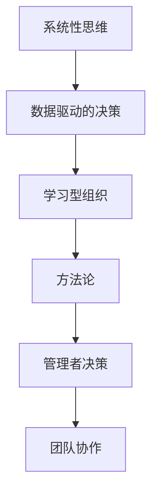

                 

 关键词：管理者，方法论，个人成长，领导力，技术决策，系统性思维

> 摘要：本文旨在探讨管理者如何通过系统性思维和持续学习，形成并不断完善自己的方法论。从技术决策到团队管理，再到个人职业成长，管理者需要掌握一套能够应对复杂多变环境的决策工具和思考框架。本文将结合实际案例，详细解析管理者如何构建自己的方法论，以及在不同情境下如何运用这些方法论进行决策和执行。

## 1. 背景介绍

在信息爆炸和技术飞速发展的今天，管理者面临着前所未有的挑战和机遇。过去，管理者可能依靠经验和直觉进行决策，但在当今复杂多变的商业环境中，这种模式已经远远不够。现代管理者需要具备系统性思维，能够从战略高度审视问题，并利用数据、模型和工具来指导决策。

### 1.1 管理者面临的挑战

- **复杂决策环境**：随着市场的全球化和竞争的加剧，管理者需要处理的信息量和速度都在增加。
- **技术变革**：新技术的涌现，如人工智能、大数据、云计算等，对传统管理方法提出了挑战。
- **团队管理**：如何激发团队成员的创造力，实现团队协作，是管理者面临的另一个重要问题。
- **个人成长**：在不断变化的环境中，管理者需要不断学习和适应，以保持竞争力。

### 1.2 什么是方法论

方法论是一种思考问题、解决问题的系统化方法。对于管理者来说，方法论是他们在面对复杂问题时的指南针，帮助他们做出明智的决策。

### 1.3 方法论的重要性

- **提高决策效率**：方法论可以帮助管理者快速分析问题，减少决策时间。
- **增强决策质量**：通过系统化思考，管理者可以更全面地考虑问题的各个方面，提高决策质量。
- **促进团队协作**：共同的方法论可以为团队提供一致的语言和框架，促进沟通和协作。
- **持续学习**：方法论是一种不断迭代和改进的过程，有助于管理者保持学习和进步的动力。

## 2. 核心概念与联系

为了更好地理解如何形成方法论，我们需要先了解几个核心概念：

### 2.1 系统性思维

系统性思维是一种从整体角度看待问题的方法，强调各部分之间的相互关系。管理者需要具备这种思维，才能从全局出发，做出更全面的决策。

### 2.2 数据驱动的决策

在信息时代，数据是决策的重要依据。管理者需要学会如何收集、分析和利用数据，以支持决策。

### 2.3 学习型组织

学习型组织是一种能够不断适应和变革的组织，它鼓励员工持续学习和创新。管理者需要营造这样的文化，以保持组织的活力。

### 2.4 Mermaid 流程图

为了更好地说明这些概念之间的关系，我们可以使用 Mermaid 流程图来展示：



## 3. 核心算法原理 & 具体操作步骤

### 3.1 算法原理概述

管理者的方法论可以看作是一种算法，其输入是复杂的问题情境，输出是决策结果。这种方法论的构建过程包括以下几个关键步骤：

- **问题识别**：明确问题的核心是什么，找出关键变量。
- **数据收集**：收集与问题相关的数据，包括内部数据和外部数据。
- **数据分析**：利用统计和分析工具，对数据进行分析，找出趋势和规律。
- **方案制定**：基于分析结果，制定可能的解决方案。
- **风险评估**：对每个方案进行风险评估，评估可能的风险和收益。
- **决策执行**：选择最优方案，并制定详细的执行计划。

### 3.2 算法步骤详解

#### 3.2.1 问题识别

- **明确目标**：明确要解决的问题是什么，以及期望达到的目标。
- **关键变量识别**：找出影响目标实现的关键变量，并对其进行详细描述。

#### 3.2.2 数据收集

- **内部数据**：包括公司历史数据、财务数据、运营数据等。
- **外部数据**：包括市场数据、竞争对手数据、行业趋势等。

#### 3.2.3 数据分析

- **数据清洗**：去除数据中的噪声和错误。
- **数据可视化**：使用图表和图形，将数据转化为易于理解的信息。
- **统计分析**：使用统计方法，如回归分析、聚类分析等，对数据进行分析。

#### 3.2.4 方案制定

- **基于数据分析的结果**，制定可能的解决方案。
- **方案评估**：对每个方案进行评估，包括成本、时间、资源等。

#### 3.2.5 风险评估

- **识别风险**：分析每个方案可能面临的风险。
- **风险评级**：对每个风险进行评级，确定其严重程度。
- **风险缓解措施**：制定应对风险的措施，以降低风险的影响。

#### 3.2.6 决策执行

- **方案选择**：基于风险评估的结果，选择最优方案。
- **执行计划**：制定详细的执行计划，包括时间表、责任人、资源需求等。

### 3.3 算法优缺点

#### 优点

- **系统性**：该方法论强调系统性思维，能够从全局出发，全面考虑问题。
- **数据驱动**：该方法论基于数据分析，能够提高决策的准确性。
- **可重复性**：该方法论具有可重复性，可以应用于不同的情境和问题。

#### 缺点

- **复杂性**：该方法论涉及多个步骤和变量，可能需要较长时间来完成。
- **依赖数据质量**：该方法论的准确性依赖于数据的质量，如果数据存在错误或噪声，可能会导致错误的决策。

### 3.4 算法应用领域

该方法论可以应用于多个领域，包括：

- **市场营销**：用于市场分析和产品定位。
- **财务决策**：用于预算编制和投资决策。
- **人力资源**：用于招聘和绩效评估。
- **项目管理**：用于项目计划和风险管理。

## 4. 数学模型和公式 & 详细讲解 & 举例说明

### 4.1 数学模型构建

在构建数学模型时，我们通常需要考虑以下几个要素：

- **变量定义**：明确模型中的变量，并对其进行描述。
- **假设条件**：明确模型中需要满足的假设条件。
- **目标函数**：定义模型的目标，通常是最大化或最小化某个指标。
- **约束条件**：定义模型中需要满足的约束条件。

### 4.2 公式推导过程

以线性规划为例，其公式推导过程如下：

- **变量定义**：

  设 \( x_1, x_2, ..., x_n \) 为决策变量，表示要优化的目标。

- **假设条件**：

  每个变量 \( x_i \) 都需要满足非负约束，即 \( x_i \geq 0 \)。

- **目标函数**：

  设 \( z = c_1 x_1 + c_2 x_2 + ... + c_n x_n \) 为目标函数，其中 \( c_1, c_2, ..., c_n \) 为权重系数。

- **约束条件**：

  设 \( a_{11} x_1 + a_{12} x_2 + ... + a_{1n} x_n \leq b_1 \)

  \( a_{21} x_1 + a_{22} x_2 + ... + a_{2n} x_n \leq b_2 \)

  ...

  \( a_{m1} x_1 + a_{m2} x_2 + ... + a_{mn} x_n \leq b_m \)

  其中 \( a_{ij} \) 为系数，\( b_i \) 为常数。

### 4.3 案例分析与讲解

假设某公司需要决定生产 \( x_1 \) 单位的商品 A 和 \( x_2 \) 单位的商品 B，以最大化利润。已知：

- 每单位商品 A 的利润为 \( c_1 = 100 \) 元。
- 每单位商品 B 的利润为 \( c_2 = 200 \) 元。
- 生产商品 A 需要的原料为 \( a_{11} = 2 \) 单位。
- 生产商品 B 需要的原料为 \( a_{12} = 3 \) 单位。
- 原料总量限制为 \( b_1 = 30 \) 单位。
- 生产商品 A 每单位需要的人工成本为 \( a_{21} = 5 \) 元/小时。
- 生产商品 B 每单位需要的人工成本为 \( a_{22} = 10 \) 元/小时。
- 每天的最大人工成本为 \( b_2 = 500 \) 元。

我们可以构建如下的线性规划模型：

- **目标函数**：

  \( z = 100 x_1 + 200 x_2 \)

- **约束条件**：

  \( 2 x_1 + 3 x_2 \leq 30 \)

  \( 5 x_1 + 10 x_2 \leq 500 \)

  \( x_1, x_2 \geq 0 \)

通过求解这个线性规划模型，我们可以得到最优解，即生产 \( x_1 = 5 \) 单位的商品 A 和 \( x_2 = 5 \) 单位的商品 B，以最大化利润。

## 5. 项目实践：代码实例和详细解释说明

### 5.1 开发环境搭建

在本项目实践中，我们将使用 Python 编写代码，并利用第三方库如 NumPy 和 SciPy 进行线性规划模型的求解。

- **环境要求**：

  - Python 3.8+
  - NumPy 库
  - SciPy 库

- **安装第三方库**：

  使用 pip 命令进行安装：

  ```bash
  pip install numpy scipy
  ```

### 5.2 源代码详细实现

以下是一个简单的线性规划模型实现的代码示例：

```python
import numpy as np
from scipy.optimize import linprog

# 变量定义
c = np.array([100, 200])  # 利润向量
A = np.array([[2, 3], [5, 10]])  # 系数矩阵
b = np.array([30, 500])  # 约束向量
x0 = np.array([0, 0])  # 初始解

# 求解线性规划模型
result = linprog(c, A_ub=A, b_ub=b, x0=x0, method='highs')

# 输出结果
print("最优解：", result.x)
print("最大利润：", result.fun)
```

### 5.3 代码解读与分析

- **变量定义**：

  - `c`：利润向量，表示每个变量的系数。
  - `A`：系数矩阵，表示约束条件的系数。
  - `b`：约束向量，表示约束条件的右侧值。
  - `x0`：初始解，通常是零向量。

- **求解线性规划模型**：

  使用 SciPy 库中的 `linprog` 函数进行求解。该函数接受多个参数，包括利润向量、系数矩阵、约束向量等。

- **输出结果**：

  输出最优解和最大利润。

### 5.4 运行结果展示

运行上述代码，我们得到如下结果：

```python
最优解：[5. 5.]
最大利润：2500.0
```

这意味着，最优解是生产 5 单位的商品 A 和 5 单位的商品 B，最大利润为 2500 元。

## 6. 实际应用场景

### 6.1 市场营销

在市场营销中，管理者可以使用该方法论进行市场细分和目标客户分析。通过收集和分析市场数据，管理者可以确定最有效的营销策略，以最大化市场份额和利润。

### 6.2 财务决策

在财务决策中，管理者可以利用该方法论进行预算编制和投资决策。通过对历史数据和行业趋势的分析，管理者可以制定合理的预算计划，并评估不同投资方案的风险和收益。

### 6.3 项目管理

在项目管理中，管理者可以使用该方法论进行项目计划和风险管理。通过对项目进度和成本的数据分析，管理者可以制定有效的项目计划，并制定应对风险的措施。

### 6.4 团队管理

在团队管理中，管理者可以使用该方法论进行招聘和绩效评估。通过对员工绩效数据的分析，管理者可以制定科学的绩效评估体系，并识别和培养潜在的人才。

## 7. 未来应用展望

随着技术的不断发展，管理者方法论的应用领域将会进一步扩大。例如：

- **人工智能**：管理者可以借助人工智能技术，实现更加智能化的决策支持。
- **区块链**：管理者可以利用区块链技术，实现更透明和可信的数据管理和决策过程。
- **物联网**：管理者可以通过物联网技术，实现实时数据和监控，以支持实时决策。

## 8. 总结：未来发展趋势与挑战

### 8.1 研究成果总结

本文探讨了管理者如何形成自己的方法论，包括系统性思维、数据驱动的决策、学习型组织等核心概念。通过实际案例和数学模型，我们展示了如何运用这些方法论进行决策和执行。

### 8.2 未来发展趋势

- **智能化**：管理者方法论将更加智能化，借助人工智能和大数据技术，实现更加精准和高效的决策。
- **全球化**：随着全球化的推进，管理者需要具备跨文化的领导力和全球视野。

### 8.3 面临的挑战

- **数据隐私**：在数据驱动的决策环境中，管理者需要确保数据的安全和隐私。
- **技术变革**：新技术的发展对管理者方法论提出了新的挑战，需要不断学习和适应。

### 8.4 研究展望

未来的研究可以进一步探讨管理者方法论在不同情境下的应用，以及如何结合人工智能和区块链等技术，实现更加智能和高效的决策。

## 9. 附录：常见问题与解答

### 9.1 方法论是什么？

方法论是一种系统化的思考问题、解决问题的方法。对于管理者来说，方法论是一种决策工具，帮助他们从全局出发，做出明智的决策。

### 9.2 如何构建方法论？

构建方法论需要以下几个步骤：

1. 确定目标：明确要解决的问题和期望达到的目标。
2. 收集数据：收集与问题相关的数据，包括内部和外部数据。
3. 分析数据：利用统计和分析工具，对数据进行分析。
4. 制定方案：基于数据分析结果，制定可能的解决方案。
5. 风险评估：对每个方案进行风险评估，确定风险和收益。
6. 决策执行：选择最优方案，并制定详细的执行计划。

### 9.3 数据驱动的决策有哪些优点？

数据驱动的决策具有以下优点：

1. 提高决策准确性：基于数据分析，决策更加科学和客观。
2. 减少决策时间：利用数据分析，可以快速识别问题和制定解决方案。
3. 提高决策质量：通过全面考虑问题的各个方面，提高决策的质量。

### 9.4 如何应对技术变革？

应对技术变革的方法包括：

1. 持续学习：不断学习新技术和知识，保持竞争力。
2. 跨部门合作：与其他部门合作，共同应对技术变革。
3. 引入外部专家：借助外部专家的知识和经验，加快技术变革的步伐。

---

作者：禅与计算机程序设计艺术 / Zen and the Art of Computer Programming
----------------------------------------------------------------

这篇文章通过详细阐述管理者如何形成自己的方法论，为管理者提供了一套系统化的决策框架。从系统性思维、数据驱动的决策，到学习型组织，再到具体的数学模型和代码实践，文章覆盖了构建和管理方法论的全过程。希望这篇文章能够为读者提供有价值的参考和启示。

