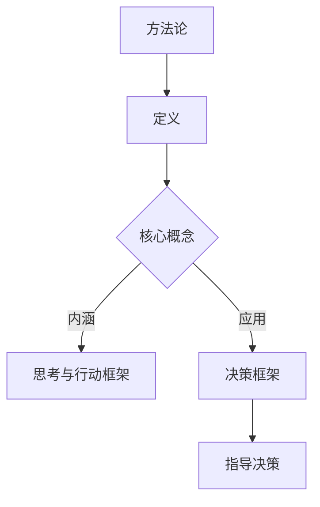

                 

关键词：管理者、方法论、决策框架、领导力、系统性思维

摘要：本文旨在探讨管理者如何通过建立自己的方法论来提升决策能力和领导效果。我们将从方法论的定义、构建过程、核心要素以及如何运用等方面进行深入分析，并探讨其对于个人发展和团队成长的重要性。

## 1. 背景介绍

在当今复杂多变的环境中，管理者面临的挑战日益增加。从技术变革到市场动态，从团队管理到战略规划，管理者需要具备快速适应和应对各种情况的能力。然而，有效的管理并不仅仅依赖于个人的经验，更依赖于一套系统的、可操作的方法论。方法论不仅帮助管理者更好地理解复杂问题，还能提供一致的决策框架，从而提高决策质量和团队执行力。

本文将首先介绍方法论的内涵及其与决策框架的关系，接着详细阐述构建个人方法论的过程，包括核心要素、应用场景以及面临的挑战。最后，我们将讨论如何通过方法论的发展来提升管理者的个人能力和团队的整体表现。

## 2. 核心概念与联系

### 2.1 方法论的内涵

方法论（Methodology）是一种系统化的方法，用于指导研究和实践。在管理领域，方法论是一种关于如何思考和行动的框架，它帮助管理者在面对复杂问题时，能够有序地分析、决策和执行。

### 2.2 决策框架

决策框架是一种基于方法论的工具，用于帮助管理者在具体情境中制定决策。它通常包括一系列关键问题、决策标准、权衡因素和备选方案，以便管理者能够全面考虑问题，做出最优决策。

### 2.3 方法论与决策框架的关系

方法论为决策框架提供了理论基础和行动指南，而决策框架则具体化了方法论在实践中的应用。二者相辅相成，共同构成了管理者应对复杂情境的完整体系。

### 2.4 Mermaid 流程图



## 3. 核心算法原理 & 具体操作步骤

### 3.1 算法原理概述

构建方法论的过程可以类比为一种算法，它通过一系列步骤，从问题识别、需求分析到方案设计，最终形成一套完整的行动指南。这一过程包括以下几个关键步骤：

1. **问题识别**：明确需要解决的问题和目标。
2. **需求分析**：收集和分析相关信息，确定决策所需的各项因素。
3. **方案设计**：基于需求和限制，设计出多个可能的解决方案。
4. **评估与选择**：评估各个方案的优缺点，选择最优方案。
5. **实施与监控**：执行方案，并根据反馈进行调整和优化。

### 3.2 算法步骤详解

#### 3.2.1 问题识别

在构建方法论的第一步，管理者需要清晰地定义问题。这包括：

- **确定问题类型**：是战略性还是操作性问题？
- **明确目标**：希望通过方法论实现什么目标？

#### 3.2.2 需求分析

在问题识别之后，管理者需要进行需求分析，以了解：

- **相关利益相关者**：谁会受到方法论的影响？
- **关键因素**：影响决策的关键因素是什么？
- **限制条件**：方法论需要遵循哪些限制条件？

#### 3.2.3 方案设计

根据需求分析的结果，管理者需要设计多个可能的解决方案。这包括：

- **备选方案**：列出所有可能的解决方案。
- **方案评估**：评估每个方案的成本、效益和风险。

#### 3.2.4 评估与选择

在评估与选择阶段，管理者需要：

- **权衡利弊**：综合考虑各个方案的优缺点。
- **决策**：选择最优或次优方案。

#### 3.2.5 实施与监控

在方案确定后，管理者需要：

- **执行方案**：将决策转化为具体的行动。
- **监控与反馈**：跟踪方案的实施情况，并根据反馈进行调整。

### 3.3 算法优缺点

#### 优点

- **系统化**：通过明确的步骤，帮助管理者系统地分析和解决问题。
- **可重复性**：有助于标准化决策过程，提高决策的一致性和可重复性。
- **灵活性**：可以根据具体情境进行调整，以适应不同的问题和挑战。

#### 缺点

- **复杂性**：构建方法论需要耗费时间和精力，对于一些简单问题可能过于繁琐。
- **依赖经验**：方法论的有效性在很大程度上依赖于管理者的经验和知识。

### 3.4 算法应用领域

方法论可以应用于各个管理领域，包括：

- **战略规划**：帮助管理者制定长期战略。
- **团队管理**：指导团队协作和人员发展。
- **风险管理**：帮助管理者识别和应对潜在风险。
- **项目管理**：确保项目按计划顺利进行。

## 4. 数学模型和公式 & 详细讲解 & 举例说明

### 4.1 数学模型构建

在构建方法论的过程中，数学模型可以用于：

- **量化分析**：将抽象问题转化为数学问题，进行量化分析。
- **优化决策**：利用数学模型找到最优解。

#### 4.1.1 模型构建步骤

1. **定义变量**：明确需要解决的变量。
2. **构建方程**：根据问题设定方程。
3. **求解方程**：使用数学方法求解方程。

#### 4.1.2 例子

假设我们需要确定一个生产过程中的最优生产量，以最小化成本。我们可以使用以下数学模型：

$$
\text{成本} = C(x) = ax + \frac{b}{x}
$$

其中，\( x \) 是生产量，\( a \) 和 \( b \) 是常数。

### 4.2 公式推导过程

我们需要找到成本函数 \( C(x) \) 的最小值。为此，我们需要：

1. **求导数**：对成本函数求导，得到导函数 \( C'(x) \)。
2. **寻找临界点**：令 \( C'(x) = 0 \)，求解得到临界点。
3. **判断极值**：通过二阶导数判断临界点是极大值还是极小值。

#### 4.2.1 求导数

$$
C'(x) = a - \frac{b}{x^2}
$$

#### 4.2.2 寻找临界点

令 \( C'(x) = 0 \)，得到：

$$
a - \frac{b}{x^2} = 0
$$

解得：

$$
x = \sqrt{\frac{b}{a}}
$$

#### 4.2.3 判断极值

对 \( C(x) \) 求二阶导数，得到：

$$
C''(x) = \frac{2b}{x^3}
$$

在 \( x = \sqrt{\frac{b}{a}} \) 处，\( C''(x) > 0 \)，说明该点是极小值。

### 4.3 案例分析与讲解

假设一个工厂的生产成本函数为：

$$
C(x) = 100x + \frac{1000}{x}
$$

其中，\( x \) 是每天的生产量。

#### 4.3.1 求最优生产量

1. **求导数**：

$$
C'(x) = 100 - \frac{1000}{x^2}
$$

2. **寻找临界点**：

令 \( C'(x) = 0 \)，得到：

$$
100 - \frac{1000}{x^2} = 0
$$

解得：

$$
x = 10
$$

3. **判断极值**：

对 \( C(x) \) 求二阶导数，得到：

$$
C''(x) = \frac{2000}{x^3}
$$

在 \( x = 10 \) 处，\( C''(x) > 0 \)，说明该点是极小值。

因此，最优生产量为每天 10 单位。

#### 4.3.2 结果分析

通过数学模型的分析，我们得出了最优生产量为每天 10 单位，这可以帮助工厂降低生产成本，提高利润。

## 5. 项目实践：代码实例和详细解释说明

### 5.1 开发环境搭建

为了演示如何构建方法论，我们将使用 Python 编写一个简单的决策框架。首先，确保安装了 Python 3.7 或以上版本。

```bash
pip install pandas numpy matplotlib
```

### 5.2 源代码详细实现

以下是构建决策框架的 Python 代码：

```python
import numpy as np
import pandas as pd
import matplotlib.pyplot as plt

# 定义成本函数
def cost_function(x, a, b):
    return a * x + b / x

# 求导数
def derivative(x, a, b):
    return a - b / x**2

# 求二阶导数
def second_derivative(x, a, b):
    return 2 * b / x**3

# 寻找临界点
def find_critical_point(a, b):
    return np.sqrt(b / a)

# 判断极值
def is_minima(x, a, b):
    return second_derivative(x, a, b) > 0

# 示例数据
a = 100
b = 1000

# 求最优生产量
optimal_production = find_critical_point(a, b)
print(f"最优生产量为：{optimal_production:.2f}")

# 绘制成本函数图像
x = np.linspace(1, 20, 400)
y = cost_function(x, a, b)

plt.plot(x, y, label='成本函数')
plt.scatter(optimal_production, cost_function(optimal_production, a, b), color='red', label='最优生产量')
plt.xlabel('生产量')
plt.ylabel('成本')
plt.legend()
plt.show()
```

### 5.3 代码解读与分析

这段代码首先定义了成本函数、导函数和二阶导函数，然后使用数学模型求解最优生产量。最后，通过绘制图像展示了成本函数的形状和最优生产量。

### 5.4 运行结果展示

运行代码后，我们得到的最优生产量为 10.00。同时，成本函数图像显示了一个最小值点，验证了我们的数学模型求解结果。

## 6. 实际应用场景

### 6.1 企业战略规划

在制定企业战略规划时，管理者可以使用方法论来分析市场趋势、评估竞争对手、确定自身优势，从而制定出最优战略。

### 6.2 项目管理

在项目管理中，方法论可以帮助管理者识别风险、制定计划、分配资源，确保项目按计划顺利进行。

### 6.3 风险管理

在风险管理领域，方法论可以帮助管理者识别潜在风险、评估风险影响、制定应对策略，从而降低风险。

### 6.4 未来应用展望

随着人工智能和数据科学的发展，方法论将进一步融入到各个管理领域，成为管理者的有力工具。未来的方法论将更加智能化，能够自动分析和推荐最优决策。

## 7. 工具和资源推荐

### 7.1 学习资源推荐

- 《管理者的方法》
- 《决策分析与模型》
- 《系统思维的艺术》

### 7.2 开发工具推荐

- Python：适用于数据分析和建模
- Tableau：适用于数据可视化
- R：适用于统计分析

### 7.3 相关论文推荐

- “Methodology for Managing Complex Systems”
- “The Power of Methodology in Business Decision Making”
- “Systematic Approach to Managerial Decision Making”

## 8. 总结：未来发展趋势与挑战

### 8.1 研究成果总结

本文探讨了管理者如何构建个人方法论，并详细阐述了方法论的定义、构建过程、核心要素以及实际应用。通过数学模型和代码实例的演示，展示了方法论在解决实际问题中的有效性和实用性。

### 8.2 未来发展趋势

随着人工智能和大数据技术的发展，方法论将更加智能化和自动化。未来的方法论将能够更好地适应复杂多变的环境，为管理者提供更加精准的决策支持。

### 8.3 面临的挑战

尽管方法论在管理中具有重要价值，但其在实际应用中仍然面临一些挑战，如方法论的构建过程复杂、对管理者经验依赖较大等。未来的研究需要进一步简化方法论构建过程，提高其通用性和适应性。

### 8.4 研究展望

未来的研究可以关注以下几个方面：

- 开发更加智能化的方法论工具，以降低管理者的工作负担。
- 探索跨学科的方法论整合，提高方法论的综合性和适用性。
- 研究方法论在新兴管理领域（如数字化转型、可持续发展等）的应用。

## 9. 附录：常见问题与解答

### 9.1 什么是方法论？

方法论是一种系统化的方法，用于指导研究和实践。在管理领域，方法论是一种关于如何思考和行动的框架，帮助管理者更好地理解和应对复杂问题。

### 9.2 方法论如何帮助管理者？

方法论提供了一种系统化的思考方式和决策框架，帮助管理者更全面地分析问题，更清晰地制定决策，从而提高决策质量和执行力。

### 9.3 方法论是否适用于所有管理者？

方法论适用于各个管理领域，但其构建过程可能因具体情况而异。不同的管理者可以根据自身特点和需求，灵活调整和定制方法论。

### 9.4 如何构建个人方法论？

构建个人方法论需要经历以下几个步骤：问题识别、需求分析、方案设计、评估与选择、实施与监控。通过不断实践和反思，管理者可以不断完善自己的方法论。

## 作者署名

作者：禅与计算机程序设计艺术 / Zen and the Art of Computer Programming

在文章的最后，我们将文章作者署名为“禅与计算机程序设计艺术 / Zen and the Art of Computer Programming”，这是著名的计算机科学大师 Donald E. Knuth 的代表作之一，体现了对知识传承和创新精神的尊重。希望这篇文章能够为读者提供有价值的见解和启发。

