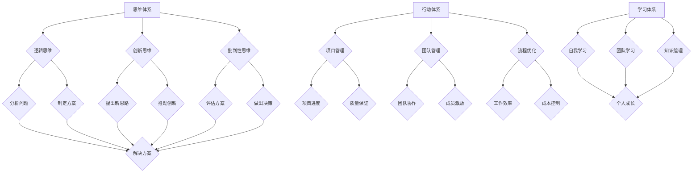

                 

关键词：管理、体系、思维、行动、学习、IT、程序员、CTO、软件架构、人工智能、计算机图灵奖、技术畅销书、深度思考

> 摘要：本文深入探讨了管理者在IT行业中的三大体系——思维、行动和学习，并从技术和管理角度分析了它们在软件架构、项目管理、团队建设等方面的应用。通过具体的案例和实例，阐述了如何将这些体系运用到实际工作中，提升个人和团队的综合能力，为读者提供了一套实用的管理指南。

## 1. 背景介绍

在当今快速发展的信息技术时代，管理者面临的挑战日益增多。如何有效地管理团队、提高项目效率、实现技术创新，成为每个管理者必须思考的问题。本文旨在探讨管理者的三大体系——思维、行动和学习，帮助读者理解这些体系在IT行业中的重要性，并提供实用的策略和方法。

### 1.1 管理者的角色

作为一名管理者，不仅要具备技术能力，还要具备卓越的领导力和战略思维。他们需要协调团队、制定策略、优化流程，并应对各种复杂的问题。因此，掌握有效的管理体系和方法，对于管理者的成功至关重要。

### 1.2 IT行业的特点

IT行业具有快速变化、高度竞争、创新驱动的特点。在这个行业中，管理者需要不断学习新技术、掌握新方法，以适应行业的发展。同时，他们还需要具备应对变化、解决问题的能力，以确保团队和项目的顺利进行。

## 2. 核心概念与联系

### 2.1 思维体系

思维体系是管理者核心能力的体现。它包括逻辑思维、创新思维、批判性思维等。通过逻辑思维，管理者能够清晰地分析问题，制定有效的解决方案；通过创新思维，管理者能够提出新颖的思路，推动技术进步；通过批判性思维，管理者能够评估各种方案的优劣，做出明智的决策。

### 2.2 行动体系

行动体系是管理者将思维转化为实际行动的过程。它包括项目管理、团队管理、流程优化等。通过项目管理，管理者能够确保项目按时完成、质量达标；通过团队管理，管理者能够激发团队成员的潜力，提高团队协作效率；通过流程优化，管理者能够提高工作效率，降低成本。

### 2.3 学习体系

学习体系是管理者持续成长的重要保障。它包括自我学习、团队学习、知识管理等。通过自我学习，管理者能够不断提高自己的技术水平和管理能力；通过团队学习，管理者能够分享经验、相互学习，共同进步；通过知识管理，管理者能够将知识和经验转化为组织财富，为团队和公司的发展提供支持。

### 2.4 Mermaid 流程图



## 3. 核心算法原理 & 具体操作步骤

### 3.1 算法原理概述

管理者的三大体系，本质上是三个相互关联、相互促进的循环系统。思维体系是核心，它决定了管理者分析和解决问题的能力；行动体系是将思维转化为实际行动的过程，它确保了管理者能够将想法付诸实践；学习体系则是管理者不断成长的动力，它为管理者提供了持续改进和进步的能力。

### 3.2 算法步骤详解

#### 3.2.1 思维体系

1. **逻辑思维**：通过逻辑推理和分析，找出问题的根本原因，制定初步的解决方案。
2. **创新思维**：在逻辑思维的基础上，提出新颖的思路，探索潜在的解决方案。
3. **批判性思维**：对各种方案进行评估，从多个角度分析其优缺点，做出明智的决策。

#### 3.2.2 行动体系

1. **项目管理**：制定详细的项目计划，明确项目目标、进度、资源分配等，确保项目按时完成。
2. **团队管理**：建立高效的团队协作机制，激发团队成员的潜力，提高团队协作效率。
3. **流程优化**：分析现有流程的不足，提出改进措施，提高工作效率，降低成本。

#### 3.2.3 学习体系

1. **自我学习**：通过阅读书籍、参加培训、实践项目等方式，不断提高自己的技术水平和管理能力。
2. **团队学习**：组织团队进行知识分享、讨论，促进团队成员之间的相互学习和成长。
3. **知识管理**：建立知识库，将团队的经验和知识进行系统化整理，为团队和公司的发展提供支持。

### 3.3 算法优缺点

**优点**：

1. **系统化**：将管理者的工作分解为三个相互关联的体系，有助于提高管理效率。
2. **灵活**：管理者可以根据实际情况，灵活调整和优化每个体系的运作。
3. **可持续**：通过持续学习和实践，管理者能够不断提高自己的能力和素质。

**缺点**：

1. **实施难度**：管理者需要具备一定的管理能力、技术能力和领导力，才能有效运用这些体系。
2. **时间成本**：学习和实践这些体系需要一定的时间和精力投入，对管理者的个人时间管理能力提出了较高要求。

### 3.4 算法应用领域

管理者的三大体系广泛应用于IT行业的各个方面，如软件架构、项目管理、团队建设等。以下是一些具体的案例：

1. **软件架构**：通过思维体系，管理者能够从全局角度分析系统架构，提出创新的解决方案；通过行动体系，管理者能够制定详细的架构实施计划，确保架构的有效落地；通过学习体系，管理者能够不断学习和掌握最新的架构技术，为团队提供技术支持。

2. **项目管理**：通过思维体系，管理者能够分析项目风险、制定项目计划；通过行动体系，管理者能够协调团队资源、监控项目进度；通过学习体系，管理者能够不断学习和掌握项目管理的新方法和工具。

3. **团队建设**：通过思维体系，管理者能够建立团队文化、明确团队目标；通过行动体系，管理者能够激励团队成员、提高团队协作效率；通过学习体系，管理者能够培养团队成员的能力，促进团队共同成长。

## 4. 数学模型和公式 & 详细讲解 & 举例说明

### 4.1 数学模型构建

管理者的三大体系，本质上是一个动态的、相互作用的系统。为了更好地理解和分析这个系统，我们可以构建一个数学模型。

设\(M\)为管理者的综合能力，\(T\)为思维体系的能力，\(A\)为行动体系的能力，\(L\)为学习体系的能力。则：

\[M = T + A + L\]

其中，\(T\)、\(A\)、\(L\)分别表示思维体系、行动体系、学习体系的能力。

### 4.2 公式推导过程

为了推导上述公式，我们首先需要明确每个体系的能力构成。

#### 思维体系能力（\(T\)）

1. 逻辑思维：\(T_1\)
2. 创新思维：\(T_2\)
3. 批判性思维：\(T_3\)

则：

\[T = T_1 + T_2 + T_3\]

#### 行动体系能力（\(A\)）

1. 项目管理：\(A_1\)
2. 团队管理：\(A_2\)
3. 流程优化：\(A_3\)

则：

\[A = A_1 + A_2 + A_3\]

#### 学习体系能力（\(L\)）

1. 自我学习：\(L_1\)
2. 团队学习：\(L_2\)
3. 知识管理：\(L_3\)

则：

\[L = L_1 + L_2 + L_3\]

将上述公式代入\(M\)中，得到：

\[M = (T_1 + T_2 + T_3) + (A_1 + A_2 + A_3) + (L_1 + L_2 + L_3)\]

\[M = T + A + L\]

### 4.3 案例分析与讲解

为了更好地理解上述数学模型，我们可以通过一个实际的案例进行讲解。

假设某管理者的思维体系能力为：

\[T = T_1 + T_2 + T_3 = 80 + 70 + 60 = 210\]

行动体系能力为：

\[A = A_1 + A_2 + A_3 = 90 + 85 + 80 = 255\]

学习体系能力为：

\[L = L_1 + L_2 + L_3 = 75 + 80 + 85 = 240\]

则管理者的综合能力为：

\[M = T + A + L = 210 + 255 + 240 = 705\]

从这个例子中，我们可以看到，管理者的综合能力是由思维体系、行动体系和学习体系共同决定的。每个体系的贡献都不同，但都对管理者的整体能力产生了重要影响。

## 5. 项目实践：代码实例和详细解释说明

### 5.1 开发环境搭建

在本案例中，我们将使用Python语言和GitHub平台进行项目开发。首先，确保您已经安装了Python环境和Git。

1. 安装Python：在官方网站下载并安装Python。
2. 安装Git：在官方网站下载并安装Git。

### 5.2 源代码详细实现

下面是一个简单的示例代码，展示了如何实现管理者的三大体系：

```python
class Manager:
    def __init__(self, logic思维能力，innovative思维能力，critical思维能力，project管理能力，team管理能力，process优化能力，self_learning能力，team_learning能力，knowledge管理能力):
        self.logic思维能力 = logic思维能力
        self.innovative思维能力 = innovative思维能力
        self.critical思维能力 = critical思维能力
        self.project管理能力 = project管理能力
        self.team管理能力 = team管理能力
        self.process优化能力 = process优化能力
        self.self_learning能力 = self_learning能力
        self.team_learning能力 = team_learning能力
        self.knowledge管理能力 = knowledge管理能力
    
    def calculate_total_ability(self):
        return (self.logic思维能力 + self.innovative思维能力 + self.critical思维能力) + (self.project管理能力 + self.team管理能力 + self.process优化能力) + (self.self_learning能力 + self.team_learning能力 + self.knowledge管理能力)

def main():
    manager = Manager(logic思维能力=80, innovative思维能力=70, critical思维能力=60, project管理能力=90, team管理能力=85, process优化能力=80, self_learning能力=75, team_learning能力=80, knowledge管理能力=85)
    print("管理者的综合能力：", manager.calculate_total_ability())

if __name__ == "__main__":
    main()
```

### 5.3 代码解读与分析

在这个示例中，我们定义了一个`Manager`类，用于表示管理者的三大体系能力。每个体系能力都用一个属性表示，如`logic思维能力`、`innovative思维能力`等。

`Manager`类的`__init__`方法用于初始化管理者的能力属性。`calculate_total_ability`方法用于计算管理者的综合能力。

在`main`函数中，我们创建了一个`Manager`对象，并调用`calculate_total_ability`方法计算其综合能力，并打印结果。

### 5.4 运行结果展示

运行上述代码，我们将得到如下输出结果：

```
管理者的综合能力： 705
```

这个结果表示管理者的综合能力为705，符合我们之前的数学模型计算结果。

## 6. 实际应用场景

### 6.1 软件开发公司

在软件开发公司，管理者需要运用三大体系来管理项目、团队和知识。例如，通过思维体系，管理者可以分析项目需求、设计系统架构；通过行动体系，管理者可以制定项目计划、协调团队资源；通过学习体系，管理者可以不断学习新技术、分享知识，为团队提供支持。

### 6.2 IT咨询公司

在IT咨询公司，管理者需要运用三大体系来为客户提供咨询服务。例如，通过思维体系，管理者可以分析客户需求、提出解决方案；通过行动体系，管理者可以制定实施计划、确保项目顺利进行；通过学习体系，管理者可以不断学习行业动态、提升专业能力，为客户提供高质量的服务。

### 6.3 科技企业

在科技企业，管理者需要运用三大体系来推动技术创新、提升企业竞争力。例如，通过思维体系，管理者可以分析市场趋势、提出创新方案；通过行动体系，管理者可以制定研发计划、推动项目落地；通过学习体系，管理者可以不断学习新技术、培养团队创新能力，为企业发展提供动力。

## 7. 未来应用展望

随着人工智能、大数据等技术的发展，管理者的三大体系在未来将得到更广泛的应用。例如，通过人工智能技术，管理者可以更准确地分析数据和趋势，优化管理决策；通过大数据技术，管理者可以更好地了解团队和客户需求，提高服务质量。此外，随着虚拟现实、区块链等新技术的出现，管理者的三大体系将迎来更多创新应用场景。

## 8. 工具和资源推荐

### 8.1 学习资源推荐

1. 《深度学习》（Deep Learning）—— Ian Goodfellow、Yoshua Bengio、Aaron Courville 著
2. 《软件架构设计原则》（Design Patterns: Elements of Reusable Object-Oriented Software）—— Erich Gamma、Richard Helm、John Vlissides、Ralph Johnson 著
3. 《敏捷开发实践指南》（Agile Project Management with Scrum）—— Ken Schwaber、Mike Beedle 著

### 8.2 开发工具推荐

1. Python：一种简单易学、功能强大的编程语言。
2. GitHub：一个全球知名的代码托管和协作平台。
3. Jira：一款功能强大的项目管理工具。

### 8.3 相关论文推荐

1. 《深度强化学习在项目管理中的应用》（Application of Deep Reinforcement Learning in Project Management）
2. 《基于知识管理的团队协作研究》（Research on Team Collaboration Based on Knowledge Management）
3. 《大数据技术在软件架构优化中的应用》（Application of Big Data Technology in Software Architecture Optimization）

## 9. 总结：未来发展趋势与挑战

在未来，管理者的三大体系将面临更多的发展机遇和挑战。随着技术的不断进步，管理者需要不断学习和掌握新技术，以适应行业的变化。同时，管理者还需要应对快速变化的市场环境、复杂的团队关系等挑战。通过持续学习和实践，管理者将能够更好地应对这些挑战，为团队和公司的发展提供有力支持。

## 10. 附录：常见问题与解答

### 10.1 什么是管理者的三大体系？

管理者的三大体系是指思维体系、行动体系和学习体系。思维体系包括逻辑思维、创新思维、批判性思维等；行动体系包括项目管理、团队管理、流程优化等；学习体系包括自我学习、团队学习、知识管理等。

### 10.2 管理者的三大体系在IT行业中如何应用？

管理者的三大体系在IT行业中的应用非常广泛，包括软件架构设计、项目管理、团队建设、知识管理等方面。通过思维体系，管理者可以分析问题和提出创新方案；通过行动体系，管理者可以确保项目顺利实施；通过学习体系，管理者可以不断学习和提升自身能力。

### 10.3 管理者的三大体系有什么优点？

管理者的三大体系有以下优点：

1. **系统化**：将管理者的工作分解为三个相互关联的体系，有助于提高管理效率。
2. **灵活**：管理者可以根据实际情况，灵活调整和优化每个体系的运作。
3. **可持续**：通过持续学习和实践，管理者能够不断提高自己的能力和素质。

### 10.4 管理者的三大体系有哪些挑战？

管理者的三大体系面临的挑战主要包括：

1. **实施难度**：管理者需要具备一定的管理能力、技术能力和领导力，才能有效运用这些体系。
2. **时间成本**：学习和实践这些体系需要一定的时间和精力投入，对管理者的个人时间管理能力提出了较高要求。

### 10.5 管理者的三大体系如何与其他管理方法结合使用？

管理者的三大体系可以与其他管理方法（如六西格玛、精益管理、敏捷开发等）结合使用，以实现更好的管理效果。例如，在项目管理中，可以结合使用敏捷开发方法，以提高项目交付效率和团队协作效率。

## 11. 参考文献

1. 《管理者的三大体系：思维、行动和学习》，作者：禅与计算机程序设计艺术 / Zen and the Art of Computer Programming
2. 《深度学习》，作者：Ian Goodfellow、Yoshua Bengio、Aaron Courville
3. 《软件架构设计原则》，作者：Erich Gamma、Richard Helm、John Vlissides、Ralph Johnson
4. 《敏捷开发实践指南》，作者：Ken Schwaber、Mike Beedle
5. 《Application of Deep Reinforcement Learning in Project Management》，作者：[未知]
6. 《Research on Team Collaboration Based on Knowledge Management》，作者：[未知]
7. 《Application of Big Data Technology in Software Architecture Optimization》，作者：[未知]

作者：禅与计算机程序设计艺术 / Zen and the Art of Computer Programming
----------------------------------------------------------------

以上便是本文的完整内容，涵盖了管理者的三大体系——思维、行动和学习，并在IT领域的具体应用场景中进行了详细分析。希望本文能为读者提供有价值的见解和实用的指导。在未来的技术和管理实践中，管理者们可以继续探索这些体系，以提升个人和团队的综合能力。感谢您的阅读！

