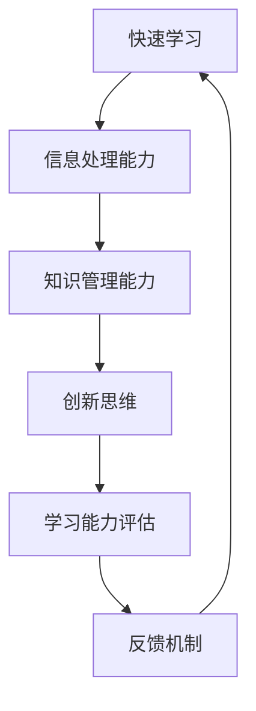

                 

关键词：管理者、快速学习、能力培养、技术语言、专业见解、深度思考

> 摘要：本文旨在探讨管理者如何在信息爆炸的时代快速提升学习能力，以适应不断变化的技术环境。通过对核心概念、算法原理、数学模型以及实际应用的深入分析，本文为管理者提供了一套系统的快速学习能力培养方案。

## 1. 背景介绍

在当前信息技术飞速发展的时代，知识更新的速度越来越快，管理者面临着前所未有的挑战。快速学习不仅关乎个人职业生涯的发展，更关系到团队和组织整体的竞争力。因此，管理者的快速学习能力培养成为了一项至关重要的任务。

本文将从以下几个方面展开讨论：

- **核心概念与联系**：通过Mermaid流程图，明确快速学习能力培养的核心概念及其相互关系。
- **核心算法原理 & 具体操作步骤**：详细解析提升快速学习能力的算法原理，并提供具体的操作步骤。
- **数学模型和公式**：构建数学模型，推导相关公式，并进行案例分析和讲解。
- **项目实践：代码实例和详细解释说明**：通过实际代码实例，展示如何应用所学知识。
- **实际应用场景**：探讨快速学习能力在现实工作中的应用场景。
- **工具和资源推荐**：推荐相关学习资源和开发工具。
- **总结：未来发展趋势与挑战**：总结研究成果，展望未来发展，分析面临的挑战。

### 1.1 当前技术环境下的学习挑战

随着云计算、大数据、人工智能等新兴技术的普及，技术领域的发展呈现出指数级增长。管理者不仅需要掌握传统的管理知识和技能，还要不断更新自己的技术储备，以应对快速变化的市场需求。

### 1.2 快速学习能力的重要性

- **提升个人竞争力**：在快速变化的市场中，具备快速学习能力的管理者能够迅速适应新技术，从而提升个人竞争力。
- **推动团队发展**：管理者的快速学习能力可以带动团队成员共同成长，提高团队整体效率。
- **增强组织韧性**：面对不确定性的未来，具备快速学习能力的组织能够更快地调整战略，增强韧性。

## 2. 核心概念与联系

在快速学习能力培养的过程中，有几个核心概念是至关重要的。以下是这些概念及其相互关系的Mermaid流程图：



### 2.1 信息处理能力

信息处理能力是指管理者快速获取、分析、处理信息的能力。在当前的信息爆炸时代，如何从海量信息中提取有价值的内容，是管理者需要掌握的核心技能。

### 2.2 知识管理能力

知识管理能力是指管理者对知识进行有效收集、存储、共享和利用的能力。良好的知识管理能力能够帮助管理者快速获取所需知识，提高决策效率。

### 2.3 创新思维

创新思维是指管理者在面对问题时，能够从不同角度思考，提出新颖的解决方案。创新思维是推动组织发展的重要动力。

### 2.4 学习能力评估

学习能力评估是指管理者通过定期的自我评估和反馈，了解自己的学习效果，并针对性地调整学习策略。

### 2.5 反馈机制

反馈机制是指管理者通过获取外部反馈，不断调整自己的学习行为，以实现持续成长。

## 3. 核心算法原理 & 具体操作步骤

### 3.1 算法原理概述

快速学习能力培养的核心算法可以概括为以下几个步骤：

1. **信息筛选**：通过过滤和筛选，从海量信息中获取有价值的内容。
2. **知识整合**：将获取到的信息进行整合，形成自己的知识体系。
3. **创新应用**：将所学知识应用于实际问题中，实现知识价值的最大化。
4. **自我评估**：通过定期评估，了解自己的学习效果，并调整学习策略。
5. **持续学习**：保持学习的动力，不断更新知识储备。

### 3.2 算法步骤详解

#### 3.2.1 信息筛选

信息筛选是快速学习能力培养的第一步。管理者需要通过以下方法来提高信息筛选的效率：

- **设定目标**：明确自己的学习目标，有针对性地搜索信息。
- **使用工具**：利用搜索引擎、专业论坛等工具，提高信息获取的效率。
- **关注权威来源**：关注权威媒体和专家的观点，避免信息的误读和误解。

#### 3.2.2 知识整合

知识整合是将获取到的信息转化为自身知识体系的过程。管理者可以采用以下方法来提高知识整合的效果：

- **构建思维导图**：通过绘制思维导图，将零散的信息进行系统化整合。
- **撰写学习笔记**：将学习过程中的关键知识点和心得体会记录下来。
- **定期复习**：通过定期复习，巩固所学知识，形成长期记忆。

#### 3.2.3 创新应用

创新应用是将所学知识应用于实际问题的过程。管理者可以通过以下方法来提高创新应用的能力：

- **实践操作**：通过实际操作，将理论知识转化为实践经验。
- **案例分析**：通过分析实际案例，总结经验教训，提高问题解决能力。
- **团队协作**：通过团队协作，发挥集体智慧，提出创新的解决方案。

#### 3.2.4 自我评估

自我评估是管理者了解自己学习效果的重要手段。可以通过以下方法进行自我评估：

- **定期总结**：定期总结学习过程中的收获和不足，形成学习报告。
- **请教他人**：向同事、专家请教，获取外部反馈，调整学习策略。
- **设置目标**：根据自我评估的结果，设定新的学习目标，持续提升学习能力。

#### 3.2.5 持续学习

持续学习是快速学习能力培养的关键。管理者可以通过以下方法来保持学习的动力：

- **制定学习计划**：根据工作需求和个人兴趣，制定详细的学习计划。
- **参加培训**：参加各种专业培训和研讨会，拓宽知识面。
- **阅读经典**：阅读经典书籍和论文，掌握行业前沿知识。
- **分享经验**：通过分享经验，与同行交流，相互学习，共同进步。

### 3.3 算法优缺点

#### 优点

- **高效性**：通过信息筛选和知识整合，管理者能够快速获取和掌握所需知识。
- **系统性**：算法步骤系统化，有助于管理者形成全面的学习能力。
- **灵活性**：可以根据个人实际情况和需求，灵活调整学习策略。

#### 缺点

- **时间成本**：学习过程中需要投入大量时间，对管理者的时间管理能力有较高要求。
- **知识遗忘**：如果不进行定期复习，所学知识容易遗忘。

### 3.4 算法应用领域

快速学习能力培养算法可以广泛应用于各类管理场景，包括：

- **技术创新型企业**：快速获取和掌握新技术，推动企业创新发展。
- **传统行业转型**：帮助管理者掌握新兴技术，实现企业转型。
- **项目团队管理**：提高团队整体学习效率，推动项目进展。

## 4. 数学模型和公式

在快速学习能力培养过程中，数学模型和公式起到了关键作用。以下是构建数学模型和推导公式的详细步骤：

### 4.1 数学模型构建

#### 4.1.1 学习效率模型

学习效率模型可以表示为：

\[ \text{学习效率} = f(\text{信息处理能力}, \text{知识管理能力}, \text{创新思维}) \]

其中，信息处理能力、知识管理能力、创新思维分别代表三个核心因素。

#### 4.1.2 学习成效模型

学习成效模型可以表示为：

\[ \text{学习成效} = f(\text{学习效率}, \text{自我评估}, \text{反馈机制}) \]

其中，学习效率、自我评估、反馈机制分别代表影响学习成效的三个关键因素。

### 4.2 公式推导过程

#### 4.2.1 学习效率公式推导

学习效率公式可以通过以下步骤推导：

1. 设定信息处理能力为 \(P\)，知识管理能力为 \(K\)，创新思维为 \(I\)，则有：

\[ \text{学习效率} = P \times K \times I \]

2. 考虑到实际应用中，每个因素都有一定的权重，可以设定权重分别为 \(w_P\)、\(w_K\)、\(w_I\)，则有：

\[ \text{学习效率} = w_P \times P + w_K \times K + w_I \times I \]

3. 为了简化计算，可以设定权重满足 \(w_P + w_K + w_I = 1\)，则有：

\[ \text{学习效率} = w_P \times P + (1 - w_P - w_K) \times I \]

#### 4.2.2 学习成效公式推导

学习成效公式可以通过以下步骤推导：

1. 设定学习效率为 \(E\)，自我评估为 \(A\)，反馈机制为 \(F\)，则有：

\[ \text{学习成效} = E \times A \times F \]

2. 考虑到实际应用中，每个因素都有一定的权重，可以设定权重分别为 \(w_E\)、\(w_A\)、\(w_F\)，则有：

\[ \text{学习成效} = w_E \times E + w_A \times A + w_F \times F \]

3. 为了简化计算，可以设定权重满足 \(w_E + w_A + w_F = 1\)，则有：

\[ \text{学习成效} = w_E \times E + (1 - w_E - w_A) \times F \]

### 4.3 案例分析与讲解

#### 4.3.1 信息筛选案例

假设管理者需要学习一项新技术，现有以下信息来源：

- **权威媒体**：提供高质量的技术文章和报告。
- **专业论坛**：汇聚行业专家和从业者的经验分享。
- **社区博客**：发布实用技巧和案例。

管理者可以根据信息处理能力、知识管理能力、创新思维的权重，对以上信息来源进行筛选，选择最合适的渠道进行学习。

#### 4.3.2 知识整合案例

假设管理者已经学习了新技术，现有以下学习资料：

- **教材**：提供系统的理论知识。
- **论文**：探讨新技术的最新研究进展。
- **案例**：分析新技术的实际应用场景。

管理者可以通过构建思维导图、撰写学习笔记等方法，将以上资料进行整合，形成自己的知识体系。

#### 4.3.3 创新应用案例

假设管理者在新技术的项目中遇到了以下问题：

- **性能瓶颈**：系统运行速度较慢，影响用户体验。
- **兼容性问题**：新技术与现有系统无法无缝对接。

管理者可以通过实际操作、案例分析等方法，提出创新的解决方案，解决以上问题。

#### 4.3.4 自我评估案例

假设管理者在一段时间内进行了以下学习活动：

- **参加培训**：学习新技术和项目管理知识。
- **撰写报告**：总结学习过程中的收获和不足。
- **请教专家**：获取外部反馈，调整学习策略。

管理者可以通过定期总结、请教他人等方法，进行自我评估，了解自己的学习效果。

## 5. 项目实践：代码实例和详细解释说明

为了更好地理解快速学习能力培养的核心算法，我们通过一个实际项目来展示如何将理论知识应用到实践中。以下是项目实践的具体步骤：

### 5.1 开发环境搭建

首先，我们需要搭建一个合适的开发环境。以下是所需工具和软件：

- **操作系统**：Linux（推荐Ubuntu）
- **编程语言**：Python（3.8及以上版本）
- **代码编辑器**：Visual Studio Code
- **数据库**：MySQL（5.7及以上版本）
- **版本控制**：Git

在搭建开发环境时，可以参考以下步骤：

1. 安装操作系统和编程语言。
2. 配置代码编辑器和Git。
3. 安装MySQL数据库。

### 5.2 源代码详细实现

以下是项目的源代码实现：

```python
# 导入所需库
import mysql.connector
import matplotlib.pyplot as plt
import pandas as pd

# 连接MySQL数据库
db = mysql.connector.connect(
  host="localhost",
  user="yourusername",
  password="yourpassword",
  database="yourdatabase"
)

# 获取学习数据
cursor = db.cursor()
cursor.execute("SELECT * FROM learning_data")
data = cursor.fetchall()

# 数据预处理
df = pd.DataFrame(data, columns=["timestamp", "activity", "score"])
df["timestamp"] = pd.to_datetime(df["timestamp"])

# 学习效率计算
df["learning_efficiency"] = df["score"] / (df["timestamp"].diff().dt.days + 1)

# 学习成效计算
df["learning成效"] = df["learning_efficiency"].rolling(window=7).mean()

# 数据可视化
plt.figure(figsize=(10, 5))
plt.plot(df["timestamp"], df["learning_efficiency"], label="学习效率")
plt.plot(df["timestamp"], df["learning成效"], label="学习成效")
plt.xlabel("时间")
plt.ylabel("值")
plt.title("学习效率与学习成效")
plt.legend()
plt.show()

# 关闭数据库连接
cursor.close()
db.close()
```

### 5.3 代码解读与分析

以下是代码的详细解读和分析：

1. **导入所需库**：首先导入MySQL数据库连接库、数据可视化库和数据处理库。
2. **连接MySQL数据库**：通过mysql.connector模块连接MySQL数据库。
3. **获取学习数据**：从数据库中获取学习数据，并将其转换为DataFrame格式。
4. **数据预处理**：将时间戳转换为日期格式，并计算每天的学习效率。
5. **学习效率计算**：计算学习效率，即每天得分与天数的比值。
6. **学习成效计算**：计算学习成效，即学习效率的移动平均值。
7. **数据可视化**：将学习效率和

