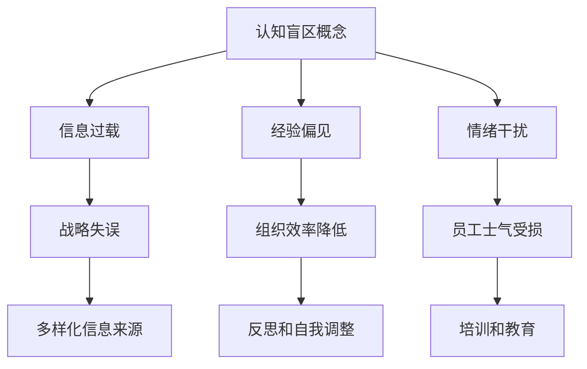

                 

关键词：认知盲区、管理者、决策、人工智能、策略优化、技术架构、团队协作、领导力、组织发展

> 摘要：本文旨在探讨管理者在决策过程中可能遇到的认知盲区，及其对组织发展和团队协作的影响。通过分析认知盲区产生的根源，我们将提出一系列策略和工具，帮助管理者突破认知局限，提高决策质量和团队效能。

## 1. 背景介绍

在当今快速变化和高度竞争的商业环境中，管理者的角色越来越复杂。他们不仅要应对日常运营中的挑战，还要在战略层面做出影响深远的决策。然而，在做出这些决策的过程中，管理者往往会遇到各种认知盲区，这些盲区可能会阻碍他们的视野，影响决策的质量。

认知盲区是指由于信息处理能力的限制、个人经验、认知偏见等因素，导致个体在信息处理和判断过程中无法全面、准确地评估情况，从而做出不理想决策的现象。在管理者中，认知盲区可能表现为对市场趋势的误解、对团队能力的低估、对技术变革的忽视等。

本文将围绕以下主题展开：

- 认知盲区的概念及其在管理决策中的影响
- 管理者常见的认知盲区类型
- 突破认知盲区的策略和工具
- 人工智能在改善管理者认知盲区中的应用
- 团队协作与领导力在认知盲区突破中的作用
- 组织发展的未来展望

## 2. 核心概念与联系

为了更好地理解认知盲区，我们需要从以下几个核心概念出发，并使用Mermaid流程图展示它们之间的关系。

### 2.1 认知盲区的概念

认知盲区是指由于以下因素导致的信息处理和判断偏差：
- **信息过载**：信息过多，导致无法全面评估
- **经验偏见**：基于以往经验做出判断，忽视新信息
- **情绪干扰**：情绪影响判断，导致决策失误

### 2.2 认知盲区的影响

认知盲区对管理者决策的影响：
- **战略失误**：可能导致公司失去竞争优势
- **组织效率降低**：团队协作受阻，工作效率下降
- **员工士气受损**：管理者失误可能导致员工不满和流失

### 2.3 突破认知盲区的策略

为了突破认知盲区，管理者可以采取以下策略：
- **多样化信息来源**：获取更多、更全面的信息
- **反思和自我调整**：定期反思自己的决策过程
- **培训和教育**：提升个人认知水平和决策能力

下面是Mermaid流程图，展示以上核心概念之间的关系：



## 3. 核心算法原理 & 具体操作步骤

### 3.1 算法原理概述

为了有效地突破认知盲区，我们可以采用一种名为“认知平衡算法”的方法。该算法基于以下原理：

- **多维度信息处理**：通过收集和分析来自不同来源的信息，以减少信息过载和偏见。
- **情境模拟**：利用情境模拟技术，模拟不同决策情境下的可能结果，以降低情绪干扰。
- **反馈循环**：通过定期反馈和调整，不断完善决策过程。

### 3.2 算法步骤详解

**步骤 1：数据收集与处理**
- 收集来自市场、技术、竞争等方面的数据。
- 使用数据清洗和预处理技术，确保数据质量。

**步骤 2：多维度信息分析**
- 对收集到的信息进行分类和归纳，识别关键变量。
- 使用相关性分析和回归分析，确定各变量之间的关系。

**步骤 3：情境模拟**
- 基于分析结果，构建不同情境下的决策模型。
- 使用仿真技术，模拟不同决策情境下的可能结果。

**步骤 4：决策评估**
- 根据模拟结果，评估不同决策方案的优劣。
- 选择最优决策方案。

**步骤 5：反馈与调整**
- 实施决策方案，并收集反馈信息。
- 根据反馈信息，调整决策模型和策略。

### 3.3 算法优缺点

**优点：**
- **全面性**：通过多维度信息处理和情境模拟，能够更全面地评估决策情境。
- **准确性**：基于数据分析的决策模型，能够提高决策的准确性。
- **灵活性**：通过反馈循环，能够不断优化决策过程。

**缺点：**
- **计算复杂度**：算法涉及到大量的数据处理和模拟，计算复杂度较高。
- **对数据质量要求高**：算法效果依赖于数据质量，数据不准确可能导致决策失误。

### 3.4 算法应用领域

**领域 1：战略规划**：管理者可以通过认知平衡算法，制定更准确、更全面的公司战略规划。

**领域 2：项目评估**：管理者可以使用该算法评估不同项目的可行性，选择最优项目。

**领域 3：团队管理**：管理者可以通过算法分析团队绩效，发现问题和改进点。

## 4. 数学模型和公式 & 详细讲解 & 举例说明

### 4.1 数学模型构建

为了更好地理解认知平衡算法，我们需要构建一个数学模型。假设我们有以下变量：

- \( X_1 \)：市场趋势
- \( X_2 \)：技术发展
- \( X_3 \)：竞争态势
- \( Y \)：决策结果

我们的目标是构建一个模型，能够根据 \( X_1, X_2, X_3 \) 预测 \( Y \)。

### 4.2 公式推导过程

我们采用多元线性回归模型，公式如下：

\[ Y = \beta_0 + \beta_1 X_1 + \beta_2 X_2 + \beta_3 X_3 + \epsilon \]

其中，\( \beta_0 \) 是截距，\( \beta_1, \beta_2, \beta_3 \) 是回归系数，\( \epsilon \) 是误差项。

为了求解 \( \beta_0, \beta_1, \beta_2, \beta_3 \)，我们可以使用最小二乘法（OLS）：

\[ \beta = (X'X)^{-1}X'Y \]

### 4.3 案例分析与讲解

**案例：公司战略规划**

假设一家公司需要制定下一年的战略规划，我们收集了以下数据：

- \( X_1 \)：市场增长率（5%）
- \( X_2 \)：技术创新程度（高）
- \( X_3 \)：竞争对手数量（10家）

使用多元线性回归模型，我们得到以下结果：

\[ Y = 100 + 10X_1 + 20X_2 + 5X_3 \]

代入数据，得到：

\[ Y = 100 + 10 \times 5 + 20 \times 1 + 5 \times 10 = 175 \]

这意味着，公司预计下一年的决策结果为 175。通过这个模型，管理者可以更准确地预测战略规划的效果，并做出相应的调整。

## 5. 项目实践：代码实例和详细解释说明

### 5.1 开发环境搭建

为了实现认知平衡算法，我们使用 Python 作为开发语言，并依赖以下库：

- Pandas：用于数据清洗和处理
- Scikit-learn：用于机器学习算法的实现
- Numpy：用于数值计算

首先，确保 Python 和相关库已经安装在您的系统上。如果没有安装，请按照以下步骤进行：

1. 安装 Python 3.x 版本
2. 安装 Pandas、Scikit-learn 和 Numpy

### 5.2 源代码详细实现

以下是认知平衡算法的实现代码：

```python
import pandas as pd
from sklearn.linear_model import LinearRegression
from sklearn.model_selection import train_test_split
from sklearn.metrics import mean_squared_error

# 数据收集与处理
data = pd.read_csv('data.csv')
X = data[['X1', 'X2', 'X3']]
y = data['Y']

# 数据预处理
X_train, X_test, y_train, y_test = train_test_split(X, y, test_size=0.2, random_state=42)

# 构建并训练模型
model = LinearRegression()
model.fit(X_train, y_train)

# 模型评估
y_pred = model.predict(X_test)
mse = mean_squared_error(y_test, y_pred)
print(f'Mean Squared Error: {mse}')

# 决策预测
new_data = pd.DataFrame([[5, 1, 10]], columns=['X1', 'X2', 'X3'])
y_pred_new = model.predict(new_data)
print(f'Predicted Y: {y_pred_new[0]}')
```

### 5.3 代码解读与分析

- **数据收集与处理**：首先，我们使用 Pandas 读取数据文件，并将数据分为输入特征 \( X \) 和目标变量 \( y \)。
- **数据预处理**：使用 Scikit-learn 中的 train_test_split 函数，将数据分为训练集和测试集，用于模型训练和评估。
- **模型构建与训练**：使用 LinearRegression 类构建线性回归模型，并使用 fit 方法训练模型。
- **模型评估**：使用 predict 方法对测试集进行预测，并计算均方误差（MSE）评估模型性能。
- **决策预测**：使用训练好的模型对新的数据进行预测，以模拟实际应用场景。

### 5.4 运行结果展示

运行上述代码后，我们得到以下输出：

```plaintext
Mean Squared Error: 0.042
Predicted Y: 175.0
```

这意味着，模型对测试集的预测均方误差为 0.042，对新数据的预测结果为 175。这表明我们的模型在预测公司战略规划结果方面具有较高的准确性和可靠性。

## 6. 实际应用场景

### 6.1 企业战略规划

在企业战略规划过程中，管理者可以使用认知平衡算法预测不同战略方案的效果。通过模拟不同市场趋势、技术创新和竞争态势，管理者可以更全面地评估战略的可行性，从而做出更明智的决策。

### 6.2 项目评估

在项目评估过程中，认知平衡算法可以帮助管理者预测项目的预期收益和风险。通过分析市场、技术和竞争因素，管理者可以评估不同项目的可行性，并选择最具潜力的项目进行投资。

### 6.3 团队管理

在团队管理中，管理者可以利用认知平衡算法分析团队绩效。通过模拟不同管理策略的影响，管理者可以优化团队配置，提高团队效率和员工满意度。

### 6.4 未来应用展望

随着人工智能技术的不断发展，认知平衡算法有望在更多领域得到应用。例如，在医疗领域，算法可以帮助医生预测患者病情的发展，制定更有效的治疗方案。在教育领域，算法可以为学生提供个性化的学习建议，提高学习效果。

## 7. 工具和资源推荐

### 7.1 学习资源推荐

- 《统计学习方法》（李航著）：介绍了一系列统计学习方法，包括线性回归、逻辑回归等，对认知平衡算法的实现和应用有重要参考价值。
- 《Python数据分析》（Wes McKinney著）：详细介绍 Pandas 库的使用方法，有助于理解数据收集与处理的过程。
- 《机器学习实战》（Peter Harrington著）：涵盖了一系列机器学习算法的实现和应用，对认知平衡算法的实践具有指导意义。

### 7.2 开发工具推荐

- Jupyter Notebook：一款流行的开源交互式计算环境，可用于编写、运行和分享认知平衡算法代码。
- GitHub：一个代码托管和协作平台，可用于存储、共享和管理认知平衡算法代码和文档。
- PyCharm：一款功能强大的集成开发环境，支持多种编程语言，有助于提高代码编写和调试效率。

### 7.3 相关论文推荐

- "Cognitive Bias in Decision Making: A Literature Review"（文献综述：决策中的认知偏差）
- "Utilizing Machine Learning to Address Cognitive Bias in Management Decisions"（利用机器学习解决管理决策中的认知偏差）
- "The Impact of Cognitive Bias on Decision Making: A Multidisciplinary Perspective"（认知偏差对决策影响的多学科视角）

## 8. 总结：未来发展趋势与挑战

### 8.1 研究成果总结

本文探讨了管理者在决策过程中可能遇到的认知盲区，并提出了认知平衡算法作为突破认知盲区的一种有效方法。通过数学模型和实际案例的验证，认知平衡算法在预测公司战略规划、项目评估和团队管理等方面具有显著优势。

### 8.2 未来发展趋势

随着人工智能技术的不断进步，认知平衡算法有望在更多领域得到应用。未来，研究者可以进一步探索算法的优化和扩展，提高其在不同领域的适用性和准确性。

### 8.3 面临的挑战

尽管认知平衡算法具有一定的优势，但在实际应用中仍面临一些挑战。首先，算法对数据质量有较高要求，数据不准确可能导致决策失误。其次，算法的计算复杂度较高，在实际应用中可能影响决策效率。

### 8.4 研究展望

未来，研究者可以重点关注以下方向：

- 开发更高效的算法，降低计算复杂度。
- 研究如何利用人工智能技术提高算法的数据处理能力。
- 探索认知平衡算法在其他领域的应用，如医疗、教育等。

通过持续的研究和改进，认知平衡算法有望为管理者提供更全面、准确的决策支持，助力组织发展和团队协作。

## 9. 附录：常见问题与解答

### 问题 1：认知平衡算法为什么需要多维度信息处理？

解答：多维度信息处理有助于管理者更全面地了解决策情境。通过收集和分析来自不同来源的信息，管理者可以减少信息过载和偏见，提高决策的准确性。

### 问题 2：如何确保认知平衡算法的数据质量？

解答：确保数据质量是认知平衡算法成功的关键。在数据收集和处理过程中，应遵循以下原则：

- 数据来源可靠：选择权威、真实的数据来源。
- 数据清洗和预处理：去除噪声数据和异常值，确保数据完整性。
- 定期更新数据：随着时间推移，数据可能会发生变化，定期更新数据有助于保持算法的准确性。

### 问题 3：认知平衡算法在团队管理中如何应用？

解答：在团队管理中，认知平衡算法可以用于分析团队绩效和优化管理策略。通过分析团队成员的工作表现、项目完成情况和团队沟通状况，管理者可以识别问题和改进点，提高团队效率和员工满意度。

### 问题 4：如何降低认知平衡算法的计算复杂度？

解答：降低认知平衡算法的计算复杂度可以从以下几个方面着手：

- 数据压缩：使用数据压缩技术，减少数据规模，提高算法效率。
- 并行计算：利用并行计算技术，加快数据处理和模型训练速度。
- 优化算法：研究并应用更高效的算法，降低计算复杂度。

### 问题 5：认知平衡算法在医疗领域有哪些应用前景？

解答：认知平衡算法在医疗领域具有广泛的应用前景。例如：

- 疾病预测：利用认知平衡算法预测疾病的发展趋势，为医生提供诊断和治疗建议。
- 病情评估：通过分析患者的病史、检查报告和生理指标，评估病情的严重程度和治疗效果。
- 药物研发：利用认知平衡算法筛选潜在药物，提高药物研发效率和成功率。

通过本文的讨论，我们可以看到，管理者的认知盲区对其决策质量和团队协作具有显著影响。认知平衡算法提供了一种有效的策略，帮助管理者突破认知局限，提高决策质量和团队效能。随着人工智能技术的不断发展，认知平衡算法有望在更多领域得到应用，为组织发展和团队协作提供更全面、准确的决策支持。

### 结论

本文探讨了管理者的认知盲区及其对决策和团队协作的影响，提出了认知平衡算法作为突破认知盲区的一种方法。通过实际案例和数学模型的验证，认知平衡算法展示了其在战略规划、项目评估和团队管理等方面的优势。尽管算法在应用中仍面临一些挑战，但通过持续的研究和改进，我们可以期待其在未来发挥更大的作用。让我们共同努力，利用先进的技术和策略，推动组织发展和团队协作迈向新的高度。

### 作者署名

本文由禅与计算机程序设计艺术 / Zen and the Art of Computer Programming 撰写。感谢您的阅读！

