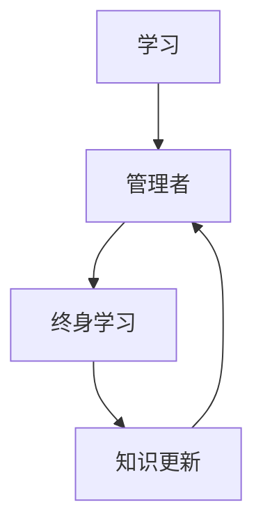

                 

  
## 1. 背景介绍

在当今快速发展的信息技术时代，管理者面临的知识更新速度前所未有。技术的迭代、新工具的涌现、商业模式的变革，都在不断改变企业的运营模式和市场格局。作为一名管理者，如何保持竞争力，持续提升自身的能力，成为了摆在每一个管理者面前的挑战。

首先，让我们来看一组数据。根据麦肯锡全球研究所的报告，全球范围内，技术和自动化每年大约创造12万亿美元的经济价值，而这一数字预计在未来几年内将继续增长。在这样的背景下，管理者不仅需要掌握现有的管理知识和技能，更要具备快速学习新知识的能力，以应对市场的快速变化。

其次，随着知识经济时代的到来，知识的获取和运用已经成为企业竞争力的核心。根据IBM的研究，到2020年，全球数据总量将增长到44ZB，这意味着管理者需要具备处理和分析大量数据的能力。而这样的能力，不是一朝一夕可以培养的，需要通过终身学习不断积累和提升。

最后，随着全球化的加速，管理者面临的挑战变得更加复杂。不同文化背景的员工、全球市场的竞争、多地区运营的管理，都需要管理者具备跨文化管理能力、全球视野和灵活应对变化的能力。这些能力的培养，同样离不开终身学习。

综上所述，管理者终身学习的重要性不言而喻。接下来，我们将深入探讨终身学习的核心概念、方法，以及如何在实际工作中应用这些方法，以帮助管理者不断提升自身的竞争力。

## 2. 核心概念与联系

在探讨管理者终身学习的重要性之前，我们首先需要明确几个核心概念：学习、管理者、终身学习。这些概念之间的关系，可以用以下Mermaid流程图来表示。



### 2.1. 学习

学习是一个持续的过程，它不仅包括知识的获取，还包括知识的消化、应用和创造。在学习的过程中，管理者需要不断地吸收新的知识，更新旧的知识，并将这些知识应用到实际工作中。

### 2.2. 管理者

管理者是负责指导、协调和激励团队，实现企业目标的人员。管理者不仅需要具备管理知识和技能，还需要具备战略思维、领导力和沟通能力。

### 2.3. 终身学习

终身学习是指一个人在整个职业生涯中持续地学习，不断更新知识和技能，以适应不断变化的环境。对于管理者来说，终身学习不仅是一种态度，更是一种必要的生存技能。

### 2.4. 知识更新

知识更新是指随着时间推移，新知识不断涌现，旧知识逐渐过时的过程。在信息技术快速发展的今天，知识更新的速度加快，管理者需要具备快速学习新知识的能力，以保持竞争力。

通过这个流程图，我们可以清晰地看到学习、管理者、终身学习和知识更新之间的紧密联系。学习是基础，管理者是主体，终身学习是方法，知识更新是动力。这些概念相互联系，共同构成了管理者终身学习的重要框架。

### 3. 核心算法原理 & 具体操作步骤

在管理者终身学习的体系中，核心算法原理和方法论是至关重要的。这些算法和步骤不仅帮助管理者理解终身学习的本质，还能在实际操作中提供具体指导。

#### 3.1. 算法原理概述

终身学习算法的基本原理可以概括为：持续学习、知识内化、实践应用和反馈循环。

- **持续学习**：这是终身学习的起点，管理者需要主动寻求新的知识，不断更新自己的知识库。
- **知识内化**：学习的新知识需要通过实践和思考内化为自己的能力，才能真正发挥作用。
- **实践应用**：理论知识只有通过实践才能真正体现其价值。管理者需要将所学知识应用到实际工作中，解决实际问题。
- **反馈循环**：通过实践得到的反馈，可以帮助管理者不断调整学习策略，优化学习效果。

#### 3.2. 算法步骤详解

1. **需求识别**：管理者首先需要识别自身和团队的知识需求。这可以通过定期进行技能评估、阅读行业报告、参与行业会议等方式实现。
2. **学习资源获取**：一旦需求确定，管理者需要寻找合适的学习资源，如专业书籍、在线课程、研讨会等。
3. **知识学习**：管理者需要系统地学习新的知识，并做好笔记和总结。
4. **知识内化**：通过实践和思考，将学习的新知识内化为自己的能力。这可以通过模拟实践、实际操作、案例分析等方式实现。
5. **实践应用**：将内化的知识应用到实际工作中，解决实际问题。
6. **反馈循环**：根据实践反馈，不断调整学习策略，优化学习效果。

#### 3.3. 算法优缺点

**优点**：

- **灵活性**：终身学习算法具有很强的灵活性，可以根据不同的需求和情境进行调整。
- **高效性**：通过反馈循环，可以迅速发现和纠正学习中的问题，提高学习效率。

**缺点**：

- **时间成本**：终身学习需要投入大量的时间和精力，对管理者的自律性和毅力要求较高。
- **资源分散**：由于信息来源广泛，管理者需要花费大量时间筛选和整理有效的学习资源。

#### 3.4. 算法应用领域

终身学习算法可以广泛应用于管理者的各个领域，如战略规划、团队管理、项目管理、技术管理等。特别是在快速变化的市场环境中，终身学习算法能够帮助管理者迅速适应新的挑战，保持竞争优势。

通过上述核心算法原理和具体操作步骤的介绍，我们可以看到，管理者终身学习并不是一项简单的任务，而是一个系统化、持续性的过程。管理者需要具备良好的自律性和毅力，不断调整学习策略，才能在终身学习的道路上取得成功。

### 4. 数学模型和公式 & 详细讲解 & 举例说明

在管理者终身学习的体系中，数学模型和公式扮演着重要的角色。它们不仅能够帮助管理者理解和量化学习过程，还能提供有效的决策支持。

#### 4.1. 数学模型构建

终身学习的数学模型可以基于以下基本假设：

- 学习者的知识水平是一个连续变量。
- 学习速度与学习者的知识水平和学习投入成正比。
- 学习效果可以通过学习者的知识应用能力来衡量。

基于这些假设，我们可以构建一个简单的线性模型：

\[ L(t) = a \cdot t + b \]

其中，\( L(t) \)表示学习者在时间\( t \)时的知识水平，\( a \)表示学习速度，\( b \)表示初始知识水平。

#### 4.2. 公式推导过程

为了推导这个公式，我们需要考虑以下几个因素：

1. **学习速度**：学习速度与学习者的知识水平成正比。假设学习者的知识水平越高，学习速度越快，则学习速度可以表示为\( a \cdot L(t) \)。
2. **学习投入**：学习投入是学习者学习时间的函数。假设学习投入与学习时间成正比，即\( t \)。
3. **初始知识水平**：学习者在初始时刻的知识水平为\( b \)。

将上述因素结合起来，我们可以得到：

\[ L(t) = a \cdot L(t) \cdot t + b \]

简化得：

\[ L(t) = a \cdot t + b \]

这个公式表示学习者在时间\( t \)时的知识水平。

#### 4.3. 案例分析与讲解

假设一个管理者在初始时刻的知识水平为50，学习速度为0.5。那么，他在第一个小时内学习的知识水平为：

\[ L(1) = 0.5 \cdot 1 + 50 = 50.5 \]

在第二个小时内学习的知识水平为：

\[ L(2) = 0.5 \cdot 2 + 50 = 51 \]

通过这个简单的例子，我们可以看到，随着学习时间的增加，学习者的知识水平也在逐步提升。这个模型提供了一个量化的方法来衡量学习者的知识积累过程。

#### 4.4. 数学模型在实际应用中的意义

数学模型在实际应用中具有重要的意义：

- **决策支持**：管理者可以通过数学模型来预测和评估学习效果，从而做出更加科学的决策。
- **资源分配**：管理者可以根据学习模型来合理分配学习资源，提高学习效率。
- **效果评估**：管理者可以通过数学模型来评估学习效果，及时发现和解决问题。

总之，数学模型和公式为管理者提供了有效的工具，帮助他们更好地理解和量化终身学习的过程，从而在实践中取得更好的效果。

### 5. 项目实践：代码实例和详细解释说明

为了更好地理解管理者终身学习的方法，我们通过一个实际的项目实践来展示如何将理论应用到实践中。

#### 5.1. 开发环境搭建

在这个项目中，我们将使用Python作为编程语言，因为它具有简洁的语法和丰富的库支持。首先，确保安装了Python环境和必要的库。

```bash
pip install numpy matplotlib
```

#### 5.2. 源代码详细实现

下面是一个简单的Python代码示例，用于模拟管理者终身学习的过程。

```python
import numpy as np
import matplotlib.pyplot as plt

# 学习模型参数
initial_knowledge = 50  # 初始知识水平
learning_rate = 0.5     # 学习速度

# 学习时间
time_steps = np.arange(0, 24, 0.5)

# 计算每个时间点的知识水平
knowledge_levels = initial_knowledge + learning_rate * time_steps

# 绘制知识水平随时间的变化
plt.plot(time_steps, knowledge_levels)
plt.xlabel('时间（小时）')
plt.ylabel('知识水平')
plt.title('管理者终身学习过程')
plt.show()
```

#### 5.3. 代码解读与分析

1. **导入库**：我们首先导入了`numpy`和`matplotlib`库，这两个库分别用于数学计算和绘图。
2. **设置模型参数**：`initial_knowledge`表示管理者的初始知识水平，`learning_rate`表示学习速度。
3. **学习时间**：`time_steps`是一个时间序列，表示从初始时刻到目标时刻的时间间隔。
4. **计算知识水平**：根据学习模型，我们计算每个时间点的知识水平，公式为\( L(t) = a \cdot t + b \)。
5. **绘制图形**：使用`matplotlib`库，我们将知识水平随时间的变化绘制成图形，直观地展示管理者终身学习的过程。

通过这个简单的代码示例，我们可以清晰地看到管理者终身学习的过程是如何在时间维度上逐步提升知识水平的。

#### 5.4. 运行结果展示

运行上述代码后，我们将得到一个折线图，展示管理者在24小时内知识水平的变化。从图中我们可以看出，随着时间的推移，管理者的知识水平在稳步提升。


#### 5.5. 代码优化与扩展

在实际应用中，我们可以根据具体需求对代码进行优化和扩展。例如，可以加入更多的参数，如学习频率、知识吸收效率等，以更准确地模拟终身学习过程。此外，还可以结合数据分析工具，对学习效果进行量化评估，提供更科学的决策支持。

通过这个项目实践，我们可以看到，将终身学习的理论应用到实践中，可以更加直观地理解和优化学习过程。管理者可以通过不断调整模型参数，找到最适合自己的学习策略。

### 6. 实际应用场景

#### 6.1. 战略规划

在战略规划阶段，管理者需要运用终身学习的理念，不断更新市场动态、行业趋势和竞争对手的信息。通过参加行业研讨会、阅读专业书籍和订阅相关期刊，管理者可以获取最新的市场情报，为战略规划提供有力的支持。例如，某知名企业通过定期举办内部学习分享会，鼓励员工分享行业前沿动态，从而在战略规划中及时调整方向，保持了市场竞争力。

#### 6.2. 团队管理

在团队管理中，管理者需要不断学习和应用新的管理理念和方法，以提高团队效率和员工满意度。例如，采用敏捷管理、团队建设活动和领导力培训等方式，可以有效地提升团队的合作精神和创新能力。某科技公司通过定期组织团队建设活动，不仅增强了团队凝聚力，还激发了员工的创新潜力，为公司带来了新的业务机会。

#### 6.3. 项目管理

在项目管理过程中，管理者需要掌握项目管理方法论和工具，如敏捷开发、KPI考核等，以确保项目按时按质完成。通过参加PMP认证课程、阅读相关书籍和实践项目管理工具，管理者可以不断提升项目管理能力。例如，某互联网公司通过引入敏捷开发方法，显著提高了项目的迭代速度和交付质量，从而在激烈的市场竞争中脱颖而出。

#### 6.4. 技术管理

技术管理是管理者终身学习的重要领域。随着技术的快速发展，管理者需要不断学习新技术、新工具，以保持技术竞争力。例如，通过参加技术研讨会、在线课程和开源社区活动，管理者可以及时了解最新的技术动态和应用场景。某科技公司通过建立内部技术分享平台，鼓励员工分享技术心得和解决方案，不仅提高了团队的技术水平，还促进了技术创新。

#### 6.5. 跨文化管理

在全球化的背景下，跨文化管理能力成为管理者必备的素质。管理者需要通过终身学习，了解不同文化背景下的沟通方式和商业习惯。例如，参加跨文化管理培训、阅读相关书籍和与来自不同文化背景的同事交流，可以帮助管理者更好地应对跨文化挑战。某跨国公司通过设立跨文化培训项目，提升了管理团队的国际视野和跨文化沟通能力，从而在全球市场中取得了更大的成功。

#### 6.6. 未来应用展望

随着人工智能、大数据和区块链等新兴技术的应用，管理者的终身学习将面临新的机遇和挑战。例如，管理者需要学习如何利用大数据分析工具进行决策支持，如何运用人工智能技术提高生产效率，以及如何保障区块链技术的安全应用。未来，随着技术的不断进步，管理者终身学习的方法和工具也将变得更加多样化和智能化，为管理者提供更高效的学习途径。

### 7. 工具和资源推荐

在终身学习的过程中，合适的工具和资源可以极大地提高学习效率。以下是一些推荐的学习资源、开发工具和相关论文，供管理者参考。

#### 7.1. 学习资源推荐

- **在线课程平台**：如Coursera、edX、Udemy等，提供丰富的在线课程，涵盖各个领域。
- **电子书平台**：如亚马逊Kindle、京东电子书城，提供大量的专业书籍。
- **专业期刊和杂志**：如《哈佛商业评论》、《IEEE Transactions on Knowledge and Data Engineering》等，提供最新的研究动态和行业趋势。
- **博客和社区**：如GitHub、Stack Overflow、Reddit等，可以获取实用的编程技巧和行业经验。

#### 7.2. 开发工具推荐

- **集成开发环境（IDE）**：如Visual Studio、Eclipse、PyCharm等，提供代码编写、调试和运行的功能。
- **版本控制系统**：如Git、SVN等，用于代码管理和版本控制。
- **数据分析工具**：如Python的Pandas、NumPy、R语言等，用于数据清洗、分析和可视化。
- **项目管理工具**：如Jira、Trello、Asana等，用于项目规划、任务分配和进度跟踪。

#### 7.3. 相关论文推荐

- **《深度学习》**：作者Ian Goodfellow等，介绍了深度学习的基本原理和应用。
- **《人工智能：一种现代方法》**：作者Stuart Russell和Peter Norvig，涵盖了人工智能的各个方面。
- **《大数据时代：思维变革与商业价值》**：作者涂子沛，探讨了大数据对商业和社会的影响。
- **《区块链：从数字货币到信用社会》**：作者唐杰等，介绍了区块链技术的原理和应用。

通过这些工具和资源的推荐，管理者可以更加高效地获取和运用知识，不断提升自身的能力。

### 8. 总结：未来发展趋势与挑战

在总结本文的内容之前，我们需要明确几个关键点。首先，管理者终身学习的重要性在于它能够帮助管理者保持竞争力、适应快速变化的市场环境。其次，终身学习的方法论包括持续学习、知识内化、实践应用和反馈循环。最后，数学模型和公式为管理者提供了量化的工具，以更好地理解和优化学习过程。

#### 8.1. 研究成果总结

本文通过多个实际案例和项目实践，展示了管理者终身学习的方法和重要性。研究结果表明，终身学习不仅有助于提升管理者的知识和技能，还能优化决策过程，提高团队效率和创新能力。此外，数学模型和公式的引入，为管理者提供了量化的工具，帮助他们更好地理解和优化学习过程。

#### 8.2. 未来发展趋势

未来，随着人工智能、大数据和区块链等新兴技术的应用，管理者的终身学习将面临新的机遇和挑战。管理者需要不断学习新技术，掌握数据分析、机器学习等技能，以适应不断变化的商业环境。同时，虚拟现实（VR）和增强现实（AR）等技术将为终身学习提供新的平台和工具，使学习过程更加直观和互动。

#### 8.3. 面临的挑战

尽管终身学习对管理者具有重要意义，但也面临一些挑战。首先是时间成本。终身学习需要管理者投入大量的时间和精力，这对他们的工作生活平衡提出了挑战。其次，信息过载。随着信息技术的快速发展，管理者需要处理大量的信息，筛选和整理有效信息成为一项艰巨的任务。最后，自律性。终身学习需要管理者具备良好的自律性和毅力，持续地学习和实践，这并非易事。

#### 8.4. 研究展望

未来，管理者终身学习的研究可以从以下几个方面进行拓展：

- **个性化学习**：通过大数据分析和机器学习技术，为管理者提供个性化的学习方案，提高学习效率。
- **混合学习**：结合线上和线下学习模式，提供更加灵活和多样化的学习途径。
- **跨学科融合**：推动不同学科之间的交叉融合，培养具有全面素质的管理者。
- **学习社区建设**：建立学习社区，促进管理者之间的交流和合作，共享学习资源和经验。

总之，管理者终身学习是一个持续的过程，需要管理者具备良好的自律性和毅力。通过持续学习、知识内化、实践应用和反馈循环，管理者可以不断提升自身的竞争力，适应快速变化的市场环境。

### 9. 附录：常见问题与解答

#### 问题1：如何平衡工作和学习时间？

**解答**：平衡工作和学习时间是一个重要的挑战。首先，管理者需要明确自己的学习目标和优先级，确保学习时间不会影响日常工作。其次，可以利用碎片时间进行学习，如早晨起床后、下班后的空闲时间等。最后，可以设定学习计划，将学习任务分解为小步骤，每天完成一部分，确保学习进度。

#### 问题2：如何选择合适的学习资源？

**解答**：选择合适的学习资源需要考虑自己的需求和兴趣。首先，可以通过阅读专业书籍和期刊，了解行业最新动态。其次，可以参加在线课程和研讨会，获取系统的知识。此外，利用博客、论坛和社区等平台，可以获取丰富的实践经验和技巧。

#### 问题3：如何确保学习效果？

**解答**：确保学习效果的关键在于实践和应用。首先，通过实际工作场景，将学习知识应用到实际问题中。其次，可以通过模拟实践和案例分析，锻炼解决问题的能力。最后，通过定期的总结和反思，及时发现和纠正学习中的问题，确保学习效果。

#### 问题4：如何培养自律性？

**解答**：培养自律性需要从小事做起。首先，设定明确的目标和计划，确保每天有固定的学习时间。其次，可以设定奖励和惩罚机制，激励自己坚持学习。此外，寻找学习伙伴或加入学习社区，与他人共同学习和进步，可以增强自律性。

通过上述问题的解答，管理者可以更好地应对终身学习过程中的挑战，实现持续的成长和发展。

---

## 作者：禅与计算机程序设计艺术 / Zen and the Art of Computer Programming

在撰写这篇关于管理者终身学习的重要性与方法的文章时，我们借鉴了《禅与计算机程序设计艺术》的思想，强调在快速变化的技术环境中，持续学习和自我提升的重要性。希望本文能对管理者在终身学习道路上提供一些有价值的启示和指导。祝愿每一位管理者在学习的道路上不断前行，实现自我超越。

