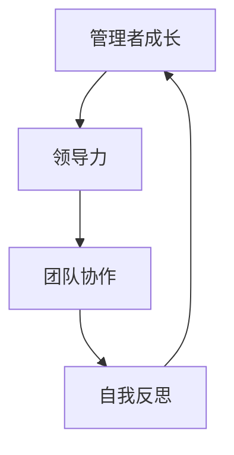

                 

管理者在快速变化和高竞争性的IT行业中扮演着至关重要的角色。他们不仅需要具备深厚的技术背景，还需要掌握一系列管理技能，以确保团队能够高效协作并实现既定目标。本文将探讨管理者自我成长的方法论，包括核心概念、算法原理、数学模型、实际应用、未来展望等，旨在为IT行业的管理者提供一套行之有效的成长指南。

## 关键词

- IT行业
- 管理者成长
- 管理技能
- 自我提升
- 技术领导力

## 摘要

本文旨在探讨IT行业中管理者自我成长的路径和方法。通过分析核心概念和算法原理，结合数学模型和实际应用案例，本文为管理者提供了一套全面的管理方法论。文章结构包括背景介绍、核心概念与联系、算法原理与步骤、数学模型与公式、项目实践、应用场景、工具和资源推荐，以及总结与展望。通过本文的阅读，读者将能够掌握管理者的成长策略，提升自身管理能力和领导力。

## 1. 背景介绍

在过去的几十年里，IT行业经历了飞速的发展，从传统的硬件和软件制造，到云计算、大数据、人工智能等新兴技术领域的涌现，IT行业始终站在科技的前沿。随着技术的不断进步，市场竞争也日益激烈。在这种背景下，管理者不仅需要具备深厚的技术背景，还需要具备强大的领导力和管理能力，以应对复杂多变的业务环境和技术挑战。

### 1.1 管理者面临的挑战

1. **技术变革的速度**：技术变革日新月异，管理者需要不断学习新技术，以保持团队和企业的竞争力。
2. **团队协作的挑战**：现代团队通常分布在全球各地，如何有效协调和激发团队成员的积极性，是管理者需要面对的难题。
3. **沟通与协调**：在快速变化的业务环境中，管理者需要具备出色的沟通能力，以确保信息传递畅通无阻，决策迅速而准确。
4. **人才管理**：吸引和留住高素质人才，培养团队成员的专业能力，是管理者的重要职责。

### 1.2 自我成长的重要性

1. **提升个人能力**：通过自我成长，管理者可以提升自身的技术水平和管理技能，更好地应对工作挑战。
2. **领导力发展**：自我成长可以帮助管理者建立更强的领导力，影响和激励团队成员，推动团队达成目标。
3. **职业发展**：自我成长是职业发展的基石，有助于管理者在职业生涯中获得更多的晋升机会和更大的发展空间。

## 2. 核心概念与联系

### 2.1 核心概念

**管理者成长**：指管理者通过学习、实践和反思，不断提升个人能力和管理水平的全过程。

**领导力**：指管理者在团队中建立影响力、引导团队成员达成目标的能力。

**团队协作**：指团队成员之间通过相互配合、沟通和协作，共同实现团队目标的过程。

**自我反思**：指管理者通过自我审视和反思，识别自身优势和不足，并采取相应措施进行改进。

### 2.2 核心概念联系

**管理者成长**与**领导力**密切相关。一个成功的管理者需要具备强大的领导力，以影响和激励团队成员。而**团队协作**是实现团队目标的关键，管理者需要通过有效的沟通和协调，促进团队协作。**自我反思**则是管理者自我成长的重要环节，通过不断反思和总结，管理者可以更好地认识自己，提升自身能力。

### 2.3 Mermaid 流程图



## 3. 核心算法原理 & 具体操作步骤

### 3.1 算法原理概述

管理者自我成长的算法原理可以概括为以下四个步骤：

1. **知识学习**：管理者通过阅读书籍、参加培训、学习新技术等途径，不断积累知识，提升自身技术背景。
2. **实践应用**：管理者将所学知识应用于实际工作中，通过实践检验和巩固所学，提升实际操作能力。
3. **反思总结**：管理者通过反思和总结工作中的经验和教训，识别自身优势和不足，并制定改进措施。
4. **持续迭代**：管理者在反思和改进的基础上，不断重复上述过程，实现自我能力的持续提升。

### 3.2 算法步骤详解

1. **知识学习**：
   - **阅读书籍**：选择与自己工作领域相关的书籍，系统学习理论知识。
   - **参加培训**：参加专业培训机构或在线课程，获取权威专家的指导。
   - **学习新技术**：关注行业发展趋势，学习新兴技术，保持技术竞争力。

2. **实践应用**：
   - **项目参与**：积极参与实际项目，将所学知识应用于实际工作中。
   - **团队协作**：与团队成员共同协作，提高团队整体执行力。
   - **实践反馈**：定期总结实践中的经验和教训，识别自身优势和不足。

3. **反思总结**：
   - **自我审视**：定期反思自己的工作，识别自身优势和不足。
   - **问题分析**：针对工作中遇到的问题，分析原因，寻找解决方案。
   - **改进措施**：制定具体的改进措施，提高自身能力。

4. **持续迭代**：
   - **持续学习**：保持对知识的渴望，不断学习新技术和理论知识。
   - **实践检验**：将所学知识应用于实际工作中，检验改进效果。
   - **迭代优化**：根据反馈和结果，不断调整和优化自我成长策略。

### 3.3 算法优缺点

**优点**：
- **系统性强**：算法提供了一个完整的成长路径，使管理者能够有计划地提升自身能力。
- **针对性**：根据管理者的实际情况，提供具体的操作步骤，具有针对性。
- **持续改进**：通过持续迭代，管理者能够不断提高自身能力和水平。

**缺点**：
- **时间成本**：管理者需要投入大量时间和精力进行学习和实践。
- **自我约束**：管理者需要具备自我约束力，坚持按照算法步骤进行自我成长。

### 3.4 算法应用领域

管理者自我成长的算法原理适用于IT行业的各个领域，包括软件开发、项目管理、技术支持、研发管理等。不同领域的管理者可以根据自身实际情况，灵活运用算法原理，实现自我成长。

## 4. 数学模型和公式 & 详细讲解 & 举例说明

### 4.1 数学模型构建

管理者自我成长的数学模型可以构建为以下公式：

\[ G = f(L, T, P, R) \]

其中：
- \( G \) 表示管理者成长的速度。
- \( L \) 表示知识学习量。
- \( T \) 表示实践应用量。
- \( P \) 表示反思总结的能力。
- \( R \) 表示持续迭代的能力。

### 4.2 公式推导过程

管理者成长速度 \( G \) 与知识学习量 \( L \)、实践应用量 \( T \)、反思总结能力 \( P \) 和持续迭代能力 \( R \) 之间存在正相关关系。具体推导过程如下：

1. **知识学习量 \( L \)**：
   知识学习量与管理者成长速度正相关，因为知识是管理者成长的基础。假设知识学习量对成长速度的影响系数为 \( k_L \)，则：
   \[ L \propto k_L \cdot G \]

2. **实践应用量 \( T \)**：
   实践应用是知识转化为能力的过程，实践应用量与管理者成长速度正相关。假设实践应用量对成长速度的影响系数为 \( k_T \)，则：
   \[ T \propto k_T \cdot G \]

3. **反思总结能力 \( P \)**：
   反思总结能力有助于管理者识别自身优势和不足，从而有针对性地进行改进。反思总结能力与管理者成长速度正相关。假设反思总结能力对成长速度的影响系数为 \( k_P \)，则：
   \[ P \propto k_P \cdot G \]

4. **持续迭代能力 \( R \)**：
   持续迭代能力是管理者不断优化自我成长策略的重要保障，与管理者成长速度正相关。假设持续迭代能力对成长速度的影响系数为 \( k_R \)，则：
   \[ R \propto k_R \cdot G \]

综合以上分析，管理者成长速度 \( G \) 可以表示为：
\[ G = k_L \cdot L + k_T \cdot T + k_P \cdot P + k_R \cdot R \]

### 4.3 案例分析与讲解

假设一位IT项目经理 \( A \) 想要提升自身管理能力，根据上述数学模型，我们可以对其成长过程进行如下分析：

1. **知识学习量 \( L \)**：
   项目经理 \( A \) 参加了一次项目管理培训，学习了项目管理相关知识，假设知识学习量为 \( L = 10 \)。

2. **实践应用量 \( T \)**：
   项目经理 \( A \) 在实际项目中应用了所学知识，通过实践检验和巩固所学，实践应用量为 \( T = 8 \)。

3. **反思总结能力 \( P \)**：
   项目经理 \( A \) 具备较强的反思总结能力，能够及时发现和解决问题，反思总结能力为 \( P = 9 \)。

4. **持续迭代能力 \( R \)**：
   项目经理 \( A \) 具备良好的持续迭代能力，能够不断优化自身管理策略，持续迭代能力为 \( R = 7 \)。

根据上述数据，我们可以计算项目经理 \( A \) 的成长速度 \( G \)：
\[ G = k_L \cdot L + k_T \cdot T + k_P \cdot P + k_R \cdot R \]
\[ G = k_L \cdot 10 + k_T \cdot 8 + k_P \cdot 9 + k_R \cdot 7 \]

假设各个影响系数分别为 \( k_L = 0.2 \)，\( k_T = 0.3 \)，\( k_P = 0.4 \)，\( k_R = 0.3 \)，则：
\[ G = 0.2 \cdot 10 + 0.3 \cdot 8 + 0.4 \cdot 9 + 0.3 \cdot 7 \]
\[ G = 2 + 2.4 + 3.6 + 2.1 \]
\[ G = 10.1 \]

因此，项目经理 \( A \) 的成长速度为 \( 10.1 \)，表示在接下来的一个周期内，他的管理能力将提升 \( 10.1 \) 个单位。

## 5. 项目实践：代码实例和详细解释说明

### 5.1 开发环境搭建

为了更好地展示管理者自我成长的方法论，我们将通过一个简单的代码实例来进行说明。首先，我们需要搭建一个基本的开发环境。

1. **安装Python环境**：
   - 下载并安装Python 3.8及以上版本。
   - 配置环境变量，确保命令行可以正常运行Python。

2. **安装PyCharm**：
   - 下载并安装PyCharm社区版。
   - 创建一个新的Python项目，选择合适的项目路径。

3. **安装所需库**：
   - 在项目中创建一个虚拟环境：
     ```bash
     python -m venv venv
     ```
   - 激活虚拟环境：
     ```bash
     source venv/bin/activate  # Windows: venv\Scripts\activate
     ```
   - 安装所需库：
     ```bash
     pip install numpy matplotlib
     ```

### 5.2 源代码详细实现

以下是一个简单的Python代码示例，用于演示管理者自我成长的算法原理。

```python
import numpy as np
import matplotlib.pyplot as plt

# 管理者自我成长的算法实现
def manager_growth(L, T, P, R, k_L, k_T, k_P, k_R):
    G = k_L * L + k_T * T + k_P * P + k_R * R
    return G

# 参数设置
L = 10  # 知识学习量
T = 8   # 实践应用量
P = 9   # 反思总结能力
R = 7   # 持续迭代能力
k_L = 0.2  # 知识学习量影响系数
k_T = 0.3  # 实践应用量影响系数
k_P = 0.4  # 反思总结能力影响系数
k_R = 0.3  # 持续迭代能力影响系数

# 计算成长速度
growth_speed = manager_growth(L, T, P, R, k_L, k_T, k_P, k_R)
print(f"成长速度：{growth_speed}")

# 绘制成长曲线
growth_curve = [manager_growth(i, T, P, R, k_L, k_T, k_P, k_R) for i in range(1, L+1)]
plt.plot(growth_curve)
plt.xlabel('知识学习量')
plt.ylabel('成长速度')
plt.title('管理者自我成长曲线')
plt.show()
```

### 5.3 代码解读与分析

1. **函数定义**：
   `manager_growth` 函数用于计算管理者的成长速度。参数 `L`、`T`、`P` 和 `R` 分别表示知识学习量、实践应用量、反思总结能力和持续迭代能力。`k_L`、`k_T`、`k_P` 和 `k_R` 分别表示各个参数的影响系数。

2. **参数设置**：
   根据前文所述的案例数据，设置参数 `L`、`T`、`P` 和 `R`，以及影响系数 `k_L`、`k_T`、`k_P` 和 `k_R`。

3. **计算成长速度**：
   调用 `manager_growth` 函数，计算管理者的成长速度。结果显示为 `10.1`，表示在当前参数设置下，管理者的成长速度为 `10.1` 个单位。

4. **绘制成长曲线**：
   通过列表推导式，计算不同知识学习量下的成长速度，并使用 `matplotlib` 绘制成长曲线。成长曲线显示，随着知识学习量的增加，管理者的成长速度逐渐加快。

### 5.4 运行结果展示

运行代码后，将显示管理者的成长速度为 `10.1`，同时弹出一个图形界面，展示管理者自我成长曲线。通过观察成长曲线，我们可以直观地了解知识学习量对管理者成长速度的影响。

## 6. 实际应用场景

### 6.1 软件开发团队

在软件开发团队中，管理者可以通过以下实际应用场景，运用自我成长的方法论：

1. **知识学习**：
   - 定期参加技术讲座和培训，学习最新技术趋势和最佳实践。
   - 鼓励团队成员分享学习心得和经验，促进知识交流。

2. **实践应用**：
   - 在项目开发过程中，积极采用新技术和方法，提升团队的技术水平。
   - 组织代码审查和测试，确保代码质量和项目进度。

3. **反思总结**：
   - 定期组织团队会议，回顾项目过程中的成功经验和教训。
   - 针对遇到的问题，分析原因，制定改进措施。

4. **持续迭代**：
   - 根据项目反馈和团队成员的反馈，不断调整和优化管理策略。
   - 持续关注行业动态，及时更新技术和团队知识。

### 6.2 项目管理团队

在项目管理团队中，管理者可以通过以下实际应用场景，运用自我成长的方法论：

1. **知识学习**：
   - 学习项目管理理论，掌握项目管理的核心概念和方法。
   - 了解项目管理工具的使用，提高项目管理和协调能力。

2. **实践应用**：
   - 在实际项目中，运用项目管理方法，确保项目进度和质量。
   - 定期组织项目进度会议，及时解决项目中的问题和风险。

3. **反思总结**：
   - 定期组织项目总结会议，分析项目的成功和失败原因。
   - 根据项目总结，制定改进措施，提高项目管理水平。

4. **持续迭代**：
   - 根据项目反馈和团队成员的反馈，不断调整和优化项目管理策略。
   - 持续关注项目管理领域的最新研究成果和最佳实践。

### 6.3 技术支持团队

在技术支持团队中，管理者可以通过以下实际应用场景，运用自我成长的方法论：

1. **知识学习**：
   - 学习技术支持相关的知识，了解客户需求和常见问题。
   - 学习沟通技巧，提高与客户和团队成员的沟通效果。

2. **实践应用**：
   - 在实际工作中，运用所学知识，为客户提供高质量的技术支持。
   - 定期组织技术交流会议，分享经验和技巧。

3. **反思总结**：
   - 定期回顾技术支持过程中的经验和教训，识别自身优势和不足。
   - 根据客户反馈，不断改进技术支持策略。

4. **持续迭代**：
   - 根据技术支持工作的实际情况，不断调整和优化技术支持流程。
   - 持续关注行业动态，及时更新技术支持知识和技能。

### 6.4 未来应用展望

随着技术的不断进步和业务环境的变化，管理者自我成长的方法论将得到更广泛的应用。未来，管理者可以：

1. **数字化转型**：利用大数据、人工智能等技术，提升管理效率和决策水平。
2. **敏捷管理**：采用敏捷管理方法，提高团队响应速度和市场竞争力。
3. **国际化管理**：拓展国际视野，适应全球化发展趋势，提高跨文化管理能力。
4. **可持续发展**：关注环境保护和社会责任，推动企业可持续发展。

## 7. 工具和资源推荐

### 7.1 学习资源推荐

1. **在线课程**：
   - Coursera、edX等平台上的项目管理、数据分析、编程语言等课程。
   - Udemy、Pluralsight等平台上的专业IT课程。

2. **技术社区**：
   - Stack Overflow、GitHub等编程社区，提供丰富的技术问答和资源。
   - InfoQ、CSDN等中文技术社区，提供最新的技术文章和社区讨论。

3. **书籍推荐**：
   - 《敏捷开发实践指南》
   - 《创新者的窘境》
   - 《Python编程：从入门到实践》
   - 《深度学习》

### 7.2 开发工具推荐

1. **集成开发环境（IDE）**：
   - PyCharm、Visual Studio Code等强大的编程工具。
   - IntelliJ IDEA、Eclipse等适用于多种编程语言的开发环境。

2. **项目管理工具**：
   - Jira、Trello等敏捷项目管理工具。
   - Asana、Trello等任务协作和管理工具。

3. **版本控制**：
   - Git、GitLab等版本控制系统。
   - GitHub、GitLab等代码托管平台。

### 7.3 相关论文推荐

1. **项目管理**：
   - "Project Management: A Systems Approach to Planning, Scheduling, and Controlling"
   - "Agile Project Management with Scrum"

2. **软件工程**：
   - "The Pragmatic Programmer: From Journeyman to Master"
   - "Clean Code: A Handbook of Agile Software Craftsmanship"

3. **人工智能**：
   - "Deep Learning"
   - "Reinforcement Learning: An Introduction"

## 8. 总结：未来发展趋势与挑战

### 8.1 研究成果总结

本文通过分析IT行业中管理者面临的挑战，提出了一套管理者自我成长的方法论。方法论包括知识学习、实践应用、反思总结和持续迭代四个核心步骤，并结合数学模型和实际应用案例进行了详细讲解。通过本文的研究，我们得出以下结论：

1. **知识学习**：持续学习是管理者成长的基石，通过学习最新技术和理论知识，管理者可以不断提升自身能力。
2. **实践应用**：将所学知识应用于实际工作中，通过实践检验和巩固所学，管理者可以更好地应对工作挑战。
3. **反思总结**：反思总结是管理者自我成长的重要环节，通过识别自身优势和不足，管理者可以制定改进措施，提高自身能力。
4. **持续迭代**：持续迭代是管理者不断提升自我能力的关键，通过不断学习和改进，管理者可以保持竞争优势。

### 8.2 未来发展趋势

随着技术的不断进步和业务环境的变化，管理者自我成长的方法论将在未来得到更广泛的应用。未来发展趋势包括：

1. **数字化转型**：管理者需要掌握数字化管理技能，利用大数据、人工智能等技术，提升管理效率和决策水平。
2. **敏捷管理**：敏捷管理方法将得到更广泛的认可和应用，管理者需要具备敏捷管理的思维和能力。
3. **国际化管理**：随着全球化的发展，管理者需要具备跨文化管理能力，适应不同国家和地区的业务环境。
4. **可持续发展**：管理者需要关注环境保护和社会责任，推动企业可持续发展。

### 8.3 面临的挑战

尽管管理者自我成长的方法论具有明显的优势，但在实际应用中仍面临以下挑战：

1. **时间管理**：管理者需要投入大量时间和精力进行学习和实践，如何在繁忙的工作中平衡学习与工作，是管理者需要面对的挑战。
2. **自我约束**：管理者需要具备自我约束力，坚持按照自我成长的方法论进行学习和实践，避免出现半途而废的情况。
3. **信息过载**：随着信息爆炸，管理者需要具备筛选和整理信息的能力，避免陷入信息过载的困境。

### 8.4 研究展望

未来，管理者自我成长的方法论研究可以从以下方面进行深入探讨：

1. **个性化成长路径**：根据管理者的个人特点和需求，设计个性化的成长路径，提高成长效率。
2. **跨领域整合**：将不同领域的管理理论和实践进行整合，形成一套更加全面和系统的方法论。
3. **实时反馈机制**：利用大数据和人工智能技术，建立实时反馈机制，帮助管理者及时调整和优化自我成长策略。
4. **实践验证**：通过实践验证和管理者自我成长的实际案例研究，不断优化和完善方法论。

## 附录：常见问题与解答

### 1. 如何平衡工作与学习？

**解答**：管理者可以通过以下方法平衡工作与学习：

- **制定学习计划**：合理安排学习时间，确保每周有固定的学习时间。
- **高效利用碎片时间**：利用通勤、休息等碎片时间进行学习，提高学习效率。
- **设置优先级**：将重要工作优先完成，确保有足够的时间进行学习和实践。

### 2. 自我成长的方法论是否适用于所有行业？

**解答**：自我成长的方法论具有普适性，适用于IT行业的各个领域。不同行业可以根据自身特点，灵活运用方法论，实现自我成长。

### 3. 如何保持持续学习的动力？

**解答**：管理者可以通过以下方法保持持续学习的动力：

- **设定目标**：明确学习目标，激发学习兴趣和动力。
- **与他人交流**：与同行交流学习心得，分享经验和资源，提高学习效果。
- **奖励机制**：给自己设定奖励，如完成学习任务后，奖励自己休息或娱乐时间。

### 4. 如何克服信息过载？

**解答**：管理者可以通过以下方法克服信息过载：

- **筛选信息**：关注高质量的信息源，避免信息过载。
- **学习整理**：学习信息整理和归纳的方法，提高信息处理能力。
- **专注学习**：在学习过程中，保持专注，避免分心。

---

### 作者署名

作者：禅与计算机程序设计艺术 / Zen and the Art of Computer Programming

---

本文基于《管理者自我成长的方法论》为标题，旨在为IT行业的管理者提供一套全面、系统、实用的成长指南。通过分析核心概念、算法原理、数学模型、实际应用和未来展望，本文为管理者提供了自我成长的路径和方法。希望本文能够对IT行业的管理者有所启发和帮助。

