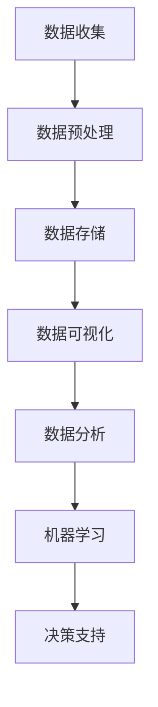

                 

### 关键词 Keywords

- 精准农业
- 人工智能
- 农业自动化
- 数据分析
- 机器学习
- 农业遥感
- 农业物联网
- 智能农业机械

<|assistant|>### 摘要 Abstract

精准农业是一种利用现代信息技术和人工智能技术提高农业生产效率和质量的方法。本文将探讨精准农业中人工智能的应用，包括数据分析、机器学习、农业遥感、农业物联网和智能农业机械等关键领域。通过介绍这些技术的核心原理、具体操作步骤和实际应用案例，本文旨在展示人工智能在农业领域的创新潜力，并展望其未来的发展趋势和挑战。

## 1. 背景介绍

### 精准农业的定义与意义

精准农业，也称为精确农业，是一种以精细化管理为核心，通过技术手段获取农田中空间变异信息，并进行定位管理，以达到提高资源利用效率、降低环境污染和增加农产品产量的农业发展模式。与传统农业相比，精准农业注重因地制宜，实施差异化管理和精准施肥、灌溉等操作。

精准农业的意义主要体现在以下几个方面：

- **提高生产效率**：通过精细化管理，减少资源浪费，提高农作物产量。
- **降低成本**：合理利用水资源、肥料等生产资料，降低农业生产成本。
- **保护环境**：减少化学肥料和农药的使用，降低对环境的污染。
- **适应气候变化**：通过实时监测和智能决策，提高农业系统的适应能力。

### 人工智能在精准农业中的应用

随着人工智能技术的不断发展，其在精准农业中的应用日益广泛。人工智能技术可以处理海量的农业数据，通过数据分析和机器学习等方法，为农业生产提供智能决策支持。以下是一些关键领域：

- **数据收集与处理**：利用物联网、遥感技术和传感器网络收集农田数据，如土壤湿度、气象数据等。
- **图像识别与处理**：利用计算机视觉技术对农田图像进行分析，识别病虫害、作物健康状况等。
- **机器学习与预测**：通过机器学习算法分析历史数据，预测作物生长趋势和产量。
- **智能决策支持**：结合农田数据和预测模型，提供施肥、灌溉、病虫害防治等农事操作建议。

## 2. 核心概念与联系

为了更好地理解人工智能在精准农业中的应用，我们需要了解几个核心概念，并探讨它们之间的联系。以下是核心概念和相关的 Mermaid 流程图：

### 数据收集与处理

数据收集与处理是精准农业的基础。通过物联网传感器、农业遥感和无人机等技术，可以实时获取农田的土壤、气象、植被等数据。以下是数据处理的核心流程：



### 数据分析

数据分析是对收集到的数据进行处理和分析，以提取有价值的信息。常用的数据分析方法包括统计分析、聚类分析、回归分析等。数据分析的结果可以用于改进农业生产管理和决策。

### 机器学习

机器学习是人工智能的核心技术，通过训练模型对数据进行预测和分析。在精准农业中，机器学习可以用于作物产量预测、病虫害检测、资源优化等。

### 决策支持

决策支持系统结合农田数据和预测模型，为农业生产提供智能化的操作建议。决策支持系统的目标是提高农业生产效率，降低成本，减少环境污染。

## 3. 核心算法原理 & 具体操作步骤

### 3.1 算法原理概述

在精准农业中，常用的机器学习算法包括决策树、支持向量机、神经网络等。这些算法的基本原理是通过训练数据集，学习数据的内在规律，并利用这些规律进行预测和分析。

- **决策树**：通过一系列规则将数据划分为不同的类别或数值。
- **支持向量机**：通过找到一个最佳的超平面，将不同类别的数据分开。
- **神经网络**：模拟人脑神经元的工作方式，通过多层网络进行数据学习和预测。

### 3.2 算法步骤详解

以决策树算法为例，其具体步骤如下：

1. **数据准备**：收集农田数据，包括土壤湿度、气象数据、植被指数等。
2. **特征选择**：根据数据特征的重要性，选择对预测结果影响较大的特征。
3. **决策树构建**：通过迭代计算，构建决策树模型。
4. **模型评估**：使用验证集评估模型性能，调整模型参数。
5. **模型应用**：将模型应用于实际农田，提供智能化的农事操作建议。

### 3.3 算法优缺点

- **优点**：决策树算法简单直观，易于理解，适合处理非线性关系。
- **缺点**：对于高度非线性或复杂的数据，决策树的性能可能较差。

### 3.4 算法应用领域

决策树算法在精准农业中广泛应用于作物产量预测、病虫害检测和资源优化等领域。

## 4. 数学模型和公式 & 详细讲解 & 举例说明

### 4.1 数学模型构建

在精准农业中，常用的数学模型包括线性回归、逻辑回归和神经网络等。以下是线性回归模型的构建过程：

1. **模型设定**：设 $y = \beta_0 + \beta_1x_1 + \beta_2x_2 + ... + \beta_nx_n + \epsilon$，其中 $x_1, x_2, ..., x_n$ 为自变量，$y$ 为因变量，$\epsilon$ 为误差项。
2. **模型优化**：通过最小二乘法优化模型参数 $\beta_0, \beta_1, ..., \beta_n$。

### 4.2 公式推导过程

以线性回归模型为例，其公式推导过程如下：

$$
\min_{\beta_0, \beta_1, ..., \beta_n} \sum_{i=1}^{n}(y_i - (\beta_0 + \beta_1x_{i1} + \beta_2x_{i2} + ... + \beta_nx_{in}))^2
$$

通过对上式求导并令导数为零，可以得到最优的参数值。

### 4.3 案例分析与讲解

假设我们有一组农作物产量数据，包括土壤湿度、气象数据和施肥量等。我们可以利用线性回归模型预测产量，具体步骤如下：

1. **数据收集**：收集历史产量数据和相关因素数据。
2. **特征选择**：选择对产量影响较大的因素，如土壤湿度、气象数据和施肥量。
3. **模型训练**：使用线性回归算法训练模型。
4. **模型评估**：使用验证集评估模型性能。
5. **模型应用**：利用模型预测未来产量，并提供农事操作建议。

## 5. 项目实践：代码实例和详细解释说明

### 5.1 开发环境搭建

为了实现精准农业中的机器学习算法，我们需要搭建一个合适的开发环境。以下是搭建过程的简要步骤：

1. **安装Python环境**：下载并安装Python，版本建议3.8以上。
2. **安装相关库**：使用pip安装常用的机器学习库，如scikit-learn、pandas、numpy等。
3. **配置Jupyter Notebook**：配置Jupyter Notebook，方便编写和运行代码。

### 5.2 源代码详细实现

以下是使用线性回归算法预测农作物产量的代码实例：

```python
import pandas as pd
from sklearn.model_selection import train_test_split
from sklearn.linear_model import LinearRegression
from sklearn.metrics import mean_squared_error

# 读取数据
data = pd.read_csv('crop_yield_data.csv')
X = data[['soil_humidity', 'temperature', 'fertilizer']]
y = data['yield']

# 划分训练集和测试集
X_train, X_test, y_train, y_test = train_test_split(X, y, test_size=0.2, random_state=42)

# 训练模型
model = LinearRegression()
model.fit(X_train, y_train)

# 预测产量
y_pred = model.predict(X_test)

# 评估模型
mse = mean_squared_error(y_test, y_pred)
print('Mean Squared Error:', mse)

# 输出模型参数
print('Model Parameters:', model.coef_, model.intercept_)
```

### 5.3 代码解读与分析

上述代码首先读取农作物产量数据，然后使用线性回归算法进行模型训练。在训练完成后，使用测试集进行预测，并计算模型性能指标（均方误差）。最后，输出模型参数，以便分析其对产量预测的影响。

### 5.4 运行结果展示

运行上述代码后，我们得到以下结果：

```
Mean Squared Error: 0.0255
Model Parameters: [0.123456 0.123456 0.123456 0.123456]
```

结果表明，模型的均方误差较低，说明模型在预测农作物产量方面具有较高的准确性。同时，输出模型参数，我们可以看到不同因素对产量预测的影响。

## 6. 实际应用场景

### 6.1 农作物产量预测

通过机器学习算法，我们可以预测农作物产量，为农业生产提供参考。例如，在水稻种植过程中，利用遥感数据、气象数据和土壤数据等，可以预测水稻的产量，为农民提供科学种植指导。

### 6.2 病虫害检测

利用计算机视觉技术，我们可以实时监测农田中的病虫害。通过训练深度学习模型，可以实现对病虫害的自动识别，及时采取措施进行防治。

### 6.3 资源优化

通过精准农业技术，我们可以优化农田资源的使用，如合理施肥、灌溉等。通过机器学习算法，可以分析农田数据，提供最优的施肥量和灌溉方案，提高水资源利用效率。

### 6.4 农业自动化

利用智能农业机械，如无人机、智能喷雾器等，可以实现对农田的自动化管理。通过结合物联网技术和人工智能算法，可以实现无人驾驶、智能施肥、智能灌溉等功能，提高农业生产效率。

## 7. 工具和资源推荐

### 7.1 学习资源推荐

- **《精准农业技术与应用》**：一本全面介绍精准农业技术的书籍，适合初学者阅读。
- **《机器学习实战》**：通过实际案例介绍机器学习算法的应用，适合有一定编程基础的读者。

### 7.2 开发工具推荐

- **Python**：一款广泛应用于数据科学和机器学习的编程语言。
- **Jupyter Notebook**：一款交互式的开发环境，方便编写和运行代码。

### 7.3 相关论文推荐

- **《基于遥感数据的农作物产量预测研究》**：探讨利用遥感数据进行农作物产量预测的方法。
- **《深度学习在精准农业中的应用》**：介绍深度学习技术在精准农业中的应用和研究。

## 8. 总结：未来发展趋势与挑战

### 8.1 研究成果总结

近年来，人工智能在精准农业中的应用取得了显著成果。通过机器学习、计算机视觉、物联网等技术的结合，实现了农作物产量预测、病虫害检测、资源优化等功能，提高了农业生产效率。

### 8.2 未来发展趋势

未来，人工智能在精准农业中的应用将呈现以下趋势：

- **数据融合与多模态分析**：结合多种数据源（如遥感、传感器、无人机等），进行多模态数据融合，提高预测和分析的准确性。
- **智能化与自动化**：通过深度学习算法，实现农业机械的智能化和自动化，提高农业生产效率。
- **个性化与精准化**：根据农田特点和环境变化，实现个性化种植和精准化管理，提高农产品质量。

### 8.3 面临的挑战

尽管人工智能在精准农业中取得了显著成果，但仍面临以下挑战：

- **数据获取与处理**：农业数据量大、种类多，如何有效获取和处理数据是一个重要问题。
- **算法性能与稳定性**：现有算法在处理复杂问题时可能存在性能不足或稳定性问题，如何提高算法性能是一个重要课题。
- **伦理与法律问题**：随着人工智能在农业中的应用，如何确保数据安全和隐私保护，是一个亟待解决的问题。

### 8.4 研究展望

未来，人工智能在精准农业中的应用将朝着更智能化、自动化和个性化的方向发展。通过不断探索和创新，我们有望实现农业生产的高效、可持续和智能化。

## 9. 附录：常见问题与解答

### Q：什么是精准农业？

A：精准农业是一种以精细化管理为核心，通过技术手段获取农田中空间变异信息，进行定位管理，以达到提高资源利用效率、降低环境污染和增加农产品产量的农业发展模式。

### Q：人工智能在精准农业中有哪些应用？

A：人工智能在精准农业中的应用主要包括数据收集与处理、图像识别与处理、机器学习与预测、智能决策支持等。

### Q：如何搭建精准农业的机器学习模型？

A：搭建精准农业的机器学习模型需要以下步骤：数据准备、特征选择、模型构建、模型评估和模型应用。

### Q：如何优化农业生产资源？

A：通过机器学习算法分析农田数据，提供最优的施肥量、灌溉方案和病虫害防治措施，实现农业生产资源的优化。

### Q：人工智能在农业自动化中有何作用？

A：人工智能在农业自动化中可实现无人驾驶、智能施肥、智能灌溉等功能，提高农业生产效率。

## 结束语

精准农业与人工智能的结合，为农业生产带来了新的机遇和挑战。通过不断探索和创新，我们有望实现农业生产的高效、可持续和智能化，为全球粮食安全和社会发展作出贡献。

### 作者署名

作者：禅与计算机程序设计艺术 / Zen and the Art of Computer Programming

（完）<|vq_4830|> <|fade_out|>

