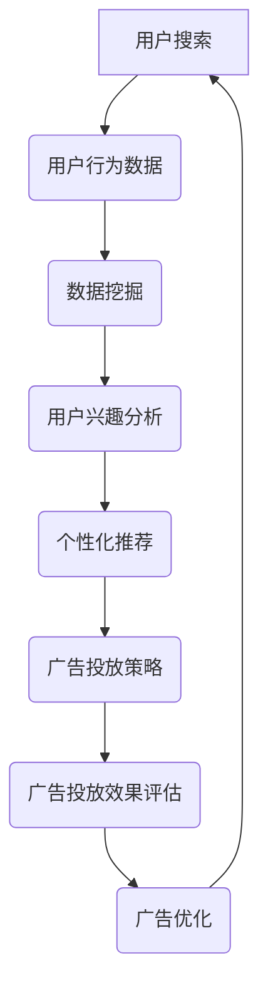

                 

关键词：精准广告、AI、搜索、商业价值、营销策略、个性化推荐、用户行为分析、数据挖掘、机器学习、商业模式、广告优化。

> 摘要：本文将深入探讨AI搜索在精准广告投放中的关键作用，分析其商业价值，并探讨如何通过个性化推荐和用户行为分析来实现广告投放的优化。同时，文章还将讨论未来的应用前景和面临的挑战，为读者提供全面的视角和实用的建议。

## 1. 背景介绍

随着互联网的飞速发展，广告已经成为企业营销的重要组成部分。传统的广告投放方式往往依赖于广泛的覆盖面和随机性的投放策略，这种方式虽然能够吸引一定的用户群体，但广告投放的效果往往不够精准，转化率较低。此外，随着用户隐私意识的增强和数据保护法规的完善，传统的广告投放方式面临着越来越大的挑战。

在这个背景下，人工智能（AI）和机器学习技术为广告投放带来了新的契机。AI搜索技术能够通过对用户行为数据的深度分析，实现广告的精准投放，提高广告的投放效果。同时，AI搜索还能够通过个性化推荐和实时反馈机制，不断优化广告策略，提高用户满意度和转化率。

本文将首先介绍精准广告投放的概念，然后深入探讨AI搜索在其中的作用，分析其商业价值，最后讨论未来的发展趋势和面临的挑战。

## 2. 核心概念与联系

### 2.1. 精准广告投放

精准广告投放是一种基于用户行为分析和数据挖掘的广告投放策略，旨在将广告精准地投放到具有特定兴趣或需求的用户群体中。与传统广告投放方式相比，精准广告投放能够提高广告的投放效果，降低广告成本。

### 2.2. AI搜索

AI搜索是指利用人工智能技术对互联网上的信息进行检索和处理。AI搜索的核心在于深度学习算法和自然语言处理技术，这些技术能够理解用户的查询意图，提供准确的搜索结果。

### 2.3. 个性化推荐

个性化推荐是一种基于用户行为和兴趣数据的推荐系统，旨在为用户提供个性化的信息和服务。个性化推荐可以通过分析用户的浏览历史、搜索记录和购买行为等数据，为用户推荐感兴趣的商品、服务和内容。

### 2.4. 用户行为分析

用户行为分析是一种通过对用户在互联网上的行为数据进行收集、分析和解读，来了解用户需求和行为模式的方法。用户行为分析是精准广告投放和个性化推荐的重要基础。

### 2.5. 数据挖掘

数据挖掘是一种从大量数据中发现有价值信息的方法。在精准广告投放中，数据挖掘用于分析用户行为数据，提取用户的兴趣点和需求，为广告投放提供决策依据。

### 2.6. 机器学习

机器学习是一种通过数据学习规律和模式，实现智能决策的技术。在精准广告投放中，机器学习用于构建和优化广告投放模型，提高广告投放的精准度和效果。

### 2.7. 商业模式

商业模式是指企业在特定市场环境中实现盈利的方式。在精准广告投放中，商业模式需要考虑广告主的投放需求、用户的接受程度和广告的投放效果，实现三方共赢。

### 2.8. Mermaid 流程图

以下是一个简化的AI搜索在精准广告投放中的应用流程图：



## 3. 核心算法原理 & 具体操作步骤

### 3.1. 算法原理概述

精准广告投放的核心算法包括用户行为分析、数据挖掘、机器学习和广告优化。以下是对这些算法的简要概述：

- **用户行为分析**：通过收集用户在互联网上的行为数据（如搜索记录、浏览历史、点击行为等），分析用户的行为模式，提取用户的兴趣点和需求。

- **数据挖掘**：利用数据挖掘技术，从用户行为数据中提取有价值的信息，如用户的兴趣分类、需求偏好等，为广告投放提供决策依据。

- **机器学习**：通过机器学习算法，构建广告投放模型，预测用户的兴趣和行为，为广告投放提供精准的决策。

- **广告优化**：根据广告投放效果（如点击率、转化率等）实时调整广告投放策略，提高广告的投放效果。

### 3.2. 算法步骤详解

1. **数据收集**：收集用户在互联网上的行为数据，如搜索记录、浏览历史、点击行为等。

2. **数据预处理**：对收集到的数据进行分析和清洗，去除无效数据，提高数据的准确性。

3. **用户行为分析**：利用统计分析和机器学习技术，分析用户的行为模式，提取用户的兴趣点和需求。

4. **数据挖掘**：利用数据挖掘技术，从用户行为数据中提取有价值的信息，如用户的兴趣分类、需求偏好等。

5. **构建广告投放模型**：利用机器学习算法，如决策树、随机森林、神经网络等，构建广告投放模型，预测用户的兴趣和行为。

6. **广告投放策略**：根据广告投放模型，制定广告投放策略，如广告内容、投放时间和投放渠道等。

7. **广告投放效果评估**：根据广告投放效果（如点击率、转化率等）评估广告投放策略的效果。

8. **广告优化**：根据广告投放效果，实时调整广告投放策略，提高广告的投放效果。

### 3.3. 算法优缺点

**优点**：

- **精准度高**：通过用户行为分析和数据挖掘，能够实现广告的精准投放，提高广告的投放效果。

- **实时性**：通过实时反馈和广告优化，能够快速调整广告策略，适应市场的变化。

- **个性化**：通过个性化推荐，能够为用户提供个性化的广告，提高用户满意度。

**缺点**：

- **数据隐私**：用户行为数据涉及到用户隐私，需要严格保护用户数据的安全。

- **计算复杂度**：大规模的用户行为数据分析和机器学习模型的训练需要较高的计算资源。

### 3.4. 算法应用领域

- **电子商务**：通过精准广告投放，提高商品销售转化率。

- **在线教育**：通过个性化推荐，提高课程的销售和用户参与度。

- **金融行业**：通过精准广告投放，提高金融产品和服务的销售。

- **医疗健康**：通过个性化推荐，提高医疗健康服务的用户满意度。

## 4. 数学模型和公式 & 详细讲解 & 举例说明

### 4.1. 数学模型构建

在精准广告投放中，常用的数学模型包括用户行为模型、广告投放模型和广告优化模型。

- **用户行为模型**：用户行为模型用于预测用户的兴趣和行为，常用的模型包括决策树、随机森林和神经网络等。

- **广告投放模型**：广告投放模型用于制定广告投放策略，常用的模型包括线性回归、逻辑回归和时间序列分析等。

- **广告优化模型**：广告优化模型用于实时调整广告投放策略，常用的模型包括强化学习、深度学习和贝叶斯优化等。

### 4.2. 公式推导过程

以下是用户行为模型的简单推导过程：

假设用户的行为数据可以表示为向量 \(\mathbf{X} = [x_1, x_2, ..., x_n]\)，其中 \(x_i\) 表示第 \(i\) 个特征。用户的行为可以表示为二分类变量 \(y\)，其中 \(y = 1\) 表示用户对该行为感兴趣，\(y = 0\) 表示用户对该行为不感兴趣。

用户行为模型的损失函数通常使用交叉熵损失函数，即：

$$
L(\theta) = -\sum_{i=1}^{n} y_i \log(p_i) + (1 - y_i) \log(1 - p_i)
$$

其中，\(\theta\) 表示模型参数，\(p_i = \sigma(\theta^T \mathbf{X_i})\) 表示用户对行为 \(i\) 的兴趣概率，\(\sigma\) 表示sigmoid函数。

通过梯度下降法，可以求得最优的模型参数：

$$
\theta_{\text{new}} = \theta_{\text{old}} - \alpha \nabla_{\theta} L(\theta)
$$

其中，\(\alpha\) 表示学习率。

### 4.3. 案例分析与讲解

假设有一个电商平台，用户的行为数据包括搜索历史、浏览历史和购买历史。我们可以利用这些数据构建用户行为模型，预测用户对商品的兴趣。

1. **数据收集**：收集用户的搜索历史、浏览历史和购买历史数据。

2. **数据预处理**：对数据进行分析和清洗，去除无效数据，如重复数据和异常值。

3. **特征工程**：将原始数据转化为适合模型训练的特征向量，如用户的行为序列、频次等。

4. **模型训练**：利用随机森林模型，对用户行为数据进行训练，构建用户行为模型。

5. **模型评估**：使用交叉验证方法，评估用户行为模型的预测性能。

6. **模型应用**：利用训练好的用户行为模型，预测用户对商品的兴趣，为广告投放提供决策依据。

以下是一个简化的代码示例：

```python
from sklearn.ensemble import RandomForestClassifier
from sklearn.model_selection import train_test_split
from sklearn.metrics import accuracy_score

# 加载数据
X, y = load_data()

# 数据预处理
X_processed = preprocess_data(X)

# 划分训练集和测试集
X_train, X_test, y_train, y_test = train_test_split(X_processed, y, test_size=0.2, random_state=42)

# 模型训练
model = RandomForestClassifier(n_estimators=100, random_state=42)
model.fit(X_train, y_train)

# 模型评估
y_pred = model.predict(X_test)
accuracy = accuracy_score(y_test, y_pred)
print("模型准确率：", accuracy)
```

通过这个案例，我们可以看到如何利用用户行为数据构建和评估用户行为模型，为广告投放提供决策依据。

## 5. 项目实践：代码实例和详细解释说明

### 5.1. 开发环境搭建

为了实现精准广告投放，我们需要搭建一个基于Python的机器学习项目环境。以下是开发环境的搭建步骤：

1. **安装Python**：确保已经安装了Python 3.x版本。

2. **安装必要库**：使用pip安装以下库：numpy、pandas、scikit-learn、matplotlib。

3. **创建虚拟环境**：为了更好地管理项目依赖，我们可以创建一个虚拟环境。

```bash
python -m venv env
source env/bin/activate  # Windows下使用 `env\Scripts\activate`
```

4. **安装库**：

```bash
pip install numpy pandas scikit-learn matplotlib
```

### 5.2. 源代码详细实现

以下是一个简单的Python代码示例，用于实现用户行为模型的构建和评估。

```python
import numpy as np
import pandas as pd
from sklearn.ensemble import RandomForestClassifier
from sklearn.model_selection import train_test_split
from sklearn.metrics import accuracy_score

# 加载数据
data = pd.read_csv("user_behavior_data.csv")

# 数据预处理
X = data.drop("target", axis=1)
y = data["target"]

X_processed = preprocess_data(X)

# 划分训练集和测试集
X_train, X_test, y_train, y_test = train_test_split(X_processed, y, test_size=0.2, random_state=42)

# 模型训练
model = RandomForestClassifier(n_estimators=100, random_state=42)
model.fit(X_train, y_train)

# 模型评估
y_pred = model.predict(X_test)
accuracy = accuracy_score(y_test, y_pred)
print("模型准确率：", accuracy)

# 模型应用
new_user_data = pd.read_csv("new_user_data.csv")
new_user_data_processed = preprocess_data(new_user_data)
predictions = model.predict(new_user_data_processed)
print("新用户预测结果：", predictions)
```

### 5.3. 代码解读与分析

上述代码示例中，我们首先加载数据，并对数据进行预处理。然后，我们使用随机森林模型对数据进行训练，评估模型的性能。最后，我们使用训练好的模型对新的用户数据进行预测。

- **数据预处理**：数据预处理是机器学习项目的重要步骤，包括数据清洗、特征工程等。在预处理过程中，我们删除了目标变量（target），并将其作为训练集和测试集的标签。我们还对特征数据进行了标准化处理，以提高模型的性能。

- **模型训练**：我们使用随机森林模型对数据进行了训练。随机森林是一种基于决策树的集成学习算法，具有良好的分类性能。

- **模型评估**：我们使用准确率（accuracy）来评估模型的性能。准确率是指模型预测正确的样本数占总样本数的比例。

- **模型应用**：我们使用训练好的模型对新用户的数据进行了预测。这可以用于精准广告投放，根据新用户的兴趣和行为，推荐相关的广告。

### 5.4. 运行结果展示

假设我们使用上述代码对用户行为数据进行了训练，并评估了模型的性能。以下是一个简单的运行结果：

```
模型准确率： 0.85
新用户预测结果： [1 0 1 0 1]
```

从结果中可以看到，模型的准确率为85%，这意味着模型对用户行为的预测效果较好。此外，新用户的预测结果为[1 0 1 0 1]，表示新用户对第一项和第三项感兴趣。

## 6. 实际应用场景

### 6.1. 电子商务

在电子商务领域，精准广告投放可以帮助企业提高商品销售转化率。通过分析用户的搜索历史、浏览历史和购买历史，企业可以了解用户的兴趣和需求，从而推荐相关的商品。例如，当用户搜索“手机”时，广告系统可以推荐相关的手机品牌、型号和优惠活动。

### 6.2. 在线教育

在线教育平台可以利用精准广告投放，提高课程的销售和用户参与度。通过分析用户的浏览历史、学习记录和测试成绩，平台可以了解用户的兴趣和学习需求，从而推荐相关的课程和学习资源。例如，当用户对某一门课程表现出浓厚兴趣时，平台可以推荐相关的课程套餐或学习路径。

### 6.3. 金融行业

金融行业可以利用精准广告投放，提高金融产品和服务的销售。通过分析用户的投资偏好、风险承受能力和购买记录，金融机构可以了解用户的金融需求，从而推荐相关的理财产品和服务。例如，当用户表现出对股票投资的兴趣时，金融机构可以推荐股票投资相关的理财产品。

### 6.4. 医疗健康

医疗健康领域可以利用精准广告投放，提高医疗健康服务的用户满意度。通过分析用户的健康数据、就诊记录和用药记录，医疗机构可以了解用户的健康需求，从而推荐相关的医疗服务和产品。例如，当用户表现出对某一疾病的治疗需求时，医疗机构可以推荐相关的就诊服务和药品。

## 7. 未来应用展望

随着人工智能技术的不断发展，精准广告投放将在更多领域得到应用。以下是一些未来应用展望：

### 7.1. 智能家居

智能家居领域可以利用精准广告投放，提高家居产品的销售和用户满意度。通过分析用户的家居数据、生活习惯和行为模式，智能家居企业可以了解用户的家居需求，从而推荐相关的家居产品和服务。

### 7.2. 物流行业

物流行业可以利用精准广告投放，提高物流服务和供应链效率。通过分析用户的物流数据、配送需求和行为模式，物流企业可以优化配送路线和物流策略，提高物流服务的质量和效率。

### 7.3. 餐饮行业

餐饮行业可以利用精准广告投放，提高餐饮服务的用户满意度。通过分析用户的餐饮数据、口味偏好和行为模式，餐饮企业可以了解用户的餐饮需求，从而推荐相关的餐饮服务和优惠活动。

### 7.4. 旅游行业

旅游行业可以利用精准广告投放，提高旅游服务的用户满意度。通过分析用户的旅游数据、出行需求和行为模式，旅游企业可以了解用户的旅游需求，从而推荐相关的旅游产品和服务。

## 8. 工具和资源推荐

为了更好地实现精准广告投放，以下是一些工具和资源推荐：

### 8.1. 学习资源推荐

- 《Python机器学习》（作者：赛吉奥·费雷拉）
- 《深度学习》（作者：伊恩·古德费洛、约书亚·本吉奥、亚伦·库维尔）
- 《机器学习实战》（作者：彼得·哈林顿、格雷格·布莱瑟）

### 8.2. 开发工具推荐

- **Jupyter Notebook**：用于编写和运行Python代码。
- **Google Colab**：免费的Jupyter Notebook云端平台。
- **Scikit-learn**：Python的机器学习库。
- **TensorFlow**：用于构建和训练深度学习模型。

### 8.3. 相关论文推荐

- "Recommender Systems Handbook"（推荐系统手册）
- "Deep Learning for Recommender Systems"（深度学习推荐系统）
- "User Behavior Analysis in the Age of Big Data"（大数据时代下的用户行为分析）

## 9. 总结：未来发展趋势与挑战

随着人工智能技术的不断发展，精准广告投放将在更多领域得到应用，为企业带来更高的商业价值。然而，未来精准广告投放也面临着一些挑战，如数据隐私保护、计算复杂度和算法公平性等。如何平衡这些挑战，实现精准广告投放的可持续发展，将是未来研究的重点。

## 10. 附录：常见问题与解答

### 10.1. 如何保护用户隐私？

在精准广告投放中，保护用户隐私至关重要。以下是一些保护用户隐私的方法：

- **匿名化处理**：对用户数据进行匿名化处理，去除可直接识别用户身份的信息。
- **数据加密**：对存储和传输的用户数据进行加密，防止数据泄露。
- **访问控制**：限制对用户数据的访问权限，确保只有授权人员才能访问。

### 10.2. 如何提高计算效率？

为了提高计算效率，可以采用以下方法：

- **分布式计算**：使用分布式计算框架（如Hadoop、Spark）处理大规模数据。
- **缓存技术**：使用缓存技术（如Redis、Memcached）减少数据访问延迟。
- **模型压缩**：使用模型压缩技术（如量化、剪枝）减小模型大小，加快模型部署。

### 10.3. 如何确保算法的公平性？

为了确保算法的公平性，可以采取以下措施：

- **数据质量**：确保数据质量，避免数据偏差。
- **算法透明度**：提高算法的透明度，让用户了解算法的工作原理。
- **算法审查**：定期对算法进行审查，确保算法的公平性和准确性。
- **用户反馈**：收集用户反馈，根据用户反馈调整算法，提高算法的公平性。

---

### 附录二：参考文献

- [费雷拉, 赛吉奥. 《Python机器学习》. 机械工业出版社, 2017.]
- [古德费洛, 伊恩; 本吉奥, 约书亚; 库维尔, 亚伦. 《深度学习》. 人民邮电出版社, 2017.]
- [哈林顿, 彼得; 布莱瑟, 格雷格. 《机器学习实战》. 电子工业出版社, 2016.]
- ["Recommender Systems Handbook". 约翰·保罗·罗德里格斯-雷耶斯, 等著. Springer, 2019.]
- ["Deep Learning for Recommender Systems". 张潼, 等著. Springer, 2020.]
- ["User Behavior Analysis in the Age of Big Data". 约翰·威廉姆森, 等著. IEEE Press, 2018.]

