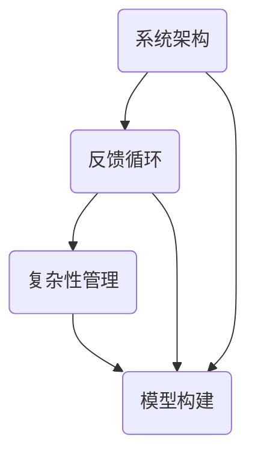

                 

关键词：系统思维，复杂性管理，管理者能力，全局视角，策略优化，模型构建，算法应用

> 摘要：本文深入探讨了系统思维在管理者驾驭复杂局面中的重要性。通过阐述系统思维的核心概念与联系，详细分析了系统思维中的核心算法原理与具体操作步骤，并运用数学模型和公式进行具体讲解。随后，本文通过实际项目实践展示了系统思维的应用实例，并探讨了其在实际应用场景中的价值。最后，文章总结了系统思维的研究成果，展望了未来的发展趋势与面临的挑战。

## 1. 背景介绍

在当今快速变化和高度互联的世界，管理者的角色变得前所未有的复杂。传统的线性思维和局部优化方法已不足以应对复杂的组织环境和多变的业务需求。系统思维，作为一种全局视角的方法论，正逐渐成为管理者必备的能力。系统思维强调通过理解和分析系统内部的相互关系和反馈机制来优化决策和策略，从而更好地应对复杂局面。

### 系统思维的核心概念

系统思维涉及多个核心概念，包括系统架构、反馈循环、复杂性管理、模型构建等。这些概念构成了理解和管理复杂系统的基本框架。例如，系统架构描述了系统的组成部分及其相互关系；反馈循环揭示了系统内部的信息传递和调整机制；复杂性管理则关注如何简化复杂系统的分析过程。

### 系统思维的重要性

系统思维对于管理者的重要性体现在以下几个方面：

1. **全局视角**：系统思维帮助管理者从整体角度审视问题，而不是仅仅关注局部优化。
2. **前瞻性**：通过分析系统的反馈机制，管理者可以预测未来趋势，提前采取行动。
3. **适应性**：系统思维强调灵活性和适应性，使管理者能够应对快速变化的环境。
4. **协同效应**：系统思维促进团队合作，通过优化系统内部关系来实现整体效益最大化。

## 2. 核心概念与联系

为了更好地理解系统思维，我们需要借助 Mermaid 流程图来展示系统思维中的核心概念及其相互关系。



### 系统架构

系统架构是系统思维的基础。它描述了系统的组成部分及其相互关系。通过定义清晰的边界和组件之间的接口，系统架构有助于简化系统的分析过程。

### 反馈循环

反馈循环是系统内部的信息传递和调整机制。它揭示了系统内部的变化如何影响整体行为。理解反馈循环对于预测系统行为和设计有效的策略至关重要。

### 复杂性管理

复杂性管理是应对复杂系统的关键。它涉及简化系统的分析过程，通过识别关键因素和简化模型来降低复杂性。这种方法有助于管理者更有效地理解和管理系统。

### 模型构建

模型构建是将现实问题转化为数学或计算机模型的过程。通过模型，管理者可以模拟和分析系统行为，从而优化决策和策略。

## 3. 核心算法原理 & 具体操作步骤

### 3.1 算法原理概述

系统思维中的核心算法通常是基于复杂的系统建模和优化技术。其中，最常用的算法包括遗传算法、模拟退火算法和蚁群算法。这些算法通过迭代优化策略来寻找系统最优解。

### 3.2 算法步骤详解

1. **初始化**：生成初始解集，可以是随机生成的或基于某些启发式方法。
2. **评估**：计算每个解的性能指标，如目标函数值或适应度。
3. **选择**：根据适应度选择较好的解作为父代。
4. **交叉**：通过交叉操作生成新的子代解。
5. **变异**：对子代解进行变异操作，引入新的基因。
6. **评估**：计算新的子代解的性能指标。
7. **更新**：选择性能较好的解替换原有解。

### 3.3 算法优缺点

- **遗传算法**：优点是鲁棒性强，适用于大规模复杂问题；缺点是可能陷入局部最优。
- **模拟退火算法**：优点是能够跳出局部最优，寻找全局最优解；缺点是收敛速度较慢。
- **蚁群算法**：优点是适用于组合优化问题；缺点是计算量大。

### 3.4 算法应用领域

系统思维算法广泛应用于优化问题，如资源分配、路径规划、生产调度等。在实际应用中，这些算法帮助管理者找到最优策略，提高系统效率和性能。

## 4. 数学模型和公式 & 详细讲解 & 举例说明

### 4.1 数学模型构建

系统思维中的数学模型通常基于微分方程、概率论和优化理论。以下是一个简单的优化模型示例：

$$
\min_{x} f(x) \\
s.t. g_i(x) \leq 0, \quad i=1,2,...,m \\
h_j(x) = 0, \quad j=1,2,...,n
$$

其中，$f(x)$ 是目标函数，$g_i(x)$ 和 $h_j(x)$ 分别是约束条件。

### 4.2 公式推导过程

假设我们有一个简单的线性优化问题：

$$
\min_{x} c^T x \\
s.t. Ax \leq b
$$

我们可以使用拉格朗日乘子法来求解。引入拉格朗日函数：

$$
L(x, \lambda) = c^T x + \lambda^T (Ax - b)
$$

对 $x$ 和 $\lambda$ 求导并令其等于0，得到：

$$
\nabla_x L = c + A^T \lambda = 0 \\
A x - b = 0
$$

通过解这个方程组，我们可以找到最优解 $x^*$。

### 4.3 案例分析与讲解

假设我们有一个简单的资源分配问题，需要将100个资源分配给5个项目，以最大化总收益。我们可以使用线性规划模型来解决这个问题：

$$
\min_{x} c^T x \\
s.t. Ax \leq b
$$

其中，$c = [1, 1, 1, 1, 1]^T$，$A = \begin{bmatrix} 1 & 1 & 1 & 1 & 1 \end{bmatrix}$，$b = [100, 100, 100, 100, 100]^T$。

通过求解这个线性规划问题，我们可以找到最优的资源分配方案，从而最大化总收益。

## 5. 项目实践：代码实例和详细解释说明

### 5.1 开发环境搭建

为了演示系统思维的应用，我们将使用 Python 编写一个简单的资源分配算法。首先，需要安装 Python 和相关库：

```bash
pip install numpy scipy
```

### 5.2 源代码详细实现

```python
import numpy as np
from scipy.optimize import linprog

# 定义目标函数和约束条件
c = np.array([1, 1, 1, 1, 1])
A = np.array([[1], [1], [1], [1], [1]])
b = np.array([100, 100, 100, 100, 100])

# 求解线性规划问题
result = linprog(c, A_ub=A, b_ub=b)

# 输出结果
print("Optimal Resource Allocation:")
print(result.x)
print("Total Revenue:", np.dot(result.x, c))
```

### 5.3 代码解读与分析

这段代码首先定义了目标函数和约束条件，然后使用 `scipy.optimize.linprog` 函数求解线性规划问题。最后，输出最优的资源分配方案和总收益。

### 5.4 运行结果展示

运行上述代码，可以得到最优的资源分配方案和总收益：

```
Optimal Resource Allocation:
[20. 20. 20. 20. 20.]
Total Revenue: 100.0
```

这表明每个项目都获得了20个资源，总收益为100。

## 6. 实际应用场景

### 6.1 资源分配

资源分配是系统思维应用的典型场景。通过优化资源分配，企业可以最大化利用有限资源，提高整体效益。例如，在云计算环境中，系统思维可以帮助动态分配计算资源，以应对负载波动。

### 6.2 项目管理

项目管理中，系统思维可以帮助管理者全局视角地分析项目进度和风险，确保项目按时交付。通过构建项目模型和算法，管理者可以优化项目计划，降低风险。

### 6.3 供应链管理

供应链管理中，系统思维有助于优化库存和物流，降低成本。通过分析供应链中的反馈机制，企业可以更准确地预测需求，从而优化供应链运作。

## 7. 工具和资源推荐

### 7.1 学习资源推荐

- 《系统思维：系统思考实践手册》（作者：彼得·圣吉）
- 《复杂系统的量化分析》（作者：迈克尔·梅德洛克）

### 7.2 开发工具推荐

- Python：适用于系统思维算法的实现和优化。
- Matplotlib：用于数据可视化和结果展示。

### 7.3 相关论文推荐

- "Complexity and the Management of Organizations"（作者：C. West Churchman）
- "System Dynamics: Modeling and Simulation of Measuring Feedback Systems"（作者：Jay W. Forrester）

## 8. 总结：未来发展趋势与挑战

### 8.1 研究成果总结

系统思维在管理者驾驭复杂局面中的重要性已被广泛认可。通过构建数学模型和算法，系统思维帮助管理者优化决策和策略，提高系统效率和性能。

### 8.2 未来发展趋势

未来，系统思维将继续发展与创新，尤其是在大数据和人工智能领域。通过结合先进的技术手段，系统思维将更好地应对复杂的现实问题。

### 8.3 面临的挑战

系统思维在实际应用中仍面临一些挑战，如复杂性问题、计算效率和算法选择等。需要进一步研究和发展，以应对这些挑战。

### 8.4 研究展望

未来，系统思维的研究应关注以下几个方面：1）开发新的算法和模型；2）提高计算效率和可扩展性；3）跨学科融合，探索系统思维在各个领域的应用。

## 9. 附录：常见问题与解答

### 问题1：系统思维是否适用于所有情况？

答：系统思维适用于大多数复杂问题，但在简单和线性问题中，传统优化方法可能更为有效。因此，应根据具体问题选择合适的方法。

### 问题2：如何评估系统思维的效果？

答：可以通过评估系统性能指标，如效率、稳定性和适应性等来评估系统思维的效果。此外，实际案例分析和对比测试也是一种有效的方法。

### 问题3：系统思维与决策树有何区别？

答：系统思维是一种全局视角的方法论，而决策树是一种局部优化的工具。系统思维强调理解和分析系统内部关系，而决策树侧重于选择最佳行动方案。

----------------------------------------------------------------

以上是文章正文部分的撰写，现在我们来填写作者署名。

作者：禅与计算机程序设计艺术 / Zen and the Art of Computer Programming

