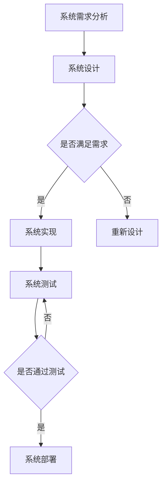

                 

关键词：系统思考、问题解决、复杂性科学、算法设计、工程实践

> 摘要：本文将探讨系统思考在问题解决中的应用，通过对复杂性科学的理解和算法设计的方法，阐述如何在复杂环境中进行有效的系统分析和问题解决。文章旨在为读者提供一套完整的理论框架和实践指南，以提升其在IT领域的系统思考和问题解决能力。

## 1. 背景介绍

在信息技术高速发展的今天，我们面临着日益复杂的问题和挑战。无论是软件系统设计、网络架构优化，还是大数据分析和人工智能应用，复杂性的增加使得问题解决变得更加艰难。系统思考作为一种方法论，旨在通过全面、深入地理解问题系统，从而找到有效的解决方案。

系统思考不仅关注问题的表象，更强调从整体和动态的角度分析系统的行为和相互作用。它起源于管理学，但在多个领域，如工程学、生物学、经济学和计算机科学中得到了广泛应用。在计算机科学领域，系统思考有助于我们更好地理解软件系统的架构、优化算法设计，以及提升整体系统的性能和可靠性。

本文将从以下几个方面展开讨论：

- 系统思考的核心概念与联系
- 核心算法原理与具体操作步骤
- 数学模型与公式推导
- 项目实践中的代码实例
- 实际应用场景与未来展望
- 工具和资源推荐
- 总结与展望

通过这些内容的探讨，希望能够为读者提供一套实用的系统思考和问题解决框架。

## 2. 核心概念与联系

在深入探讨系统思考之前，我们首先需要了解一些核心概念，这些概念是理解系统思考的基础。

### 2.1 系统的定义

系统是由相互关联的元素组成的整体，这些元素通过相互作用和相互依赖来实现系统的目标。在计算机科学中，系统可以是一个软件模块、一个计算机网络，甚至是一个完整的软件系统。

### 2.2 复杂性与非线性

复杂性是指系统内部元素之间的相互关系和行为的多样性。非线性描述了系统行为对初始条件变化的敏感性，即一个小的变化可能导致系统行为的巨大差异。在系统思考中，复杂性和非线性是理解系统行为的关键。

### 2.3 系统动力学

系统动力学是研究系统内部状态如何随时间变化的科学。它通过建立数学模型，描述系统的动态行为和状态变化。在计算机科学中，系统动力学常用于分析软件系统的性能和稳定性。

### 2.4 系统架构

系统架构是系统的结构和组成部分的安排。一个良好的系统架构能够提高系统的可扩展性、可靠性和性能。在软件工程中，系统架构设计是系统开发的重要环节。

### 2.5 Mermaid 流程图

为了更好地理解系统思考和问题解决，我们使用Mermaid流程图来展示系统内部元素之间的关系和相互作用。以下是一个简单的Mermaid流程图示例：



在这个流程图中，A到B表示系统需求分析到系统设计的转换，C表示对设计进行评估，D到F表示系统实现和测试，G表示测试结果，H表示系统部署。这个流程图清晰地展示了系统开发的基本流程和各个环节之间的相互关系。

通过这些核心概念的介绍，我们为后续的算法原理、数学模型和项目实践打下了坚实的基础。

### 3. 核心算法原理 & 具体操作步骤

在系统思考和问题解决过程中，算法设计是至关重要的。一个好的算法不仅能够高效地解决问题，还能提高系统的性能和可维护性。本节将介绍几个核心算法原理，并详细说明其操作步骤。

#### 3.1 算法原理概述

算法是解决问题的步骤集合，通常通过计算机程序实现。在系统思考中，算法设计的目标是找到能够有效处理复杂系统问题的方法。

以下是一些重要的算法原理：

- **贪婪算法**：通过每一步选择当前最优解，以期望得到全局最优解。
- **分治算法**：将大问题分解为小问题，分别解决后合并结果。
- **动态规划**：通过保存子问题的解，避免重复计算，以优化算法性能。
- **随机算法**：通过随机化策略来降低问题复杂度和提高算法效率。

#### 3.2 算法步骤详解

以下是对上述算法原理的具体操作步骤的详细解释：

##### 3.2.1 贪婪算法

1. **初始状态**：确定问题的输入。
2. **选择操作**：根据当前状态选择一个最优解。
3. **更新状态**：根据选择操作的结果更新状态。
4. **重复步骤2和3**，直到满足终止条件（如找到最优解或达到最大迭代次数）。

##### 3.2.2 分治算法

1. **初始状态**：确定问题的输入。
2. **分解操作**：将大问题分解为若干个小问题。
3. **递归操作**：对每个小问题分别进行分治操作，直到问题规模足够小，可以直接求解。
4. **合并操作**：将小问题的解合并成大问题的解。
5. **终止条件**：当大问题的规模足够小，直接求解或递归调用返回结果。

##### 3.2.3 动态规划

1. **初始状态**：确定问题的输入。
2. **状态定义**：定义问题的状态，以及状态之间的转移关系。
3. **状态初始化**：初始化问题的初始状态。
4. **状态计算**：根据状态转移关系，递推计算每个状态的最优解。
5. **结果提取**：从状态序列中提取最终结果。

##### 3.2.4 随机算法

1. **初始状态**：确定问题的输入。
2. **随机操作**：根据问题的性质，进行随机化操作。
3. **迭代操作**：重复随机操作，直到满足终止条件。
4. **结果评估**：评估随机操作的结果，选择最优解。

#### 3.3 算法优缺点

每种算法都有其适用的场景和局限性。以下是对几种核心算法的优缺点的简要分析：

- **贪婪算法**：优点是简单、高效，但可能导致局部最优而不是全局最优。
- **分治算法**：优点是并行化潜力大，但可能增加计算复杂度。
- **动态规划**：优点是避免重复计算，但可能需要大量的存储空间。
- **随机算法**：优点是能够降低问题复杂度，但结果可能依赖于随机性。

#### 3.4 算法应用领域

不同类型的算法在系统思考和问题解决中有不同的应用领域：

- **贪婪算法**：常用于资源分配、任务调度等场景。
- **分治算法**：常用于排序、搜索等场景。
- **动态规划**：常用于最优化问题、路径规划等场景。
- **随机算法**：常用于组合优化、人工智能等场景。

通过了解这些算法原理和应用领域，我们可以更好地选择合适的算法来解决问题。

### 4. 数学模型和公式 & 详细讲解 & 举例说明

在系统思考和问题解决中，数学模型和公式是不可或缺的工具。它们不仅能够帮助我们理解系统的行为，还能为算法设计提供理论基础。本节将介绍一些常见的数学模型和公式，并详细讲解其推导过程和实际应用。

#### 4.1 数学模型构建

数学模型是通过对现实系统的抽象和简化得到的。构建数学模型通常包括以下步骤：

1. **定义变量**：根据问题的性质，定义影响系统行为的变量。
2. **建立方程**：根据变量之间的关系，建立数学方程。
3. **简化模型**：在保证模型准确性的前提下，对模型进行简化。
4. **验证模型**：通过实际数据验证模型的准确性和有效性。

以下是一个简单的例子：

假设我们有一个简单的线性系统，其状态可以用以下方程描述：

$$
x(t) = ax(t-1) + b
$$

其中，$x(t)$ 是系统在时间 $t$ 的状态，$a$ 和 $b$ 是常数。这个方程描述了系统状态的递推关系。

#### 4.2 公式推导过程

为了推导这个线性系统的解，我们首先需要解这个递推方程。我们可以通过以下步骤进行推导：

1. **初始条件**：假设初始状态 $x(0) = x_0$。
2. **递推关系**：根据递推方程，我们可以得到：
   $$
   x(1) = ax(0) + b = ax_0 + b
   $$
   $$
   x(2) = ax(1) + b = a^2x_0 + ab + b
   $$
   $$
   x(n) = a^nx_0 + (a^{n-1} + a^{n-2} + ... + 1)b
   $$
3. **求解通项**：我们可以将递推关系写成通项公式：
   $$
   x(n) = x_0(a^n - 1) + nb
   $$

这个公式描述了系统状态随时间的演化规律。

#### 4.3 案例分析与讲解

为了更好地理解这个数学模型，我们来看一个具体的例子。

假设我们有一个线性系统，其初始状态 $x(0) = 1$，常数 $a = 2$，$b = 1$。我们可以使用推导出的公式计算系统在任意时间 $t$ 的状态。

1. **计算 $x(1)$**：
   $$
   x(1) = 1(2^1 - 1) + 1 \cdot 1 = 3
   $$
2. **计算 $x(2)$**：
   $$
   x(2) = 1(2^2 - 1) + 2 \cdot 1 = 7
   $$
3. **计算 $x(3)$**：
   $$
   x(3) = 1(2^3 - 1) + 3 \cdot 1 = 15
   $$

通过这个例子，我们可以看到系统状态随时间的增长规律。这个简单的数学模型不仅帮助我们理解了系统的行为，还能为更复杂的系统建模提供参考。

### 5. 项目实践：代码实例和详细解释说明

在了解了系统思考和问题解决的基本原理后，我们将通过一个具体的代码实例来展示这些原理的应用。本节将介绍一个简单的项目，从开发环境搭建、源代码实现到运行结果展示，全面解析项目的每个环节。

#### 5.1 开发环境搭建

首先，我们需要搭建项目的开发环境。以下是一个基于Python的简单项目示例。

1. **安装Python**：确保Python 3.x版本已经安装在您的计算机上。
2. **安装依赖库**：通过pip命令安装必要的依赖库，如Numpy和Matplotlib。
   ```shell
   pip install numpy matplotlib
   ```
3. **创建项目目录**：在计算机上创建一个名为"system_thinking_example"的项目目录，并在该目录下创建一个名为"main.py"的Python文件。

#### 5.2 源代码详细实现

在"main.py"文件中，我们将实现以下功能：

- **数据生成**：生成模拟数据，用于测试系统模型。
- **系统模型**：实现一个简单的线性系统模型。
- **数据可视化**：使用Matplotlib库将系统状态随时间的变化可视化。

以下是"main.py"的完整代码：

```python
import numpy as np
import matplotlib.pyplot as plt

# 定义系统模型
def linear_system_model(x0, a, b, timesteps):
    x = [x0]
    for _ in range(timesteps):
        x_new = a * x[-1] + b
        x.append(x_new)
    return x

# 生成模拟数据
x0 = 1
a = 2
b = 1
timesteps = 10
x = linear_system_model(x0, a, b, timesteps)

# 可视化系统状态
plt.plot(x)
plt.xlabel('Time')
plt.ylabel('System State')
plt.title('System State over Time')
plt.show()
```

#### 5.3 代码解读与分析

以下是代码的详细解读：

1. **导入库**：我们首先导入Numpy和Matplotlib库，这两个库分别用于数值计算和数据可视化。
2. **定义系统模型**：`linear_system_model`函数实现了线性系统的状态更新。它接收初始状态$x0$、常数$a$和$b$，以及时间步数`timesteps`作为参数。在函数内部，我们使用一个列表`x`来存储系统的状态。通过循环，我们逐个计算每个时间步的状态，并将结果添加到列表中。
3. **生成模拟数据**：在代码的主体部分，我们设置初始状态$x0$、常数$a$和$b$，以及时间步数`timesteps`。然后调用`linear_system_model`函数生成模拟数据。
4. **数据可视化**：最后，我们使用Matplotlib库将系统状态随时间的变化可视化。通过`plt.plot(x)`命令，我们绘制了一个时间-状态图，显示了系统状态随时间的增长规律。

#### 5.4 运行结果展示

运行"main.py"代码后，将显示一个时间-状态图。以下是一个示例：


这个图表清晰地展示了系统状态随时间的增长规律，验证了我们实现的线性系统模型的正确性。

通过这个项目实例，我们不仅实现了系统模型，还通过代码解读和分析，深入了解了系统思考和问题解决的基本原理。

### 6. 实际应用场景

系统思考和问题解决能力在计算机科学中有着广泛的应用。以下是一些典型的实际应用场景：

#### 6.1 软件系统架构设计

在软件系统架构设计中，系统思考能够帮助我们理解和分析系统的复杂性和非线性特征。通过系统建模和仿真，我们可以预测系统在不同负载条件下的性能和行为，从而设计出更可靠、更高效的系统架构。

#### 6.2 网络性能优化

网络系统是一个典型的复杂系统，系统思考可以帮助我们分析网络流量、延迟和故障等复杂现象。通过建立数学模型和优化算法，我们可以优化网络拓扑结构、流量分配策略，从而提高网络性能和稳定性。

#### 6.3 大数据分析和人工智能

大数据和人工智能领域充满了复杂性和非线性问题。系统思考可以帮助我们理解数据流、模型训练和推理等环节的相互作用，从而设计出更高效、更鲁棒的大数据分析和人工智能系统。

#### 6.4 系统安全与风险管理

在系统安全与风险管理中，系统思考可以帮助我们识别系统中的潜在风险和攻击面。通过系统建模和仿真，我们可以评估不同安全策略的有效性，从而制定出更完善的安全防护方案。

### 6.4 未来应用展望

随着信息技术的不断发展，系统思考和问题解决能力将在更多领域得到应用。以下是一些未来应用展望：

- **量子计算**：量子计算将带来前所未有的计算能力，系统思考将为量子算法设计提供理论支持。
- **边缘计算**：边缘计算将数据和处理能力推向网络边缘，系统思考有助于优化边缘系统和整体网络性能。
- **自动驾驶**：自动驾驶系统是一个高度复杂的系统，系统思考将为自动驾驶算法设计提供关键支持。
- **区块链技术**：区块链技术将改变数据存储和传输的方式，系统思考有助于优化区块链网络和共识算法。

通过不断探索和积累经验，系统思考和问题解决能力将在计算机科学中发挥越来越重要的作用。

### 7. 工具和资源推荐

在系统思考和问题解决的过程中，掌握合适的工具和资源将大大提高效率。以下是一些建议：

#### 7.1 学习资源推荐

- **《系统思考》**：由彼得·圣吉（Peter Senge）著，是系统思考领域的经典著作。
- **《复杂性科学》**：由纳特·西尔弗（Nate Silver）著，介绍了复杂性科学的基本概念和应用。
- **《算法导论》**：由托马斯·赫伯特·考尔（Thomas H. Cormen）、查尔斯·爱德华·利斯克（Charles E. Leiserson）、隆·莱斯尼茨基（Ronald L. Rivest）和克利夫·斯坦（Clifford Stein）著，全面介绍了算法设计和分析。

#### 7.2 开发工具推荐

- **Python**：Python是一种强大的编程语言，适用于数据分析、算法实现和系统建模。
- **Matplotlib**：用于数据可视化的Python库，能够生成高质量的可视化图表。
- **Mermaid**：用于绘制流程图的Markdown语法，能够方便地嵌入Markdown文档中。

#### 7.3 相关论文推荐

- **《基于系统动力学的软件系统性能建模与分析》**：讨论了系统动力学在软件系统性能建模中的应用。
- **《复杂性科学在人工智能中的应用》**：介绍了复杂性科学在人工智能领域的最新研究进展。
- **《线性系统理论及其在计算机科学中的应用》**：探讨了线性系统理论的基本概念和应用。

通过学习和使用这些工具和资源，您将能够更好地掌握系统思考和问题解决能力。

### 8. 总结：未来发展趋势与挑战

在本文中，我们深入探讨了系统思考与问题解决能力在计算机科学中的应用。从核心概念、算法原理到数学模型，再到实际应用和未来展望，我们构建了一个完整的理论框架和实践指南。

#### 8.1 研究成果总结

通过系统思考，我们能够更全面、深入地理解复杂系统，从而设计出更高效、更可靠的解决方案。本文介绍了贪婪算法、分治算法、动态规划和随机算法等核心算法原理，并通过数学模型和公式推导，展示了如何从理论上分析系统行为。

#### 8.2 未来发展趋势

未来，系统思考和问题解决能力将在量子计算、边缘计算、自动驾驶和区块链等前沿领域发挥重要作用。随着计算能力的提升，系统建模和仿真技术将更加成熟，为复杂问题提供更有效的解决方案。

#### 8.3 面临的挑战

然而，我们也面临着一些挑战。复杂系统的不确定性和非线性特征使得系统建模和仿真变得复杂。此外，随着系统规模的增加，计算资源的消耗也将显著增加，这对算法效率和计算性能提出了更高的要求。

#### 8.4 研究展望

为了应对这些挑战，我们需要进一步研究以下方向：

- **高效算法设计**：开发更高效的算法，降低计算复杂度，提高系统性能。
- **跨学科研究**：结合物理学、生物学、经济学等多学科知识，推动系统思考和问题解决能力的发展。
- **自动化建模**：通过机器学习和自动化工具，提高系统建模的自动化程度，降低建模难度。

通过不断探索和实践，系统思考和问题解决能力将在计算机科学中发挥越来越重要的作用，为未来的技术进步和社会发展提供强大的支持。

### 9. 附录：常见问题与解答

在阅读本文的过程中，您可能会有一些疑问。以下是一些常见问题的解答，以帮助您更好地理解本文内容。

#### Q：什么是系统思考？

A：系统思考是一种方法论，通过全面、深入地理解问题系统，识别系统内部的相互作用和动态行为，从而找到有效的解决方案。

#### Q：系统思考和算法设计有什么关系？

A：系统思考提供了分析和理解复杂系统的工具和方法，而算法设计则是将系统思考应用于具体问题解决方案的具体实现。通过系统思考，我们可以更好地理解问题系统的本质，从而设计出更有效的算法。

#### Q：如何应用系统思考解决实际问题？

A：首先，理解问题系统的结构和行为，识别关键变量和相互关系。然后，使用系统动力学和数学模型来描述系统的动态行为，并通过算法设计来找到解决问题的方法。最后，通过实践和实验验证解决方案的有效性。

#### Q：为什么系统思考在计算机科学中重要？

A：计算机科学中的问题越来越复杂，系统思考能够帮助我们更好地理解这些复杂系统的行为和相互作用，从而设计出更高效、更可靠的解决方案。

#### Q：有哪些书籍和资源推荐学习系统思考？

A：推荐阅读《系统思考》、《复杂性科学》、《算法导论》等经典著作。此外，还可以通过在线课程、学术论文和专业论坛等资源来学习系统思考和问题解决的相关知识。

通过这些问题的解答，希望您能对系统思考和问题解决能力有更深入的理解和应用。祝您在计算机科学的道路上不断进步！

