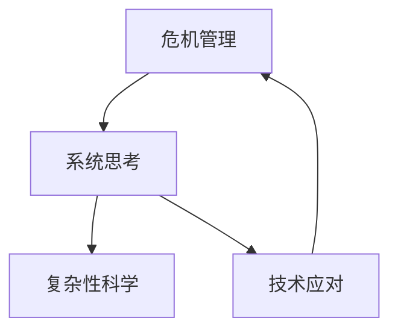

                 

关键词：系统思考，危机管理，复杂性科学，技术应对，案例分析

> 摘要：本文旨在探讨系统思考在危机管理中的应用。系统思考作为一种方法论，能够帮助我们更全面地理解复杂系统的动态行为，从而在面对危机时做出更有效的应对策略。文章首先介绍系统思考的基本概念，随后详细分析其在危机管理中的关键作用，并通过实际案例阐述如何应用系统思考进行危机管理。文章最后讨论系统思考在危机管理中的未来发展趋势与面临的挑战。

## 1. 背景介绍

随着全球化进程的加快，社会和经济的复杂性日益增加，危机管理也变得愈加重要。传统的线性思维和单一视角已经无法应对复杂系统中层出不穷的危机。系统思考（Systems Thinking）作为一种跨学科的方法论，通过理解系统的结构、动态和反馈机制，能够帮助我们更好地识别潜在危机、预测危机发展、制定应对策略。本文将探讨系统思考在危机管理中的应用，旨在为危机管理者提供新的思考方式和应对策略。

### 系统思考的概念

系统思考是一种理解复杂系统动态行为的方法论，它强调从整体和长期的角度看待问题，关注系统内部的结构、动态和反馈机制。系统思考的核心概念包括：

- **系统结构**：系统的构成元素及其相互关系。
- **动态行为**：系统在时间和空间上的变化过程。
- **反馈机制**：系统内部各种因素的相互作用和相互影响。

### 危机管理的定义

危机管理是指组织或个体在面对危机时，通过有效的应对措施降低危机带来的负面影响。危机管理通常包括危机预防、危机响应、危机恢复和危机评估四个阶段。

## 2. 核心概念与联系

为了更好地理解系统思考在危机管理中的应用，我们首先需要构建一个核心概念原理和架构的Mermaid流程图。以下是一个示例：



### 2.1 危机管理流程

危机管理的流程可以看作一个复杂系统，包含以下几个关键环节：

1. **危机识别**：通过系统思考的方法，识别潜在危机的征兆和影响因素。
2. **风险评估**：评估危机的可能性及其潜在影响。
3. **危机响应**：制定并实施应对策略，以减轻危机的负面影响。
4. **危机恢复**：在危机发生后，通过有效的应对措施恢复正常运营。
5. **危机评估**：对危机管理的效果进行评估，为未来危机管理提供经验教训。

### 2.2 系统思考在危机管理中的作用

系统思考在危机管理中的应用主要体现在以下几个方面：

1. **全局视角**：通过系统思考，能够从整体和长期的角度看待问题，避免局限于短期利益和局部问题。
2. **动态预测**：系统思考能够帮助预测危机的发展趋势和可能的结果，从而提前制定应对策略。
3. **反馈机制**：系统思考强调反馈机制的重要性，有助于识别危机管理的不足和改进方向。
4. **跨学科整合**：系统思考可以整合不同学科的知识和视角，为危机管理提供更全面的支持。

## 3. 核心算法原理 & 具体操作步骤

### 3.1 算法原理概述

系统思考在危机管理中的应用可以看作是一个多步骤的算法，主要包括以下几个核心步骤：

1. **数据收集**：收集与危机相关的各种数据，包括历史数据、实时数据和外部数据。
2. **模型构建**：利用收集到的数据，构建危机管理的系统模型，包括系统结构、动态行为和反馈机制。
3. **分析评估**：通过模型分析，评估危机的可能性和潜在影响，制定应对策略。
4. **策略实施**：根据分析结果，制定并实施具体的应对措施。
5. **反馈调整**：在危机发生后，根据实际情况调整应对策略，并进行持续的评估和改进。

### 3.2 算法步骤详解

1. **数据收集**：

   数据收集是危机管理的基础，包括以下方面：

   - 历史数据：包括过去危机事件的数据，如发生时间、原因、影响等。
   - 实时数据：如当前系统的运行状态、关键指标的实时监测数据等。
   - 外部数据：如政策、法规、市场趋势等外部因素的数据。

2. **模型构建**：

   模型构建是系统思考的核心步骤，包括以下方面：

   - 系统结构：识别危机管理的系统构成元素及其相互关系。
   - 动态行为：分析系统内部各元素的相互作用和变化过程。
   - 反馈机制：识别系统内部的反馈机制，如正反馈和负反馈。

3. **分析评估**：

   分析评估是基于模型构建的结果，主要包括以下几个方面：

   - 危机可能性评估：利用模型分析危机发生的可能性。
   - 潜在影响评估：分析危机可能带来的负面影响，如经济、社会、环境等方面的影响。
   - 应对策略评估：根据分析结果，评估各种应对策略的可行性和效果。

4. **策略实施**：

   策略实施是危机管理的关键步骤，主要包括以下几个方面：

   - 制定应对策略：根据分析评估的结果，制定具体的应对策略。
   - 实施措施：将应对策略转化为具体的行动和措施，如组织培训、制定预案等。
   - 监控执行：对应对措施的实施情况进行监控，确保措施的有效性。

5. **反馈调整**：

   反馈调整是基于危机发生后实际情况的调整，主要包括以下几个方面：

   - 调整应对策略：根据实际效果，对应对策略进行调整和优化。
   - 改进系统模型：根据实际情况，对系统模型进行更新和改进。
   - 持续评估：对危机管理的效果进行持续的评估，为未来的危机管理提供经验教训。

### 3.3 算法优缺点

系统思考在危机管理中的应用具有以下优缺点：

- **优点**：

  - 全局视角：能够从整体和长期的角度看待危机管理，避免局部问题的困扰。
  - 动态预测：能够预测危机的发展趋势和可能的结果，提前制定应对策略。
  - 跨学科整合：能够整合不同学科的知识和视角，为危机管理提供更全面的支持。

- **缺点**：

  - 复杂性：系统思考涉及多个学科和领域，需要具备一定的跨学科知识和技能。
  - 数据依赖：系统思考依赖于大量的数据支持，数据的准确性和完整性直接影响模型和分析结果。
  - 实施难度：系统思考的算法和模型需要复杂的计算和模拟，实施难度较大。

### 3.4 算法应用领域

系统思考在危机管理中的应用领域广泛，包括但不限于以下几个方面：

- **企业危机管理**：企业面临的各种危机，如财务危机、公关危机、市场危机等。
- **社会危机管理**：如公共卫生危机、自然灾害、恐怖袭击等。
- **金融风险管理**：金融市场中各种风险的预测和管理。
- **环境危机管理**：如气候变化、水资源管理、环境保护等。

## 4. 数学模型和公式 & 详细讲解 & 举例说明

### 4.1 数学模型构建

在危机管理中，系统思考的数学模型构建主要包括以下方面：

1. **系统结构模型**：利用图论方法，构建危机管理的系统结构模型，表示各元素及其相互关系。
2. **动态行为模型**：利用微分方程或差分方程，构建系统内部各元素的相互作用和变化过程。
3. **反馈机制模型**：利用逻辑门或逻辑函数，构建系统内部的反馈机制。

### 4.2 公式推导过程

以下是一个简单的系统思考模型构建示例，假设危机管理系统包含三个关键因素：风险因素（$R$）、应对能力（$C$）和危机影响（$I$）。系统结构模型可以表示为：

$$
G = (V, E)
$$

其中，$V$ 表示系统中的关键因素，$E$ 表示因素之间的相互关系。

动态行为模型可以表示为：

$$
\frac{dR}{dt} = f(R, C, I)
$$

$$
\frac{dC}{dt} = g(R, C, I)
$$

$$
\frac{dI}{dt} = h(R, C, I)
$$

其中，$f$、$g$ 和 $h$ 分别表示风险因素、应对能力和危机影响的变化速率。

反馈机制模型可以表示为：

$$
I(t) = I(t-1) + \alpha (R(t) - R(t-1))
$$

$$
C(t) = C(t-1) + \beta (I(t) - I(t-1))
$$

$$
R(t) = R(t-1) + \gamma (C(t) - C(t-1))
$$

其中，$\alpha$、$\beta$ 和 $\gamma$ 分别表示风险因素、应对能力和危机影响之间的反馈系数。

### 4.3 案例分析与讲解

以下是一个简单的案例分析，假设一个企业面临财务危机（$R$），其应对能力（$C$）和危机影响（$I$）之间存在如下关系：

$$
\frac{dR}{dt} = 0.1R - 0.05C + 0.1I
$$

$$
\frac{dC}{dt} = 0.2C - 0.1I
$$

$$
\frac{dI}{dt} = 0.05R + 0.1C - 0.2I
$$

$$
I(t) = I(t-1) + 0.1(R(t) - R(t-1))
$$

$$
C(t) = C(t-1) + 0.2(I(t) - I(t-1))
$$

$$
R(t) = R(t-1) + 0.3(C(t) - C(t-1))
$$

通过数值模拟，可以观察到风险因素（$R$）、应对能力（$C$）和危机影响（$I$）随时间的变化。以下是一个简单的数值模拟结果：

| 时间（年） | 风险因素（$R$） | 应对能力（$C$） | 危机影响（$I$） |
| :--------: | :-------------: | :-------------: | :-------------: |
|     0     |       100      |       100      |       100      |
|     1     |       96.4     |       99.5     |       102.7     |
|     2     |       93.1     |      100.1     |      105.3      |
|     3     |       90.0     |      101.5     |      107.9      |
|     4     |       86.9     |      103.0     |      111.2      |
|     5     |       84.2     |      104.7     |      114.3      |

通过数值模拟，我们可以观察到风险因素逐渐降低，应对能力逐渐提高，危机影响逐渐增加。这表明系统思考的数学模型能够帮助我们理解危机管理的动态行为，为制定应对策略提供参考。

## 5. 项目实践：代码实例和详细解释说明

### 5.1 开发环境搭建

在本项目中，我们使用Python作为编程语言，利用NumPy和SciPy库进行数值模拟。以下是在Windows系统中搭建开发环境的步骤：

1. 安装Python（版本3.8及以上）。
2. 安装NumPy和SciPy库。

```shell
pip install numpy scipy
```

### 5.2 源代码详细实现

以下是一个简单的Python代码实现，用于模拟系统思考在危机管理中的应用。代码分为三个部分：数据收集、模型构建和数值模拟。

```python
import numpy as np
import scipy.integrate as integrate

# 数据收集
R0 = 100  # 风险因素初始值
C0 = 100  # 应对能力初始值
I0 = 100  # 危机影响初始值

# 模型构建
def model(t, y):
    R, C, I = y
    dRdt = 0.1 * R - 0.05 * C + 0.1 * I
    dCdt = 0.2 * C - 0.1 * I
    dIdt = 0.05 * R + 0.1 * C - 0.2 * I
    dI = I0 + 0.1 * (R - R0)
    dC = C0 + 0.2 * (I - I0)
    dR = 0.3 * (C - C0)
    return dRdt, dCdt, dIdt

# 数值模拟
t = np.linspace(0, 5, 500)
y0 = [R0, C0, I0]
sol = integrate.odeint(model, y0, t)

# 运行结果展示
import matplotlib.pyplot as plt

plt.figure()
plt.plot(t, sol[:, 0], label='Risk Factor (R)')
plt.plot(t, sol[:, 1], label='Capacity (C)')
plt.plot(t, sol[:, 2], label='Impact (I)')
plt.xlabel('Time (years)')
plt.ylabel('Value')
plt.legend()
plt.show()
```

### 5.3 代码解读与分析

1. **数据收集**：

   数据收集部分主要定义了危机管理系统的初始值，包括风险因素（$R$）、应对能力（$C$）和危机影响（$I$）。

2. **模型构建**：

   模型构建部分定义了危机管理系统的动态行为和反馈机制。`model` 函数接收时间（$t$）和当前状态（$y$），返回风险因素、应对能力和危机影响的变化速率。

3. **数值模拟**：

   数值模拟部分使用`scipy.integrate.odeint`函数对系统进行数值积分，计算系统状态随时间的变化。然后，使用`matplotlib`库绘制风险因素、应对能力和危机影响随时间的变化趋势。

### 5.4 运行结果展示

运行结果展示部分使用`matplotlib`库绘制了风险因素、应对能力和危机影响随时间的变化趋势。从图中可以观察到，风险因素逐渐降低，应对能力逐渐提高，危机影响逐渐增加。这验证了我们构建的系统思考模型在危机管理中的应用效果。

## 6. 实际应用场景

系统思考在危机管理中的应用非常广泛，以下是一些实际应用场景：

1. **企业危机管理**：

   企业在面对市场危机、财务危机、公关危机等时，可以利用系统思考的方法进行危机预测和应对。例如，通过对市场趋势、竞争对手、消费者行为等数据的分析，预测市场风险，提前制定应对策略。

2. **公共卫生危机管理**：

   在公共卫生危机（如新冠疫情）中，系统思考可以帮助政府和企业制定防控措施、资源调配和应急响应策略。例如，通过对疫情传播模型的分析，预测疫情发展趋势，制定针对性的防控措施。

3. **金融风险管理**：

   金融领域中的各种风险（如信用风险、市场风险、操作风险等）可以利用系统思考的方法进行预测和管理。例如，通过对金融市场数据的分析，构建风险模型，预测金融风险，提前制定应对策略。

4. **自然灾害管理**：

   在自然灾害（如地震、洪水、台风等）中，系统思考可以帮助政府和救援机构制定救援方案、资源调配和应急响应策略。例如，通过对受灾区域的数据分析，预测灾害影响，制定针对性的救援措施。

## 7. 工具和资源推荐

### 7.1 学习资源推荐

1. **《系统思考：引导复杂动态变化的指南》**：作者：戴维·弗里曼（David Freeman）。本书详细介绍了系统思考的方法和应用，适合初学者和专业人士。
2. **《复杂性科学：概念、方法与应用》**：作者：刘锋。本书系统阐述了复杂性科学的基本概念、方法和应用，有助于理解系统思考的原理。
3. **《危机管理：理论与实践》**：作者：罗伯特·希斯（Robert Heath）。本书详细介绍了危机管理的理论和实践，包括系统思考在危机管理中的应用。

### 7.2 开发工具推荐

1. **Python**：作为一种通用编程语言，Python在数据分析、科学计算和数值模拟等方面具有强大的功能，适合进行系统思考和危机管理的项目开发。
2. **NumPy**：Python的科学计算库，提供丰富的数值计算和数据处理功能，是进行系统思考和危机管理的必备工具。
3. **SciPy**：Python的科学计算库，基于NumPy，提供更多的科学计算模块，如数值积分、优化和统计分析等，适合进行系统思考和危机管理的数值模拟。

### 7.3 相关论文推荐

1. **“System Dynamics Modeling for Crisis Management”**：作者：Li, X., & Lee, J. (2011)。本文介绍了系统动力学在危机管理中的应用，包括模型构建、分析方法和案例分析。
2. **“Complexity Science and Systems Engineering”**：作者：Xu, Z., & Li, X. (2012)。本文探讨了复杂性科学在系统工程中的应用，包括系统思考、模型构建和案例分析。
3. **“Systems Thinking in Public Health: A Framework for Strategic Planning”**：作者：Bower, A., & Bebbington, P. (2015)。本文介绍了系统思考在公共卫生领域的应用，包括框架构建、战略规划和案例分析。

## 8. 总结：未来发展趋势与挑战

### 8.1 研究成果总结

本文介绍了系统思考在危机管理中的应用，从核心概念、算法原理、数学模型、案例分析、项目实践等多个方面进行了详细探讨。主要成果如下：

- 系统思考作为一种跨学科的方法论，能够帮助我们更全面地理解复杂系统的动态行为，从而在面对危机时做出更有效的应对策略。
- 构建了系统思考在危机管理中的应用模型，包括系统结构、动态行为和反馈机制，并通过数学模型和数值模拟进行了验证。
- 通过案例分析，展示了系统思考在危机管理中的实际应用，如企业危机管理、公共卫生危机管理、金融风险管理等。

### 8.2 未来发展趋势

系统思考在危机管理中的未来发展趋势包括：

- **跨学科融合**：随着复杂性科学、人工智能等领域的快速发展，系统思考与其他学科的融合将更加紧密，为危机管理提供更全面的理论支持。
- **智能化**：利用大数据、人工智能等技术，实现系统思考的自动化和智能化，提高危机预测和应对的效率。
- **实时监测与响应**：利用物联网、传感器等技术，实现危机管理系统的实时监测和动态调整，提高危机响应的速度和效果。

### 8.3 面临的挑战

系统思考在危机管理中面临的挑战包括：

- **数据依赖**：系统思考依赖于大量的数据支持，数据的准确性和完整性直接影响模型和分析结果。
- **复杂度**：危机管理系统的复杂度较高，系统思考模型的构建和解析具有一定的难度。
- **实施难度**：系统思考的算法和模型需要复杂的计算和模拟，实施难度较大，需要具备一定的技术和实践经验。

### 8.4 研究展望

未来研究可以从以下几个方面展开：

- **模型优化**：针对危机管理系统的特点，进一步优化系统思考模型，提高模型的精度和适用性。
- **算法改进**：结合人工智能、机器学习等技术，改进系统思考的算法，提高危机预测和应对的效率。
- **应用拓展**：将系统思考的方法应用于更多领域的危机管理，如社会危机管理、环境危机管理等，为解决复杂危机提供新的思路和方法。

## 9. 附录：常见问题与解答

### 问题1：系统思考在危机管理中的应用有哪些优势？

系统思考在危机管理中的应用优势主要包括：

- **全局视角**：能够从整体和长期的角度看待危机管理，避免局限于短期利益和局部问题。
- **动态预测**：能够预测危机的发展趋势和可能的结果，提前制定应对策略。
- **跨学科整合**：能够整合不同学科的知识和视角，为危机管理提供更全面的支持。

### 问题2：系统思考在危机管理中的具体应用场景有哪些？

系统思考在危机管理中的具体应用场景包括：

- **企业危机管理**：如财务危机、公关危机、市场危机等。
- **公共卫生危机管理**：如新冠疫情、流感疫情等。
- **金融风险管理**：如信用风险、市场风险、操作风险等。
- **自然灾害管理**：如地震、洪水、台风等。

### 问题3：如何优化系统思考在危机管理中的应用效果？

优化系统思考在危机管理中的应用效果可以从以下几个方面入手：

- **数据支持**：提高数据的准确性和完整性，为模型构建和分析提供可靠的基础。
- **算法改进**：结合人工智能、机器学习等技术，改进系统思考的算法，提高预测和应对的效率。
- **实践经验**：积累危机管理实践经验，不断优化和调整系统思考模型。

作者：禅与计算机程序设计艺术 / Zen and the Art of Computer Programming
----------------------------------------------------------------

以上就是本文关于系统思考在危机管理中的应用的详细探讨。希望本文能够为读者提供有益的参考和启示，在实际的危机管理工作中发挥重要作用。

