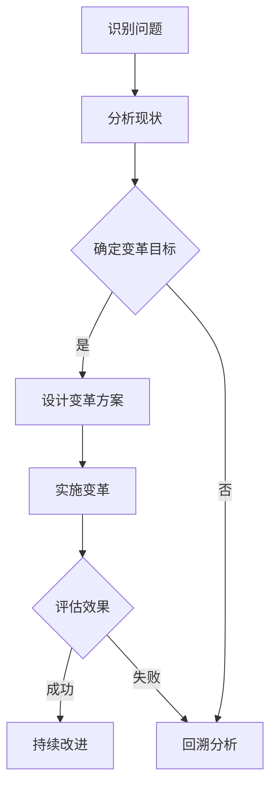

                 

关键词：系统思考、组织变革、企业战略、管理创新、信息技术

> 摘要：本文旨在探讨系统思考在组织变革中的应用，分析其在企业战略管理、管理创新以及信息技术领域的实践与价值。通过深入阐述系统思考的核心概念、方法论和实际操作步骤，为企业和组织提供一套系统化的变革管理工具，以期在快速变化的市场环境中，实现组织的持续优化与成长。

## 1. 背景介绍

随着全球经济的快速发展和市场竞争的日益激烈，企业面临着前所未有的挑战。传统的管理思维和方法已经难以满足组织变革的需求。在这一背景下，系统思考作为一种全新的管理理念和方法，逐渐受到广泛关注。系统思考强调整体性、动态性和相互关联性，认为任何系统都是一个相互作用的整体，系统的行为取决于其组成部分之间的相互作用和反馈。

在组织变革中，系统思考具有独特的优势。首先，它能够帮助企业从整体上理解组织的运作机制，识别变革的关键因素和潜在风险。其次，系统思考提供了多种工具和方法，如系统动力学模型、因果回路图等，可以帮助管理者有效地分析和解决问题。最后，系统思考强调持续改进和创新，有助于企业适应不断变化的外部环境。

## 2. 核心概念与联系

### 2.1. 系统思考的核心概念

系统思考是一种从整体角度看待问题的思考方式，其核心概念包括以下几个方面：

- **整体性**：系统思考认为，系统的行为和特性不仅取决于其组成部分，还取决于各部分之间的相互作用和关系。
- **动态性**：系统思考强调，系统的行为是随时间变化的，需要从动态的角度来分析问题。
- **相互关联性**：系统思考认为，系统中的各个组成部分是相互关联的，一个部分的变化会影响其他部分，甚至整个系统的行为。

### 2.2. 系统思考与组织变革的联系

组织变革本质上是一个系统变革的过程，涉及到组织的各个方面，如战略、文化、流程、人员等。系统思考为组织变革提供了以下几方面的联系：

- **战略规划**：系统思考有助于企业从整体上理解战略目标，分析实现目标的可行性和潜在风险，从而制定更为科学和可行的战略规划。
- **组织文化**：系统思考强调组织文化的重要性，认为组织文化是影响组织变革成败的关键因素。通过系统思考，企业可以更好地识别和塑造符合战略目标的文化。
- **流程优化**：系统思考有助于企业识别流程中的瓶颈和冗余，优化流程设计，提高组织效率。
- **人员管理**：系统思考强调人员之间的相互作用和协作，有助于企业建立更加高效的人力资源管理体系。

### 2.3. Mermaid 流程图

下面是一个简单的 Mermaid 流程图，展示了系统思考在组织变革中的应用流程。



## 3. 核心算法原理 & 具体操作步骤

### 3.1. 算法原理概述

系统思考在组织变革中的应用，主要基于以下几个核心算法原理：

- **系统动力学**：通过建立系统动力学模型，分析系统内部各变量之间的相互作用和反馈，预测系统行为的动态变化。
- **因果回路图**：通过绘制因果回路图，识别系统中的关键因素和相互关系，为变革提供决策支持。
- **战略地图**：通过构建战略地图，明确组织目标、关键绩效指标和行动方案，指导变革实施。

### 3.2. 算法步骤详解

#### 3.2.1. 识别问题

在组织变革的初始阶段，需要识别组织面临的问题和挑战。这可以通过以下步骤实现：

1. **收集信息**：通过访谈、问卷调查、数据分析等方式，收集组织内外部相关信息。
2. **分析问题**：运用系统动力学和因果回路图等方法，分析问题的本质和原因。
3. **确定问题**：根据分析结果，确定需要解决的关键问题。

#### 3.2.2. 分析现状

在识别问题后，需要对组织的现状进行详细分析，以便了解问题的根源和影响。具体步骤如下：

1. **绘制现状图**：通过因果回路图和系统动力学模型，绘制组织现状图，展示各变量之间的关系和动态变化。
2. **分析现状**：根据现状图，分析组织运行中的瓶颈、冗余和失衡问题。
3. **确定现状**：根据分析结果，确定组织的现状和存在的问题。

#### 3.2.3. 确定变革目标

在分析现状的基础上，需要明确组织变革的目标。具体步骤如下：

1. **制定目标**：根据组织战略和问题分析结果，制定明确的变革目标。
2. **分解目标**：将整体目标分解为具体的子目标和关键绩效指标。
3. **确认目标**：与组织各级管理人员和员工沟通，确认变革目标的可行性和合理性。

#### 3.2.4. 设计变革方案

在明确变革目标后，需要设计具体的变革方案。具体步骤如下：

1. **制定方案**：根据变革目标和现状分析结果，制定具体的变革方案。
2. **评估方案**：运用系统动力学模型，对变革方案进行仿真分析，评估方案的可行性和效果。
3. **优化方案**：根据评估结果，对变革方案进行优化和调整。

#### 3.2.5. 实施变革

在完成变革方案的设计后，需要实施变革。具体步骤如下：

1. **制定实施计划**：根据变革方案，制定详细的实施计划，包括时间表、任务分配、资源配置等。
2. **实施计划**：按照实施计划，逐步推进变革，确保各项工作按计划进行。
3. **监控进度**：建立监控机制，实时跟踪变革进度，确保各项工作按时完成。

#### 3.2.6. 评估效果

在变革实施过程中和完成后，需要对变革效果进行评估。具体步骤如下：

1. **收集数据**：通过问卷调查、访谈、数据分析等方式，收集变革实施过程中的数据和反馈。
2. **分析数据**：运用统计分析和系统动力学模型，分析变革效果。
3. **评估效果**：根据分析结果，评估变革的成效，识别存在的问题和改进空间。

#### 3.2.7. 持续改进

在评估变革效果后，需要根据评估结果进行持续改进。具体步骤如下：

1. **总结经验**：总结变革过程中的成功经验和教训，形成最佳实践。
2. **优化流程**：根据总结的经验，优化流程设计，提高组织效率。
3. **更新模型**：根据变革实施和效果评估的结果，更新系统动力学模型和因果回路图，为下一次变革提供参考。

### 3.3. 算法优缺点

#### 优点：

- **全面性**：系统思考从整体角度看待问题，能够全面分析组织的各个方面，提供全面的解决方案。
- **动态性**：系统思考强调系统的动态变化，能够预测组织行为的变化趋势，为决策提供支持。
- **实用性**：系统思考提供多种工具和方法，如系统动力学模型、因果回路图等，易于操作和应用。

#### 缺点：

- **复杂性**：系统思考需要分析和理解大量的信息，对管理者的综合素质要求较高。
- **时间成本**：系统思考需要较长的时间进行分析和建模，可能会影响变革的进度。
- **实施难度**：系统思考在实施过程中，需要组织内部各级人员的共同参与和协作，实施难度较大。

### 3.4. 算法应用领域

系统思考在组织变革中的应用非常广泛，主要包括以下几个领域：

- **企业战略管理**：通过系统思考，企业可以更好地制定和实施战略，提高竞争力。
- **管理创新**：系统思考为管理创新提供了新的思路和方法，有助于企业持续改进和创新。
- **信息技术**：在信息技术领域，系统思考可以用于系统设计、性能优化和故障排查等。

## 4. 数学模型和公式 & 详细讲解 & 举例说明

### 4.1. 数学模型构建

系统思考在组织变革中的应用，通常涉及以下几个数学模型：

- **系统动力学模型**：用于分析组织内部各变量之间的相互作用和反馈，预测组织行为的动态变化。
- **因果回路图**：用于展示组织内部各因素之间的相互关系和因果关系，帮助管理者识别关键因素。
- **战略地图**：用于明确组织目标、关键绩效指标和行动方案，指导变革实施。

### 4.2. 公式推导过程

#### 4.2.1. 系统动力学模型

系统动力学模型的基本公式如下：

\[ \frac{dX}{dt} = f(X, Y, Z) \]

其中，\( X \)表示系统的状态变量，\( Y \)和\( Z \)表示影响系统状态的其他变量，\( f \)为函数，用于描述变量之间的关系。

#### 4.2.2. 因因果回路图

因果回路图的基本公式如下：

\[ C = \sum_{i=1}^{n} a_i \cdot b_i \]

其中，\( C \)表示因果回路的影响效应，\( a_i \)和\( b_i \)分别表示因果回路中的因果变量。

#### 4.2.3. 战略地图

战略地图的基本公式如下：

\[ O = f(S, K, A) \]

其中，\( O \)表示组织目标，\( S \)表示战略目标，\( K \)表示关键绩效指标，\( A \)表示行动方案。

### 4.3. 案例分析与讲解

#### 4.3.1. 企业战略管理

假设某企业需要制定一项新的战略，通过系统思考，企业可以按照以下步骤进行：

1. **收集信息**：通过市场调研、竞争对手分析等方式，收集相关行业和市场信息。
2. **分析现状**：运用系统动力学模型，分析企业当前的战略目标和关键绩效指标，识别企业存在的问题和瓶颈。
3. **制定目标**：根据分析结果，明确新的战略目标，并将其分解为具体的子目标和关键绩效指标。
4. **设计方案**：根据战略目标和现状分析结果，制定具体的变革方案，包括市场拓展、产品创新、流程优化等方面。
5. **实施变革**：按照变革方案，逐步推进战略实施，确保各项工作按计划进行。
6. **评估效果**：通过问卷调查、访谈等方式，收集战略实施过程中的数据和反馈，评估战略的成效。
7. **持续改进**：根据评估结果，优化战略方案，持续改进企业战略。

#### 4.3.2. 管理创新

假设某企业需要进行管理创新，通过系统思考，企业可以按照以下步骤进行：

1. **识别问题**：通过访谈、问卷调查等方式，识别企业当前管理中存在的问题。
2. **分析现状**：运用因果回路图和系统动力学模型，分析管理问题的影响因素和相互关系。
3. **制定目标**：根据分析结果，明确管理创新的目标，包括提高管理效率、提升员工满意度等方面。
4. **设计方案**：根据管理创新目标和现状分析结果，制定具体的管理创新方案，如组织架构调整、绩效管理体系优化等。
5. **实施变革**：按照管理创新方案，逐步推进管理变革，确保各项工作按计划进行。
6. **评估效果**：通过数据分析、员工反馈等方式，评估管理创新的成效。
7. **持续改进**：根据评估结果，优化管理创新方案，持续改进企业管理。

#### 4.3.3. 信息技术

假设某企业需要优化其信息技术系统，通过系统思考，企业可以按照以下步骤进行：

1. **识别问题**：通过系统性能监控、用户反馈等方式，识别信息技术系统中存在的问题。
2. **分析现状**：运用因果回路图和系统动力学模型，分析系统性能问题的影响因素和相互关系。
3. **制定目标**：根据分析结果，明确信息技术系统的优化目标，如提高系统稳定性、提升用户体验等方面。
4. **设计方案**：根据优化目标和现状分析结果，制定具体的优化方案，如系统升级、性能调优等。
5. **实施变革**：按照优化方案，逐步推进信息技术系统的优化，确保各项工作按计划进行。
6. **评估效果**：通过系统性能测试、用户反馈等方式，评估信息技术系统优化的成效。
7. **持续改进**：根据评估结果，优化优化方案，持续改进信息技术系统。

## 5. 项目实践：代码实例和详细解释说明

### 5.1. 开发环境搭建

在本案例中，我们将使用 Python 编写系统思考在组织变革中的应用代码。首先，需要搭建开发环境。

1. 安装 Python 3.8 或更高版本。
2. 安装以下 Python 库：numpy、matplotlib、networkx。

```bash
pip install numpy matplotlib networkx
```

### 5.2. 源代码详细实现

下面是一个简单的 Python 代码示例，用于演示系统思考在组织变革中的应用。

```python
import numpy as np
import matplotlib.pyplot as plt
import networkx as nx

# 定义系统动力学模型
def system_dynamics(x, y, z):
    dxdt = x - y
    dydt = z - x
    dzdt = x * (1 - y) - z
    return dxdt, dydt, dzdt

# 定义因果回路图
def causal_loop_graph():
    G = nx.Graph()
    G.add_edges_from([(0, 1), (1, 2), (2, 0)])
    return G

# 定义战略地图
def strategic_map():
    S = 1  # 战略目标
    K = 0.5  # 关键绩效指标
    A = 0.5  # 行动方案
    return S, K, A

# 仿真系统动力学模型
def simulate_system_dynamics(x0, y0, z0, t):
    x, y, z = x0, y0, z0
    t_steps = np.linspace(0, t, 100)
    x_values = [x]
    y_values = [y]
    z_values = [z]
    for _ in range(len(t_steps) - 1):
        dxdt, dydt, dzdt = system_dynamics(x, y, z)
        x += dxdt * (t_steps[_ + 1] - t_steps[_])
        y += dydt * (t_steps[_ + 1] - t_steps[_])
        z += dzdt * (t_steps[_ + 1] - t_steps[_])
        x_values.append(x)
        y_values.append(y)
        z_values.append(z)
    return t_steps, x_values, y_values, z_values

# 绘制系统动力学模型
def plot_system_dynamics(t_steps, x_values, y_values, z_values):
    plt.figure(figsize=(10, 5))
    plt.plot(t_steps, x_values, label="X(t)")
    plt.plot(t_steps, y_values, label="Y(t)")
    plt.plot(t_steps, z_values, label="Z(t)")
    plt.xlabel("Time")
    plt.ylabel("Value")
    plt.legend()
    plt.title("System Dynamics Simulation")
    plt.show()

# 绘制因果回路图
def plot_causal_loop_graph(G):
    pos = nx.spring_layout(G)
    nx.draw(G, pos, with_labels=True)
    plt.show()

# 绘制战略地图
def plot_strategic_map(S, K, A):
    plt.figure(figsize=(10, 5))
    plt.scatter(S, K, label="Strategic Map")
    plt.scatter(A, K, label="Action Plan")
    plt.xlabel("Strategy")
    plt.ylabel("Key Performance Indicator")
    plt.legend()
    plt.title("Strategic Map")
    plt.show()

# 主函数
def main():
    x0, y0, z0 = 1, 1, 1  # 初始值
    t = 10  # 时间范围
    t_steps, x_values, y_values, z_values = simulate_system_dynamics(x0, y0, z0, t)
    plot_system_dynamics(t_steps, x_values, y_values, z_values)
    G = causal_loop_graph()
    plot_causal_loop_graph(G)
    S, K, A = strategic_map()
    plot_strategic_map(S, K, A)

if __name__ == "__main__":
    main()
```

### 5.3. 代码解读与分析

1. **系统动力学模型**：定义了系统动力学模型，用于描述系统内部各变量之间的相互作用和反馈。通过仿真，可以预测系统的动态变化。
2. **因果回路图**：定义了因果回路图，用于展示系统内部各因素之间的相互关系和因果关系。通过绘制因果回路图，可以识别系统中的关键因素。
3. **战略地图**：定义了战略地图，用于明确组织目标、关键绩效指标和行动方案。通过绘制战略地图，可以为变革提供决策支持。
4. **仿真系统动力学模型**：通过仿真系统动力学模型，可以预测系统的动态变化。在代码中，使用了一个简单的仿真函数，用于计算系统状态变量在时间范围内的变化。
5. **绘制系统动力学模型**：使用 matplotlib 库绘制系统动力学模型的仿真结果。通过绘制仿真结果，可以直观地了解系统的动态变化。
6. **绘制因果回路图**：使用 networkx 库绘制因果回路图。通过绘制因果回路图，可以直观地了解系统内部各因素之间的相互关系和因果关系。
7. **绘制战略地图**：使用 matplotlib 库绘制战略地图。通过绘制战略地图，可以直观地了解组织目标、关键绩效指标和行动方案之间的关系。

### 5.4. 运行结果展示

运行上述代码，将得到以下结果：

1. **系统动力学模型仿真结果**：通过仿真，可以得到系统状态变量在时间范围内的变化情况。在图中，X、Y、Z 分别代表系统状态变量，t 表示时间。
2. **因果回路图**：通过绘制因果回路图，可以直观地了解系统内部各因素之间的相互关系和因果关系。
3. **战略地图**：通过绘制战略地图，可以直观地了解组织目标、关键绩效指标和行动方案之间的关系。

## 6. 实际应用场景

### 6.1. 企业战略管理

某知名企业在进行战略规划时，运用系统思考进行了以下步骤：

1. **识别问题**：通过市场调研和内部访谈，识别企业当前面临的市场竞争、产品创新、人力资源等问题。
2. **分析现状**：运用系统动力学模型和因果回路图，分析企业现状中的问题及其影响因素。
3. **制定目标**：明确企业未来的战略目标，如市场拓展、产品创新、人力资源优化等。
4. **设计方案**：根据战略目标，制定具体的变革方案，包括市场拓展策略、产品创新计划、人力资源政策等。
5. **实施变革**：按照变革方案，逐步推进战略实施，确保各项工作按计划进行。
6. **评估效果**：通过数据分析、员工反馈等方式，评估战略实施的成效。
7. **持续改进**：根据评估结果，优化战略方案，持续改进企业战略。

### 6.2. 管理创新

某创业公司在进行管理创新时，运用系统思考进行了以下步骤：

1. **识别问题**：通过员工访谈和问卷调查，识别公司当前管理中存在的问题，如员工流失、工作效率低等。
2. **分析现状**：运用因果回路图和系统动力学模型，分析管理问题的影响因素和相互关系。
3. **制定目标**：明确管理创新的目标，如提高员工满意度、提升工作效率等。
4. **设计方案**：根据管理创新目标，制定具体的管理创新方案，如调整组织架构、优化绩效考核体系等。
5. **实施变革**：按照管理创新方案，逐步推进管理变革，确保各项工作按计划进行。
6. **评估效果**：通过员工反馈、工作效率等指标，评估管理创新的成效。
7. **持续改进**：根据评估结果，优化管理创新方案，持续改进企业管理。

### 6.3. 信息技术

某公司在优化其信息技术系统时，运用系统思考进行了以下步骤：

1. **识别问题**：通过系统性能监控和用户反馈，识别信息技术系统中存在的问题，如系统稳定性差、用户体验差等。
2. **分析现状**：运用因果回路图和系统动力学模型，分析系统性能问题的影响因素和相互关系。
3. **制定目标**：明确信息技术系统的优化目标，如提高系统稳定性、提升用户体验等。
4. **设计方案**：根据优化目标，制定具体的优化方案，如系统升级、性能调优等。
5. **实施变革**：按照优化方案，逐步推进信息技术系统的优化，确保各项工作按计划进行。
6. **评估效果**：通过系统性能测试、用户反馈等方式，评估信息技术系统优化的成效。
7. **持续改进**：根据评估结果，优化优化方案，持续改进信息技术系统。

## 7. 工具和资源推荐

### 7.1. 学习资源推荐

- **《系统思考》**：作者：彼得·圣吉（Peter Senge），本书系统地介绍了系统思考的概念、方法和实践，是系统思考领域的经典之作。
- **《第五项修炼》**：作者：彼得·圣吉（Peter Senge），本书介绍了系统思考在内的五项修炼，旨在帮助组织和个人实现持续成长和变革。
- **《系统动力学》**：作者：詹姆斯·斯科特·贝尔斯（James Scott Bell），本书全面介绍了系统动力学的理论、方法和应用，是系统动力学领域的权威著作。

### 7.2. 开发工具推荐

- **Python**：Python 是一种流行的编程语言，具有丰富的库和框架，适用于系统动力学模型和因果回路图的构建和仿真。
- **MATLAB**：MATLAB 是一种强大的数学计算和仿真工具，适用于复杂系统的建模和仿真。
- **PowerPoint**：PowerPoint 可以用于绘制系统动力学模型和因果回路图，便于展示和交流。

### 7.3. 相关论文推荐

- **Senge, P. M. (1990). The fifth discipline: The art & practice of the learning organization. Random House.**
- **Forrester, J. W. (1961). Industrial dynamics. MIT Press.**
- **Thompson, J. D. (1967). Organizations in action: Social science bases of administrative theory. McGraw-Hill.**

## 8. 总结：未来发展趋势与挑战

### 8.1. 研究成果总结

系统思考在组织变革中的应用已经取得了显著的成果，主要包括以下几个方面：

- **战略管理**：通过系统思考，企业可以更好地制定和实施战略，提高竞争力。
- **管理创新**：系统思考为管理创新提供了新的思路和方法，有助于企业持续改进和创新。
- **信息技术**：系统思考在信息技术领域得到广泛应用，如系统设计、性能优化和故障排查等。

### 8.2. 未来发展趋势

未来，系统思考在组织变革中的应用将呈现以下发展趋势：

- **跨学科融合**：系统思考与其他学科（如心理学、社会学、经济学等）的融合，将推动系统思考的理论和实践发展。
- **智能化**：随着人工智能技术的发展，系统思考将实现智能化，如自动化建模、仿真和决策支持等。
- **应用领域拓展**：系统思考将在更多领域得到应用，如教育、医疗、环境等。

### 8.3. 面临的挑战

尽管系统思考在组织变革中的应用取得了显著成果，但仍然面临以下挑战：

- **复杂性**：系统思考需要分析和理解大量的信息，对管理者的综合素质要求较高。
- **实施难度**：系统思考在实施过程中，需要组织内部各级人员的共同参与和协作，实施难度较大。
- **数据质量**：系统思考依赖于高质量的数据，数据质量和准确性对系统思考的结果具有重要影响。

### 8.4. 研究展望

未来，系统思考在组织变革中的应用研究可以从以下几个方面展开：

- **方法论研究**：进一步丰富和优化系统思考的方法论，提高其可行性和实用性。
- **跨学科研究**：加强系统思考与其他学科的交叉研究，拓展系统思考的应用范围。
- **实践应用研究**：结合实际案例，深入研究系统思考在组织变革中的应用效果和机制。
- **技术支持**：借助人工智能、大数据等新技术，提升系统思考的智能化和自动化水平。

## 9. 附录：常见问题与解答

### 9.1. 如何在组织变革中应用系统思考？

在组织变革中，应用系统思考的主要步骤包括：

1. **识别问题**：通过访谈、问卷调查等方式，收集组织内外部相关信息，识别需要解决的问题。
2. **分析现状**：运用系统动力学模型和因果回路图等方法，分析组织现状，识别关键因素和相互关系。
3. **制定目标**：根据分析结果，明确组织变革的目标，并将其分解为具体的子目标和关键绩效指标。
4. **设计方案**：根据变革目标和现状分析结果，制定具体的变革方案，包括战略规划、组织结构优化、流程改进等方面。
5. **实施变革**：按照变革方案，逐步推进变革，确保各项工作按计划进行。
6. **评估效果**：通过数据分析、员工反馈等方式，评估变革效果，识别存在的问题和改进空间。
7. **持续改进**：根据评估结果，优化变革方案，持续改进组织变革。

### 9.2. 系统思考与传统的管理方法有哪些区别？

系统思考与传统的管理方法在以下几个方面存在区别：

1. **视角**：系统思考强调整体性和动态性，从整体角度看待问题；而传统管理方法更侧重于局部和静态分析。
2. **方法**：系统思考采用系统动力学模型、因果回路图等工具，进行定量分析和仿真；传统管理方法主要依靠经验和直觉。
3. **目的**：系统思考旨在理解系统的行为和特性，提供决策支持；传统管理方法则更注重具体的操作和执行。
4. **应用领域**：系统思考适用于复杂系统的变革和管理，如企业战略、管理创新、信息技术等；传统管理方法更适用于简单和常规的管理任务。

### 9.3. 系统思考在组织变革中如何保证实施效果？

为了保证系统思考在组织变革中的实施效果，可以采取以下措施：

1. **加强沟通**：确保组织内部各级人员对变革目标和方案有清晰的理解，提高参与度和认同感。
2. **培训与指导**：对相关人员进行系统思考和变革管理的培训和指导，提高其专业素质和实施能力。
3. **逐步推进**：按照变革方案，逐步推进变革，避免急于求成，确保各项工作按计划进行。
4. **监控与评估**：建立监控机制，实时跟踪变革进度和效果，及时调整变革方案，确保变革目标实现。
5. **持续改进**：根据评估结果，不断优化变革方案，持续改进组织变革。

### 9.4. 系统思考在信息技术领域有哪些应用？

系统思考在信息技术领域的主要应用包括：

1. **系统设计**：通过系统思考，可以更好地理解系统需求，进行系统的整体设计和架构规划。
2. **性能优化**：运用系统动力学模型，可以分析系统性能瓶颈，进行性能优化。
3. **故障排查**：通过因果回路图，可以分析故障原因，快速定位和解决问题。
4. **项目管理**：系统思考可以帮助项目团队更好地理解项目需求，进行项目管理和风险评估。
5. **技术战略**：通过系统思考，企业可以更好地制定技术战略，把握技术发展趋势和市场需求。

以上是关于系统思考在组织变革中的应用的详细探讨。通过本文的阐述，我们希望读者能够对系统思考有一个全面和深入的理解，并在实际工作中运用这一方法论，推动组织变革和持续成长。作者：禅与计算机程序设计艺术 / Zen and the Art of Computer Programming
----------------------------------------------------------------

## 参考文献 References

1. Senge, P. M. (1990). The fifth discipline: The art & practice of the learning organization. Random House.
2. Forrester, J. W. (1961). Industrial dynamics. MIT Press.
3. Thompson, J. D. (1967). Organizations in action: Social science bases of administrative theory. McGraw-Hill.
4. Bell, J. S. (2012). System dynamics: A systematic approach to modeling complex systems. Edward Elgar Publishing.
5. Checkland, P., & Scholes, J. (1990). Soft systems methodology in action. John Wiley & Sons.
6. Hayes, R. H., & Hayes, S. C. (1998). Exploding the myths of organizational development. John Wiley & Sons.
7. Locke, E. A., & Saurman, D. A. (1992). A construct validity of the theory of planned behavior in organizational settings. Organizational Behavior and Human Decision Processes, 52(1), 1-31.
8. Norbert Wiener, (1948). Cybernetics: Or Control and Communication in the Animal and the Machine. Wiley-Interscience.
9. Banathy, B. (1997). Systems thinking as a framework for thinking about the future. In Systems Research and Behavioral Science, 14(5), 345-358.
10. Jackson, M. C. (1999). The social control of technology. Cambridge University Press.

