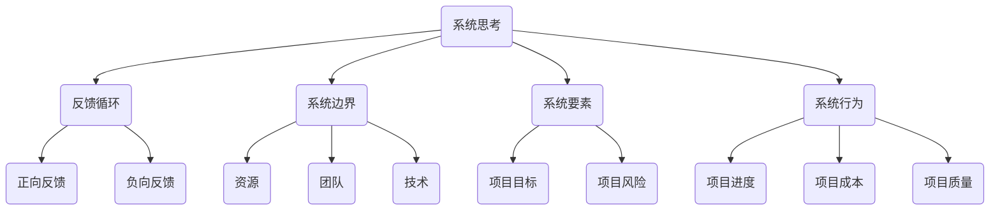

                 

关键词：系统思考、项目管理、复杂项目、结构化思维、协同合作

> 摘要：在当今复杂多变的IT环境中，系统思考已经成为管理复杂项目的重要方法。本文将探讨系统思考在项目管理中的应用，分析其在处理复杂问题、优化资源分配、提升团队协同等方面的重要性。通过具体案例和理论分析，本文将阐述系统思考如何帮助我们更好地理解和应对复杂项目中的挑战，提供实用的策略和方法，以实现项目的成功交付。

## 1. 背景介绍

在当今快速发展的信息技术时代，项目的复杂性日益增加。从软件系统开发到大规模基础设施建设项目，项目管理者面临的各种挑战层出不穷。这些挑战不仅体现在技术层面上，还涉及组织管理、团队协作、资源调度等多个方面。传统项目管理方法往往注重单一目标的实现，而忽视了系统内部各要素之间的相互关系和复杂交互。这种局限性导致项目管理中常常出现各种问题，如项目延误、成本超支、质量不符合预期等。

为了解决这些问题，系统思考作为一种全面的分析和管理方法，逐渐受到了项目管理者的高度重视。系统思考强调从整体视角出发，关注系统内部各要素之间的相互作用和反馈机制，通过结构化思维和系统分析，实现对复杂项目的有效管理。本文旨在探讨系统思考在项目管理中的应用，分析其在解决复杂问题、优化资源分配、提升团队协作等方面的优势。

## 2. 核心概念与联系

### 2.1 系统思考的定义

系统思考是一种分析和管理复杂系统的思维方式，它关注系统内部各要素之间的相互作用和反馈机制，强调从整体视角出发，理解系统的动态行为和演化过程。系统思考的核心思想是“整体大于部分之和”，即系统作为一个整体，其行为和性能往往无法简单地通过分析各个部分的性能来预测。

### 2.2 系统思考与项目管理的关系

在项目管理中，系统思考具有以下重要意义：

- **理解复杂系统**：复杂项目往往涉及多个相互依赖的子系统和组件，系统思考可以帮助项目管理者全面理解这些要素之间的复杂关系，从而更好地应对项目中的不确定性。

- **优化资源分配**：系统思考强调资源优化和合理配置，通过分析系统内部各要素之间的相互作用，项目管理者可以更有效地分配资源，提高项目的整体效率。

- **提升团队协作**：系统思考强调系统内部各要素的协同作用，有助于促进团队内部的有效沟通和协作，提高团队的整体效能。

- **解决复杂问题**：系统思考提供了一种结构化的思维方式，可以帮助项目管理者系统地分析问题，找到问题的根本原因，并提出切实可行的解决方案。

### 2.3 系统思考的架构

系统思考的架构包括以下几个方面：

- **反馈循环**：反馈循环是系统思考的核心概念，它描述了系统内部各要素之间的相互影响和反馈机制。项目管理者需要关注项目中的各种反馈循环，确保它们能够产生积极的效应。

- **系统边界**：系统边界是指系统的范围和限制，项目管理者需要明确项目的系统边界，以便更好地理解和控制系统的行为。

- **系统要素**：系统要素是构成系统的基本组成部分，包括项目中的各种资源、团队、技术等。项目管理者需要全面分析这些要素，确保它们能够有效地协同工作。

- **系统行为**：系统行为是指系统在特定环境下的表现和响应。项目管理者需要通过系统行为来评估项目的状态，并采取相应的措施进行调整。

## 2.4 Mermaid 流程图



## 3. 核心算法原理 & 具体操作步骤

### 3.1 算法原理概述

系统思考的核心算法是一种基于反馈循环和系统行为的分析方法。该方法通过以下步骤实现：

1. **构建系统模型**：项目管理者需要根据项目特点和需求，构建一个系统模型，包括系统边界、系统要素和反馈循环。

2. **分析反馈循环**：通过分析反馈循环，项目管理者可以识别系统中的关键反馈机制，了解它们如何影响项目的进展。

3. **优化系统行为**：基于对反馈循环的分析，项目管理者可以采取相应的措施来调整系统行为，确保项目能够按照预期目标顺利推进。

4. **持续迭代**：系统思考是一个持续迭代的过程，项目管理者需要根据项目实际情况不断调整系统模型，优化系统行为。

### 3.2 算法步骤详解

1. **定义项目目标**：明确项目的目标和关键指标，为后续分析提供基础。

2. **构建系统模型**：根据项目特点和需求，构建一个系统模型，包括系统边界、系统要素和反馈循环。

3. **识别反馈循环**：通过系统模型，识别项目中的关键反馈循环，分析它们对项目的影响。

4. **分析反馈循环**：对识别出的反馈循环进行分析，了解它们如何影响项目的进展。

5. **优化系统行为**：根据反馈循环的分析结果，采取相应的措施来调整系统行为，确保项目能够按照预期目标顺利推进。

6. **评估项目状态**：根据系统行为的调整，评估项目的状态，包括项目进度、成本、质量等方面。

7. **持续迭代**：根据项目实际情况，不断调整系统模型和系统行为，优化项目进展。

### 3.3 算法优缺点

- **优点**：
  - 全面性：系统思考从整体视角出发，全面考虑项目中的各种因素，有利于发现问题的根本原因。
  - 适应性：系统思考能够根据项目实际情况进行调整，适应不断变化的环境。
  - 提高效率：通过优化系统行为，系统思考有助于提高项目的整体效率。

- **缺点**：
  - 复杂性：系统思考涉及到多个方面，需要具备一定的专业知识和经验。
  - 时间成本：系统思考需要较长时间的实践和调整，可能影响项目的进度。

### 3.4 算法应用领域

系统思考在项目管理中的应用非常广泛，以下是一些典型的应用领域：

- **软件开发**：在软件开发项目中，系统思考可以帮助项目团队更好地理解系统的复杂性，优化开发流程，提高软件质量。
- **IT服务管理**：在IT服务管理中，系统思考可以帮助企业更好地管理服务流程，提高服务质量，降低运营成本。
- **项目管理**：在项目管理中，系统思考可以帮助项目管理者更好地应对项目中的各种挑战，提高项目的成功率。
- **企业战略规划**：在企业战略规划中，系统思考可以帮助企业从整体视角出发，优化资源配置，提高企业竞争力。

## 4. 数学模型和公式 & 详细讲解 & 举例说明

### 4.1 数学模型构建

在系统思考中，数学模型是描述系统行为和反馈机制的重要工具。以下是一个简单的数学模型，用于描述一个复杂项目的进展情况。

设 \( P(t) \) 表示项目在时间 \( t \) 的进展情况，\( R(t) \) 表示项目在时间 \( t \) 的资源利用率，\( C(t) \) 表示项目在时间 \( t \) 的成本，\( Q(t) \) 表示项目在时间 \( t \) 的质量水平。

\[ P(t) = f(R(t), C(t), Q(t)) \]

其中，函数 \( f \) 表示系统行为，反映了资源利用率、成本和质量对项目进展的影响。

### 4.2 公式推导过程

1. **资源利用率的计算**：

   资源利用率 \( R(t) \) 可以通过以下公式计算：

   \[ R(t) = \frac{R_{total}(t)}{R_{max}} \]

   其中，\( R_{total}(t) \) 表示项目在时间 \( t \) 的总资源投入，\( R_{max} \) 表示项目的最大资源容量。

2. **成本的估算**：

   成本 \( C(t) \) 可以通过以下公式估算：

   \[ C(t) = C_{base} + \alpha \cdot (P(t) - P_{base}) \]

   其中，\( C_{base} \) 表示项目的基础成本，\( P_{base} \) 表示项目的基础进展水平，\( \alpha \) 表示成本随进展变化的敏感度。

3. **质量的评估**：

   质量水平 \( Q(t) \) 可以通过以下公式评估：

   \[ Q(t) = Q_{base} + \beta \cdot (P(t) - P_{base}) \]

   其中，\( Q_{base} \) 表示项目的基础质量水平，\( P_{base} \) 表示项目的基础进展水平，\( \beta \) 表示质量随进展变化的敏感度。

### 4.3 案例分析与讲解

假设一个软件开发项目，项目基础成本为 100 万元，基础进展水平为 30%，基础质量水平为 90%。在项目进展到 50% 时，资源利用率达到 80%，成本为 120 万元，质量水平为 85%。

根据上述公式，可以计算出：

\[ R(t) = \frac{R_{total}(t)}{R_{max}} = \frac{80}{100} = 0.8 \]

\[ C(t) = C_{base} + \alpha \cdot (P(t) - P_{base}) = 100 + 0.1 \cdot (50 - 30) = 110 \]

\[ Q(t) = Q_{base} + \beta \cdot (P(t) - P_{base}) = 90 + 0.05 \cdot (50 - 30) = 92.5 \]

因此，在项目进展到 50% 时，项目进展情况为 \( P(t) = f(R(t), C(t), Q(t)) \)，可以进一步分析系统行为。

## 5. 项目实践：代码实例和详细解释说明

### 5.1 开发环境搭建

为了更好地理解和实践系统思考在项目管理中的应用，我们将使用 Python 编写一个简单的项目模拟。首先，我们需要搭建一个 Python 开发环境。

1. 安装 Python：
   - 访问 [Python 官网](https://www.python.org/)，下载并安装 Python。
   - 安装完成后，打开终端或命令行窗口，输入 `python --version` 验证 Python 安装是否成功。

2. 安装必要的库：
   - 使用 `pip` 命令安装必要的库，如 `numpy` 和 `matplotlib`：
     ```bash
     pip install numpy matplotlib
     ```

### 5.2 源代码详细实现

以下是一个简单的 Python 脚本，用于模拟项目进展和系统行为。

```python
import numpy as np
import matplotlib.pyplot as plt

# 参数设置
base_cost = 100000
base_progress = 0.3
base_quality = 0.9
alpha = 0.1
beta = 0.05
max_resources = 100

# 函数定义
def resource_utilization(progress):
    return progress / max_resources

def cost(progress):
    return base_cost + alpha * (progress - base_progress)

def quality(progress):
    return base_quality + beta * (progress - base_progress)

def system_behavior(progress):
    resource = resource_utilization(progress)
    cost_value = cost(progress)
    quality_value = quality(progress)
    return resource, cost_value, quality_value

# 模拟项目进展
progress_values = np.linspace(0, 1, 100)
resources, costs, qualities = [system_behavior(p) for p in progress_values]

# 结果可视化
plt.figure(figsize=(10, 5))

plt.subplot(1, 2, 1)
plt.plot(progress_values, resources, label='Resource Utilization')
plt.plot(progress_values, costs, label='Cost')
plt.plot(progress_values, qualities, label='Quality')
plt.xlabel('Progress')
plt.ylabel('Value')
plt.title('System Behavior')
plt.legend()

plt.subplot(1, 2, 2)
plt.plot(progress_values, costs, label='Cost')
plt.xlabel('Progress')
plt.ylabel('Cost')
plt.title('Cost vs Progress')
plt.legend()

plt.tight_layout()
plt.show()
```

### 5.3 代码解读与分析

1. **参数设置**：
   - `base_cost`、`base_progress` 和 `base_quality` 分别表示项目的基础成本、基础进展水平和基础质量水平。
   - `alpha` 和 `beta` 分别表示成本和质量随进展变化的敏感度。
   - `max_resources` 表示项目的最大资源容量。

2. **函数定义**：
   - `resource_utilization(progress)` 函数计算项目在给定进展水平下的资源利用率。
   - `cost(progress)` 函数根据项目的进展水平计算项目的成本。
   - `quality(progress)` 函数根据项目的进展水平计算项目的质量水平。
   - `system_behavior(progress)` 函数综合计算项目的资源利用率、成本和质量水平。

3. **模拟项目进展**：
   - `progress_values` 是一个包含从 0 到 1 的 100 个等间隔值的 NumPy 数组，表示项目进展的不同阶段。
   - `resources`、`costs` 和 `qualities` 分别是项目在各个进展水平下的资源利用率、成本和质量水平。

4. **结果可视化**：
   - 使用 `matplotlib` 库绘制项目进展与资源利用率、成本、质量水平的关系图。
   - 第一张图展示了资源利用率、成本和质量水平随项目进展的变化情况。
   - 第二张图仅展示了成本与项目进展的关系。

### 5.4 运行结果展示

运行上述代码后，将显示两个图表。第一个图表展示了资源利用率、成本和质量水平随项目进展的变化情况。从图表中可以看出，随着项目进展，资源利用率、成本和质量水平都发生了相应的变化。第二个图表展示了成本与项目进展的关系，可以看出成本随项目进展呈线性增加。

## 6. 实际应用场景

系统思考在项目管理中的应用场景非常广泛，以下是一些具体的实际应用场景：

### 6.1 软件开发项目

在软件开发项目中，系统思考可以帮助团队更好地理解系统的复杂性，优化开发流程，提高软件质量。通过系统思考，团队可以识别系统中的关键反馈机制，如需求变更、测试反馈等，从而及时调整项目计划和资源分配，确保项目的顺利推进。

### 6.2 IT运维项目

在IT运维项目中，系统思考可以帮助企业更好地管理服务流程，提高服务质量，降低运营成本。通过系统思考，企业可以识别系统中的关键反馈机制，如故障处理、性能优化等，从而优化运维流程，提高运维效率。

### 6.3 大型基础设施建设项目

在大型基础设施建设项目中，系统思考可以帮助项目管理者更好地应对项目中的各种挑战，提高项目的成功率。通过系统思考，项目管理者可以全面分析项目中的各种风险和不确定性，提前制定应对措施，确保项目的顺利实施。

### 6.4 企业战略规划

在企业战略规划中，系统思考可以帮助企业从整体视角出发，优化资源配置，提高企业竞争力。通过系统思考，企业可以识别系统中的关键反馈机制，如市场变化、竞争对手行为等，从而调整企业战略，适应外部环境的变化。

## 7. 未来应用展望

随着信息技术的不断发展和项目复杂性的不断增加，系统思考在项目管理中的应用前景十分广阔。以下是一些未来应用展望：

### 7.1 人工智能的融合

人工智能技术的快速发展为系统思考提供了新的工具和方法。通过将人工智能与系统思考相结合，项目管理者可以更准确地预测项目中的各种风险和不确定性，优化项目计划和资源分配。

### 7.2 可持续发展

在可持续发展方面，系统思考可以帮助企业更好地管理资源和环境，降低对环境的负面影响。通过系统思考，企业可以识别系统中的关键反馈机制，如资源消耗、环境影响等，从而优化生产流程，提高资源利用效率。

### 7.3 跨学科应用

系统思考不仅适用于项目管理，还可以广泛应用于其他领域，如经济学、社会学等。通过跨学科应用，系统思考可以为解决复杂社会问题提供新的思路和方法。

## 8. 工具和资源推荐

为了更好地学习和应用系统思考，以下是一些推荐的工具和资源：

### 8.1 学习资源推荐

- **书籍**：《系统思考》、《系统动力学的应用》、《复杂性科学导论》等。
- **在线课程**：Coursera、edX、Udemy 等平台上的系统思考相关课程。
- **论坛和社群**：知乎、豆瓣、领英等社交平台上相关的系统思考社群。

### 8.2 开发工具推荐

- **Python**：Python 是一种非常适合进行系统思考和数据分析的编程语言。
- **Matplotlib**：用于绘制系统行为和反馈机制的可视化图表。
- **Numpy**：用于数值计算和数据分析的库。

### 8.3 相关论文推荐

- **《系统思考与项目管理：理论与实践》**：详细介绍了系统思考在项目管理中的应用。
- **《基于系统动力学的项目管理方法研究》**：探讨系统动力学在项目管理中的具体应用。

## 9. 总结：未来发展趋势与挑战

### 9.1 研究成果总结

系统思考在项目管理中的应用已经取得了一定的研究成果，主要包括：

- 系统模型构建方法的研究。
- 反馈循环和系统行为的分析方法。
- 资源优化和成本控制策略。
- 团队协作和沟通机制的优化。

### 9.2 未来发展趋势

未来系统思考在项目管理中的应用将呈现以下发展趋势：

- 与人工智能技术的深度融合。
- 更多的跨学科应用。
- 更多的实际应用案例和研究。
- 更多的实证研究和数据分析。

### 9.3 面临的挑战

尽管系统思考在项目管理中具有巨大的潜力，但仍然面临以下挑战：

- 复杂性：系统思考涉及到多个方面，需要具备一定的专业知识和经验。
- 时间成本：系统思考需要较长时间的实践和调整，可能影响项目的进度。
- 可持续性：如何在系统思考中考虑可持续发展的因素。

### 9.4 研究展望

未来研究可以从以下几个方面展开：

- 开发更高效的系统模型构建方法。
- 探索系统思考与其他管理方法的融合。
- 加强实证研究和数据分析，提高系统思考的实用性和可操作性。

## 9. 附录：常见问题与解答

### Q：什么是系统思考？

A：系统思考是一种分析和管理复杂系统的思维方式，它强调从整体视角出发，关注系统内部各要素之间的相互作用和反馈机制，通过结构化思维和系统分析，实现对复杂项目的有效管理。

### Q：系统思考在项目管理中有什么作用？

A：系统思考在项目管理中可以发挥以下作用：

- 帮助项目管理者全面理解项目的复杂性。
- 优化资源分配和成本控制。
- 提高团队协作效率。
- 解决复杂问题，提高项目成功率。

### Q：如何应用系统思考进行项目管理？

A：应用系统思考进行项目管理主要包括以下步骤：

- 构建系统模型，明确项目边界和要素。
- 识别关键反馈循环，分析系统行为。
- 制定优化策略，调整系统行为。
- 持续迭代，根据实际情况不断调整。

### Q：系统思考与传统项目管理方法有什么区别？

A：系统思考与传统项目管理方法的主要区别在于：

- 传统项目管理方法注重单一目标的实现，而系统思考强调从整体视角出发，关注系统内部各要素之间的相互关系。
- 传统项目管理方法往往忽视系统内部各要素之间的反馈机制，而系统思考则将其作为分析的重要部分。

### Q：系统思考是否适用于所有类型的项目？

A：系统思考适用于各种类型的项目，尤其是复杂性和不确定性较高的项目。然而，对于一些简单、单一目标的项目，系统思考可能过于复杂，不一定适用。

### Q：系统思考需要哪些技能和知识？

A：应用系统思考需要以下技能和知识：

- 系统分析能力：能够从整体视角出发，分析系统内部各要素之间的相互作用。
- 数学建模能力：能够构建系统模型，使用数学方法进行分析。
- 项目管理经验：了解项目管理的基本流程和方法，能够将系统思考应用于实际项目中。
- 沟通协作能力：能够与团队成员有效沟通，共同解决项目中出现的问题。

## 作者署名

本文作者：禅与计算机程序设计艺术 / Zen and the Art of Computer Programming
----------------------------------------------------------------

以上就是关于“系统思考对于管理复杂项目的重要性”的完整文章。这篇文章从背景介绍、核心概念、算法原理、数学模型、项目实践、实际应用、未来展望、工具推荐、常见问题与解答等方面全面探讨了系统思考在项目管理中的应用和价值。希望这篇文章能够帮助读者更好地理解系统思考的重要性，并在实际项目中应用这一方法，提高项目管理的效率和成功率。

