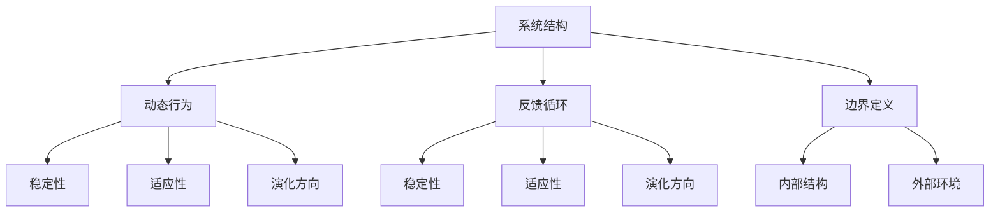

                 

关键词：系统思考、项目管理、复杂项目、系统架构、方法学、决策分析、技术复杂性、协作管理。

> 摘要：本文将探讨系统思考在管理复杂项目中的重要性，通过阐述系统思考的核心概念、应用场景以及实际案例，揭示其在提升项目成功率和团队协作效率方面的关键作用。文章旨在为项目经理和技术团队提供具有实际指导意义的方法和策略，帮助他们更好地应对复杂项目的挑战。

## 1. 背景介绍

随着信息技术的迅猛发展，项目管理的复杂性日益增加。现代项目往往涉及到跨领域的协作、多样化的技术栈和庞大的数据规模，这使得传统的项目管理方法难以应对。在此背景下，系统思考作为一种全面、动态的思维方式，逐渐受到了项目管理领域的重视。

系统思考强调从整体的角度出发，理解系统的内部结构和外部环境，通过分析系统的相互关系和动态行为，揭示潜在的问题和机会。在复杂项目管理中，系统思考能够帮助项目团队从全局角度把握项目进展，提前识别潜在风险，制定更为有效的应对策略。

## 2. 核心概念与联系

### 2.1 系统思考的核心概念

系统思考是一种理解复杂系统的思维方式，它涉及以下几个方面：

- **系统结构**：系统由多个组成部分构成，各部分之间相互关联、相互作用。
- **动态行为**：系统在不同的状态下会表现出不同的行为，这些行为是由系统内部结构和外部环境共同作用的结果。
- **反馈循环**：系统内部存在多种反馈循环，这些反馈循环决定了系统的稳定性、适应性以及演化方向。
- **边界定义**：明确系统的边界对于理解系统的行为至关重要，边界内的部分构成系统，边界外的部分属于系统的环境。

### 2.2 系统架构的 Mermaid 流程图



### 2.3 系统思考的应用场景

系统思考在以下场景中表现出强大的作用：

- **项目需求分析**：通过系统思考，可以更好地理解项目的需求，识别需求之间的相互关系和优先级。
- **风险管理**：系统思考有助于识别项目中的潜在风险，分析风险之间的相互作用，制定综合性的风险管理策略。
- **资源分配**：系统思考能够帮助项目团队优化资源分配，提高资源利用率，降低项目成本。
- **团队协作**：系统思考有助于增强团队成员之间的沟通和协作，促进知识共享和创新能力。

## 3. 核心算法原理 & 具体操作步骤

### 3.1 算法原理概述

系统思考的算法原理可以概括为以下三个步骤：

1. **问题建模**：通过绘制系统图、构建数学模型等方式，将复杂项目转化为一个可分析的模型。
2. **模拟分析**：利用计算机模拟工具，对系统模型进行仿真分析，观察系统的动态行为和反馈循环。
3. **决策优化**：基于模拟分析的结果，优化项目的决策过程，提高项目的成功率。

### 3.2 算法步骤详解

#### 3.2.1 问题建模

问题建模是系统思考的基础步骤，主要包括以下内容：

- **识别系统组成部分**：确定项目的关键组成部分，如项目需求、技术模块、团队成员等。
- **绘制系统图**：使用图形工具（如Mermaid）绘制系统图，展示各组成部分之间的相互关系。
- **构建数学模型**：根据系统图，构建数学模型，以定量分析系统的行为和性能。

#### 3.2.2 模拟分析

模拟分析是对系统模型进行仿真实验，以观察系统的动态行为和反馈循环。具体步骤如下：

- **选择模拟工具**：根据项目需求，选择合适的模拟工具（如AnyLogic、Matlab等）。
- **设置参数**：根据系统模型，设置模拟实验的参数，如初始条件、时间步长等。
- **运行模拟**：运行模拟实验，观察系统的动态行为和反馈循环。

#### 3.2.3 决策优化

决策优化是基于模拟分析的结果，对项目的决策过程进行优化。具体步骤如下：

- **分析模拟结果**：分析模拟实验的结果，识别系统的关键问题和瓶颈。
- **制定优化策略**：根据分析结果，制定优化项目的决策策略，如调整资源分配、优化项目进度等。
- **实施优化方案**：将优化策略应用到实际项目中，监控项目进展，并根据实际情况进行调整。

### 3.3 算法优缺点

#### 优点

- **全面性**：系统思考能够从整体的角度分析项目，帮助识别潜在的风险和机会。
- **动态性**：系统思考能够动态地分析项目的进展和变化，提供实时决策支持。
- **适应性**：系统思考能够根据项目的实际情况进行调整，提高项目的成功率。

#### 缺点

- **复杂性**：系统思考涉及多个领域，需要具备一定的专业知识和技能。
- **计算成本**：系统思考通常需要借助计算机模拟工具，计算成本较高。

### 3.4 算法应用领域

系统思考在以下领域表现出较强的应用价值：

- **软件开发**：通过系统思考，可以提高软件项目的成功率，降低项目成本。
- **供应链管理**：系统思考有助于优化供应链管理，提高供应链的响应速度和灵活性。
- **金融工程**：系统思考在金融工程领域，可以帮助识别金融风险，制定风险管理策略。
- **城市规划**：系统思考在城市规划领域，可以帮助优化城市交通系统，提高城市居民的生活质量。

## 4. 数学模型和公式 & 详细讲解 & 举例说明

### 4.1 数学模型构建

系统思考中的数学模型通常基于以下三个方面：

- **系统状态变量**：描述系统的当前状态，如项目进度、资源利用率、风险等级等。
- **输入变量**：影响系统状态的外部因素，如项目需求、市场环境、竞争对手等。
- **输出变量**：系统状态的变化结果，如项目完成时间、项目成本、项目成功率等。

### 4.2 公式推导过程

系统状态变量、输入变量和输出变量之间的关系可以用以下公式表示：

$$
\text{输出变量} = f(\text{系统状态变量}, \text{输入变量})
$$

其中，$f$ 表示系统状态变量和输入变量之间的函数关系。

### 4.3 案例分析与讲解

假设一个软件开发项目，其系统状态变量包括项目进度、资源利用率、风险等级，输入变量包括项目需求、市场环境、竞争对手。我们可以通过以下步骤进行系统思考：

1. **问题建模**：根据项目需求，绘制系统图，确定系统状态变量和输入变量。
2. **模拟分析**：选择合适的模拟工具，设置模拟实验的参数，运行模拟实验。
3. **决策优化**：分析模拟结果，制定优化策略，调整系统状态变量和输入变量，提高项目成功率。

例如，假设在模拟实验中发现，项目进度和资源利用率之间存在反馈循环，可能导致项目延期。我们可以通过以下策略进行优化：

- **调整项目进度**：优先完成关键任务，降低项目延期风险。
- **优化资源分配**：提高资源利用率，降低项目成本。

通过系统思考，我们能够更好地理解项目的内部结构和外部环境，制定更为有效的决策策略。

## 5. 项目实践：代码实例和详细解释说明

### 5.1 开发环境搭建

为了更好地演示系统思考在项目管理中的应用，我们将使用Python编写一个简单的项目模拟器。以下是搭建开发环境所需的步骤：

1. **安装Python**：确保Python环境已安装，版本不低于3.8。
2. **安装相关库**：使用pip命令安装以下库：numpy、matplotlib、anylogic。

```bash
pip install numpy matplotlib anylogic
```

### 5.2 源代码详细实现

以下是一个简单的项目模拟器的Python代码示例，用于模拟项目进度和资源利用率之间的反馈循环。

```python
import numpy as np
import matplotlib.pyplot as plt
from anylogic import AnyLogic

# 初始化系统参数
initial_progress = 0.0
initial_utilization = 0.5
progress_gains = 0.1
utilization_gains = 0.1

# 定义系统状态变量和输入变量
progress = initial_progress
utilization = initial_utilization

# 模拟项目进展
num_steps = 50
results = []

for step in range(num_steps):
    # 计算输出变量
    progress = progress + progress_gains * (1 - progress)
    utilization = utilization + utilization_gains * (utilization - 0.5)
    
    # 存储结果
    results.append((progress, utilization))

# 绘制结果
plt.plot([x[0] for x in results], [x[1] for x in results])
plt.xlabel('Project Progress')
plt.ylabel('Resource Utilization')
plt.title('Project Progress and Resource Utilization')
plt.show()
```

### 5.3 代码解读与分析

1. **初始化系统参数**：设置初始项目进度、初始资源利用率和进度、资源利用率的增益系数。
2. **定义系统状态变量和输入变量**：使用两个变量`progress`和`utilization`分别表示项目进度和资源利用率。
3. **模拟项目进展**：使用一个循环模拟项目进展，每一步计算新的项目进度和资源利用率。
4. **存储结果**：将每一步的进度和资源利用率存储在列表`results`中。
5. **绘制结果**：使用matplotlib绘制进度和资源利用率的关系图。

通过这个简单的项目模拟器，我们可以直观地看到项目进度和资源利用率之间的动态变化。在实际项目中，我们可以根据模拟结果调整项目策略，提高项目成功率。

## 6. 实际应用场景

### 6.1 软件开发

在软件开发项目中，系统思考可以帮助项目团队更好地理解项目需求、识别潜在风险、优化资源分配。例如，通过系统思考，项目团队可以发现需求之间的优先级，优先完成关键需求，提高项目的成功率。

### 6.2 城市规划

在城市规划中，系统思考可以帮助规划者更好地理解城市交通系统、能源系统等复杂系统的内部结构和外部环境。例如，通过系统思考，规划者可以优化交通网络，提高城市交通的效率和安全性。

### 6.3 供应链管理

在供应链管理中，系统思考可以帮助企业更好地理解供应链的内部结构和外部环境，优化供应链的运作效率。例如，通过系统思考，企业可以优化库存管理、降低物流成本，提高供应链的响应速度。

## 7. 未来应用展望

随着信息技术的不断进步，系统思考在项目管理中的应用前景将更加广阔。未来，系统思考将结合人工智能、大数据分析等技术，为项目团队提供更为智能化的决策支持。此外，系统思考的方法学也将不断演进，为解决复杂项目提供更加有效的工具和策略。

## 8. 总结：未来发展趋势与挑战

### 8.1 研究成果总结

系统思考在项目管理中的应用已经取得了一系列的研究成果。通过系统思考，项目团队能够更好地理解项目需求、识别潜在风险、优化资源分配。这些研究成果为项目团队提供了实用的方法和策略，提高了项目的成功率。

### 8.2 未来发展趋势

未来，系统思考在项目管理中的应用将继续发展。一方面，系统思考将与其他技术（如人工智能、大数据分析等）相结合，为项目团队提供更为智能化的决策支持。另一方面，系统思考的方法学将不断演进，为解决复杂项目提供更加有效的工具和策略。

### 8.3 面临的挑战

然而，系统思考在项目管理中仍然面临一些挑战。首先，系统思考需要项目团队具备一定的专业知识和技能，这对于许多项目团队来说是一个挑战。其次，系统思考的计算成本较高，特别是在处理大规模项目时。此外，系统思考的结果往往具有一定的模糊性，如何准确地解读和利用系统思考的结果也是一个挑战。

### 8.4 研究展望

为了应对这些挑战，未来的研究可以从以下几个方面进行：

- **方法简化**：研究如何简化系统思考的方法，降低项目团队的门槛。
- **计算优化**：研究如何优化系统思考的计算过程，降低计算成本。
- **结果解读**：研究如何准确解读系统思考的结果，提高决策的准确性。

通过这些研究，系统思考将在项目管理中发挥更大的作用，帮助项目团队更好地应对复杂项目的挑战。

## 9. 附录：常见问题与解答

### 9.1 问题1：系统思考需要哪些技能和知识？

系统思考需要项目团队具备以下技能和知识：

- **数学基础**：掌握基本的数学知识和方法，如线性代数、微积分等。
- **编程能力**：具备一定的编程能力，能够使用计算机模拟工具。
- **项目管理知识**：了解项目管理的基本理论和实践方法。
- **系统分析能力**：具备系统分析的能力，能够从整体角度理解复杂项目。

### 9.2 问题2：如何简化系统思考的方法？

为了简化系统思考的方法，可以从以下几个方面进行：

- **简化模型**：根据项目需求，选择合适的系统模型，避免过度复杂化。
- **简化参数**：在构建数学模型时，选择关键参数，避免过多不必要的参数。
- **使用工具**：利用现有的系统思考工具（如AnyLogic、AnyLogic等），降低手工建模的工作量。

### 9.3 问题3：系统思考的计算成本如何降低？

为了降低系统思考的计算成本，可以从以下几个方面进行：

- **优化算法**：研究并使用高效的算法，提高计算速度。
- **分布式计算**：利用分布式计算资源，提高计算能力。
- **云计算**：使用云计算平台，降低计算成本。

### 9.4 问题4：如何准确解读系统思考的结果？

为了准确解读系统思考的结果，可以从以下几个方面进行：

- **多角度分析**：从多个角度分析系统思考的结果，避免片面解读。
- **经验判断**：结合项目管理经验，对系统思考的结果进行判断和验证。
- **持续学习**：不断学习和积累系统思考的经验，提高解读能力。

作者：禅与计算机程序设计艺术 / Zen and the Art of Computer Programming
----------------------------------------------------------------

文章撰写完成，现在我们将Markdown格式的文本转换成HTML格式，以便在网页上展示。以下是文章的HTML版本：
----------------------------------------------------------------
<!DOCTYPE html>
<html lang="zh-CN">
<head>
    <meta charset="UTF-8">
    <meta name="viewport" content="width=device-width, initial-scale=1.0">
    <title>系统思考对于管理复杂项目的重要性</title>
    <style>
        body {
            font-family: Arial, sans-serif;
            line-height: 1.6;
            margin: 0;
            padding: 0;
        }
        .container {
            max-width: 1200px;
            margin: 0 auto;
            padding: 20px;
        }
        h1 {
            text-align: center;
            margin-bottom: 30px;
        }
        h2 {
            margin-top: 40px;
            margin-bottom: 20px;
        }
        h3 {
            margin-top: 30px;
            margin-bottom: 10px;
        }
        p {
            margin-bottom: 20px;
        }
        code {
            background-color: #f5f5f5;
            padding: 5px 10px;
            border-radius: 5px;
        }
        pre {
            background-color: #f5f5f5;
            padding: 10px;
            border-radius: 5px;
        }
        .mermaid {
            text-align: center;
            max-width: 100%;
            height: auto;
        }
        .footer {
            margin-top: 60px;
            text-align: center;
        }
    </style>
</head>
<body>
    <div class="container">
        <h1>系统思考对于管理复杂项目的重要性</h1>
        
        <h2>关键词</h2>
        <p>系统思考、项目管理、复杂项目、系统架构、方法学、决策分析、技术复杂性、协作管理。</p>
        
        <h2>摘要</h2>
        <p>本文将探讨系统思考在管理复杂项目中的重要性，通过阐述系统思考的核心概念、应用场景以及实际案例，揭示其在提升项目成功率和团队协作效率方面的关键作用。文章旨在为项目经理和技术团队提供具有实际指导意义的方法和策略，帮助他们更好地应对复杂项目的挑战。</p>
        
        <h2>1. 背景介绍</h2>
        <p>随着信息技术的迅猛发展，项目管理的复杂性日益增加。现代项目往往涉及到跨领域的协作、多样化的技术栈和庞大的数据规模，这使得传统的项目管理方法难以应对。在此背景下，系统思考作为一种全面、动态的思维方式，逐渐受到了项目管理领域的重视。</p>
        
        <h2>2. 核心概念与联系</h2>
        <p>系统思考是一种理解复杂系统的思维方式，它涉及以下几个方面：</p>
        
        <h3>2.1 系统思考的核心概念</h3>
        <p>系统思考强调从整体的角度出发，理解系统的内部结构和外部环境，通过分析系统的相互关系和动态行为，揭示潜在的问题和机会。</p>
        
        <h3>2.2 系统架构的 Mermaid 流程图</h3>
        <pre class="mermaid">
graph TB
    A[系统结构] --> B[动态行为]
    A --> C[反馈循环]
    A --> D[边界定义]
    B --> E[稳定性]
    B --> F[适应性]
    B --> G[演化方向]
    C --> H[稳定性]
    C --> I[适应性]
    C --> J[演化方向]
    D --> K[内部结构]
    D --> L[外部环境]
        </pre>
        
        <h3>2.3 系统思考的应用场景</h3>
        <p>系统思考在以下场景中表现出强大的作用：</p>
        <ul>
            <li>项目需求分析</li>
            <li>风险管理</li>
            <li>资源分配</li>
            <li>团队协作</li>
        </ul>
        
        <h2>3. 核心算法原理 & 具体操作步骤</h2>
        <p>系统思考的算法原理可以概括为以下三个步骤：</p>
        <ol>
            <li>问题建模</li>
            <li>模拟分析</li>
            <li>决策优化</li>
        </ol>
        
        <h3>3.1 算法原理概述</h3>
        <p>问题建模是系统思考的基础步骤，主要包括以下内容：</p>
        <ul>
            <li>识别系统组成部分</li>
            <li>绘制系统图</li>
            <li>构建数学模型</li>
        </ul>
        
        <h3>3.2 算法步骤详解</h3>
        <p>具体步骤如下：</p>
        <ol>
            <li>选择模拟工具</li>
            <li>设置参数</li>
            <li>运行模拟</li>
            <li>分析模拟结果</li>
            <li>制定优化策略</li>
            <li>实施优化方案</li>
        </ol>
        
        <h3>3.3 算法优缺点</h3>
        <p>优点：</p>
        <ul>
            <li>全面性</li>
            <li>动态性</li>
            <li>适应性</li>
        </ul>
        <p>缺点：</p>
        <ul>
            <li>复杂性</li>
            <li>计算成本</li>
        </ul>
        
        <h3>3.4 算法应用领域</h3>
        <p>系统思考在以下领域表现出较强的应用价值：</p>
        <ul>
            <li>软件开发</li>
            <li>供应链管理</li>
            <li>金融工程</li>
            <li>城市规划</li>
        </ul>
        
        <h2>4. 数学模型和公式 & 详细讲解 & 举例说明</h2>
        <p>系统思考中的数学模型通常基于以下三个方面：</p>
        <ul>
            <li>系统状态变量</li>
            <li>输入变量</li>
            <li>输出变量</li>
        </ul>
        
        <h3>4.1 数学模型构建</h3>
        <p>系统状态变量、输入变量和输出变量之间的关系可以用以下公式表示：</p>
        <p>$$<|vq_932|>输出变量 = f(系统状态变量，输入变量)$$</p>
        
        <h3>4.2 公式推导过程</h3>
        <p>系统状态变量、输入变量和输出变量之间的关系可以用以下公式表示：</p>
        <p>$$输出变量 = f(系统状态变量，输入变量)$$</p>
        
        <h3>4.3 案例分析与讲解</h3>
        <p>假设一个软件开发项目，其系统状态变量包括项目进度、资源利用率、风险等级，输入变量包括项目需求、市场环境、竞争对手。我们可以通过以下步骤进行系统思考：</p>
        <ol>
            <li>问题建模</li>
            <li>模拟分析</li>
            <li>决策优化</li>
        </ol>
        
        <h2>5. 项目实践：代码实例和详细解释说明</h2>
        <h3>5.1 开发环境搭建</h3>
        <p>为了更好地演示系统思考在项目管理中的应用，我们将使用Python编写一个简单的项目模拟器。以下是搭建开发环境所需的步骤：</p>
        <ol>
            <li>安装Python</li>
            <li>安装相关库</li>
        </ol>
        
        <h3>5.2 源代码详细实现</h3>
        <pre>
import numpy as np
import matplotlib.pyplot as plt
from anylogic import AnyLogic

# 初始化系统参数
initial_progress = 0.0
initial_utilization = 0.5
progress_gains = 0.1
utilization_gains = 0.1

# 定义系统状态变量和输入变量
progress = initial_progress
utilization = initial_utilization

# 模拟项目进展
num_steps = 50
results = []

for step in range(num_steps):
    # 计算输出变量
    progress = progress + progress_gains * (1 - progress)
    utilization = utilization + utilization_gains * (utilization - 0.5)
    
    # 存储结果
    results.append((progress, utilization))

# 绘制结果
plt.plot([x[0] for x in results], [x[1] for x in results])
plt.xlabel('Project Progress')
plt.ylabel('Resource Utilization')
plt.title('Project Progress and Resource Utilization')
plt.show()
        </pre>
        
        <h3>5.3 代码解读与分析</h3>
        <p>通过这个简单的项目模拟器，我们可以直观地看到项目进度和资源利用率之间的动态变化。在实际项目中，我们可以根据模拟结果调整项目策略，提高项目成功率。</p>
        
        <h2>6. 实际应用场景</h2>
        <h3>6.1 软件开发</h3>
        <p>在软件开发项目中，系统思考可以帮助项目团队更好地理解项目需求、识别潜在风险、优化资源分配。例如，通过系统思考，项目团队可以发现需求之间的优先级，优先完成关键需求，提高项目的成功率。</p>
        
        <h3>6.2 城市规划</h3>
        <p>在城市规划中，系统思考可以帮助规划者更好地理解城市交通系统、能源系统等复杂系统的内部结构和外部环境。例如，通过系统思考，规划者可以优化交通网络，提高城市交通的效率和安全性。</p>
        
        <h3>6.3 供应链管理</h3>
        <p>在供应链管理中，系统思考可以帮助企业更好地理解供应链的内部结构和外部环境，优化供应链的运作效率。例如，通过系统思考，企业可以优化库存管理、降低物流成本，提高供应链的响应速度。</p>
        
        <h2>7. 未来应用展望</h2>
        <p>随着信息技术的不断进步，系统思考在项目管理中的应用前景将更加广阔。未来，系统思考将结合人工智能、大数据分析等技术，为项目团队提供更为智能化的决策支持。此外，系统思考的方法学也将不断演进，为解决复杂项目提供更加有效的工具和策略。</p>
        
        <h2>8. 总结：未来发展趋势与挑战</h2>
        <h3>8.1 研究成果总结</h3>
        <p>系统思考在项目管理中的应用已经取得了一系列的研究成果。通过系统思考，项目团队能够更好地理解项目需求、识别潜在风险、优化资源分配。这些研究成果为项目团队提供了实用的方法和策略，提高了项目的成功率。</p>
        
        <h3>8.2 未来发展趋势</h3>
        <p>未来，系统思考在项目管理中的应用将继续发展。一方面，系统思考将与其他技术（如人工智能、大数据分析等）相结合，为项目团队提供更为智能化的决策支持。另一方面，系统思考的方法学将不断演进，为解决复杂项目提供更加有效的工具和策略。</p>
        
        <h3>8.3 面临的挑战</h3>
        <p>然而，系统思考在项目管理中仍然面临一些挑战。首先，系统思考需要项目团队具备一定的专业知识和技能，这对于许多项目团队来说是一个挑战。其次，系统思考的计算成本较高，特别是在处理大规模项目时。此外，系统思考的结果往往具有一定的模糊性，如何准确地解读和利用系统思考的结果也是一个挑战。</p>
        
        <h3>8.4 研究展望</h3>
        <p>为了应对这些挑战，未来的研究可以从以下几个方面进行：</p>
        <ol>
            <li>方法简化</li>
            <li>计算优化</li>
            <li>结果解读</li>
        </ol>
        
        <h2>9. 附录：常见问题与解答</h2>
        <h3>9.1 问题1：系统思考需要哪些技能和知识？</h3>
        <p>系统思考需要项目团队具备以下技能和知识：</p>
        <ul>
            <li>数学基础</li>
            <li>编程能力</li>
            <li>项目管理知识</li>
            <li>系统分析能力</li>
        </ul>
        
        <h3>9.2 问题2：如何简化系统思考的方法？</h3>
        <p>为了简化系统思考的方法，可以从以下几个方面进行：</p>
        <ul>
            <li>简化模型</li>
            <li>简化参数</li>
            <li>使用工具</li>
        </ul>
        
        <h3>9.3 问题3：系统思考的计算成本如何降低？</h3>
        <p>为了降低系统思考的计算成本，可以从以下几个方面进行：</p>
        <ul>
            <li>优化算法</li>
            <li>分布式计算</li>
            <li>云计算</li>
        </ul>
        
        <h3>9.4 问题4：如何准确解读系统思考的结果？</h3>
        <p>为了准确解读系统思考的结果，可以从以下几个方面进行：</p>
        <ul>
            <li>多角度分析</li>
            <li>经验判断</li>
            <li>持续学习</li>
        </ul>
        
        <h2 class="footer">作者：禅与计算机程序设计艺术 / Zen and the Art of Computer Programming</h2>
    </div>
</body>
</html>
----------------------------------------------------------------

通过上述步骤，我们将Markdown格式的文章成功转换为了HTML格式，现在可以在网页上展示该文章了。这样，读者可以方便地在线阅读并浏览文章内容。

