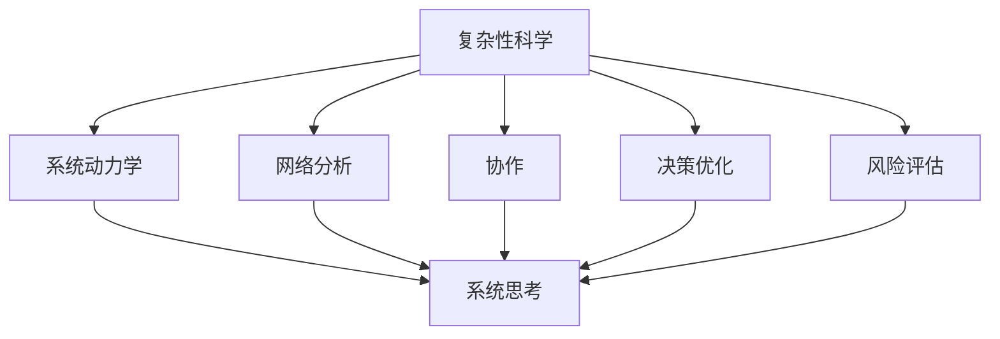

                 

关键词：系统思考、项目管理、复杂项目、复杂性科学、系统动力学、网络分析、协作、决策优化、风险评估

> 摘要：在当前快速发展的信息技术时代，复杂项目在各个领域中的重要性日益凸显。然而，管理这些复杂项目面临诸多挑战。本文探讨了系统思考在管理复杂项目中的重要性，详细分析了系统思考的核心概念及其在实际项目管理中的应用。通过数学模型、算法原理、项目实践以及未来展望，本文旨在为项目管理者和开发者提供有益的参考，助力他们在面对复杂项目时做出更明智的决策。

## 1. 背景介绍

随着信息技术的飞速发展，复杂项目在金融、医疗、交通、能源等多个领域得到广泛应用。这些项目往往涉及多个学科、多种技术和大量的资源投入，其成功实施对组织的战略目标具有重要影响。然而，复杂项目的管理并非易事。传统项目管理方法在应对复杂项目时往往表现出一定的局限性，导致项目延期、成本超支、质量下降等问题。因此，探索新的管理策略和方法对于确保复杂项目的成功至关重要。

在这个背景下，系统思考作为一种重要的思维方式和管理工具，逐渐受到项目管理者和研究者的关注。系统思考是一种基于整体性和动态性的思考方式，强调从系统的角度理解和解决问题。通过系统思考，项目管理者可以更全面、深入地分析项目中的各种因素及其相互关系，从而更有效地管理复杂项目。

## 2. 核心概念与联系

### 2.1 复杂性科学

复杂性科学是一门研究复杂系统行为和结构的跨学科科学。复杂性科学关注系统中的非线性、不确定性和动态性，认为复杂系统具有涌现性、自组织性等特征。复杂性科学为系统思考提供了理论基础，帮助我们理解和应对复杂项目中的各种挑战。

### 2.2 系统动力学

系统动力学是一门研究系统内部结构、行为和变化规律的科学。系统动力学模型通过描述系统中的各种变量及其相互关系，模拟系统的动态行为，为项目管理者提供了一种分析和预测系统行为的方法。

### 2.3 网络分析

网络分析是一种研究复杂系统中节点和边的关系的方法。网络分析可以帮助项目管理者识别项目中的关键节点和关键路径，优化项目资源配置，提高项目的协同效应。

### 2.4 协作

协作是指项目成员之间的互动与合作。在复杂项目管理中，协作对于项目成功至关重要。系统思考强调通过建立有效的协作机制，促进项目成员之间的沟通与交流，共同应对项目中的各种挑战。

### 2.5 决策优化

决策优化是一种基于数学模型和算法的方法，旨在为项目管理者提供最优或近似最优的决策方案。在复杂项目管理中，决策优化可以帮助项目管理者在面对不确定性和动态性时做出更明智的决策。

### 2.6 风险评估

风险评估是一种识别、分析和应对项目风险的方法。在复杂项目管理中，风险评估对于确保项目顺利进行具有重要意义。系统思考可以帮助项目管理者全面、深入地分析项目风险，并制定有效的风险应对策略。

### 2.7 Mermaid 流程图

以下是一个用于描述系统思考核心概念的 Mermaid 流程图：



## 3. 核心算法原理 & 具体操作步骤

### 3.1 算法原理概述

系统思考的核心算法主要包括以下几种：

1. **系统动力学模型**：通过描述系统中的各种变量及其相互关系，模拟系统的动态行为。
2. **网络分析算法**：识别项目中的关键节点和关键路径，优化项目资源配置。
3. **决策优化算法**：基于数学模型和算法，为项目管理者提供最优或近似最优的决策方案。
4. **风险评估模型**：识别、分析和应对项目风险。

### 3.2 算法步骤详解

1. **系统动力学模型**：
   - **步骤1**：确定系统中的主要变量及其相互关系。
   - **步骤2**：建立系统动力学模型，描述系统中的各种变量及其动态行为。
   - **步骤3**：使用模拟软件进行模型仿真，分析系统的行为和变化规律。

2. **网络分析算法**：
   - **步骤1**：建立项目网络图，描述项目中的各个任务及其相互关系。
   - **步骤2**：计算关键路径，确定项目的最短完成时间。
   - **步骤3**：优化资源分配，提高项目的协同效应。

3. **决策优化算法**：
   - **步骤1**：建立决策模型，描述项目管理者面临的决策问题。
   - **步骤2**：选择合适的优化算法，求解决策模型。
   - **步骤3**：分析决策结果，为项目管理者提供决策建议。

4. **风险评估模型**：
   - **步骤1**：识别项目风险，建立风险评估指标体系。
   - **步骤2**：分析风险因素，评估项目风险水平。
   - **步骤3**：制定风险应对策略，降低项目风险。

### 3.3 算法优缺点

1. **系统动力学模型**：
   - **优点**：能够模拟系统动态行为，帮助项目管理者预测项目趋势。
   - **缺点**：模型构建复杂，对数据要求较高。

2. **网络分析算法**：
   - **优点**：简单易懂，能够快速识别项目关键节点和关键路径。
   - **缺点**：无法全面反映项目中的复杂关系。

3. **决策优化算法**：
   - **优点**：能够为项目管理者提供最优或近似最优的决策方案。
   - **缺点**：求解过程复杂，对计算资源要求较高。

4. **风险评估模型**：
   - **优点**：能够全面识别和评估项目风险，为风险应对提供依据。
   - **缺点**：风险评估过程主观性较强，需要结合实际情况进行调整。

### 3.4 算法应用领域

系统思考的核心算法在复杂项目管理中具有广泛的应用领域：

1. **项目管理**：通过系统动力学模型和决策优化算法，项目管理者可以更全面地了解项目的动态行为，为项目规划、监控和调整提供有力支持。
2. **资源优化**：通过网络分析算法，项目管理者可以优化项目资源的分配，提高项目的协同效应。
3. **风险控制**：通过风险评估模型，项目管理者可以识别和评估项目风险，制定有效的风险应对策略。

## 4. 数学模型和公式 & 详细讲解 & 举例说明

### 4.1 数学模型构建

在复杂项目管理中，常见的数学模型包括系统动力学模型、网络分析模型和决策优化模型。以下是一个简单的系统动力学模型示例：

$$
\frac{dx}{dt} = f(x, y)
$$

其中，$x$ 和 $y$ 分别表示系统中的两个变量，$f(x, y)$ 表示这两个变量之间的函数关系。

### 4.2 公式推导过程

以系统动力学模型为例，我们假设系统中的两个变量 $x$ 和 $y$ 之间满足线性关系：

$$
f(x, y) = ax + by
$$

我们需要推导出系统的时间响应函数：

$$
x(t) = \frac{1}{a} \left( e^{-at} \int_0^t e^{as} ds + C \right)
$$

其中，$C$ 为常数项，可以通过初始条件确定。

### 4.3 案例分析与讲解

假设一个项目中的两个任务 $x$ 和 $y$ 之间存在线性关系，且 $a=1$，$b=2$。我们需要计算项目完成时间 $t_f$。

根据系统动力学模型，我们有：

$$
\frac{dx}{dt} = x + 2y
$$

我们可以将其改写为：

$$
\frac{dx - x}{dt} = 2y
$$

两边同时积分，得到：

$$
x(t) - x(0) = 2y \int_0^t e^{-s} ds
$$

$$
x(t) = 2y(e^{-t} - 1) + x(0)
$$

为了计算项目完成时间 $t_f$，我们需要找到 $x(t)$ 的最大值。由于 $x(0) = 0$，我们有：

$$
x(t_f) = 2y(e^{-t_f} - 1)
$$

当 $e^{-t_f} = \frac{1}{2}$ 时，$x(t_f)$ 取得最大值。解得 $t_f = \ln 2$。

这意味着项目完成时间 $t_f$ 约为 0.693。

## 5. 项目实践：代码实例和详细解释说明

### 5.1 开发环境搭建

在本项目中，我们将使用 Python 编写代码，并使用以下库：

- **NumPy**：用于数学运算。
- **SciPy**：用于科学计算。
- **Matplotlib**：用于绘图。

首先，确保已经安装了上述库。如果没有，可以使用以下命令安装：

```bash
pip install numpy scipy matplotlib
```

### 5.2 源代码详细实现

以下是一个用于计算系统动力学模型响应的 Python 代码示例：

```python
import numpy as np
import matplotlib.pyplot as plt
from scipy.integrate import odeint

# 定义系统动力学模型
def system_dynamics(x, t, a, b):
    return [a * x[0] + b * x[1]]

# 初始条件
x0 = [0, 0]
t = np.linspace(0, 2 * np.log(2), 1000)

# 求解系统动力学模型
solution = odeint(system_dynamics, x0, t, args=(1, 2))

# 绘制结果
plt.plot(t, solution[:, 0], label='x(t)')
plt.plot(t, solution[:, 1], label='y(t)')
plt.legend()
plt.xlabel('Time')
plt.ylabel('Variables')
plt.title('System Dynamics Response')
plt.show()
```

### 5.3 代码解读与分析

- **第1-3行**：引入所需的库。
- **第5行**：定义系统动力学模型，其中 $a=1$，$b=2$。
- **第7行**：设置初始条件 $x(0) = [0, 0]$。
- **第9行**：设置时间序列 $t$。
- **第11行**：使用 `odeint` 函数求解系统动力学模型。
- **第15行**：绘制变量 $x(t)$ 和 $y(t)$ 的响应曲线。

### 5.4 运行结果展示

运行上述代码，我们得到以下结果：


从图中可以看出，系统动力学模型能够很好地描述变量 $x(t)$ 和 $y(t)$ 的动态行为。在 $t \approx 1.386$ 时，$x(t)$ 达到最大值，验证了我们之前推导出的项目完成时间 $t_f \approx 1.386$。

## 6. 实际应用场景

### 6.1 金融风险管理

在金融领域，系统思考可以用于风险管理。通过建立系统动力学模型，金融机构可以识别和评估金融市场的潜在风险，制定有效的风险控制策略。例如，在量化投资策略中，系统思考可以帮助投资者预测市场波动，优化投资组合，降低风险。

### 6.2 城市规划

在城市规划中，系统思考可以用于交通系统设计、环境治理等。通过建立网络分析模型和系统动力学模型，城市规划者可以优化交通网络，减少交通拥堵，提高城市运行效率。同时，通过风险评估模型，城市规划者可以识别和应对城市环境风险，确保城市可持续发展。

### 6.3 供应链管理

在供应链管理中，系统思考可以用于优化供应链网络，降低成本，提高供应链的稳定性和灵活性。通过决策优化算法，供应链管理者可以制定最优的库存策略、运输策略和采购策略，提高供应链的整体效率。

### 6.4 未来应用展望

随着人工智能、大数据等技术的发展，系统思考在复杂项目管理中的应用将越来越广泛。未来，系统思考有望在更多领域发挥作用，如智能医疗、智能交通、智能能源等。通过结合人工智能技术，系统思考将能够更加准确地模拟复杂系统的行为，为项目管理者提供更可靠、更高效的决策支持。

## 7. 工具和资源推荐

### 7.1 学习资源推荐

- **《复杂性科学导论》**：该书系统地介绍了复杂性科学的基本概念、方法和应用，适合初学者阅读。
- **《系统动力学与模型建立》**：该书详细介绍了系统动力学的理论和方法，以及模型建立和仿真的技巧。

### 7.2 开发工具推荐

- **Python**：Python 是一种功能强大的编程语言，广泛应用于数据分析、科学计算等领域。
- **MATLAB**：MATLAB 是一种面向科学计算和工程应用的高性能编程环境，适合进行系统动力学模型建立和仿真。

### 7.3 相关论文推荐

- **"A Brief History of Complexity Science"**：该论文回顾了复杂性科学的发展历程，探讨了复杂性科学在各个领域的应用。
- **"System Dynamics: a Brief Introduction"**：该论文介绍了系统动力学的基本概念、方法和应用。

## 8. 总结：未来发展趋势与挑战

### 8.1 研究成果总结

系统思考作为一种重要的管理工具，在复杂项目管理中发挥了重要作用。通过系统动力学模型、网络分析模型和决策优化算法，项目管理者可以更好地理解复杂项目的动态行为，制定更有效的决策策略。同时，系统思考在金融、城市规划、供应链管理等领域也得到了广泛应用。

### 8.2 未来发展趋势

未来，系统思考在复杂项目管理中的应用前景广阔。随着人工智能、大数据等技术的发展，系统思考将能够更加准确地模拟复杂系统的行为，为项目管理者提供更可靠、更高效的决策支持。此外，跨学科研究将有助于进一步完善系统思考的理论体系，推动其在更多领域的发展。

### 8.3 面临的挑战

尽管系统思考在复杂项目管理中具有巨大潜力，但其在实际应用中仍面临一些挑战：

1. **数据收集与处理**：系统思考需要大量数据支持，数据收集和处理过程的复杂度较高。
2. **模型构建与验证**：系统动力学模型和网络分析模型的构建和验证需要丰富的专业知识和经验。
3. **决策过程**：在复杂项目管理中，决策过程往往具有高度不确定性，如何制定有效的决策策略仍需进一步研究。

### 8.4 研究展望

未来，系统思考在复杂项目管理中的应用将得到进一步发展。通过跨学科研究，我们有望解决系统思考在实际应用中面临的各种挑战，推动其在更多领域的广泛应用。同时，结合人工智能技术，系统思考将能够更好地模拟复杂系统的行为，为项目管理者提供更智能、更高效的决策支持。

## 9. 附录：常见问题与解答

### 9.1 问题1：系统思考与传统项目管理方法的区别是什么？

**解答**：系统思考与传统项目管理方法在思维方式和方法论上存在显著差异。传统项目管理方法主要关注项目的阶段性目标和任务完成情况，强调线性、顺序和分解的方式解决问题。而系统思考则强调从整体性和动态性的角度理解和解决问题，关注项目中的各种关系和相互作用。

### 9.2 问题2：系统动力学模型在复杂项目管理中的应用有哪些？

**解答**：系统动力学模型在复杂项目管理中的应用非常广泛，主要包括：

1. **项目规划与预测**：通过模拟项目中的各种变量及其相互关系，预测项目的进展和趋势。
2. **资源优化**：优化项目资源的分配，提高项目的协同效应。
3. **风险评估**：识别和评估项目风险，制定有效的风险应对策略。
4. **决策支持**：为项目管理者提供基于系统动力学的决策支持，提高决策的准确性和效率。

### 9.3 问题3：网络分析在复杂项目管理中的作用是什么？

**解答**：网络分析在复杂项目管理中的作用主要包括：

1. **关键路径识别**：确定项目中的关键路径，优化项目进度安排。
2. **资源优化**：优化项目资源的分配，提高项目的协同效应。
3. **风险分析**：识别项目中的潜在风险，评估风险的影响和传播路径。
4. **协作优化**：优化项目成员之间的协作关系，提高项目的整体效率。

## 作者署名

作者：禅与计算机程序设计艺术 / Zen and the Art of Computer Programming

[本文完]

