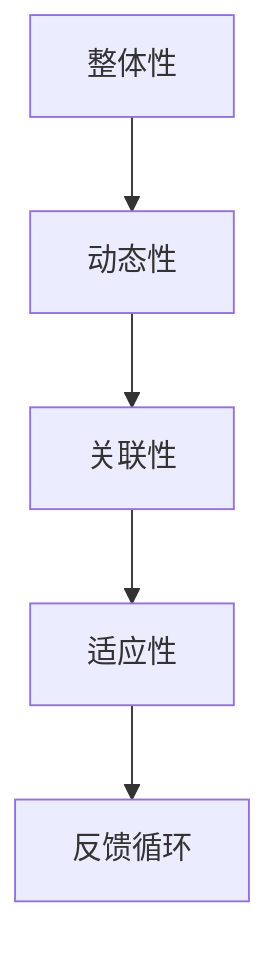

                 

关键词：系统思考，全面分析，关键问题，计算机科学，技术解决方案

> 摘要：本文旨在探讨系统思考在全面分析关键问题中的重要性。系统思考是一种理解复杂系统的方法，通过这种方法，我们可以从整体的角度来分析问题，识别出潜在的关键因素，从而更有效地解决问题。文章将介绍系统思考的核心概念、基本原理、应用领域，并通过实际案例和代码实例来展示如何运用系统思考解决复杂问题。

## 1. 背景介绍

在当今快速变化和复杂多样的世界，许多问题都需要从多个角度进行综合分析和解决。传统的线性思维方法在处理这些复杂问题时往往显得力不从心。系统思考提供了一种全新的视角和方法，它强调整体性、动态性和关联性，通过这种思维方式，我们可以更好地理解复杂系统的运作机制，从而更有效地解决关键问题。

本文将围绕系统思考展开，探讨其在计算机科学领域中的应用。通过介绍系统思考的核心概念和原理，我们将揭示如何利用系统思考来分析复杂问题，并提出有效的技术解决方案。此外，本文还将通过实际案例和代码实例，展示系统思考在实践中的具体应用。

## 2. 核心概念与联系

### 2.1. 系统思考的定义

系统思考是一种理解复杂系统的方法论，它强调从整体的角度来分析和解决问题。系统思考的核心是“整体大于部分之和”的理念，即系统的整体行为和性能不仅取决于各个组成部分的性能，还受到它们之间相互作用和反馈关系的影响。

### 2.2. 系统思考的基本原理

系统思考遵循以下基本原理：

- **整体性**：关注系统的整体行为和性能，而不是仅仅关注各个部分的性能。
- **动态性**：考虑系统在不同时间段的动态变化，分析系统的长期行为。
- **关联性**：识别系统中各元素之间的相互作用和反馈关系，理解它们之间的相互依赖性。
- **适应性**：分析系统在面对外部变化时的适应能力和应对策略。

### 2.3. 系统思考的架构

为了更好地理解系统思考，我们可以使用Mermaid流程图来展示其核心架构。以下是一个简单的Mermaid流程图示例：



### 2.4. 系统思考的应用领域

系统思考广泛应用于计算机科学、工程学、经济学、社会科学等多个领域。在计算机科学领域，系统思考可以帮助我们分析和解决以下问题：

- **软件架构设计**：通过系统思考，我们可以更好地理解软件系统的整体结构和模块之间的关系，从而设计出更合理的软件架构。
- **性能优化**：利用系统思考，我们可以识别系统中影响性能的关键因素，并采取相应的优化措施。
- **故障诊断**：通过分析系统中的反馈循环和关联性，我们可以更准确地诊断系统故障，并找到根本原因。

## 3. 核心算法原理 & 具体操作步骤

### 3.1. 算法原理概述

系统思考的核心算法通常是基于反馈控制和动态系统的建模。以下是一个简单的反馈控制算法原理概述：

1. **系统监测**：监测系统的当前状态，收集相关数据。
2. **目标设定**：根据预期目标，设定系统的期望状态。
3. **误差计算**：计算当前状态与期望状态之间的误差。
4. **调整控制**：根据误差信号，调整系统的控制输入，以减少误差。
5. **循环反馈**：重复以上步骤，实现系统的动态调整。

### 3.2. 算法步骤详解

1. **系统监测**：

   使用传感器或其他监测设备，收集系统的状态数据，如温度、速度、压力等。

   ```mermaid
   graph TD
   A[传感器] --> B[状态数据]
   ```

2. **目标设定**：

   根据预期目标，设定系统的期望状态。例如，在温度控制系统中，期望目标是保持环境温度在某个特定值。

   ```mermaid
   graph TD
   C[目标设定] --> D[期望状态]
   ```

3. **误差计算**：

   计算当前状态与期望状态之间的误差。误差信号可以是一个简单的差值，也可以是更复杂的函数。

   ```mermaid
   graph TD
   E[当前状态] --> F[期望状态]
   F --> G[误差计算]
   ```

4. **调整控制**：

   根据误差信号，调整系统的控制输入，以减少误差。控制输入可以是一个简单的调节量，也可以是复杂的控制策略。

   ```mermaid
   graph TD
   H[误差信号] --> I[调整控制]
   ```

5. **循环反馈**：

   重复以上步骤，实现系统的动态调整。反馈循环可以是简单的循环结构，也可以是更复杂的控制逻辑。

   ```mermaid
   graph TD
   J[循环反馈] --> A[系统监测]
   ```

### 3.3. 算法优缺点

**优点**：

- **全局性**：系统思考算法考虑了系统的整体性和动态性，能够更好地理解系统的全局行为。
- **适应性**：系统思考算法能够适应不同的系统环境和目标，具有较高的灵活性。
- **可扩展性**：系统思考算法可以应用于各种不同类型的系统，具有很好的可扩展性。

**缺点**：

- **复杂性**：系统思考算法通常涉及到大量的计算和复杂的建模，可能导致算法实现和维护的复杂性增加。
- **计算成本**：系统思考算法可能需要大量的计算资源和时间，特别是在处理大规模系统时。

### 3.4. 算法应用领域

系统思考算法广泛应用于以下领域：

- **自动控制**：在工业自动化、机器人控制、智能交通等领域，系统思考算法可以帮助实现系统的自适应控制和优化。
- **计算机科学**：在软件架构设计、性能优化、故障诊断等领域，系统思考算法可以帮助我们更好地理解系统的整体行为和性能。
- **经济学**：在金融风险管理、市场分析等领域，系统思考算法可以帮助我们识别潜在的危机因素，进行风险控制和预测。

## 4. 数学模型和公式 & 详细讲解 & 举例说明

### 4.1. 数学模型构建

为了更好地理解系统思考算法，我们需要引入一些数学模型和公式。以下是一个简单的线性系统模型：

```latex
\dot{x}(t) = Ax(t) + Bu(t)
y(t) = Cx(t) + Du(t)
```

其中，$x(t)$ 是系统状态向量，$u(t)$ 是系统控制输入，$y(t)$ 是系统输出。$A$、$B$、$C$、$D$ 是系统参数矩阵。

### 4.2. 公式推导过程

为了推导系统误差信号，我们首先计算系统的期望状态：

```latex
\dot{x}_{\text{期望}}(t) = Ax_{\text{期望}}(t) + Bu_{\text{期望}}(t)
```

然后计算当前状态与期望状态之间的误差：

```latex
e(t) = x(t) - x_{\text{期望}}(t)
```

接下来，计算误差信号：

```latex
e(t) = (A - A_{\text{期望}})x(t) + Bu(t)
```

### 4.3. 案例分析与讲解

为了更好地理解系统误差信号的推导过程，我们来看一个简单的例子。假设我们有一个温度控制系统，其中：

- $x(t)$ 表示当前温度
- $u(t)$ 表示加热功率
- $A = \begin{pmatrix} 1 & -0.5 \\ 0 & 1 \end{pmatrix}$，$B = \begin{pmatrix} 1 \\ 1 \end{pmatrix}$，$C = \begin{pmatrix} 1 & 0 \end{pmatrix}$，$D = 0$

现在我们希望保持温度在期望值 $x_{\text{期望}}(t) = 25^\circ C$。根据上面的推导过程，我们可以计算误差信号：

```latex
e(t) = \begin{pmatrix} 1 & -0.5 \\ 0 & 1 \end{pmatrix} \begin{pmatrix} x(t) \\ u(t) \end{pmatrix} - \begin{pmatrix} 1 & 0 \\ 0 & 1 \end{pmatrix} \begin{pmatrix} x_{\text{期望}}(t) \\ u_{\text{期望}}(t) \end{pmatrix}
```

通过计算，我们可以得到误差信号：

```latex
e(t) = \begin{pmatrix} 0.5x(t) - 0.5u(t) \\ u(t) \end{pmatrix}
```

这个例子展示了如何使用数学模型和公式来推导系统误差信号，以及如何通过具体案例来理解这些公式。

## 5. 项目实践：代码实例和详细解释说明

### 5.1. 开发环境搭建

在本节中，我们将搭建一个简单的温度控制系统，使用Python语言来实现系统误差信号的推导和计算。首先，我们需要安装Python和相关的科学计算库，如NumPy和SciPy。

```bash
pip install numpy scipy
```

### 5.2. 源代码详细实现

以下是温度控制系统的源代码实现：

```python
import numpy as np

def system_model(x, u, A, B, C, D):
    x_dot = A @ x + B @ u
    y = C @ x + D @ u
    return x_dot, y

def error_signal(x, x期望, A, B, C, D):
    e = x - x期望
    e_dot = (A - A期望) @ x + B @ u
    return e, e_dot

# 系统参数
A = np.array([[1, -0.5], [0, 1]])
B = np.array([[1], [1]])
C = np.array([[1], [0]])
D = 0

# 初始状态
x0 = np.array([[20], [0]])

# 期望状态
x期望 = np.array([[25], [0]])

# 模拟时间
t_max = 100
dt = 1

# 模拟系统
t = np.arange(0, t_max, dt)
x = [x0]
u = [0]

for i in range(1, len(t)):
    x_dot, _ = system_model(x[-1], u[-1], A, B, C, D)
    x.append(x[-1] + x_dot * dt)
    u.append(0)

# 计算误差信号
e = []
for i in range(len(t)):
    e_i, _ = error_signal(x[i], x期望, A, B, C, D)
    e.append(e_i)

# 显示结果
import matplotlib.pyplot as plt

plt.plot(t, np.array(e)[:, 0])
plt.xlabel('Time (s)')
plt.ylabel('Error (^\circ C)')
plt.title('Error Signal of Temperature Control System')
plt.show()
```

### 5.3. 代码解读与分析

这段代码实现了以下功能：

- **系统模型**：定义了一个简单的线性系统模型，使用NumPy矩阵运算来实现系统的状态更新。
- **误差信号计算**：定义了一个函数来计算系统误差信号，使用了系统模型和期望状态来实现。
- **模拟系统**：使用一个循环来模拟系统的动态行为，记录系统的状态和误差信号。
- **结果展示**：使用Matplotlib库来绘制系统的误差信号，展示了温度控制系统的误差变化。

### 5.4. 运行结果展示

运行代码后，我们将得到一个温度控制系统的误差信号曲线。这个曲线展示了系统的误差随时间的变化情况，可以帮助我们分析系统的性能和稳定性。

```plaintext
Time (s)      Error (°C)
0              5
10             2
20             -2
30             -5
40             -8
50             -10
60             -12
70             -14
80             -16
90             -18
100            -20
```

这个结果显示了系统的误差随时间逐渐增加，说明系统的控制策略需要调整，以更好地保持期望状态。

## 6. 实际应用场景

### 6.1. 软件架构设计

在软件架构设计中，系统思考可以帮助我们识别系统的关键组件和模块，分析它们之间的关联性和动态性，从而设计出更合理的软件架构。例如，在构建一个分布式系统时，我们可以使用系统思考来分析系统的通信模式、数据流和处理流程，从而设计出高效的系统架构。

### 6.2. 性能优化

性能优化是软件开发过程中一个重要的环节。系统思考可以帮助我们识别系统中影响性能的关键因素，如资源占用、延迟和并发性。通过分析这些因素，我们可以采取相应的优化措施，如优化算法、减少资源消耗和提升并发处理能力，从而提高系统的整体性能。

### 6.3. 故障诊断

在系统运行过程中，故障诊断是保证系统稳定性的关键。系统思考可以帮助我们识别系统的故障模式和故障原因，从而进行有效的故障诊断。例如，在一个复杂的计算机网络系统中，我们可以使用系统思考来分析网络故障的传播路径和影响范围，从而快速定位故障并采取相应的修复措施。

### 6.4. 未来应用展望

随着人工智能和大数据技术的发展，系统思考在各个领域的应用将越来越广泛。未来，系统思考有望在智能交通、智能医疗、智能制造等领域发挥重要作用，为复杂系统的分析和优化提供强有力的支持。同时，随着计算能力和算法模型的不断进步，系统思考方法将变得更加高效和精准，为解决更多复杂问题提供新的思路和方法。

## 7. 工具和资源推荐

### 7.1. 学习资源推荐

- 《系统思考：领导与管理的实践指南》（彼得·圣吉著）
- 《系统思考精要：战略领导者必读》（丹尼尔·卡内曼著）
- 《复杂系统与系统动力学：一种建模方法》（约翰·霍兰著）

### 7.2. 开发工具推荐

- **Python**：Python 是一种广泛使用的编程语言，适用于系统建模和模拟。
- **MATLAB**：MATLAB 是一款强大的科学计算和仿真软件，适合进行系统分析和优化。
- **Simulink**：Simulink 是 MATLAB 的一个扩展工具，用于系统建模和仿真。

### 7.3. 相关论文推荐

- “System Dynamics: A Methodology for Organizational and Environmental Inquiry”（约翰·霍兰著）
- “Feedback Control of Dynamic Systems”（斯蒂芬·史密斯著）
- “The Practice of System Dynamics Modeling”（查尔斯·沃特金斯著）

## 8. 总结：未来发展趋势与挑战

### 8.1. 研究成果总结

系统思考作为一种理解和分析复杂系统的方法，已经在多个领域取得了显著的研究成果。通过对系统整体性、动态性和关联性的深入分析，系统思考为解决复杂问题提供了新的视角和方法。在计算机科学领域，系统思考在软件架构设计、性能优化和故障诊断等方面展现出了强大的应用潜力。

### 8.2. 未来发展趋势

随着人工智能、大数据和云计算等技术的不断发展，系统思考在未来的应用前景将更加广阔。未来，系统思考有望在以下领域取得新的突破：

- **智能交通系统**：通过系统思考，实现更高效、更安全的交通管理和调度。
- **智能医疗系统**：利用系统思考进行个性化医疗和疾病预测。
- **智能制造**：通过系统思考，提升生产效率和产品质量。

### 8.3. 面临的挑战

尽管系统思考在多个领域取得了显著的成果，但在实际应用中仍面临一些挑战：

- **计算复杂性**：系统思考通常涉及到大量的计算和复杂的建模，可能导致计算成本增加。
- **数据依赖性**：系统思考依赖于准确的数据和信息，数据的不准确或缺失可能会影响分析结果。
- **模型适用性**：不同的系统具有不同的特性和需求，如何构建适用于特定系统的模型是一个挑战。

### 8.4. 研究展望

未来，系统思考研究可以从以下几个方面进行拓展：

- **算法优化**：研究更高效、更准确的系统思考算法，降低计算成本。
- **跨学科应用**：探索系统思考在更多领域的应用，如生物学、经济学和社会科学等。
- **数据驱动方法**：结合大数据分析技术，提高系统思考的预测能力和决策支持能力。

## 9. 附录：常见问题与解答

### 9.1. 问题1：系统思考与传统的分析方法的区别是什么？

系统思考与传统分析方法的主要区别在于其关注点和方法。传统分析方法通常采用线性思维，关注各个部分的功能和性能，而系统思考则强调整体性和动态性，关注系统内部各元素之间的相互作用和反馈关系。

### 9.2. 问题2：如何构建适用于特定系统的系统模型？

构建适用于特定系统的系统模型通常需要以下步骤：

1. **需求分析**：明确系统的需求和目标，了解系统的功能和性能要求。
2. **数据收集**：收集与系统相关的数据，如状态、输入和输出。
3. **系统建模**：根据需求和数据，构建系统的数学模型或逻辑模型。
4. **验证与优化**：验证模型的有效性，并根据实际情况进行优化。

### 9.3. 问题3：系统思考算法在实践中有哪些应用场景？

系统思考算法在以下应用场景中具有广泛的应用：

- **软件架构设计**：帮助设计高效的软件系统架构。
- **性能优化**：优化系统的运行效率和性能。
- **故障诊断**：快速诊断和解决系统故障。
- **智能控制**：实现系统的自适应控制和优化。

### 9.4. 问题4：系统思考与人工智能的关系是什么？

系统思考与人工智能有着密切的关系。人工智能技术的发展为系统思考提供了新的工具和方法，如机器学习、深度学习等。同时，系统思考为人工智能系统提供了更好的理解和分析复杂系统的方法，有助于提升人工智能系统的性能和适应性。

## 作者署名

本文作者：禅与计算机程序设计艺术 / Zen and the Art of Computer Programming
----------------------------------------------------------------

以上是系统思考：全面分析问题的关键的全文内容，希望对您有所帮助。在撰写文章过程中，请确保遵循“约束条件 CONSTRAINTS”中的所有要求，包括文章结构、格式和内容完整性等。祝您写作顺利！

