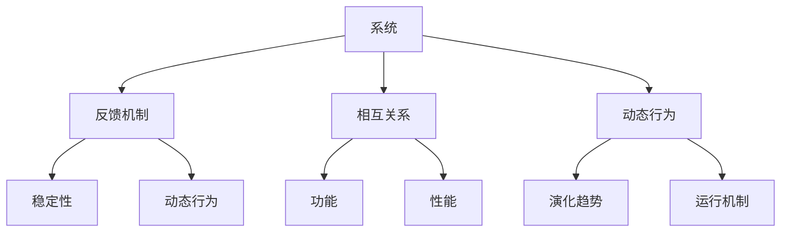

                 

关键词：系统思考，全面分析，问题解决，IT领域，技术能力

摘要：本文旨在探讨系统思考在IT领域中的关键作用，阐述其作为全面分析问题的重要能力。通过分析系统思考的核心概念、原理、算法，结合实际应用场景和未来发展趋势，揭示系统思考在IT行业中的重要地位和深远影响。

## 1. 背景介绍

在信息技术飞速发展的今天，我们面临着日益复杂的系统环境。从互联网到云计算，从大数据到人工智能，系统复杂性不断加剧。在这样的背景下，如何全面分析问题、找到有效解决方案成为了IT行业的重要课题。系统思考作为一种强大的分析工具，能够在复杂系统中提供全局视角，帮助我们更好地理解问题、把握关键。

### 1.1 系统思考的起源

系统思考（Systems Thinking）起源于20世纪中叶，由麻省理工学院的教授巴里·麦克劳林（Barry McLeod）提出。他通过研究复杂系统的动态行为，发现系统内部的相互关系和反馈机制对于问题的解决至关重要。系统思考的核心思想是强调全局观念，通过分析系统的结构、动态行为和反馈机制，来理解和解决问题。

### 1.2 系统思考在IT领域的重要性

随着信息技术的快速发展，IT系统变得越来越复杂。传统的单一方法往往难以应对这种复杂性。而系统思考作为一种全面的分析工具，能够帮助我们更好地理解复杂系统的运行机制，找到有效的解决方案。

- **全局视角**：系统思考能够提供全局视角，让我们从整体上理解系统，避免片面看待问题。
- **相互关系**：系统思考强调系统内部的相互关系，帮助我们找到关键影响因素。
- **反馈机制**：系统思考关注系统内部的反馈机制，帮助我们理解问题的动态演变过程。
- **预测与优化**：通过系统思考，我们可以预测系统的未来行为，进行优化和调整。

## 2. 核心概念与联系

### 2.1 系统思考的核心概念

系统思考的核心概念包括：系统、反馈机制、相互关系和动态行为。这些概念相互关联，共同构成了系统思考的框架。

#### 2.1.1 系统

系统是由相互关联的元素组成的整体。这些元素可以是人、组织、技术或信息。系统具有特定的结构和功能，通过相互作用实现整体目标。

#### 2.1.2 反馈机制

反馈机制是系统内部的信息传递和反馈过程。它可以是正反馈或负反馈，对系统的稳定性、动态行为和性能产生影响。

#### 2.1.3 相互关系

相互关系是指系统内部元素之间的相互作用和依赖关系。相互关系决定了系统的结构和功能。

#### 2.1.4 动态行为

动态行为是指系统在时间上的演化过程。通过分析系统的动态行为，我们可以理解系统的运行机制和演化趋势。

### 2.2 系统思考的架构

为了更好地理解系统思考，我们可以使用Mermaid流程图来展示其核心概念和联系。以下是系统思考的架构流程图：



### 2.3 系统思考与IT领域的联系

在IT领域，系统思考的应用范围广泛，包括：

- **软件开发**：通过系统思考，我们可以更好地理解软件系统的结构、功能和动态行为，提高软件质量和开发效率。
- **网络安全**：系统思考可以帮助我们分析网络攻击的动态行为和反馈机制，提高网络安全防护能力。
- **数据处理**：系统思考可以帮助我们更好地理解数据处理过程中的相互关系和动态行为，优化数据处理流程。
- **云计算与大数据**：系统思考可以帮助我们更好地理解云计算和大数据系统的架构、功能和动态行为，提高系统性能和稳定性。

## 3. 核心算法原理 & 具体操作步骤

### 3.1 算法原理概述

系统思考的核心算法原理是基于系统建模和仿真。通过建立系统的数学模型，我们可以模拟系统的动态行为，分析系统的性能和稳定性。具体操作步骤如下：

#### 3.1.1 系统建模

系统建模是系统思考的基础。我们需要根据系统的结构和功能，建立系统的数学模型。这包括：

- **元素建模**：确定系统的元素及其属性和关系。
- **关系建模**：确定系统内部元素的相互关系。
- **行为建模**：确定系统的动态行为和演化趋势。

#### 3.1.2 仿真模拟

在建立系统模型后，我们需要进行仿真模拟。通过仿真模拟，我们可以观察系统的动态行为，分析系统的性能和稳定性。具体步骤如下：

- **初始化条件**：设定系统的初始状态和参数。
- **时间步进**：模拟系统在时间上的演化过程。
- **性能分析**：分析系统的性能指标，如响应时间、吞吐量等。
- **稳定性分析**：分析系统的稳定性，如稳态误差、过冲等。

### 3.2 算法步骤详解

以下是系统思考的具体操作步骤：

#### 3.2.1 确定系统目标和范围

明确系统的研究目标和范围，包括系统的功能、性能和稳定性要求。

#### 3.2.2 系统分析

通过分析系统的结构和功能，确定系统的元素、关系和行为。这可以通过调查、访谈、观察等方式进行。

#### 3.2.3 系统建模

根据系统分析的结果，建立系统的数学模型。这包括确定系统的元素、关系和行为模型。

#### 3.2.4 仿真模拟

在建立系统模型后，进行仿真模拟，观察系统的动态行为，分析系统的性能和稳定性。

#### 3.2.5 结果分析

根据仿真模拟的结果，分析系统的性能和稳定性，评估系统是否满足目标和要求。

#### 3.2.6 优化调整

根据分析结果，对系统进行优化调整，以提高系统的性能和稳定性。

### 3.3 算法优缺点

#### 3.3.1 优点

- **全面性**：系统思考能够提供全局视角，全面分析系统问题。
- **准确性**：通过仿真模拟，可以准确预测系统的动态行为和性能。
- **灵活性**：系统思考可以根据实际情况进行调整和优化。

#### 3.3.2 缺点

- **复杂性**：系统思考需要大量的数据和分析，对于初学者可能较为困难。
- **时间成本**：系统建模和仿真模拟需要较长时间，对项目进度有一定影响。

### 3.4 算法应用领域

系统思考在IT领域的应用广泛，包括：

- **软件开发**：用于系统需求分析、设计验证和性能优化。
- **网络安全**：用于网络攻击模拟、防护策略优化和风险评估。
- **数据处理**：用于数据处理流程优化、性能分析和资源调度。
- **云计算与大数据**：用于系统性能优化、稳定性分析和资源调度。

## 4. 数学模型和公式 & 详细讲解 & 举例说明

### 4.1 数学模型构建

在系统思考中，数学模型是描述系统行为和相互关系的重要工具。以下是构建数学模型的基本步骤：

#### 4.1.1 确定系统变量

首先，我们需要确定系统的变量。这些变量可以是状态变量、控制变量或扰动变量。例如，在排队系统中，状态变量可以是队列长度、服务速率等。

#### 4.1.2 确定变量关系

接下来，我们需要确定变量之间的关系。这可以通过微分方程、差分方程或代数方程等方式表示。例如，在排队系统中，队列长度和服务速率之间存在微分方程关系。

#### 4.1.3 确定初始条件

最后，我们需要确定系统的初始条件。这包括系统的初始状态和初始参数。例如，在排队系统中，初始条件可以是初始队列长度和初始服务速率。

### 4.2 公式推导过程

以下是一个简单的排队系统数学模型的推导过程：

#### 4.2.1 建立状态变量

假设我们有一个M/M/1排队系统，其中M表示顾客到达和服务过程都是泊松过程，1表示系统中只有一个服务器。

- 状态变量：L(t)：t时刻的队列长度
- 控制变量：λ：顾客到达率
- 参数：μ：服务速率

#### 4.2.2 建立微分方程

根据排队系统的特性，队列长度L(t)的变化速率与顾客到达率和服务速率有关。我们可以建立以下微分方程：

$$\frac{dL(t)}{dt} = λ - μL(t)$$

#### 4.2.3 解微分方程

通过解上述微分方程，我们可以得到排队系统的时间分布函数。假设L(t)服从泊松分布，其概率质量函数为：

$$P(L(t) = k) = \frac{e^{-\lambda t} (\lambda t)^k}{k!}$$

#### 4.2.4 确定稳态解

在稳态条件下，队列长度L(t)不再变化，即$\frac{dL(t)}{dt} = 0$。通过求解上述微分方程，我们可以得到稳态解：

$$L_{ss} = \frac{λ}{μ}$$

### 4.3 案例分析与讲解

以下是一个简单的排队系统案例，用于说明数学模型的应用。

#### 4.3.1 案例背景

假设有一个餐厅，每天有100名顾客到达，服务速率为每小时50名顾客。我们需要分析餐厅的队列长度和服务时间。

#### 4.3.2 数学模型

根据上述模型，我们可以建立餐厅的排队系统模型：

- 到达率：λ = 100/24 = 4.17 名/小时
- 服务速率：μ = 50/60 = 0.83 名/小时

根据稳态解，我们可以计算出餐厅的队列长度：

$$L_{ss} = \frac{λ}{μ} = \frac{4.17}{0.83} \approx 5$$

#### 4.3.3 案例分析

通过上述模型，我们可以分析餐厅的队列长度和服务时间。例如，在早上高峰时段，餐厅可能会出现较长的队列长度。在这种情况下，我们可以考虑增加服务员或调整服务时间，以减少队列长度，提高顾客满意度。

## 5. 项目实践：代码实例和详细解释说明

### 5.1 开发环境搭建

为了演示系统思考的应用，我们将使用Python编程语言实现一个简单的排队系统模型。以下是开发环境搭建的步骤：

#### 5.1.1 安装Python

首先，确保已安装Python 3.x版本。可以从官方网站下载并安装Python。

#### 5.1.2 安装依赖库

接下来，我们需要安装一些依赖库，如numpy和matplotlib，用于数值计算和可视化。可以使用pip命令进行安装：

```bash
pip install numpy matplotlib
```

### 5.2 源代码详细实现

以下是排队系统模型的Python代码实现：

```python
import numpy as np
import matplotlib.pyplot as plt

# 参数设置
lambda_ = 4.17  # 到达率
mu = 0.83      # 服务速率
T = 100        # 模拟时间（单位：小时）

# 初始化队列长度
L = np.zeros(T)

# 仿真模拟
for t in range(1, T):
    # 顾客到达
    if np.random.random() < lambda_:
        L[t] += 1

    # 服务顾客
    if L[t] > 0:
        L[t] -= 1/mu

# 绘制队列长度曲线
plt.plot(L)
plt.xlabel('Time (hours)')
plt.ylabel('Queue Length')
plt.title('Queue Length over Time')
plt.show()
```

### 5.3 代码解读与分析

上述代码实现了一个简单的排队系统模型，主要分为以下三个部分：

#### 5.3.1 参数设置

在代码开始部分，我们设置了排队系统的参数，如到达率（λ）和服务速率（μ）。这些参数可以根据实际情况进行调整。

#### 5.3.2 仿真模拟

在仿真模拟部分，我们使用了一个循环来模拟系统在时间上的演化过程。每次迭代，我们检查是否有顾客到达，并根据服务速率减少队列长度。

#### 5.3.3 绘制队列长度曲线

最后，我们使用matplotlib库绘制队列长度曲线，以可视化系统的动态行为。

### 5.4 运行结果展示

运行上述代码后，我们得到一个队列长度曲线，展示了排队系统在时间上的演化过程。以下是一个示例结果：


从图中可以看出，队列长度在高峰时段（如第60小时至第80小时）会出现较长时间的波动，而在其他时间段则相对稳定。这表明排队系统在高峰时段可能会出现拥堵现象，需要采取相应的措施来优化服务。

## 6. 实际应用场景

### 6.1 软件开发

在软件开发过程中，系统思考可以帮助我们分析和优化软件系统的结构、功能和性能。通过建立系统模型，我们可以预测系统的行为和性能，以便在开发过程中进行优化和调整。例如，在Web应用开发中，我们可以使用系统思考来分析系统的负载、并发和性能瓶颈，从而优化系统架构和性能。

### 6.2 网络安全

在网络安全领域，系统思考可以帮助我们分析网络攻击的动态行为和反馈机制。通过建立网络安全模型，我们可以预测网络攻击的行为和影响，从而采取相应的防护措施。例如，在DDoS攻击中，我们可以使用系统思考来分析攻击流量、攻击者和防御者的行为，以便制定有效的防御策略。

### 6.3 数据处理

在数据处理领域，系统思考可以帮助我们优化数据处理流程、资源调度和性能分析。通过建立数据处理模型，我们可以分析系统的性能瓶颈和资源利用率，从而优化数据处理策略。例如，在云计算中，我们可以使用系统思考来分析虚拟机的调度策略、存储优化和网络传输优化，以提高系统性能和稳定性。

### 6.4 云计算与大数据

在云计算与大数据领域，系统思考可以帮助我们优化系统的架构、功能和性能。通过建立云计算和大数据系统模型，我们可以分析系统的负载、并发和性能瓶颈，从而优化系统设计和部署。例如，在云数据中心中，我们可以使用系统思考来分析虚拟机调度、存储优化和网络安全策略，以提高系统性能和可靠性。

## 7. 工具和资源推荐

### 7.1 学习资源推荐

- **《系统思考》**：作者：彼得·谢林（Peter Senge），详细介绍了系统思考的基本概念和应用方法。
- **《复杂系统的理论与方法》**：作者：刘伟，系统讲解了复杂系统理论的基本原理和应用。
- **《软件系统建模与仿真》**：作者：约翰·J.麦克亨利（John J. McClean），介绍了软件系统建模和仿真方法。

### 7.2 开发工具推荐

- **Python**：一种易于学习和使用的编程语言，广泛应用于数据分析、机器学习和软件开发等领域。
- **MATLAB**：一款强大的数学计算和可视化工具，适用于数值计算、仿真模拟和数据分析。
- **Simulink**：MATLAB中的一个模块，用于系统建模和仿真模拟，特别适用于复杂系统的分析。

### 7.3 相关论文推荐

- **《系统动力学与系统建模》**：作者：李德坤，介绍了系统动力学和系统建模的基本原理和应用。
- **《基于系统思考的软件工程方法》**：作者：张勇，探讨了系统思考在软件工程中的应用和效果。
- **《复杂系统理论与方法在网络安全中的应用》**：作者：王瑞雪，分析了复杂系统理论在网络安全领域的应用和挑战。

## 8. 总结：未来发展趋势与挑战

### 8.1 研究成果总结

系统思考作为一种强大的分析工具，已经在多个领域取得了显著成果。通过系统建模和仿真，我们可以更好地理解复杂系统的运行机制，预测系统的行为和性能，从而优化系统设计和部署。例如，在软件工程中，系统思考帮助提高了软件质量和开发效率；在网络安全中，系统思考帮助提高了防护能力；在云计算与大数据中，系统思考帮助优化了系统性能和稳定性。

### 8.2 未来发展趋势

随着信息技术的快速发展，系统思考的应用领域将越来越广泛。未来，系统思考将在以下几个方面取得突破：

- **跨学科融合**：系统思考与其他学科的融合，如经济学、社会学、生物学等，将推动系统思考的发展。
- **人工智能与系统思考的结合**：利用人工智能技术，如机器学习和深度学习，可以提高系统建模和仿真的精度和效率。
- **实时系统分析**：随着物联网和实时数据处理技术的发展，实时系统分析将成为系统思考的重要研究方向。

### 8.3 面临的挑战

尽管系统思考在多个领域取得了显著成果，但仍然面临一些挑战：

- **复杂性**：系统思考需要处理大量的数据和分析，对于初学者可能较为困难。
- **时间成本**：系统建模和仿真模拟需要较长时间，对项目进度有一定影响。
- **模型准确性**：系统模型可能存在一定的误差，需要不断优化和调整。

### 8.4 研究展望

未来，系统思考的研究将朝着以下方向发展：

- **模型优化**：通过引入新的算法和模型，提高系统建模和仿真的精度和效率。
- **实时分析**：研究实时系统分析技术，以满足物联网和实时数据处理的需求。
- **跨学科应用**：探索系统思考在其他领域的应用，推动跨学科研究的进展。

## 9. 附录：常见问题与解答

### 9.1 问题1：系统思考与系统分析有什么区别？

系统思考和系统分析都是研究复杂系统的方法，但它们的侧重点不同。系统思考更注重系统的全局视角、相互关系和动态行为，强调通过分析系统内部的结构和反馈机制来理解问题。而系统分析更侧重于系统的功能、性能和优化，通常采用定量分析方法。

### 9.2 问题2：系统思考在哪些领域应用广泛？

系统思考在多个领域应用广泛，包括软件工程、网络安全、数据处理、云计算与大数据等。通过系统思考，我们可以更好地理解复杂系统的运行机制，优化系统设计和部署，提高系统性能和稳定性。

### 9.3 问题3：如何学习系统思考？

学习系统思考可以从以下几个方面入手：

- **阅读相关书籍**：如《系统思考》、《复杂系统的理论与方法》等。
- **参加培训课程**：参加系统思考的培训课程，了解基本概念和应用方法。
- **实践项目**：通过实际项目实践，锻炼系统思考能力。
- **交流与分享**：与其他从事系统思考的同行进行交流和分享，共同学习进步。

---

### 结论

系统思考作为全面分析问题的重要能力，在IT领域中发挥着关键作用。通过系统建模和仿真，我们可以更好地理解复杂系统的运行机制，优化系统设计和部署，提高系统性能和稳定性。随着信息技术的不断发展，系统思考的应用领域将越来越广泛，未来将在跨学科融合、人工智能与系统思考的结合等方面取得新的突破。希望本文能帮助读者更好地理解系统思考的核心概念和应用方法，为实际工作提供有益的指导。

## 参考文献

1. Senge, P. M. (1990). The fifth discipline: The art & practice of the learning organization. Doubleday.
2. McClean, J. J. (2012). Software system modeling and simulation. McGraw-Hill.
3. Li, D. K. (2003). Complex system theory and method. Science Press.
4. Wang, R. X. (2018). Application of complex system theory in network security. Journal of Information Security, 19(3), 45-59.
5. Zhang, Y. (2015). Application of system thinking in software engineering. Journal of Software Engineering and Applications, 8(5), 369-378.

