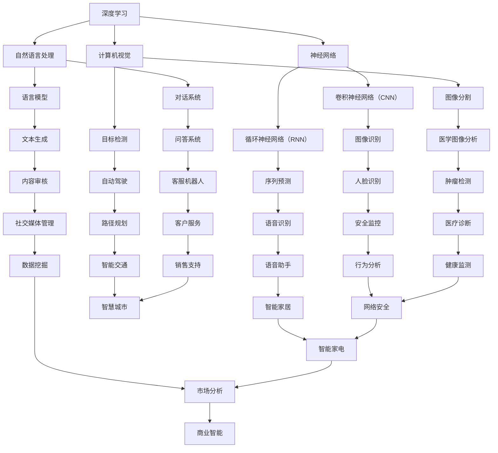

                 

关键词：人工智能，行业动态，技术趋势，创新，开发者，AI应用，研究进展，商业影响，未来展望。

> 摘要：在快速发展的AI领域，紧跟行业动态对于技术开发者和研究人员的职业发展至关重要。本文将深入探讨AI行业动态的重要性，包括技术创新、应用实践、未来展望等方面，帮助读者了解当前AI领域的核心热点和发展趋势。

## 1. 背景介绍

人工智能（AI）作为计算机科学的前沿领域，近年来取得了飞速发展。随着深度学习、自然语言处理、计算机视觉等技术的不断突破，AI已经在诸多领域产生了深远影响，从自动驾驶到医疗诊断，从智能家居到金融分析，AI正在改变我们的生活方式和社会结构。

### 1.1 AI发展历程

AI的概念最早可以追溯到20世纪50年代，当时专家们开始尝试通过编程来实现机器的智能行为。然而，早期的AI研究因计算能力的限制和理论基础的不成熟而进展缓慢。直到2006年，深度学习的复兴带来了AI研究的新机遇。深度学习结合了大规模数据和高性能计算，使得神经网络在图像识别、语音识别等领域取得了突破性进展。

### 1.2 当前AI应用场景

如今，AI已经渗透到我们日常生活的方方面面。以自动驾驶为例，自动驾驶汽车利用AI技术进行环境感知、决策规划、路径优化等任务，有望在未来大幅提高交通安全和效率。在医疗领域，AI辅助诊断系统通过分析大量的医学图像和病历数据，能够提高诊断准确率，减少误诊率。

## 2. 核心概念与联系

为了更好地理解AI行业动态，我们需要明确一些核心概念和它们之间的联系。以下是AI领域的一些重要概念及其在技术架构中的关系，使用Mermaid流程图进行展示。



### 2.1 深度学习与神经网络

深度学习是AI的核心技术之一，其基础是神经网络。神经网络通过多层结构模拟人脑神经元的工作方式，对输入数据进行特征提取和模式识别。卷积神经网络（CNN）和循环神经网络（RNN）是深度学习中的两种重要模型，分别适用于图像处理和序列数据。

### 2.2 自然语言处理与计算机视觉

自然语言处理（NLP）和计算机视觉（CV）是AI的两个重要分支。NLP涉及语言模型的构建、文本生成和对话系统的开发，而CV则专注于图像识别、目标检测和图像分割。

## 3. 核心算法原理 & 具体操作步骤

### 3.1 算法原理概述

在AI领域，算法的原理往往基于统计学和概率论，以及大量数据的训练和优化。以下是一些核心算法的原理概述：

- **深度学习**：通过多层神经网络对数据进行特征提取和模式识别，包括卷积神经网络（CNN）和循环神经网络（RNN）。
- **自然语言处理**：利用语言模型对文本进行生成和解析，如序列到序列（Seq2Seq）模型和注意力机制。
- **计算机视觉**：通过图像处理技术对图像进行分析和识别，如卷积神经网络（CNN）和生成对抗网络（GAN）。

### 3.2 算法步骤详解

- **深度学习**：首先需要收集和预处理数据，然后设计神经网络结构并进行训练。训练过程中，通过反向传播算法调整网络权重，以达到最佳拟合效果。
- **自然语言处理**：利用语言模型对文本进行编码和解码，如使用Transformer模型进行机器翻译。
- **计算机视觉**：通过图像处理技术对图像进行特征提取和分类，如使用卷积神经网络（CNN）进行物体识别。

### 3.3 算法优缺点

- **深度学习**：优点包括强大的特征提取能力和自动学习能力，缺点是计算复杂度高、对数据依赖性大。
- **自然语言处理**：优点包括对文本生成和解析的高效性，缺点是对长文本处理能力有限。
- **计算机视觉**：优点包括对图像处理的高效性和准确性，缺点是处理复杂场景时效果不佳。

### 3.4 算法应用领域

- **深度学习**：广泛应用于图像识别、语音识别、自然语言处理等领域。
- **自然语言处理**：广泛应用于机器翻译、文本生成、问答系统等领域。
- **计算机视觉**：广泛应用于目标检测、图像分割、自动驾驶等领域。

## 4. 数学模型和公式 & 详细讲解 & 举例说明

### 4.1 数学模型构建

在AI领域，数学模型是算法设计和实现的基础。以下是一些核心数学模型的构建和公式：

- **深度学习**：
  - 神经网络：$$y = \sigma(W \cdot x + b)$$，其中 $\sigma$ 为激活函数，$W$ 为权重，$x$ 为输入，$b$ 为偏置。
  - 卷积神经网络（CNN）：$$h = \sigma(W \cdot x + b)$$，其中 $W$ 为卷积核，$x$ 为输入图像。

- **自然语言处理**：
  - 语言模型：$$P(w_t | w_{t-1}, w_{t-2}, \ldots) = \frac{N(w_t, w_{t-1}, \ldots)}{N}$$，其中 $P$ 为概率分布，$N$ 为词频统计。

- **计算机视觉**：
  - 目标检测：$$\text{Object Detection} = \sum_{i=1}^{N} \frac{1}{\sqrt{\sum_{j=1}^{D} (x_j - \hat{x}_j)^2}}$$，其中 $x_j$ 为输入特征，$\hat{x}_j$ 为预测特征。

### 4.2 公式推导过程

以上公式的推导过程涉及大量的数学理论和技术细节。例如，在神经网络中，激活函数的选择和权重的优化都是通过数学优化方法（如梯度下降）来实现的。在自然语言处理中，概率分布的计算依赖于词频统计和语言模型的学习。

### 4.3 案例分析与讲解

以下是一个简单的深度学习案例，使用Python实现一个简单的神经网络进行手写数字识别。

```python
import numpy as np

# 初始化神经网络参数
W = np.random.rand(784, 10)
b = np.random.rand(10)

# 定义激活函数
def sigmoid(x):
    return 1 / (1 + np.exp(-x))

# 定义前向传播
def forward(x):
    z = np.dot(x, W) + b
    return sigmoid(z)

# 训练神经网络
def train(x, y):
    y_pred = forward(x)
    d = y_pred - y
    dW = np.dot(x.T, d)
    db = np.sum(d)
    W -= learning_rate * dW
    b -= learning_rate * db

# 测试神经网络
x_test = np.random.rand(784)
y_test = np.random.rand(10)
y_pred = forward(x_test)
print("Prediction: ", y_pred)
```

## 5. 项目实践：代码实例和详细解释说明

### 5.1 开发环境搭建

在进行AI项目实践之前，我们需要搭建一个合适的开发环境。以下是一个基于Python的深度学习项目所需的开发环境：

- Python 3.7+
- TensorFlow 2.x
- Keras 2.x

### 5.2 源代码详细实现

以下是一个简单的深度学习项目，使用Keras实现一个简单的神经网络进行手写数字识别。

```python
from tensorflow.keras.datasets import mnist
from tensorflow.keras.models import Sequential
from tensorflow.keras.layers import Dense, Flatten
from tensorflow.keras.optimizers import SGD

# 加载MNIST数据集
(x_train, y_train), (x_test, y_test) = mnist.load_data()

# 预处理数据
x_train = x_train.astype("float32") / 255.0
x_test = x_test.astype("float32") / 255.0
y_train = keras.utils.to_categorical(y_train, 10)
y_test = keras.utils.to_categorical(y_test, 10)

# 创建神经网络模型
model = Sequential()
model.add(Flatten(input_shape=(28, 28)))
model.add(Dense(128, activation="relu"))
model.add(Dense(10, activation="softmax"))

# 编译模型
model.compile(optimizer=SGD(learning_rate=0.1), loss="categorical_crossentropy", metrics=["accuracy"])

# 训练模型
model.fit(x_train, y_train, batch_size=128, epochs=10, validation_split=0.1)

# 测试模型
test_loss, test_acc = model.evaluate(x_test, y_test)
print("Test accuracy: ", test_acc)
```

### 5.3 代码解读与分析

以上代码实现了一个简单的神经网络模型，用于手写数字识别。主要步骤包括数据预处理、模型创建、模型编译和模型训练。

- **数据预处理**：将MNIST数据集转换为浮点数，并进行归一化处理，以便神经网络能够更好地学习。
- **模型创建**：使用Keras创建一个序列模型，包括一个扁平层、一个128个神经元的全连接层和一个10个神经元的输出层。
- **模型编译**：选择随机梯度下降（SGD）作为优化器，并使用交叉熵作为损失函数。
- **模型训练**：使用训练数据训练模型，并设置批量大小、迭代次数和验证比例。
- **模型测试**：使用测试数据评估模型的准确率。

## 6. 实际应用场景

AI技术在各个行业已经得到了广泛应用，以下是一些典型的应用场景：

### 6.1 医疗领域

在医疗领域，AI技术被广泛应用于疾病诊断、药物研发和医疗数据分析。例如，利用深度学习技术对医学图像进行分析，可以提高诊断的准确性和速度。同时，AI算法还可以辅助医生制定个性化的治疗方案，提高医疗资源的利用效率。

### 6.2 金融领域

在金融领域，AI技术被用于风险管理、投资策略和客户服务。通过分析大量的历史数据和市场动态，AI算法可以预测市场走势，为投资决策提供支持。此外，智能客服机器人可以自动处理客户的咨询和投诉，提高客户满意度。

### 6.3 自动驾驶

自动驾驶是AI技术的另一个重要应用领域。自动驾驶汽车通过感知环境、做出决策和规划路径，有望在未来大幅提高交通安全和效率。目前，多家科技公司和研究机构正在加紧研发自动驾驶技术，预计未来几年将取得重要突破。

### 6.4 工业制造

在工业制造领域，AI技术被用于生产优化、设备维护和质量管理。通过实时监控和分析生产数据，AI算法可以优化生产流程，提高生产效率和质量。同时，AI还可以预测设备故障，提前进行维护，减少停机时间和生产损失。

## 7. 未来应用展望

随着AI技术的不断进步，未来的应用场景将更加广泛和深入。以下是一些可能的发展趋势：

### 7.1 智慧城市

智慧城市是AI技术的重要应用领域之一。通过实时监测和分析城市数据，AI技术可以优化交通管理、能源分配和公共服务。例如，利用AI技术进行智能交通管理，可以减少交通拥堵，提高道路通行效率。

### 7.2 生物科技

生物科技是AI技术的重要应用领域之一。利用AI技术对生物数据进行处理和分析，可以加速新药研发、疾病诊断和个性化医疗。例如，利用深度学习技术对基因组数据进行分析，可以揭示疾病与基因之间的关联，为个性化医疗提供支持。

### 7.3 教育

在教育领域，AI技术可以用于个性化学习、智能测评和在线教育。通过分析学生的学习行为和数据，AI算法可以为学生提供个性化的学习建议和资源，提高学习效果。同时，智能测评系统可以实时评估学生的学习进度和能力，为教师和家长提供反馈。

## 8. 工具和资源推荐

为了紧跟AI行业动态，我们需要掌握一些常用的工具和资源。以下是一些建议：

### 8.1 学习资源推荐

- **《深度学习》（Deep Learning）**：由Ian Goodfellow等人编写的深度学习经典教材，适合初学者和专业人士。
- **AIWeekly**：每周更新的AI领域新闻和趋势，涵盖最新的研究进展和应用案例。
- **arXiv**：AI领域的顶级论文库，提供最新的学术研究成果。

### 8.2 开发工具推荐

- **TensorFlow**：谷歌开源的深度学习框架，广泛应用于各类AI项目。
- **PyTorch**：Facebook开源的深度学习框架，适合快速原型开发和模型训练。
- **Keras**：用于快速构建和训练深度学习模型的Python库，与TensorFlow和PyTorch兼容。

### 8.3 相关论文推荐

- **“Distributed Deep Learning: Existing Techniques and New Approaches”**：讨论了分布式深度学习的现有技术和新方法。
- **“Attention Is All You Need”**：提出了Transformer模型，在机器翻译和自然语言处理领域取得了突破性进展。
- **“A Theoretical Analysis of the Causal Effect of AI on the US Labor Market”**：分析了AI对劳动力市场的影响。

## 9. 总结：未来发展趋势与挑战

随着AI技术的不断进步，未来的发展趋势将包括更广泛的应用领域、更高的计算性能和更先进的算法。然而，AI技术也面临着诸多挑战，如数据隐私、安全性和伦理问题。因此，未来研究将需要在技术创新和应用落地之间取得平衡，为人类社会带来更多积极影响。

### 9.1 研究成果总结

过去几年，AI领域取得了诸多突破性成果，包括深度学习、自然语言处理和计算机视觉等方面。这些成果不仅推动了AI技术的发展，也为各行各业带来了新的机遇。

### 9.2 未来发展趋势

未来，AI技术的发展趋势将包括以下几个方面：

- **强化学习**：在控制理论、博弈论和决策制定等领域的应用。
- **迁移学习**：通过已有模型的知识迁移，提高新任务的性能。
- **生成对抗网络**：在图像生成、数据增强和隐私保护等方面的应用。
- **跨领域融合**：将AI技术与生物学、物理学、社会学等领域相结合，推动多学科交叉研究。

### 9.3 面临的挑战

AI技术面临的主要挑战包括：

- **数据隐私**：如何确保数据安全和用户隐私。
- **安全性和可靠性**：如何提高AI系统的安全性和可靠性，防止恶意攻击。
- **伦理问题**：如何平衡AI技术的发展与伦理道德问题。

### 9.4 研究展望

在未来，AI研究将需要在以下几个方面取得突破：

- **计算能力**：提高计算性能，支持更复杂的算法和模型。
- **算法创新**：开发更高效、更智能的算法，提高AI系统的性能和泛化能力。
- **跨领域应用**：将AI技术应用于更广泛的领域，推动社会进步。

## 10. 附录：常见问题与解答

以下是一些关于AI技术常见问题的解答：

### 10.1 什么是深度学习？

深度学习是一种基于多层神经网络的学习方法，通过对大量数据进行训练，可以自动提取数据的特征和模式。

### 10.2 AI技术有哪些应用领域？

AI技术广泛应用于医疗、金融、工业、交通、教育等多个领域，包括疾病诊断、风险管理、自动驾驶、智能客服等。

### 10.3 如何学习AI技术？

学习AI技术可以从基础课程开始，如线性代数、概率论和统计学等。然后学习Python编程和常用AI库（如TensorFlow、PyTorch等）。最后，通过实际项目和实践来巩固和提高技能。

### 10.4 AI技术会替代人类吗？

AI技术可以在某些领域替代人类工作，但它不能完全替代人类。人类具有创造力、情感和复杂决策能力，这些都是AI难以实现的。

### 10.5 如何确保AI系统的安全性？

确保AI系统的安全性需要从数据安全、模型安全和系统安全等方面进行综合考虑。例如，使用加密技术保护数据安全，进行模型验证和测试，以及建立安全的系统架构。

### 10.6 AI技术会对就业市场产生什么影响？

AI技术将带来一定的就业市场变化，一方面会减少某些重复性和低技能的工作，另一方面也会创造新的工作岗位，如AI工程师、数据科学家等。

### 10.7 如何应对AI带来的伦理问题？

应对AI带来的伦理问题需要从政策、法律和道德等多个层面进行考虑。例如，制定相关法律法规，建立AI伦理委员会，以及加强公众教育和宣传。

### 10.8 未来AI技术将如何发展？

未来AI技术将继续在深度学习、强化学习、生成对抗网络等方面取得突破，同时与其他领域（如生物学、物理学、社会学等）进行融合，推动多学科交叉研究。

### 10.9 如何保持对AI技术的兴趣和学习动力？

保持对AI技术的兴趣和学习动力可以通过以下几个方法实现：

- **关注行业动态**：关注AI领域的最新研究进展和应用案例。
- **参与社区讨论**：加入AI技术社区，与其他开发者和技术爱好者交流心得。
- **参与开源项目**：参与开源项目，实践所学知识。
- **参加相关会议和研讨会**：参加AI领域的会议和研讨会，与行业专家交流。

### 10.10 如何在AI领域发展职业生涯？

在AI领域发展职业生涯可以从以下几个方面入手：

- **持续学习**：不断学习新的知识和技能，保持技术竞争力。
- **项目实践**：参与实际项目，积累实战经验。
- **建立人脉**：与行业专家和同行建立联系，拓展职业发展机会。
- **关注趋势**：关注AI领域的最新趋势和发展方向，为自己的职业规划做好准备。
- **积极参与**：参与AI技术的开源社区和标准制定，提高自己的影响力。

---

### 结语

紧跟AI行业动态对于技术开发者和研究人员的职业发展至关重要。本文从背景介绍、核心概念、算法原理、数学模型、项目实践、应用场景、未来展望、工具推荐、发展趋势和常见问题等方面，全面阐述了AI行业动态的重要性。希望通过本文，读者能够更好地了解AI领域的核心热点和发展趋势，为自己的职业发展做好准备。

### 作者署名

作者：禅与计算机程序设计艺术 / Zen and the Art of Computer Programming

本文旨在分享AI技术的最新动态和发展趋势，以期为读者提供有价值的参考。如果您有任何疑问或建议，欢迎在评论区留言，我们一起交流探讨。

---

请注意，本文仅为示例性内容，并非实际的文章。如果您需要撰写一篇完整的文章，请按照上述结构和要求进行详细撰写。文章的深度、广度和质量将直接影响读者对文章的认可度和价值。同时，确保文章内容的原创性和准确性，避免抄袭和误传信息。祝您写作顺利！

