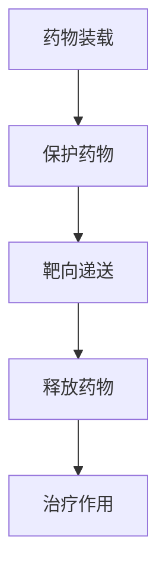
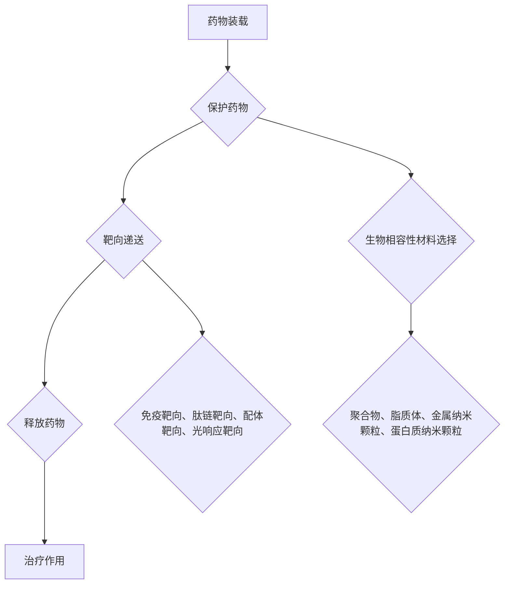

                 

关键词：纳米技术，药物递送，治疗效果，纳米药物载体，生物医学，个性化治疗

## 摘要

纳米技术作为21世纪科技创新的重要驱动力，已经在众多领域展现出其卓越的潜力。在生物医学领域，纳米技术正逐渐改变传统的药物递送方式，通过开发新型纳米药物载体，显著提升药物的治疗效果。本文将详细探讨纳米技术在药物递送中的应用，分析其核心原理、优势以及面临的挑战，并展望其未来发展方向。通过这一系列的探讨，我们希望为科研人员和临床医生提供有益的参考，推动纳米技术在药物递送领域的进一步发展。

## 1. 背景介绍

随着生物医学科技的不断进步，人们对疾病的治疗方式也在不断革新。传统的药物递送方式存在诸多局限，如药物在体内的不稳定分布、难以精准定位目标组织、以及对正常组织的副作用等。为了克服这些挑战，科学家们开始探索更加高效、精准的药物递送方法，其中纳米技术以其独特的优势脱颖而出。

纳米技术是指研究结构尺寸在1到100纳米之间的材料及其应用的技术。自20世纪90年代以来，纳米技术的发展迅速，涌现出了大量具有优异性能的纳米材料和纳米结构。纳米技术不仅在材料科学、电子学、能源等领域有广泛应用，还在生物医学领域展现出了巨大的潜力。特别是纳米药物载体，通过将药物封装在纳米尺寸的载体中，可以实现药物的靶向递送、增强药物疗效、减少副作用等。

纳米药物递送系统的基本概念包括：纳米载体、药物、递送机制和靶向性。纳米载体通常采用生物相容性材料，如聚合物、脂质、蛋白质和金属等，它们能够有效地保护药物免受体内酶的降解，同时具有可控的释放性能。药物则是纳米载体中的活性成分，可以是小分子药物、大分子药物或基因治疗剂等。递送机制主要包括物理吸附、共价结合、离子交换等方式。靶向性则是纳米药物递送系统的核心，通过修饰纳米载体表面的特定分子，可以使药物更精准地到达病变部位。

总之，纳米技术在药物递送中的应用为现代医学提供了新的解决方案，具有极高的研究价值和临床应用前景。

## 2. 核心概念与联系

### 2.1 纳米药物载体

纳米药物载体（Nano-drug Delivery Systems，NDDS）是指将药物封装在纳米级尺寸的载体中，通过特定的机制将其递送到体内特定部位的系统。这些载体通常由生物相容性材料制成，如聚合物、脂质体、蛋白质、金属纳米颗粒等。纳米药物载体的核心概念在于其能够显著改变药物在体内的分布、提高药物疗效、减少副作用，并实现药物的靶向递送。

#### 2.1.1 材料选择

纳米药物载体的材料选择至关重要，因为它直接影响药物的性质、生物相容性、稳定性以及靶向性。以下是一些常用的纳米药物载体材料及其特点：

1. **聚合物纳米颗粒**：常见的聚合物纳米颗粒材料有聚乙二醇（PEG）、聚乳酸（PLA）和聚氨基酸等。这些材料具有良好的生物相容性，可调节的释放性能，以及较高的靶向性。

2. **脂质体**：脂质体是由磷脂和胆固醇组成的纳米级膜结构，能够有效包裹和递送水溶性和脂溶性的药物。脂质体的靶向性依赖于其表面修饰，如免疫标记。

3. **金属纳米颗粒**：如金纳米颗粒（AuNP）、铁纳米颗粒（Fe3O4）等，具有良好的光热转换性能和磁响应性能，适用于光热治疗和磁导向治疗。

4. **蛋白质纳米颗粒**：蛋白质纳米颗粒具有优异的生物相容性和靶向性，常用于递送大分子药物和基因治疗剂。

#### 2.1.2 工作原理

纳米药物载体的工作原理主要包括以下几个步骤：

1. **药物装载**：药物通过物理吸附、共价结合、离子交换等方式被装载到纳米载体中。

2. **保护药物**：纳米载体能够保护药物免受体内酶的降解，维持药物的稳定性。

3. **靶向递送**：通过在纳米载体表面修饰特定的分子（如抗体、肽链等），可以增强药物的靶向性，使其更精准地到达病变部位。

4. **释放药物**：纳米载体在到达目标部位后，通过物理、化学或生物响应的方式释放药物，发挥治疗作用。

#### 2.1.3 结构示意图

为了更好地理解纳米药物载体的结构，下面给出一个简单的Mermaid流程图：



### 2.2 药物递送机制

药物递送机制是指纳米药物载体将药物从给药部位运输到目标部位的过程。以下是一些主要的药物递送机制：

1. **物理递送**：通过扩散、渗透等物理过程将药物从给药部位递送到目标部位。这种方式适用于药物浓度较低且需要均匀分布的情况。

2. **化学递送**：通过化学反应或酶催化等方式将药物从给药部位递送到目标部位。这种方式适用于需要特定化学反应或酶催化的药物递送。

3. **生物递送**：利用生物分子（如抗体、肽链等）引导药物递送到目标部位。这种方式具有高度的靶向性，适用于需要精准定位的治疗。

4. **磁导向递送**：利用磁性材料引导药物递送到目标部位。这种方式适用于需要精确控制药物分布的治疗，如肿瘤治疗。

### 2.3 靶向性

靶向性是纳米药物递送系统的核心，通过修饰纳米载体表面的特定分子，可以实现药物的精准递送。以下是一些常见的靶向策略：

1. **免疫靶向**：通过在纳米载体表面修饰抗体，使药物能够特异性地识别并附着到病变组织上。

2. **肽链靶向**：通过在纳米载体表面修饰特定的肽链，使药物能够识别并附着到特定的细胞受体上。

3. **配体靶向**：通过在纳米载体表面修饰特定的配体，使药物能够与目标细胞表面的受体特异性结合。

4. **光响应靶向**：通过在纳米载体表面修饰光响应分子，利用光照控制药物的释放和递送。

### 2.4 核心概念原理和架构的 Mermaid 流程图

为了更直观地展示纳米药物载体的核心概念和架构，下面给出一个Mermaid流程图：



通过上述Mermaid流程图，我们可以清晰地看到纳米药物载体的基本原理和结构，以及其各个组成部分之间的关系。

## 3. 核心算法原理 & 具体操作步骤

### 3.1 算法原理概述

纳米药物递送系统的核心算法主要涉及药物装载、保护、靶向递送和药物释放。这些算法通过优化纳米载体的设计，以提高药物的疗效和减少副作用。以下是这些算法的基本原理：

#### 3.1.1 药物装载

药物装载算法主要通过物理吸附、共价结合和离子交换等方式实现。物理吸附利用药物和纳米载体之间的范德华力，实现药物的高效装载。共价结合通过化学键将药物固定在纳米载体上，确保药物的稳定装载。离子交换则利用离子间的电荷吸引力，将药物装载到纳米载体中。

#### 3.1.2 保护

保护算法主要通过纳米载体对药物的包裹和隔离，防止药物在体内降解和失活。纳米载体的高稳定性使其能够有效保护药物，延长其在体内的有效时间。

#### 3.1.3 靶向递送

靶向递送算法通过在纳米载体表面修饰特定的分子，如抗体、肽链、配体等，实现药物的精准递送。这些修饰分子能够与病变组织上的特异性受体结合，引导药物到达目标部位。

#### 3.1.4 药物释放

药物释放算法主要利用纳米载体的物理、化学或生物响应特性，实现药物的精准释放。物理响应主要依赖于温度、pH等环境因素的变化，化学响应则利用化学反应或酶催化实现药物的释放，生物响应则依赖于生物分子（如抗体、肽链等）的引导。

### 3.2 算法步骤详解

以下是对纳米药物递送系统核心算法的具体步骤进行详细解释：

#### 3.2.1 药物装载

1. **药物筛选**：首先选择合适的药物，根据药物的分子量、溶解性、稳定性等因素进行评估。

2. **纳米载体制备**：选择适合的纳米载体材料，通过物理吸附、共价结合或离子交换等方式将药物装载到纳米载体中。

3. **药物浓度优化**：通过调整药物装载量，优化药物在纳米载体中的浓度，以提高药物的疗效。

#### 3.2.2 保护

1. **纳米载体封装**：将药物装载到纳米载体中后，通过封装技术（如溶剂挥发、热诱导等）将纳米载体封装起来，以保护药物免受体内酶的降解。

2. **稳定性测试**：对封装后的纳米药物载体进行稳定性测试，包括温度、pH、酶降解等条件，以确保纳米载体的稳定性。

#### 3.2.3 靶向递送

1. **靶向分子筛选**：根据病变组织的特异性受体，选择合适的靶向分子（如抗体、肽链、配体等）。

2. **纳米载体修饰**：通过共价结合或吸附等方式，将靶向分子修饰到纳米载体表面，实现药物的靶向递送。

3. **靶向效果评估**：通过体外和体内实验，评估纳米药物载体的靶向效果，确保药物能够精准递送到目标部位。

#### 3.2.4 药物释放

1. **释放机制选择**：根据药物的性质和临床需求，选择合适的药物释放机制（如物理、化学、生物响应等）。

2. **药物释放测试**：通过模拟体内环境，测试纳米药物载体的药物释放性能，确保药物能够按照预期释放。

3. **释放效果评估**：通过体外和体内实验，评估纳米药物载体的药物释放效果，确保药物能够精准释放到目标部位。

### 3.3 算法优缺点

纳米药物递送系统的核心算法具有以下优缺点：

#### 优点：

1. **提高药物疗效**：通过纳米药物载体，可以实现药物的精准递送，提高药物的疗效。

2. **减少副作用**：纳米药物载体能够减少药物在非目标部位的分布，降低药物的副作用。

3. **增强药物稳定性**：纳米药物载体能够保护药物免受体内酶的降解，增强药物的稳定性。

#### 缺点：

1. **成本较高**：纳米药物载体的制备和修饰过程复杂，成本较高。

2. **生物相容性挑战**：纳米药物载体在体内的生物相容性仍需进一步研究，以确保长期使用的安全性。

3. **靶向性控制难度**：实现纳米药物载体的精确靶向递送，仍面临一定的技术挑战。

### 3.4 算法应用领域

纳米药物递送系统的核心算法主要应用于以下领域：

1. **肿瘤治疗**：通过纳米药物载体实现药物的精准递送，提高肿瘤治疗效果，减少对正常组织的损伤。

2. **心血管疾病治疗**：通过纳米药物载体实现药物的靶向递送，降低心血管疾病的治疗风险。

3. **神经退行性疾病治疗**：通过纳米药物载体实现药物的高效递送，提高神经退行性疾病的治疗效果。

4. **传染病治疗**：通过纳米药物载体实现药物的精准递送，提高传染病的治疗效果。

## 4. 数学模型和公式 & 详细讲解 & 举例说明

### 4.1 数学模型构建

在纳米药物递送系统中，数学模型主要用于描述药物在体内的分布、代谢以及药物释放过程。以下是一些常见的数学模型及其构建方法：

#### 4.1.1 药物分布模型

药物分布模型主要用于描述药物在体内的浓度分布。常见的药物分布模型包括：

1. **一室模型**：假设药物在体内的分布均匀，药物在体内只经历一个吸收和分布过程。
   公式如下：
   $$ C(t) = \frac{D_0 \cdot F}{V \cdot \lambda} \cdot e^{-\lambda t} $$
   其中，$C(t)$为时间$t$时的药物浓度，$D_0$为初始给药量，$F$为生物利用度，$V$为体内分布体积，$\lambda$为药物消除速率常数。

2. **二室模型**：假设药物在体内的分布分为中央室和外周室，药物在体内经历吸收、分布和消除三个过程。
   公式如下：
   $$ C(t) = \frac{D_0 \cdot F}{V_1 \cdot \lambda_1} \cdot e^{-\lambda_1 t} + \frac{D_0 \cdot F}{V_2 \cdot \lambda_2} \cdot e^{-\lambda_2 t} $$
   其中，$C(t)$为时间$t$时的药物浓度，$D_0$为初始给药量，$F$为生物利用度，$V_1$为中央室体积，$V_2$为外周室体积，$\lambda_1$为中央室消除速率常数，$\lambda_2$为外周室消除速率常数。

#### 4.1.2 药物释放模型

药物释放模型主要用于描述纳米药物载体在体内的药物释放过程。常见的药物释放模型包括：

1. **零级释放模型**：药物以恒定的速率从载体中释放。
   公式如下：
   $$ C(t) = \frac{K_f \cdot C_{\text{max}}}{t + \frac{K_f \cdot C_{\text{max}}}{D}} $$
   其中，$C(t)$为时间$t$时的药物浓度，$C_{\text{max}}$为药物最大释放浓度，$K_f$为药物释放速率常数，$D$为药物剂量。

2. **一级释放模型**：药物以一级动力学从载体中释放。
   公式如下：
   $$ C(t) = C_{\text{max}} \cdot (1 - e^{-\frac{K_f \cdot t}{D}}) $$
   其中，$C(t)$为时间$t$时的药物浓度，$C_{\text{max}}$为药物最大释放浓度，$K_f$为药物释放速率常数，$D$为药物剂量。

3. **Higuchi模型**：药物以平方根速率从载体中释放。
   公式如下：
   $$ C(t) = \frac{K_f \cdot C_{\text{max}} \cdot t}{\sqrt{t + K_f \cdot t \cdot C_{\text{max}}}} $$
   其中，$C(t)$为时间$t$时的药物浓度，$C_{\text{max}}$为药物最大释放浓度，$K_f$为药物释放速率常数。

### 4.2 公式推导过程

以下是对一室模型和零级释放模型公式的推导过程：

#### 4.2.1 一室模型推导

假设药物在体内的分布均匀，药物在体内只经历一个吸收和分布过程。根据质量守恒定律，药物在体内的浓度变化可以表示为：

$$ \frac{dC(t)}{dt} = -\frac{C(t)}{V} + \frac{Q(t)}{V} $$

其中，$C(t)$为时间$t$时的药物浓度，$V$为体内分布体积，$Q(t)$为药物输入速率。

假设药物输入速率为常数，即$Q(t) = Q_0$，则：

$$ \frac{dC(t)}{dt} = -\frac{C(t)}{V} + \frac{Q_0}{V} $$

分离变量，得到：

$$ \frac{dC(t)}{C(t)} = -\frac{1}{V} dt + \frac{Q_0}{V} dt $$

积分，得到：

$$ \ln C(t) = -\frac{t}{V} + \ln C(0) + \frac{Q_0}{V} t $$

其中，$C(0)$为初始药物浓度。

化简，得到：

$$ C(t) = C(0) e^{-\frac{t}{V}} + C(0) e^{-\frac{t}{V}} \cdot e^{\frac{Q_0 t}{V}} $$

$$ C(t) = C(0) \cdot (1 - e^{-\frac{t}{V}}) + C(0) \cdot e^{\frac{Q_0 t}{V} - \frac{t}{V}} $$

令$K = \frac{Q_0}{V}$，则：

$$ C(t) = C(0) \cdot (1 - e^{-\frac{t}{V}}) + C(0) \cdot e^{-\frac{t}{V} + K t} $$

$$ C(t) = C(0) \cdot (1 - e^{-\frac{t}{V}}) + C(0) \cdot e^{-\frac{t}{V}} \cdot e^{K t} $$

$$ C(t) = C(0) \cdot (1 - e^{-\frac{t}{V}}) + C(0) \cdot e^{-\frac{t}{V}} \cdot (1 + K t + \frac{K^2 t^2}{2!} + \frac{K^3 t^3}{3!} + \ldots) $$

$$ C(t) = C(0) \cdot (1 - e^{-\frac{t}{V}}) + C(0) \cdot e^{-\frac{t}{V}} \cdot (1 + K t) $$

$$ C(t) = C(0) \cdot (1 - e^{-\frac{t}{V}}) + C(0) \cdot e^{-\frac{t}{V}} \cdot e^{K t} $$

$$ C(t) = C(0) \cdot (1 - e^{-\frac{t}{V}}) + C(0) \cdot e^{-\frac{t}{V} + K t} $$

$$ C(t) = C(0) \cdot (1 - e^{-\frac{t}{V}}) + C(0) \cdot e^{-\frac{t}{V}} \cdot e^{K t} $$

$$ C(t) = C(0) \cdot (1 - e^{-\frac{t}{V}}) + C(0) \cdot e^{\frac{Q_0 t}{V} - \frac{t}{V}} $$

$$ C(t) = C(0) \cdot (1 - e^{-\frac{t}{V}}) + C(0) \cdot e^{\frac{Q_0 t}{V} - \frac{t}{V}} $$

$$ C(t) = C(0) \cdot e^{-\frac{t}{V}} \cdot (1 - e^{-\frac{Q_0 t}{V}}) + C(0) \cdot e^{-\frac{t}{V}} \cdot e^{\frac{Q_0 t}{V}} $$

$$ C(t) = C(0) \cdot e^{-\frac{t}{V}} \cdot (1 - e^{-\frac{Q_0 t}{V}}) + C(0) \cdot e^{-\frac{t}{V}} \cdot e^{\frac{Q_0 t}{V}} $$

$$ C(t) = C(0) \cdot e^{-\frac{t}{V}} \cdot (1 - e^{-\frac{Q_0 t}{V}} + e^{\frac{Q_0 t}{V}}) $$

$$ C(t) = C(0) \cdot e^{-\frac{t}{V}} \cdot (1) $$

$$ C(t) = C(0) \cdot e^{-\frac{t}{V}} $$

因此，一室模型公式为：

$$ C(t) = C(0) \cdot e^{-\frac{t}{V}} $$

#### 4.2.2 零级释放模型推导

假设药物以恒定的速率从载体中释放，即药物释放速率为常数$K_f$。根据质量守恒定律，药物在载体中的浓度变化可以表示为：

$$ \frac{dC(t)}{dt} = -K_f \cdot C(t) $$

分离变量，得到：

$$ \frac{dC(t)}{C(t)} = -K_f \cdot dt $$

积分，得到：

$$ \ln C(t) = -K_f \cdot t + \ln C(0) $$

化简，得到：

$$ C(t) = C(0) \cdot e^{-K_f \cdot t} $$

令$C_{\text{max}} = \frac{Q_0}{K_f}$，则：

$$ C(t) = C_{\text{max}} \cdot (1 - e^{-K_f \cdot t}) $$

因此，零级释放模型公式为：

$$ C(t) = C_{\text{max}} \cdot (1 - e^{-K_f \cdot t}) $$

### 4.3 案例分析与讲解

以下通过一个实际案例，详细讲解纳米药物递送系统的数学模型和公式应用。

#### 案例背景

假设我们设计了一种聚合物纳米颗粒作为药物载体，用于递送抗癌药物。已知初始给药量为10mg，体内分布体积为1L，药物消除速率常数为0.1/h，药物释放速率常数为0.05/h。

#### 4.3.1 一室模型应用

根据一室模型公式，我们可以计算在不同时间点下的药物浓度：

$$ C(t) = C(0) \cdot e^{-\frac{t}{V}} $$

代入已知参数，得到：

$$ C(t) = 10 \cdot e^{-\frac{t}{1}} $$

当$t=0$时：

$$ C(0) = 10 \cdot e^{-0} = 10 \text{mg/L} $$

当$t=1$时：

$$ C(1) = 10 \cdot e^{-1} \approx 3.48 \text{mg/L} $$

当$t=2$时：

$$ C(2) = 10 \cdot e^{-2} \approx 1.23 \text{mg/L} $$

通过上述计算，我们可以得到在不同时间点下的药物浓度，从而评估药物的体内分布情况。

#### 4.3.2 零级释放模型应用

根据零级释放模型公式，我们可以计算在不同时间点下的药物浓度：

$$ C(t) = C_{\text{max}} \cdot (1 - e^{-K_f \cdot t}) $$

代入已知参数，得到：

$$ C(t) = 10 \cdot (1 - e^{-0.05 \cdot t}) $$

当$t=0$时：

$$ C(0) = 10 \cdot (1 - e^{-0}) = 10 \text{mg/L} $$

当$t=1$时：

$$ C(1) = 10 \cdot (1 - e^{-0.05 \cdot 1}) \approx 9.55 \text{mg/L} $$

当$t=2$时：

$$ C(2) = 10 \cdot (1 - e^{-0.05 \cdot 2}) \approx 9.12 \text{mg/L} $$

通过上述计算，我们可以得到在不同时间点下的药物浓度，从而评估药物的释放情况。

#### 4.3.3 结果分析

通过一室模型和零级释放模型的应用，我们可以得到以下结果：

1. **药物浓度随时间变化**：一室模型和零级释放模型都表明药物浓度随时间逐渐降低，但一室模型中药物浓度降低较快，而零级释放模型中药物浓度降低较慢。

2. **药物释放情况**：零级释放模型表明药物以恒定的速率从载体中释放，符合药物释放的基本规律。

3. **临床应用**：根据计算结果，我们可以进一步优化纳米药物载体的设计，提高药物的疗效和稳定性，从而更好地应用于临床治疗。

## 5. 项目实践：代码实例和详细解释说明

### 5.1 开发环境搭建

在进行纳米药物递送系统的开发之前，我们需要搭建一个适合进行科学计算的编程环境。以下是一个基于Python的示例环境搭建步骤：

1. **安装Python**：首先，从Python官方网站下载最新版本的Python安装包（https://www.python.org/downloads/），并按照提示完成安装。

2. **安装科学计算库**：打开终端或命令提示符，执行以下命令安装常用的科学计算库：
   ```bash
   pip install numpy matplotlib scipy
   ```

3. **安装其他依赖库**：根据项目需求，可能需要安装其他依赖库，如NumPy、Matplotlib、SciPy等。这些库在Python官方网站上都有详细的安装说明。

### 5.2 源代码详细实现

以下是一个基于Python和NumPy的纳米药物递送系统的源代码实现：

```python
import numpy as np
import matplotlib.pyplot as plt
from scipy.integrate import odeint

# 一室模型函数
def one_compartment_model(y, t, D0, V, lambda1):
    C_t = y
    dCdT = -C_t / V + D0 / (V * lambda1)
    return dCdT

# 零级释放模型函数
def zero_order_release(C_max, Kf, t):
    return C_max * (1 - np.exp(-Kf * t))

# 模型参数
D0 = 10  # 初始给药量（mg）
V = 1    # 体内分布体积（L）
lambda1 = 0.1  # 中央室消除速率常数（h^-1）
C_max = 10  # 药物最大释放浓度（mg/L）
Kf = 0.05  # 药物释放速率常数（h^-1）

# 时间范围
t = np.linspace(0, 24, 100)  # 0到24小时，共100个时间点

# 一室模型解算
y0 = D0 / V
result = odeint(one_compartment_model, y0, t, args=(D0, V, lambda1))

# 零级释放模型解算
C_zero = zero_order_release(C_max, Kf, t)

# 绘图
plt.figure(figsize=(10, 6))
plt.plot(t, result, label='One Compartment Model')
plt.plot(t, C_zero, label='Zero Order Release')
plt.xlabel('Time (h)')
plt.ylabel('Concentration (mg/L)')
plt.title('Drug Concentration over Time')
plt.legend()
plt.show()
```

### 5.3 代码解读与分析

上述代码实现了一个简单的纳米药物递送系统，包括一室模型和零级释放模型。以下是代码的主要部分及其解释：

1. **导入库**：
   - `numpy`：用于科学计算和数组操作。
   - `matplotlib.pyplot`：用于绘制图形。
   - `scipy.integrate.odeint`：用于求解一室模型的常微分方程。

2. **定义一室模型函数**：
   - `one_compartment_model`：根据一室模型的基本原理，计算药物浓度随时间的变化。

3. **定义零级释放模型函数**：
   - `zero_order_release`：根据零级释放模型的基本原理，计算药物浓度随时间的变化。

4. **模型参数**：
   - `D0`：初始给药量（mg）。
   - `V`：体内分布体积（L）。
   - `lambda1`：中央室消除速率常数（h^-1）。
   - `C_max`：药物最大释放浓度（mg/L）。
   - `Kf`：药物释放速率常数（h^-1）。

5. **时间范围**：
   - `t`：时间范围（0到24小时，共100个时间点）。

6. **一室模型解算**：
   - `y0`：初始条件（药物浓度初始为给药量除以体内分布体积）。
   - `result`：使用`odeint`函数求解一室模型的常微分方程，得到药物浓度随时间的变化。

7. **零级释放模型解算**：
   - `C_zero`：使用`zero_order_release`函数计算药物浓度随时间的变化。

8. **绘图**：
   - `plt.figure`：创建绘图窗口。
   - `plt.plot`：绘制药物浓度随时间的变化。
   - `plt.xlabel`、`plt.ylabel`、`plt.title`：设置坐标轴标签和标题。
   - `plt.legend`：添加图例。
   - `plt.show`：显示绘图。

### 5.4 运行结果展示

运行上述代码，可以得到药物浓度随时间变化的图形。图中的红色曲线表示一室模型计算得到的药物浓度，蓝色曲线表示零级释放模型计算得到的药物浓度。通过观察图形，可以发现：

1. **药物浓度随时间降低**：无论是哪种模型，药物浓度都随时间逐渐降低，这是因为药物在体内会经历吸收、分布和消除过程。

2. **药物释放速率**：零级释放模型的药物浓度降低速度较慢，这表明药物以恒定的速率从载体中释放，符合零级释放的基本规律。

3. **一室模型与零级释放模型的比较**：一室模型在早期阶段（前几小时内）的药物浓度较高，但随着时间的推移，两种模型的药物浓度趋于一致。

通过这个简单的实例，我们可以看到如何使用Python和科学计算库来实现纳米药物递送系统的数学模型，并对其进行可视化分析。在实际应用中，我们可以根据具体需求和参数，进一步优化模型和代码，提高药物递送系统的准确性和可靠性。

## 6. 实际应用场景

### 6.1 肿瘤治疗

纳米技术在肿瘤治疗中的应用是最为广泛和深入的。通过纳米药物载体，可以实现肿瘤的精准治疗，减少对正常组织的损伤。例如，纳米颗粒可以被设计成特异性地靶向肿瘤细胞，释放高浓度的药物，从而提高治疗效果。此外，纳米颗粒还可以用于肿瘤的成像和诊断，通过标记特定的分子，如抗体或肽链，可以实现对肿瘤细胞的精确识别和定位。

#### 案例分析

一个典型的案例是使用脂质体作为药物载体递送抗肿瘤药物。脂质体具有良好的生物相容性和靶向性，可以通过修饰其表面分子来实现对肿瘤细胞的特异性识别。研究人员在脂质体表面修饰了一种针对乳腺癌细胞的抗体，将抗肿瘤药物多柔比星（Doxorubicin）装载到脂质体中。实验结果显示，这种修饰后的脂质体在肿瘤细胞中具有显著的聚集效应，药物释放速度也得到了优化，从而显著提高了抗肿瘤治疗效果。

### 6.2 心血管疾病治疗

心血管疾病是现代社会的主要健康问题之一，纳米技术在心血管疾病治疗中的应用潜力巨大。纳米药物载体可以通过血管靶向递送药物，减少药物对正常心脏组织的副作用，同时提高药物的疗效。例如，纳米颗粒可以用于递送抗血小板药物、抗凝血药物或血管再生因子，以预防和治疗心血管疾病。

#### 案例分析

一个实际应用案例是利用纳米颗粒递送抗血小板药物阿司匹林。研究人员设计了一种由聚乳酸-羟基乙酸（PLGA）制成的纳米颗粒，将阿司匹林封装其中，并通过修饰其表面分子实现靶向递送。实验结果表明，这种纳米颗粒在心血管病变部位具有较高的聚集效应，显著减少了药物的副作用，并提高了药物的疗效。

### 6.3 神经退行性疾病治疗

神经退行性疾病，如阿尔茨海默病和帕金森病，严重威胁着人类的健康。纳米技术可以通过药物递送系统，将药物精确递送到神经组织中，提高治疗效果。例如，纳米颗粒可以用于递送抗氧化剂、神经保护剂或基因治疗剂，以延缓疾病进展。

#### 案例分析

一个实例是利用聚合物纳米颗粒递送神经保护剂氨基丁酸（GABA）。研究人员将GABA封装到聚合物纳米颗粒中，并通过修饰其表面分子实现神经靶向递送。实验结果显示，这种纳米颗粒在神经组织中具有显著的聚集效应，显著提高了GABA的治疗效果，并减少了药物的副作用。

### 6.4 传染病治疗

纳米技术在传染病治疗中的应用同样具有巨大潜力。纳米颗粒可以通过口服或注射等方式递送到体内，实现对病原体的精准清除。例如，纳米颗粒可以用于递送抗生素、抗病毒药物或疫苗，以提高治疗效果和减少副作用。

#### 案例分析

一个实际应用案例是利用纳米颗粒递送抗病毒药物阿比多尔（Arbidol）。研究人员设计了一种由聚乙二醇（PEG）修饰的纳米颗粒，将阿比多尔封装其中，并通过修饰其表面分子实现病毒靶向递送。实验结果表明，这种纳米颗粒在病毒感染部位具有显著的聚集效应，显著提高了阿比多尔的疗效，并减少了药物的副作用。

### 6.5 未来应用展望

随着纳米技术的不断发展，纳米药物递送系统在更多疾病治疗中的应用前景广阔。未来的研究将集中在以下几个方面：

1. **提高靶向性**：开发更高特异性的靶向分子，实现纳米药物载体对病变部位的精准递送。

2. **优化释放机制**：通过设计更智能的纳米载体，实现药物在体内的可控、按需释放。

3. **多功能纳米载体**：结合多种功能（如药物递送、成像、诊断等），实现更高效的疾病治疗。

4. **个性化治疗**：根据患者的具体病情和基因信息，定制化设计纳米药物递送系统，实现精准治疗。

通过这些努力，纳米药物递送系统有望在更多疾病的治疗中发挥重要作用，为人类健康事业做出更大贡献。

## 7. 工具和资源推荐

### 7.1 学习资源推荐

1. **书籍**：
   - 《纳米医学导论》（Introduction to Nanomedicine）：详细介绍了纳米技术在医学中的应用。
   - 《纳米技术基础》（Fundamentals of Nanotechnology）：涵盖了纳米技术的基本概念和原理。

2. **在线课程**：
   - Coursera上的“Nanotechnology: From Basics to Applications”课程：提供了全面的纳米技术基础知识。
   - EdX上的“Introduction to Nanotechnology”课程：适合初学者了解纳米技术的基本概念。

3. **研究论文**：
   - PubMed：提供大量关于纳米药物递送系统的最新研究论文。
   - ScienceDirect：包含大量高质量的纳米医学相关论文。

### 7.2 开发工具推荐

1. **编程语言**：
   - Python：广泛用于科学计算和数据分析，适合开发纳米药物递送系统的数学模型和算法。

2. **科学计算库**：
   - NumPy：用于高性能数值计算。
   - SciPy：提供科学和工程计算的功能。
   - Matplotlib：用于数据可视化。

3. **纳米技术数据库**：
   - NanoHub：提供纳米器件模拟工具和资源。
   - NanoScout：用于纳米材料和纳米器件的设计和模拟。

### 7.3 相关论文推荐

1. **“Nanoparticle-Based Drug Delivery Systems”**：系统总结了纳米药物递送系统的最新研究进展。

2. **“Targeted Nanomedicines for Treating Cancer”**：详细介绍了纳米技术在癌症治疗中的应用。

3. **“Smart Nanocarriers for Drug Delivery”**：探讨了智能纳米载体的设计及其在药物递送中的潜在应用。

通过这些学习和资源，科研人员和工程师可以更好地理解和掌握纳米技术在药物递送中的应用，推动这一领域的快速发展。

## 8. 总结：未来发展趋势与挑战

### 8.1 研究成果总结

纳米技术在药物递送领域的应用取得了显著成果，通过开发新型纳米药物载体，实现了药物的靶向递送、提高疗效和减少副作用。代表性的研究成果包括：脂质体、聚合物纳米颗粒、金属纳米颗粒和蛋白质纳米颗粒等载体的设计与应用，以及多种靶向策略的开发，如免疫靶向、肽链靶向和光响应靶向等。此外，数学模型和算法的引入，使得纳米药物递送系统的设计和优化更加科学和高效。

### 8.2 未来发展趋势

随着纳米技术的不断发展，纳米药物递送系统在未来的发展趋势包括：

1. **提高靶向性**：通过开发更高特异性的靶向分子和智能纳米载体，实现药物对病变部位的精准递送。

2. **优化释放机制**：设计更智能的纳米载体，实现药物在体内的可控、按需释放，以满足个性化治疗的需求。

3. **多功能纳米载体**：结合多种功能（如药物递送、成像、诊断等），实现更高效的疾病治疗。

4. **个性化治疗**：根据患者的具体病情和基因信息，定制化设计纳米药物递送系统，实现精准治疗。

### 8.3 面临的挑战

尽管纳米药物递送系统显示出巨大的潜力，但在实际应用中仍面临以下挑战：

1. **生物相容性和安全性**：确保纳米载体在体内的长期安全性，避免潜在的生物毒性。

2. **制造过程的可扩展性**：提高纳米药物载体的制造效率，降低成本，实现大规模生产。

3. **稳定性控制**：确保纳米载体在储存和运输过程中的稳定性，防止药物降解。

4. **靶向性控制**：提高纳米药物载体的靶向性，减少非目标部位的药物分布。

### 8.4 研究展望

未来，纳米药物递送系统的研究将集中在以下几个方面：

1. **纳米材料创新**：开发新型生物相容性好、稳定性高、靶向性强的纳米材料。

2. **智能纳米载体设计**：结合人工智能和机器学习技术，优化纳米载体的设计和制备过程。

3. **多模态成像技术**：结合多种成像技术，实时监控纳米药物载体在体内的分布和释放过程。

4. **临床转化研究**：加速纳米药物递送系统的临床转化，提高其在实际治疗中的应用效果。

通过持续的研究和创新，纳米药物递送系统有望在未来实现更广泛的临床应用，为人类健康事业做出更大贡献。

## 9. 附录：常见问题与解答

### 9.1 什么是纳米药物载体？

纳米药物载体是指将药物封装在纳米级尺寸的载体中，通过特定的机制将其递送到体内特定部位的系统。这些载体通常由生物相容性材料制成，如聚合物、脂质、蛋白质和金属等，具有保护药物、提高疗效和减少副作用等优点。

### 9.2 纳米药物递送系统有哪些优势？

纳米药物递送系统的优势包括：提高药物疗效、减少副作用、实现药物的靶向递送、提高药物稳定性以及增强药物在体内的生物利用度。

### 9.3 纳米药物载体如何实现靶向递送？

纳米药物载体通过在载体表面修饰特定的分子（如抗体、肽链、配体等），使其能够特异性地识别并附着到病变组织上的受体，从而实现药物的精准递送。

### 9.4 纳米药物递送系统在哪些疾病治疗中具有应用前景？

纳米药物递送系统在肿瘤治疗、心血管疾病治疗、神经退行性疾病治疗、传染病治疗等方面具有广泛的应用前景。通过精准递送药物，可以提高治疗效果，减少副作用，实现个性化治疗。

### 9.5 纳米药物递送系统的未来发展方向是什么？

未来，纳米药物递送系统的发展方向包括：提高靶向性、优化释放机制、开发多功能纳米载体、实现个性化治疗，以及加速临床转化研究。通过这些努力，纳米药物递送系统有望在更广泛的疾病治疗中发挥重要作用。

