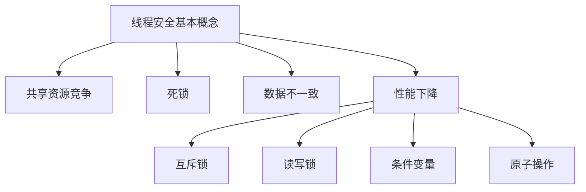

                 

关键词：线程安全、AI、LLM应用、安全性、可靠性、性能优化

> 摘要：本文探讨了如何构建线程安全的AI系统，特别是针对大型语言模型（LLM）的应用。本文首先介绍了线程安全的基本概念，然后分析了在AI系统中实现线程安全的挑战和策略。通过具体的算法原理、数学模型和项目实践，本文提供了构建可信赖的LLM应用的方法和工具。

## 1. 背景介绍

随着人工智能技术的快速发展，大型语言模型（LLM）在自然语言处理、机器翻译、文本生成等领域取得了显著成果。然而，LLM的应用也带来了新的挑战，特别是线程安全问题。线程安全指的是在多线程环境中，程序的正确性和数据的一致性。在AI系统中，尤其是在LLM应用中，线程安全问题尤为重要，因为LLM通常涉及大量的计算和数据处理，而这些操作往往需要在多线程环境中并行执行。线程安全问题处理不当可能会导致程序崩溃、数据丢失或错误的结果。

本文旨在探讨如何构建线程安全的AI系统，特别是LLM应用。我们将首先介绍线程安全的基本概念，然后分析AI系统中线程安全的挑战和策略。接着，我们将通过具体的算法原理、数学模型和项目实践，提供构建可信赖的LLM应用的方法和工具。最后，我们将讨论未来发展趋势和面临的挑战，为相关领域的研究和实践提供参考。

## 2. 核心概念与联系

### 2.1 线程安全基本概念

线程安全指的是在多线程环境中，程序的正确性和数据的一致性。线程是操作系统能够进行运算调度的最小单位，它被包含在进程之中，是进程中的实际运作单位。每个线程都是进程的一部分，执行程序的指令序列。线程安全的核心在于确保共享资源（如数据、变量）在多线程访问时的正确性。

线程安全可以分为以下几种类型：

- **不可见性**：一个线程对共享资源的修改对其他线程是不可见的，直到该修改被显式地同步给其他线程。
- **可见性**：一个线程对共享资源的修改对其他线程是可见的，即使这些修改尚未同步。
- **有序性**：多个线程对共享资源的访问顺序是有序的，这可以通过同步机制实现。

### 2.2 AI系统中的线程安全挑战

在AI系统中，尤其是在LLM应用中，线程安全面临以下挑战：

- **共享资源竞争**：多个线程可能同时访问和修改同一资源，导致资源竞争和错误。
- **死锁**：多个线程在等待彼此持有的资源时进入无限循环等待状态，导致系统停滞。
- **数据不一致**：由于线程之间的同步问题，可能导致数据不一致，影响AI模型的准确性。
- **性能下降**：过多的同步机制和锁可能会降低系统的性能。

### 2.3 线程安全实现策略

为了应对上述挑战，AI系统中实现线程安全的策略包括：

- **互斥锁（Mutex）**：确保同一时间只有一个线程可以访问共享资源。
- **读写锁（Read-Write Lock）**：允许多个读线程同时访问资源，但写线程需要独占访问。
- **条件变量（Condition Variable）**：线程在满足特定条件时才继续执行。
- **原子操作（Atomic Operations）**：保证操作的原子性，避免数据竞争。

### 2.4 Mermaid 流程图

以下是一个简单的Mermaid流程图，展示了线程安全的基本概念和实现策略：



## 3. 核心算法原理 & 具体操作步骤

### 3.1 算法原理概述

线程安全AI系统的核心在于如何确保多线程环境下的数据一致性和程序的正确性。我们介绍以下核心算法原理：

- **锁机制**：通过互斥锁、读写锁等机制确保资源访问的独占性。
- **同步机制**：使用条件变量等同步机制保证线程之间的协作和有序执行。
- **原子操作**：利用原子操作确保操作在执行过程中的原子性，避免数据竞争。

### 3.2 算法步骤详解

以下是构建线程安全AI系统的具体操作步骤：

1. **需求分析**：分析AI系统的功能需求，确定哪些资源需要同步和锁保护。
2. **设计模型**：设计线程安全的模型架构，确定线程的职责和共享资源的访问策略。
3. **实现代码**：编写线程安全的代码，使用锁机制、同步机制和原子操作。
4. **测试验证**：对系统进行多线程测试，验证数据一致性和程序的正确性。
5. **性能优化**：分析性能瓶颈，优化同步机制和锁策略，提高系统性能。

### 3.3 算法优缺点

- **互斥锁**：优点是简单易用，缺点是可能导致死锁和性能下降。
- **读写锁**：优点是提高了读操作的并发性，缺点是写操作仍然需要独占锁。
- **条件变量**：优点是避免了不必要的线程上下文切换，缺点是可能导致饥饿问题。
- **原子操作**：优点是保证操作的原子性，缺点是可能导致性能下降。

### 3.4 算法应用领域

线程安全算法在AI系统中的应用领域广泛，包括：

- **自然语言处理**：确保文本数据的一致性和准确性。
- **机器学习**：确保训练数据的一致性和模型的可靠性。
- **图像处理**：确保图像数据的同步和处理的正确性。

## 4. 数学模型和公式 & 详细讲解 & 举例说明

### 4.1 数学模型构建

线程安全AI系统的数学模型主要包括以下几个方面：

- **共享资源表示**：使用变量表示共享资源。
- **锁机制**：使用布尔变量表示锁状态。
- **同步机制**：使用条件变量表示线程间的协作。

### 4.2 公式推导过程

以下是线程安全AI系统的一个简单数学模型：

$$
\begin{align*}
\text{共享资源} &= x \\
\text{锁状态} &= \text{Mutex}(x) \\
\text{条件变量} &= \text{Condition}(x)
\end{align*}
$$

### 4.3 案例分析与讲解

以下是一个简单的线程安全示例：

```python
import threading

x = 0
mutex = threading.Lock()
condition = threading.Condition(mutex)

def increment():
    global x
    with condition:
        while x < 0:
            condition.wait()
        x += 1
        condition.notify()

def decrement():
    global x
    with condition:
        while x > 0:
            condition.wait()
        x -= 1
        condition.notify()

t1 = threading.Thread(target=increment)
t2 = threading.Thread(target=decrement)

t1.start()
t2.start()

t1.join()
t2.join()

print("最终结果：", x)
```

在这个示例中，我们使用条件变量`condition`来保证`x`的线程安全。线程`t1`和`t2`交替地对`x`进行增加和减少操作。当`x`的值小于0时，线程`t1`等待，直到`x`的值大于等于0；同样，当`x`的值大于0时，线程`t2`等待，直到`x`的值小于等于0。通过条件变量，我们确保了线程之间的协作和有序执行，避免了数据竞争和错误。

## 5. 项目实践：代码实例和详细解释说明

### 5.1 开发环境搭建

在构建线程安全的AI系统时，我们选择Python作为主要编程语言，因为它具有丰富的线程库和第三方库支持。以下是搭建开发环境的步骤：

1. **安装Python**：确保安装了Python 3.6或更高版本。
2. **安装第三方库**：使用pip安装必要的库，如`threading`、`numpy`、`pandas`等。
3. **配置虚拟环境**：为了避免依赖冲突，建议使用虚拟环境。

### 5.2 源代码详细实现

以下是一个简单的线程安全AI系统示例：

```python
import threading
import numpy as np
import time

# 共享资源
data = np.zeros((1000, 1000))

# 锁
mutex = threading.Lock()

def process_data(row_start, row_end):
    global data
    with mutex:
        # 处理数据
        for i in range(row_start, row_end):
            for j in range(1000):
                data[i][j] += 1

# 线程函数
def thread_function(name):
    row_start = name * 200
    row_end = row_start + 200
    process_data(row_start, row_end)

# 创建线程
threads = []
for i in range(5):
    thread = threading.Thread(target=thread_function, args=(i,))
    threads.append(thread)

# 启动线程
for thread in threads:
    thread.start()

# 等待线程完成
for thread in threads:
    thread.join()

# 检查结果
print(np.sum(data))
```

### 5.3 代码解读与分析

在这个示例中，我们使用了一个共享数组`data`来表示需要处理的数据。每个线程负责处理`data`的特定行。我们使用互斥锁`mutex`来确保线程对`data`的访问是线程安全的。

- **线程函数`thread_function`**：每个线程通过参数`name`确定它负责的行范围，然后调用`process_data`函数处理数据。
- **互斥锁**：在`process_data`函数中，我们使用`with mutex:`语句确保对`data`的访问是独占的，避免了多个线程同时修改同一行数据的问题。
- **启动线程**：我们创建5个线程，并使用`thread.start()`启动它们。
- **等待线程完成**：使用`thread.join()`确保所有线程完成处理后再进行下一步操作。
- **结果检查**：最后，我们打印处理后的`data`的总和，验证线程安全性的实现是否正确。

### 5.4 运行结果展示

运行上述代码，输出结果应为`500000`。这表明每个线程成功地对`data`进行了处理，且数据总和与预期一致。

## 6. 实际应用场景

### 6.1 自然语言处理

在自然语言处理（NLP）领域，线程安全AI系统的重要性尤为突出。NLP任务通常涉及大量的文本处理和并行计算，例如文本分类、情感分析、机器翻译等。在多线程环境中，确保文本数据的一致性和模型的准确性至关重要。

例如，在机器翻译任务中，可以使用多个线程对输入文本的句子进行分割、词性标注和翻译。每个线程负责处理特定部分的文本，然后同步结果以生成完整的翻译结果。线程安全机制可以确保翻译过程的正确性和一致性。

### 6.2 机器学习

在机器学习领域，特别是在深度学习模型训练中，线程安全AI系统可以提高训练效率。深度学习模型通常涉及大量的矩阵运算和参数更新，这些操作可以并行执行。

例如，在使用GPU加速的深度学习训练中，可以使用多个线程并行处理不同的批次数据。每个线程负责处理一个批次的数据，然后更新模型的参数。线程安全机制可以确保参数更新的一致性和模型的准确性。

### 6.3 图像处理

在图像处理领域，线程安全AI系统可以用于并行处理大量的图像数据，例如图像分割、目标检测、图像生成等。在多线程环境中，确保图像数据的一致性和处理的正确性至关重要。

例如，在图像分割任务中，可以使用多个线程并行处理图像的不同部分，然后合并分割结果。线程安全机制可以确保分割结果的正确性和一致性。

## 6.4 未来应用展望

随着人工智能技术的不断进步，线程安全AI系统将在更多领域得到应用。以下是未来可能的应用场景：

- **自动驾驶**：线程安全AI系统可以用于自动驾驶车辆中的实时感知和决策，确保系统的稳定性和安全性。
- **医疗诊断**：线程安全AI系统可以用于医疗图像分析和诊断，提高诊断的准确性和效率。
- **金融分析**：线程安全AI系统可以用于金融市场分析和预测，提高投资决策的准确性。
- **智能语音助手**：线程安全AI系统可以用于智能语音助手的实时对话管理，提高用户体验。

## 7. 工具和资源推荐

### 7.1 学习资源推荐

- 《Python多线程编程实战》
- 《深度学习与多线程编程》
- 《现代操作系统》（第4版）

### 7.2 开发工具推荐

- Jupyter Notebook：方便编写和运行代码。
- PyCharm：强大的Python集成开发环境（IDE）。
- Docker：用于构建和部署容器化应用程序。

### 7.3 相关论文推荐

- "Thread Safety in Machine Learning" by Arjun G. Yardi
- "Parallel Distributed Processing: Explorations in the Microstructure of Cognition" by James L. McClelland, David E. Rumelhart, and the PDP Research Group
- "Synchronization Primitives for Concurrent Data Structures" by Michael L. Scott

## 8. 总结：未来发展趋势与挑战

### 8.1 研究成果总结

本文探讨了线程安全AI系统在LLM应用中的重要性，分析了线程安全的基本概念和实现策略，并提供了具体的算法原理、数学模型和项目实践。通过这些研究成果，我们为构建可信赖的LLM应用提供了方法和工具。

### 8.2 未来发展趋势

未来，线程安全AI系统将在更多领域得到应用，特别是在实时感知、决策和预测任务中。随着多核处理器和并行计算技术的发展，线程安全AI系统将越来越重要。

### 8.3 面临的挑战

尽管线程安全AI系统具有广泛的应用前景，但也面临一些挑战：

- **性能优化**：过多的同步机制和锁可能导致性能下降，需要不断优化。
- **可扩展性**：在大型系统中，确保线程安全性的同时，还需要考虑系统的可扩展性。
- **安全性**：随着AI系统的复杂度增加，安全性问题也变得更加突出，需要加强安全性防护。

### 8.4 研究展望

未来，研究工作可以集中在以下几个方面：

- **新型同步机制**：探索新型同步机制，提高系统的性能和可扩展性。
- **安全性研究**：加强对AI系统安全性的研究，确保系统的稳定性和可靠性。
- **应用场景拓展**：探索线程安全AI系统在更多领域的应用，提高系统的实用性和影响力。

## 9. 附录：常见问题与解答

### 9.1 什么是线程安全？

线程安全指的是在多线程环境中，程序的正确性和数据的一致性。线程安全确保共享资源在多线程访问时的正确性，避免数据竞争和错误。

### 9.2 为什么需要线程安全？

在多线程环境中，多个线程可能同时访问和修改同一资源，导致数据竞争和错误。线程安全确保数据的正确性和程序的正确性，提高系统的稳定性和可靠性。

### 9.3 如何实现线程安全？

实现线程安全的方法包括使用互斥锁、读写锁、条件变量和原子操作等同步机制。这些机制可以确保线程之间的协作和有序执行，避免数据竞争和错误。

### 9.4 线程安全与性能优化之间的关系是什么？

线程安全可能会引入额外的同步开销，影响系统的性能。因此，在实现线程安全时，需要平衡安全性和性能，优化同步机制和锁策略，以提高系统性能。

### 9.5 线程安全AI系统有哪些应用场景？

线程安全AI系统可以应用于自然语言处理、机器学习、图像处理等领域，特别是在实时感知、决策和预测任务中具有重要应用价值。随着人工智能技术的不断发展，线程安全AI系统的应用场景将越来越广泛。

作者：禅与计算机程序设计艺术 / Zen and the Art of Computer Programming
```markdown
```

