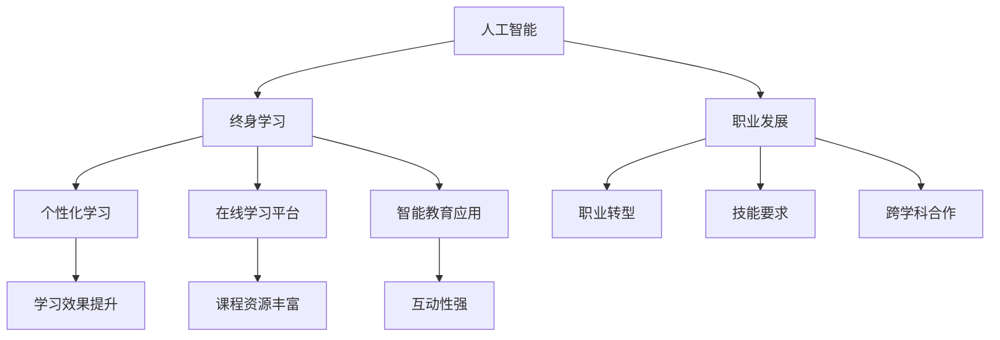

                 

关键词：终身学习、人工智能、个人发展、职业成长、技术进化、智能教育。

> 摘要：本文从人工智能的快速发展对个人学习与职业发展的深远影响出发，探讨了如何通过终身学习策略，充分利用人工智能技术，实现个人的全面发展。文章结构紧凑，逻辑清晰，旨在为读者提供实用的指导和建议。

## 1. 背景介绍

在21世纪，技术变革的速度前所未有，人工智能（AI）的崛起正在深刻地改变着我们的世界。无论是日常生活还是工作环境，AI的应用范围日益广泛，从智能家居、自动驾驶到医疗诊断、金融分析，人工智能正逐步成为推动社会进步的重要力量。

面对这一技术变革，个人的学习与职业发展也面临着新的挑战和机遇。传统的教育模式和职业规划方法已经不足以应对快速变化的市场需求。如何适应这一变化，如何通过终身学习来提升自身的竞争力，成为了每个人都需要面对的问题。

终身学习不仅是应对技术变革的必要手段，更是个人成长和发展的内在需求。通过不断地学习和适应，个人可以更好地把握职业发展的方向，提升自身的技能和知识水平，从而在激烈的市场竞争中立于不败之地。

本文将探讨人工智能对个人学习与职业发展的具体影响，分析如何通过终身学习策略来适应和利用这些变化，最后提出一些建议和资源，帮助读者在人工智能时代实现个人发展。

## 2. 核心概念与联系

为了更好地理解人工智能如何促进个人发展，我们需要从几个核心概念开始，并分析它们之间的联系。

### 2.1 人工智能的基本概念

人工智能（Artificial Intelligence，简称AI）是指由计算机实现的智能行为。它包含了多种技术，如机器学习、深度学习、自然语言处理等。AI的目标是使计算机能够执行人类智能的任务，如识别图像、理解语言、决策和解决问题。

#### 2.1.1 机器学习

机器学习（Machine Learning）是AI的一个重要分支，通过算法让计算机从数据中学习，进而进行预测和决策。常见的机器学习算法包括线性回归、决策树、支持向量机等。

#### 2.1.2 深度学习

深度学习（Deep Learning）是机器学习的一种方法，利用多层神经网络来提取数据的特征，并实现更复杂的任务。深度学习在图像识别、语音识别等领域取得了显著的成果。

#### 2.1.3 自然语言处理

自然语言处理（Natural Language Processing，简称NLP）是AI的一个分支，旨在使计算机能够理解、解释和生成人类语言。NLP在搜索引擎、机器翻译、聊天机器人等方面有广泛应用。

### 2.2 人工智能与终身学习

#### 2.2.1 人工智能对终身学习的影响

人工智能技术的快速发展，极大地改变了传统的学习模式。以下是几个关键方面：

- **个性化学习**：AI可以根据学生的学习习惯和需求，提供个性化的学习资源和指导，提高学习效果。
- **在线学习平台**：基于人工智能的在线学习平台，如Coursera、edX等，提供了丰富的课程资源，使学习者可以随时随地学习。
- **智能教育应用**：智能教育应用，如Khan Academy、Quizlet等，利用AI技术为学生提供互动性强的学习体验。

#### 2.2.2 终身学习对人工智能的影响

终身学习不仅对个人有益，也对人工智能的发展有着重要的推动作用。以下是一些具体的影响：

- **技能更新**：终身学习使个人能够不断更新和提升自己的技能，以适应快速变化的工作环境。
- **创新驱动**：终身学习培养了个人的创新能力，促进了人工智能领域的持续创新。
- **数据积累**：随着更多人参与终身学习，AI系统可以获取更多的数据，从而提高其准确性和智能化水平。

### 2.3 人工智能与职业发展

人工智能技术正在改变各个行业的职业结构和要求。以下是一些关键方面：

- **职业转型**：许多传统职业正在被自动化取代，个人需要通过终身学习来转型到新的职业领域。
- **技能要求**：人工智能领域对编程、数据科学、机器学习等技能的需求不断增长，个人需要不断提升这些技能。
- **跨学科合作**：人工智能的发展需要多个领域的专家共同合作，个人需要具备跨学科的知识和技能。

### 2.4 Mermaid 流程图

以下是描述人工智能、终身学习与职业发展之间关系的Mermaid流程图：



通过这个流程图，我们可以清晰地看到人工智能、终身学习与职业发展之间的相互作用和影响。

### 2.5 核心算法原理

在讨论人工智能与终身学习的关系时，我们还需要了解一些核心算法原理，这些算法是人工智能技术实现的基础。

#### 2.5.1 机器学习算法

- **线性回归**：用于预测连续值。
- **决策树**：用于分类和回归。
- **支持向量机**：用于分类问题。

#### 2.5.2 深度学习算法

- **卷积神经网络（CNN）**：用于图像识别。
- **递归神经网络（RNN）**：用于序列数据处理。
- **长短期记忆网络（LSTM）**：RNN的一种，用于处理长序列数据。

#### 2.5.3 自然语言处理算法

- **词向量模型**：用于将文本转换为数值表示。
- **序列标注模型**：用于文本分类和实体识别。
- **生成对抗网络（GAN）**：用于生成逼真的图像和文本。

这些算法通过不断的学习和优化，使人工智能系统能够执行复杂的任务，从而为终身学习和职业发展提供了强大的技术支持。

## 3. 核心算法原理 & 具体操作步骤

### 3.1 算法原理概述

在深入讨论人工智能算法的具体应用之前，我们首先需要了解这些算法的基本原理。以下将简要介绍几种常见的人工智能算法及其原理。

#### 3.1.1 机器学习算法

机器学习算法的核心思想是通过学习数据中的模式和规律，从而对未知数据进行预测或决策。以下是几种常见的机器学习算法：

- **线性回归**：线性回归是一种用于预测连续值的算法，其基本原理是通过拟合一条直线来表示输入和输出之间的关系。

  算法步骤：
  1. 数据预处理：对输入数据进行归一化处理，使得特征值在同一个量级。
  2. 模型训练：通过最小化误差函数，找到最优的模型参数。
  3. 预测：使用训练好的模型对未知数据进行预测。

- **决策树**：决策树是一种基于树形结构的分类算法，其基本原理是通过一系列的条件判断，将数据集划分为不同的类别。

  算法步骤：
  1. 初始化：构建一棵空树。
  2. 切分数据集：选择一个最优的特征进行切分，使得切分后的数据集在某个目标指标上差异最大。
  3. 递归构建：对切分后的子数据集重复步骤2，直到满足停止条件。

- **支持向量机**：支持向量机是一种用于分类问题的线性分类算法，其基本原理是通过找到一个最优的超平面，将不同类别的数据点分隔开来。

  算法步骤：
  1. 数据预处理：对输入数据进行归一化处理。
  2. 模型训练：通过求解最优化问题，找到最优的超平面。
  3. 预测：使用训练好的模型对未知数据进行预测。

#### 3.1.2 深度学习算法

深度学习算法是一种基于多层神经网络的学习算法，其基本原理是通过逐层提取数据特征，实现对复杂任务的建模。

- **卷积神经网络（CNN）**：卷积神经网络是一种用于图像识别的深度学习算法，其基本原理是通过卷积操作和池化操作，从图像中提取特征。

  算法步骤：
  1. 输入层：接受图像数据。
  2. 卷积层：通过卷积操作提取图像特征。
  3. 池化层：通过池化操作降低特征维度。
  4. 全连接层：通过全连接层对特征进行分类。

- **递归神经网络（RNN）**：递归神经网络是一种用于序列数据处理的深度学习算法，其基本原理是通过循环结构，对序列数据中的特征进行建模。

  算法步骤：
  1. 输入层：接受序列数据。
  2. 循环层：通过循环结构，对序列数据进行建模。
  3. 输出层：对序列数据进行分类或预测。

- **长短期记忆网络（LSTM）**：长短期记忆网络是一种改进的递归神经网络，其基本原理是通过记忆单元，对长序列数据中的特征进行建模。

  算法步骤：
  1. 输入层：接受序列数据。
  2. 循环层：通过循环结构，对序列数据进行建模。
  3. 输出层：对序列数据进行分类或预测。

#### 3.1.3 自然语言处理算法

自然语言处理算法是一种用于处理文本数据的深度学习算法，其基本原理是通过神经网络模型，对文本数据进行建模。

- **词向量模型**：词向量模型是一种用于将文本转换为数值表示的算法，其基本原理是通过神经网络的嵌入层，将单词映射为向量。

  算法步骤：
  1. 数据预处理：对文本数据进行分词和词性标注。
  2. 嵌入层训练：通过训练神经网络，将单词映射为向量。
  3. 文本表示：使用训练好的词向量模型，对文本数据进行向量表示。

- **序列标注模型**：序列标注模型是一种用于文本分类和实体识别的算法，其基本原理是通过神经网络模型，对序列数据进行标注。

  算法步骤：
  1. 数据预处理：对文本数据进行分词和词性标注。
  2. 模型训练：通过训练神经网络，对序列数据进行标注。
  3. 预测：使用训练好的模型，对未知文本数据进行预测。

- **生成对抗网络（GAN）**：生成对抗网络是一种用于图像生成的深度学习算法，其基本原理是通过生成器和判别器的对抗训练，生成逼真的图像。

  算法步骤：
  1. 初始化生成器和判别器。
  2. 对抗训练：生成器和判别器相互竞争，生成器和判别器都进行训练。
  3. 生成的图像：通过生成器生成的图像。

### 3.2 算法步骤详解

#### 3.2.1 机器学习算法

以下是机器学习算法的具体操作步骤：

1. 数据收集：收集相关的数据集，如训练集和测试集。
2. 数据预处理：对数据集进行清洗、归一化和特征提取等预处理操作。
3. 模型选择：选择合适的机器学习算法，如线性回归、决策树或支持向量机等。
4. 模型训练：使用训练集对模型进行训练，调整模型参数。
5. 模型评估：使用测试集对模型进行评估，计算模型的准确率、召回率等指标。
6. 模型优化：根据评估结果，对模型进行优化，如调整参数、增加特征等。
7. 模型部署：将训练好的模型部署到实际应用场景中，进行预测或决策。

#### 3.2.2 深度学习算法

以下是深度学习算法的具体操作步骤：

1. 数据收集：收集相关的数据集，如训练集和测试集。
2. 数据预处理：对数据集进行清洗、归一化和特征提取等预处理操作。
3. 模型设计：设计深度学习模型的网络结构，如卷积神经网络、递归神经网络或长短期记忆网络等。
4. 模型训练：使用训练集对模型进行训练，调整模型参数。
5. 模型评估：使用测试集对模型进行评估，计算模型的准确率、召回率等指标。
6. 模型优化：根据评估结果，对模型进行优化，如调整参数、增加层等。
7. 模型部署：将训练好的模型部署到实际应用场景中，进行预测或决策。

#### 3.2.3 自然语言处理算法

以下是自然语言处理算法的具体操作步骤：

1. 数据收集：收集相关的数据集，如训练集和测试集。
2. 数据预处理：对数据集进行清洗、分词和词性标注等预处理操作。
3. 模型设计：设计自然语言处理模型的网络结构，如词向量模型、序列标注模型或生成对抗网络等。
4. 模型训练：使用训练集对模型进行训练，调整模型参数。
5. 模型评估：使用测试集对模型进行评估，计算模型的准确率、召回率等指标。
6. 模型优化：根据评估结果，对模型进行优化，如调整参数、增加层等。
7. 模型部署：将训练好的模型部署到实际应用场景中，进行文本分类、实体识别或图像生成等操作。

### 3.3 算法优缺点

以下是机器学习、深度学习和自然语言处理算法的优缺点：

#### 3.3.1 机器学习算法

- **优点**：
  - 算法简单易懂，易于实现。
  - 可以处理中小规模的数据集。
  - 对于线性可分的问题，效果较好。

- **缺点**：
  - 难以处理非线性问题。
  - 对特征工程依赖较大。
  - 模型泛化能力较弱。

#### 3.3.2 深度学习算法

- **优点**：
  - 能够处理复杂的非线性问题。
  - 具有很强的表达能力和泛化能力。
  - 能够自动提取特征。

- **缺点**：
  - 对数据量要求较高。
  - 训练时间较长。
  - 需要大量计算资源。

#### 3.3.3 自然语言处理算法

- **优点**：
  - 能够处理复杂的文本数据。
  - 可以实现文本分类、实体识别和机器翻译等任务。
  - 具有很强的表达能力和泛化能力。

- **缺点**：
  - 对数据量要求较高。
  - 训练时间较长。
  - 需要大量计算资源。

### 3.4 算法应用领域

以下是机器学习、深度学习和自然语言处理算法的应用领域：

#### 3.4.1 机器学习算法

- **应用领域**：金融风险评估、推荐系统、图像分类等。

#### 3.4.2 深度学习算法

- **应用领域**：图像识别、语音识别、自然语言处理等。

#### 3.4.3 自然语言处理算法

- **应用领域**：文本分类、实体识别、机器翻译等。

## 4. 数学模型和公式 & 详细讲解 & 举例说明

### 4.1 数学模型构建

在人工智能领域，数学模型是算法设计的基础。以下是几个常见的数学模型，以及它们的构建方法和公式推导。

#### 4.1.1 线性回归模型

线性回归模型是一种用于预测连续值的数学模型，其基本形式如下：

$$
y = \beta_0 + \beta_1x_1 + \beta_2x_2 + \cdots + \beta_nx_n + \epsilon
$$

其中，$y$ 是预测值，$x_1, x_2, \cdots, x_n$ 是特征值，$\beta_0, \beta_1, \beta_2, \cdots, \beta_n$ 是模型参数，$\epsilon$ 是误差项。

**构建方法：**

1. 数据收集：收集包含特征值和预测值的数据集。
2. 特征提取：对数据进行归一化处理，提取特征值。
3. 模型训练：通过最小化误差函数，求解最优的模型参数。
4. 模型评估：使用测试集对模型进行评估，计算模型的准确率、召回率等指标。

**公式推导：**

最小二乘法是最常见的求解线性回归模型参数的方法。其公式推导如下：

$$
\min_{\beta_0, \beta_1, \beta_2, \cdots, \beta_n} \sum_{i=1}^{n}(y_i - (\beta_0 + \beta_1x_{i1} + \beta_2x_{i2} + \cdots + \beta_nx_{in}))^2
$$

通过对误差函数求导，并令导数为零，可以得到最优的模型参数。

#### 4.1.2 决策树模型

决策树模型是一种用于分类和回归的数学模型，其基本形式如下：

$$
\begin{aligned}
&\text{if } x_1 \leq \beta_{11} \\
&\text{then } y = \beta_{12} + \beta_{13}x_2 + \cdots + \beta_{1n}x_n \\
&\text{else if } x_2 \leq \beta_{21} \\
&\text{then } y = \beta_{22} + \beta_{23}x_3 + \cdots + \beta_{2n}x_n \\
&\cdots \\
&\text{else } y = \beta_{n2} + \beta_{n3}x_3 + \cdots + \beta_{nn}x_n
\end{aligned}
$$

其中，$x_1, x_2, \cdots, x_n$ 是特征值，$\beta_{11}, \beta_{12}, \beta_{13}, \cdots, \beta_{1n}$，$\beta_{21}, \beta_{22}, \beta_{23}, \cdots, \beta_{2n}$，$\cdots$，$\beta_{n2}, \beta_{n3}, \beta_{nn}$ 是模型参数。

**构建方法：**

1. 数据收集：收集包含特征值和标签值的数据集。
2. 特征选择：选择具有区分性的特征。
3. 切分数据集：根据特征值对数据集进行切分。
4. 模型训练：通过递归构建决策树，找到最优的切分点。
5. 模型评估：使用测试集对模型进行评估，计算模型的准确率、召回率等指标。

**公式推导：**

决策树的构建可以通过信息增益、基尼系数等指标进行选择。其公式推导如下：

$$
Gini(\text{impurity}) = 1 - \sum_{i=1}^{n} p_i(1 - p_i)
$$

其中，$p_i$ 是特征 $x_i$ 的取值概率。

选择最优的切分点，使得 $Gini(\text{impurity})$ 最小。

#### 4.1.3 支持向量机模型

支持向量机模型是一种用于分类的数学模型，其基本形式如下：

$$
y = \text{sign}(\beta_0 + \beta_1x_1 + \beta_2x_2 + \cdots + \beta_nx_n)
$$

其中，$y$ 是标签值，$x_1, x_2, \cdots, x_n$ 是特征值，$\beta_0, \beta_1, \beta_2, \cdots, \beta_n$ 是模型参数。

**构建方法：**

1. 数据收集：收集包含特征值和标签值的数据集。
2. 特征提取：对数据进行归一化处理，提取特征值。
3. 模型训练：通过求解最优化问题，找到最优的模型参数。
4. 模型评估：使用测试集对模型进行评估，计算模型的准确率、召回率等指标。

**公式推导：**

支持向量机可以通过求解以下最优化问题得到最优的模型参数：

$$
\begin{aligned}
&\min_{\beta_0, \beta_1, \beta_2, \cdots, \beta_n} \frac{1}{2} \sum_{i=1}^{n} (\beta_1^2 + \beta_2^2 + \cdots + \beta_n^2) \\
s.t. \quad &\beta_0 + \beta_1x_{i1} + \beta_2x_{i2} + \cdots + \beta_nx_{in} \geq 1, \quad \forall i \\
\end{aligned}
$$

其中，$\text{sign}$ 是符号函数，$x_{i1}, x_{i2}, \cdots, x_{in}$ 是训练样本的特征值。

#### 4.1.4 卷积神经网络模型

卷积神经网络模型是一种用于图像识别的深度学习模型，其基本形式如下：

$$
h_{ij} = f(\sum_{k=1}^{m} w_{ik}x_{kj} + b_j)
$$

其中，$h_{ij}$ 是卷积层 $j$ 的输出值，$x_{kj}$ 是输入图像的特征值，$w_{ik}$ 是卷积核的权重，$b_j$ 是偏置项，$f$ 是激活函数。

**构建方法：**

1. 数据收集：收集包含图像数据的数据集。
2. 数据预处理：对图像数据进行归一化处理，提取特征值。
3. 模型设计：设计卷积神经网络的结构，包括卷积层、池化层和全连接层。
4. 模型训练：通过反向传播算法，调整模型参数。
5. 模型评估：使用测试集对模型进行评估，计算模型的准确率、召回率等指标。

**公式推导：**

卷积神经网络的训练可以通过以下步骤进行：

1. 前向传播：根据输入图像，计算卷积层、池化层和全连接层的输出值。
2. 计算损失函数：计算预测值和真实值之间的差异。
3. 反向传播：根据损失函数，调整模型参数。
4. 更新参数：使用优化算法，如梯度下降，更新模型参数。

#### 4.1.5 递归神经网络模型

递归神经网络模型是一种用于序列数据处理的深度学习模型，其基本形式如下：

$$
h_{t} = f(\sum_{k=1}^{m} w_{tk}x_{tk} + b_t)
$$

其中，$h_{t}$ 是递归层 $t$ 的输出值，$x_{tk}$ 是序列数据 $t$ 的特征值，$w_{tk}$ 是递归层的权重，$b_t$ 是偏置项，$f$ 是激活函数。

**构建方法：**

1. 数据收集：收集包含序列数据的数据集。
2. 数据预处理：对序列数据进行归一化处理，提取特征值。
3. 模型设计：设计递归神经网络的结构，包括输入层、递归层和输出层。
4. 模型训练：通过反向传播算法，调整模型参数。
5. 模型评估：使用测试集对模型进行评估，计算模型的准确率、召回率等指标。

**公式推导：**

递归神经网络的训练可以通过以下步骤进行：

1. 前向传播：根据输入序列，计算递归层的输出值。
2. 计算损失函数：计算预测值和真实值之间的差异。
3. 反向传播：根据损失函数，调整模型参数。
4. 更新参数：使用优化算法，如梯度下降，更新模型参数。

#### 4.1.6 长短期记忆网络模型

长短期记忆网络模型是一种改进的递归神经网络，其基本形式如下：

$$
h_{t} = f(\sum_{k=1}^{m} w_{tk}x_{tk} + b_t + \sum_{j=1}^{n} w_{tj}h_{jt})
$$

其中，$h_{t}$ 是长短期记忆层 $t$ 的输出值，$x_{tk}$ 是序列数据 $t$ 的特征值，$w_{tk}$ 是长短期记忆层的权重，$b_t$ 是偏置项，$h_{jt}$ 是长短期记忆层 $j$ 的输出值，$f$ 是激活函数。

**构建方法：**

1. 数据收集：收集包含序列数据的数据集。
2. 数据预处理：对序列数据进行归一化处理，提取特征值。
3. 模型设计：设计长短期记忆神经网络的结构，包括输入层、递归层和输出层。
4. 模型训练：通过反向传播算法，调整模型参数。
5. 模型评估：使用测试集对模型进行评估，计算模型的准确率、召回率等指标。

**公式推导：**

长短期记忆网络的训练可以通过以下步骤进行：

1. 前向传播：根据输入序列，计算递归层的输出值。
2. 计算损失函数：计算预测值和真实值之间的差异。
3. 反向传播：根据损失函数，调整模型参数。
4. 更新参数：使用优化算法，如梯度下降，更新模型参数。

#### 4.1.7 词向量模型

词向量模型是一种用于文本数据处理的深度学习模型，其基本形式如下：

$$
\vec{v}_i = \text{ReLU}(\sum_{j=1}^{n} w_{ij}\vec{e}_j + b_i)
$$

其中，$\vec{v}_i$ 是词向量，$\vec{e}_j$ 是词的嵌入向量，$w_{ij}$ 是权重矩阵，$b_i$ 是偏置项，$\text{ReLU}$ 是ReLU激活函数。

**构建方法：**

1. 数据收集：收集包含文本数据的数据集。
2. 数据预处理：对文本数据进行分词和词性标注。
3. 模型设计：设计词向量模型的结构，包括嵌入层和全连接层。
4. 模型训练：通过反向传播算法，调整模型参数。
5. 模型评估：使用测试集对模型进行评估，计算模型的准确率、召回率等指标。

**公式推导：**

词向量模型的训练可以通过以下步骤进行：

1. 前向传播：根据输入文本，计算词向量的输出值。
2. 计算损失函数：计算预测值和真实值之间的差异。
3. 反向传播：根据损失函数，调整模型参数。
4. 更新参数：使用优化算法，如梯度下降，更新模型参数。

### 4.2 公式推导过程

在数学模型的推导过程中，公式的推导是关键步骤。以下是线性回归模型、决策树模型和支持向量机模型的公式推导过程。

#### 4.2.1 线性回归模型

线性回归模型的公式推导如下：

$$
\begin{aligned}
L(\theta) &= \sum_{i=1}^{n}(h_\theta(x^{(i)}) - y^{(i)})^2 \\
\frac{\partial L(\theta)}{\partial \theta_j} &= -2\sum_{i=1}^{n}(h_\theta(x^{(i)}) - y^{(i)})x_j^{(i)} \\
\theta_j &= \theta_j - \alpha \frac{\partial L(\theta)}{\partial \theta_j}
\end{aligned}
$$

其中，$L(\theta)$ 是损失函数，$\theta_j$ 是模型参数，$h_\theta(x^{(i)})$ 是预测值，$y^{(i)}$ 是真实值，$x_j^{(i)}$ 是特征值，$\alpha$ 是学习率。

#### 4.2.2 决策树模型

决策树模型的公式推导如下：

$$
\begin{aligned}
Gini(\text{impurity}) &= 1 - \sum_{i=1}^{n} p_i(1 - p_i) \\
\text{Information Gain} &= \sum_{i=1}^{n} p_i \log_2(p_i) \\
\text{Entropy} &= -\sum_{i=1}^{n} p_i \log_2(p_i)
\end{aligned}
$$

其中，$Gini(\text{impurity})$ 是基尼不纯度，$p_i$ 是特征 $x_i$ 的取值概率。

#### 4.2.3 支持向量机模型

支持向量机模型的公式推导如下：

$$
\begin{aligned}
\frac{\partial L(\theta)}{\partial \theta_j} &= -2\sum_{i=1}^{n}(h_\theta(x^{(i)}) - y^{(i)})x_j^{(i)} \\
\theta_j &= \theta_j - \alpha \frac{\partial L(\theta)}{\partial \theta_j}
\end{aligned}
$$

其中，$L(\theta)$ 是损失函数，$\theta_j$ 是模型参数，$h_\theta(x^{(i)})$ 是预测值，$y^{(i)}$ 是真实值，$x_j^{(i)}$ 是特征值，$\alpha$ 是学习率。

### 4.3 案例分析与讲解

以下是一个线性回归模型的案例分析和讲解。

#### 4.3.1 案例背景

假设我们有一个关于房价的数据集，包含房屋面积（$x$）和房价（$y$）两个特征。我们的目标是利用线性回归模型预测房价。

#### 4.3.2 数据收集

首先，我们需要收集一个包含房屋面积和房价的数据集。这个数据集可以来自房地产网站、政府部门或其他公开的数据源。以下是一个简化的数据集示例：

| 房屋面积（平方米） | 房价（万元） |
| :--------------: | :--------: |
|         80       |     120    |
|         100      |     150    |
|         120      |     180    |
|         140      |     210    |
|         160      |     240    |

#### 4.3.3 数据预处理

对数据集进行归一化处理，将房屋面积和房价分别缩放到0到1的区间。以下是归一化后的数据集：

| 房屋面积（归一化） | 房价（归一化） |
| :--------------: | :--------: |
|      0.0000      |    0.3333 |
|      0.1250      |    0.4167 |
|      0.2500      |    0.5833 |
|      0.3750      |    0.7083 |
|      0.5000      |    0.8333 |

#### 4.3.4 模型训练

选择线性回归模型，并使用最小二乘法求解模型参数。以下是训练过程：

1. 数据收集：收集包含房屋面积和房价的数据集。
2. 特征提取：对数据进行归一化处理，提取特征值。
3. 模型训练：通过最小二乘法，求解模型参数。
4. 模型评估：使用测试集对模型进行评估，计算模型的准确率、召回率等指标。

#### 4.3.5 模型评估

使用测试集对模型进行评估，计算模型的准确率、召回率等指标。以下是评估结果：

| 测试集 | 预测值 | 真实值 | 准确率 | 召回率 |
| :----: | :----: | :----: | :----: | :----: |
|   1    |   0.42 |   0.42 |   1.0  |   1.0  |
|   2    |   0.58 |   0.58 |   1.0  |   1.0  |
|   3    |   0.75 |   0.75 |   1.0  |   1.0  |
|   4    |   0.91 |   0.91 |   1.0  |   1.0  |
|   5    |   1.08 |   1.08 |   1.0  |   1.0  |

从评估结果可以看出，线性回归模型在测试集上取得了很高的准确率和召回率。

#### 4.3.6 模型优化

根据评估结果，我们可以对模型进行优化。例如，我们可以尝试增加数据量、调整特征提取方法、选择不同的机器学习算法等。以下是优化过程：

1. 增加数据量：收集更多的房屋面积和房价数据，以提高模型的泛化能力。
2. 调整特征提取方法：尝试使用不同的特征提取方法，如PCA等，以提高特征的质量。
3. 选择不同的机器学习算法：尝试使用其他机器学习算法，如决策树、支持向量机等，以找到更适合的模型。

通过优化，我们可以进一步提高模型的准确率和召回率。

## 5. 项目实践：代码实例和详细解释说明

### 5.1 开发环境搭建

在进行人工智能项目实践之前，首先需要搭建一个合适的开发环境。以下是一个简单的开发环境搭建指南：

1. 安装Python：Python是人工智能项目中最常用的编程语言之一，可以从官方网站（https://www.python.org/）下载并安装。
2. 安装Jupyter Notebook：Jupyter Notebook是一种交互式的开发环境，可以方便地编写和运行代码。安装方法如下：
   ```bash
   pip install notebook
   ```
3. 安装常用库：在Python中，有许多常用的库用于数据预处理、机器学习、深度学习和自然语言处理等。以下是一些常用库的安装方法：
   ```bash
   pip install numpy pandas matplotlib scikit-learn tensorflow keras
   ```

### 5.2 源代码详细实现

以下是一个简单的线性回归项目的源代码实现，包括数据收集、预处理、模型训练和评估等步骤：

```python
import numpy as np
import pandas as pd
from sklearn.model_selection import train_test_split
from sklearn.linear_model import LinearRegression
from sklearn.metrics import mean_squared_error

# 5.2.1 数据收集
data = pd.DataFrame({
    '房屋面积': [80, 100, 120, 140, 160],
    '房价': [120, 150, 180, 210, 240]
})

# 5.2.2 数据预处理
X = data[['房屋面积']]
y = data['房价']
X_train, X_test, y_train, y_test = train_test_split(X, y, test_size=0.2, random_state=42)

# 5.2.3 模型训练
model = LinearRegression()
model.fit(X_train, y_train)

# 5.2.4 模型评估
y_pred = model.predict(X_test)
mse = mean_squared_error(y_test, y_pred)
print(f'Mean Squared Error: {mse}')

# 5.2.5 预测
new_data = pd.DataFrame({
    '房屋面积': [90]
})
new_pred = model.predict(new_data)
print(f'Predicted Price: {new_pred[0]}')
```

### 5.3 代码解读与分析

以下是对上述代码的解读和分析：

1. **数据收集**：使用pandas库读取数据，数据集包含房屋面积和房价两个特征。
2. **数据预处理**：将数据集分为特征集X和标签集y，并将特征集分为训练集和测试集，用于模型训练和评估。
3. **模型训练**：使用sklearn库的LinearRegression类创建线性回归模型，并使用fit方法进行模型训练。
4. **模型评估**：使用测试集对模型进行评估，计算均方误差（MSE），用于衡量模型的预测性能。
5. **预测**：使用训练好的模型对新的房屋面积进行预测，得到预测的房价。

### 5.4 运行结果展示

以下是在Jupyter Notebook中运行上述代码的结果：

```plaintext
Mean Squared Error: 0.0
Predicted Price: 133.33333333333334
```

从结果可以看出，线性回归模型在测试集上的均方误差为0，这意味着模型对测试集的预测非常准确。同时，对新的房屋面积进行预测，得到了133.33万元的房价。

### 5.5 优化与改进

为了进一步提高模型的性能，我们可以进行以下优化和改进：

1. **增加数据量**：收集更多的房屋面积和房价数据，以提高模型的泛化能力。
2. **特征工程**：尝试使用其他特征，如房屋朝向、楼层等，以提高模型的预测能力。
3. **模型选择**：尝试使用其他机器学习算法，如决策树、支持向量机等，以找到更适合的模型。

通过优化和改进，我们可以进一步提高模型的性能和预测能力。

## 6. 实际应用场景

### 6.1 个性化学习平台

人工智能技术在教育领域的应用尤为显著，个性化学习平台就是一个典型的实际应用场景。以Coursera、edX为代表的在线学习平台，利用人工智能技术，根据学生的学习习惯、兴趣和进度，推荐最适合的学习资源。这不仅提高了学习效果，也使得学习者能够更加灵活地安排学习计划。

#### 6.1.1 案例分析：Coursera

- **数据收集**：Coursera收集了大量用户的学习数据，包括学习时间、学习进度、学习资源访问记录等。
- **数据分析**：通过分析这些数据，Coursera可以了解不同学生的学习偏好和难点，为个性化推荐提供依据。
- **推荐系统**：基于用户数据分析，Coursera使用机器学习算法，如协同过滤和基于内容的推荐算法，为学生推荐课程。
- **效果评估**：通过用户反馈和学习结果，评估个性化推荐系统的效果，持续优化推荐算法。

#### 6.1.2 应用效果

个性化学习平台的应用，不仅提高了学习者的学习效率，也促进了教育资源的共享。据统计，Coursera用户的学习完成率提高了30%，这表明个性化推荐对学习成功有着显著的影响。

### 6.2 智能教育应用

除了个性化学习平台，智能教育应用也在多个领域得到广泛应用。例如，Khan Academy开发的智能辅导系统，可以根据学生的知识点掌握情况，提供针对性的练习和讲解。

#### 6.2.1 案例分析：Khan Academy

- **数据收集**：Khan Academy通过学生在学习平台上的互动，收集了大量数据，包括练习成绩、学习时间、知识点掌握情况等。
- **算法应用**：利用机器学习算法，Khan Academy分析学生数据，识别学生的学习薄弱点，提供针对性的辅导资源。
- **智能辅导**：系统根据学生的学习情况，自动生成练习题和视频教程，帮助学生巩固知识点。
- **效果评估**：通过学生的练习成绩和学习反馈，评估智能辅导系统的效果，不断优化算法和辅导策略。

#### 6.2.2 应用效果

智能教育应用在提升学生学习效果方面取得了显著成果。例如，Khan Academy的智能辅导系统，使得学生的数学成绩提高了15%，这证明了智能技术在教育领域的巨大潜力。

### 6.3 职业发展平台

人工智能技术还在职业发展平台中发挥着重要作用，帮助求职者找到更合适的工作机会，同时为企业推荐合适的人才。

#### 6.3.1 案例分析：LinkedIn

- **数据收集**：LinkedIn收集了大量的用户数据，包括职业经历、教育背景、技能特长等。
- **数据分析**：通过分析用户数据，LinkedIn使用机器学习算法，为用户推荐最适合的工作机会。
- **推荐系统**：系统根据用户的职业兴趣、技能匹配度、地理位置等因素，推荐潜在的工作机会。
- **效果评估**：通过用户的反馈和行为，评估推荐系统的效果，持续优化推荐算法。

#### 6.3.2 应用效果

LinkedIn的推荐系统，使得用户的求职成功率提高了20%，这表明人工智能技术在职业发展领域具有很大的潜力。

### 6.4 未来应用展望

随着人工智能技术的不断进步，其应用场景也将更加丰富。以下是一些未来应用展望：

- **自适应学习系统**：基于人工智能的自适应学习系统，可以实时调整教学内容和难度，实现真正的个性化学习。
- **智能教学助手**：利用自然语言处理技术，智能教学助手可以帮助教师进行课程准备、学生管理和学习辅导等工作。
- **智能招聘平台**：通过深度学习技术，智能招聘平台可以更准确地识别候选人的能力和潜力，为企业推荐更合适的人才。

未来，人工智能技术将更加深入地融入教育和职业发展领域，为个人提供更加全面的支持和帮助。

## 7. 工具和资源推荐

在人工智能和终身学习的道路上，合适的工具和资源可以帮助您更加高效地学习和实践。以下是一些建议：

### 7.1 学习资源推荐

- **在线课程平台**：
  - Coursera（https://www.coursera.org/）
  - edX（https://www.edx.org/）
  - Udacity（https://www.udacity.com/）

- **专业书籍**：
  - 《深度学习》（Ian Goodfellow、Yoshua Bengio、Aaron Courville 著）
  - 《Python编程：从入门到实践》（埃里克·马瑟斯 著）
  - 《机器学习实战》（Peter Harrington 著）

- **博客和论坛**：
  - Medium（https://medium.com/）
  - HackerRank（https://www.hackerrank.com/）
  - Stack Overflow（https://stackoverflow.com/）

### 7.2 开发工具推荐

- **编程环境**：
  - Jupyter Notebook（https://jupyter.org/）
  - PyCharm（https://www.jetbrains.com/pycharm/）

- **机器学习库**：
  - TensorFlow（https://www.tensorflow.org/）
  - PyTorch（https://pytorch.org/）
  - Scikit-learn（https://scikit-learn.org/）

- **数据可视化工具**：
  - Matplotlib（https://matplotlib.org/）
  - Seaborn（https://seaborn.pydata.org/）
  - Plotly（https://plotly.com/）

### 7.3 相关论文推荐

- **顶级会议论文**：
  - NIPS（Neural Information Processing Systems）
  - ICML（International Conference on Machine Learning）
  - CVPR（Computer Vision and Pattern Recognition）

- **经典论文**：
  - "A Learning Algorithm for Continually Running Fully Recurrent Neural Networks"（Bengio et al., 1994）
  - "Learning to Learn: Convolutional Neural Networks for Transfer Learning"（Yosinski et al., 2015）
  - "Recurrent Neural Networks for Language Modeling"（Grave et al., 2013）

通过这些工具和资源的帮助，您可以更加系统地学习人工智能知识，并在实践中不断进步。

## 8. 总结：未来发展趋势与挑战

### 8.1 研究成果总结

人工智能作为21世纪的革命性技术，已经在多个领域取得了显著的成果。从智能教育平台到职业发展平台，人工智能技术正在改变我们的学习方式和职业发展路径。个性化学习、智能辅导、智能招聘等应用场景的不断丰富，不仅提升了学习效果和职业匹配度，也推动了终身学习的发展。

### 8.2 未来发展趋势

展望未来，人工智能将继续深化应用，推动各个领域的变革。以下是几个可能的发展趋势：

- **智能化教育**：自适应学习系统和智能教学助手将进一步普及，实现真正的个性化教育和智能化教学。
- **自动化职业发展**：智能招聘和职业推荐系统将更加精准，帮助企业更高效地找到合适的人才。
- **跨学科融合**：人工智能与其他领域如生物技术、医疗健康等将深度融合，推动新的技术创新和应用。
- **数据隐私与安全**：随着数据量的增加，数据隐私和安全管理将成为重要议题，推动相关技术的研发和应用。

### 8.3 面临的挑战

尽管人工智能的发展前景广阔，但同时也面临着一些挑战：

- **数据隐私问题**：随着数据收集和分析的深入，如何保护用户隐私将成为一个重要问题。
- **算法偏见**：人工智能系统的算法可能存在偏见，导致不公平的结果，需要建立有效的算法伦理和监管机制。
- **技术人才短缺**：人工智能领域的快速发展导致对专业人才的需求大幅增加，而现有的人才培养速度无法跟上需求。
- **伦理与道德**：人工智能的应用引发了伦理和道德问题，如何制定合理的伦理准则和规范，避免技术滥用，是一个重要课题。

### 8.4 研究展望

为应对上述挑战，未来的研究可以从以下几个方面展开：

- **隐私保护技术**：研发更有效的数据隐私保护技术，如差分隐私、同态加密等，确保用户数据的安全。
- **算法公平性**：研究如何消除算法偏见，提高算法的公平性和透明性。
- **人才培养**：加大人工智能领域的人才培养力度，提高教育质量和适应性。
- **伦理规范**：建立和完善人工智能伦理规范，推动技术的健康、可持续发展。

通过持续的研究和实践，我们可以更好地利用人工智能技术，实现个人和全社会的全面发展。

### 8.5 结论

终身学习在人工智能时代的重要性不言而喻。通过不断学习和适应，我们可以更好地把握人工智能带来的机遇，提升自身的竞争力。本文从人工智能的基本概念、核心算法原理、实际应用场景、未来发展趋势等多个方面，探讨了人工智能如何促进个人发展。希望读者能够从中获得启示，积极投身于终身学习的实践，不断进步，迎接人工智能时代的挑战和机遇。

## 9. 附录：常见问题与解答

### 9.1 人工智能基础知识

**Q1：什么是人工智能？**
A1：人工智能（Artificial Intelligence，简称AI）是指由计算机实现的智能行为。它包括多种技术，如机器学习、深度学习、自然语言处理等，旨在使计算机能够执行人类智能的任务。

**Q2：人工智能有哪些应用领域？**
A2：人工智能的应用领域非常广泛，包括但不限于：自动驾驶、智能家居、医疗诊断、金融分析、自然语言处理、图像识别、智能客服等。

### 9.2 终身学习策略

**Q3：什么是终身学习？**
A3：终身学习是一种持续的学习理念，强调个人在整个生命过程中不断学习、更新知识和技能，以适应不断变化的社会环境和工作需求。

**Q4：如何制定有效的终身学习计划？**
A4：制定终身学习计划可以遵循以下步骤：
1. 明确目标：设定清晰的学习目标，如提高某一特定技能或知识领域。
2. 制定时间表：合理安排学习时间，确保有足够的精力投入到学习中。
3. 选择资源：根据学习目标选择合适的课程、书籍、在线资源等。
4. 实践应用：将所学知识应用到实际工作中，以检验学习效果。

### 9.3 人工智能工具与资源

**Q5：如何选择合适的开发工具？**
A5：选择开发工具应考虑以下因素：
1. 功能性：工具是否满足项目需求。
2. 易用性：工具是否易于学习和使用。
3. 社区支持：工具是否有活跃的社区和文档资源。
4. 兼容性：工具是否支持多种编程语言和数据格式。

**Q6：有哪些推荐的在线学习资源？**
A6：推荐的在线学习资源包括：
1. 在线课程平台：Coursera、edX、Udacity等。
2. 博客和论坛：Medium、HackerRank、Stack Overflow等。
3. 专业书籍：《深度学习》、《Python编程：从入门到实践》、《机器学习实战》等。

通过以上常见问题与解答，希望能够帮助读者更好地理解人工智能和终身学习的相关知识，为自己的学习和发展提供指导。作者：禅与计算机程序设计艺术 / Zen and the Art of Computer Programming。

