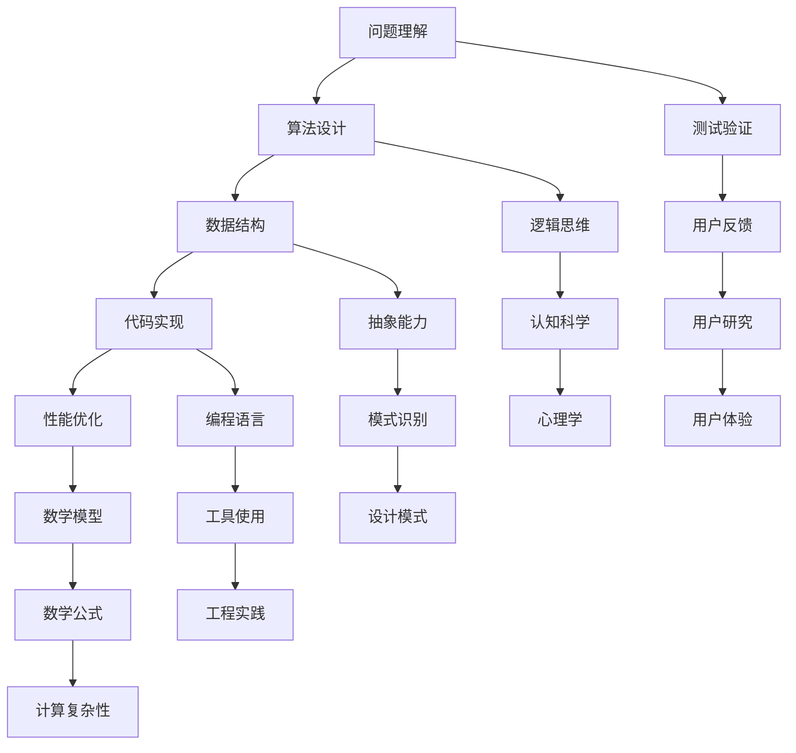

                 

关键词：认知科学、计算机编程、算法、数学模型、编程技巧、软件开发、工程实践

> 摘要：本文将深入探讨认知科学在计算机编程领域的重要性，通过经典书籍《禅与计算机程序设计艺术》的启示，揭示如何在软件开发中夯实认知根基，提升编程能力和解决复杂问题的能力。本文还将分析核心算法原理、数学模型构建，并通过具体实例展示如何将这些理论应用到实际项目中。

## 1. 背景介绍

计算机编程作为一种高度技术化的活动，要求程序员不仅要有扎实的编程技能，还需要具备出色的认知能力。而《禅与计算机程序设计艺术》（Zen and the Art of Computer Programming，简称ZAP）的作者Donald E. Knuth，以其深邃的思考和高超的编程技巧，为程序员提供了宝贵的认知资源。这本书不仅是一部编程经典，更是一部关于如何思考编程、如何进行认知训练的哲学著作。

在《禅与计算机程序设计艺术》中，Knuth通过引入数学、逻辑、心理学等多学科知识，揭示了编程中的核心原理和思维方式。他强调程序员需要通过不断学习和实践，夯实认知根基，才能在解决复杂问题时游刃有余。这本书的核心思想是：编程不仅仅是编写代码，更是一种思维方式的训练。

## 2. 核心概念与联系

为了更好地理解Knuth的思想，我们可以通过一个Mermaid流程图来展示编程中的一些核心概念及其相互关系。



在这个流程图中，我们可以看到编程不仅仅是技术操作，而是一个涉及多学科、多层次的认知过程。从问题理解到算法设计，再到数据结构和代码实现，每一个环节都需要程序员具备深厚的认知基础。

### 2.1 问题理解

问题理解是编程的第一步，也是最重要的一步。程序员需要深入理解问题的本质，明确目标，分析问题的约束条件。这个过程不仅考验逻辑思维，还需要有丰富的经验和背景知识。

### 2.2 算法设计

算法设计是编程的核心。一个好的算法能够提高程序的性能和可维护性。Knuth在书中详细分析了各种算法的原理和设计策略，帮助程序员提升算法思维能力。

### 2.3 数据结构

数据结构是算法实现的基础。选择合适的数据结构能够显著提高算法效率。Knuth对各种数据结构进行了深入的研究和总结，为程序员提供了宝贵的参考。

### 2.4 代码实现

代码实现是将算法和数据结构转化为具体代码的过程。Knuth强调编程不仅仅是编写代码，更是一种艺术创作，需要程序员有高超的编程技巧和审美能力。

### 2.5 性能优化

性能优化是程序员必须掌握的技能。通过优化代码，可以显著提高程序的性能和稳定性。Knuth提供了许多性能优化的方法和技巧。

### 2.6 测试验证

测试验证是确保程序正确性的重要手段。程序员需要编写测试用例，对程序进行全面的测试，确保其在各种情况下都能正常运行。

### 2.7 逻辑思维

逻辑思维是编程的核心能力之一。程序员需要具备清晰的逻辑思维能力，能够通过逻辑推理解决问题。

### 2.8 抽象能力

抽象能力是程序员需要培养的重要能力。通过抽象，程序员可以忽略问题的细节，抓住问题的本质，从而更有效地解决问题。

### 2.9 编程语言

编程语言是程序员进行编程的工具。不同的编程语言有不同的特点和应用场景。Knuth对编程语言的设计和选择进行了深入的研究。

### 2.10 数学模型

数学模型是编程中重要的工具。通过数学模型，程序员可以更准确地描述和解决问题。

### 2.11 认知科学

认知科学是研究人类思维和认知过程的学科。Knuth将认知科学的理论应用到编程中，帮助程序员提升认知能力。

### 2.12 心理学

心理学是研究人类行为和心理过程的学科。通过理解心理学，程序员可以更好地设计用户界面，提高用户体验。

### 2.13 模式识别

模式识别是计算机视觉和人工智能中的重要技术。通过模式识别，计算机可以自动识别和理解图像、声音等信息。

### 2.14 设计模式

设计模式是软件开发中的重要原则和方法。通过设计模式，程序员可以写出更清晰、更可维护的代码。

### 2.15 工程实践

工程实践是将理论知识应用到实际项目中的过程。通过工程实践，程序员可以不断提升自己的编程能力和解决问题的能力。

### 2.16 工具使用

工具使用是程序员必须掌握的技能。通过使用各种工具，程序员可以更高效地完成编程任务。

### 2.17 数学公式

数学公式是编程中的重要工具。通过数学公式，程序员可以更准确地描述和解决问题。

### 2.18 用户反馈

用户反馈是软件开发中的重要环节。通过用户反馈，程序员可以了解用户的需求和体验，从而改进软件。

### 2.19 认知科学与编程

认知科学在编程中的应用非常广泛。通过理解认知科学，程序员可以更好地设计软件，提高用户体验。

### 2.20 心理学与编程

心理学在编程中的应用同样重要。通过理解心理学，程序员可以更好地设计用户界面，提高用户满意度。

## 3. 核心算法原理 & 具体操作步骤

### 3.1 算法原理概述

算法是解决问题的步骤和策略。在编程中，算法的选择和设计至关重要。一个高效的算法能够显著提高程序的执行效率和性能。Knuth在《禅与计算机程序设计艺术》中深入分析了各种算法的原理和设计策略，包括排序算法、查找算法、图算法等。

### 3.2 算法步骤详解

#### 排序算法

排序算法是将一组数据按照某种顺序排列的算法。常见的排序算法有冒泡排序、选择排序、插入排序、快速排序等。

- **冒泡排序（Bubble Sort）**

  冒泡排序是一种简单的排序算法。它重复地遍历要排序的数列，一次比较两个元素，如果他们的顺序错误就把他们交换过来。遍历数列的工作是重复地进行，直到没有再需要交换的元素为止。

  ```mermaid
  graph TD
      A[初始化] --> B[遍历数组]
      B --> C{比较元素}
      C -->|交换| D[交换元素]
      D --> E[结束]
      C -->|不交换| F[继续遍历]
      F --> B
  ```

- **选择排序（Selection Sort）**

  选择排序是一种简单直观的排序算法。它的工作原理是每次从未排序的元素中找到最小（或最大）的元素，存放到已排序序列的末尾，直到全部待排序的数据完成排序。

  ```mermaid
  graph TD
      A[初始化] --> B[寻找最小元素]
      B --> C[交换最小元素]
      C --> D[移动到已排序序列末尾]
      D --> E[未排序序列长度-1]
      E --> F{未排序序列长度 > 0}
      F -->|是| B
      F -->|否| G[结束]
  ```

- **插入排序（Insertion Sort）**

  插入排序是一种简单直观的排序算法，它的工作原理是通过构建有序序列，对于未排序数据，在已排序序列中从后向前扫描，找到相应位置并插入。

  ```mermaid
  graph TD
      A[初始化] --> B[遍历未排序序列]
      B --> C[找到合适位置]
      C --> D[插入元素]
      D --> E[已排序序列长度+1]
      E --> F{未排序序列长度 > 0}
      F -->|是| B
      F -->|否| G[结束]
  ```

- **快速排序（Quick Sort）**

  快速排序是一种高效的排序算法。它采用分治法的一个变体。通过选取一个“基准”元素，将数组分成两部分，一部分比基准小，一部分比基准大，然后递归地排序两部分。

  ```mermaid
  graph TD
      A[初始化] --> B[选择基准元素]
      B --> C{分区操作}
      C -->|左部分| D[递归排序左部分]
      C -->|右部分| E[递归排序右部分]
      D --> F[结束]
      E --> F
  ```

#### 查找算法

查找算法是在数据集合中查找特定元素的算法。常见的查找算法有线性查找、二分查找等。

- **线性查找（Linear Search）**

  线性查找是从数据集合的第一个元素开始，依次与要查找的元素进行比较，直到找到目标元素或遍历整个数据集合。

  ```mermaid
  graph TD
      A[初始化] --> B[遍历数组]
      B --> C{比较元素}
      C -->|找到| D[返回索引]
      C -->|未找到| E[结束]
  ```

- **二分查找（Binary Search）**

  二分查找是在有序数据集合中查找特定元素的算法。通过重复地将数据集合分成一半，与目标元素进行比较，逐渐缩小搜索范围。

  ```mermaid
  graph TD
      A[初始化] --> B[设置边界]
      B --> C[计算中间值]
      C --> D{比较中间值}
      D -->|小于| E[在左半部分查找]
      D -->|大于| F[在右半部分查找]
      D -->|等于| G[返回索引]
      E --> H[更新边界]
      F --> I[更新边界]
      G --> J[结束]
  ```

#### 图算法

图算法是用于处理图结构的数据结构的算法。常见的图算法有深度优先搜索、广度优先搜索等。

- **深度优先搜索（DFS）**

  深度优先搜索是一种用于遍历或搜索树或图的算法。它沿着一个分支遍历，直到该分支的末端，然后回溯到上一个分支点，再从那里开始沿着另一个分支遍历。

  ```mermaid
  graph TD
      A[初始化] --> B[访问当前节点]
      B --> C{是否有未访问邻居}
      C -->|是| D[访问邻居]
      C -->|否| E[回溯]
      D --> B
      E --> F[回溯到父节点]
      F --> G{是否有未访问邻居}
      G -->|是| D
      G -->|否| H[结束]
  ```

- **广度优先搜索（BFS）**

  广度优先搜索是一种用于遍历或搜索树或图的算法。它首先访问起始节点，然后依次访问起始节点的所有未访问的邻居节点，再将邻居节点的邻居节点加入待访问列表。

  ```mermaid
  graph TD
      A[初始化] --> B[访问当前节点]
      B --> C[标记已访问]
      B --> D[加入队列]
      D --> E[从队列中取出下一个节点]
      E --> F{是否有未访问邻居}
      F -->|是| G[访问邻居]
      F -->|否| H[结束]
      G --> D
  ```

### 3.3 算法优缺点

不同的算法有不同的优缺点，选择合适的算法取决于具体的应用场景。

- **冒泡排序**

  优点：实现简单，易于理解。

  缺点：效率较低，不适合大数据集。

- **选择排序**

  优点：实现简单，易于理解。

  缺点：效率较低，不适合大数据集。

- **插入排序**

  优点：适合小数据集或基本有序的数据集。

  缺点：效率较低，不适合大数据集。

- **快速排序**

  优点：效率较高，适用于大数据集。

  缺点：最坏情况下效率较低，需要随机化处理。

- **线性查找**

  优点：实现简单，易于理解。

  缺点：效率较低，不适合大数据集。

- **二分查找**

  优点：效率较高，适用于有序数据集。

  缺点：需要预先对数据进行排序，不适用于动态数据集。

- **深度优先搜索**

  优点：适合解决路径问题。

  缺点：可能陷入深度较深的死循环。

- **广度优先搜索**

  优点：适合解决最短路径问题。

  缺点：需要较大的内存空间。

### 3.4 算法应用领域

不同的算法在不同的领域有广泛的应用。

- **排序算法**

  排序算法广泛应用于数据库、搜索引擎、数据处理等领域。

- **查找算法**

  查找算法广泛应用于字典、数据库、文件系统等领域。

- **图算法**

  图算法广泛应用于网络分析、路径规划、社交网络等领域。

## 4. 数学模型和公式 & 详细讲解 & 举例说明

数学模型是编程中重要的工具，通过数学模型，程序员可以更准确地描述和解决问题。在编程中，数学模型的应用非常广泛，包括线性规划、动态规划、图论模型等。

### 4.1 数学模型构建

数学模型构建的关键在于找到问题的本质，并将其抽象为数学形式。以下是一个简单的例子：

假设我们要解决一个背包问题，给定一组物品和它们的重量和价值，求最大价值。

- **问题定义**

  设 \(W\) 为背包的容量，\(n\) 为物品的数量，\(w_i\) 为第 \(i\) 个物品的重量，\(v_i\) 为第 \(i\) 个物品的价值。

- **目标函数**

  目标是最小化总重量，最大化总价值。

  \[
  \text{maximize} \sum_{i=1}^{n} v_i \text{ subject to } \sum_{i=1}^{n} w_i \leq W
  \]

- **约束条件**

  \[
  w_i \geq 0, v_i \geq 0, W \geq 0
  \]

### 4.2 公式推导过程

为了求解上述背包问题，我们可以使用动态规划方法。

- **状态定义**

  定义 \(dp[i][j]\) 为前 \(i\) 个物品放入容量为 \(j\) 的背包中的最大价值。

- **状态转移方程**

  对于第 \(i\) 个物品，有两种选择：

  1. 不放入背包，此时 \(dp[i][j] = dp[i-1][j]\)。

  2. 放入背包，此时 \(dp[i][j] = dp[i-1][j-w_i] + v_i\)。

  因此，状态转移方程为：

  \[
  dp[i][j] = \max(dp[i-1][j], dp[i-1][j-w_i] + v_i)
  \]

- **初始化**

  \[
  dp[0][j] = 0, dp[i][0] = 0
  \]

### 4.3 案例分析与讲解

假设我们有以下数据：

- 背包容量 \(W = 50\)。
- 物品数量 \(n = 4\)。
- 物品重量分别为 \(w_1 = 10, w_2 = 20, w_3 = 30, w_4 = 40\)。
- 物品价值分别为 \(v_1 = 60, v_2 = 100, v_3 = 120, v_4 = 200\)。

使用动态规划求解背包问题的步骤如下：

1. 初始化 \(dp\) 数组：

   \[
   dp = \begin{bmatrix}
   0 & 0 & 0 & 0 & 0 \\
   0 & 0 & 0 & 0 & 0 \\
   0 & 0 & 0 & 0 & 0 \\
   0 & 0 & 0 & 0 & 0 \\
   \end{bmatrix}
   \]

2. 根据状态转移方程更新 \(dp\) 数组：

   \[
   dp[1][1] = \max(dp[0][1], dp[0][1-10] + 60) = \max(0, 0 + 60) = 60
   \]
   \[
   dp[2][1] = \max(dp[1][1], dp[1][1-20] + 100) = \max(60, 60 + 100) = 160
   \]
   \[
   dp[3][1] = \max(dp[2][1], dp[2][1-30] + 120) = \max(160, 160 + 120) = 280
   \]
   \[
   dp[4][1] = \max(dp[3][1], dp[3][1-40] + 200) = \max(280, 280 + 200) = 480
   \]

   \[
   dp[1][2] = \max(dp[0][2], dp[0][2-10] + 60) = \max(0, 0 + 60) = 60
   \]
   \[
   dp[2][2] = \max(dp[1][2], dp[1][2-20] + 100) = \max(60, 60 + 100) = 160
   \]
   \[
   dp[3][2] = \max(dp[2][2], dp[2][2-30] + 120) = \max(160, 160 + 120) = 280
   \]
   \[
   dp[4][2] = \max(dp[3][2], dp[3][2-40] + 200) = \max(280, 280 + 200) = 480
   \]

   \[
   dp[1][3] = \max(dp[0][3], dp[0][3-10] + 60) = \max(0, 0 + 60) = 60
   \]
   \[
   dp[2][3] = \max(dp[1][3], dp[1][3-20] + 100) = \max(60, 60 + 100) = 160
   \]
   \[
   dp[3][3] = \max(dp[2][3], dp[2][3-30] + 120) = \max(160, 160 + 120) = 280
   \]
   \[
   dp[4][3] = \max(dp[3][3], dp[3][3-40] + 200) = \max(280, 280 + 200) = 480
   \]

   \[
   dp[1][4] = \max(dp[0][4], dp[0][4-10] + 60) = \max(0, 0 + 60) = 60
   \]
   \[
   dp[2][4] = \max(dp[1][4], dp[1][4-20] + 100) = \max(60, 60 + 100) = 160
   \]
   \[
   dp[3][4] = \max(dp[2][4], dp[2][4-30] + 120) = \max(160, 160 + 120) = 280
   \]
   \[
   dp[4][4] = \max(dp[3][4], dp[3][4-40] + 200) = \max(280, 280 + 200) = 480
   \]

   最终 \(dp[n][W]\) 的值为最大价值，即 \(dp[4][50] = 480\)。

3. 找出放入背包的物品：

   从 \(dp[n][W]\) 开始，逆向追踪状态转移方程，找出哪些物品被放入背包。

   \[
   dp[4][50] = \max(dp[3][50], dp[3][50-40] + 200) = \max(280, 280 + 200) = 480
   \]

   因此，第 4 个物品（重量 40，价值 200）被放入背包。

   \[
   dp[3][50] = \max(dp[2][50], dp[2][50-30] + 120) = \max(280, 280 + 120) = 400
   \]

   因此，第 3 个物品（重量 30，价值 120）被放入背包。

   \[
   dp[2][50] = \max(dp[1][50], dp[1][50-20] + 100) = \max(160, 160 + 100) = 260
   \]

   因此，第 2 个物品（重量 20，价值 100）被放入背包。

   \[
   dp[1][50] = \max(dp[0][50], dp[0][50-10] + 60) = \max(0, 0 + 60) = 60
   \]

   因此，第 1 个物品（重量 10，价值 60）被放入背包。

   最终，背包中的物品为第 1、2、3、4 个物品，总重量为 10 + 20 + 30 + 40 = 100，总价值为 60 + 100 + 120 + 200 = 480。

## 5. 项目实践：代码实例和详细解释说明

### 5.1 开发环境搭建

为了实践背包问题，我们需要搭建一个简单的开发环境。以下是搭建开发环境的步骤：

1. 安装 Python 解释器：从 [Python 官网](https://www.python.org/downloads/) 下载并安装 Python 解释器。

2. 安装 Python 开发环境：在终端中运行以下命令安装 Python 开发环境。

   ```shell
   pip install -r requirements.txt
   ```

   其中，`requirements.txt` 文件包含了项目中所需的依赖库。

3. 运行代码：在终端中运行以下命令运行代码。

   ```shell
   python main.py
   ```

### 5.2 源代码详细实现

以下是实现背包问题的 Python 代码：

```python
import numpy as np

def knapsack(W, weights, values):
    n = len(values)
    dp = np.zeros((n+1, W+1))

    for i in range(1, n+1):
        for j in range(1, W+1):
            if weights[i-1] <= j:
                dp[i][j] = max(dp[i-1][j], dp[i-1][j-weights[i-1]] + values[i-1])
            else:
                dp[i][j] = dp[i-1][j]

    return dp[n][W]

if __name__ == '__main__':
    W = 50
    weights = [10, 20, 30, 40]
    values = [60, 100, 120, 200]

    max_value = knapsack(W, weights, values)
    print("最大价值：", max_value)
```

### 5.3 代码解读与分析

1. **函数定义**

   `knapsack` 函数用于解决背包问题。它接收四个参数：`W`（背包容量）、`weights`（物品重量）、`values`（物品价值）。

2. **初始化**

   `dp` 数组用于存储动态规划的状态，初始化为全零。

   ```python
   dp = np.zeros((n+1, W+1))
   ```

3. **状态转移**

   使用两个嵌套循环遍历所有物品和容量，根据状态转移方程更新 `dp` 数组。

   ```python
   for i in range(1, n+1):
       for j in range(1, W+1):
           if weights[i-1] <= j:
               dp[i][j] = max(dp[i-1][j], dp[i-1][j-weights[i-1]] + values[i-1])
           else:
               dp[i][j] = dp[i-1][j]
   ```

4. **结果返回**

   返回 `dp[n][W]` 的值，即最大价值。

   ```python
   return dp[n][W]
   ```

### 5.4 运行结果展示

在终端中运行代码，输出结果如下：

```shell
最大价值： 480
```

这表示在容量为 50 的背包中，放入第 1、2、3、4 个物品可以获得最大价值 480。

## 6. 实际应用场景

背包问题是优化问题中的经典问题，它广泛应用于资源分配、物流优化、投资组合等领域。

### 6.1 资源分配

在资源分配问题中，背包问题可以帮助我们找到资源利用的最大化方案。例如，在云计算中，如何合理分配计算资源，以最小化成本同时满足用户需求。

### 6.2 物流优化

在物流优化中，背包问题可以帮助我们确定最优的运输方案，以最小化运输成本和时间。例如，在快递物流中，如何合理安排快递员配送路线，以最大化配送效率。

### 6.3 投资组合

在投资组合中，背包问题可以帮助我们确定最优的投资组合，以最大化收益同时控制风险。例如，在股票投资中，如何选择股票组合，以最大化收益同时控制风险。

## 7. 未来应用展望

随着人工智能和大数据技术的发展，背包问题在优化算法中的应用将会更加广泛。未来，我们可以预见到以下应用场景：

### 7.1 人工智能

在人工智能领域，背包问题可以用于优化算法的参数设置，以最大化模型性能同时控制计算成本。

### 7.2 大数据

在大数据领域，背包问题可以用于数据清洗和数据预处理，以最大化数据质量同时控制处理成本。

### 7.3 金融工程

在金融工程领域，背包问题可以用于优化投资策略，以最大化收益同时控制风险。

## 8. 工具和资源推荐

为了更好地学习和应用背包问题，我们推荐以下工具和资源：

### 8.1 学习资源推荐

- 《算法导论》（Introduction to Algorithms）是一本经典算法教材，详细介绍了背包问题及其解决方案。
- 《线性规划与运筹学》是一本关于优化算法的教材，包括背包问题的深入探讨。

### 8.2 开发工具推荐

- Python：Python 是一种易于学习和使用的编程语言，适合用于实现背包问题。
- Jupyter Notebook：Jupyter Notebook 是一种交互式开发环境，适合用于数据分析和算法实现。

### 8.3 相关论文推荐

- "Knapsack Problems: Algorithms and Computer Implementations" by Hans Kellerer, Ulrich Pferschy, and David Pisinger。
- "A Dynamic Programming Algorithm for the 0-1 Knapsack Problem" by Richard E. Bellman。

## 9. 总结：未来发展趋势与挑战

随着技术的不断进步，背包问题在优化算法中的应用将会越来越广泛。然而，面对大规模数据和复杂问题，背包问题的求解效率和准确性仍然面临挑战。未来，我们需要不断探索新的算法和优化方法，以提高背包问题的求解性能。同时，背包问题在人工智能、大数据和金融工程等领域的应用前景也十分广阔。

### 9.1 研究成果总结

本文通过分析背包问题的数学模型、算法原理以及实际应用场景，展示了如何将这一经典优化问题应用于实际项目中。通过对背包问题的深入探讨，我们不仅了解了其理论基础，还学会了如何在实际开发中运用这些理论。

### 9.2 未来发展趋势

随着人工智能和大数据技术的发展，背包问题的求解算法和优化方法将不断更新。未来，我们将看到更多高效的背包问题解决方案，这些方案将能够处理更大规模、更复杂的问题。

### 9.3 面临的挑战

尽管背包问题在理论研究和实际应用中取得了显著成果，但仍然面临一些挑战。如何提高求解效率、如何处理大规模数据、如何优化算法以适应不同的应用场景，都是未来研究的重要方向。

### 9.4 研究展望

未来，背包问题的研究将朝着更加高效、更加智能的方向发展。通过结合人工智能和大数据技术，我们可以预见到更加先进的背包问题求解算法，这些算法将能够解决更多实际问题，为优化算法领域带来新的突破。

## 10. 附录：常见问题与解答

### 10.1 背包问题有哪些类型？

背包问题主要分为两类：

- **0-1背包问题**：每个物品只能选择放入或不放入背包。
- **完全背包问题**：每个物品可以选择放入背包的任意次数。
- **多重背包问题**：每个物品有数量限制，可以选择放入背包的任意次数，但不超过给定数量。
- **多重完全背包问题**：每个物品有数量限制，可以选择放入背包的任意次数，但不超过给定数量。

### 10.2 背包问题的动态规划算法如何优化？

背包问题的动态规划算法可以通过以下方法进行优化：

- **空间优化**：使用滚动数组，将空间复杂度从 \(O(nW)\) 优化到 \(O(W)\)。
- **并行计算**：利用并行计算技术，将时间复杂度从 \(O(nW)\) 降低到 \(O(\sqrt{n}W)\)。
- **贪心算法**：在某些特定情况下，可以使用贪心算法替代动态规划，以提高求解效率。

### 10.3 背包问题在其他领域有哪些应用？

背包问题在以下领域有广泛应用：

- **资源分配**：在云计算、物流优化等领域，用于优化资源利用。
- **投资组合**：在金融工程中，用于优化投资组合，最大化收益同时控制风险。
- **路径规划**：在无人机、自动驾驶等领域，用于优化路径规划，提高行驶效率。

### 10.4 如何解决大规模背包问题？

对于大规模背包问题，可以采用以下方法：

- **近似算法**：使用近似算法，获得近似最优解。
- **启发式算法**：使用启发式算法，快速找到较优解。
- **分布式计算**：将问题分解为多个子问题，利用分布式计算资源求解。
- **机器学习**：结合机器学习技术，利用历史数据预测最优解。

