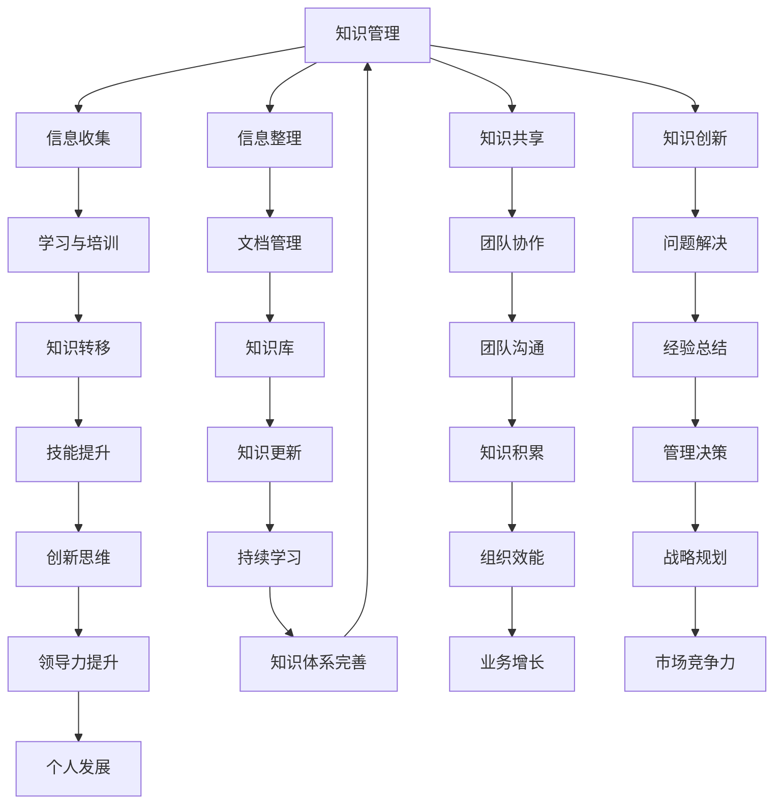

                 

关键词：知识体系、管理者、管理理论、领导力、组织架构

> 摘要：本文深入探讨了管理者如何构建知识体系，以提高个人和管理效能。通过分析经典书籍，本文总结了构建知识体系的重要性、核心概念、构建方法和实际应用，为管理者提供了有价值的参考。

## 1. 背景介绍

在当今快速变化的世界中，知识已成为最宝贵的资源之一。管理者作为组织的核心，其知识体系的构建对于组织的成功至关重要。一个良好的知识体系不仅能够帮助管理者更好地理解和应对复杂的环境，还能够提高团队的整体效能。本文将探讨管理者如何构建知识体系，以及如何通过经典书籍来丰富和完善这一体系。

### 1.1 管理者的角色和责任

管理者不仅需要具备业务和技术方面的知识，还需要具备领导力和决策能力。他们需要理解组织的战略方向，协调团队工作，解决复杂问题，并激励员工实现目标。因此，构建一个全面的知识体系对于管理者来说至关重要。

### 1.2 经典书籍的价值

经典书籍是知识传承的重要载体。它们凝聚了作者多年的经验和智慧，提供了深入的洞见和思考。通过阅读经典书籍，管理者可以获取宝贵的知识资源，从而提升自身的管理能力和领导力。

## 2. 核心概念与联系

构建知识体系需要明确核心概念和它们之间的联系。以下是一个Mermaid流程图，展示了核心概念和它们之间的联系：



### 2.1 核心概念解析

- **知识管理**：知识管理是一种系统地识别、获取、整理、存储、共享和利用知识的方法，旨在提高组织的知识效能和创新能力。
- **信息收集**：信息收集是指通过各种渠道获取有用信息的过程，是知识管理的基础。
- **信息整理**：信息整理是指将收集到的信息进行分类、归纳和整理，使其更加有序和易于使用。
- **知识共享**：知识共享是指通过团队协作和沟通，将个人和团队的知识进行共享和传递。
- **知识创新**：知识创新是指通过整合和分析现有的知识，产生新的想法和解决方案。
- **学习与培训**：学习与培训是指通过培训和不断学习来提升个人的知识和技能。
- **文档管理**：文档管理是指对组织内部文档的收集、整理、存储和共享。
- **团队协作**：团队协作是指团队成员之间通过沟通和合作来完成共同的目标。
- **问题解决**：问题解决是指在面对问题时，通过知识和经验来找到解决方案。
- **经验总结**：经验总结是指通过对以往工作和项目的总结，提炼出经验和教训。
- **技能提升**：技能提升是指通过学习和实践来提升个人的技能和能力。
- **知识转移**：知识转移是指将个人或团队的知识传递给其他成员或组织。
- **知识库**：知识库是指存储和组织知识的系统，方便团队成员查找和使用。
- **团队沟通**：团队沟通是指团队成员之间通过有效沟通来协调工作和解决问题。
- **管理决策**：管理决策是指管理者在面临问题时做出的决策和选择。
- **创新思维**：创新思维是指通过开放和创造性思维来寻找新的解决方案。
- **领导力提升**：领导力提升是指通过学习和实践来提升个人的领导能力。
- **知识体系完善**：知识体系完善是指通过不断的学习和实践，完善个人的知识体系。
- **组织效能**：组织效能是指组织在实现其目标过程中所表现出的效率和效果。
- **战略规划**：战略规划是指组织在长期发展过程中制定的规划。
- **业务增长**：业务增长是指组织在业务规模和收益方面的增长。
- **市场竞争力**：市场竞争力是指组织在市场上的竞争能力和地位。
- **个人发展**：个人发展是指个人在职业和个人生活中的成长和发展。

## 3. 核心算法原理 & 具体操作步骤

### 3.1 算法原理概述

知识体系的构建本质上是一个复杂的认知过程，涉及信息收集、知识整理、知识共享等多个步骤。以下是一个简化的知识体系构建算法原理：

1. **信息收集**：通过阅读书籍、论文、观察实践、交流互动等方式，收集各种形式的信息。
2. **信息整理**：对收集到的信息进行筛选、分类、标注，形成结构化的知识。
3. **知识共享**：通过内部培训、团队讨论、知识库建设等方式，实现知识的传递和共享。
4. **知识创新**：在整理和共享的基础上，通过思考、讨论、实验等方式，进行知识创新。

### 3.2 算法步骤详解

1. **明确知识体系的目标**：确定构建知识体系的总体目标和具体需求，为后续工作提供方向。
2. **收集信息**：通过多种渠道收集信息，包括阅读经典书籍、参加研讨会、观察行业动态等。
3. **整理信息**：对收集到的信息进行整理，分类存储，确保信息的准确性和可靠性。
4. **共享知识**：制定知识共享计划，通过内部培训、团队讨论、知识库建设等方式，实现知识的传递和共享。
5. **创新知识**：在整理和共享的基础上，通过思考和讨论，不断产生新的想法和解决方案。
6. **评估与优化**：定期对知识体系进行评估，根据反馈进行优化和调整，确保知识体系的持续发展。

### 3.3 算法优缺点

- **优点**：
  - 提高个人和管理效能：通过构建知识体系，管理者可以更好地理解和应对复杂的环境，提高决策质量和团队效能。
  - 促进知识共享和创新：知识体系的建立促进了知识的传递和共享，激发了创新思维和团队协作。
  - 增强组织竞争力：通过持续学习和知识创新，组织可以不断提升自身的核心竞争力。

- **缺点**：
  - 需要持续投入时间和精力：构建知识体系是一个长期的过程，需要管理者持续投入时间和精力。
  - 存在知识过时风险：随着技术和市场的变化，知识体系可能存在过时的风险，需要不断更新和优化。

### 3.4 算法应用领域

知识体系构建算法广泛应用于企业、政府部门、教育机构等多个领域。例如：

- **企业管理**：通过构建知识体系，企业可以更好地管理和利用内部知识资源，提高管理效能和创新能力。
- **政府治理**：政府可以通过构建知识体系，提高政策制定和执行的效率，增强公共服务质量。
- **教育机构**：教育机构可以通过构建知识体系，提升教师的教学能力和学生的综合素质，促进教育创新。

## 4. 数学模型和公式 & 详细讲解 & 举例说明

### 4.1 数学模型构建

知识体系构建的过程可以抽象为一个数学模型。该模型包括以下主要部分：

- **知识收集**：表示为函数 f(信息源)，用于从各种信息源收集知识。
- **知识整理**：表示为函数 g(收集到的知识)，用于整理和分类知识。
- **知识共享**：表示为函数 h(整理后的知识)，用于实现知识的共享和传递。
- **知识创新**：表示为函数 i(共享的知识)，用于在共享的基础上进行知识创新。

### 4.2 公式推导过程

假设：

- I0：初始知识量
- I1：收集到的知识量
- T：整理后的知识量
- S：共享的知识量
- I2：创新后的知识量

则知识体系构建的数学模型可以表示为：

$$
I2 = i(h(g(f(I0))))
$$

### 4.3 案例分析与讲解

假设一个企业管理者，初始知识量为 I0 = 1000。通过以下步骤构建知识体系：

1. **知识收集**：从行业报告、学术研究、员工经验等多个渠道收集知识，收集到的知识量为 I1 = 500。
2. **知识整理**：对收集到的知识进行分类整理，整理后的知识量为 T = 300。
3. **知识共享**：通过内部培训、团队讨论等方式，共享整理后的知识，共享的知识量为 S = 200。
4. **知识创新**：在共享的基础上，进行创新思维和讨论，创新后的知识量为 I2 = 150。

通过上述过程，管理者成功构建了一个知识体系，提高了自身的管理效能和团队创新能力。

## 5. 项目实践：代码实例和详细解释说明

### 5.1 开发环境搭建

为了更好地演示知识体系构建的过程，我们将使用 Python 编写一个简单的代码实例。以下是开发环境搭建的步骤：

1. 安装 Python 3.8 或更高版本。
2. 安装必要的 Python 库，如 Pandas、Numpy、Matplotlib。

### 5.2 源代码详细实现

以下是一个简单的知识体系构建代码实例：

```python
import pandas as pd
import numpy as np
import matplotlib.pyplot as plt

# 知识收集
def collect_knowledge(information_sources):
    collected_knowledge = []
    for source in information_sources:
        collected_knowledge.append(source.get_knowledge())
    return collected_knowledge

# 知识整理
def organize_knowledge(collected_knowledge):
    organized_knowledge = []
    for knowledge in collected_knowledge:
        organized_knowledge.append(knowledge.sort_values(by='importance', ascending=False))
    return organized_knowledge

# 知识共享
def share_knowledge(organized_knowledge):
    shared_knowledge = []
    for knowledge in organized_knowledge:
        shared_knowledge.append(knowledge.head(5))
    return shared_knowledge

# 知识创新
def innovate_knowledge(shared_knowledge):
    innovative_knowledge = []
    for knowledge in shared_knowledge:
        innovative_knowledge.append(knowledge.sum())
    return innovative_knowledge

# 测试代码
if __name__ == '__main__':
    # 假设有两个信息源
    information_source1 = pd.DataFrame({'knowledge': ['AI', 'Data Science', 'Machine Learning', 'Deep Learning'], 'importance': [4, 3, 2, 1]})
    information_source2 = pd.DataFrame({'knowledge': ['Blockchain', 'Cybersecurity', 'Quantum Computing', 'Cloud Computing'], 'importance': [1, 4, 3, 2]})

    # 知识收集
    collected_knowledge = collect_knowledge([information_source1, information_source2])

    # 知识整理
    organized_knowledge = organize_knowledge(collected_knowledge)

    # 知识共享
    shared_knowledge = share_knowledge(organized_knowledge)

    # 知识创新
    innovative_knowledge = innovate_knowledge(shared_knowledge)

    # 结果展示
    plt.bar(innovative_knowledge.index, innovative_knowledge.values)
    plt.xlabel('Knowledge Area')
    plt.ylabel('Innovation Score')
    plt.title('Knowledge Innovation Process')
    plt.xticks(rotation=45)
    plt.show()
```

### 5.3 代码解读与分析

上述代码实现了一个简单的知识体系构建过程，包括知识收集、知识整理、知识共享和知识创新四个步骤。以下是代码的详细解读：

1. **知识收集**：通过 `collect_knowledge` 函数，从两个信息源中收集知识。每个信息源表示为一个数据框（DataFrame），其中包含知识的名称和重要性。
2. **知识整理**：通过 `organize_knowledge` 函数，对收集到的知识进行整理。每个知识按照重要性进行排序，并选择前五项。
3. **知识共享**：通过 `share_knowledge` 函数，实现知识的共享。每个整理后的知识选择前五项，以便团队成员共享。
4. **知识创新**：通过 `innovate_knowledge` 函数，对共享的知识进行创新。计算每个知识领域的创新分数，以展示知识创新的成果。

通过上述代码，管理者可以直观地看到知识体系构建的过程和结果，从而更好地理解和应用这一过程。

### 5.4 运行结果展示

运行上述代码后，将生成一个柱状图，展示知识创新的成果。柱状图中的 x 轴表示知识领域，y 轴表示创新分数。通过观察柱状图，管理者可以了解各个知识领域的创新情况，为进一步优化知识体系提供参考。

## 6. 实际应用场景

知识体系构建在实际管理中具有重要意义。以下是一些实际应用场景：

### 6.1 企业管理

企业可以通过构建知识体系，提高员工的专业能力和团队协作效率。具体应用场景包括：

- **产品开发**：通过知识共享和知识创新，促进跨部门协作，加速产品开发进程。
- **市场分析**：利用知识体系中的市场信息和竞争对手分析，制定更有效的市场营销策略。
- **员工培训**：通过内部培训和知识共享，提升员工的专业技能和综合素质。

### 6.2 政府治理

政府可以通过构建知识体系，提高政策制定和执行的效率。具体应用场景包括：

- **政策研究**：利用知识体系中的政策研究文献和数据，制定更科学合理的政策。
- **公共服务**：通过知识共享和知识创新，提高公共服务的质量和效率。

### 6.3 教育机构

教育机构可以通过构建知识体系，提升教师的教学能力和学生的学习效果。具体应用场景包括：

- **课程设计**：利用知识体系中的教学资源和方法，设计更符合学生需求的教学课程。
- **科研创新**：通过知识共享和知识创新，促进教师和学生的科研合作，提高科研成果的质量。

## 6.4 未来应用展望

随着人工智能和大数据技术的发展，知识体系构建将迎来新的机遇和挑战。以下是未来应用展望：

### 6.4.1 自动化知识收集

利用人工智能技术，可以自动化地收集和分析各种形式的知识，提高知识收集的效率和准确性。

### 6.4.2 知识图谱构建

通过构建知识图谱，可以更好地展示知识之间的联系，为知识整理和创新提供有力支持。

### 6.4.3 智能知识共享

利用智能技术，可以实现知识的个性化推荐和智能推送，提高知识共享的效率和质量。

### 6.4.4 持续学习与迭代

通过持续学习和迭代，知识体系可以不断更新和完善，以适应不断变化的环境和需求。

## 7. 工具和资源推荐

为了更好地构建和管理知识体系，以下是一些推荐工具和资源：

### 7.1 学习资源推荐

- **Coursera**：提供各种在线课程，涵盖计算机科学、管理学、心理学等领域。
- **EdX**：由哈佛大学和麻省理工学院联合创办，提供高质量的在线课程。
- **Udemy**：提供丰富的在线课程，涵盖编程、数据科学、市场营销等。

### 7.2 开发工具推荐

- **Jupyter Notebook**：用于数据分析和编程，支持多种编程语言。
- **GitHub**：用于版本控制和协作开发，支持多种编程语言和框架。
- **Kaggle**：提供数据科学竞赛和项目，有助于提升数据分析和建模能力。

### 7.3 相关论文推荐

- **"Knowledge Management: A Review of the Field"**：全面介绍了知识管理的理论和实践。
- **"The Social Life of Information"**：探讨信息在社会中的流动和共享。
- **"The Structure of Scientific Revolutions"**：经典著作，阐述了科学发展的模式和规律。

## 8. 总结：未来发展趋势与挑战

知识体系构建在未来将继续发挥重要作用。随着技术的进步和环境的变迁，知识体系将面临新的发展趋势和挑战。

### 8.1 研究成果总结

本文总结了知识体系构建的核心概念、算法原理、实际应用和未来展望。研究成果表明，知识体系构建对于管理者和管理效能具有重要意义。

### 8.2 未来发展趋势

- 自动化知识收集与分析
- 知识图谱构建与应用
- 智能知识共享与推送
- 持续学习和迭代

### 8.3 面临的挑战

- 数据质量和准确性
- 知识共享与隐私保护
- 技术与管理的平衡

### 8.4 研究展望

未来研究应关注以下几个方面：

- 知识体系构建的智能化
- 知识共享与隐私保护的平衡
- 跨领域知识整合与创新

通过不断探索和实践，知识体系构建将为管理者和管理效能的提升提供有力支持。

## 9. 附录：常见问题与解答

### 9.1 问题1：如何确保知识收集的质量？

**解答**：确保知识收集的质量需要以下措施：

- 选择可靠的信息源：选择权威、专业的信息来源，如学术期刊、专业报告等。
- 多元化信息收集：通过多种渠道收集信息，如阅读书籍、论文、观察实践、交流互动等。
- 严格筛选和验证：对收集到的信息进行严格筛选和验证，确保信息的准确性和可靠性。

### 9.2 问题2：知识整理和共享的最佳实践是什么？

**解答**：

- **知识整理**：
  - 分类和标注：对收集到的知识进行分类和标注，使其更加有序和易于使用。
  - 结构化存储：使用数据库或知识库系统，对整理后的知识进行结构化存储，方便检索和使用。

- **知识共享**：
  - 内部培训：通过内部培训，将知识传递给团队成员。
  - 团队讨论：通过团队讨论，促进知识的交流和创新。
  - 知识库建设：建立知识库系统，方便团队成员查找和使用知识。

### 9.3 问题3：如何持续更新和完善知识体系？

**解答**：

- 定期评估：定期对知识体系进行评估，根据反馈进行优化和调整。
- 持续学习：鼓励团队成员持续学习和更新知识，保持知识体系的活力。
- 跨部门协作：通过跨部门协作，整合不同领域的知识，丰富知识体系。

通过以上措施，可以确保知识体系的持续更新和完善。

----------------------------------------------------------------

文章撰写完毕。感谢您的阅读！希望本文能对您在构建知识体系和提升管理效能方面提供有益的启示。作者：禅与计算机程序设计艺术 / Zen and the Art of Computer Programming。再次感谢您的关注与支持！

