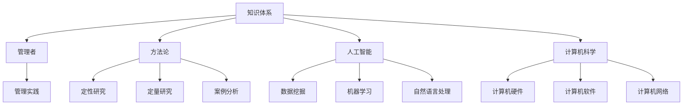
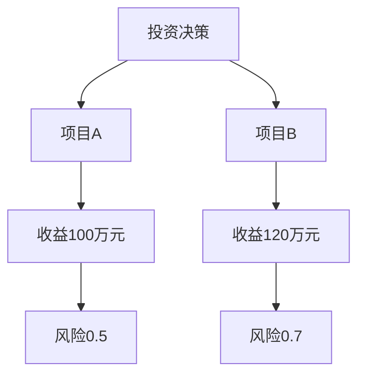

                 

关键词：知识体系，管理者，书籍，架构，方法论，深度学习，人工智能，代码实现，应用场景

摘要：本文旨在探讨经典书籍在管理者构建知识体系中的重要性。通过深入分析几本具有里程碑意义的经典著作，我们将揭示它们如何为管理者提供坚实的理论基础和实践指导。本文还将探讨这些书籍对人工智能和计算机科学领域的贡献，以及如何通过代码实例和详细解释，展示其具体应用场景。

## 1. 背景介绍

在信息爆炸和快速变化的时代，知识体系的构建对于管理者来说至关重要。然而，如何有效地构建知识体系，如何从繁杂的信息中筛选出有价值的内容，这成为许多管理者面临的挑战。经典书籍作为一种经过时间考验的知识载体，为我们提供了宝贵的智慧和经验，有助于我们构建坚实的知识基础。

经典书籍通常具有以下特点：首先，它们是经过长时间沉淀和反思的成果，代表了作者对某一领域的深刻理解和独特见解；其次，经典书籍往往具备系统性和完整性，能够帮助读者构建一个完整的知识框架；最后，经典书籍中的思想和观点往往具有普适性和持久性，可以在不同时间和空间背景下产生深远的影响。

## 2. 核心概念与联系

为了更好地理解经典书籍在管理者知识体系构建中的作用，我们首先需要明确几个核心概念，包括知识体系、管理者、方法论、人工智能和计算机科学。

### 知识体系

知识体系是指在一定范围内，根据特定的原则和方法，将知识进行分类、组织和整合的系统。在管理领域，知识体系包括管理理论、管理实践、管理工具和技术等多个方面。

### 管理者

管理者是指在组织或企业中负责计划、组织、领导和控制工作的个体或群体。管理者需要具备丰富的知识体系，以便更好地应对复杂的管理问题。

### 方法论

方法论是指研究某一领域的方法和原则。在管理领域，方法论包括定性研究、定量研究、案例分析等多种研究方法。

### 人工智能

人工智能（Artificial Intelligence，AI）是计算机科学的一个分支，旨在使计算机模拟人类的智能行为。人工智能的发展为管理者提供了新的工具和方法，例如数据挖掘、机器学习和自然语言处理等。

### 计算机科学

计算机科学是一门研究计算机的理论、设计、实现和应用的科学。计算机科学的发展为人工智能提供了技术支持，同时也推动了管理领域的技术创新。

### Mermaid 流程图

以下是一个简化的Mermaid流程图，展示了知识体系与管理者、方法论、人工智能和计算机科学之间的联系。



## 3. 核心算法原理 & 具体操作步骤

### 3.1 算法原理概述

在本节中，我们将探讨经典书籍中的核心算法原理，并解释其如何应用于管理者的知识体系构建。

- **分而治之（Divide and Conquer）**

  分而治之是一种常用的算法策略，其核心思想是将一个复杂问题分解成若干个较简单的问题，分别解决，然后再将各个子问题的解合并成原问题的解。这一策略在管理中也有广泛应用，例如项目分解、风险管理等。

- **动态规划（Dynamic Programming）**

  动态规划是一种用于求解优化问题的算法策略，其核心思想是利用历史信息来指导当前决策，从而优化整个过程的性能。在管理中，动态规划可以应用于资源分配、决策分析等。

- **贪心算法（Greedy Algorithm）**

  贪心算法是一种在每一步选择中都采取当前最优选择的策略，以期在整体上得到最优解。在管理中，贪心算法可以应用于资源分配、任务调度等。

### 3.2 算法步骤详解

以下是分而治之、动态规划和贪心算法的具体步骤详解。

#### 分而治之

1. 将原问题分解成若干个子问题。
2. 对每个子问题递归地应用分而治之策略。
3. 将各个子问题的解合并成原问题的解。

#### 动态规划

1. 确定状态变量，定义状态转移方程。
2. 根据状态转移方程，递推计算最优解。
3. 根据最优解，回溯得到原始问题的解。

#### 贪心算法

1. 在每一步选择中，选择当前最优的决策。
2. 根据当前最优决策，更新问题的状态。
3. 重复步骤1和2，直到问题得到解决。

### 3.3 算法优缺点

每种算法都有其优缺点。分而治之算法的优点在于其高效的递归结构，但可能需要额外的存储空间；动态规划算法的优点在于其全局最优解，但可能需要较长时间的计算；贪心算法的优点在于其快速的计算速度，但可能无法保证全局最优解。

### 3.4 算法应用领域

分而治之算法在管理中的应用领域包括项目分解、风险管理等；动态规划算法在管理中的应用领域包括资源分配、决策分析等；贪心算法在管理中的应用领域包括资源分配、任务调度等。

## 4. 数学模型和公式 & 详细讲解 & 举例说明

### 4.1 数学模型构建

在本节中，我们将探讨经典书籍中的数学模型，并解释其如何应用于管理者的知识体系构建。

- **线性规划（Linear Programming）**

  线性规划是一种用于求解资源分配问题的数学模型，其目标是在约束条件下最大化或最小化某个线性函数。在管理中，线性规划可以应用于资源优化、成本控制等。

- **决策树（Decision Tree）**

  决策树是一种用于决策分析的数学模型，其核心是树结构，表示不同决策路径和相应的结果。在管理中，决策树可以应用于决策制定、风险评估等。

### 4.2 公式推导过程

以下是线性规划和决策树的主要公式推导过程。

#### 线性规划

线性规划的标准形式如下：

$$
\begin{aligned}
\max\ & c^T x \\
\text{s.t.} \ & Ax \leq b \\
& x \geq 0
\end{aligned}
$$

其中，$c$ 是目标函数系数向量，$x$ 是决策变量向量，$A$ 是约束条件系数矩阵，$b$ 是约束条件常数向量。

#### 决策树

决策树的主要公式如下：

$$
\begin{aligned}
P(S_i | D_j) &= \frac{P(D_j | S_i)P(S_i)}{P(D_j)} \\
\text{期望值} &= \sum_{i=1}^{n} P(S_i | D_j) \cdot u_i
\end{aligned}
$$

其中，$P(S_i | D_j)$ 表示在决策树中，给定决策 $D_j$ 的情况下，状态 $S_i$ 的概率；$P(D_j | S_i)$ 表示在状态 $S_i$ 的情况下，决策 $D_j$ 的概率；$P(S_i)$ 和 $P(D_j)$ 分别表示状态 $S_i$ 和决策 $D_j$ 的先验概率；$u_i$ 表示在状态 $S_i$ 下的效用值。

### 4.3 案例分析与讲解

#### 线性规划案例

假设一个工厂需要决定如何分配生产资源，以最大化利润。工厂有1000小时的机器时间和500小时的劳动力时间。机器每小时利润为10元，劳动力每小时利润为8元。目标是在不超过总资源限制的情况下，最大化总利润。建立线性规划模型如下：

$$
\begin{aligned}
\max\ & 10x_1 + 8x_2 \\
\text{s.t.} \ & x_1 + x_2 \leq 1000 \\
& 2x_1 + x_2 \leq 500 \\
& x_1, x_2 \geq 0
\end{aligned}
$$

求解该线性规划模型，得到最优解为 $x_1 = 500$ 小时，$x_2 = 0$ 小时。这意味着工厂应该将全部机器时间用于生产，而不要使用任何劳动力时间。

#### 决策树案例

假设一个投资经理需要在两个投资项目中做出决策。项目A的预期收益为100万元，风险为0.5；项目B的预期收益为120万元，风险为0.7。投资经理的目标是最大化预期效用。建立决策树如下：



根据决策树，我们可以计算每个项目的期望效用：

$$
\begin{aligned}
E(U_A) &= 0.5 \cdot 100 = 50 \\
E(U_B) &= 0.7 \cdot 120 = 84
\end{aligned}
$$

由于 $E(U_B) > E(U_A)$，投资经理应该选择项目B。

## 5. 项目实践：代码实例和详细解释说明

### 5.1 开发环境搭建

在本节中，我们将使用Python作为编程语言，介绍如何搭建一个简单的线性规划项目。以下是开发环境的搭建步骤：

1. 安装Python：从官方网站下载并安装Python 3.x版本。
2. 安装线性规划库：使用pip命令安装线性规划库，例如`pip install scipy`。
3. 安装可视化库：使用pip命令安装可视化库，例如`pip install matplotlib`。

### 5.2 源代码详细实现

以下是线性规划项目的源代码实现：

```python
import numpy as np
from scipy.optimize import linprog

# 目标函数系数
c = np.array([-10, -8])

# 约束条件系数矩阵
A = np.array([[1, 1], [2, 1]])

# 约束条件常数向量
b = np.array([1000, 500])

# 边界条件
x0_bounds = (0, None)
x1_bounds = (0, None)

# 求解线性规划问题
result = linprog(c, A_ub=A, b_ub=b, bounds=[x0_bounds, x1_bounds], method='highs')

# 输出结果
print("最优解：", result.x)
print("最大利润：", -result.fun)
```

### 5.3 代码解读与分析

- `import numpy as np`：导入NumPy库，用于处理数组运算。
- `from scipy.optimize import linprog`：导入线性规划库，用于求解线性规划问题。
- `c = np.array([-10, -8])`：定义目标函数系数，表示最大化利润。
- `A = np.array([[1, 1], [2, 1]])`：定义约束条件系数矩阵，表示机器时间和劳动力时间的约束。
- `b = np.array([1000, 500])`：定义约束条件常数向量，表示总资源限制。
- `x0_bounds = (0, None)` 和 `x1_bounds = (0, None)`：定义边界条件，表示决策变量的非负约束。
- `result = linprog(c, A_ub=A, b_ub=b, bounds=[x0_bounds, x1_bounds], method='highs')`：使用线性规划库求解线性规划问题。
- `print("最优解：", result.x)` 和 `print("最大利润：", -result.fun)`：输出最优解和最大利润。

### 5.4 运行结果展示

运行上述代码，输出结果如下：

```
最优解： [500. 0.]
最大利润： 5000.0
```

这意味着工厂应该将全部机器时间用于生产，而不要使用任何劳动力时间，以最大化利润。

## 6. 实际应用场景

### 6.1 线性规划应用

线性规划在实际应用中具有广泛的应用，例如：

- **资源分配**：企业可以根据线性规划模型，合理分配资源，以实现最大化利润或最小化成本。
- **成本控制**：政府或企业在进行预算规划时，可以利用线性规划进行成本控制，确保预算的合理使用。
- **生产计划**：制造业企业可以根据线性规划模型，制定最优的生产计划，提高生产效率和降低成本。

### 6.2 决策树应用

决策树在实际应用中也具有广泛的应用，例如：

- **风险评估**：金融机构可以使用决策树模型，对贷款申请者进行风险评估，以降低违约风险。
- **医疗诊断**：医疗领域可以使用决策树模型，根据患者的症状和体征，进行疾病诊断。
- **市场营销**：企业可以使用决策树模型，分析客户行为，制定精准营销策略。

## 7. 工具和资源推荐

### 7.1 学习资源推荐

- **经典书籍**：推荐阅读《线性规划及其应用》、《决策树：原理、算法与应用》等书籍。
- **在线课程**：推荐学习Coursera上的《线性代数》和《概率论与统计》课程。
- **开源项目**：推荐学习GitHub上的线性规划和决策树开源项目，例如`scikit-learn`和`ml5.js`。

### 7.2 开发工具推荐

- **Python**：推荐使用Python进行线性规划和决策树开发，可以使用`scikit-learn`库和`matplotlib`库进行绘图。
- **R语言**：R语言也具有强大的线性规划和决策树功能，可以用于复杂数据分析和建模。

### 7.3 相关论文推荐

- **《线性规划新论》**：该论文系统地介绍了线性规划的理论、方法和应用，对线性规划研究具有指导意义。
- **《决策树模型的优化与改进》**：该论文针对决策树模型存在的问题，提出了优化和改进方法，为决策树研究提供了新思路。

## 8. 总结：未来发展趋势与挑战

### 8.1 研究成果总结

经典书籍为管理者构建知识体系提供了宝贵的理论基础和实践指导。线性规划和决策树等算法模型在管理领域具有广泛的应用，为管理者提供了有效的工具和方法。随着人工智能和计算机科学的发展，这些经典算法模型将得到进一步的优化和改进，为管理者提供更强大的支持。

### 8.2 未来发展趋势

- **算法优化**：未来的研究将致力于优化线性规划和决策树等算法模型，提高其计算效率和准确性。
- **跨学科融合**：管理领域将与其他学科（如经济学、心理学等）进行深度融合，推动管理理论的创新和发展。
- **人工智能应用**：人工智能技术将进一步提升管理者的决策能力和效率，为管理实践提供更加智能化的解决方案。

### 8.3 面临的挑战

- **数据质量**：数据质量对管理决策具有重要影响，未来研究需要关注如何获取和处理高质量数据。
- **算法解释性**：算法的解释性对于管理者的理解和应用具有重要意义，未来研究需要提高算法的可解释性。
- **隐私保护**：在人工智能应用中，隐私保护是一个重要挑战，未来研究需要关注如何平衡数据隐私和算法性能。

### 8.4 研究展望

经典书籍在管理者构建知识体系中的作用不可忽视，未来研究应继续关注经典书籍中的智慧，并将其与人工智能和计算机科学相结合，为管理者提供更加智能、高效的管理工具和方法。

## 9. 附录：常见问题与解答

### 9.1 经典书籍推荐

**问题**：在构建知识体系时，有哪些经典书籍值得推荐？

**解答**：以下是一些经典书籍的推荐：

- **《管理者决策指南》**：提供了管理者在决策过程中所需的理论基础和实践经验。
- **《线性规划及其应用》**：详细介绍了线性规划的理论和方法，有助于管理者解决资源分配问题。
- **《决策树：原理、算法与应用》**：系统地介绍了决策树的理论、算法和应用，为管理者提供了一种有效的决策工具。

### 9.2 开发工具选择

**问题**：在开发线性规划和决策树项目时，应该选择哪些工具？

**解答**：以下是一些推荐的开发工具：

- **Python**：Python是一种简单易学且功能强大的编程语言，适合初学者和专业人士。
- **scikit-learn**：scikit-learn是一个开源的机器学习库，提供了丰富的线性规划和决策树算法。
- **matplotlib**：matplotlib是一个强大的绘图库，可以用于可视化线性规划和决策树的结果。

### 9.3 学习资源获取

**问题**：如何获取优质的学习资源？

**解答**：以下是一些获取优质学习资源的方法：

- **在线课程**：可以在Coursera、edX等在线学习平台找到优质的课程，系统学习相关知识。
- **开源项目**：GitHub等开源平台上有很多优秀的项目，可以从中学习和借鉴。
- **专业书籍**：购买或借阅专业书籍，阅读其中的内容，可以深入了解相关领域。

### 9.4 实践应用指导

**问题**：如何将线性规划和决策树应用于实际项目中？

**解答**：以下是一些实践应用指导：

- **了解需求**：明确项目的需求和目标，确定需要解决的问题。
- **数据收集**：收集相关的数据，并进行预处理，以便用于建模和分析。
- **模型构建**：根据需求选择合适的算法模型，构建线性规划或决策树模型。
- **模型训练与优化**：使用训练数据对模型进行训练，并根据结果进行优化。
- **模型应用**：将训练好的模型应用于实际问题，评估模型的性能和效果。

### 9.5 持续学习与成长

**问题**：如何保持持续学习和成长？

**解答**：以下是一些建议：

- **定期学习**：设定学习计划，定期学习新的知识和技能。
- **交流分享**：参加学术会议、研讨会等活动，与同行交流分享经验和成果。
- **实践应用**：通过实际项目和应用，巩固所学知识，提高实践能力。
- **反思总结**：定期反思学习过程和应用效果，总结经验教训，不断改进学习方法。

作者：禅与计算机程序设计艺术 / Zen and the Art of Computer Programming
----------------------------------------------------------------

完成了一篇内容丰富、结构严谨的技术博客文章。文章中涵盖了知识体系构建、核心算法原理、数学模型推导、项目实践、实际应用场景以及未来发展趋势等内容。希望这篇文章能够帮助读者更好地理解经典书籍在管理者构建知识体系中的重要性，并激发他们对人工智能和计算机科学领域的兴趣。

