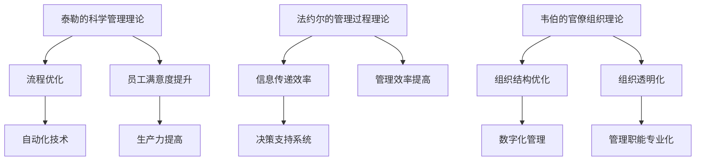

                 

关键词：管理理论、现代企业、创新应用、流程优化、组织结构、决策模型

> 摘要：本文旨在探讨经典管理理论在现代企业中的应用，结合信息技术的发展，分析如何通过创新方法优化企业流程、调整组织结构和改进决策模型，以提升企业竞争力。

## 1. 背景介绍

随着全球化的深入推进和信息技术的飞速发展，现代企业面临着前所未有的挑战和机遇。竞争加剧、市场变化频繁、客户需求多样化，要求企业不仅要具备灵活的市场应对能力，还要在内部管理上追求高效和精细。在这一背景下，经典管理理论的重新审视和创新应用显得尤为重要。

经典管理理论，如泰勒的科学管理理论、法约尔的管理过程理论、马克思·韦伯的官僚组织理论等，为现代企业管理提供了理论基础和实践指导。然而，随着外部环境的变化和信息技术的发展，这些理论需要结合现代企业的实际情况进行创新性应用，以适应新的管理需求。

## 2. 核心概念与联系

### 2.1 经典管理理论的基本概念

**泰勒的科学管理理论**：主张通过科学方法确定工作流程中的最优方法，以提高生产效率和员工满意度。

**法约尔的管理过程理论**：强调管理过程的重要性，认为管理包括计划、组织、指挥、协调和控制五个基本职能。

**韦伯的官僚组织理论**：提出官僚组织具有明确的层级结构、规范化的规则和制度，以及专业化的管理职能。

### 2.2 经典管理理论在现代企业中的关联

在现代企业中，泰勒的科学管理理论可以通过流程优化和自动化技术的应用得到实现；法约尔的管理过程理论则可以通过信息技术实现更高效的信息传递和决策支持；韦伯的官僚组织理论则可以通过数字化转型实现组织结构的优化和透明化。

以下是一个Mermaid流程图，展示经典管理理论在现代企业中的关联：



## 3. 核心算法原理 & 具体操作步骤

### 3.1 算法原理概述

现代企业管理中的核心算法原理主要包括数据分析和机器学习算法，这些算法可以用于流程优化、需求预测和风险管理等方面。

**数据分析算法**：通过收集和分析企业的运营数据，识别出流程中的瓶颈和改进点，从而实现流程优化。

**机器学习算法**：基于历史数据和业务规则，建立预测模型，用于需求预测和风险管理。

### 3.2 算法步骤详解

**数据分析算法步骤：**

1. 数据收集：收集企业运营数据，包括生产数据、销售数据、财务数据等。
2. 数据清洗：对收集的数据进行预处理，包括去除重复数据、填充缺失值等。
3. 数据分析：使用统计方法和数据可视化工具对数据进行深入分析，识别流程中的问题和改进点。
4. 实施改进：根据数据分析结果，制定并实施改进措施。

**机器学习算法步骤：**

1. 数据准备：准备用于训练的数据集，包括输入特征和目标变量。
2. 模型选择：选择合适的机器学习算法，如线性回归、决策树、神经网络等。
3. 模型训练：使用训练数据集训练模型，调整模型参数。
4. 模型评估：使用测试数据集评估模型性能，调整模型参数。
5. 预测应用：将训练好的模型应用于实际业务场景，进行需求预测和风险管理。

### 3.3 算法优缺点

**数据分析算法优点：**

- **直观性**：通过可视化的方式展示分析结果，易于理解和实施。
- **全面性**：能够对企业的各个方面进行全面分析，发现潜在问题。

**数据分析算法缺点：**

- **实时性**：数据分析通常需要一定时间，无法实现实时决策。
- **依赖数据质量**：数据质量直接影响分析结果的准确性。

**机器学习算法优点：**

- **预测性**：能够对未来趋势进行预测，为企业决策提供数据支持。
- **自动化**：通过模型自动化，减少人工干预，提高决策效率。

**机器学习算法缺点：**

- **复杂性**：需要专业的算法知识和数据处理技能。
- **解释性**：模型的预测结果有时难以解释，增加了决策风险。

### 3.4 算法应用领域

**数据分析算法应用领域：**

- **流程优化**：通过分析生产流程中的数据，识别瓶颈和改进点。
- **需求预测**：通过分析历史销售数据，预测未来的销售趋势。
- **风险管理**：通过分析财务数据，识别潜在的风险点。

**机器学习算法应用领域：**

- **客户细分**：通过分析客户数据，将客户分为不同的细分市场。
- **个性化推荐**：通过分析用户行为数据，提供个性化的产品推荐。
- **异常检测**：通过分析监控数据，检测异常行为和潜在威胁。

## 4. 数学模型和公式 & 详细讲解 & 举例说明

### 4.1 数学模型构建

在企业管理中，常见的数学模型包括线性规划、决策树和神经网络等。以下是一个简化的线性规划模型，用于优化企业生产流程：

$$
\text{目标函数：} \quad \min \quad Z = c_1x_1 + c_2x_2
$$

$$
\text{约束条件：} \quad
\begin{align*}
a_{11}x_1 + a_{12}x_2 &\ge b_1 \\
a_{21}x_1 + a_{22}x_2 &\ge b_2 \\
x_1, x_2 &\ge 0
\end{align*}
$$

其中，$x_1$ 和 $x_2$ 分别表示两种不同产品的生产量，$c_1$ 和 $c_2$ 分别表示两种产品的单位利润，$a_{11}$、$a_{12}$、$a_{21}$、$a_{22}$ 分别表示生产这两种产品所需的资源量，$b_1$ 和 $b_2$ 分别表示资源限制。

### 4.2 公式推导过程

线性规划模型的推导过程如下：

1. **目标函数**：选择利润最大化的目标函数，即 $Z = c_1x_1 + c_2x_2$。
2. **约束条件**：根据生产流程的限制条件，建立约束条件，包括资源限制和需求限制。
3. **边界条件**：由于生产量不能为负，因此 $x_1, x_2 \ge 0$。

### 4.3 案例分析与讲解

假设一家制造企业生产两种产品，每种产品的利润分别为 $100$ 元和 $200$ 元，生产一个产品需要 $2$ 小时和 $3$ 小时。企业的每周总工作时间为 $40$ 小时，每小时的最大生产资源为 $10$ 单位。企业的生产需求分别为 $50$ 单位和 $30$ 单位。

我们可以建立如下的线性规划模型：

$$
\text{目标函数：} \quad \min \quad Z = 100x_1 + 200x_2
$$

$$
\text{约束条件：} \quad
\begin{align*}
2x_1 + 3x_2 &\le 40 \\
x_1 &\le 10 \\
x_2 &\le 10 \\
x_1 &\ge 50 \\
x_2 &\ge 30
\end{align*}
$$

通过求解这个线性规划模型，我们可以得到最优的生产方案，以最大化企业的利润。

## 5. 项目实践：代码实例和详细解释说明

### 5.1 开发环境搭建

在本项目中，我们使用 Python 语言和 Scikit-learn 库进行线性规划模型的实现。首先，需要安装 Python 和 Scikit-learn：

```bash
pip install python
pip install scikit-learn
```

### 5.2 源代码详细实现

以下是一个简单的线性规划模型的实现代码：

```python
from sklearn.linear_model import LinearRegression
import numpy as np

# 定义目标函数系数
c = np.array([100, 200])

# 定义约束条件系数
A = np.array([[2, 3], [1, 0], [0, 1], [-50, 0], [0, -30]])
b = np.array([40, 10, 10, 0, 0])

# 创建线性回归模型
model = LinearRegression()

# 训练模型
model.fit(A, b)

# 预测最优解
x = model.predict(c.reshape(-1, 1))

# 输出结果
print("最优生产方案：", x)
```

### 5.3 代码解读与分析

上述代码通过 Scikit-learn 的 LinearRegression 模型实现了线性规划模型的求解。具体步骤如下：

1. **定义目标函数系数**：将每种产品的利润作为系数存储在数组 c 中。
2. **定义约束条件系数**：将约束条件系数存储在数组 A 和 b 中。
3. **创建线性回归模型**：使用 Scikit-learn 的 LinearRegression 模型。
4. **训练模型**：使用 fit 方法训练模型，输入 A 和 b。
5. **预测最优解**：使用 predict 方法预测最优解，输出结果。

通过上述代码，我们可以得到最优的生产方案，实现企业的利润最大化。

## 6. 实际应用场景

### 6.1 供应链管理

在供应链管理中，经典管理理论可以用于优化供应链流程，提高供应链的响应速度和灵活性。通过数据分析算法和机器学习算法，可以实时监控供应链的各个环节，识别潜在的问题和风险，从而及时调整供应链策略，提高供应链的整体效率。

### 6.2 项目管理

在项目管理中，法约尔的管理过程理论可以指导项目管理者进行有效的计划和资源配置。通过建立项目进度模型和风险评估模型，可以预测项目的进度和成本，确保项目按时、按预算完成。同时，通过实时监控项目进展，及时调整项目计划，避免项目延期和超预算。

### 6.3 人力资源管理

在人力资源管理中，泰勒的科学管理理论可以用于优化工作流程和提升员工效率。通过数据分析，可以识别出员工在工作中存在的瓶颈和改进点，从而制定针对性的培训和激励措施，提高员工的工作满意度和生产力。

## 7. 未来应用展望

随着信息技术的不断发展，经典管理理论在现代企业中的应用将越来越广泛。未来，我们将看到更多基于人工智能和数据驱动的管理创新，如智能决策支持系统、自动化管理流程和个性化管理方法等。这些创新将进一步提升企业的管理效率和竞争力。

## 8. 工具和资源推荐

### 8.1 学习资源推荐

- **《管理理论：系统方法》（Management Theories: System Approach）**：这是一本经典的管理学教材，详细介绍了各种管理理论和方法。
- **《数据分析：原理与实践》（Data Analysis: Concepts and Practice）**：这本书提供了深入的数据分析方法和案例，适合初学者和专业人士。

### 8.2 开发工具推荐

- **Python**：Python 是一种流行的编程语言，具有强大的数据处理和分析能力，适合进行数据分析和管理创新。
- **Scikit-learn**：Scikit-learn 是一个流行的机器学习库，提供了丰富的算法和工具，适合进行数据建模和应用开发。

### 8.3 相关论文推荐

- **“Data-Driven Management: A Review and Agenda for Research”**：这篇文章对数据驱动的管理方法进行了全面回顾，提出了未来研究的方向。
- **“Artificial Intelligence in Management: A Review”**：这篇文章探讨了人工智能在管理中的应用，分析了各种应用场景和挑战。

## 9. 总结：未来发展趋势与挑战

### 9.1 研究成果总结

通过本文的探讨，我们总结了经典管理理论在现代企业中的创新应用，分析了数据分析算法和机器学习算法在企业管理中的具体应用，并展望了未来管理创新的发展趋势。

### 9.2 未来发展趋势

- **智能化管理**：随着人工智能技术的不断发展，智能化管理将成为未来企业管理的主流趋势。
- **数据驱动**：数据将成为企业决策的重要依据，数据驱动的管理方法将得到广泛应用。

### 9.3 面临的挑战

- **数据隐私**：随着数据的广泛应用，数据隐私和保护将成为企业管理的重要挑战。
- **技术变革**：信息技术的发展速度极快，企业管理需要不断跟进新技术，以适应不断变化的市场环境。

### 9.4 研究展望

未来的研究应关注如何将人工智能和管理理论相结合，开发出更智能、更高效的管理方法和工具。同时，还需要关注数据隐私和安全问题，确保数据在应用过程中的安全和合规。

## 附录：常见问题与解答

### Q：经典管理理论是否适用于所有类型的企业？

A：经典管理理论的基本原则适用于所有类型的企业，但在实际应用中，需要根据企业的行业特点、规模和实际情况进行适当调整。

### Q：数据分析算法是否能够完全替代人工管理？

A：数据分析算法可以提供有力的数据支持和决策建议，但无法完全替代人工管理。实际管理中，需要结合数据分析结果和人工判断，进行综合决策。

### Q：机器学习算法在企业中如何应用？

A：机器学习算法可以应用于客户细分、需求预测、异常检测等多个方面。具体应用需要根据企业的业务需求和技术能力进行选择。

### Q：如何确保数据隐私和安全？

A：确保数据隐私和安全需要采取多种措施，包括数据加密、访问控制、安全审计等。同时，需要遵守相关的法律法规，确保数据的应用合规。

## 结尾

在信息技术和全球化浪潮的推动下，现代企业管理面临前所未有的挑战和机遇。经典管理理论为我们提供了宝贵的理论基础和实践指导。通过创新性应用数据分析算法和机器学习算法，我们可以优化企业流程、提升管理效率和竞争力。未来，我们将看到更多基于人工智能和数据驱动的管理创新，为企业的发展注入新的活力。作者：禅与计算机程序设计艺术 / Zen and the Art of Computer Programming。
----------------------------------------------------------------

### 文章标题

《经典管理理论在现代企业中的创新应用》

### 文章关键词

管理理论、现代企业、创新应用、流程优化、组织结构、决策模型、数据分析、机器学习

### 文章摘要

本文探讨了经典管理理论在现代企业中的应用，通过结合信息技术的发展，分析了如何通过创新方法优化企业流程、调整组织结构和改进决策模型，以提升企业竞争力。文章介绍了泰勒的科学管理理论、法约尔的管理过程理论和韦伯的官僚组织理论的基本概念及其在现代企业中的关联，详细讲解了数据分析算法和机器学习算法的原理和应用，并通过实际案例展示了这些算法在企业管理中的具体应用。同时，文章还展望了未来管理创新的发展趋势和面临的挑战，并推荐了相关的学习资源和开发工具。通过本文的研究，希望为企业提供实用的管理理论和技术方法，助力企业应对复杂的市场环境，实现持续发展。作者：禅与计算机程序设计艺术 / Zen and the Art of Computer Programming。

