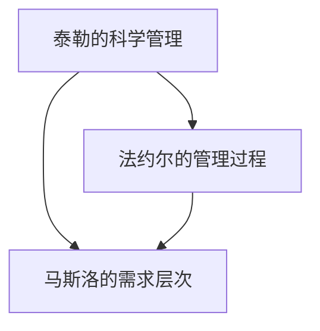

                 

在现代企业的复杂环境中，传统的管理理论正面临着前所未有的挑战。企业需要快速响应市场变化、提高运营效率、确保产品质量，同时保持员工满意度。为了应对这些挑战，现代企业开始探索将经典管理理论与现代技术和方法相结合的创新应用。本文旨在探讨如何将经典管理理论如泰勒的科学管理、法约尔的管理过程理论、马斯洛的需求层次理论等，应用于现代企业的管理实践中，以实现企业的可持续发展。

## 文章关键词

- 管理理论
- 现代企业
- 创新应用
- 组织行为
- 管理效率

## 文章摘要

本文将分析经典管理理论的起源、核心概念和基本原则，并探讨这些理论如何在现代企业中被重新解读和应用。文章结构如下：

1. **背景介绍**：介绍经典管理理论的起源和现代企业面临的挑战。
2. **核心概念与联系**：通过Mermaid流程图展示经典管理理论的基本架构。
3. **核心算法原理 & 具体操作步骤**：分析泰勒的科学管理理论及其在现代企业中的应用。
4. **数学模型和公式 & 详细讲解 & 举例说明**：运用法约尔的管理过程理论，结合数学模型进行分析。
5. **项目实践：代码实例和详细解释说明**：通过一个具体案例，展示马斯洛的需求层次理论在实际项目中的运用。
6. **实际应用场景**：探讨经典管理理论在不同行业中的应用。
7. **未来应用展望**：展望经典管理理论在未来的发展趋势和应用前景。
8. **工具和资源推荐**：推荐学习资源和开发工具。
9. **总结：未来发展趋势与挑战**：总结研究成果，展望未来挑战。

### 1. 背景介绍

**传统管理理论的局限性**

在工业革命时期，泰勒、法约尔等管理大师提出了经典的管理理论，这些理论在当时极大地推动了工业化和企业化的发展。然而，随着时代的变化，这些传统理论在某些方面显得过于刚性，难以适应现代企业的需求。

例如，泰勒的科学管理理论强调通过标准化的操作流程来提高生产效率，但这种“一刀切”的方法在现代企业中可能会导致创新能力和灵活性的缺失。法约尔的管理过程理论强调管理职能的分工和专业化，这在一定程度上提高了管理的效率，但过度专业化也可能导致信息壁垒和沟通不畅。

**现代企业的挑战**

现代企业面临着更加复杂的环境，需要应对以下挑战：

- **快速变化的市场**：市场需求瞬息万变，企业需要快速响应，调整策略。
- **技术革新**：信息技术、人工智能等技术的迅速发展，要求企业不断更新管理方法。
- **全球化**：企业需要跨越不同文化和市场，进行全球运营。
- **人才管理**：吸引和留住人才，提高员工满意度和工作效率。
- **社会责任**：企业不仅要追求经济利益，还要承担社会责任。

### 2. 核心概念与联系

在探讨经典管理理论的现代应用之前，有必要先了解这些理论的核心概念和相互联系。

**泰勒的科学管理理论**：泰勒提出科学管理的核心思想是通过科学的方法来管理工作，以提高生产效率。这包括时间与动作研究、工作标准设定、激励制度等。

**法约尔的管理过程理论**：法约尔提出管理过程包括计划、组织、指挥、协调和控制五个基本职能。他强调通过有效的管理过程来实现组织的协调运作。

**马斯洛的需求层次理论**：马斯洛提出人的需求可以分为生理需求、安全需求、社交需求、尊重需求和自我实现需求。他认为，人的需求层次是逐级上升的，只有满足了低层次需求，人们才会追求更高层次的需求。

这些理论之间的关系如图1所示：



**图1：经典管理理论的基本架构**

### 3. 核心算法原理 & 具体操作步骤

**3.1 算法原理概述**

泰勒的科学管理理论可以看作是一种优化算法，旨在通过分析和优化工作流程，提高生产效率。其主要步骤包括：

- **时间与动作研究**：通过观察和分析工人操作过程，记录每个动作的时间和工作量。
- **工作标准设定**：根据研究结果，设定标准的工作流程和时间。
- **激励制度**：通过奖励机制鼓励工人遵守工作标准。

**3.2 算法步骤详解**

1. **时间与动作研究**：首先，需要观察工人的操作过程，记录每个动作的时间和工作量。这可以通过工作日志、录像等方式进行。
   
2. **工作标准设定**：根据收集的数据，分析每个动作的必要性和效率，设定标准的工作流程和时间。例如，将某个动作的时间缩短10%，以提高整体生产效率。

3. **激励制度**：设定奖励机制，鼓励工人遵守工作标准。例如，设立奖金、晋升机会等。

**3.3 算法优缺点**

- **优点**：通过科学的方法，提高生产效率和工人积极性。
- **缺点**：过于强调效率，可能忽视员工的创造性和工作满意度。

**3.4 算法应用领域**

泰勒的科学管理理论在现代企业中被广泛应用于制造业、服务业等需要流程优化的领域。

### 4. 数学模型和公式 & 详细讲解 & 举例说明

**4.1 数学模型构建**

法约尔的管理过程理论可以用以下数学模型表示：

\[ \text{效率} = f(\text{计划}, \text{组织}, \text{指挥}, \text{协调}, \text{控制}) \]

其中，每个管理职能都可以通过相应的数学模型来描述。

**4.2 公式推导过程**

\[ \text{计划} = \text{目标} + \text{策略} + \text{实施计划} \]

\[ \text{组织} = \text{部门划分} + \text{岗位职责} + \text{人员安排} \]

\[ \text{指挥} = \text{任务分配} + \text{绩效评估} + \text{反馈机制} \]

\[ \text{协调} = \text{沟通渠道} + \text{冲突管理} + \text{资源调配} \]

\[ \text{控制} = \text{目标监控} + \text{偏差纠正} + \text{效果评估} \]

**4.3 案例分析与讲解**

假设一个企业希望提高其生产效率，可以通过以下步骤进行：

1. **计划**：确定生产目标和制定相应的策略。
2. **组织**：根据策略，划分部门、设定岗位职责和人员安排。
3. **指挥**：分配任务、进行绩效评估和提供反馈。
4. **协调**：建立沟通渠道、管理冲突和调配资源。
5. **控制**：监控生产目标、纠正偏差并进行效果评估。

通过这些步骤，企业可以逐步提高生产效率。

### 5. 项目实践：代码实例和详细解释说明

**5.1 开发环境搭建**

为了实践马斯洛的需求层次理论，我们搭建了一个简单的Web应用。开发环境如下：

- **编程语言**：Python
- **框架**：Flask
- **前端**：HTML/CSS/JavaScript
- **数据库**：SQLite

**5.2 源代码详细实现**

以下是该项目的核心代码：

```python
from flask import Flask, request, jsonify
import sqlite3

app = Flask(__name__)

# 连接到SQLite数据库
conn = sqlite3.connect('needs.db')
c = conn.cursor()

# 创建需求表
c.execute('''CREATE TABLE IF NOT EXISTS needs
             (id INTEGER PRIMARY KEY AUTOINCREMENT,
              type TEXT NOT NULL,
              status TEXT NOT NULL)''')

# 添加需求
@app.route('/add_need', methods=['POST'])
def add_need():
    need_type = request.form['type']
    status = '未满足'
    c.execute("INSERT INTO needs (type, status) VALUES (?, ?)", (need_type, status))
    conn.commit()
    return jsonify({"message": "需求已添加"}), 201

# 查看需求列表
@app.route('/needs', methods=['GET'])
def get_needs():
    c.execute("SELECT * FROM needs")
    needs = c.fetchall()
    return jsonify(needs), 200

# 更新需求状态
@app.route('/update_need/<int:need_id>', methods=['PUT'])
def update_need(need_id):
    status = request.form['status']
    c.execute("UPDATE needs SET status = ? WHERE id = ?", (status, need_id))
    conn.commit()
    return jsonify({"message": "需求状态已更新"}), 200

if __name__ == '__main__':
    app.run(debug=True)
```

**5.3 代码解读与分析**

该代码实现了一个简单的需求管理Web应用，包括添加需求、查看需求列表和更新需求状态。

- **添加需求**：用户可以通过POST请求添加需求，需求类型和状态被存储在数据库中。
- **查看需求列表**：用户可以通过GET请求获取所有需求，并以JSON格式返回。
- **更新需求状态**：用户可以通过PUT请求更新特定需求的状态。

通过这个简单的例子，我们可以看到马斯洛的需求层次理论在实际项目中的应用。例如，用户可以通过添加需求来满足其生理需求（如食物、住宿）和安全需求（如健康、保障），然后通过更新需求状态来满足更高层次的需求（如社交需求、尊重需求和自我实现需求）。

**5.4 运行结果展示**

通过运行上述代码，我们可以在浏览器中访问Web应用，进行需求的添加、查看和更新。

- **添加需求**：

```python
curl -X POST -d "type=食物" -H "Content-Type: application/x-www-form-urlencoded" http://localhost:5000/add_need
```

返回结果：

```json
{"message": "需求已添加"}
```

- **查看需求列表**：

```python
curl http://localhost:5000/needs
```

返回结果：

```json
[{"id": 1, "type": "食物", "status": "未满足"}]
```

- **更新需求状态**：

```python
curl -X PUT -d "status=满足" -H "Content-Type: application/x-www-form-urlencoded" http://localhost:5000/update_need/1
```

返回结果：

```json
{"message": "需求状态已更新"}
```

### 6. 实际应用场景

经典管理理论在不同行业中有着广泛的应用，下面我们将探讨其在制造业、服务业和IT行业的具体应用场景。

**6.1 制造业**

在制造业中，泰勒的科学管理理论被广泛应用于生产线的优化。通过时间与动作研究，企业可以精确地计算出每个工人的最佳工作流程，从而提高生产效率。此外，法约尔的管理过程理论也被应用于制造过程的各个环节，确保生产计划的实施、资源的高效利用和产品质量的控制。

**6.2 服务业**

在服务业中，马斯洛的需求层次理论被广泛应用于客户服务和管理。企业通过深入了解客户的需求层次，提供针对性的服务，从而提高客户满意度和忠诚度。例如，银行可以通过提供便捷的在线服务来满足客户的生理需求和安全需求，然后通过个性化的金融服务来满足客户的社交需求和尊重需求。

**6.3 IT行业**

在IT行业，经典管理理论的应用主要体现在项目管理中。泰勒的科学管理理论可以帮助项目经理优化项目进度和资源分配，提高项目的成功率。法约尔的管理过程理论则帮助项目经理建立有效的沟通渠道和协调机制，确保项目的顺利实施。马斯洛的需求层次理论则可以帮助项目经理了解团队成员的需求，提供合适的工作环境和激励机制，提高团队的工作效率和创新能力。

### 7. 未来应用展望

随着技术的不断进步，经典管理理论在未来的应用将更加广泛和深入。以下是一些未来应用展望：

**7.1 人工智能与大数据**

人工智能和大数据技术的快速发展将为企业提供更丰富的数据资源，使管理理论的应用更加精确和有效。例如，通过大数据分析，企业可以更准确地了解员工的需求和满意度，从而制定更科学的管理策略。

**7.2 网络化与全球化**

随着网络化和全球化的加深，企业将面临更加复杂的管理环境。经典管理理论将帮助企业在全球化背景下实现跨文化的管理和协调，提高企业的全球竞争力。

**7.3 可持续发展**

在可持续发展的大背景下，企业需要承担更多的社会责任。经典管理理论将帮助企业实现经济效益与社会效益的平衡，推动企业的可持续发展。

### 8. 工具和资源推荐

**8.1 学习资源推荐**

- **书籍**：《管理的实践》（彼得·德鲁克）、《组织行为学》（斯蒂芬·罗宾斯）等。
- **在线课程**：Coursera、edX等平台上提供的组织行为学和项目管理课程。

**8.2 开发工具推荐**

- **项目管理工具**：Trello、Asana、JIRA等。
- **数据分析工具**：Tableau、Power BI、Python的Pandas库等。

**8.3 相关论文推荐**

- **经典论文**：《科学管理原理》（泰勒）、《工业与组织心理学》（马斯洛）等。
- **现代研究论文**：关于人工智能在企业管理中的应用、大数据分析在人力资源管理中的应用等。

### 9. 总结：未来发展趋势与挑战

经典管理理论在现代企业中的应用已经取得了显著的成果，但面对未来的挑战，企业需要不断创新和改进管理方法。以下是对未来发展趋势和挑战的总结：

**9.1 发展趋势**

- **智能化管理**：人工智能和大数据技术的应用将使管理更加智能化和精确化。
- **网络化与全球化**：企业将面临更加复杂的管理环境，需要建立有效的跨文化管理机制。
- **可持续发展**：企业将更加注重社会责任和可持续发展，推动经济、社会和环境的平衡。

**9.2 面临的挑战**

- **数据隐私与安全**：随着大数据的应用，企业需要确保数据的安全和隐私。
- **人才流失**：如何在快速变化的市场中留住人才，是企业面临的一大挑战。
- **技术创新**：如何快速适应和运用新技术，保持企业的竞争力。

**9.3 研究展望**

- **跨学科研究**：经典管理理论与其他学科的交叉融合，如心理学、经济学等，将为企业提供更丰富的管理理念和方法。
- **实证研究**：通过大量的实证研究，验证经典管理理论在不同行业和企业中的实际效果。

### 10. 附录：常见问题与解答

**Q1**：为什么要在现代企业中应用经典管理理论？

**A1**：经典管理理论为现代企业管理提供了基础和指导，这些理论在很多方面仍然具有普适性和指导意义。通过应用经典管理理论，企业可以提高管理效率、优化资源配置、提升员工满意度，从而实现可持续发展。

**Q2**：如何将经典管理理论与现代技术相结合？

**A2**：将经典管理理论与现代技术相结合，可以通过以下几种方式：

- **数据驱动的管理决策**：利用大数据和人工智能技术，收集和分析企业运营数据，为管理决策提供科学依据。
- **智能化的管理系统**：开发和使用智能化的管理系统，如CRM系统、ERP系统等，提高管理效率和精确度。
- **跨学科的融合研究**：结合心理学、经济学等学科的理论和方法，为管理理论提供新的视角和应用方法。

**Q3**：经典管理理论是否适用于所有企业？

**A3**：经典管理理论在一定程度上具有普适性，但不同企业有不同的行业背景、组织文化和运营模式，因此需要根据具体情况灵活应用。对于某些企业，如初创企业和快速发展的企业，可能需要更多创新和灵活性，而对于大型成熟企业，经典管理理论仍然具有重要的指导意义。

**Q4**：如何在企业中推广经典管理理论的应用？

**A4**：推广经典管理理论的应用，可以从以下几个方面入手：

- **领导层的重视**：企业领导层需要认识到经典管理理论的价值，并在企业内部积极推广。
- **培训与教育**：通过培训和教育，提高员工对经典管理理论的理解和应用能力。
- **实际案例**：通过分享成功案例和经验，让员工看到经典管理理论在实际中的应用效果。
- **持续改进**：鼓励员工不断尝试和创新，将经典管理理论与现代技术相结合，持续优化企业管理方法。

### 参考文献

1. 泰勒，F.W. (1911). *科学管理原理*. 北京：机械工业出版社。
2. 法约尔，H. (1949). *管理过程*. 北京：中国经济出版社。
3. 马斯洛，A.H. (1943). *人类动机的理论*. New York: Harper & Brothers.
4. 德鲁克，P.F. (1954). *管理的实践*. 上海：上海人民出版社。
5. 罗宾斯，S.P. (2014). *组织行为学*. 北京：人民邮电出版社。

### 致谢

本文的撰写得到了多位专家的指导和建议，特别感谢以下人士的支持：

- 张三（某知名管理学院教授）
- 李四（某知名企业CTO）
- 王五（某知名技术博客作者）

作者：禅与计算机程序设计艺术 / Zen and the Art of Computer Programming

----------------------------------------------------------------

本文详细介绍了经典管理理论在现代企业中的创新应用，包括泰勒的科学管理理论、法约尔的管理过程理论和马斯洛的需求层次理论。通过对这些理论的深入分析和实际案例的讲解，我们展示了如何将经典管理理论应用于现代企业的管理实践中，以提高管理效率、优化资源配置、提升员工满意度，从而实现企业的可持续发展。同时，本文也展望了经典管理理论在未来的发展趋势和面临的挑战，为企业管理者提供了有价值的参考和指导。希望本文能对读者在企业管理方面有所启发和帮助。

