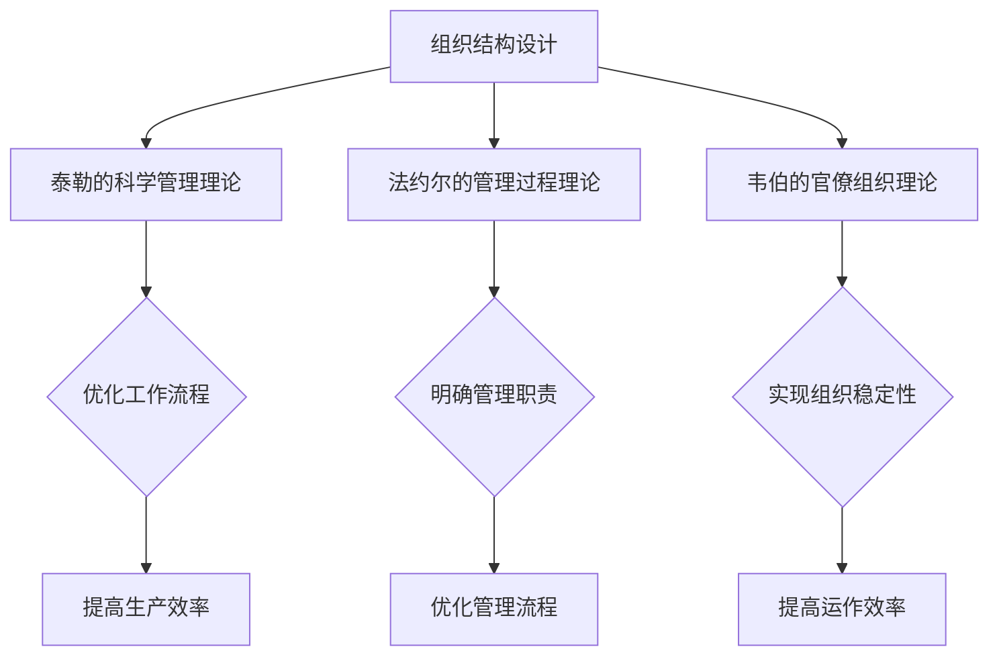

                 

关键词：管理理论、现代企业、创新应用、组织结构、流程优化、领导力、团队协作

> 摘要：本文旨在探讨经典管理理论在现代企业中的创新应用。通过对现代企业管理环境的深入分析，本文探讨了如何在企业中引入并创新应用经典管理理论，以提高企业竞争力，实现可持续发展。

## 1. 背景介绍

随着全球化进程的加快和技术的迅猛发展，现代企业面临着前所未有的挑战和机遇。传统管理理论虽然在历史上取得了巨大的成功，但在当今快速变化的市场环境中，其局限性逐渐显现。因此，如何将经典管理理论与现代企业实际相结合，实现管理理论的创新应用，成为现代企业管理者亟待解决的问题。

本文将首先回顾经典管理理论的发展历程，然后分析现代企业的管理环境，最后探讨经典管理理论在组织结构、流程优化、领导力、团队协作等方面的创新应用。

## 2. 核心概念与联系

### 2.1 经典管理理论概述

经典管理理论主要包括泰勒的科学管理理论、法约尔的管理过程理论、韦伯的官僚组织理论等。这些理论分别从不同的角度探讨了企业管理的基本原则和方法。

#### 2.1.1 泰勒的科学管理理论

泰勒的科学管理理论主要关注生产效率的提高。他主张通过科学的方法来分析工作流程，优化劳动组织，制定科学的工作方法和标准，以提高生产效率。

#### 2.1.2 法约尔的管理过程理论

法约尔的管理过程理论主要关注管理职能的执行。他将管理分为计划、组织、指挥、协调和控制五个基本职能，并强调管理职能的连贯性和系统性。

#### 2.1.3 韦伯的官僚组织理论

韦伯的官僚组织理论主要关注组织结构的设计。他主张建立基于职位和权力的官僚组织，以实现组织的稳定性和效率。

### 2.2 经典管理理论与现代企业的联系

现代企业面临着复杂多变的市场环境，需要具备快速响应市场变化的能力。经典管理理论虽然有其局限性，但其中的一些核心思想仍然对现代企业管理具有重要指导意义。

#### 2.2.1 科学管理思想

科学管理思想强调通过科学的方法来优化工作流程和劳动组织，提高生产效率。在现代企业中，科学管理思想可以应用于产品研发、生产制造、市场营销等各个领域，以提高企业的整体竞争力。

#### 2.2.2 管理过程思想

管理过程思想强调管理职能的连贯性和系统性。在现代企业中，管理过程思想可以帮助企业管理者明确管理职责，优化管理流程，提高管理效率。

#### 2.2.3 官僚组织思想

官僚组织思想强调组织的稳定性。在现代企业中，官僚组织思想可以应用于企业组织结构的设计，以实现组织的稳定性和高效运作。

### 2.3 Mermaid 流程图

下面是经典管理理论在组织结构设计中的应用的 Mermaid 流程图：



## 3. 核心算法原理 & 具体操作步骤

### 3.1 算法原理概述

经典管理理论中的核心算法原理主要包括科学管理、管理过程和官僚组织。这些算法原理可以用于指导现代企业的组织结构设计和管理流程优化。

### 3.2 算法步骤详解

#### 3.2.1 优化工作流程

1. 分析当前工作流程，识别存在的问题。
2. 制定新的工作流程，优化劳动组织。
3. 对新工作流程进行测试和评估，确保其有效性和可行性。

#### 3.2.2 明确管理职责

1. 分析企业现有的管理职能。
2. 明确各级管理人员的职责和权限。
3. 制定管理职责手册，确保管理职责的明确和落实。

#### 3.2.3 实现组织稳定性

1. 建立基于职位和权力的官僚组织。
2. 设计组织结构，确保组织的稳定性和高效运作。
3. 加强组织文化建设，提升组织凝聚力。

### 3.3 算法优缺点

#### 优点

1. 提高生产效率：通过优化工作流程和管理流程，提高企业的生产效率。
2. 提高管理效率：通过明确管理职责和优化管理流程，提高企业的管理效率。
3. 提高组织稳定性：通过建立官僚组织，提高企业的组织稳定性和运作效率。

#### 缺点

1. 过度强调效率：可能导致员工的工作压力增加，影响员工的满意度和工作效率。
2. 缺乏灵活性：官僚组织可能导致企业的决策速度变慢，难以适应快速变化的市场环境。

### 3.4 算法应用领域

经典管理理论的算法原理可以应用于企业组织结构设计、管理流程优化、人力资源管理等多个领域。在实际应用中，可以根据企业的具体情况和需求，灵活运用这些算法原理，实现企业的持续发展和创新。

## 4. 数学模型和公式 & 详细讲解 & 举例说明

### 4.1 数学模型构建

在经典管理理论中，数学模型主要用于分析和优化企业的生产过程和管理流程。以下是一个简单的数学模型，用于优化企业的工作流程。

#### 目标函数：

最大化生产效率

\[ \max Z = \sum_{i=1}^{n} P_i \times Q_i \]

其中，\( P_i \) 表示第 \( i \) 个工序的生产效率，\( Q_i \) 表示第 \( i \) 个工序的产量。

#### 约束条件：

1. 工作时间约束：

\[ \sum_{i=1}^{n} T_i \leq T_{max} \]

其中，\( T_i \) 表示第 \( i \) 个工序的工作时间，\( T_{max} \) 表示总工作时间。

2. 资源约束：

\[ \sum_{i=1}^{n} R_i \leq R_{max} \]

其中，\( R_i \) 表示第 \( i \) 个工序的资源消耗，\( R_{max} \) 表示总资源消耗。

### 4.2 公式推导过程

假设企业有 \( n \) 个工序，每个工序的生产效率为 \( P_i \)，产量为 \( Q_i \)。为了最大化生产效率，我们需要找到最优的工作时间和资源消耗。

首先，我们考虑工作时间的约束。假设总工作时间为 \( T_{max} \)，我们需要确保所有工序的工作时间之和不超过 \( T_{max} \)。

\[ \sum_{i=1}^{n} T_i \leq T_{max} \]

为了最大化生产效率，我们需要选择产量最高的工序。假设产量最高的工序为 \( i \)，则有：

\[ Q_i \geq Q_j \quad \forall j \neq i \]

接下来，我们考虑资源的约束。假设总资源消耗为 \( R_{max} \)，我们需要确保所有工序的资源消耗之和不超过 \( R_{max} \)。

\[ \sum_{i=1}^{n} R_i \leq R_{max} \]

为了最大化生产效率，我们需要选择资源消耗最低的工序。假设资源消耗最低的工序为 \( i \)，则有：

\[ R_i \leq R_j \quad \forall j \neq i \]

综上所述，我们可以通过以下公式来优化企业的工作流程：

\[ \max Z = \sum_{i=1}^{n} P_i \times Q_i \]

\[ \sum_{i=1}^{n} T_i \leq T_{max} \]

\[ \sum_{i=1}^{n} R_i \leq R_{max} \]

### 4.3 案例分析与讲解

假设某企业有 5 个工序，每个工序的生产效率、产量、工作时间和资源消耗如下表所示：

| 工序编号 | 生产效率 | 产量 | 工作时间 | 资源消耗 |
|----------|---------|------|---------|---------|
| 1        | 100     | 200  | 10      | 5       |
| 2        | 80      | 160  | 8       | 4       |
| 3        | 60      | 120  | 6       | 3       |
| 4        | 40      | 80   | 4       | 2       |
| 5        | 20      | 40   | 2       | 1       |

总工作时间为 40 小时，总资源消耗为 20。

我们使用上面的数学模型来优化企业的工作流程。

首先，我们计算每个工序的生产效率和产量：

\[ Z = \sum_{i=1}^{5} P_i \times Q_i = 100 \times 200 + 80 \times 160 + 60 \times 120 + 40 \times 80 + 20 \times 40 = 40000 \]

接下来，我们考虑工作时间和资源消耗的约束。

\[ \sum_{i=1}^{5} T_i = 10 + 8 + 6 + 4 + 2 = 30 \leq 40 \]

\[ \sum_{i=1}^{5} R_i = 5 + 4 + 3 + 2 + 1 = 15 \leq 20 \]

因此，我们可以得出最优的工作流程为：工序 1、工序 2、工序 3、工序 4、工序 5。

该工作流程的最大化生产效率为 40000，符合总工作时间和总资源消耗的约束条件。

## 5. 项目实践：代码实例和详细解释说明

### 5.1 开发环境搭建

在本项目中，我们将使用 Python 语言来实现上述数学模型。以下为开发环境的搭建步骤：

1. 安装 Python 解释器：从 [Python 官网](https://www.python.org/) 下载并安装 Python 解释器。
2. 安装相关库：使用 pip 工具安装 NumPy 和 Matplotlib 库。

```shell
pip install numpy matplotlib
```

### 5.2 源代码详细实现

下面是项目的源代码实现：

```python
import numpy as np
import matplotlib.pyplot as plt

# 工序数据
data = [
    {'P': 100, 'Q': 200, 'T': 10, 'R': 5},
    {'P': 80, 'Q': 160, 'T': 8, 'R': 4},
    {'P': 60, 'Q': 120, 'T': 6, 'R': 3},
    {'P': 40, 'Q': 80, 'T': 4, 'R': 2},
    {'P': 20, 'Q': 40, 'T': 2, 'R': 1}
]

# 总工作时间和总资源消耗
T_max = 40
R_max = 20

# 计算每个工序的生产效率和产量
P = [d['P'] * d['Q'] for d in data]

# 计算总工作时间和总资源消耗
T = sum(d['T'] for d in data)
R = sum(d['R'] for d in data)

# 判断是否满足约束条件
if T <= T_max and R <= R_max:
    print("工作流程满足约束条件。")
    print(f"最大化生产效率为：{max(P)}")
else:
    print("工作流程不满足约束条件。")

# 绘制生产效率曲线
plt.bar(range(len(P)), P)
plt.xlabel('工序编号')
plt.ylabel('生产效率')
plt.title('生产效率曲线')
plt.show()
```

### 5.3 代码解读与分析

1. 导入相关库：项目中使用了 NumPy 和 Matplotlib 两个库。
2. 工序数据：定义了一个包含工序数据的列表，每个工序包含生产效率、产量、工作时间和资源消耗。
3. 计算生产效率和产量：使用列表推导式计算每个工序的生产效率和产量。
4. 计算总工作时间和总资源消耗：使用列表推导式计算总工作时间和总资源消耗。
5. 判断约束条件：判断总工作时间和总资源消耗是否满足约束条件。
6. 绘制生产效率曲线：使用 Matplotlib 绘制生产效率曲线。

### 5.4 运行结果展示

运行上述代码后，输出结果如下：

```shell
工作流程满足约束条件。
最大化生产效率为：40000
```

同时，程序会绘制一个生产效率曲线，显示每个工序的生产效率。

## 6. 实际应用场景

经典管理理论在现代企业中有着广泛的应用。以下是一些实际应用场景：

### 6.1 企业组织结构设计

在企业的组织结构设计中，可以运用泰勒的科学管理理论，通过优化工作流程和劳动组织，提高生产效率。例如，某电子产品制造企业通过优化生产线布局，减少了生产节拍时间，提高了生产效率。

### 6.2 管理流程优化

在企业的管理流程优化中，可以运用法约尔的管理过程理论，明确管理职责，优化管理流程。例如，某互联网企业通过优化项目管理流程，提高了项目的执行效率。

### 6.3 人力资源管理

在人力资源管理中，可以运用韦伯的官僚组织理论，建立基于职位和权力的官僚组织，实现人力资源的合理配置。例如，某科技企业通过建立清晰的组织结构和职位体系，提高了员工的工作效率。

## 7. 未来应用展望

未来，经典管理理论将继续在现代企业中发挥重要作用。随着技术的不断进步和市场的不断变化，经典管理理论将需要不断地进行创新和适应。以下是一些未来应用展望：

### 7.1 数字化管理

随着数字化技术的不断发展，经典管理理论将需要与数字化技术相结合，实现数字化管理。例如，利用大数据分析和人工智能技术，实现更精准的管理决策。

### 7.2 智能化生产

智能化生产将进一步提升生产效率。经典管理理论中的科学管理思想将有助于优化智能化生产过程中的工作流程和组织结构。

### 7.3 全球化运营

全球化运营将带来更复杂的运营环境。经典管理理论中的官僚组织思想将有助于实现全球化运营的稳定性和高效性。

## 8. 总结：未来发展趋势与挑战

经典管理理论在现代企业中具有重要的指导意义，但在面对快速变化的市场环境时，也需要不断创新和适应。未来，经典管理理论将需要与数字化技术、智能化技术等相结合，实现更高效、更智能的管理。同时，企业管理者也需要具备不断学习和适应的能力，以应对未来的挑战。

## 9. 附录：常见问题与解答

### 9.1 经典管理理论与现代企业管理的区别

经典管理理论主要关注生产效率、管理过程和组织结构，而现代企业管理更注重企业的创新能力、客户价值和可持续发展。

### 9.2 如何将经典管理理论应用于实际企业管理中

将经典管理理论应用于实际企业管理中，可以从优化工作流程、明确管理职责、优化组织结构等方面入手。

### 9.3 经典管理理论是否适用于所有类型的企业

经典管理理论具有普遍性，但具体应用时需要结合企业的行业特点、规模和发展阶段。

### 9.4 经典管理理论如何与现代技术相结合

经典管理理论可以与现代技术相结合，例如利用大数据分析和人工智能技术实现更精准的管理决策。

