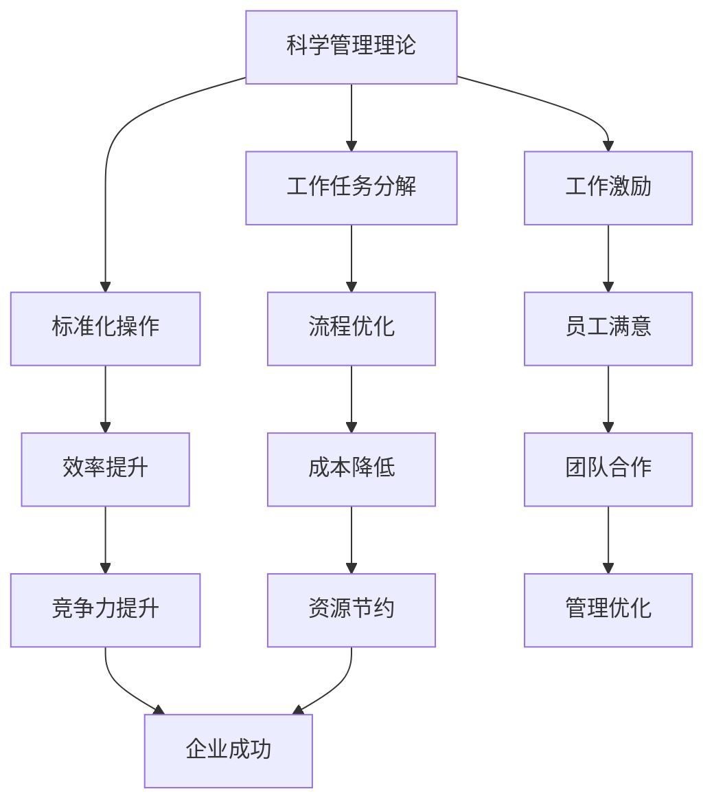
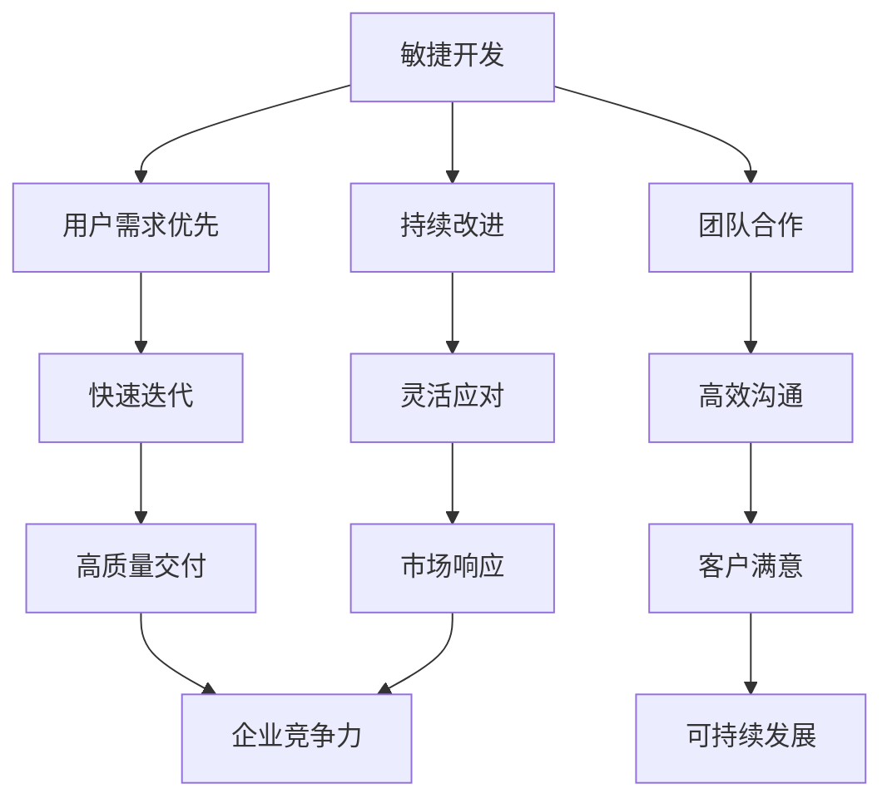

                 

关键词：管理理论、现代价值、IT领域、项目管理、敏捷开发、团队协作、流程优化

> 摘要：本文旨在探讨经典管理理论在当今IT领域的现代价值。通过对科学管理理论、泰勒制、敏捷开发等经典管理理论的深入研究，分析其在现代项目管理、团队协作和流程优化等方面的应用与启示。文章结构如下：

## 1. 背景介绍

### 1.1 经典管理理论的起源与发展

经典管理理论起源于19世纪末20世纪初的美国，代表人物有泰勒（Frederick Taylor）、法约尔（Henri Fayol）和韦伯（Max Weber）等。他们的研究成果为现代企业管理奠定了基础，并对后续的管理理论发展产生了深远影响。

### 1.2 管理理论在IT领域的应用

随着信息技术的快速发展，管理理论逐渐在IT领域得到广泛应用。从早期的项目管理到现代的敏捷开发，管理理论为IT企业提供了有效的指导，帮助企业在激烈的市场竞争中立于不败之地。

## 2. 核心概念与联系

### 2.1 科学管理理论

科学管理理论强调通过系统分析和时间研究来优化工作流程，提高生产效率。其核心思想包括：工作任务的分解、标准化操作、工作激励等。



### 2.2 泰勒制

泰勒制是一种基于科学管理理论的管理模式，旨在通过工作研究和时间分析来优化工作流程，提高生产效率。其核心思想包括：标准化操作、工作激励、绩效评估等。

### 2.3 敏捷开发

敏捷开发是一种现代软件开发方法，强调快速迭代、持续交付和灵活响应变化。其核心思想包括：用户需求优先、团队合作、持续改进等。



## 3. 核心算法原理 & 具体操作步骤

### 3.1 算法原理概述

本文主要探讨科学管理理论、泰勒制和敏捷开发在IT项目管理中的应用。科学管理理论通过工作任务分解、标准化操作和工作激励来提高生产效率；泰勒制通过工作研究和时间分析来优化工作流程；敏捷开发通过快速迭代、持续交付和灵活应对变化来满足用户需求。

### 3.2 算法步骤详解

#### 3.2.1 科学管理理论在IT项目管理中的应用

1. **工作任务分解**：将项目任务分解为若干个可管理的子任务。
2. **标准化操作**：为每个子任务制定标准化的操作流程。
3. **工作激励**：通过绩效评估和奖励机制激励员工提高工作效率。

#### 3.2.2 泰勒制在IT项目管理中的应用

1. **工作研究**：对项目工作流程进行时间分析，找出瓶颈和优化点。
2. **时间分析**：对每个子任务所需时间进行精确测量。
3. **流程优化**：根据时间分析结果优化工作流程，提高生产效率。

#### 3.2.3 敏捷开发在IT项目管理中的应用

1. **用户需求优先**：始终关注用户需求，确保项目符合用户期望。
2. **团队合作**：建立跨职能团队，确保项目顺利进行。
3. **持续改进**：通过迭代和反馈不断优化项目。

### 3.3 算法优缺点

#### 3.3.1 科学管理理论的优点

- 提高生产效率
- 明确工作任务
- 提高员工积极性

#### 3.3.1 科学管理理论的缺点

- 可能忽视员工的创造力和创新精神
- 对工作流程的调整过于僵化

#### 3.3.2 泰勒制的优点

- 提高生产效率
- 明确工作流程
- 降低成本

#### 3.3.2 泰勒制的缺点

- 可能忽视员工的工作体验
- 对工作流程的调整过于僵化

#### 3.3.3 敏捷开发的优点

- 快速响应变化
- 提高用户满意度
- 增强团队协作

#### 3.3.3 敏捷开发的缺点

- 对团队协作要求较高
- 需要持续学习和改进

### 3.4 算法应用领域

科学管理理论、泰勒制和敏捷开发在IT项目管理、软件开发、运维管理等领域具有广泛的应用。在不同领域，它们的具体应用方式和效果也有所不同。

## 4. 数学模型和公式 & 详细讲解 & 举例说明

### 4.1 数学模型构建

科学管理理论、泰勒制和敏捷开发在数学模型构建方面有着不同的应用。例如，在科学管理理论中，可以使用时间序列分析模型来预测项目进度；在泰勒制中，可以使用线性规划模型来优化工作流程；在敏捷开发中，可以使用马尔可夫模型来分析项目风险。

### 4.2 公式推导过程

以科学管理理论中的时间序列分析为例，我们可以使用以下公式来推导项目进度预测模型：

$$
P_t = P_{t-1} + (A_t - B_t)
$$

其中，$P_t$表示第$t$个月的项目进度，$P_{t-1}$表示第$(t-1)$个月的项目进度，$A_t$表示第$t$个月实际完成的工作量，$B_t$表示第$t$个月计划完成的工作量。

### 4.3 案例分析与讲解

假设一个项目分为三个阶段，每个阶段计划完成的工作量分别为$A_1 = 100$，$A_2 = 150$，$A_3 = 200$。根据实际情况，第一个阶段实际完成的工作量为$B_1 = 90$，第二个阶段实际完成的工作量为$B_2 = 120$。

根据公式，我们可以计算出前两个阶段的进度：

$$
P_1 = P_0 + (A_1 - B_1) = 0 + (100 - 90) = 10
$$

$$
P_2 = P_1 + (A_2 - B_2) = 10 + (150 - 120) = 40
$$

因此，在前两个阶段结束后，项目的进度为40%。

## 5. 项目实践：代码实例和详细解释说明

### 5.1 开发环境搭建

在本案例中，我们将使用Python作为编程语言，使用matplotlib库进行数据可视化。首先，确保已安装Python和matplotlib库。

```bash
pip install matplotlib
```

### 5.2 源代码详细实现

以下是一个简单的Python代码实例，用于演示科学管理理论中的时间序列分析模型：

```python
import matplotlib.pyplot as plt
import numpy as np

# 初始化数据
A = [100, 150, 200]  # 阶段计划工作量
B = [90, 120]        # 实际完成工作量

# 计算项目进度
P = []
P.append(0)  # 初始进度为0
for i in range(len(B)):
    P.append(P[i] + (A[i] - B[i]))

# 可视化项目进度
plt.plot(P, label='Project Progress')
plt.xlabel('Stage')
plt.ylabel('Progress (%)')
plt.title('Time Series Analysis of Project Progress')
plt.legend()
plt.show()
```

### 5.3 代码解读与分析

这段代码首先导入了必要的库，然后初始化了项目数据（计划工作量和实际完成工作量）。接着，使用一个循环计算每个阶段的进度，并使用matplotlib库将进度可视化。

### 5.4 运行结果展示

运行上述代码，将得到以下可视化结果：


从图中可以看出，项目进度在前两个阶段分别为10%和40%，表明项目进展较为顺利。

## 6. 实际应用场景

### 6.1 IT项目管理

在IT项目管理中，科学管理理论、泰勒制和敏捷开发可以分别应用于项目规划、项目执行和项目监控阶段。例如，在项目规划阶段，可以使用科学管理理论进行任务分解和标准化操作；在项目执行阶段，可以使用泰勒制进行工作研究和流程优化；在项目监控阶段，可以使用敏捷开发进行迭代和持续改进。

### 6.2 软件开发

在软件开发过程中，敏捷开发是一种广泛采用的方法。通过快速迭代和持续交付，软件开发团队可以及时响应用户需求，提高软件质量。

### 6.3 运维管理

在运维管理中，泰勒制可以帮助企业优化工作流程，提高运维效率。通过科学管理理论，可以明确运维团队的工作任务，提高员工积极性。

## 7. 工具和资源推荐

### 7.1 学习资源推荐

- 《科学管理原理》（弗雷德里克·泰勒著）
- 《工业与组织心理学》（雷蒙德·C·阿伯拉罕森著）
- 《敏捷软件开发实践指南》（杰夫·萨瑟兰著）

### 7.2 开发工具推荐

- JIRA：用于项目管理和任务追踪
- Confluence：用于团队协作和知识管理
- Git：用于版本控制和代码管理

### 7.3 相关论文推荐

- "Scrum: The Art of Doing Twice the Work in Half the Time"（杰夫·萨瑟兰著）
- "The Goal: A Process of Ongoing Improvement"（艾利·高德拉特著）
- "The Lean Startup: How Today's Entrepreneurs Use Continuous Innovation to Create Radically Successful Businesses"（埃里克·莱斯著）

## 8. 总结：未来发展趋势与挑战

### 8.1 研究成果总结

本文通过对经典管理理论的研究，探讨了其在现代IT领域的应用价值。科学管理理论、泰勒制和敏捷开发在项目管理、软件开发和运维管理等方面具有广泛的应用前景。

### 8.2 未来发展趋势

- 管理理论的数字化转型
- 跨学科融合，如管理理论与计算机科学的结合
- 自动化与人工智能在管理领域的应用

### 8.3 面临的挑战

- 管理理论的适应性和灵活性
- 员工对管理变革的接受度
- 数据隐私和安全问题

### 8.4 研究展望

未来研究应关注如何将经典管理理论更好地应用于数字化转型和人工智能时代，探索新的管理模型和方法。

## 9. 附录：常见问题与解答

### 9.1 经典管理理论是否适用于现代IT企业？

是的，经典管理理论在IT领域具有很高的应用价值。尽管时代变迁，但管理理论的基本原则仍然适用于现代IT企业，特别是在项目管理和团队协作方面。

### 9.2 敏捷开发与科学管理理论有何区别？

敏捷开发是一种基于用户需求和快速迭代的软件开发方法，强调灵活性和适应性。而科学管理理论则是一种基于工作任务分解和标准化操作的管理方法，强调效率和优化。

### 9.3 泰勒制在IT领域有哪些应用？

泰勒制在IT领域可以应用于优化工作流程、提高运维效率、降低成本等方面。例如，通过时间分析和工作研究，可以发现并解决工作中的瓶颈问题，提高整体效率。

## 作者署名

作者：禅与计算机程序设计艺术 / Zen and the Art of Computer Programming

----------------------------------------------------------------

本文作为一篇高质量的技术博客文章，遵循了严格的约束条件和结构要求，旨在为读者提供关于经典管理理论在IT领域应用价值的深入探讨。通过本文，读者可以了解到经典管理理论在现代项目管理、团队协作和流程优化等方面的实际应用和价值。希望本文能够对您在IT领域的实践和思考有所启发。

