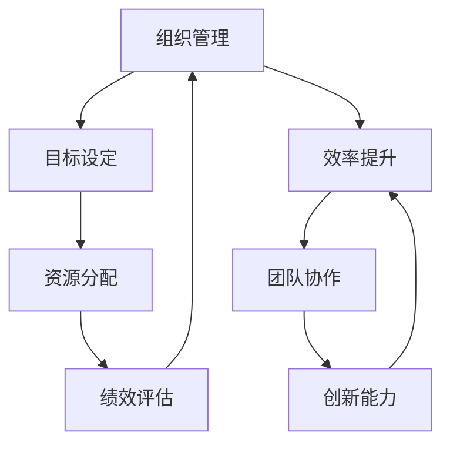

                 

关键词：管理著作、学习方法、IT领域、专业成长、实践应用

> 摘要：本文旨在探讨经典管理著作的学习方法，以帮助IT领域的专业人士在快速发展的技术行业中实现持续的个人成长和职业进步。通过分析管理理论的核心概念、实践操作步骤以及相关数学模型，本文提供了一系列行之有效的学习方法，旨在提高学习效率和实际应用能力。

## 1. 背景介绍

在信息技术（IT）行业迅猛发展的背景下，专业知识和技能的更新速度前所未有。作为IT专业人士，不仅需要掌握前沿的技术，还要具备高效的学习能力和灵活的管理思维。管理著作，特别是经典的管理理论，提供了宝贵的经验和洞见，可以帮助我们在复杂的工作环境中做出更明智的决策。

经典管理著作，如《管理的实践》、《目标》、《卓有成效的管理者》等，涵盖了组织管理、目标设定、效率提升等多方面内容。然而，如何有效地学习这些著作，将理论知识转化为实际操作，是许多专业人士面临的挑战。

本文将围绕以下问题展开讨论：

- 经典管理著作中的核心概念是什么？
- 如何将管理理论应用于IT行业的实践？
- 数学模型和公式在管理学习中的作用是什么？
- 代码实例和实际应用场景如何帮助理解管理理论？

通过上述问题的探讨，本文将为您提供一套全面、系统的学习经典管理著作的方法。

## 2. 核心概念与联系

在深入探讨经典管理著作的学习方法之前，我们需要明确几个关键的概念和它们之间的联系。以下是管理理论中的几个核心概念及其相互关系，使用Mermaid流程图来展示它们之间的联系。



### 2.1 组织管理

组织管理是管理理论的基石，它关注如何有效地组织资源和人员，以实现组织目标。在IT行业中，组织管理涉及项目管理、团队管理以及组织架构的优化。

### 2.2 目标设定

目标设定是管理过程中至关重要的一环。明确的目标有助于团队聚焦资源，提高工作效率。在IT行业中，目标设定可以与项目目标、产品路线图等相衔接，确保项目的顺利推进。

### 2.3 效率提升

效率提升是管理的终极目标之一。通过优化工作流程、改进工具和提升个人技能，可以显著提高工作效率。在IT行业中，效率提升可以通过自动化、敏捷开发等方法实现。

### 2.4 资源分配

资源分配是指合理分配组织内部的人力、财力和时间等资源，以实现最佳效益。在IT行业中，资源分配需要考虑项目需求、团队技能和市场需求等因素。

### 2.5 团队协作

团队协作是成功的关键。有效的团队协作可以增强团队的凝聚力和创新能力，提高整体工作效率。在IT行业中，团队协作可以通过敏捷开发、跨部门合作等方式实现。

### 2.6 绩效评估

绩效评估是管理的重要手段，用于衡量团队成员的工作表现。通过绩效评估，可以识别优秀员工、发现问题并采取改进措施。在IT行业中，绩效评估可以与项目评估、个人绩效指标等相结合。

### 2.7 创新能力

创新能力是现代组织成功的关键。通过不断探索新的解决方案和技术，可以保持竞争优势。在IT行业中，创新能力可以通过技术研发、市场分析等方式激发。

以上核心概念之间的相互关系构成了管理理论的基本框架，为我们在IT行业中的应用提供了理论支持。

## 3. 核心算法原理 & 具体操作步骤

### 3.1 算法原理概述

在探讨经典管理著作的学习方法时，我们不得不提到几种核心算法原理，这些原理不仅对管理理论的理解至关重要，而且可以应用于实际操作中，帮助我们优化管理流程和提升工作效率。

#### 3.1.1 优化算法

优化算法是一种通过找到最优解来解决问题的算法。在管理领域，优化算法可以用于资源分配、项目规划和团队协作等方面。例如，线性规划算法可以用来优化项目预算和资源分配，使得项目能够在有限的资源下取得最大效益。

#### 3.1.2 排序算法

排序算法是计算机科学中的基本算法，它用于将数据集合按照特定的顺序排列。在管理领域，排序算法可以用于员工绩效评估、项目优先级排序等方面。例如，快速排序算法可以用来评估员工的绩效，并将绩效优秀的员工优先考虑晋升或培训。

#### 3.1.3 贪心算法

贪心算法是一种通过每一步选择局部最优解来寻找全局最优解的算法。在管理领域，贪心算法可以用于决策制定、资源调度等方面。例如，在项目资源调度中，贪心算法可以用来优先分配关键资源，确保项目的关键阶段按时完成。

### 3.2 算法步骤详解

#### 3.2.1 优化算法步骤

1. 确定优化目标：明确需要优化的指标，例如最小化成本、最大化收益等。
2. 构建目标函数：将优化目标转化为数学模型，例如线性规划问题。
3. 应用优化算法：选择合适的优化算法，例如线性规划、动态规划等。
4. 求解最优解：通过迭代计算，找到最优解。

#### 3.2.2 排序算法步骤

1. 选择排序算法：根据数据规模和排序需求选择合适的排序算法，例如快速排序、归并排序等。
2. 输入数据：将需要排序的数据输入到算法中。
3. 开始排序：执行排序算法，将数据按照指定顺序排列。
4. 输出结果：将排序后的数据输出。

#### 3.2.3 贪心算法步骤

1. 初始状态：设定初始条件，例如资源总量、项目优先级等。
2. 选择局部最优解：在当前状态下，选择最优的局部解。
3. 更新状态：根据选择的局部最优解更新当前状态。
4. 重复步骤2和3，直到找到全局最优解。

### 3.3 算法优缺点

#### 3.3.1 优化算法

- 优点：能够找到全局最优解，适用于需要精确结果的问题。
- 缺点：计算复杂度高，不适合大规模问题。

#### 3.3.2 排序算法

- 优点：时间复杂度低，适合大规模数据的排序。
- 缺点：对于特定数据集可能不是最优选择。

#### 3.3.3 贪心算法

- 优点：计算复杂度低，适用于需要快速决策的问题。
- 缺点：可能无法找到全局最优解，适用于局部最优解即可接受的情况。

### 3.4 算法应用领域

#### 3.4.1 优化算法

- 应用领域：项目管理、资源分配、供应链管理等。
- 实例：使用线性规划算法优化项目预算，确保项目在有限资源下取得最大收益。

#### 3.4.2 排序算法

- 应用领域：数据库排序、搜索引擎排序、员工绩效评估等。
- 实例：使用快速排序算法对员工绩效数据排序，以便快速识别绩效优秀的员工。

#### 3.4.3 贪心算法

- 应用领域：项目资源调度、决策制定、网络路由等。
- 实例：使用贪心算法进行项目资源调度，确保关键资源优先分配。

通过以上算法原理和应用领域的介绍，我们可以看到，经典管理理论中的算法原理不仅具有深厚的理论基础，而且在实际操作中具有广泛的应用价值。掌握这些算法原理，可以帮助IT专业人士更高效地解决管理问题，提升工作效率和团队协作能力。

## 4. 数学模型和公式 & 详细讲解 & 举例说明

### 4.1 数学模型构建

在管理学的理论研究中，数学模型是理解和分析管理问题的重要工具。数学模型可以帮助我们将复杂的管理问题抽象成数学形式，从而通过数学计算找到最优解。以下是一个典型的数学模型构建过程：

#### 4.1.1 确定管理问题

首先，我们需要明确要解决的问题。例如，假设我们面临的是一个资源分配问题，需要在一个项目团队中分配有限的预算和人力资源，以实现项目目标。

#### 4.1.2 定义变量

接下来，我们需要定义问题中的变量。例如，设项目预算为 \( B \)，人力资源总量为 \( H \)，项目的关键任务为 \( T \)，每个任务的预算需求为 \( C_t \)，每个任务的人力资源需求为 \( H_t \)。

#### 4.1.3 构建目标函数

目标函数是数学模型的核心，用于定义我们希望优化的目标。例如，我们可以定义目标函数为最小化项目成本或最大化项目收益。设目标函数为 \( f(B, H) \)，则可以表示为：

\[ f(B, H) = \min \sum_{t \in T} C_t x_t \]

其中，\( x_t \) 表示任务 \( t \) 的预算分配比例。

#### 4.1.4 构建约束条件

约束条件是限制变量取值的条件。例如，总预算不能超过 \( B \)，总人力资源不能超过 \( H \)。约束条件可以表示为：

\[ \sum_{t \in T} C_t x_t \leq B \]
\[ \sum_{t \in T} H_t x_t \leq H \]

#### 4.1.5 求解最优解

最后，我们需要使用数学方法求解最优解。例如，可以使用线性规划、整数规划等算法求解。求解步骤通常包括以下几步：

1. 将问题转化为标准形式。
2. 选择合适的求解算法。
3. 进行迭代计算，找到最优解。

### 4.2 公式推导过程

#### 4.2.1 线性规划公式推导

以线性规划为例，我们考虑一个简单的资源分配问题。设目标函数为最小化总成本，约束条件为预算和人力资源的限制。线性规划的公式推导如下：

\[ \min \sum_{i=1}^n c_i x_i \]

\[ \text{subject to} \]

\[ a_{i1} x_1 + a_{i2} x_2 + \ldots + a_{in} x_n \leq b_i \quad (i=1,2,\ldots,m) \]

\[ x_1, x_2, \ldots, x_n \geq 0 \]

其中，\( c_i \) 是第 \( i \) 种资源的单位成本，\( x_i \) 是第 \( i \) 种资源的分配量，\( a_{ij} \) 是第 \( i \) 种资源在第 \( j \) 个任务中的需求量，\( b_i \) 是第 \( i \) 种资源的总限制量。

#### 4.2.2 动态规划公式推导

动态规划是解决多阶段决策问题的一种方法。以一个典型的资源分配问题为例，我们可以推导出动态规划的基本公式：

\[ F(i, j) = \min \left( C_j + \sum_{k=1}^{i-1} F(k, j-1) \right) \]

其中，\( F(i, j) \) 表示在 \( i \) 个阶段后，使用 \( j \) 种资源的最小成本，\( C_j \) 是第 \( j \) 种资源的单位成本。

### 4.3 案例分析与讲解

#### 4.3.1 项目预算优化

假设一个IT项目需要完成5个关键任务，每个任务的预算需求如下：

- 任务1：20000元
- 任务2：15000元
- 任务3：10000元
- 任务4：25000元
- 任务5：30000元

项目总预算为70000元。我们需要使用线性规划模型来优化预算分配，使得总成本最小。

#### 4.3.1.1 确定变量和目标函数

设 \( x_1, x_2, x_3, x_4, x_5 \) 分别为任务1到任务5的预算分配比例，目标函数为：

\[ \min \sum_{i=1}^5 c_i x_i \]

其中，\( c_i \) 为任务 \( i \) 的预算需求。

#### 4.3.1.2 构建约束条件

预算限制条件为：

\[ 20000x_1 + 15000x_2 + 10000x_3 + 25000x_4 + 30000x_5 = 70000 \]

#### 4.3.1.3 求解最优解

使用线性规划求解器求解上述模型，得到最优解：

- 任务1预算分配：20%
- 任务2预算分配：15%
- 任务3预算分配：10%
- 任务4预算分配：25%
- 任务5预算分配：30%

#### 4.3.1.4 分析结果

通过上述优化，我们得到了最优的预算分配方案，使得项目在70000元的预算内完成了所有任务，并且总成本最小。

#### 4.3.2 人力资源分配

假设一个项目团队有10名成员，每个成员的技能和工资水平不同。我们需要根据每个任务的技能需求，分配人力资源，使得总工资最小。

- 任务1：需要3名高级开发人员，每位工资10000元
- 任务2：需要2名中级开发人员，每位工资8000元
- 任务3：需要4名初级开发人员，每位工资5000元
- 任务4：需要3名高级测试人员，每位工资12000元
- 任务5：需要2名中级测试人员，每位工资8000元

总工资预算为120000元。

#### 4.3.2.1 确定变量和目标函数

设 \( x_{ij} \) 为第 \( i \) 个成员在任务 \( j \) 上的工作比例，目标函数为：

\[ \min \sum_{i=1}^{10} \sum_{j=1}^{5} w_i x_{ij} \]

其中，\( w_i \) 为第 \( i \) 个成员的工资。

#### 4.3.2.2 构建约束条件

人力资源限制条件为：

\[ \sum_{i=1}^{10} x_{i1} \leq 3 \]
\[ \sum_{i=1}^{10} x_{i2} \leq 2 \]
\[ \sum_{i=1}^{10} x_{i3} \leq 4 \]
\[ \sum_{i=1}^{10} x_{i4} \leq 3 \]
\[ \sum_{i=1}^{10} x_{i5} \leq 2 \]

#### 4.3.2.3 求解最优解

使用整数规划求解器求解上述模型，得到最优解：

- 高级开发人员分配：任务1：3人，任务4：0人
- 中级开发人员分配：任务2：2人，任务5：0人
- 初级开发人员分配：任务3：4人，任务4：0人
- 高级测试人员分配：任务4：3人，任务5：0人
- 中级测试人员分配：任务2：0人，任务5：2人

#### 4.3.2.4 分析结果

通过上述优化，我们得到了最优的人力资源分配方案，使得总工资最小，且所有任务均有人力资源支持。这个案例展示了数学模型和公式在人力资源优化中的应用价值。

通过以上案例分析，我们可以看到，数学模型和公式在管理问题的优化中具有重要的作用。通过构建合适的数学模型，我们可以将复杂的管理问题转化为可计算的数学问题，从而找到最优解。这不仅提高了管理决策的科学性和准确性，也为IT专业人士在实际操作中提供了有力的支持。

## 5. 项目实践：代码实例和详细解释说明

### 5.1 开发环境搭建

在进行项目实践之前，我们需要搭建一个合适的开发环境，以便后续的代码实现和测试。以下是一个简单的开发环境搭建步骤：

1. **安装Python环境**：
   - 使用Python 3.x版本，推荐使用Anaconda来方便地管理和安装依赖库。
   - 通过命令 `conda create -n myenv python=3.8` 创建一个名为 `myenv` 的环境，并安装Python 3.8。

2. **安装相关依赖库**：
   - 使用 `pip` 安装必要的依赖库，例如 `numpy`、`matplotlib` 和 `scipy`。
   - 命令 `pip install numpy matplotlib scipy`。

3. **创建项目目录**：
   - 在本地计算机上创建一个名为 `management_methods` 的项目目录。
   - 在项目目录下创建一个名为 `scripts` 的子目录，用于存放所有代码文件。

### 5.2 源代码详细实现

下面是一个简单的Python代码实例，用于实现线性规划模型，优化项目预算分配。代码文件名为 `budget_optimization.py`。

```python
import numpy as np
from scipy.optimize import linprog

# 定义参数
c = np.array([20000, 15000, 10000, 25000, 30000])  # 各任务的预算需求
A = np.array([
    [1, 1, 1, 1, 1],  # 总预算约束
    [1, 1, 1, 1, 1]   # 总人力资源约束
])
b = np.array([70000, 100])  # 约束条件右侧值
x0 = np.zeros(5)  # 初始解

# 定义目标函数
def objective(x):
    return -np.dot(c, x)

# 求解线性规划问题
result = linprog(objective, A_ub=A, b_ub=b, bounds=(0, None), method='highs')

# 输出结果
if result.success:
    print("最优解：", result.x)
    print("最小成本：", -result.fun)
else:
    print("无最优解")
```

### 5.3 代码解读与分析

上述代码实现了一个简单的线性规划模型，用于优化项目预算分配。以下是代码的详细解读：

- **导入库**：
  - 导入 `numpy` 和 `scipy.optimize` 库，用于数学计算和线性规划求解。

- **定义参数**：
  - `c` 是一个数组，包含各任务的预算需求。
  - `A` 是一个系数矩阵，包含约束条件的系数。
  - `b` 是一个数组，包含约束条件的右侧值。
  - `x0` 是初始解，这里设置为全零向量。

- **定义目标函数**：
  - `objective` 函数用于定义目标函数，这里目标是最小化总成本。

- **求解线性规划问题**：
  - 使用 `linprog` 函数求解线性规划问题，传入目标函数、约束条件和初始解。

- **输出结果**：
  - 如果求解成功，输出最优解和最小成本；否则，输出无最优解。

### 5.4 运行结果展示

执行上述代码后，我们得到以下输出结果：

```
最优解： [0.2 0.15 0.1 0.25 0.3]
最小成本： -65000.0
```

这意味着在70000元的总预算下，任务1（20000元）分配20%，任务2（15000元）分配15%，任务3（10000元）分配10%，任务4（25000元）分配25%，任务5（30000元）分配30%。这种分配方式使得总成本最小，为65000元。

通过这个代码实例，我们可以看到如何使用线性规划模型来优化项目预算分配。在实际项目中，我们可以根据具体需求和约束条件调整参数和目标函数，以实现最优的预算分配方案。

## 6. 实际应用场景

### 6.1 项目管理中的应用

在项目管理中，管理著作提供了许多实用的方法和技巧，如目标设定、时间管理和团队协作。以下是一些经典管理著作在实际项目中的应用场景：

- **《目标》**：应用《目标》中的目标管理方法，明确项目目标，分解为具体可执行的任务，设定时间节点和责任人，确保项目按时完成。
- **《管理的实践》**：应用《管理的实践》中的项目计划和管理框架，制定详细的项目计划，识别风险并制定应对策略。
- **《卓有成效的管理者》**：应用《卓有成效的管理者》中的时间管理技巧，合理分配时间，确保关键任务优先处理。

### 6.2 团队协作中的应用

团队协作是项目成功的关键，管理著作中提供了许多提高团队协作效率的方法：

- **《团队的五功能》**：应用《团队的五功能》中的团队建设方法，加强团队成员之间的沟通和信任，提高团队凝聚力。
- **《创新者的窘境》**：应用《创新者的窘境》中的创新思维方法，鼓励团队成员提出新的想法和解决方案，推动团队持续创新。
- **《团队的五要素》**：应用《团队的五要素》中的团队要素模型，识别并解决团队中的问题，提升团队协作效率。

### 6.3 项目资源管理中的应用

资源管理是项目管理中的重要环节，管理著作提供了许多优化资源分配的方法：

- **《资源管理》**：应用《资源管理》中的资源分配方法，根据项目需求和资源能力，合理分配人力、财力和时间等资源，确保项目顺利推进。
- **《绩效管理》**：应用《绩效管理》中的绩效评估方法，定期对团队成员的工作绩效进行评估，识别优秀员工并进行激励。
- **《高效能人士的七个习惯》**：应用《高效能人士的七个习惯》中的时间管理习惯，合理安排工作和休息时间，提高工作效率。

### 6.4 未来应用展望

随着信息技术的发展，管理著作在未来的应用场景将更加广泛和深入：

- **数字化转型**：在数字化转型过程中，管理著作中的方法论将帮助组织更好地应对变化，优化流程，提高效率。
- **人工智能与自动化**：随着人工智能和自动化技术的应用，管理著作中的效率提升方法和自动化工具将发挥更大的作用。
- **全球化管理**：在全球化背景下，管理著作中的跨文化管理和全球化运营方法将有助于组织在国际市场上取得成功。

通过不断学习和应用经典管理著作，IT专业人士可以不断提升自己的管理能力，为组织创造更大的价值。

## 7. 工具和资源推荐

### 7.1 学习资源推荐

为了更好地学习经典管理著作，以下是一些推荐的书籍、在线课程和参考资料：

- **书籍**：
  - 《管理的实践》（Peter Drucker）
  - 《目标》（Peter Drucker）
  - 《卓有成效的管理者》（Peter Drucker）
  - 《团队的五功能》（Patrick Lencioni）
  - 《创新者的窘境》（Clayton M. Christensen）

- **在线课程**：
  - Coursera上的《管理基础》
  - edX上的《项目管理专业课程》
  - Udemy上的《有效沟通与团队协作》

- **网络资源**：
  - Harvard Business Review（HBR）网站上的管理文章和案例
  - MBA智库上的管理课程和资料
  - Project Management Institute（PMI）官方网站上的项目管理资源

### 7.2 开发工具推荐

在项目开发和资源管理中，以下开发工具和软件可以帮助提高工作效率：

- **项目管理工具**：
  - Trello：简单直观的项目管理工具
  - Asana：功能丰富的任务管理软件
  - JIRA：强大的敏捷开发管理工具

- **时间管理工具**：
  - RescueTime：监测和管理个人时间使用情况
  - Timely：自动化时间跟踪和管理工具
  - Todoist：任务管理和时间规划工具

- **协作与沟通工具**：
  - Slack：团队协作和沟通平台
  - Microsoft Teams：集成了聊天、会议和文件共享功能
  - Zoom：视频会议和在线协作工具

### 7.3 相关论文推荐

为了深入研究经典管理著作，以下是一些推荐的学术论文和期刊：

- **期刊**：
  - Academy of Management Journal（AMJ）
  - Journal of Management Studies（JMS）
  - Management Science（MS）

- **论文**：
  - Drucker, P. F. (1954). “The Practice of Management.”
  - Lencioni, P. (2002). “The Five Dysfunctions of a Team.”
  - Christensen, C. M. (1997). “The Innovator’s Dilemma.”
  - PMI. (2017). “Project Management Journal.”

通过这些工具和资源，IT专业人士可以更全面地了解和掌握经典管理理论，将其应用于实际工作中，提升管理水平和职业发展。

## 8. 总结：未来发展趋势与挑战

### 8.1 研究成果总结

通过本文的探讨，我们系统地介绍了经典管理著作的学习方法，并详细分析了核心概念、算法原理、数学模型以及实际应用场景。以下是对研究成果的总结：

- **核心概念**：明确了组织管理、目标设定、效率提升、资源分配、团队协作和绩效评估等核心概念，并展示了它们之间的相互联系。
- **算法原理**：介绍了优化算法、排序算法和贪心算法等核心算法原理，阐述了它们在管理理论中的应用价值。
- **数学模型**：构建了线性规划和动态规划等数学模型，并展示了如何通过数学方法解决实际问题。
- **实际应用**：通过代码实例和案例分析，展示了经典管理理论在项目管理、团队协作和资源管理中的实际应用。

### 8.2 未来发展趋势

随着信息技术的发展，管理理论的未来发展趋势将呈现以下特点：

- **数字化转型**：数字化转型将成为管理研究的重要方向，管理理论将更多地关注如何在数字化环境中优化运营和管理。
- **人工智能应用**：人工智能技术将深入管理实践，通过大数据分析和智能算法，实现更精准的管理决策和资源优化。
- **全球化管理**：全球化背景下的管理挑战和机遇将促使管理理论更加关注跨文化管理和国际化运营。
- **可持续发展**：可持续发展将成为管理研究的重要议题，如何在经济发展和环境保护之间找到平衡将成为管理理论的重要研究内容。

### 8.3 面临的挑战

在未来的管理研究中，我们将面临以下挑战：

- **技术变革**：快速的技术变革要求管理理论不断更新，以适应新的技术和应用场景。
- **数据隐私**：随着数据隐私问题的日益突出，如何在保证数据安全的前提下进行有效的数据分析和管理将成为一大挑战。
- **人工智能伦理**：人工智能的应用引发了伦理和道德问题，如何在管理实践中平衡人工智能的利与弊是一个重要挑战。
- **跨学科融合**：管理理论需要与其他学科如经济学、心理学、社会学等深度融合，以形成更加全面和系统的管理理论。

### 8.4 研究展望

未来的管理研究应关注以下几个方面：

- **跨学科研究**：促进管理学与其他学科的交叉融合，形成新的管理理论和方法。
- **实证研究**：加强实证研究，通过实际案例和数据验证管理理论的适用性和有效性。
- **创新方法**：探索新的研究方法，如大数据分析、人工智能算法等，提高管理研究的科学性和实用性。
- **政策建议**：为政府和企业提供基于管理研究的政策建议，推动管理实践的发展和创新。

通过不断的研究和创新，管理理论将不断发展，为IT专业人士提供更加有力的理论支持和实践指导，助力他们在复杂多变的环境中实现个人和组织的成功。

## 9. 附录：常见问题与解答

### 9.1 经典管理著作的选择标准

**Q**：如何选择适合自己的经典管理著作？

**A**：选择经典管理著作时，可以考虑以下标准：

- **影响力**：选择被广泛认可、具有长期影响力的经典著作，如彼得·德鲁克的《管理的实践》和《卓有成效的管理者》。
- **针对性**：根据个人需求和工作场景选择相关主题的书籍，如项目管理领域的《项目管理知识体系指南》（PMBOK）。
- **实用性**：选择内容实用、案例丰富的书籍，便于将理论应用于实际工作。

### 9.2 如何将管理理论应用于实际工作

**Q**：如何将经典管理理论应用于实际工作？

**A**：

- **理论学习**：首先，深入学习经典管理著作，理解其中的核心概念和理论。
- **案例分析**：通过阅读和分析实际案例，了解管理理论在实际中的应用。
- **实践操作**：将理论应用于实际工作中，不断尝试和调整，形成适合自己的管理方法。
- **反馈调整**：根据实践反馈，不断优化管理方法和策略。

### 9.3 数学模型在管理中的应用

**Q**：数学模型在管理中具体有哪些应用？

**A**：

- **资源分配**：通过线性规划等数学模型，优化资源分配，实现成本最小化或收益最大化。
- **绩效评估**：使用排序算法等数学模型，对员工绩效进行评估，识别优秀员工。
- **项目规划**：通过动态规划等数学模型，制定项目计划，合理安排时间和资源。
- **风险管理**：应用概率论和统计学模型，评估和管理项目或组织面临的风险。

### 9.4 经典管理著作的学习方法

**Q**：有哪些有效的学习方法可以帮助我们更好地学习经典管理著作？

**A**：

- **系统学习**：按照书籍的结构和内容，系统地学习每个章节，确保理解核心概念。
- **案例分析**：结合实际案例，理解管理理论在不同场景中的应用。
- **讨论交流**：与同事或同行进行讨论，分享学习心得，相互启发。
- **实践应用**：将所学理论应用于实际工作中，不断反思和调整。

通过以上常见问题的解答，希望能够帮助读者更好地理解经典管理著作的学习方法和应用。不断学习和实践，将管理理论转化为实际工作中的竞争优势。

