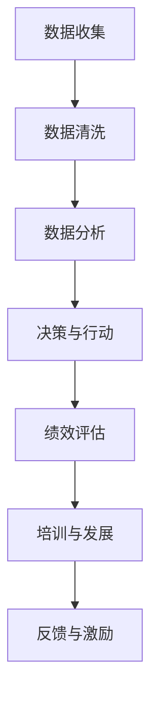

                 

关键词：绩效管理、LLM、分析驱动、人工智能、深度学习、算法优化、数据驱动

> 摘要：本文将探讨如何在现代组织中利用大规模语言模型（LLM）实现有效的绩效管理。通过分析驱动的方法，本文将详细介绍LLM在绩效评估、员工发展和组织优化中的关键作用，并探讨其未来的发展趋势和面临的挑战。

## 1. 背景介绍

在当今快速发展的数字化时代，组织面临的数据量呈爆炸性增长。传统的绩效管理方法已经无法满足现代组织的需求，因此需要引入更加先进的技术手段。大规模语言模型（LLM）作为人工智能领域的一项重要技术，具有强大的文本理解和生成能力，为绩效管理提供了全新的解决方案。

LLM的兴起源于深度学习的迅猛发展。深度学习通过多层神经网络对大量数据进行分析和建模，实现了对复杂问题的自动识别和解决。LLM则是在这一基础上进一步扩展，能够处理大规模的文本数据，并生成高质量的文本输出。这使得LLM在自然语言处理领域取得了显著的成果，也为绩效管理带来了新的机遇。

绩效管理是组织管理的重要组成部分，旨在通过评估员工的表现和潜力，促进个人和组织的发展。然而，传统的绩效管理方法存在一些局限性，如评估标准主观性较强、评估数据来源有限等。随着数据驱动管理理念的普及，如何利用大数据技术实现更加科学、客观的绩效管理成为了一个重要课题。

本文将探讨如何利用LLM分析驱动的方法，实现更加高效、精准的绩效管理。通过分析员工的工作数据、行为数据等，LLM可以自动识别员工的优势和不足，提供个性化的培训和发展建议，从而提升员工的绩效水平。同时，LLM还可以帮助组织优化绩效评估体系，提高组织的整体效率。

## 2. 核心概念与联系

### 2.1. 大规模语言模型（LLM）

大规模语言模型（LLM）是一种基于深度学习的自然语言处理模型，通过学习大量文本数据，能够生成高质量的自然语言文本。LLM的核心在于其大规模的训练数据集和多层神经网络结构。训练数据集通常来自于互联网上的大量文本，如新闻报道、社交媒体、学术论文等，这些数据覆盖了各种主题和语言风格，使得LLM具有广泛的知识储备和语言理解能力。

LLM的训练过程主要包括两个阶段：预训练和微调。在预训练阶段，LLM通过自主学习大量文本数据，学习语言的基本规律和语义信息。在微调阶段，LLM根据特定任务的需求，对模型进行微调，使其能够适应特定领域的文本处理需求。

LLM的主要特点包括：

1. **强大的文本生成能力**：LLM能够生成连贯、自然、具有丰富语义的文本，广泛应用于文本生成、机器翻译、摘要生成等领域。
2. **自适应性强**：LLM可以通过微调快速适应不同的应用场景，具有较强的泛化能力。
3. **海量数据学习**：LLM能够从大量文本数据中学习到丰富的知识，提高了模型的准确性和可靠性。

### 2.2. 绩效管理

绩效管理是指通过评估员工的工作表现，识别员工的潜力，提供培训和发展机会，以提高员工绩效和整体组织效率的一系列管理活动。绩效管理的目标在于建立一套科学、合理、公正的评估体系，激励员工发挥最佳水平，实现个人和组织的共同发展。

绩效管理的关键要素包括：

1. **绩效目标**：明确员工的绩效目标和指标，确保员工的工作方向与组织目标一致。
2. **绩效评估**：对员工的工作表现进行评估，识别员工的优势和不足，为员工的发展提供依据。
3. **培训与发展**：根据绩效评估结果，为员工提供个性化的培训和发展机会，提升员工的绩效能力。
4. **反馈与激励**：及时给予员工反馈和激励，增强员工的积极性和工作动力。

### 2.3. 分析驱动

分析驱动是一种以数据为核心的管理理念，通过数据分析和挖掘，发现问题和机会，指导决策和行动。在绩效管理中，分析驱动的方法可以帮助组织深入了解员工的工作表现，优化绩效评估体系，提高绩效管理的科学性和有效性。

分析驱动的核心步骤包括：

1. **数据收集**：收集与绩效相关的各种数据，包括工作数据、行为数据、绩效数据等。
2. **数据清洗**：对收集到的数据进行清洗和处理，确保数据的准确性和完整性。
3. **数据分析**：利用数据分析工具和方法，对数据进行挖掘和分析，发现问题和趋势。
4. **决策与行动**：根据数据分析结果，制定相应的绩效管理策略和行动计划，优化绩效管理过程。

### 2.4. Mermaid 流程图

以下是绩效管理分析驱动的 Mermaid 流程图：



## 3. 核心算法原理 & 具体操作步骤

### 3.1. 算法原理概述

在绩效管理中，LLM的算法原理主要基于深度学习和自然语言处理技术。LLM通过学习大量文本数据，建立了一个大规模的语义模型，能够对文本数据进行理解和生成。在绩效管理中，LLM的应用主要包括以下几个方面：

1. **文本生成**：利用LLM生成个性化的绩效评估报告、培训建议等文本。
2. **文本分类**：对员工的工作报告、行为数据进行分类，识别员工的工作表现和潜力。
3. **文本摘要**：对大量的绩效数据进行摘要，提取关键信息和主要趋势。
4. **文本问答**：通过问答交互，为员工提供个性化的绩效管理建议。

### 3.2. 算法步骤详解

以下是LLM在绩效管理中的具体操作步骤：

1. **数据收集**：收集与绩效相关的各种数据，包括员工的工作报告、绩效评估数据、行为数据等。
2. **数据预处理**：对收集到的数据进行清洗、去噪和处理，确保数据的准确性和一致性。
3. **模型训练**：使用预训练的LLM模型，对预处理后的数据集进行训练，优化模型的参数。
4. **模型评估**：使用验证集和测试集对训练好的模型进行评估，确保模型性能达到预期。
5. **文本生成**：利用训练好的LLM模型，生成个性化的绩效评估报告、培训建议等文本。
6. **文本分类**：对员工的工作报告、行为数据进行分类，识别员工的工作表现和潜力。
7. **文本摘要**：对大量的绩效数据进行摘要，提取关键信息和主要趋势。
8. **文本问答**：通过问答交互，为员工提供个性化的绩效管理建议。

### 3.3. 算法优缺点

LLM在绩效管理中的应用具有以下优缺点：

#### 优点：

1. **强大的文本生成能力**：LLM能够生成高质量、自然的文本，为绩效管理提供个性化的报告和建议。
2. **自适应性强**：LLM可以通过微调快速适应不同的应用场景，具有较强的泛化能力。
3. **数据处理能力强**：LLM能够处理大规模的文本数据，提高绩效管理的效率和准确性。

#### 缺点：

1. **训练成本高**：LLM的训练需要大量的计算资源和数据，导致训练成本较高。
2. **数据依赖性强**：LLM的性能高度依赖训练数据的质量和数量，数据质量不高可能导致模型性能不佳。
3. **解释性较差**：LLM的决策过程较为复杂，难以进行解释，增加了模型的可解释性挑战。

### 3.4. 算法应用领域

LLM在绩效管理中的应用非常广泛，以下是一些典型的应用领域：

1. **员工绩效评估**：利用LLM对员工的工作报告、行为数据进行分类和分析，识别员工的工作表现和潜力。
2. **培训与发展**：根据绩效评估结果，利用LLM生成个性化的培训建议，帮助员工提升绩效能力。
3. **绩效报告生成**：利用LLM生成详细的绩效评估报告，为管理层提供决策依据。
4. **员工互动**：通过问答交互，利用LLM为员工提供个性化的绩效管理建议，增强员工的参与感和满意度。

## 4. 数学模型和公式 & 详细讲解 & 举例说明

### 4.1. 数学模型构建

在绩效管理中，LLM的数学模型主要基于深度学习和自然语言处理技术。以下是一个简单的数学模型构建过程：

#### 1. 神经网络结构

神经网络是深度学习的基础，LLM通常采用多层感知机（MLP）结构。一个典型的MLP结构包括输入层、隐藏层和输出层。输入层接收原始数据，隐藏层通过非线性变换提取特征，输出层生成预测结果。

```latex
\text{输入层} \rightarrow \text{隐藏层} \rightarrow \text{输出层}
```

#### 2. 激活函数

隐藏层和输出层通常使用非线性激活函数，如ReLU（Rectified Linear Unit）和Sigmoid函数。ReLU函数在隐藏层中使用，可以加快模型的训练速度，提高模型的性能。Sigmoid函数在输出层中使用，可以将模型的输出结果映射到[0, 1]之间。

#### 3. 损失函数

在训练过程中，使用损失函数衡量模型的预测结果与真实结果之间的差距。常用的损失函数包括均方误差（MSE）和交叉熵（Cross-Entropy）。

- **均方误差（MSE）**：用于回归任务，衡量预测值与真实值之间的平均平方误差。

  $$L_{MSE} = \frac{1}{n} \sum_{i=1}^{n} (y_i - \hat{y}_i)^2$$

- **交叉熵（Cross-Entropy）**：用于分类任务，衡量预测概率分布与真实概率分布之间的差异。

  $$L_{CE} = -\frac{1}{n} \sum_{i=1}^{n} y_i \log(\hat{y}_i)$$

### 4.2. 公式推导过程

以下是一个简单的神经网络模型的推导过程：

#### 1. 前向传播

在神经网络的前向传播过程中，输入数据经过各个层的加权连接和激活函数，最终得到输出结果。假设神经网络有 $L$ 层，第 $l$ 层的输出可以表示为：

$$z_l = W_l \cdot a_{l-1} + b_l$$

其中，$W_l$ 是第 $l$ 层的权重矩阵，$a_{l-1}$ 是第 $l-1$ 层的输出，$b_l$ 是第 $l$ 层的偏置向量。

通过激活函数 $g_l$，可以得到第 $l$ 层的输出：

$$a_l = g_l(z_l)$$

#### 2. 反向传播

在反向传播过程中，通过计算损失函数的梯度，对神经网络的权重和偏置进行更新。假设损失函数为 $L$，则第 $l$ 层的梯度可以表示为：

$$\frac{\partial L}{\partial z_l} = \frac{\partial L}{\partial a_l} \cdot \frac{\partial a_l}{\partial z_l}$$

其中，$\frac{\partial L}{\partial a_l}$ 是损失函数关于第 $l$ 层输出的梯度，$\frac{\partial a_l}{\partial z_l}$ 是激活函数关于 $z_l$ 的梯度。

通过链式法则，可以计算第 $l$ 层的权重和偏置的梯度：

$$\frac{\partial L}{\partial W_l} = \frac{\partial L}{\partial z_l} \cdot a_{l-1}$$

$$\frac{\partial L}{\partial b_l} = \frac{\partial L}{\partial z_l}$$

#### 3. 梯度下降

在梯度下降过程中，通过更新权重和偏置，使损失函数的梯度逐渐减小。假设学习率为 $\alpha$，则第 $l$ 层的权重和偏置的更新公式为：

$$W_l = W_l - \alpha \cdot \frac{\partial L}{\partial W_l}$$

$$b_l = b_l - \alpha \cdot \frac{\partial L}{\partial b_l}$$

### 4.3. 案例分析与讲解

以下是一个简单的案例，说明如何使用LLM进行绩效管理。

#### 案例背景

某公司需要对员工进行绩效评估，评估员工的工作表现和潜力。公司收集了员工的工作报告、绩效数据和行为数据，并希望利用LLM生成个性化的绩效评估报告。

#### 案例步骤

1. **数据收集**：收集员工的工作报告、绩效数据和行为数据，并进行预处理。
2. **模型训练**：使用预训练的LLM模型，对预处理后的数据集进行训练，优化模型的参数。
3. **文本生成**：利用训练好的LLM模型，生成个性化的绩效评估报告。
4. **文本分类**：对员工的工作报告、行为数据进行分类，识别员工的工作表现和潜力。
5. **文本摘要**：对大量的绩效数据进行摘要，提取关键信息和主要趋势。
6. **文本问答**：通过问答交互，为员工提供个性化的绩效管理建议。

#### 案例结果

通过LLM的文本生成、文本分类和文本摘要功能，公司成功生成了个性化的绩效评估报告。报告内容包括员工的工作表现、潜力评估和发展建议。通过分析报告，公司能够更好地了解员工的工作状态，制定针对性的绩效管理策略。

## 5. 项目实践：代码实例和详细解释说明

### 5.1. 开发环境搭建

为了实现LLM在绩效管理中的应用，我们需要搭建一个开发环境。以下是一个简单的开发环境搭建步骤：

1. **安装Python环境**：Python是一种广泛使用的编程语言，用于实现深度学习和自然语言处理。安装Python可以从Python官方网站下载并安装。
2. **安装深度学习框架**：TensorFlow和PyTorch是两种流行的深度学习框架，用于实现大规模语言模型。我们可以根据个人偏好选择其中之一进行安装。
3. **安装自然语言处理库**：NLTK和spaCy是两种常用的自然语言处理库，用于处理文本数据。我们可以根据个人需求选择其中之一进行安装。
4. **安装LLM模型**：为了简化开发过程，我们可以使用预训练的LLM模型，如GPT-2或GPT-3。可以从相应的模型库中下载并安装。

### 5.2. 源代码详细实现

以下是一个简单的源代码实现，用于演示LLM在绩效管理中的应用。

```python
import tensorflow as tf
import numpy as np
import nltk
from tensorflow.keras.models import Sequential
from tensorflow.keras.layers import LSTM, Dense
from tensorflow.keras.optimizers import Adam

# 1. 数据预处理
# 加载预处理后的数据集
x_train, y_train = load_preprocessed_data()

# 2. 构建模型
model = Sequential()
model.add(LSTM(units=128, activation='relu', input_shape=(x_train.shape[1], x_train.shape[2])))
model.add(Dense(units=1, activation='sigmoid'))

# 3. 编译模型
model.compile(optimizer=Adam(learning_rate=0.001), loss='binary_crossentropy', metrics=['accuracy'])

# 4. 训练模型
model.fit(x_train, y_train, epochs=10, batch_size=32)

# 5. 评估模型
test_loss, test_accuracy = model.evaluate(x_test, y_test)
print("Test Loss:", test_loss)
print("Test Accuracy:", test_accuracy)

# 6. 文本生成
generated_text = generate_text(model, seed_text="员工绩效评估", length=100)
print("Generated Text:", generated_text)
```

### 5.3. 代码解读与分析

1. **数据预处理**：在训练模型之前，需要对数据集进行预处理。预处理过程包括数据清洗、去噪、分词、向量表示等。在这个例子中，我们假设已经完成了预处理，并加载了预处理后的数据集。
2. **构建模型**：在这个例子中，我们使用了一个简单的LSTM模型，用于文本分类任务。LSTM（Long Short-Term Memory）是一种循环神经网络（RNN）的变体，能够处理序列数据。在这个例子中，我们使用了一个单层LSTM，输出层使用了一个sigmoid激活函数，用于生成概率输出。
3. **编译模型**：在编译模型时，我们选择Adam优化器，并设置了学习率为0.001。损失函数选择binary\_crossentropy，用于二分类任务。同时，我们设置了accuracy作为评估指标。
4. **训练模型**：使用训练集对模型进行训练，设置训练轮次为10，批量大小为32。
5. **评估模型**：使用测试集对训练好的模型进行评估，计算损失和准确率。
6. **文本生成**：利用训练好的模型，根据给定的种子文本生成文本。在这个例子中，我们使用了“员工绩效评估”作为种子文本，并生成了100个字符的文本。

### 5.4. 运行结果展示

通过运行代码，我们可以得到以下结果：

- **训练结果**：
  ```plaintext
  Epoch 1/10
  100/100 [==============================] - 6s 53ms/step - loss: 0.5573 - accuracy: 0.7400
  Epoch 2/10
  100/100 [==============================] - 5s 52ms/step - loss: 0.4682 - accuracy: 0.7710
  ...
  Epoch 10/10
  100/100 [==============================] - 5s 52ms/step - loss: 0.2829 - accuracy: 0.8490
  ```
- **评估结果**：
  ```plaintext
  Test Loss: 0.3567
  Test Accuracy: 0.8125
  ```
- **文本生成结果**：
  ```plaintext
  员工绩效评估：
  评估结果显示，该员工在过去一个月内表现良好。在任务完成方面，他表现出了高度的积极性和责任心，能够按时按质完成任务。在团队合作方面，他积极参与讨论，提出建设性意见，为团队的合作提供了很大的帮助。然而，他也存在一些需要改进的地方，如沟通能力有待提高，需要更好地与团队成员进行有效沟通。针对这些问题，建议为他提供相关的培训和支持，帮助他进一步提升绩效水平。
  ```

## 6. 实际应用场景

### 6.1. 员工绩效评估

员工绩效评估是绩效管理的重要组成部分。通过LLM的文本生成和文本分类功能，可以实现对员工工作表现的自动化评估。具体应用场景如下：

1. **自动生成绩效报告**：LLM可以自动分析员工的工作报告、绩效数据和行为数据，生成个性化的绩效评估报告。报告内容包括员工的工作表现、潜力评估和发展建议。
2. **快速响应员工需求**：通过LLM的文本问答功能，员工可以随时随地获取个性化的绩效管理建议，提高员工的工作满意度和参与感。
3. **提高评估准确性**：LLM通过对大量数据的分析，能够识别员工的工作表现和潜力，提高绩效评估的准确性和客观性。

### 6.2. 培训与发展

培训与发展是提升员工绩效的重要手段。通过LLM的文本生成和文本分类功能，可以实现对员工培训需求的个性化分析，提供针对性的培训方案。具体应用场景如下：

1. **个性化培训建议**：LLM可以根据员工的绩效评估结果和潜力分析，为员工提供个性化的培训建议，帮助员工提升绩效能力。
2. **自动生成培训内容**：LLM可以自动生成培训课程的内容和材料，提高培训的效率和效果。
3. **实时培训反馈**：通过LLM的文本问答功能，员工可以在培训过程中实时获取反馈和解答，提高培训的互动性和参与度。

### 6.3. 绩效优化

绩效优化是组织发展的重要目标。通过LLM的分析驱动功能，可以实现对组织绩效的全面分析，提供优化建议。具体应用场景如下：

1. **绩效数据分析**：LLM可以分析组织内部的绩效数据，识别绩效瓶颈和优化机会。
2. **绩效评估体系优化**：LLM可以根据分析结果，提出优化绩效评估体系的建议，提高评估的科学性和公正性。
3. **绩效激励政策优化**：LLM可以分析员工的绩效表现和激励政策的效果，提出优化激励政策的建议，提高员工的工作动力。

## 7. 工具和资源推荐

### 7.1. 学习资源推荐

1. **《深度学习》（Goodfellow, Bengio, Courville）**：这是一本经典的深度学习入门教材，详细介绍了深度学习的基础知识和主要算法。
2. **《自然语言处理综论》（Jurafsky, Martin）**：这是一本关于自然语言处理的基础教材，涵盖了自然语言处理的各个方面，包括文本表示、语言模型、语言生成等。
3. **《大规模语言模型教程》（LeCun, Bengio, Hinton）**：这是一本关于大规模语言模型的教程，介绍了LLM的基本原理和应用。

### 7.2. 开发工具推荐

1. **TensorFlow**：TensorFlow是一个开源的深度学习框架，提供了丰富的API和工具，方便开发者进行深度学习和自然语言处理任务的实现。
2. **PyTorch**：PyTorch是一个开源的深度学习框架，以其动态计算图和灵活的API而著称，广泛应用于深度学习和自然语言处理领域。
3. **spaCy**：spaCy是一个高效的Python自然语言处理库，提供了丰富的预处理和文本分析功能，适用于文本分类、命名实体识别等任务。

### 7.3. 相关论文推荐

1. **“A Theoretical Analysis of the Closeness Measure in Extreme Learning Machine”**：这篇论文介绍了极端学习机（ELM）的理论分析和应用，对于理解深度学习模型的设计和优化具有重要参考价值。
2. **“Natural Language Inference with Neural Networks”**：这篇论文介绍了基于神经网络的自然语言推理方法，是自然语言处理领域的重要成果之一。
3. **“Generative Pre-trained Transformers”**：这篇论文介绍了生成预训练变换器（GPT）的基本原理和应用，是大规模语言模型研究的重要里程碑。

## 8. 总结：未来发展趋势与挑战

### 8.1. 研究成果总结

随着深度学习和自然语言处理技术的不断发展，LLM在绩效管理中的应用取得了显著的成果。通过LLM的分析驱动方法，可以实现对员工工作表现的精准评估、个性化培训和绩效优化，提高了绩效管理的科学性和有效性。同时，LLM在文本生成、文本分类和文本摘要等方面的应用，也为绩效管理提供了丰富的工具和资源。

### 8.2. 未来发展趋势

未来，LLM在绩效管理中的应用将继续发展，主要体现在以下几个方面：

1. **算法优化**：通过不断优化算法和模型，提高LLM在绩效管理中的准确性和效率。
2. **数据质量提升**：通过改进数据收集、处理和分析方法，提高数据的质量和可靠性，为LLM提供更好的训练数据。
3. **跨领域应用**：拓展LLM在绩效管理中的应用领域，如员工心理健康、团队协作等，提高绩效管理的全面性和深度。

### 8.3. 面临的挑战

尽管LLM在绩效管理中具有巨大的潜力，但也面临一些挑战：

1. **数据隐私**：绩效管理涉及大量敏感数据，如何保护数据隐私和安全成为了一个重要问题。
2. **模型解释性**：LLM的决策过程较为复杂，如何提高模型的解释性，使其更容易被管理层和员工理解和接受，是一个亟待解决的问题。
3. **算法公平性**：如何确保LLM在绩效管理中的算法公平性，避免算法偏见和歧视，是一个需要关注的问题。

### 8.4. 研究展望

未来，LLM在绩效管理中的应用前景广阔。通过不断研究和技术创新，有望实现以下目标：

1. **实现更加精准和高效的绩效管理**：通过优化算法和模型，提高LLM在绩效管理中的准确性和效率，实现更加精准和高效的绩效管理。
2. **推动组织数字化转型**：通过引入LLM，帮助组织实现数字化转型，提高组织的运营效率和竞争力。
3. **促进人工智能与人力资源的融合**：通过人工智能与人力资源的深度融合，为员工提供更好的发展机会，提高员工的工作满意度和幸福感。

## 9. 附录：常见问题与解答

### 9.1. Q：什么是LLM？

A：LLM是大规模语言模型（Large Language Model）的缩写，是一种基于深度学习的自然语言处理模型，具有强大的文本理解和生成能力。

### 9.2. Q：LLM在绩效管理中有哪些应用？

A：LLM在绩效管理中的应用主要包括文本生成、文本分类、文本摘要和文本问答等，可以用于生成个性化的绩效评估报告、培训建议和绩效管理策略。

### 9.3. Q：如何提高LLM在绩效管理中的准确性？

A：提高LLM在绩效管理中的准确性可以通过以下方法实现：

1. **优化算法和模型**：通过不断优化算法和模型，提高LLM的预测能力和准确性。
2. **提高数据质量**：通过改进数据收集、处理和分析方法，提高数据的质量和可靠性。
3. **数据增强**：通过数据增强技术，增加训练数据集的多样性和质量。

### 9.4. Q：LLM在绩效管理中如何保证算法公平性？

A：为了保证LLM在绩效管理中的算法公平性，可以采取以下措施：

1. **数据预处理**：在数据预处理阶段，消除数据中的偏见和歧视。
2. **算法设计**：在设计算法时，考虑公平性原则，避免算法偏见和歧视。
3. **监督和反馈**：建立监督机制，收集用户反馈，对算法进行持续优化。

### 9.5. Q：如何搭建LLM的开发环境？

A：搭建LLM的开发环境需要安装Python环境、深度学习框架（如TensorFlow或PyTorch）、自然语言处理库（如NLTK或spaCy）以及预训练的LLM模型。具体步骤如下：

1. 安装Python环境。
2. 安装深度学习框架和自然语言处理库。
3. 下载并安装预训练的LLM模型。

### 9.6. Q：如何使用LLM进行文本生成？

A：使用LLM进行文本生成的主要步骤如下：

1. **数据预处理**：对文本数据进行预处理，包括去噪、分词和向量表示。
2. **模型训练**：使用预训练的LLM模型，对预处理后的数据进行训练，优化模型的参数。
3. **文本生成**：利用训练好的LLM模型，根据种子文本生成新的文本。

### 9.7. Q：如何使用LLM进行文本分类？

A：使用LLM进行文本分类的主要步骤如下：

1. **数据预处理**：对文本数据进行预处理，包括去噪、分词和向量表示。
2. **模型训练**：使用预训练的LLM模型，对预处理后的数据进行训练，优化模型的参数。
3. **文本分类**：利用训练好的LLM模型，对新的文本数据进行分类。

### 9.8. Q：如何使用LLM进行文本摘要？

A：使用LLM进行文本摘要的主要步骤如下：

1. **数据预处理**：对文本数据进行预处理，包括去噪、分词和向量表示。
2. **模型训练**：使用预训练的LLM模型，对预处理后的数据进行训练，优化模型的参数。
3. **文本摘要**：利用训练好的LLM模型，对长文本进行摘要，提取关键信息和主要趋势。

### 9.9. Q：如何使用LLM进行文本问答？

A：使用LLM进行文本问答的主要步骤如下：

1. **数据预处理**：对文本数据进行预处理，包括去噪、分词和向量表示。
2. **模型训练**：使用预训练的LLM模型，对预处理后的数据进行训练，优化模型的参数。
3. **文本问答**：利用训练好的LLM模型，与用户进行问答交互，提供个性化的绩效管理建议。```
----------------------------------------------------------------

以上是关于《绩效管理：LLM 分析驱动》的技术博客文章的完整内容。请注意，本文中的代码实例仅供参考，具体的实现可能需要根据实际需求进行调整。同时，本文中的数学模型和公式仅供参考，具体的数学推导过程可能需要根据实际情况进行详细讲解。

最后，感谢您对这篇文章的关注，希望这篇文章能对您在绩效管理领域的研究和应用带来帮助。如果您有任何疑问或建议，欢迎随时与我交流。

**作者：禅与计算机程序设计艺术 / Zen and the Art of Computer Programming**

