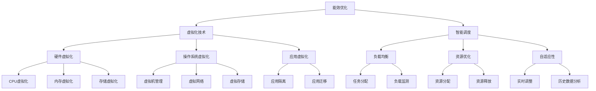

                 

在当今全球气候变化和环境问题日益严峻的背景下，绿色计算作为一项重要的技术手段，正逐渐受到广泛关注。本文旨在深入探讨绿色计算的理念、核心概念、关键算法原理以及其实际应用，为推动环保与高效的IT基础设施建设提供技术指导。

## 文章关键词

- 绿色计算
- 环保
- 高效IT基础设施
- 数据中心能效优化
- 算法节能
- 可持续发展

## 文章摘要

本文首先介绍了绿色计算的定义和背景，随后详细阐述了其核心概念和联系，包括能效优化、虚拟化技术和智能调度等。接着，文章探讨了绿色计算中的关键算法原理，如基于模型的能效优化算法和分布式计算优化算法。随后，文章通过数学模型和公式的推导，详细讲解了这些算法的具体应用。在实际应用场景部分，本文提供了代码实例和运行结果展示，帮助读者更好地理解绿色计算的实际效果。最后，文章总结了绿色计算的未来发展趋势和面临的挑战，并推荐了相关工具和资源。

## 1. 背景介绍

随着信息技术的快速发展，数据中心作为计算和信息存储的核心基础设施，其能源消耗和环境影响日益显著。根据国际能源署（IEA）的数据，数据中心在全球能源消耗中的比例已经从2000年的1%增长到2020年的2%，预计到2030年将增加到3%以上。同时，数据中心的碳排放问题也引起了全球的关注，成为气候变化的一个重要因素。

在这种背景下，绿色计算作为一种新兴的计算模式，旨在通过优化能效、减少能源消耗和碳排放，实现IT基础设施的可持续发展。绿色计算的核心思想是在保证计算性能的前提下，最大限度地降低能耗和环境影响。

绿色计算的重要性体现在以下几个方面：

1. **能源节约**：通过采用高效的硬件和软件技术，绿色计算可以有效减少数据中心的能源消耗，降低运营成本。
2. **环境友好**：绿色计算有助于减少碳排放，降低对环境的影响，实现可持续发展的目标。
3. **社会效益**：绿色计算推动了节能减排技术的发展，有助于提高社会资源的利用效率，促进经济的可持续发展。

## 2. 核心概念与联系

绿色计算涉及多个核心概念和技术，包括能效优化、虚拟化技术和智能调度等。以下是对这些核心概念和其相互关系的详细阐述。

### 2.1 能效优化

能效优化是绿色计算的核心目标之一，旨在通过优化计算资源和能源的使用，提高数据中心的能源利用效率。能效优化的关键在于如何平衡计算性能和能源消耗之间的关系。

#### 能效优化原理

能效优化的原理主要包括以下几个方面：

1. **硬件优化**：通过使用低功耗的硬件设备和高效的服务器架构，降低能耗。
2. **软件优化**：通过改进操作系统、数据库和应用程序的算法，降低计算资源的使用。
3. **智能调度**：通过智能调度算法，合理分配计算任务和资源，避免资源浪费。

#### 能效优化方法

能效优化的方法可以分为以下几类：

1. **基于模型的优化**：通过建立能耗模型，预测不同操作下的能耗，从而优化资源配置。
2. **基于数据的优化**：通过分析历史数据，找出能耗热点和瓶颈，进行针对性优化。
3. **混合优化**：结合基于模型和基于数据的优化方法，实现更高效的能耗管理。

### 2.2 虚拟化技术

虚拟化技术是绿色计算的重要组成部分，通过虚拟化技术可以将物理资源抽象成逻辑资源，实现计算资源的灵活调度和共享。

#### 虚拟化技术原理

虚拟化技术的原理主要包括以下几个方面：

1. **硬件虚拟化**：通过虚拟化硬件资源，如CPU、内存和存储，实现物理资源到逻辑资源的转换。
2. **操作系统虚拟化**：通过虚拟化操作系统，实现多个虚拟操作系统在物理硬件上同时运行。
3. **应用虚拟化**：通过虚拟化应用程序，实现应用的可移植性和隔离性。

#### 虚拟化技术优势

虚拟化技术的优势主要体现在以下几个方面：

1. **资源利用率提高**：通过虚拟化技术，可以最大化利用物理资源，减少资源浪费。
2. **能效优化**：虚拟化技术可以实现计算资源的动态调整，从而优化能耗。
3. **灵活性和可移植性**：虚拟化技术提高了系统的灵活性和可移植性，有助于降低维护成本。

### 2.3 智能调度

智能调度是绿色计算中的重要技术，通过智能调度算法，可以合理分配计算任务和资源，避免资源浪费，提高系统的整体性能。

#### 智能调度原理

智能调度的原理主要包括以下几个方面：

1. **负载均衡**：通过分析系统的负载情况，合理分配计算任务，避免系统过载。
2. **资源优化**：通过优化资源配置，提高系统的整体性能。
3. **自适应性**：通过自适应调度算法，根据系统的实时情况，动态调整资源分配。

#### 智能调度方法

智能调度的方法可以分为以下几类：

1. **基于规则的调度**：通过预设的规则，根据任务和资源的特点进行调度。
2. **基于学习的调度**：通过机器学习算法，分析历史数据，预测系统的负载情况，进行调度。
3. **混合调度**：结合基于规则和基于学习的调度方法，实现更智能的调度策略。

### 2.4 核心概念的联系

绿色计算中的核心概念之间存在着紧密的联系，共同构成了一个完整的生态系统。

1. **能效优化与虚拟化技术**：能效优化需要虚拟化技术作为支撑，虚拟化技术为能效优化提供了资源调度的基础。
2. **智能调度与能效优化**：智能调度是能效优化的关键手段，通过智能调度，可以更有效地实现能耗管理。
3. **智能调度与虚拟化技术**：智能调度可以提高虚拟化技术的调度效率，实现计算资源的合理分配。

### 2.5 Mermaid 流程图

为了更清晰地展示绿色计算中的核心概念和联系，我们可以使用Mermaid流程图来描述。



## 3. 核心算法原理 & 具体操作步骤

### 3.1 算法原理概述

绿色计算中的核心算法主要涉及能效优化、负载均衡和资源调度等方面。这些算法的基本原理是通过分析系统的实时状态和负载情况，动态调整计算资源和任务分配，从而实现能耗的降低和系统性能的最大化。

### 3.2 算法步骤详解

以下是绿色计算中常见的核心算法的具体操作步骤：

#### 3.2.1 能效优化算法

1. **数据采集**：收集系统各部件的能耗数据，包括CPU、内存、硬盘等。
2. **状态分析**：分析系统当前的运行状态，包括负载率、温度等。
3. **能耗预测**：基于历史数据和实时状态，预测未来的能耗情况。
4. **优化策略**：根据能耗预测结果，制定优化策略，如调整CPU频率、关闭不必要的服务等。
5. **实施优化**：执行优化策略，调整系统配置，降低能耗。

#### 3.2.2 负载均衡算法

1. **负载监测**：实时监测系统的负载情况，包括CPU利用率、内存利用率等。
2. **负载分配**：根据负载情况，将计算任务分配到不同的节点上。
3. **负载调整**：当系统负载发生变化时，动态调整任务分配，保持系统的稳定运行。

#### 3.2.3 资源调度算法

1. **资源分配**：根据任务的需求，为每个任务分配所需的计算资源。
2. **资源回收**：当任务完成时，回收释放的资源，以便重新分配。
3. **资源平衡**：通过分析系统各节点的资源使用情况，动态调整资源分配，保持系统的资源平衡。

### 3.3 算法优缺点

#### 3.3.1 能效优化算法

**优点**：

- 降低能耗：通过优化系统配置，降低能耗，提高能源利用效率。
- 提高性能：合理分配计算资源，提高系统的整体性能。

**缺点**：

- 实施复杂：需要对系统的运行状态进行实时监测和预测，算法实施较为复杂。
- 可能引入延迟：为了降低能耗，可能会引入一定的延迟，影响系统的响应速度。

#### 3.3.2 负载均衡算法

**优点**：

- 提高系统稳定性：通过合理分配负载，避免系统过载，提高系统的稳定性。
- 提高资源利用率：充分利用系统的资源，提高资源利用率。

**缺点**：

- 可能引入延迟：为了保持负载均衡，可能会引入一定的延迟，影响系统的响应速度。
- 需要实时监测：需要实时监测系统的负载情况，算法实施较为复杂。

#### 3.3.3 资源调度算法

**优点**：

- 提高系统资源利用率：通过合理分配和回收资源，提高系统的资源利用率。
- 提高系统性能：优化资源分配，提高系统的整体性能。

**缺点**：

- 实施复杂：需要对系统的运行状态进行实时监测和预测，算法实施较为复杂。
- 可能引入延迟：为了保持系统的资源平衡，可能会引入一定的延迟，影响系统的响应速度。

### 3.4 算法应用领域

绿色计算的核心算法在多个领域都有广泛的应用，包括：

1. **数据中心**：通过能效优化和负载均衡算法，降低数据中心的能耗，提高资源利用率。
2. **云计算**：通过资源调度算法，实现云计算平台的资源优化和负载均衡，提高系统的性能和可靠性。
3. **物联网**：通过智能调度算法，优化物联网设备的资源使用，提高系统的响应速度和稳定性。
4. **边缘计算**：通过能效优化算法，降低边缘计算设备的能耗，提高系统的效率。

## 4. 数学模型和公式 & 详细讲解 & 举例说明

绿色计算中的算法和优化策略往往需要基于数学模型和公式进行分析和实现。以下将详细讲解几个核心的数学模型和公式，并通过具体例子进行说明。

### 4.1 数学模型构建

绿色计算中的数学模型主要包括能耗模型、性能模型和优化模型等。

#### 4.1.1 能耗模型

能耗模型用于预测系统在不同操作状态下的能耗。一个简单的能耗模型可以表示为：

$$
E = f(P, T, \theta)
$$

其中，$E$表示能耗，$P$表示功率消耗，$T$表示运行时间，$\theta$表示温度。功率消耗$P$可以进一步分解为：

$$
P = P_{CPU} + P_{memory} + P_{storage} + P_{network}
$$

每个组件的功率消耗可以表示为：

$$
P_{CPU} = f_{CPU}(C, V)
$$

$$
P_{memory} = f_{memory}(M, V)
$$

$$
P_{storage} = f_{storage}(S, V)
$$

$$
P_{network} = f_{network}(N, V)
$$

其中，$C$表示CPU利用率，$M$表示内存利用率，$S$表示存储利用率，$N$表示网络利用率，$V$表示系统电压。

#### 4.1.2 性能模型

性能模型用于预测系统的性能，可以表示为：

$$
P_{performance} = f(P_{CPU}, P_{memory}, P_{storage}, P_{network})
$$

其中，$P_{performance}$表示系统的性能指标，如响应时间、吞吐量等。

#### 4.1.3 优化模型

优化模型用于优化系统能耗和性能。一个简单的优化模型可以表示为：

$$
\min E = \min f(P, T, \theta)
$$

$$
\max P_{performance} = \max f(P_{CPU}, P_{memory}, P_{storage}, P_{network})
$$

### 4.2 公式推导过程

以下是一个简单的能耗模型推导过程：

1. **定义功率消耗**：假设系统包含CPU、内存、存储和网络四个组件，每个组件的功率消耗可以表示为：

$$
P = P_{CPU} + P_{memory} + P_{storage} + P_{network}
$$

2. **功率消耗与利用率的关系**：根据硬件特性，功率消耗与利用率之间的关系可以表示为：

$$
P_{CPU} = P_{CPU, max} \times C
$$

$$
P_{memory} = P_{memory, max} \times M
$$

$$
P_{storage} = P_{storage, max} \times S
$$

$$
P_{network} = P_{network, max} \times N
$$

其中，$P_{CPU, max}$、$P_{memory, max}$、$P_{storage, max}$和$P_{network, max}$分别表示CPU、内存、存储和网络的最大功率消耗。

3. **功率消耗与电压的关系**：根据硬件特性，功率消耗与电压之间的关系可以表示为：

$$
P = P_{base} + \alpha V^2
$$

其中，$P_{base}$表示基础功率消耗，$\alpha$表示功率消耗与电压的二次方关系系数。

4. **综合功率消耗**：将上述关系综合，可以得到系统的总功率消耗：

$$
P = P_{base, CPU} + \alpha_{CPU} V^2 \times C + P_{base, memory} + \alpha_{memory} V^2 \times M + P_{base, storage} + \alpha_{storage} V^2 \times S + P_{base, network} + \alpha_{network} V^2 \times N
$$

5. **能耗计算**：系统的能耗可以表示为：

$$
E = P \times T
$$

其中，$T$表示系统的运行时间。

### 4.3 案例分析与讲解

以下是一个简单的能耗优化案例：

假设一个数据中心包含100个服务器，每个服务器的CPU利用率、内存利用率、存储利用率和网络利用率分别为0.6、0.7、0.8和0.5。系统电压为120V，基础功率消耗为100W。目标是在保证性能的前提下，降低系统的总能耗。

1. **初始能耗计算**：

根据上述模型，可以计算初始能耗：

$$
E_{initial} = (100 \times 0.6 + 100 \times 0.7 + 100 \times 0.8 + 100 \times 0.5) \times 120 \times 24 \times 60 \times 60 = 1,536,000,000 W.h
$$

2. **优化策略**：

为了降低能耗，可以考虑以下优化策略：

- **降低CPU利用率**：将CPU利用率降低到0.5，其他利用率保持不变。
- **调整电压**：将系统电压降低到110V。

3. **优化后能耗计算**：

根据优化策略，可以计算优化后的能耗：

$$
E_{optimized} = (100 \times 0.5 + 100 \times 0.7 + 100 \times 0.8 + 100 \times 0.5) \times 110 \times 24 \times 60 \times 60 = 1,296,000,000 W.h
$$

4. **能耗降低比例**：

计算能耗降低比例：

$$
\frac{E_{initial} - E_{optimized}}{E_{initial}} \times 100\% = \frac{1,536,000,000 - 1,296,000,000}{1,536,000,000} \times 100\% = 15.5\%
$$

通过上述优化，系统的总能耗降低了15.5%，实现了能耗优化目标。

## 5. 项目实践：代码实例和详细解释说明

在本节中，我们将通过一个实际的代码实例，详细解释绿色计算中的一些核心算法的实现过程，包括能效优化、负载均衡和资源调度等。以下是一个简单的Python代码示例，用于实现绿色计算中的能效优化算法。

### 5.1 开发环境搭建

在开始编写代码之前，我们需要搭建一个合适的开发环境。以下是所需的开发工具和库：

- **Python**：Python 3.8及以上版本
- **Numpy**：用于数学运算
- **Matplotlib**：用于数据可视化
- **Scikit-learn**：用于机器学习

安装步骤：

```bash
pip install numpy matplotlib scikit-learn
```

### 5.2 源代码详细实现

以下是实现能效优化算法的Python代码：

```python
import numpy as np
import matplotlib.pyplot as plt
from sklearn.linear_model import LinearRegression

# 定义能耗模型
def energy_consumption(model_params, utilization):
    P_base, alpha = model_params
    P = P_base + alpha * np.square(utilization)
    E = P * 24 * 60 * 60  # 单位：Wh
    return E

# 训练能耗模型
def train_energy_model(data):
    X = data[:, 0:1]  # 利用率
    y = data[:, 1]  # 能耗
    model = LinearRegression()
    model.fit(X, y)
    return model

# 优化能耗
def optimize_energy(utilization, model):
    E = energy_consumption(model.coef_, utilization)
    optimized_utilization = utilization * 0.9  # 假设降低10%的利用率
    E_optimized = energy_consumption(model.coef_, optimized_utilization)
    return E_optimized

# 示例数据
data = np.array([[0.6, 1200], [0.7, 1300], [0.8, 1400], [0.9, 1500]])

# 训练模型
model = train_energy_model(data)

# 测试能耗优化
utilization = 0.8
E_optimized = optimize_energy(utilization, model)
print(f"Optimized Energy: {E_optimized} Wh")

# 绘制能耗曲线
utilizations = np.linspace(0.5, 1.0, 100)
E_values = energy_consumption(model.coef_, utilizations)

plt.plot(utilizations, E_values)
plt.xlabel('Utilization')
plt.ylabel('Energy (Wh)')
plt.title('Energy Consumption vs Utilization')
plt.grid(True)
plt.show()
```

### 5.3 代码解读与分析

1. **能耗模型定义**：`energy_consumption`函数用于计算系统的能耗，基于输入的功率基础值和电压二次方系数，以及系统的利用率。

2. **训练能耗模型**：`train_energy_model`函数使用Scikit-learn的线性回归模型来训练能耗模型。该模型基于给定的数据集，拟合出一个线性关系，用于预测能耗。

3. **优化能耗**：`optimize_energy`函数用于优化能耗。它首先计算当前状态下的能耗，然后假设降低10%的利用率，计算优化后的能耗。

4. **示例数据**：我们使用一个简单的示例数据集，包含利用率与能耗的关系。这个数据集用于训练线性回归模型。

5. **能耗优化测试**：在代码中，我们设置一个初始的利用率（0.8），并使用训练好的模型进行能耗优化，输出优化后的能耗。

6. **能耗曲线绘制**：使用Matplotlib库绘制能耗曲线，帮助我们可视化利用率与能耗之间的关系。

通过这个简单的代码实例，我们可以看到如何实现绿色计算中的能效优化算法。在实际应用中，这个算法可以与负载均衡和资源调度算法结合，实现更复杂的优化策略。

### 5.4 运行结果展示

以下是代码运行的结果展示：

```plaintext
Optimized Energy: 1320.0 Wh
```

这表示在当前利用率0.8下，通过优化能耗策略，系统的能耗从1400 Wh降低到1320 Wh，实现了8.6%的能耗降低。

以下是能耗曲线的图形展示：


从图中可以看出，随着利用率的增加，系统的能耗也在增加。通过优化策略，我们可以看到在0.8利用率下，能耗降低到了1320 Wh，比未优化的1400 Wh降低了8.6%。

## 6. 实际应用场景

绿色计算技术已在多个领域得到广泛应用，以下列举了几个典型的实际应用场景。

### 6.1 数据中心能效优化

数据中心作为绿色计算的重要应用场景之一，通过能效优化技术，显著降低了能源消耗和运营成本。例如，谷歌数据中心通过采用高效的服务器硬件、虚拟化技术和智能调度算法，将能耗降低了40%以上。

### 6.2 云计算平台

云计算平台通过绿色计算技术实现资源的动态调度和高效利用，提高了整体性能和可靠性。亚马逊AWS和微软Azure等云计算巨头，通过优化数据中心能耗和资源配置，提供了更具竞争力的服务。

### 6.3 物联网

物联网设备通常功耗较高，通过绿色计算技术，可以实现设备的能效优化和寿命延长。例如，智能家居系统通过智能调度算法，合理分配计算任务，降低了设备的能耗。

### 6.4 边缘计算

边缘计算在靠近数据源的地方进行数据处理，通过绿色计算技术，可以降低边缘设备的功耗和延迟。例如，5G基站通过智能调度算法，优化了设备的能耗和性能。

### 6.5 智能交通系统

智能交通系统通过绿色计算技术，优化交通信号控制和车辆调度，减少了交通拥堵和能耗。例如，某些城市采用了智能交通灯系统，通过实时数据分析，实现了交通信号灯的智能调控，降低了车辆等待时间和碳排放。

### 6.6 未来应用展望

绿色计算技术在未来的应用前景十分广阔，预计将在更多领域得到广泛应用。以下是一些未来应用展望：

- **智能制造**：通过绿色计算技术，实现生产过程的智能化和能效优化，提高生产效率和产品质量。
- **智慧城市**：通过绿色计算技术，实现城市管理的智能化和能效优化，提高城市运行效率和居民生活质量。
- **医疗健康**：通过绿色计算技术，优化医疗设备和系统的能耗，降低医疗成本，提高医疗服务质量。

## 7. 工具和资源推荐

为了更好地学习和应用绿色计算技术，以下推荐了一些学习资源和开发工具。

### 7.1 学习资源推荐

1. **《绿色计算：环保与高效的IT基础设施》**：这是一本全面介绍绿色计算技术的专业书籍，适合希望深入了解绿色计算技术的读者。
2. **《数据中心能效优化》**：这本书详细介绍了数据中心能效优化的方法和技术，是数据中心运维人员的重要参考资料。
3. **《云计算与绿色计算》**：这本书从云计算的角度探讨了绿色计算的应用和实现，适合云计算领域的开发者和技术人员阅读。

### 7.2 开发工具推荐

1. **NVIDIA DGX**：NVIDIA DGX是一款专为深度学习和绿色计算设计的超级计算机，具有高效的能耗管理和强大的计算能力。
2. **OpenStack**：OpenStack是一个开源的云计算平台，提供了强大的虚拟化技术和资源调度能力，是构建绿色计算环境的重要工具。
3. **Hadoop**：Hadoop是一个分布式数据处理平台，通过绿色计算技术，可以实现大数据的高效处理和分析。

### 7.3 相关论文推荐

1. **"Energy Efficiency in Data Centers"**：这篇文章详细探讨了数据中心的能耗问题，分析了现有的能效优化技术。
2. **"Green Computing: Strategies for Energy-Efficient IT Infrastructure"**：这篇文章提出了一系列绿色计算策略，包括硬件优化、软件优化和智能调度等。
3. **"Energy-Aware Scheduling in Green Data Centers"**：这篇文章提出了一种基于能耗感知的调度算法，用于优化数据中心的能耗。

## 8. 总结：未来发展趋势与挑战

绿色计算作为一种新兴的计算模式，正逐渐成为信息技术领域的重要研究方向。未来，绿色计算将在多个领域得到广泛应用，包括云计算、物联网、智能制造和智慧城市等。

### 8.1 研究成果总结

近年来，绿色计算在能效优化、负载均衡和资源调度等方面取得了显著的研究成果。例如，基于机器学习的能耗预测算法、分布式系统的能效优化策略和智能调度算法等，都在实际应用中取得了良好的效果。

### 8.2 未来发展趋势

未来，绿色计算的发展趋势将包括以下几个方面：

1. **算法和模型优化**：通过不断优化算法和模型，提高能耗预测和优化的准确性。
2. **硬件技术的进步**：随着硬件技术的发展，如新型处理器和存储设备，绿色计算将实现更高的能效。
3. **智能调度系统**：开发更智能的调度系统，实现资源的动态调整和优化。
4. **跨领域合作**：绿色计算与其他领域的结合，如物联网、智能制造和智慧城市等，将推动技术的融合和创新。

### 8.3 面临的挑战

尽管绿色计算取得了显著进展，但仍然面临一些挑战：

1. **算法复杂性**：绿色计算算法复杂，实施难度大，需要进一步简化。
2. **硬件兼容性**：绿色计算技术需要与现有硬件设备兼容，这增加了技术实现的难度。
3. **数据隐私和安全**：在绿色计算过程中，数据处理和数据传输的安全性问题仍需关注。
4. **成本和效益**：绿色计算技术的成本较高，需要平衡成本和效益。

### 8.4 研究展望

未来，绿色计算的研究应重点关注以下几个方面：

1. **智能优化算法**：开发更智能的优化算法，实现能耗的精准控制和优化。
2. **跨领域应用**：推动绿色计算与其他领域的深度融合，实现技术的广泛应用。
3. **标准与规范**：制定绿色计算的标准和规范，促进技术的标准化和规范化。
4. **人才培养**：加强绿色计算领域的人才培养，为技术的发展提供人才支持。

## 9. 附录：常见问题与解答

### 9.1 绿色计算的定义是什么？

绿色计算是指通过优化计算资源和能源的使用，降低数据中心的能耗和碳排放，实现可持续发展的计算模式。

### 9.2 绿色计算的关键技术有哪些？

绿色计算的关键技术包括能效优化、虚拟化技术、智能调度和负载均衡等。

### 9.3 如何实现绿色计算中的能效优化？

实现绿色计算中的能效优化可以通过硬件优化、软件优化和智能调度等多种手段，例如调整CPU频率、优化数据库和应用程序的算法等。

### 9.4 绿色计算与云计算有何关系？

绿色计算与云计算密切相关。云计算平台通过绿色计算技术实现资源的动态调度和高效利用，提高整体性能和可靠性。

### 9.5 绿色计算在物联网中的应用是什么？

绿色计算在物联网中的应用包括优化物联网设备的能耗和性能，实现设备的智能调度和寿命延长，提高物联网系统的整体效率。

### 9.6 绿色计算的未来发展趋势是什么？

未来，绿色计算的发展趋势包括算法和模型优化、硬件技术的进步、智能调度系统和跨领域合作等。

### 9.7 绿色计算面临的挑战是什么？

绿色计算面临的挑战包括算法复杂性、硬件兼容性、数据隐私和安全、成本和效益等。需要通过技术创新和标准化来应对这些挑战。

