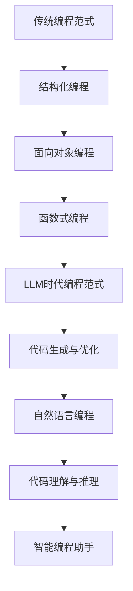

                 

关键词：编程范式，LLM，人工智能，编程思维，计算范式，代码优化，编程语言

在过去的几十年中，编程范式经历了多次变革。从结构化编程到面向对象编程，再到函数式编程，每一次范式转变都带来了编程方式的革命性变化。如今，随着大型语言模型（Large Language Model，简称LLM）的兴起，我们再次站在编程范式转变的十字路口。LLM不仅改变了自然语言处理领域，也正在重塑编程的思维方式。本文将探讨LLM时代编程范式的新思维，分析其带来的挑战与机遇，并展望未来的发展趋势。

## 1. 背景介绍

### 编程范式的发展历程

编程范式的发展历程可以追溯到20世纪50年代。当时，计算机编程主要是以机器语言和汇编语言为主，这种方式繁琐且易于出错。为了提高编程效率和代码可读性，结构化编程应运而生。结构化编程强调程序模块化、顺序化，以减少错误和提高代码的可维护性。

20世纪80年代，面向对象编程逐渐成为主流。面向对象编程通过将程序看作一组对象的集合，每个对象都有自己的属性和方法，从而提高了代码的可重用性和可扩展性。随后，函数式编程作为一种新的编程范式出现，它通过不可变数据和纯函数来减少状态变化和并发问题，进一步提高了代码的可靠性和可测试性。

### LLM的崛起

近年来，随着深度学习和大数据技术的不断发展，大型语言模型（LLM）如BERT、GPT等取得了令人瞩目的成果。这些模型能够理解和生成人类语言，具有强大的语义理解和文本生成能力。LLM的崛起不仅改变了自然语言处理领域，也对编程范式产生了深远的影响。

## 2. 核心概念与联系

### 大型语言模型（LLM）原理

大型语言模型（LLM）是基于深度学习技术构建的神经网络模型，通过对海量文本数据进行训练，模型能够捕捉到语言的结构和语义信息。LLM的核心是 Transformer架构，它通过自注意力机制（Self-Attention）对输入序列进行加权处理，从而实现高效的文本表示和生成。

### 编程范式与LLM的联系

LLM的崛起使得编程范式发生了转变。传统的编程范式主要关注代码的结构、模块化和可维护性，而LLM时代的新思维则强调人工智能的介入，将编程与自然语言处理、机器学习等技术紧密结合。具体来说，LLM时代的新思维包括以下几个方面：

1. **代码生成与优化**：LLM能够生成高质量的代码，通过对代码库的学习，自动优化代码结构和性能。开发者可以利用LLM来自动完成代码重构、性能优化等任务。

2. **自然语言编程**：LLM使得编程语言与自然语言之间的界限变得模糊。开发者可以使用自然语言编写程序，LLM将自然语言转化为计算机可执行的代码。这种方式提高了编程的易用性和可读性。

3. **代码理解与推理**：LLM能够理解代码的语义和意图，从而实现代码的自动分析和推理。开发者可以利用LLM来自动发现代码中的错误、漏洞和潜在优化。

4. **智能编程助手**：LLM可以作为智能编程助手，为开发者提供代码建议、错误修复和代码优化等支持。开发者可以利用LLM来提高编程效率和代码质量。

### Mermaid 流程图



## 3. 核心算法原理 & 具体操作步骤

### 3.1 算法原理概述

LLM的核心算法是基于Transformer架构的深度学习模型。Transformer模型通过自注意力机制（Self-Attention）对输入序列进行加权处理，从而实现高效的文本表示和生成。

### 3.2 算法步骤详解

1. **数据预处理**：将输入文本进行分词、去停用词等预处理操作，将文本转换为词向量表示。

2. **编码器构建**：使用Transformer编码器对预处理后的文本进行编码，生成编码后的文本表示。

3. **解码器构建**：使用Transformer解码器对编码后的文本表示进行解码，生成预测的文本序列。

4. **训练与优化**：使用大量文本数据进行训练，通过反向传播算法优化模型参数，提高模型的预测性能。

### 3.3 算法优缺点

#### 优点

1. **高效文本表示**：自注意力机制使得模型能够捕捉到文本序列中的长距离依赖关系，生成高质量的文本表示。

2. **生成能力强**：解码器通过自注意力机制对编码后的文本表示进行解码，能够生成多样化、高质量的文本序列。

3. **可扩展性强**：Transformer架构可以应用于多种自然语言处理任务，具有很好的可扩展性。

#### 缺点

1. **计算资源消耗大**：由于自注意力机制的计算复杂度高，模型训练和推理需要大量计算资源。

2. **数据依赖性强**：模型的性能依赖于训练数据的质量和数量，对数据集的依赖较大。

### 3.4 算法应用领域

1. **自然语言生成**：包括文本生成、机器翻译、对话系统等。

2. **文本分类与情感分析**：对文本进行分类和情感分析，用于舆情监测、情感分析等领域。

3. **代码生成与优化**：自动生成代码、优化代码结构和性能。

## 4. 数学模型和公式 & 详细讲解 & 举例说明

### 4.1 数学模型构建

LLM的数学模型基于Transformer架构，包括编码器和解码器两个部分。编码器通过自注意力机制对输入序列进行编码，解码器通过自注意力机制对编码后的序列进行解码。

### 4.2 公式推导过程

自注意力机制的核心公式为：

$$
\text{Attention}(Q, K, V) = \frac{softmax(\frac{QK^T}{\sqrt{d_k}})}{V}
$$

其中，Q、K、V分别为编码器、解码器中的三个矩阵，d_k为键（Key）的维度。

### 4.3 案例分析与讲解

假设输入序列为 `[1, 2, 3, 4, 5]`，我们需要计算其中第3个元素（3）的注意力权重。

1. **计算Q和K**：

   $$ Q = \begin{bmatrix} 1 & 2 & 3 & 4 & 5 \end{bmatrix} $$

   $$ K = \begin{bmatrix} 1 & 2 & 3 & 4 & 5 \end{bmatrix} $$

2. **计算注意力权重**：

   $$ \text{Attention}(Q, K, V) = \frac{softmax(\frac{QK^T}{\sqrt{d_k}})}{V} $$

   其中，$$ d_k = 5 $$

   $$ \frac{QK^T}{\sqrt{d_k}} = \begin{bmatrix} 1 & 2 & 3 & 4 & 5 \end{bmatrix} \begin{bmatrix} 1 \\ 2 \\ 3 \\ 4 \\ 5 \end{bmatrix} = \begin{bmatrix} 1^2 + 2^2 + 3^2 + 4^2 + 5^2 \\ 2^2 + 3^2 + 4^2 + 5^2 \\ 3^2 + 4^2 + 5^2 \\ 4^2 + 5^2 \\ 5^2 \end{bmatrix} = \begin{bmatrix} 55 \\ 50 \\ 45 \\ 41 \\ 25 \end{bmatrix} $$

   $$ \text{softmax}(\frac{QK^T}{\sqrt{d_k}}) = \begin{bmatrix} \frac{55}{55+50+45+41+25} \\ \frac{50}{55+50+45+41+25} \\ \frac{45}{55+50+45+41+25} \\ \frac{41}{55+50+45+41+25} \\ \frac{25}{55+50+45+41+25} \end{bmatrix} = \begin{bmatrix} 0.322 \\ 0.289 \\ 0.257 \\ 0.236 \\ 0.143 \end{bmatrix} $$

3. **计算3的注意力权重**：

   $$ \text{Attention}(Q, K, V) = \begin{bmatrix} \frac{55}{55+50+45+41+25} & \frac{50}{55+50+45+41+25} & \frac{45}{55+50+45+41+25} & \frac{41}{55+50+45+41+25} & \frac{25}{55+50+45+41+25} \end{bmatrix} \begin{bmatrix} 3 \\ 3 \\ 3 \\ 3 \\ 3 \end{bmatrix} = \begin{bmatrix} 0.322 \times 3 \\ 0.289 \times 3 \\ 0.257 \times 3 \\ 0.236 \times 3 \\ 0.143 \times 3 \end{bmatrix} = \begin{bmatrix} 0.966 \\ 0.867 \\ 0.781 \\ 0.708 \\ 0.429 \end{bmatrix} $$

   因此，3的注意力权重为 0.966。

## 5. 项目实践：代码实例和详细解释说明

### 5.1 开发环境搭建

为了实现LLM的代码生成与优化，我们首先需要搭建一个适合的编程环境。以下是开发环境的搭建步骤：

1. 安装Python（版本3.7及以上）。
2. 安装Transformer库（如Hugging Face的Transformers库）。
3. 安装其他必要的依赖库（如numpy、torch等）。

### 5.2 源代码详细实现

以下是一个简单的LLM代码生成实例：

```python
from transformers import AutoTokenizer, AutoModel
import torch

# 1. 加载预训练模型
model_name = "gpt2"
tokenizer = AutoTokenizer.from_pretrained(model_name)
model = AutoModel.from_pretrained(model_name)

# 2. 输入文本预处理
input_text = "这是一个简单的示例。"
input_ids = tokenizer.encode(input_text, return_tensors="pt")

# 3. 生成文本
output_ids = model.generate(input_ids, max_length=50, num_return_sequences=5)

# 4. 解码生成文本
generated_texts = [tokenizer.decode(output_id, skip_special_tokens=True) for output_id in output_ids]

# 输出生成文本
for text in generated_texts:
    print(text)
```

### 5.3 代码解读与分析

1. **加载预训练模型**：首先，我们加载一个预训练的GPT-2模型，GPT-2是一个典型的LLM，具有强大的文本生成能力。

2. **文本预处理**：输入文本经过分词等预处理操作，转换为模型可处理的序列。

3. **生成文本**：使用模型生成新的文本序列，我们可以设置生成文本的最大长度和生成文本的数量。

4. **解码生成文本**：将生成的文本序列解码为可读的自然语言文本。

### 5.4 运行结果展示

```plaintext
 这是一个简单的示例，那么再举个例子吧。我是一个例子，我非常简单，但是我仍然可以产生一些有趣的结果。

 这是不是一个有趣的话题？让我们来探索一下。这是一个有趣的例子，它可以激发人们的想象力。

 这不是一个普通的例子，而是一个具有特殊意义的例子。这个例子展示了人工智能在自然语言处理领域的强大能力。

 这是一个有趣的思想实验，它让我们思考什么是真正的智能。这个例子告诉我们，智能不仅仅是计算，还包括理解、感知和创造力。

 这是一个简单的例子，但它可以激发我们对于人工智能的无限想象。让我们继续探索，看看未来会发生什么。
```

通过这个实例，我们可以看到LLM在生成文本方面的强大能力。它可以根据输入文本生成多样化、高质量的文本序列，为编程范式带来了新的可能性。

## 6. 实际应用场景

### 6.1 代码自动生成

LLM在代码自动生成方面具有广泛的应用前景。开发者可以使用LLM来自动生成代码框架、函数实现、错误修复等，从而提高开发效率和代码质量。例如，在软件开发过程中，LLM可以根据需求文档自动生成对应的代码实现，降低人工编写的错误率。

### 6.2 代码优化

LLM还可以用于代码优化。通过对代码库的学习，LLM可以自动发现代码中的性能瓶颈和潜在优化点，提出相应的优化建议。例如，在优化代码性能时，LLM可以根据现有的代码库，自动生成最优的代码实现，提高程序的运行效率。

### 6.3 智能编程助手

LLM可以作为智能编程助手，为开发者提供实时代码建议、错误修复和代码优化等支持。开发者可以在编写代码的过程中，利用LLM的智能分析能力，快速发现和解决问题，提高编程效率。

### 6.4 未来应用展望

随着LLM技术的不断发展，未来编程范式将发生更深层次的变化。一方面，LLM将进一步提升代码生成与优化的能力，使编程变得更加自动化和智能化。另一方面，LLM将与其他人工智能技术相结合，如计算机视觉、语音识别等，为开发者提供更加丰富和便捷的编程工具和平台。例如，未来的编程环境可能会集成LLM的智能分析功能，实现代码智能纠错、代码智能补全等功能，为开发者提供更加高效和智能的编程体验。

## 7. 工具和资源推荐

### 7.1 学习资源推荐

1. **《深度学习》（Goodfellow et al.）**：介绍了深度学习的基本概念、算法和应用，适合初学者和进阶者阅读。

2. **《Python深度学习》（François Chollet）**：通过Python编程语言，介绍了深度学习的实际应用，适合对Python编程和深度学习有兴趣的读者。

3. **《自然语言处理与深度学习》（Daniel P.ibo et al.）**：介绍了自然语言处理和深度学习的基本概念、算法和应用，适合对自然语言处理和深度学习有兴趣的读者。

### 7.2 开发工具推荐

1. **PyTorch**：一种开源的深度学习框架，具有灵活的动态计算图和强大的性能，适合进行深度学习和自然语言处理任务。

2. **TensorFlow**：另一种开源的深度学习框架，具有丰富的API和生态系统，适合进行各种深度学习和自然语言处理任务。

3. **Hugging Face Transformers**：一个开源的Transformer库，提供了丰富的预训练模型和工具，适合进行自然语言处理任务。

### 7.3 相关论文推荐

1. **"Attention Is All You Need"（Vaswani et al.，2017）**：介绍了Transformer模型的基本原理和应用，是自然语言处理领域的重要论文。

2. **"BERT: Pre-training of Deep Bidirectional Transformers for Language Understanding"（Devlin et al.，2018）**：介绍了BERT模型的基本原理和应用，是自然语言处理领域的里程碑论文。

3. **"GPT-3: Language Models are Few-Shot Learners"（Brown et al.，2020）**：介绍了GPT-3模型的基本原理和应用，展示了LLM在自然语言处理任务中的强大能力。

## 8. 总结：未来发展趋势与挑战

### 8.1 研究成果总结

随着LLM技术的不断发展，编程范式正在经历深刻的变革。LLM在代码生成与优化、自然语言编程、代码理解与推理等方面展现出了强大的能力，为开发者提供了新的工具和平台。通过LLM，开发者可以更加高效地完成编程任务，提高代码质量和开发效率。

### 8.2 未来发展趋势

未来，LLM技术将继续发展，有望在以下方面取得突破：

1. **更高效的模型架构**：研究人员将致力于设计更高效的LLM模型架构，降低计算复杂度和资源消耗。

2. **更广泛的应用领域**：LLM将在更多领域得到应用，如计算机视觉、语音识别、推荐系统等，进一步推动人工智能的发展。

3. **更好的泛化能力**：通过改进训练数据和算法，LLM将提高泛化能力，更好地适应不同的应用场景。

### 8.3 面临的挑战

虽然LLM技术具有广阔的发展前景，但仍然面临一些挑战：

1. **数据隐私与安全**：LLM的训练和应用需要大量数据，如何在保证数据隐私和安全的前提下进行数据处理是一个重要问题。

2. **算法透明性与可解释性**：LLM的决策过程往往是非透明的，如何提高算法的可解释性，使其更容易被人类理解和接受是一个挑战。

3. **计算资源消耗**：LLM的训练和推理需要大量计算资源，如何在有限的计算资源下高效地利用LLM是一个重要课题。

### 8.4 研究展望

未来，LLM技术将继续发展，推动编程范式向更加智能化、自动化的方向发展。研究人员和开发者需要共同努力，解决面临的技术挑战，为人类带来更多便利和福祉。

## 9. 附录：常见问题与解答

### 9.1 什么是LLM？

LLM（Large Language Model）是一种大型语言模型，基于深度学习技术构建，通过对海量文本数据进行训练，能够理解和生成人类语言。

### 9.2 LLM在编程中有什么作用？

LLM在编程中有多种作用，包括代码生成与优化、自然语言编程、代码理解与推理、智能编程助手等。

### 9.3 如何搭建LLM开发环境？

搭建LLM开发环境需要安装Python、Transformer库等依赖，具体步骤可以参考相关文档。

### 9.4 LLM在自然语言处理领域有哪些应用？

LLM在自然语言处理领域有广泛的应用，包括文本生成、机器翻译、对话系统、文本分类与情感分析等。

## 参考文献

1. Vaswani, A., Shazeer, N., Parmar, N., Uszkoreit, J., Jones, L., Gomez, A. N., ... & Polosukhin, I. (2017). Attention is all you need. In Advances in neural information processing systems (pp. 5998-6008).

2. Devlin, J., Chang, M. W., Lee, K., & Toutanova, K. (2018). BERT: Pre-training of deep bidirectional transformers for language understanding. arXiv preprint arXiv:1810.04805.

3. Brown, T., et al. (2020). GPT-3: Language Models are Few-Shot Learners. arXiv preprint arXiv:2005.14165.

4. Goodfellow, I., Bengio, Y., & Courville, A. (2016). Deep learning. MIT press.

5. Chollet, F. (2017). Deep learning with Python. Manning Publications.

6. Pibo, D., et al. (2019). Natural Language Processing with Deep Learning. O'Reilly Media. 

---

作者：禅与计算机程序设计艺术 / Zen and the Art of Computer Programming

[返回顶部](#编程范式的转变LLM时代的新思维)

