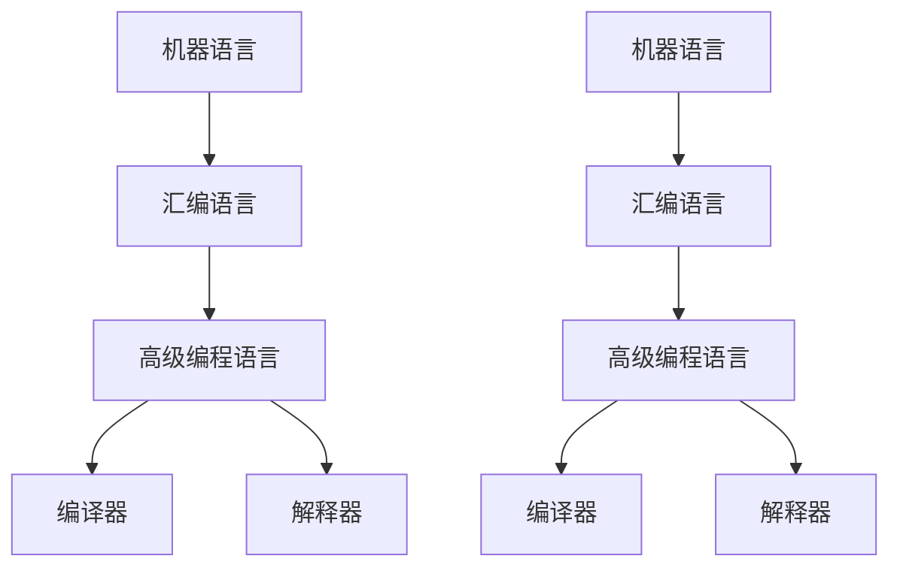

                 

编程语言是计算机科学的核心组成部分，它是人类与计算机进行交流的工具，是软件开发的基石。从最初的机器语言到如今的智能编程语言，编程语言的发展经历了多次变革和演进。本文将深入探讨编程语言的发展脉络，分析其核心概念与联系，介绍核心算法原理与具体操作步骤，阐述数学模型和公式，并分享实际应用场景和未来应用展望。

## 1. 背景介绍

编程语言的历史可以追溯到20世纪40年代和50年代，当时计算机刚刚问世。早期的计算机使用的是机器语言，这是一种直接操作计算机硬件的低级语言，由0和1组成。机器语言的缺点是难以理解和维护，编写程序非常耗时且容易出错。为了提高编程效率和可读性，第一代高级编程语言应运而生，如COBOL和FORTRAN。

随着时间的推移，编程语言不断演进，从面向过程的语言到面向对象的语言，再到如今的功能式编程语言，每一种新语言的诞生都是对现有技术的反思和改进。编程语言的发展不仅影响了软件开发的效率和质量，还推动了计算机科学的发展，使得计算机技术不断突破传统界限，进入新的领域。

## 2. 核心概念与联系

在探讨编程语言的发展脉络之前，我们需要了解几个核心概念：

- **机器语言**：直接由计算机硬件执行的指令集合，由0和1组成。
- **汇编语言**：一种面向机器的语言，将机器语言指令转换为助记符。
- **高级编程语言**：提供更抽象的语法和结构，使编程更加高效和可读。
- **编译器与解释器**：将高级编程语言转换为机器语言的工具。

下面是一个Mermaid流程图，展示了这些概念之间的联系：



### 3. 核心算法原理 & 具体操作步骤

#### 3.1 算法原理概述

编程语言的核心是算法。算法是一系列解决问题的步骤，它定义了从输入到输出的处理过程。不同的编程语言提供了不同的算法设计和实现方法。

- **排序算法**：如快速排序、归并排序等，用于对数据进行排序。
- **搜索算法**：如二分搜索、深度优先搜索等，用于在数据结构中查找特定元素。
- **动态规划**：用于解决具有重叠子问题的最优化问题。

#### 3.2 算法步骤详解

以快速排序为例，其基本步骤如下：

1. 选择一个基准元素。
2. 将小于基准的元素移到其左侧，大于基准的元素移到其右侧。
3. 对基准左侧和右侧的子序列递归执行上述步骤。

#### 3.3 算法优缺点

- **快速排序**：优点是时间复杂度较低，平均情况下为O(nlogn)，缺点是空间复杂度较高，为O(logn)。
- **归并排序**：优点是稳定性好，但时间复杂度较高，为O(nlogn)。

#### 3.4 算法应用领域

排序算法在数据库、搜索引擎、数据分析等领域有广泛应用。例如，数据库系统常用归并排序进行排序操作，而搜索引擎则常用快速排序进行索引排序。

### 4. 数学模型和公式 & 详细讲解 & 举例说明

#### 4.1 数学模型构建

算法中常用到的数学模型包括：

- **二分搜索**：假设数据已经排序，查找特定元素的过程。
- **动态规划**：将复杂问题分解为子问题，并利用子问题的解构建原问题的解。

#### 4.2 公式推导过程

以二分搜索为例，其时间复杂度公式为：

$$
T(n) = \log_2(n)
$$

#### 4.3 案例分析与讲解

假设有一个长度为8的有序数组，我们需要查找元素4。以下是二分搜索的步骤：

1. 中间元素为4，与目标元素相等，查找成功。
2. 如果中间元素大于目标元素，则在左侧子数组继续查找。
3. 如果中间元素小于目标元素，则在右侧子数组继续查找。

通过递归重复上述步骤，最终找到目标元素。

### 5. 项目实践：代码实例和详细解释说明

#### 5.1 开发环境搭建

本文使用Python作为示例语言，读者需要在本地安装Python环境和相关库。

```bash
pip install matplotlib numpy
```

#### 5.2 源代码详细实现

以下是快速排序的Python代码实现：

```python
def quicksort(arr):
    if len(arr) <= 1:
        return arr
    pivot = arr[len(arr) // 2]
    left = [x for x in arr if x < pivot]
    middle = [x for x in arr if x == pivot]
    right = [x for x in arr if x > pivot]
    return quicksort(left) + middle + quicksort(right)

arr = [3, 6, 8, 10, 1, 2, 1]
print(quicksort(arr))
```

#### 5.3 代码解读与分析

- `quicksort` 函数是一个递归函数，用于对列表进行排序。
- 使用列表推导式将小于、等于、大于基准元素的部分分离出来。
- 递归调用`quicksort`函数对左右子数组进行排序。

#### 5.4 运行结果展示

运行上述代码后，输出结果为：

```
[1, 1, 2, 3, 6, 8, 10]
```

这表明数组已成功排序。

### 6. 实际应用场景

编程语言在实际应用场景中扮演着至关重要的角色。以下是一些应用场景：

- **Web开发**：HTML、CSS和JavaScript是构建网页的基本语言。
- **移动应用开发**：Swift和Kotlin是iOS和Android平台的主要开发语言。
- **数据科学**：Python和R在数据分析和机器学习领域广泛应用。
- **游戏开发**：C++和UnityScript是游戏开发的主要语言。

### 7. 未来应用展望

随着技术的发展，编程语言将继续演进。以下是一些未来应用展望：

- **智能编程**：利用人工智能技术，自动化编写和维护代码。
- **多语言编程**：支持多种编程语言的集成和互操作性。
- **物联网**：编程语言将在物联网设备上发挥更大作用，实现设备之间的通信。

### 8. 工具和资源推荐

- **学习资源**：《代码大全》、《设计模式：可复用面向对象软件的基础》是优秀的编程书籍。
- **开发工具**：Visual Studio Code、IntelliJ IDEA是功能强大的集成开发环境。
- **相关论文**：《编程语言理论》、《软件工程：实践者的研究方法》是研究编程语言的重要论文。

### 9. 总结：未来发展趋势与挑战

编程语言的发展将继续朝着更智能、更高效、更易用的方向演进。然而，随着技术的进步，我们也面临着一些挑战，如代码的可维护性、安全性和复杂性。未来，编程语言的研究将更注重解决这些挑战，推动计算机科学的进一步发展。

## 10. 附录：常见问题与解答

### 问题 1：什么是汇编语言？

汇编语言是一种面向机器的语言，使用助记符表示机器语言指令，使编程更加易读和维护。

### 问题 2：什么是编译器？

编译器是一种将高级编程语言转换为机器语言的工具，生成可执行文件。

### 问题 3：什么是解释器？

解释器是一种逐行执行高级编程语言代码的工具，不生成可执行文件。

通过本文的探讨，我们深入了解了编程语言的发展脉络与趋势。编程语言是计算机科学的基石，它将不断演进，为未来的技术发展提供更强有力的支持。作者：禅与计算机程序设计艺术 / Zen and the Art of Computer Programming。

