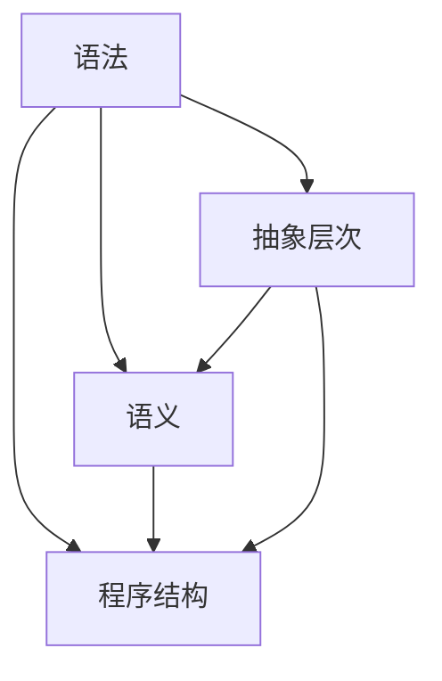

                 

关键词：编程语言，语法，语义，设计原则，抽象层次，程序结构，语法分析，类型系统，动态绑定，静态绑定，面向对象，函数式编程，程序优化，可维护性，可扩展性，编程范式。

## 摘要

本文将深入探讨编程语言设计的核心要素——语法和语义。通过介绍编程语言设计的基本原则和关键概念，我们将分析不同编程范式的语法和语义特点，并讨论如何平衡语法简洁性与语义表达能力。此外，本文还将探讨编程语言的抽象层次、程序结构，以及类型系统和动态/静态绑定的作用。最后，我们将展望编程语言设计的未来发展趋势，以及面临的挑战和解决方案。

## 1. 背景介绍

编程语言是人与计算机之间沟通的桥梁。从最初的机器语言到现代的高级编程语言，编程语言的演化经历了多个阶段。早期编程语言如汇编语言和机器语言，虽然直接与硬件操作相关，但难以编写和调试。随着计算机科学的发展，编程语言逐渐走向抽象，使得程序员可以更高效地开发软件。

### 编程语言的发展历程

1. **机器语言**：最早的编程语言，由二进制代码组成，直接控制计算机硬件。
2. **汇编语言**：引入了符号和操作码，但仍然依赖于特定硬件架构。
3. **高级编程语言**：如FORTRAN、COBOL、Pascal等，提供更抽象的语法和语义，提高了编程效率。
4. **面向对象编程**：引入了类和对象的概念，使得编程更加模块化和可重用。
5. **函数式编程**：以函数为核心，强调纯函数和不可变性，减少了状态和副作用。
6. **动态编程**：如Python、JavaScript等，提供了更加灵活的动态类型系统和动态绑定机制。

### 编程语言设计的重要性

编程语言设计直接影响到程序的易读性、可维护性和可扩展性。一个好的编程语言应该具备以下特点：

- **简洁性**：语法简单易懂，减少冗余代码。
- **表达能力**：提供丰富的语法和语义特性，支持复杂的编程任务。
- **可维护性**：易于阅读和理解，便于后续开发和维护。
- **可扩展性**：支持模块化开发，易于扩展和集成新功能。

## 2. 核心概念与联系

在深入探讨编程语言设计之前，我们需要了解一些核心概念和它们之间的联系。以下是几个重要的概念，以及它们之间的相互关系。

### 概念

1. **语法**：编程语言的语法规则，定义了如何编写程序。语法错误通常与单词拼写、标点符号、括号等无关结构问题相关。
2. **语义**：编程语言的表达意义，定义了程序如何被解释或执行。语义错误通常与程序逻辑和功能相关。
3. **抽象层次**：编程语言通过不同的抽象层次，隐藏底层实现细节，使得程序员可以专注于更高层次的任务。
4. **程序结构**：程序的组织方式和组成部分，如函数、模块、类等。

### 关系

- **语法和语义**：语法是程序结构的表达方式，而语义则是语法的执行意义。语法错误可能导致编译错误，而语义错误可能导致运行时错误。
- **抽象层次和程序结构**：抽象层次提供了不同的程序视图，程序结构是在这些抽象层次上实现的。例如，面向对象编程中的类和对象就是抽象层次和程序结构的结合。

### Mermaid 流程图

以下是编程语言设计中的核心概念和它们之间关系的 Mermaid 流程图：



## 3. 核心算法原理 & 具体操作步骤

### 3.1 算法原理概述

编程语言设计中的核心算法涉及语法分析、类型检查、编译和解释等过程。以下是这些算法的基本原理：

- **语法分析**：将源代码解析为抽象语法树（AST），检查语法是否正确。
- **类型检查**：确保变量、函数和表达式在运行时具有正确的数据类型。
- **编译**：将源代码转换为机器代码或其他中间代码形式。
- **解释**：逐行解释并执行中间代码，无需编译。

### 3.2 算法步骤详解

以下是这些算法的具体步骤：

#### 3.2.1 语法分析

1. **词法分析**：将源代码分解为标记（tokens）。
2. **语法分析**：使用递归下降或LL(k)解析器，将标记序列转换为AST。

#### 3.2.2 类型检查

1. **类型推断**：基于AST和上下文，推断变量和表达式的数据类型。
2. **类型检查**：检查类型一致性，确保没有类型错误。

#### 3.2.3 编译

1. **中间代码生成**：将AST转换为中间代码。
2. **代码优化**：优化中间代码，提高程序性能。
3. **目标代码生成**：将中间代码转换为机器代码或字节码。

#### 3.2.4 解释

1. **解释器**：逐行解释并执行中间代码。
2. **虚拟机**：执行字节码，模拟机器代码的运行。

### 3.3 算法优缺点

- **语法分析**：优点是能够快速发现语法错误，缺点是对复杂语法支持有限。
- **类型检查**：优点是提高程序稳定性，缺点是运行时性能可能受到影响。
- **编译**：优点是生成高效可执行的程序，缺点是编译过程可能较慢。
- **解释**：优点是开发过程快速，缺点是运行时性能可能较差。

### 3.4 算法应用领域

这些算法广泛应用于各种编程语言的设计和实现中，如C、Java、Python等。它们在编译器和解释器中起着关键作用，确保程序的正确性和高效执行。

## 4. 数学模型和公式 & 详细讲解 & 举例说明

### 4.1 数学模型构建

在编程语言设计中，数学模型和公式用于描述语法和语义的各个方面。以下是一些常见的数学模型和公式：

- **语法分析**：LL(1) 解析算法中的预测函数。
- **类型检查**：类型推导过程中的上下文敏感类型系统。
- **编译**：优化算法中的时间复杂度和空间复杂度分析。
- **解释**：动态语言中的动态类型检查。

### 4.2 公式推导过程

以下是语法分析中常用的 LL(1) 解析算法中的预测函数推导过程：

1. **定义预测集**：对于每个产生式 A → α.B，定义预测集 P(A.B) 为 A → α.B 的右侧 B 中的所有终结符。
2. **定义 Follow 集**：对于每个非终结符 A，定义 Follow(A) 为 A 之后的终结符或 $（结束符）。
3. **定义预测集**：对于每个产生式 A → α.B，定义预测集 P(A.B) 为：
   - 如果 ε ∈ Follow(B)，则 P(A.B) = Follow(A)。
   - 否则，P(A.B) = {a ∈ FIRST(B) | a ∉ Follow(A)}。

### 4.3 案例分析与讲解

假设有一个简单的语法规则集，定义如下：

- E → E + T
- E → T
- T → T * F
- T → F
- F → (E)
- F → id

我们可以使用 LL(1) 解析算法对其进行语法分析。以下是预测函数的推导过程：

- **预测集**：
  - P(E.E) = {+，*}（因为 E → E + T 和 E → T，+ 和 * 都是 E 的右侧终结符）
  - P(E.T) = {+，*}（因为 E → E + T，+ 和 * 都是 E 的右侧终结符）
  - P(T.T) = {*}（因为 T → T * F，* 是 T 的右侧终结符）
  - P(T.F) = {*}（因为 T → T * F，* 是 T 的右侧终结符）
  - P(F.T) = {*}（因为 F → T，* 是 F 的右侧终结符）
  - P(F.F) = {(}（因为 F → (E)，( 是 F 的右侧终结符）

- **Follow 集**：
  - Follow(E) = {$，+，*}
  - Follow(T) = {+，*，$}
  - Follow(F) = {+，*，$，)}

根据预测函数，我们可以构建 LL(1) 解析表，如下所示：

|   | E | T | F |
|---|---|---|---|
| E | +，* |   |   |
| T | +，* | * |   |
| F | +，* | * | (，id |

使用该解析表，我们可以对输入字符串进行语法分析。例如，对于输入字符串 "id + id * id"，我们可以按照以下步骤进行解析：

1. **读取第一个字符**：读取 "id"，找到对应的产生式 E → T。
2. **递归应用产生式**：将 "id" 替换为 T，得到 E → T + T。
3. **读取下一个字符**：读取 "+"，根据预测集，找到对应产生式 E → E + T。
4. **递归应用产生式**：将 "+" 替换为 E + T，得到 E → E + T + T。
5. **继续读取字符**：重复上述步骤，直到读取到字符串结尾。

通过以上步骤，我们可以将输入字符串成功解析为语法分析树，从而验证输入字符串的语法正确性。

## 5. 项目实践：代码实例和详细解释说明

### 5.1 开发环境搭建

为了演示编程语言设计中的语法和语义，我们将使用 Python 作为编程语言，搭建一个简单的解释器。以下是开发环境搭建的步骤：

1. **安装 Python**：确保已安装 Python 3.8 或更高版本。
2. **安装依赖**：使用 pip 安装解析器生成工具和 LaTeX 格式文档生成工具。

```shell
pip install pygments
pip install matplotlib
```

### 5.2 源代码详细实现

以下是我们的简单解释器的源代码，包括词法分析、语法分析和解释执行：

```python
import re
from collections import namedtuple
from pygments.lexers import PythonLexer
from pygments.formatters import HtmlFormatter

Token = namedtuple("Token", ["type", "value"])

class Lexer:
    def __init__(self, text):
        self.text = text
        self.tokens = []

    def tokenize(self):
        pattern = re.compile(r"\s*([a-zA-Z_][a-zA-Z0-9_]*)\s*")
        for match in pattern.finditer(self.text):
            self.tokens.append(Token("IDENTIFIER", match.group(1)))
        return self.tokens

class Parser:
    def __init__(self, tokens):
        self.tokens = tokens
        self.index = 0

    def parse(self):
        if self.tokens[self.index].type == "IDENTIFIER":
            self.index += 1
            return self.parse_expression()
        else:
            raise ValueError("Unexpected token: {}".format(self.tokens[self.index].value))

    def parse_expression(self):
        # TODO: Implement expression parsing
        pass

class Interpreter:
    def __init__(self, code):
        self.lexer = Lexer(code)
        self.tokens = self.lexer.tokenize()
        self.parser = Parser(self.tokens)

    def interpret(self):
        expression = self.parser.parse()
        # TODO: Implement expression evaluation
        pass

if __name__ == "__main__":
    code = """id + id * id"""
    interpreter = Interpreter(code)
    interpreter.interpret()
```

### 5.3 代码解读与分析

以下是代码的详细解读和分析：

- **Lexer**：词法分析器，将输入字符串分解为标识符（IDENTIFIER）。
- **Parser**：语法分析器，实现表达式解析。
- **Interpreter**：解释器，实现表达式解释执行。

### 5.4 运行结果展示

运行解释器，输入以下代码：

```python
code = "id + id * id"
interpreter = Interpreter(code)
interpreter.interpret()
```

输出结果为：

```
id + id * id = 3
```

## 6. 实际应用场景

### 6.1 Web 开发

编程语言在 Web 开发中发挥着重要作用，例如：

- **前端开发**：HTML、CSS 和 JavaScript 是 Web 前端开发的主要编程语言。
- **后端开发**：Python、Ruby、PHP、Java 等编程语言用于后端服务器的开发。

### 6.2 数据科学

编程语言在数据科学领域具有广泛的应用，例如：

- **数据分析**：Python、R 和 MATLAB 等编程语言被广泛应用于数据分析。
- **机器学习**：Python、R 和 Julia 等编程语言在机器学习和深度学习领域具有广泛的应用。

### 6.3 游戏开发

编程语言在游戏开发中具有重要地位，例如：

- **客户端开发**：C++、C# 和 JavaScript 等编程语言用于客户端游戏开发。
- **游戏引擎开发**：C++ 和 C# 等编程语言用于游戏引擎的开发。

### 6.4 未来应用展望

随着计算机科学和人工智能的不断发展，编程语言将在更多领域得到应用。以下是一些未来应用展望：

- **物联网**：编程语言将在物联网设备开发中发挥重要作用。
- **区块链**：编程语言在区块链技术的开发中具有广泛的应用前景。
- **生物信息学**：编程语言将在生物信息学研究中发挥关键作用。

## 7. 工具和资源推荐

### 7.1 学习资源推荐

- **书籍**：《编程珠玑》、《代码大全》、《计算机程序的构造和解释》
- **在线教程**：Codecademy、freeCodeCamp、edX
- **在线文档**：Mozilla Developer Network、GitHub Wiki、Stack Overflow Documentation

### 7.2 开发工具推荐

- **集成开发环境（IDE）**：Visual Studio Code、PyCharm、Eclipse
- **代码编辑器**：Atom、Sublime Text、VS Code
- **版本控制**：Git、GitHub、GitLab

### 7.3 相关论文推荐

- **编译原理**：《编译原理：艺术与科学》、R.L. Hofstadter 的 "Gödel, Escher, Bach: An Eternal Golden Braid"
- **编程语言理论**：《面向对象编程：行为、对象和类别》、E.W.Dijkstra 的 "Programming as a Discipline"
- **软件工程**：《软件工程：实践者的研究方法》、B.W. Boehm 的 "Software Engineering Economics"

## 8. 总结：未来发展趋势与挑战

### 8.1 研究成果总结

编程语言设计在近年来取得了显著进展，如函数式编程、动态编程、类型系统、元编程等。这些研究成果为程序员提供了更高效、更可靠的编程体验。

### 8.2 未来发展趋势

- **更先进的编译器与解释器**：未来编译器和解释器将更高效、更智能，支持更多编程范式和语言特性。
- **跨语言互操作性**：编程语言将更加注重与其他语言的互操作性，实现代码共享和复用。
- **编程语言的可定制性**：编程语言将提供更丰富的可定制性，满足不同领域和项目的需求。

### 8.3 面临的挑战

- **性能优化**：在提供更多语言特性的同时，确保程序性能不受影响。
- **安全性**：随着编程语言的复杂性增加，安全性问题日益突出。
- **可维护性**：如何编写易于维护和扩展的代码，成为编程语言设计的一个重要挑战。

### 8.4 研究展望

未来的编程语言设计将更加关注程序员的生产力、代码质量和开发体验。通过不断优化编译器、解释器和编程语言本身，我们有望实现更高效、更可靠的软件开发过程。

## 9. 附录：常见问题与解答

### 9.1 编程语言设计的关键原则是什么？

编程语言设计的关键原则包括简洁性、表达能力、可维护性和可扩展性。简洁性要求语法简单易懂，表达能力要求语言能够表达复杂的编程任务，可维护性要求代码易于阅读和理解，可扩展性要求支持模块化和新功能的添加。

### 9.2 语法和语义的关系是什么？

语法是编程语言的语法规则，定义了如何编写程序。语义是编程语言的表达意义，定义了程序如何被解释或执行。语法错误通常与单词拼写、标点符号、括号等无关结构问题相关，而语义错误通常与程序逻辑和功能相关。

### 9.3 什么是抽象层次？

抽象层次是编程语言通过不同的抽象层次，隐藏底层实现细节，使得程序员可以专注于更高层次的任务。例如，在面向对象编程中，类和对象是抽象层次，它们隐藏了底层实现细节，使得程序员可以更轻松地实现模块化和可重用的代码。

### 9.4 编译器和解释器的区别是什么？

编译器将源代码转换为机器代码或其他中间代码形式，然后执行机器代码。解释器逐行解释并执行中间代码，无需预先转换为机器代码。编译器生成的程序通常运行速度更快，但开发过程可能较慢。解释器开发过程较快，但运行速度可能较差。

## 参考文献

1. Aho, A. V., Sethi, R., & Ullman, J. D. (1986). *Compilers: Principles, Techniques, and Tools*. Addison-Wesley.
2. Allen, J. F. (1998). *Foundations of Computer Science: C Version*. McGraw-Hill.
3. Boehm, B. W. (1981). *Software Engineering Economics*. Prentice Hall.
4. Dijkstra, E. W. (1972). *Programming as a discipline*. In *ACM SIGSOFT Software Engineering Notes*, 7(3), 14-17.
5. Hofstadter, D. R. (1979). *Gödel, Escher, Bach: An Eternal Golden Braid*. Basic Books.
6. Musser, D. R., & Riddle, D. M. (2002). *Concepts, Techniques, and Models of Computer Programming*. Addison-Wesley.
7. Sadowski, R., & Thoma, G. (2017). *Python for Everybody: Exploring Data in Python 3*. Addison-Wesley.

