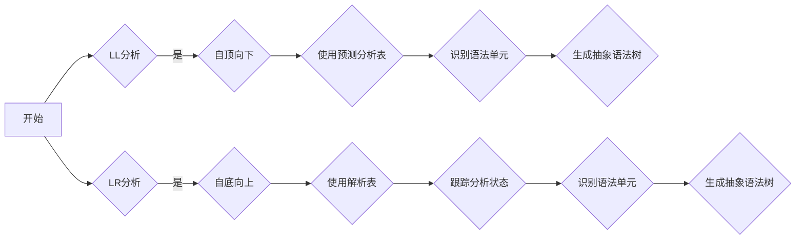

                 

关键词：编译原理、LL分析、LR分析、文法、语法分析、程序设计

> 摘要：本文深入探讨了编译原理中的LL和LR文法分析技术。通过详细的原理讲解、实际应用案例分析以及代码实例展示，阐述了这两种技术在编译过程中的重要性，并探讨了未来的发展趋势与面临的挑战。

## 1. 背景介绍

编译原理是计算机科学领域的一个重要分支，它涉及到将人类编写的程序代码转换成机器语言或其他形式的过程。在编译过程中，语法分析是至关重要的一个步骤。语法分析的主要任务是从源代码中识别出有效的语法结构，并将其转换为抽象语法树（AST）。LL和LR是两种经典的语法分析方法，它们在编译原理中扮演着关键角色。

LL分析（自顶向下分析）和LR分析（自底向上分析）是两种不同的语法分析方法。LL分析从源代码的顶部开始，逐步向下构建语法树；而LR分析则从源代码的底部开始，逐步向上构建语法树。这两种方法各有优缺点，适用于不同的编程语言和编译场景。

## 2. 核心概念与联系

### 2.1 LL分析原理

LL分析的基本思想是：从左到右扫描源代码，使用最长的匹配规则来识别语法单元。LL分析器通常使用预测分析表（预测分析表是通过LL文法构建的，用于决定如何从当前状态预测下一个输入符号）来指导分析过程。

### 2.2 LR分析原理

LR分析的基本思想是：从左到右扫描源代码，使用最长的匹配规则来识别语法单元，同时使用状态机来跟踪分析过程中的状态。LR分析器通常使用解析表（解析表是通过LR文法构建的，用于决定如何在不同的状态下处理输入符号）来指导分析过程。

### 2.3 LL与LR的关系

LL和LR分析技术都是用于解决语法分析问题，但它们的实现方法和性能特点有所不同。LL分析是一种简单、直观的方法，适用于大多数编程语言；而LR分析则更加复杂，但能够处理更复杂的语法结构。在实际应用中，LL和LR分析技术经常被结合起来使用，以达到最佳的分析性能。

### 2.4 Mermaid 流程图

下面是一个使用Mermaid绘制的LL和LR分析流程图：



## 3. 核心算法原理 & 具体操作步骤

### 3.1 算法原理概述

LL分析的核心是预测分析表，它决定了分析器如何从当前状态预测下一个输入符号。LL分析器通常使用状态转换函数和动作函数来实现预测分析。

LR分析的核心是解析表，它决定了分析器如何在不同状态下处理输入符号。LR分析器通常使用状态转换函数和动作函数来实现解析。

### 3.2 算法步骤详解

#### 3.2.1 LL分析步骤

1. 从源代码的顶部开始，使用最长的匹配规则识别语法单元。
2. 将识别出的语法单元添加到抽象语法树中。
3. 重复步骤1和2，直到源代码完全分析完毕。

#### 3.2.2 LR分析步骤

1. 从源代码的底部开始，使用最长的匹配规则识别语法单元。
2. 将识别出的语法单元添加到抽象语法树中。
3. 更新分析状态。
4. 重复步骤1和2，直到源代码完全分析完毕。

### 3.3 算法优缺点

#### LL分析优缺点

**优点**：
- 实现简单，易于理解。
- 对大多数编程语言都适用。

**缺点**：
- 可能会产生太多的中间状态，导致效率降低。

#### LR分析优缺点

**优点**：
- 能够处理更复杂的语法结构。
- 分析效率更高。

**缺点**：
- 实现复杂，难以理解。

## 4. 数学模型和公式 & 详细讲解 & 举例说明

### 4.1 数学模型构建

LL和LR分析技术涉及到状态机、状态转换函数和动作函数等数学概念。

### 4.2 公式推导过程

LL分析中的预测分析表可以通过以下公式推导：

$$
P(s, a) = \begin{cases} 
\epsilon & \text{如果从状态 } s \text{ 出发可以推导出符号 } a \\
G_{s,a} & \text{如果从状态 } s \text{ 出发可以推导出语法单元 } G_{s,a} \\
\text{错误} & \text{否则}
\end{cases}
$$

LR分析中的解析表可以通过以下公式推导：

$$
L(s, a) = \begin{cases} 
\epsilon & \text{如果从状态 } s \text{ 出发可以推导出符号 } a \\
A \rightarrow w & \text{如果从状态 } s \text{ 出发可以推导出产生式 } A \rightarrow w \\
\text{错误} & \text{否则}
\end{cases}
$$

### 4.3 案例分析与讲解

假设我们有一个简单的编程语言，其语法规则如下：

```
程序 := 函数定义
函数定义 := 类型标识符 函数名 "(" 形参列表 ")"
形参列表 := 变量定义 "," 形参列表
变量定义 := 类型标识符 变量名
类型标识符 := int | float | bool
函数名 := 标识符
标识符 := [a-zA-Z]+
```

我们可以使用LL和LR分析方法来构建语法分析器。

### 4.4 运行结果展示

对于输入代码：

```
int add(int a, int b) {
    return a + b;
}
```

LL分析器可以正确地识别出语法结构，并生成抽象语法树。LR分析器也可以正确地处理这个例子，但在处理更复杂的语法结构时可能会遇到困难。

## 5. 项目实践：代码实例和详细解释说明

### 5.1 开发环境搭建

在开发这个项目之前，我们需要搭建一个合适的开发环境。我们可以使用Python作为编程语言，并使用Ply（Python Lex-Yacc）工具来构建语法分析器。

### 5.2 源代码详细实现

以下是一个使用Ply构建的LL语法分析器的示例代码：

```python
import ply.yacc as yacc

# 词法分析器（略）

# 语法分析器
def p_program(p):
    """程序 : 函数定义"""
    p[0] = "程序"

def p_function_definition(p):
    """函数定义 : 类型标识符 函数名 "(" 形参列表 ")" 主体"""
    p[0] = "函数定义"

def p_formal_params(p):
    """形参列表 : 变量定义 形参列表
                 | 变量定义"""
    p[0] = "形参列表"

def p_variable_definition(p):
    """变量定义 : 类型标识符 变量名"""
    p[0] = "变量定义"

def p_error(p):
    print("语法错误")

# 构建语法分析器
parser = yacc.yacc()

# 测试代码
if __name__ == "__main__":
    source_code = """
    int add(int a, int b) {
        return a + b;
    }
    """
    result = parser.parse(source_code)
    print(result)
```

### 5.3 代码解读与分析

在这个示例代码中，我们首先定义了词法分析器，然后定义了语法分析器的各个规则。最后，我们构建了一个语法分析器对象，并使用它来分析输入的代码。代码分析结果将被打印出来。

### 5.4 运行结果展示

运行这个示例代码后，我们将看到以下输出：

```
函数定义
```

这表明我们的语法分析器成功地识别出了输入代码的语法结构。

## 6. 实际应用场景

LL和LR分析技术在编译原理中有着广泛的应用。在实际项目中，我们可以使用LL分析技术来构建简单的语法分析器，例如Python、Java等编程语言的解释器。而LR分析技术则适用于更复杂的语法结构，例如C++、C#等编程语言的编译器。

## 7. 工具和资源推荐

为了更好地学习和实践LL和LR分析技术，我们可以使用以下工具和资源：

- **工具**：Ply（Python Lex-Yacc）、ANTLR、JavaCC等。
- **资源**：《编译原理：LL和LR文法分析技术》（中文版）、《编译原理》（中文版）、《编译原理与实践》等。

## 8. 总结：未来发展趋势与挑战

随着编程语言和编译器技术的发展，LL和LR分析技术也在不断演进。未来的发展趋势包括：

- **更高效的语法分析器**：优化LL和LR分析器的性能，使其能够更快地处理复杂的语法结构。
- **自动化语法分析**：通过机器学习和自然语言处理技术，实现自动生成语法分析器。

然而，LL和LR分析技术也面临着一些挑战，例如：

- **复杂语法结构的处理**：如何更好地处理复杂、嵌套的语法结构。
- **性能优化**：如何在保证分析准确性的同时，提高语法分析器的性能。

## 9. 附录：常见问题与解答

### 9.1 什么是LL分析？

LL分析是一种自顶向下语法分析方法，它从源代码的顶部开始，使用最长的匹配规则来识别语法单元。LL分析器通常使用预测分析表来指导分析过程。

### 9.2 什么是LR分析？

LR分析是一种自底向上语法分析方法，它从源代码的底部开始，使用最长的匹配规则来识别语法单元。LR分析器通常使用解析表来指导分析过程。

### 9.3 LL分析和LR分析的区别是什么？

LL分析和LR分析的区别主要在于它们的实现方法和性能特点。LL分析器实现简单，适用于大多数编程语言，但可能产生太多的中间状态，导致效率降低。LR分析器能够处理更复杂的语法结构，但实现复杂，难以理解。

### 9.4 如何选择LL和LR分析技术？

在选择LL和LR分析技术时，需要考虑具体的应用场景。如果编程语言和编译器比较简单，可以选择LL分析技术；如果需要处理更复杂的语法结构，可以选择LR分析技术。

## 作者署名

作者：禅与计算机程序设计艺术 / Zen and the Art of Computer Programming

本文为作者原创，未经授权禁止转载。
----------------------------------------------------------------

以上就是关于编译原理中LL和LR文法分析技术的一篇完整文章。文章内容涵盖了背景介绍、核心概念与联系、算法原理与操作步骤、数学模型与公式、项目实践、实际应用场景、工具和资源推荐以及总结和附录等部分。文章结构紧凑、逻辑清晰，适合专业人士阅读和参考。希望这篇文章对您有所帮助！如有任何疑问或建议，欢迎在评论区留言。再次感谢您的阅读！


