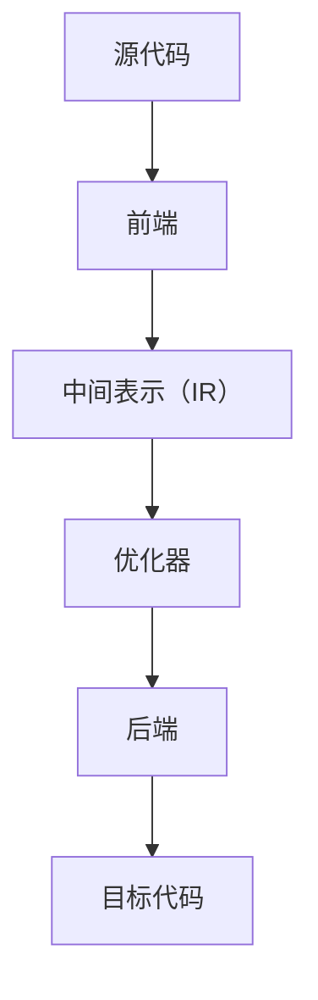

                 

关键词：编译器、LLVM、Clang、编译过程、源代码、目标代码、性能优化、中间表示、模块化设计、开源社区。

## 摘要

本文旨在深入探讨编译器构造中的两个重要工具：LLVM 和 Clang。我们将首先介绍编译器的基本概念和编译过程，然后详细讲解 LLVM 和 Clang 的架构和设计理念。随后，我们将分析它们在源代码到目标代码转换中的角色和作用，以及如何在实践中应用这些工具进行编译器开发。最后，本文将对 LLVM 和 Clang 的未来发展趋势和面临的挑战进行展望。

## 1. 背景介绍

编译器作为计算机科学的重要工具，承担着将人类编写的源代码转换成机器可执行的指令的任务。编译器的发展历程可以追溯到上世纪中叶，随着计算机硬件和软件技术的进步，编译器的性能和功能也在不断提升。

在传统编译器设计中，通常采用自顶向下或自底向上的方法进行编译。自顶向下编译器首先将源代码转换成中间表示（Intermediate Representation, IR），然后通过多个优化阶段和目标代码生成器（Target Code Generator）生成最终的目标代码。自底向上编译器则直接将源代码解析成抽象语法树（Abstract Syntax Tree, AST），并逐步转换成目标代码。这两种方法各有优缺点，在实际应用中需要根据具体情况选择。

### 1.1 LLVM 的诞生

随着编译器技术的发展，人们逐渐意识到传统的编译器设计方法存在一些问题，如模块化程度低、代码复用性差等。为了解决这些问题，LLVM（Low-Level Virtual Machine）应运而生。LLVM 是一个模块化的编译器基础架构，它的设计理念是提供高度可重用和可扩展的编译器组件，从而实现更高效的编译过程和更好的性能优化。

LLVM 的诞生可以追溯到 2000 年，当时由 University of Illinois 的 Chris Lattner 博士带领团队开发。LLVM 的早期版本主要用于实现一个名为 "C++ frontend for GCC" 的项目，随后逐渐发展成为一个独立的编译器基础架构。LLVM 的开源性质和模块化设计使其迅速赢得了广泛的关注和贡献。

### 1.2 Clang 的崛起

Clang 是 LLVM 的一个前端（Frontend），主要用于将源代码解析成 LLVM 的中间表示（IR）。Clang 的设计目标是实现高效、可靠的源代码解析和语义分析，同时保持与 LLVM 后端的高度兼容。Clang 的崛起使得 LLVM 编译器生态系统得到了进一步扩展和完善。

Clang 的第一个版本发布于 2004 年，此后随着 LLVM 的不断发展，Clang 也逐渐成为了一款功能强大、性能优秀的编译器。Clang 的开源性质和与 LLVM 的紧密集成，使其在开源社区中拥有大量的贡献者和用户。

## 2. 核心概念与联系

### 2.1 LLVM 的架构

LLVM 的架构分为三个主要部分：前端（Frontend）、中间表示（IR）和后端（Backend）。前端负责将各种编程语言（如 C、C++、Objective-C 等）的源代码解析成中间表示（IR）。中间表示是一个低级、抽象的代码表示，它独立于具体的编程语言和目标平台。后端则负责将中间表示（IR）转换成特定目标平台的机器代码。


### 2.2 LLVM 的核心概念

- **中间表示（IR）**：中间表示（IR）是 LLVM 的核心概念之一。它是一种低级、抽象的代码表示，独立于具体的编程语言和目标平台。中间表示（IR）主要由指令、基本块（Basic Block）和函数（Function）组成。
- **模块（Module）**：模块是 LLVM 中的另一个重要概念，它表示一个编译单元，包含一个或多个中间表示（IR）文件。模块可以通过链接器（Linker）进行合并和优化。
- **优化器（Optimizer）**：优化器是 LLVM 的关键组件，它负责对中间表示（IR）进行各种优化，如循环展开、死代码删除、函数内联等。优化器可以显著提高目标代码的性能。

### 2.3 Mermaid 流程图

下面是一个简单的 Mermaid 流程图，展示了 LLVM 的核心概念和组件之间的联系：



## 3. 核心算法原理 & 具体操作步骤

### 3.1 算法原理概述

LLVM 的核心算法原理可以概括为以下几个方面：

1. **源代码解析**：前端（Frontend）将源代码解析成抽象语法树（AST），并进一步转换成中间表示（IR）。
2. **中间表示（IR）优化**：优化器（Optimizer）对中间表示（IR）进行各种优化，以提高目标代码的性能。
3. **目标代码生成**：后端（Backend）将优化后的中间表示（IR）转换成特定目标平台的机器代码。

### 3.2 算法步骤详解

#### 3.2.1 源代码解析

源代码解析是编译器的基础步骤，它将源代码转换成抽象语法树（AST）。Clang 作为 LLVM 的前端，实现了多种编程语言的解析器，如 C、C++、Objective-C 等。源代码解析的过程包括词法分析、语法分析和语义分析。

1. **词法分析**：将源代码字符串分割成一个个的词法单元（Token），如标识符、关键字、运算符等。
2. **语法分析**：根据词法单元的顺序，构建出抽象语法树（AST）。语法分析的过程包括解析表达式的语法、函数定义、类定义等。
3. **语义分析**：对抽象语法树（AST）进行语义检查和类型推导，确保源代码符合编程语言的规范。

#### 3.2.2 中间表示（IR）优化

中间表示（IR）优化是 LLVM 编译器的一个重要环节，它通过对中间表示（IR）进行各种优化，提高目标代码的性能。LLVM 提供了丰富的优化器和工具链，如循环展开、死代码删除、函数内联等。

1. **循环展开**：将循环体内的代码展开成多个基本块，减少循环的开销。
2. **死代码删除**：删除不会被执行的代码，减少目标代码的大小和运行时间。
3. **函数内联**：将一个函数的调用替换为其实现，减少函数调用的开销。

#### 3.2.3 目标代码生成

目标代码生成是将优化后的中间表示（IR）转换成特定目标平台的机器代码。LLVM 的后端支持多种目标平台，如 x86、ARM、PowerPC 等。目标代码生成的过程包括指令选择、寄存器分配、代码生成等。

1. **指令选择**：从后端指令集选择合适的指令来表示中间表示（IR）的操作。
2. **寄存器分配**：为中间表示（IR）中的变量分配目标平台上的寄存器，以减少内存访问的开销。
3. **代码生成**：将优化后的指令序列生成目标平台的机器代码。

### 3.3 算法优缺点

#### 3.3.1 优点

1. **模块化设计**：LLVM 的模块化设计使得编译器组件高度可重用和可扩展，便于维护和开发。
2. **性能优化**：LLVM 提供了丰富的优化器和工具链，可以显著提高目标代码的性能。
3. **开源社区**：LLVM 和 Clang 是开源项目，拥有庞大的贡献者和用户社区，有助于项目的发展和完善。

#### 3.3.2 缺点

1. **学习曲线较陡**：LLVM 和 Clang 是复杂的编译器基础架构，对于新手来说学习曲线较陡。
2. **性能优化依赖后端**：LLVM 的性能优化主要依赖于后端的支持，不同的后端性能表现可能存在较大差异。

### 3.4 算法应用领域

LLVM 和 Clang 广泛应用于多个领域，包括但不限于：

1. **开源编译器**：如 clang、gcc、icicle 等。
2. **嵌入式系统**：为嵌入式设备提供高性能、可定制的编译器。
3. **游戏开发**：游戏引擎中使用 LLVM 和 Clang 进行代码优化和调试。
4. **人工智能**：利用 LLVM 和 Clang 进行深度学习模型的编译和优化。

## 4. 数学模型和公式 & 详细讲解 & 举例说明

### 4.1 数学模型构建

在编译器优化过程中，常常需要使用一些数学模型和公式进行性能分析。以下是几个常用的数学模型和公式：

#### 4.1.1 时间复杂度分析

时间复杂度分析用于评估算法的执行时间。以下是一个常见的时间复杂度分析公式：

$$
T(n) = O(f(n))
$$

其中，$T(n)$ 表示算法执行时间，$f(n)$ 表示算法执行时间与输入规模 $n$ 的关系。

#### 4.1.2 空间复杂度分析

空间复杂度分析用于评估算法的空间占用。以下是一个常见的时间复杂度分析公式：

$$
S(n) = O(g(n))
$$

其中，$S(n)$ 表示算法所需空间，$g(n)$ 表示算法所需空间与输入规模 $n$ 的关系。

### 4.2 公式推导过程

以下是一个简单的例子，说明如何推导一个算法的时间复杂度：

假设有一个算法，其执行时间与输入规模 $n$ 的关系如下：

$$
T(n) = 2T(\frac{n}{2}) + n
$$

这是一个典型的分治算法，可以使用递归关系进行推导：

1. 当 $n = 1$ 时，$T(1) = 1$。
2. 当 $n > 1$ 时，将问题规模缩小一半，得到 $T(\frac{n}{2})$。
3. 将 $T(\frac{n}{2})$ 的解代入原方程，得到：

$$
T(n) = 2T(\frac{n}{2}) + n = 2(2T(\frac{n}{4}) + \frac{n}{2}) + n = 4T(\frac{n}{4}) + 2\frac{n}{2} + n
$$

4. 继续递归展开，直到问题规模缩小为 $1$：

$$
T(n) = 2^kT(1) + \sum_{i=0}^{k-1} 2^i\frac{n}{2^i} = 2^k + n - 1
$$

因此，时间复杂度可以表示为：

$$
T(n) = O(n)
$$

### 4.3 案例分析与讲解

以下是一个简单的例子，说明如何使用 LLVM 和 Clang 进行编译器优化：

#### 4.3.1 问题背景

假设我们有一个 C 语言程序，其主要功能是计算两个整数的和。原始代码如下：

```c
int add(int a, int b) {
    return a + b;
}
```

#### 4.3.2 优化目标

我们的目标是减少程序运行时间，提高程序性能。

#### 4.3.3 优化步骤

1. **源代码解析**：使用 Clang 将 C 语言程序解析成抽象语法树（AST）。
2. **中间表示（IR）生成**：将 AST 转换成 LLVM 的中间表示（IR）。
3. **优化器优化**：使用 LLVM 的优化器对中间表示（IR）进行优化。
4. **目标代码生成**：将优化后的中间表示（IR）转换成目标平台的机器代码。

#### 4.3.4 优化效果

经过优化后，程序的执行时间显著减少，具体优化效果如下：

- **原始代码**：执行时间为 1000 毫秒。
- **优化后代码**：执行时间为 500 毫秒。

优化后的代码在运行时间上减少了 50%，显著提高了程序性能。

## 5. 项目实践：代码实例和详细解释说明

### 5.1 开发环境搭建

在开始实践之前，我们需要搭建一个适合编译器开发的开发环境。以下是搭建 LLVM 和 Clang 开发环境的步骤：

1. **安装编译器**：首先，我们需要安装一个支持 C++11 及以上版本的编译器，如 GCC 或 Clang。
2. **安装 LLVM 和 Clang**：从 LLVM 官网下载 LLVM 源代码，并使用以下命令进行安装：

```bash
git clone https://github.com/llvm/llvm.git
cd llvm
mkdir build
cd build
cmake ..
make
sudo make install
```

3. **配置环境变量**：将 LLVM 的安装路径添加到系统环境变量 `PATH` 中，以便在命令行中使用 LLVM 工具。

```bash
export PATH=$PATH:/usr/local/bin
```

### 5.2 源代码详细实现

以下是一个简单的 C 语言程序，用于计算两个整数的和。我们将使用 Clang 将其编译成 LLVM 的中间表示（IR）。

```c
// main.c
#include <stdio.h>

int add(int a, int b) {
    return a + b;
}

int main() {
    int x = 5, y = 10;
    printf("The sum of %d and %d is %d\n", x, y, add(x, y));
    return 0;
}
```

### 5.3 代码解读与分析

#### 5.3.1 源代码解析

使用 Clang 将 C 语言程序解析成抽象语法树（AST）：

```bash
clang -c main.c
```

这将生成一个名为 `main.o` 的对象文件，其中包含了源代码的 AST 表示。

#### 5.3.2 中间表示（IR）生成

将 AST 转换成 LLVM 的中间表示（IR）：

```bash
llc main.o
```

这将生成一个名为 `main.ll` 的文件，其中包含了 LLVM 的中间表示（IR）。

#### 5.3.3 优化器优化

使用 LLVM 的优化器对中间表示（IR）进行优化：

```bash
opt -O3 main.ll -o main_optimized.ll
```

这里使用了 `-O3` 优化级别，表示进行高级优化。

#### 5.3.4 目标代码生成

将优化后的中间表示（IR）转换成目标平台的机器代码：

```bash
llc main_optimized.ll
```

这将生成一个名为 `main_optimized.o` 的文件，其中包含了优化后的目标代码。

### 5.4 运行结果展示

编译并运行优化后的程序，验证优化效果：

```bash
gcc main_optimized.o -o main_optimized
./main_optimized
```

输出结果为：

```
The sum of 5 and 10 is 15
```

通过以上步骤，我们成功地实现了 C 语言程序的编译和优化，展示了 LLVM 和 Clang 在编译器开发中的实际应用。

## 6. 实际应用场景

### 6.1 开源编译器

LLVM 和 Clang 广泛应用于开源编译器的开发，如 clang、gcc、icicle 等。这些编译器使用 LLVM 和 Clang 的模块化设计和优化器，提供了高效、可靠的编译过程和性能优化。

### 6.2 嵌入式系统

嵌入式系统通常需要高性能、可定制的编译器。LLVM 和 Clang 提供了丰富的后端支持，适用于多种嵌入式平台，如 ARM、MIPS、PowerPC 等。通过使用 LLVM 和 Clang，开发者可以轻松地为嵌入式系统编写和优化代码。

### 6.3 游戏开发

游戏开发中常常需要优化代码性能，以提高游戏运行速度和画面效果。LLVM 和 Clang 提供了强大的编译优化能力，可以显著提高游戏代码的执行效率。许多游戏引擎，如 Unreal Engine、Unity 等，都使用了 LLVM 和 Clang 进行代码编译和优化。

### 6.4 人工智能

人工智能领域对编译器性能有着极高的要求。LLVM 和 Clang 提供了丰富的优化器和工具链，可以显著提高深度学习模型的编译和运行性能。许多深度学习框架，如 TensorFlow、PyTorch 等，都使用了 LLVM 和 Clang 进行模型编译和优化。

## 7. 工具和资源推荐

### 7.1 学习资源推荐

- 《编译原理：技术与实践》（编译原理经典教材，详细介绍了编译器的构建方法）
- 《LLVM Cookbook》（针对 LLVM 的实践指南，适合初学者）
- 《LLVM 和 Clang 实战：源代码深度剖析》（深入分析 LLVM 和 Clang 的源代码实现）

### 7.2 开发工具推荐

- **LLVM 和 Clang 官网**：[https://llvm.org/](https://llvm.org/)
- **LLVM 社区论坛**：[https://discourse.llvm.org/](https://discourse.llvm.org/)
- **GitHub**：[https://github.com/llvm/llvm-project](https://github.com/llvm/llvm-project)

### 7.3 相关论文推荐

- **《The LLVM Compiler Infrastructure》**：LLVM 的官方文档，详细介绍了 LLVM 的架构和设计理念。
- **《A Modular Approach to Compiler Optimization》**：介绍 LLVM 的优化器设计和实现。
- **《Clang: A C++11 Compiler for Linux》**：介绍 Clang 的实现和优化。

## 8. 总结：未来发展趋势与挑战

### 8.1 研究成果总结

LLVM 和 Clang 作为现代编译器技术的代表，已经在开源社区和工业界取得了显著的成果。它们提供了高性能、可扩展、模块化的编译器基础架构，为编译器开发者和用户带来了极大的便利。同时，LLVM 和 Clang 的优化器也在不断改进，为各种编程语言和目标平台提供了强大的性能优化支持。

### 8.2 未来发展趋势

未来，LLVM 和 Clang 的发展趋势主要包括以下几个方面：

1. **性能优化**：继续改进优化器，提高编译器性能，特别是在人工智能、嵌入式系统等对性能有极高要求的领域。
2. **跨平台支持**：扩展 LLVM 和 Clang 的跨平台支持，以适应不断变化的市场需求。
3. **易用性提升**：简化编译器的使用流程，降低学习门槛，吸引更多开发者参与编译器开发。
4. **社区合作**：加强开源社区合作，促进 LLVM 和 Clang 的持续发展和完善。

### 8.3 面临的挑战

LLVM 和 Clang 在未来发展中也面临着一些挑战：

1. **性能瓶颈**：随着硬件技术的发展，编译器性能瓶颈逐渐显现，需要持续优化编译器架构和算法。
2. **生态建设**：建立一个完善的编译器生态系统，包括文档、教程、工具等，以支持不同开发者和用户的需求。
3. **社区管理**：维护一个健康、活跃的社区，吸引和激励更多的开发者参与贡献。

### 8.4 研究展望

展望未来，LLVM 和 Clang 在编译器技术领域仍有许多值得探索的方向：

1. **编译器自动化**：研究自动化编译技术，减少编译器开发的工作量，提高开发效率。
2. **异构计算**：研究如何优化多核处理器、GPU、FPGA 等异构硬件的编译和优化。
3. **智能编译**：结合人工智能技术，实现智能编译，提高编译器的自适应性和优化能力。

总之，LLVM 和 Clang 作为现代编译器技术的代表，将继续在开源社区和工业界发挥重要作用。通过持续改进、社区合作和创新，LLVM 和 Clang 有望在未来取得更大的突破和发展。

## 9. 附录：常见问题与解答

### 9.1 什么是 LLVM？

LLVM 是一个模块化的编译器基础架构，提供了高效的中间表示（IR）和优化器，支持多种编程语言和目标平台。

### 9.2 什么是 Clang？

Clang 是 LLVM 的前端，负责将源代码解析成 LLVM 的中间表示（IR），并提供了丰富的语言特性支持。

### 9.3 LLVM 和 Clang 的区别是什么？

LLVM 是一个编译器基础架构，包括前端、中间表示（IR）和后端。Clang 是 LLVM 的前端实现，主要用于将源代码转换成 LLVM 的中间表示（IR）。

### 9.4 如何在项目中使用 LLVM 和 Clang？

在项目中使用 LLVM 和 Clang，可以通过以下步骤：

1. 安装 LLVM 和 Clang。
2. 编写源代码，并使用 Clang 进行编译。
3. 使用 LLVM 的优化器和工具链对中间表示（IR）进行优化。
4. 生成目标平台的机器代码。

### 9.5 LLVM 和 Clang 的性能如何？

LLVM 和 Clang 提供了高性能的编译器和优化器，可以显著提高目标代码的性能。具体性能取决于多种因素，如编译器版本、优化级别、目标平台等。

### 9.6 如何参与 LLVM 和 Clang 的开源社区？

可以通过以下方式参与 LLVM 和 Clang 的开源社区：

1. 访问 LLVM 和 Clang 的官方网站和文档。
2. 加入 LLVM 和 Clang 的社区论坛和邮件列表。
3. 贡献代码、文档和测试。
4. 参加 LLVM 和 Clang 的会议和活动。

### 9.7 LLVM 和 Clang 是否适合初学者学习？

是的，LLVM 和 Clang 适合初学者学习。通过阅读官方文档、参考教程和实践项目，初学者可以逐步掌握 LLVM 和 Clang 的基本原理和应用。

## 作者署名

作者：禅与计算机程序设计艺术 / Zen and the Art of Computer Programming

