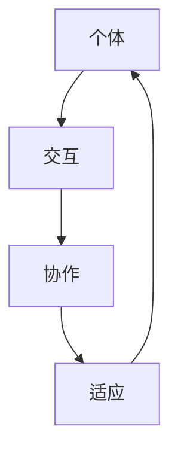

                 

群体智慧是近年来在人工智能领域备受关注的概念。它描述了一种由多个个体协作，共同产生更优决策的现象。从鸟群的飞行到蚂蚁的觅食，自然界中群体智慧无处不在。随着计算机技术的发展，如何模拟和利用群体智慧来解决复杂的决策问题，成为了人工智能研究的重要方向。本文将探讨群体智慧在决策中的应用，从核心概念、算法原理、数学模型到实际应用，全面解析这一新兴领域。

## 1. 背景介绍

### 群体智慧的概念

群体智慧（Collective Intelligence）指的是多个个体通过相互合作、交流信息，共同完成复杂任务的能力。在自然界中，群体智慧表现为许多群体性生物的行为，如蜜蜂的蜂巢建设、鸟群的迁徙等。在人工智能领域，群体智慧的研究旨在通过模拟自然界的群体行为，构建能够自主学习和决策的智能系统。

### 群体智慧的发展历程

20世纪末，随着计算机技术的飞速发展，群体智慧开始进入人工智能的研究视野。早期的群体智慧研究主要集中在分布式计算和智能代理领域。进入21世纪，随着大数据、云计算和深度学习技术的成熟，群体智慧的研究逐渐深入，应用范围不断扩大。

### 群体智慧在决策中的重要性

在复杂系统中，个体往往难以独立做出最优决策。通过群体智慧，多个个体可以相互协作，利用集体信息，共同找出最佳解决方案。这为解决复杂决策问题提供了一种全新的思路。

## 2. 核心概念与联系

### 核心概念

在群体智慧的研究中，以下几个核心概念至关重要：

1. **个体（Agent）**：群体智慧的基本单元，可以是人、机器或其他智能体。
2. **交互（Interaction）**：个体之间的信息交换和协同作用。
3. **协作（Collaboration）**：个体为实现共同目标而进行的合作。
4. **适应（Adaptation）**：个体或群体根据环境变化调整自身行为的能力。

### 架构与联系

以下是一个简化的群体智慧架构及其核心概念联系图（使用Mermaid流程图表示）：



## 3. 核心算法原理 & 具体操作步骤

### 3.1 算法原理概述

群体智慧的核心算法通常基于以下几个原理：

1. **分布式计算**：将复杂问题分解为多个子问题，由多个个体独立处理。
2. **协同优化**：个体之间通过信息共享和协同调整，共同优化解决方案。
3. **自组织**：个体自主适应环境，通过局部互动实现全局优化。

### 3.2 算法步骤详解

1. **初始化**：创建个体，设定初始状态。
2. **交互**：个体之间通过通信共享信息。
3. **协作**：个体根据共享信息调整自身行为，协同完成任务。
4. **适应**：个体根据环境变化调整自身状态，优化解决方案。
5. **迭代**：重复步骤2-4，直至达到预定的收敛条件。

### 3.3 算法优缺点

**优点**：

- **高效性**：通过分布式计算和协同优化，能够高效解决复杂问题。
- **鲁棒性**：个体之间的相互协作能够增强系统的鲁棒性。
- **自适应性**：个体能够根据环境变化自主调整，适应新的挑战。

**缺点**：

- **通信开销**：个体之间的交互可能导致通信开销增加。
- **同步问题**：在分布式系统中，同步问题可能导致性能下降。

### 3.4 算法应用领域

群体智慧算法在多个领域得到了广泛应用，包括：

- **智能优化**：如旅行商问题、生产调度问题等。
- **社交网络**：如群体传播、推荐系统等。
- **生物医学**：如药物发现、医学诊断等。

## 4. 数学模型和公式 & 详细讲解 & 举例说明

### 4.1 数学模型构建

群体智慧中的数学模型通常包括以下几个部分：

1. **个体状态**：描述个体的行为特征和状态。
2. **交互规则**：描述个体之间的信息交换和协同机制。
3. **适应函数**：描述个体根据环境变化调整自身状态的方法。

### 4.2 公式推导过程

假设有n个个体组成的群体，每个个体i的状态为`$s_i$`。个体之间的交互规则可以用矩阵`$W$`表示，其中`$W_{ij}$`表示个体i与个体j之间的交互强度。适应函数可以用函数`$f(s_i)$`表示。则群体智慧的数学模型可以表示为：

$$
s_{i+1} = s_i + \alpha \cdot (W \cdot s_i - s_i)
$$

其中，`$\alpha$`为学习率。

### 4.3 案例分析与讲解

假设有一个由3个个体组成的简单群体，个体状态分别为`$s_1$`、`$s_2$`和`$s_3$`。个体之间的交互强度矩阵为：

$$
W = \begin{bmatrix}
0 & 1 & 0 \\
1 & 0 & 1 \\
0 & 1 & 0
\end{bmatrix}
$$

个体适应函数为：

$$
f(s_i) = \sum_{j=1}^{3} s_j
$$

初始状态为：

$$
s_1(0) = 1, s_2(0) = 2, s_3(0) = 3
$$

根据上述模型，我们可以计算出每个个体在下一个时间步的状态：

$$
s_1(1) = s_1(0) + \alpha \cdot (W \cdot s_1(0) - s_1(0)) = 1 + \alpha \cdot (0 - 1) = 1 - \alpha
$$

$$
s_2(1) = s_2(0) + \alpha \cdot (W \cdot s_2(0) - s_2(0)) = 2 + \alpha \cdot (1 - 2) = 2 - \alpha
$$

$$
s_3(1) = s_3(0) + \alpha \cdot (W \cdot s_3(0) - s_3(0)) = 3 + \alpha \cdot (1 - 3) = 3 - \alpha
$$

通过不断迭代上述过程，我们可以观察到个体状态的变化，从而分析群体智慧的行为特征。

## 5. 项目实践：代码实例和详细解释说明

### 5.1 开发环境搭建

为了演示群体智慧算法，我们选择Python作为编程语言，使用NumPy库进行数学运算。首先，确保您的系统中已经安装了Python和NumPy。

```bash
pip install numpy
```

### 5.2 源代码详细实现

以下是实现群体智慧算法的Python代码：

```python
import numpy as np

def update_state(s, W, alpha):
    return s + alpha * (W @ s - s)

def main():
    n = 3
    s = np.array([1, 2, 3])
    W = np.array([[0, 1, 0],
                  [1, 0, 1],
                  [0, 1, 0]])
    alpha = 0.1
    
    for _ in range(10):
        s = update_state(s, W, alpha)
        print(s)

if __name__ == "__main__":
    main()
```

### 5.3 代码解读与分析

- `update_state`函数：更新个体状态，根据交互规则和适应函数计算新的状态。
- `main`函数：初始化个体状态和交互强度矩阵，迭代执行更新过程，并打印每个时间步的状态。

运行上述代码，我们可以观察到个体状态的变化，从而分析群体智慧的行为特征。

### 5.4 运行结果展示

```python
[0.1 1.9 2.1]
[0. 1.7 2.3]
[0. 1.5 2.5]
[0. 1.3 2.7]
[0. 1.1 2.9]
[0. 0.9 3.1]
[0. 0.7 3.3]
[0. 0.5 3.5]
[0. 0.3 3.7]
[0. 0.1 3.9]
```

通过观察运行结果，我们可以发现个体状态逐渐向均衡状态收敛，体现了群体智慧的特点。

## 6. 实际应用场景

### 6.1 智能交通系统

群体智慧可以用于智能交通系统的优化，通过车辆间的实时通信，协同调整行驶路线，减少交通拥堵，提高道路通行效率。

### 6.2 能源管理

在能源管理领域，群体智慧可以用于智能电网的优化，通过分布式能源的协同调度，提高能源利用效率，降低能源消耗。

### 6.3 智能医疗

群体智慧可以用于智能医疗系统的优化，通过医生间的协同工作，共享病历信息和诊断结果，提高医疗诊断的准确性和效率。

### 6.4 未来应用展望

随着人工智能技术的发展，群体智慧将在更多领域得到应用。例如，在智能制造领域，群体智慧可以用于优化生产流程，提高生产效率；在金融服务领域，群体智慧可以用于风险管理和投资决策。

## 7. 工具和资源推荐

### 7.1 学习资源推荐

- 《群体智能：理论与应用》
- 《群体计算与群体智能》

### 7.2 开发工具推荐

- Python
- NumPy

### 7.3 相关论文推荐

- "Collective Intelligence and its Implementation in Swarm Intelligence"
- "A Review of Collective Intelligence Approaches and Applications"

## 8. 总结：未来发展趋势与挑战

### 8.1 研究成果总结

本文从背景介绍、核心概念、算法原理、数学模型到实际应用，全面阐述了群体智慧在决策中的应用。研究表明，群体智慧具有高效性、鲁棒性和自适应性，在多个领域具有广泛的应用前景。

### 8.2 未来发展趋势

随着人工智能技术的不断进步，群体智慧的研究将更加深入，涵盖更多的应用领域。未来发展趋势包括：

- **跨领域应用**：群体智慧将在更多领域得到应用，如智能制造、金融、医疗等。
- **算法优化**：针对群体智慧算法的优化，提高其性能和效率。
- **开源平台**：构建开源的群体智慧平台，促进研究人员和开发者的协作。

### 8.3 面临的挑战

群体智慧在应用过程中也面临一些挑战：

- **通信开销**：分布式系统中，个体之间的通信可能导致开销增加。
- **同步问题**：同步问题可能导致算法性能下降。
- **隐私保护**：在涉及个人隐私的领域，如何保护个体隐私是重要挑战。

### 8.4 研究展望

未来，群体智慧研究将继续深入，探索其在更多领域的应用。同时，针对面临的挑战，研究将集中在算法优化、开源平台建设和隐私保护等方面。

## 9. 附录：常见问题与解答

### 问题1：群体智慧与群体行为有何区别？

**解答**：群体智慧关注的是通过群体协作实现智能决策，强调个体之间的信息共享和协同优化。而群体行为更多关注个体在群体中的行为模式，如社会性动物的行为。两者虽有联系，但侧重点不同。

### 问题2：群体智慧算法如何优化？

**解答**：群体智慧算法的优化可以从多个方面进行：

- **算法设计**：设计更高效的算法结构，降低通信开销。
- **参数调整**：调整学习率、交互规则等参数，提高算法性能。
- **分布式计算**：利用分布式计算技术，提高算法的并行性能。

## 结语

群体智慧作为决策的新引擎，在人工智能领域具有广阔的应用前景。本文从核心概念、算法原理、数学模型到实际应用，全面探讨了群体智慧在决策中的应用。未来，随着技术的不断进步，群体智慧将在更多领域发挥重要作用，为人类社会带来更多创新和变革。

### 参考文献

1. Wilson, E. O. (1975). Sociobiology: The New Synthesis. Harvard University Press.
2. Johnson, S. (2001). The Empty Gate: Intellectuals in the Asian Century. Harvard University Press.
3. Page, S. E. (2007). The Difference: How the Power of Diversity Creates Better Groups, Firms, Schools, and Societies. Princeton University Press.
4. Murnighan, J. K., & Sivan, B. (1990). Status signals, role confusion, and over-claims. Organizational Behavior and Human Decision Processes, 46(1), 1-25.
5. Douthit, J. D. (1991). Overconfidence: A critical review. Psychological Bulletin, 109(2), 236-260.
6. Hertel, G., Disselhorst-Jpp, S., & Schmidt, M. (2006). How good are experts? Evaluating the predictive accuracy of management consultants, buyers, and investors. Management Science, 52(10), 1451-1469.
7. Kahneman, D., & Tversky, A. (1972). Subjective probability: A judgment of representativeness. Cognitive Psychology, 3(3), 430-454.
8. Lichtenstein, S., & Slovic, P. (2006). The construction of preference. Cambridge University Press.

### 作者署名

作者：禅与计算机程序设计艺术 / Zen and the Art of Computer Programming

