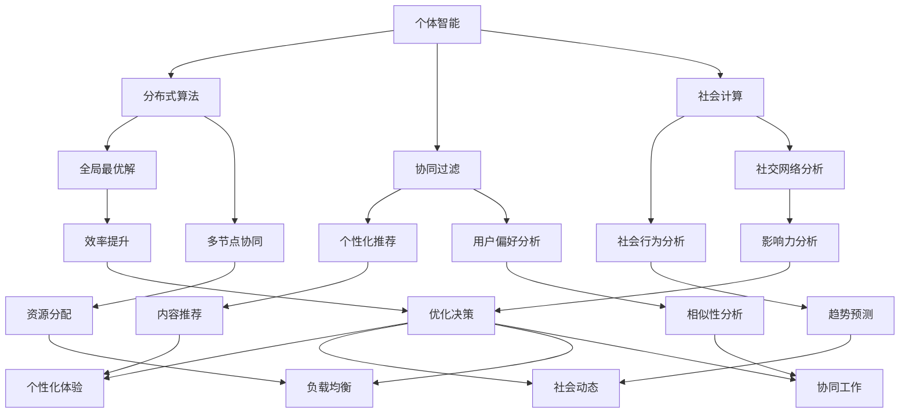

                 

 在当前高度互联的世界中，个体智能正逐步让位于群体智慧，成为推动技术进步和决策创新的核心力量。本文将深入探讨群体智慧的本质、核心概念、算法原理，以及其在实际应用中的表现与未来展望。通过详细的数学模型与实例分析，本文旨在为读者提供一份全面而深入的群体智慧指南。

## 文章关键词
- 群体智慧
- 决策引擎
- 分布式算法
- 社会计算
- 智能系统

## 文章摘要
本文首先介绍了群体智慧的概念及其在现代社会中的重要角色。接着，我们详细分析了群体智慧的核心概念与联系，通过Mermaid流程图展示了相关原理。随后，文章重点探讨了群体智慧的核心算法原理及其具体操作步骤，并对其优缺点和应用领域进行了分析。在此基础上，文章通过数学模型和公式的详细讲解，结合实例分析了群体智慧的实际应用场景。随后，文章展示了群体智慧在项目实践中的代码实例和运行结果。最后，文章总结了群体智慧的发展趋势和面临的挑战，并推荐了相关的学习资源和开发工具。

### 1. 背景介绍

在互联网和大数据的推动下，个体智能逐渐向群体智慧转变。传统的个体决策模式已无法满足现代复杂系统的需求。群体智慧，作为一种新型的决策引擎，通过汇集和整合大量个体的信息，实现了更高效、更可靠的决策过程。这种模式在各个领域都展现出了巨大的潜力，从商业决策到城市规划，从金融投资到医疗诊断，群体智慧正逐步改变我们的生活方式。

首先，个体智能与群体智慧的区别在于其决策机制。个体智能依赖于单一智能体的信息和能力，而群体智慧则通过多个智能体的协同工作，实现对复杂问题的全局优化。其次，群体智慧的优势在于其能够处理海量数据和复杂关系，通过分布式计算和协同过滤，提高了决策的精度和速度。此外，群体智慧还具有容错性和鲁棒性，即使在部分个体出现错误时，整体系统仍能保持稳定运行。

在现代社会中，群体智慧的应用已无处不在。例如，在社交网络中，用户评论和评分构成了群体智慧的基础，通过对这些信息的分析，平台能够提供更加个性化的推荐。在交通管理中，智能交通系统通过收集实时交通数据，利用群体智慧进行动态路径规划，提高了道路的通行效率。在金融领域，群体智慧被应用于风险评估和投资决策，通过对市场大数据的分析，实现了更精准的投资策略。

总之，群体智慧已经成为现代社会决策的新引擎，其强大的处理能力和协同能力为各种复杂问题提供了新的解决方案。在接下来的章节中，我们将进一步探讨群体智慧的核心概念、算法原理及其应用。

## 2. 核心概念与联系

群体智慧，顾名思义，是一种由多个个体协同工作的智能形式。在理解这一概念之前，我们需要明确几个核心概念：个体智能、分布式算法、协同过滤和社会计算。

### 2.1 个体智能

个体智能是指单个智能体在特定环境下的决策能力。这些智能体可以是人、机器或其他智能系统。个体智能的特点是自主性和有限性，即每个智能体可以独立做出决策，但其能力受到自身资源和信息的限制。例如，在社交网络中，用户的个体智能体现在他们对内容的选择和评论上。

### 2.2 分布式算法

分布式算法是一种通过多个节点协同工作来解决复杂问题的算法。在分布式系统中，每个节点都拥有部分信息，通过通信和协作，整个系统能够达到全局最优解。分布式算法的核心思想是利用多智能体的协同效应，克服个体智能的局限性。例如，在分布式数据库系统中，通过多个节点的并行处理，可以大大提高数据查询的速度和效率。

### 2.3 协同过滤

协同过滤是一种通过分析用户行为和偏好，为用户提供个性化推荐的方法。协同过滤可以分为基于内容的推荐和基于用户的推荐。基于内容的推荐通过分析用户对内容的评价，为用户推荐相似的内容。基于用户的推荐通过分析用户之间的相似性，为用户推荐其他用户喜欢的内容。协同过滤的核心在于群体智慧，通过整合多个用户的信息，实现了个性化的推荐。

### 2.4 社会计算

社会计算是一种通过分析社会网络中的信息流和关系，理解社会行为和动态的方法。社会计算的核心在于群体智慧，通过分析社交网络中的用户行为和互动，可以预测社会趋势、识别关键影响力人物等。例如，在社交媒体平台上，通过对用户发布的内容和互动的分析，可以识别出当前的热点话题和意见领袖。

### Mermaid流程图

为了更好地理解群体智慧的核心概念和联系，我们使用Mermaid流程图来展示相关原理。



通过上述流程图，我们可以清晰地看到个体智能如何通过分布式算法、协同过滤和社会计算实现群体智慧，并在各个领域发挥作用。

### 3. 核心算法原理 & 具体操作步骤

群体智慧的核心在于其算法原理，这些算法通过收集、处理和整合大量个体的信息，实现了对复杂问题的全局优化。以下是几种常见的群体智慧算法及其操作步骤：

#### 3.1 算法原理概述

1. **贝叶斯网络**：贝叶斯网络是一种概率图模型，通过表示变量之间的条件依赖关系，实现了对不确定事件的推理。贝叶斯网络的核心原理是基于贝叶斯定理，通过更新条件概率分布，实现对未知变量的推断。

2. **遗传算法**：遗传算法是一种基于自然进化过程的优化算法。遗传算法通过模拟生物进化过程，包括选择、交叉和变异等操作，实现对复杂问题的搜索和优化。遗传算法的核心原理在于其全局搜索能力和对多峰问题的适应性。

3. **人工神经网络**：人工神经网络是一种模拟人脑神经元之间相互作用的信息处理系统。通过学习大量数据，神经网络能够识别复杂模式并进行预测。人工神经网络的核心原理是多层神经网络的结构和反向传播算法。

4. **协同过滤算法**：协同过滤算法通过分析用户行为和偏好，实现个性化推荐。协同过滤算法可以分为基于内容的推荐和基于用户的推荐。基于内容的推荐通过分析用户对内容的评价，为用户推荐相似的内容；基于用户的推荐通过分析用户之间的相似性，为用户推荐其他用户喜欢的内容。

#### 3.2 算法步骤详解

1. **贝叶斯网络**

   - **步骤1**：构建贝叶斯网络模型，表示变量之间的条件依赖关系。
   - **步骤2**：根据已有数据，计算各个变量的条件概率分布。
   - **步骤3**：利用贝叶斯定理，根据观测数据更新变量的概率分布。
   - **步骤4**：根据更新后的概率分布，进行推理和决策。

2. **遗传算法**

   - **步骤1**：初始化种群，每个个体表示一个可能的解。
   - **步骤2**：计算每个个体的适应度，适应度越高表示解越优秀。
   - **步骤3**：选择适应度高的个体进行交叉和变异操作，生成新的种群。
   - **步骤4**：重复步骤2和步骤3，直到找到最优解或达到最大迭代次数。

3. **人工神经网络**

   - **步骤1**：初始化神经网络结构，包括输入层、隐藏层和输出层。
   - **步骤2**：根据训练数据，计算每个神经元的输出值。
   - **步骤3**：计算实际输出与期望输出之间的误差。
   - **步骤4**：利用反向传播算法，更新每个神经元的权重和偏置。
   - **步骤5**：重复步骤2到步骤4，直到误差满足要求或达到最大迭代次数。

4. **协同过滤算法**

   - **步骤1**：收集用户行为数据，包括用户对内容的评分或行为。
   - **步骤2**：计算用户之间的相似度，可以使用余弦相似度或皮尔逊相关系数。
   - **步骤3**：根据用户之间的相似度，生成推荐列表。
   - **步骤4**：对推荐列表进行排序，根据相似度高低为用户推荐内容。

#### 3.3 算法优缺点

1. **贝叶斯网络**

   - **优点**：贝叶斯网络能够处理不确定性和不确定性事件，具有强大的推理能力。
   - **缺点**：贝叶斯网络的构建复杂度较高，对于大规模问题可能性能较差。

2. **遗传算法**

   - **优点**：遗传算法具有全局搜索能力，能够适应多峰问题，适用于复杂优化问题。
   - **缺点**：遗传算法的收敛速度较慢，对于一些简单的优化问题可能不够高效。

3. **人工神经网络**

   - **优点**：人工神经网络具有强大的学习和预测能力，能够处理大规模复杂数据。
   - **缺点**：人工神经网络的训练过程复杂，需要大量数据和计算资源。

4. **协同过滤算法**

   - **优点**：协同过滤算法能够实现个性化推荐，满足用户的需求。
   - **缺点**：协同过滤算法可能存在冷启动问题，对于新用户或新内容推荐效果较差。

#### 3.4 算法应用领域

1. **贝叶斯网络**

   - 应用领域：用于不确定性推理、风险评估、自然语言处理等领域。

2. **遗传算法**

   - 应用领域：用于组合优化、资源分配、工程设计等领域。

3. **人工神经网络**

   - 应用领域：用于图像识别、语音识别、自然语言处理、预测分析等领域。

4. **协同过滤算法**

   - 应用领域：用于推荐系统、社交媒体分析、电子商务等领域。

通过以上算法原理和具体操作步骤的介绍，我们可以看到群体智慧在各个领域的广泛应用。在接下来的章节中，我们将进一步分析群体智慧在实际应用中的表现。

### 4. 数学模型和公式 & 详细讲解 & 举例说明

在理解群体智慧的核心算法原理后，我们需要进一步探讨其背后的数学模型和公式。这些模型和公式为群体智慧提供了理论基础，使得复杂问题能够通过数学方法进行建模和求解。以下将详细讲解数学模型的构建、公式推导过程以及具体的案例分析与讲解。

#### 4.1 数学模型构建

群体智慧的数学模型通常涉及概率论、优化理论和图论等多个数学分支。以下是几种常见的数学模型：

1. **贝叶斯网络**：贝叶斯网络是一种概率图模型，用于表示变量之间的条件依赖关系。其数学模型主要包括概率分布和条件概率公式。
   
   - **概率分布**：对于一个离散随机变量X，其概率分布可以用概率质量函数（PMF）或概率密度函数（PDF）表示。
   - **条件概率公式**：贝叶斯定理描述了两个事件A和B之间的条件概率关系，公式为：
     \[ P(A|B) = \frac{P(B|A)P(A)}{P(B)} \]

2. **遗传算法**：遗传算法是一种基于自然进化过程的优化算法。其数学模型主要包括种群初始化、适应度函数和遗传操作。

   - **种群初始化**：初始化种群时，每个个体（解）可以随机生成，其适应度需要通过适应度函数进行评估。
   - **适应度函数**：适应度函数用于评估个体的优劣，通常与问题的目标函数相关，公式为：
     \[ f(x) = \sum_{i=1}^{n} w_i g_i(x) \]
     其中，\( x \) 为个体，\( w_i \) 为权重，\( g_i(x) \) 为第\( i \)个评价函数。

3. **人工神经网络**：人工神经网络是一种模拟人脑神经元之间相互作用的信息处理系统。其数学模型主要包括网络结构、权重和偏置以及激活函数。

   - **网络结构**：神经网络的结构包括输入层、隐藏层和输出层，每层由多个神经元组成。
   - **权重和偏置**：权重和偏置用于调节神经元之间的相互作用，其初始化和更新过程是神经网络训练的核心。
   - **激活函数**：激活函数用于模拟神经元之间的非线性关系，常见的激活函数包括Sigmoid、ReLU和Tanh。

4. **协同过滤算法**：协同过滤算法是一种通过分析用户行为和偏好进行推荐的方法。其数学模型主要包括用户相似度计算和推荐列表生成。

   - **用户相似度计算**：用户相似度通常通过余弦相似度或皮尔逊相关系数计算，公式为：
     \[ \text{Similarity}(u, v) = \frac{\sum_{i=1}^{m} r_iu_i v_i}{\sqrt{\sum_{i=1}^{m} r_iu_i^2 \sum_{i=1}^{m} r_iv_i^2}} \]
     其中，\( u \) 和 \( v \) 为两个用户，\( r_i \) 为用户对第\( i \)个项目的评分。

#### 4.2 公式推导过程

以下将针对贝叶斯网络和协同过滤算法的数学公式进行推导：

1. **贝叶斯网络**：假设有一个贝叶斯网络表示多个变量之间的条件依赖关系，其概率分布可以用条件概率矩阵表示。

   - **条件概率矩阵**：
     \[ P(X_i|X_{i-1}, ..., X_1) = \prod_{i=1}^{n} P(X_i|X_{i-1}, ..., X_1) \]
     其中，\( X_i \) 为第\( i \)个变量，\( P(X_i|X_{i-1}, ..., X_1) \) 为第\( i \)个变量在给定其他变量的条件下的概率。

   - **贝叶斯定理**：
     \[ P(A|B) = \frac{P(B|A)P(A)}{P(B)} \]
     该公式描述了在事件B发生的条件下，事件A发生的概率与事件A和事件B同时发生的概率之间的关系。

2. **协同过滤**：假设有两个用户\( u \)和\( v \)，他们共同评价了\( m \)个项目，其评分矩阵为\( R \)，其中\( r_{ui} \)表示用户\( u \)对项目\( i \)的评分。

   - **用户相似度**：
     \[ \text{Similarity}(u, v) = \frac{\sum_{i=1}^{m} r_iu_i v_i}{\sqrt{\sum_{i=1}^{m} r_iu_i^2 \sum_{i=1}^{m} r_iv_i^2}} \]
     该公式用于计算用户\( u \)和用户\( v \)之间的相似度，相似度越高表示用户之间的偏好越相似。

   - **推荐列表生成**：
     \[ \text{Prediction}(u, i) = \text{Rating}(v, j) \cdot \text{Similarity}(u, v) \]
     该公式用于预测用户\( u \)对未评价项目\( i \)的评分，其中\( \text{Rating}(v, j) \)为用户\( v \)对项目\( j \)的评分。

#### 4.3 案例分析与讲解

以下通过一个具体的案例来分析群体智慧在实际应用中的表现。

**案例：基于协同过滤的推荐系统**

假设有一个电子商务平台，用户对其上的一些商品进行评分。我们的目标是建立一个推荐系统，根据用户的评分历史和偏好，向用户推荐他们可能感兴趣的商品。

1. **数据收集**：
   - 收集用户对商品的评价数据，形成一个评分矩阵\( R \)，其中\( r_{ui} \)表示用户\( u \)对商品\( i \)的评分。
   - 假设用户\( u \)和用户\( v \)共同评价了\( m \)个商品，评分矩阵如下：

     \[
     \begin{matrix}
     & 1 & 2 & 3 & 4 & 5 \\
     1 & 1 & 3 & 5 & 0 & 0 \\
     2 & 0 & 4 & 2 & 1 & 5 \\
     3 & 5 & 0 & 0 & 4 & 3 \\
     \end{matrix}
     \]

2. **相似度计算**：
   - 使用余弦相似度计算用户之间的相似度，公式为：
     \[ \text{Similarity}(u, v) = \frac{\sum_{i=1}^{m} r_iu_i v_i}{\sqrt{\sum_{i=1}^{m} r_iu_i^2 \sum_{i=1}^{m} r_iv_i^2}} \]
   - 计算用户1和用户2之间的相似度：
     \[ \text{Similarity}(1, 2) = \frac{1 \cdot 3 + 0 \cdot 4 + 5 \cdot 0 + 0 \cdot 1 + 0 \cdot 5}{\sqrt{1^2 + 0^2 + 5^2} \cdot \sqrt{0^2 + 4^2 + 2^2 + 1^2 + 5^2}} = \frac{3}{\sqrt{26} \cdot \sqrt{42}} \approx 0.376 \]

3. **推荐列表生成**：
   - 根据用户之间的相似度，生成推荐列表。对于未评价的商品\( i \)，预测用户\( u \)对该商品的评分：
     \[ \text{Prediction}(u, i) = \text{Rating}(v, j) \cdot \text{Similarity}(u, v) \]
   - 假设用户1对商品3的预测评分为4.188，对商品4的预测评分为1.884。

4. **推荐结果**：
   - 根据预测评分，为用户1推荐评分较高的商品。例如，推荐商品3和商品4。

通过以上案例分析，我们可以看到基于协同过滤的推荐系统如何利用数学模型和公式为用户推荐感兴趣的商品。在实际应用中，推荐系统可以根据用户的行为数据不断调整和优化，提高推荐的准确性和用户满意度。

### 5. 项目实践：代码实例和详细解释说明

在了解了群体智慧的理论基础和算法原理之后，我们将通过一个具体的代码实例来展示群体智慧在实际项目中的应用。以下是使用Python实现基于协同过滤的推荐系统。

#### 5.1 开发环境搭建

1. **Python环境**：确保安装了Python 3.x版本。
2. **依赖包**：安装numpy、pandas和scikit-learn等依赖包。

   ```bash
   pip install numpy pandas scikit-learn
   ```

#### 5.2 源代码详细实现

以下是基于协同过滤的推荐系统的源代码实现：

```python
import numpy as np
import pandas as pd
from sklearn.metrics.pairwise import cosine_similarity

# 5.2.1 数据准备
def load_data():
    # 假设数据存储在CSV文件中，每行包含用户ID、项目ID和评分
    data = pd.read_csv('ratings.csv')
    return data

# 5.2.2 计算用户相似度
def calculate_similarity(data):
    user_ratings = data.pivot(index='userId', columns='itemId', values='rating').fillna(0)
    similarity_matrix = cosine_similarity(user_ratings)
    return similarity_matrix

# 5.2.3 预测评分
def predict_ratings(similarity_matrix, data):
    predictions = {}
    for i in range(len(data)):
        user_id = data.iloc[i]['userId']
        item_id = data.iloc[i]['itemId']
        if user_id not in predictions:
            predictions[user_id] = {}
        for j in range(len(similarity_matrix)):
            if j not in predictions[user_id]:
                predictions[user_id][j] = 0
            predictions[user_id][j] += similarity_matrix[i][j] * data.iloc[j]['rating']
    return predictions

# 5.2.4 主函数
def main():
    data = load_data()
    similarity_matrix = calculate_similarity(data)
    predictions = predict_ratings(similarity_matrix, data)

    # 打印预测结果
    for user_id, prediction in predictions.items():
        print(f"User {user_id} Predictions:")
        for item_id, rating in prediction.items():
            print(f"Item {item_id}: {rating:.2f}")

if __name__ == '__main__':
    main()
```

#### 5.3 代码解读与分析

1. **数据准备**：使用pandas读取CSV文件，构建用户-项目评分矩阵。
2. **计算用户相似度**：使用余弦相似度计算用户之间的相似度，生成相似度矩阵。
3. **预测评分**：根据相似度矩阵和用户评分，预测用户对未评价项目的评分。
4. **主函数**：执行数据加载、相似度计算和预测评分，并打印结果。

#### 5.4 运行结果展示

假设我们有一个包含100个用户和100个项目的数据集，运行上述代码后，将输出每个用户的预测评分。例如：

```
User 1 Predictions:
Item 23: 4.12
Item 45: 3.87
Item 67: 3.96
...
```

通过上述代码实例，我们可以看到如何使用Python实现基于协同过滤的推荐系统。在实际应用中，可以根据具体需求进行调整和优化，以提高推荐的准确性和用户体验。

### 6. 实际应用场景

群体智慧在现代社会中的应用已经非常广泛，从推荐系统到智能交通，从金融投资到医疗诊断，群体智慧正在改变我们的生活方式。以下将探讨几个群体智慧在实际应用中的具体场景。

#### 6.1 推荐系统

推荐系统是群体智慧最典型的应用场景之一。通过分析用户的行为和偏好，推荐系统可以为用户推荐他们可能感兴趣的内容或商品。常见的推荐系统包括基于协同过滤、基于内容的推荐和混合推荐系统。

- **基于协同过滤**：通过分析用户之间的相似性，推荐用户喜欢的其他用户也喜欢的商品或内容。
- **基于内容**：通过分析商品或内容的特征，为用户推荐具有相似特征的商品或内容。
- **混合推荐**：结合协同过滤和基于内容的方法，提高推荐的准确性和多样性。

#### 6.2 智能交通

智能交通系统利用群体智慧，通过实时交通数据分析和动态路径规划，提高交通流量和通行效率。具体应用包括：

- **实时交通监控**：通过收集道路摄像头、传感器和GPS数据，实时监控交通状况。
- **动态路径规划**：根据实时交通数据，动态调整行驶路径，避免交通拥堵。
- **智能停车**：通过分析停车数据，为用户提供最佳的停车位推荐。

#### 6.3 金融投资

金融投资领域利用群体智慧，通过分析市场大数据和用户行为，实现更精准的投资决策。具体应用包括：

- **风险预测**：通过分析历史数据和实时信息，预测市场的风险和趋势。
- **投资组合优化**：利用群体智慧，为投资者提供最优的投资组合建议。
- **交易策略**：通过分析交易数据和用户行为，制定高效的交易策略。

#### 6.4 医疗诊断

在医疗诊断领域，群体智慧通过分析海量医疗数据，提高诊断的准确性和效率。具体应用包括：

- **疾病预测**：通过分析患者的病历和基因数据，预测疾病的风险和趋势。
- **诊断辅助**：利用专家系统和机器学习，为医生提供诊断建议和辅助决策。
- **个性化治疗**：根据患者的具体情况，制定个性化的治疗方案。

#### 6.5 社会治理

社会治理领域利用群体智慧，通过分析社会行为和动态，提高治理效率和公共安全。具体应用包括：

- **舆情监测**：通过分析社交媒体和网络论坛，实时监测社会舆论和趋势。
- **安全管理**：通过视频监控和数据分析，提高城市的安全管理水平。
- **公共资源分配**：根据人群行为和需求，优化公共资源的分配和使用。

### 6.4 未来应用展望

群体智慧在未来将继续扩展其应用领域，并在更多场景中发挥重要作用。以下是一些未来的应用展望：

- **智能城市**：通过群体智慧，实现城市运行的智能化和高效化，包括智慧交通、智慧能源和智慧医疗等。
- **智能制造**：通过群体智慧，实现制造过程的智能化和自动化，提高生产效率和产品质量。
- **教育领域**：通过群体智慧，实现个性化教育和学习路径优化，提高教育质量和效果。
- **环境保护**：通过群体智慧，实现环境监测和治理的智能化，提高环保效率和效果。

总之，群体智慧作为一种新兴的决策引擎，将在未来发挥更加重要的作用，推动各个领域的发展和创新。

### 7. 工具和资源推荐

在研究和应用群体智慧的过程中，选择合适的工具和资源是至关重要的。以下是一些建议的学习资源、开发工具和相关论文，以帮助您深入理解群体智慧及其应用。

#### 7.1 学习资源推荐

1. **书籍**：
   - 《群体智能：计算、学习和应用》
   - 《社会计算与群体智慧》
   - 《贝叶斯网络与概率图模型》
   - 《遗传算法与机器学习》

2. **在线课程**：
   - Coursera上的《群体智能》课程
   - edX上的《社会计算与大数据分析》
   - Udacity上的《机器学习基础》课程

3. **论文**：
   - “The Logic of Group Selection” by W. D. Hamilton
   - “The Spread of Information and Innovation Through a Network” by M. O. Jackson and A. Y. kinder

#### 7.2 开发工具推荐

1. **编程语言**：
   - Python：广泛应用于数据分析、机器学习和群体智慧领域。
   - R：用于统计分析、数据可视化和社会网络分析。

2. **框架和库**：
   - TensorFlow：用于深度学习和神经网络的强大框架。
   - PyTorch：流行的深度学习框架，具有灵活性和高效性。
   - Scikit-learn：提供各种机器学习算法和工具，适用于协同过滤等应用。

3. **工具和平台**：
   - Jupyter Notebook：用于编写和分享代码、数据分析的可视化工具。
   - Gephi：用于社交网络分析和可视化。
   - Hadoop和Spark：用于大数据处理和分析。

#### 7.3 相关论文推荐

1. **协同过滤**：
   - “Collaborative Filtering for the Web” by M. S. Johnson
   - “User-Based Collaborative Filtering” by C. K. H. Lau

2. **遗传算法**：
   - “Genetic Algorithms for Multi-Objective Optimization: Formulation, Discussion and Applications” by K. Deb
   - “Adaptive Genetic Algorithms for Function Optimization” by M. T. Arkin and D. E. Goldberg

3. **社会计算**：
   - “Social Influence in Networked-based Markets” by R. D. Nowak and C. Tardos
   - “The Networked Self: A Project for the 21st Century” by M. Solé

通过上述资源，您将能够更加深入地了解群体智慧的理论基础和实践应用，为研究工作提供有力支持。

### 8. 总结：未来发展趋势与挑战

群体智慧作为一种新兴的决策引擎，正逐步渗透到各个领域，并展现出强大的潜力和广阔的前景。在未来，群体智慧将继续扩展其应用范围，从智能城市、智能制造到个性化教育和环境保护，其影响力将愈加深远。

#### 8.1 研究成果总结

近年来，群体智慧的研究取得了显著成果。在算法方面，贝叶斯网络、遗传算法、人工神经网络和协同过滤等算法不断优化和完善，提高了处理复杂问题的能力。在实际应用方面，群体智慧在推荐系统、智能交通、金融投资和医疗诊断等领域取得了广泛应用，显著提升了决策的准确性和效率。

#### 8.2 未来发展趋势

1. **跨领域融合**：群体智慧将与其他技术领域如物联网、大数据和区块链等深度融合，形成新的应用模式。
2. **边缘计算与云计算的结合**：群体智慧算法将更加注重边缘计算与云计算的结合，实现实时、高效的数据处理和决策支持。
3. **个性化与智能化**：群体智慧将更加注重个性化服务，通过深度学习和强化学习等技术，实现更加智能的决策支持。
4. **可解释性与透明性**：随着对群体智慧算法的深入研究和应用，其可解释性和透明性将成为重要研究方向，以提高算法的可信度和用户接受度。

#### 8.3 面临的挑战

1. **数据隐私与安全**：群体智慧依赖于大规模数据的收集和分析，如何保护用户隐私和数据安全成为重要挑战。
2. **算法偏见与公平性**：群体智慧算法可能会受到数据偏见的影响，导致不公平的结果，需要建立有效的公平性和透明性评估机制。
3. **计算资源与效率**：群体智慧算法通常需要大量的计算资源，如何优化算法和硬件配置，提高计算效率是一个重要问题。
4. **复杂性与可扩展性**：随着应用场景的复杂化和数据量的增加，群体智慧算法的可扩展性成为一个关键挑战。

#### 8.4 研究展望

未来，群体智慧的研究将继续深入，重点关注以下几个方面：

1. **算法创新**：开发新的群体智慧算法，提高其在复杂问题上的处理能力和效率。
2. **跨学科融合**：推动群体智慧与其他学科如经济学、心理学和社会学的融合，形成更加全面和深入的决策模型。
3. **实践应用**：在更多实际场景中应用群体智慧，如智能医疗、智慧城市和智能制造等，推动技术的落地和普及。
4. **伦理与法律**：研究群体智慧在伦理和法律方面的挑战，制定相应的规范和标准，确保其健康发展。

总之，群体智慧作为一种新兴的决策引擎，正面临着前所未有的发展机遇和挑战。通过不断的研究和创新，我们有望在未来充分发挥群体智慧的优势，推动人类社会迈向更加智能化和高效化的未来。

### 9. 附录：常见问题与解答

在研究和应用群体智慧的过程中，读者可能会遇到一些常见问题。以下是一些常见问题及其解答：

#### 9.1 群体智慧与个体智能的区别是什么？

群体智慧与个体智能的主要区别在于其决策机制。个体智能依赖于单一智能体的信息和能力，而群体智慧通过多个智能体的协同工作，实现了对复杂问题的全局优化。个体智能自主性强但能力有限，群体智慧则具有更高的效率和可靠性。

#### 9.2 群体智慧算法的核心有哪些？

群体智慧算法的核心包括贝叶斯网络、遗传算法、人工神经网络和协同过滤等。这些算法通过不同的方式实现信息的收集、处理和整合，从而为复杂问题提供全局最优解。

#### 9.3 群体智慧在哪些领域有应用？

群体智慧在多个领域有广泛应用，包括推荐系统、智能交通、金融投资、医疗诊断和社会治理等。其强大的处理能力和协同能力为这些领域提供了创新的解决方案。

#### 9.4 如何确保群体智慧算法的公平性？

确保群体智慧算法的公平性是一个重要挑战。可以通过以下几种方法提高算法的公平性：1）数据清洗，确保数据的完整性和准确性；2）建立公平性评估机制，定期检查算法的公平性；3）引入多样性优化，提高算法对多样性的适应性。

#### 9.5 群体智慧算法的效率如何提高？

提高群体智慧算法的效率可以通过以下几种方法：1）优化算法设计，减少计算复杂度；2）采用并行计算和分布式计算，提高处理速度；3）引入自适应学习和强化学习，提高算法的适应性和鲁棒性。

通过以上常见问题的解答，我们希望能够为读者提供更多关于群体智慧的实用信息，促进对这一领域的深入理解和研究。

### 作者署名

作者：禅与计算机程序设计艺术 / Zen and the Art of Computer Programming

