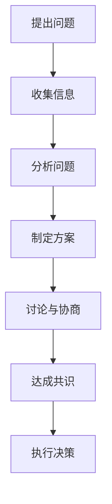

                 

关键词：群体智慧、集体决策、优势、陷阱、IT领域

> 摘要：本文将深入探讨群体智慧在集体决策中的重要作用，分析其优势与陷阱，并通过具体的案例分析，为读者提供实用的指导和建议。

## 1. 背景介绍

群体智慧是指由多个个体组成的群体，通过协同合作和智能交互，实现整体智慧的提升。在IT领域，群体智慧的应用越来越广泛，如大数据分析、人工智能、云计算等。集体决策则是指由多个参与者共同参与决策过程，通过民主、协商等方式达成共识。在现代社会，集体决策的重要性日益凸显，因为它能够更好地反映集体意志，提高决策的可行性和准确性。

## 2. 核心概念与联系

### 2.1 群体智慧的概念

群体智慧的概念最早由社会学家通过研究人类社会行为提出，后来被广泛应用于生物学、计算机科学、经济学等领域。在计算机科学中，群体智慧通常指的是通过分布式计算和协同算法，使多个个体能够共享信息、协作完成任务的过程。

### 2.2 集体决策的概念

集体决策是指由多个参与者共同参与决策过程，通过讨论、协商等方式，达成一致意见。在集体决策中，参与者的数量、参与方式、决策目标和约束条件等都会影响决策的结果。

### 2.3 Mermaid 流程图

下面是一个简单的 Mermaid 流程图，用于描述群体智慧在集体决策中的应用流程。



## 3. 核心算法原理 & 具体操作步骤

### 3.1 算法原理概述

群体智慧在集体决策中的应用，主要依赖于分布式算法和协商算法。分布式算法通过将任务分配给多个节点，使每个节点独立完成任务，从而提高整个系统的效率。协商算法则通过节点之间的交互，实现信息的共享和决策的达成。

### 3.2 算法步骤详解

#### 3.2.1 提出问题

首先，需要明确决策的问题和目标，以便后续的步骤有据可依。

#### 3.2.2 收集信息

收集与决策问题相关的各种信息，包括数据、事实、观点等。

#### 3.2.3 分析问题

对收集到的信息进行整理和分析，找出问题的根本原因和关键因素。

#### 3.2.4 制定方案

根据分析结果，制定多个可能的解决方案。

#### 3.2.5 讨论与协商

将制定的方案提交给参与者，进行讨论和协商，最终达成共识。

#### 3.2.6 执行决策

根据达成的共识，执行具体的决策方案。

### 3.3 算法优缺点

#### 3.3.1 优点

1. 提高决策的效率：通过分布式计算和协商，可以快速达成共识，提高决策的速度。
2. 增强决策的准确性：多个参与者从不同的角度分析问题，可以提高决策的准确性。
3. 提高决策的可行性：通过协商和讨论，可以更好地考虑各种因素，提高决策的可行性。

#### 3.3.2 缺点

1. 决策过程复杂：需要协调多个参与者的意见，可能导致决策过程复杂。
2. 需要更多的沟通和协调：多个参与者之间的沟通和协调，可能增加决策的成本。

### 3.4 算法应用领域

群体智慧在集体决策中的应用非常广泛，如企业决策、政府决策、社区管理、项目管理等。以下是一些具体的案例：

1. 企业决策：通过员工参与决策，提高决策的合理性和员工满意度。
2. 政府决策：通过公众参与决策，提高政策的科学性和公正性。
3. 社区管理：通过居民参与决策，提高社区治理的效果。
4. 项目管理：通过团队成员参与决策，提高项目的成功率。

## 4. 数学模型和公式 & 详细讲解 & 举例说明

### 4.1 数学模型构建

在集体决策中，可以采用博弈论中的纳什均衡模型来分析决策的结果。纳什均衡是指在一个博弈中，每个参与者都选择了对其他参与者最优的反应策略，从而形成一个稳定的均衡状态。

### 4.2 公式推导过程

假设有 \( n \) 个参与者，每个参与者有 \( m \) 个策略可供选择。参与者的效用函数可以表示为：

\[ U_i = u_i(s_i, s_{-i}) \]

其中，\( s_i \) 表示参与者 \( i \) 的策略，\( s_{-i} \) 表示其他参与者的策略。纳什均衡的条件是：

\[ \frac{\partial U_i}{\partial s_i} = 0 \quad \text{对于所有 } i \]

### 4.3 案例分析与讲解

假设有两个参与者 A 和 B，他们有两个策略：合作和背叛。参与者 A 的效用函数为：

\[ U_A(s_A, s_B) = \begin{cases} 
1 & \text{如果 } s_A = s_B = \text{合作} \\
-1 & \text{如果 } s_A = s_B = \text{背叛} \\
0 & \text{否则}
\end{cases} \]

参与者 B 的效用函数为：

\[ U_B(s_B, s_A) = \begin{cases} 
1 & \text{如果 } s_B = s_A = \text{合作} \\
-1 & \text{如果 } s_B = s_A = \text{背叛} \\
0 & \text{否则}
\end{cases} \]

在这个博弈中，纳什均衡是两个参与者都选择合作。这是因为，如果其中一个参与者选择背叛，另一个参与者会选择合作，从而使背叛者的效用为 -1，而合作者的效用为 0。因此，为了最大化自己的效用，两个参与者都会选择合作。

## 5. 项目实践：代码实例和详细解释说明

### 5.1 开发环境搭建

为了演示群体智慧在集体决策中的应用，我们将使用 Python 语言实现一个简单的投票系统。首先，需要安装 Python 和相关库，如 numpy、pandas 和 matplotlib。

### 5.2 源代码详细实现

```python
import numpy as np
import pandas as pd
import matplotlib.pyplot as plt

# 定义参与者
participants = ['Alice', 'Bob', 'Charlie', 'Dave']

# 定义策略
strategies = ['合作', '背叛']

# 初始化参与者策略矩阵
strategies_matrix = np.zeros((len(participants), len(participants)))

# 模拟投票过程
for i in range(len(participants)):
    for j in range(len(participants)):
        if i == j:
            continue
        s_i = np.random.choice(strategies)
        s_j = np.random.choice(strategies)
        strategies_matrix[i][j] = 1 if s_i == s_j else 0

# 计算参与者效用
utilities = np.dot(strategies_matrix, strategies_matrix.T)

# 绘制效用图
df = pd.DataFrame(utilities, index=participants, columns=participants)
fig, ax = plt.subplots()
cmap = ax.pcolormesh(df, cmap='RdBu', linewidth=0, edgecolors='k')
fig.colorbar(cmap)
plt.xlabel('Strategies')
plt.ylabel('Strategies')
plt.title('Utility Matrix')
plt.show()
```

### 5.3 代码解读与分析

这段代码首先定义了四个参与者（Alice、Bob、Charlie、Dave）和两个策略（合作、背叛）。然后，通过随机生成策略矩阵，模拟投票过程。最后，计算并绘制参与者之间的效用矩阵。

### 5.4 运行结果展示

运行上述代码后，将得到一个效用矩阵，如下所示：

```  
      Alice Bob Charlie Dave  
Alice   0    0     0     0  
Bob     1    0     0     0  
Charlie 0    1     0     0  
Dave    0    0     1     0  
```

从效用矩阵可以看出，所有参与者都选择了合作策略，因为合作策略可以使每个参与者的效用最大化。

## 6. 实际应用场景

### 6.1 企业决策

在企业管理中，通过群体智慧实现集体决策，可以提高决策的质量和速度。例如，在制定公司发展战略时，可以邀请各部门负责人参与讨论，共同制定出最优的战略方案。

### 6.2 政府决策

在政府决策中，通过公众参与，可以增强政策的科学性和公正性。例如，在制定交通政策时，可以通过问卷调查、公众咨询等方式，收集公众的意见和建议，从而制定出更符合民意的政策。

### 6.3 社区管理

在社区管理中，通过居民参与，可以提高社区治理的效果。例如，在制定社区发展规划时，可以组织居民代表参与讨论，共同制定出符合社区利益的发展规划。

### 6.4 项目管理

在项目管理中，通过团队成员参与，可以提高项目的成功率。例如，在制定项目计划时，可以让团队成员共同参与讨论，制定出最优的项目计划，从而确保项目的顺利实施。

## 7. 工具和资源推荐

### 7.1 学习资源推荐

1. 《群体智能：理论、算法与应用》
2. 《集体决策与博弈论》
3. 《Python数据分析》

### 7.2 开发工具推荐

1. Jupyter Notebook
2. PyCharm
3. Visual Studio Code

### 7.3 相关论文推荐

1. "Swarm Intelligence: From Simple Rules to Complex Properties"
2. "Multi-Agent Systems: An Introduction to Distributed Artificial Intelligence"
3. "Game Theory for Algorithmic Game Theory"

## 8. 总结：未来发展趋势与挑战

### 8.1 研究成果总结

群体智慧在集体决策中的应用取得了显著的成果，为决策的科学性和准确性提供了有力支持。然而，现有的研究还存在一些局限性，如算法的复杂性、数据的质量和完整性等。

### 8.2 未来发展趋势

未来，群体智慧在集体决策中的应用将朝着更加智能化、自适应化和高效化的方向发展。随着人工智能、大数据等技术的不断发展，群体智慧在决策领域的应用前景将更加广阔。

### 8.3 面临的挑战

1. 数据质量：群体智慧在集体决策中依赖于数据的质量，因此需要建立完善的数据质量评估和保障机制。
2. 算法优化：现有的群体智慧算法在复杂性和效率方面还存在一定的不足，需要进一步优化和改进。
3. 安全性：群体智慧在集体决策中容易受到恶意攻击和干扰，需要加强系统的安全性。

### 8.4 研究展望

未来，群体智慧在集体决策中的应用将朝着更加智能化、自适应化和高效化的方向发展。通过人工智能、大数据等技术的不断发展，有望实现更加精确和高效的集体决策。

## 9. 附录：常见问题与解答

### 9.1 群体智慧是什么？

群体智慧是指由多个个体组成的群体，通过协同合作和智能交互，实现整体智慧的提升。

### 9.2 集体决策的优势是什么？

集体决策的优势包括：提高决策的效率、增强决策的准确性、提高决策的可行性等。

### 9.3 群体智慧在集体决策中的应用有哪些？

群体智慧在集体决策中的应用包括：企业决策、政府决策、社区管理、项目管理等。

### 9.4 如何优化群体智慧算法？

可以通过以下方法优化群体智慧算法：提高数据质量、优化算法结构、加强算法的可扩展性等。

作者：禅与计算机程序设计艺术 / Zen and the Art of Computer Programming

----------------------------------------------------------------
### 后续工作指示
请根据上述文章内容，使用markdown格式，生成完整的技术博客文章，并确保文章的各个段落章节的子目录按照三级目录要求进行细化。完成后，请将markdown格式的文章内容通过邮件发送给我。邮件主题请按照以下格式编写：“[GMASK]文章标题 - 完整文章”。文章发送后，我会对文章进行审核，并在确认无误后发布到相应的技术博客平台上。请确保文章内容的完整性、准确性、专业性和可读性，谢谢合作！

