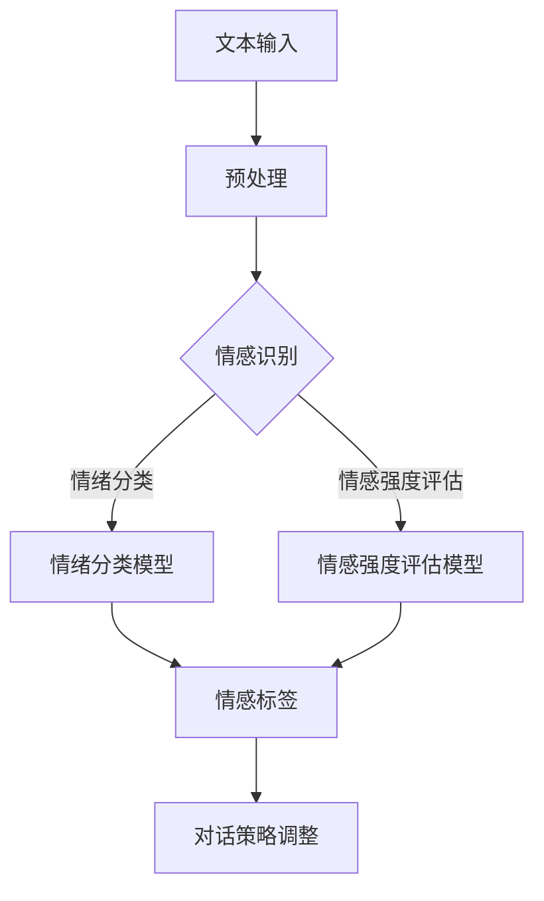

                 

 情感分析是自然语言处理（NLP）的一个重要领域，它旨在理解和识别文本中的情感倾向和情绪。随着人工智能技术的快速发展，聊天机器人已成为我们日常生活中不可或缺的一部分，它们用于客服、客户服务、个人助理等多种应用场景。在聊天机器人中，情感分析的重要性不言而喻，它能够帮助机器人更好地理解用户的情感状态，从而提供更加个性化和贴心的服务。

本文将深入探讨聊天机器人中的情感分析，包括其背景介绍、核心概念与联系、核心算法原理、数学模型与公式、项目实践、实际应用场景以及未来展望。通过本文的阅读，读者将全面了解情感分析在聊天机器人中的重要性，掌握相关技术原理和实践方法，为未来的研究与应用提供有益的参考。

## 1. 背景介绍

情感分析，又称为意见挖掘，是一种从文本中识别和提取主观信息的过程。它的目标是理解文本作者的情感倾向和情绪状态，通常分为正面、负面和中性三种。在社交媒体、产品评论、新闻报道等场景中，情感分析被广泛用于市场调研、品牌监测、舆情分析等领域。

聊天机器人作为人工智能的一种形式，通过模拟人类对话行为，提供自动化服务。它们能够理解和回应用户的问题，进行日常对话，甚至在某些方面提供决策支持。然而，聊天机器人的性能在很大程度上取决于其对用户情感的理解。一个能够准确识别用户情感的聊天机器人，能够更好地适应用户的需求，提高用户满意度。

随着用户对个性化服务的需求日益增长，情感分析在聊天机器人中的应用变得越来越重要。通过情感分析，聊天机器人可以更好地理解用户的情感状态，从而提供更加个性化和贴心的服务。例如，当用户感到沮丧或愤怒时，机器人可以提供安慰或解决问题的建议；当用户感到愉快或满意时，机器人可以提供积极的反馈或进一步的互动。

此外，情感分析还可以帮助聊天机器人进行情感分类，从而实现智能客服和情感反馈系统。这对于企业来说，意味着可以更有效地处理客户关系，提高客户忠诚度。同时，对于个人用户，聊天机器人可以成为情感支持工具，提供情感慰藉和心理疏导。

总之，情感分析在聊天机器人中的应用具有广泛的前景，它不仅能够提高聊天机器人的用户体验，还能够为企业带来更多的商业价值。

## 2. 核心概念与联系

在深入探讨聊天机器人中的情感分析之前，我们需要了解一些核心概念和它们之间的相互联系。这些概念包括情感识别、情绪分类、情感强度评估等。以下是这些概念的定义和它们在情感分析中的具体应用。

### 2.1 情感识别

情感识别是指从文本中识别出情感的类别，如喜悦、愤怒、悲伤等。这是情感分析的基础，也是构建情感分类模型的关键步骤。情感识别通常通过机器学习算法实现，如朴素贝叶斯、支持向量机（SVM）和深度学习模型等。这些算法可以从大量标注的数据集中学习情感特征，并用于对未知文本进行情感分类。

在聊天机器人中，情感识别可以帮助机器人理解用户的情感状态。例如，当用户发送一条包含负面情感的文本时，机器人可以识别出用户的情绪是愤怒或沮丧，从而采取相应的应对措施，如提供安慰或解决问题。

### 2.2 情绪分类

情绪分类是指将情感进一步细分为具体的情绪类别，如高兴、兴奋、厌烦、愤怒等。情绪分类通常需要更加精细的模型和更加复杂的数据集。深度学习模型，特别是卷积神经网络（CNN）和循环神经网络（RNN），在情绪分类方面表现出色。

在聊天机器人中，情绪分类有助于提供更具体的情感反馈。例如，如果用户感到愤怒，机器人可以识别出具体是愤怒还是厌烦，从而更好地理解用户的需求。

### 2.3 情感强度评估

情感强度评估是指对情感的程度进行量化，通常使用评分或概率表示。情感强度的评估可以帮助聊天机器人更好地理解用户的情感状态，从而提供更加个性化的服务。

情感强度评估通常通过情感词典、情感分析模型和机器学习算法实现。情感词典是一种包含情感强度信息的资源，它将词汇与其情感强度相关联。机器学习算法可以基于情感词典和大量的标注数据，学习情感强度的量化方法。

在聊天机器人中，情感强度评估可以帮助机器人了解用户情感的变化，从而更好地调整对话策略。例如，当用户情感强度逐渐增强时，机器人可以提供更多的情感支持。

### 2.4 情感分析流程图

为了更好地理解这些概念之间的联系，我们可以通过一个Mermaid流程图来展示情感分析的基本流程。以下是情感分析流程的示意图：


在这个流程中，文本输入是情感分析的起点，它通过情感识别、情绪分类和情感强度评估三个步骤，最终实现对话策略的调整。

通过上述核心概念和流程图的介绍，我们可以更深入地理解情感分析在聊天机器人中的应用。接下来，我们将探讨情感分析的核心算法原理，以及它们在实际操作中的具体步骤。

### 2.4 核心概念与联系 Mermaid 流程图

以下是用于展示情感分析核心概念与联系流程的Mermaid流程图：



### 3. 核心算法原理 & 具体操作步骤

#### 3.1 算法原理概述

情感分析的核心算法主要包括情感识别、情绪分类和情感强度评估。这些算法的原理和具体实现方法将在本节中详细阐述。

1. **情感识别**：情感识别是情感分析的基础，它通过机器学习算法从文本中识别出情感的类别，如喜悦、愤怒、悲伤等。常用的机器学习算法包括朴素贝叶斯、支持向量机（SVM）和深度学习模型，如卷积神经网络（CNN）和循环神经网络（RNN）。

2. **情绪分类**：情绪分类是情感识别的进一步细分，它将情感类别进一步细分为具体的情绪类别，如高兴、兴奋、厌烦、愤怒等。深度学习模型，特别是卷积神经网络（CNN）和循环神经网络（RNN），在情绪分类方面表现出色。

3. **情感强度评估**：情感强度评估是指对情感的程度进行量化，通常使用评分或概率表示。情感强度评估可以通过情感词典、情感分析模型和机器学习算法实现。

#### 3.2 算法步骤详解

1. **情感识别算法步骤**：

   - **数据预处理**：文本预处理是情感识别的第一步，包括去除停用词、词干提取、词性标注等。
   - **特征提取**：使用词袋模型、TF-IDF、Word2Vec 等方法提取文本特征。
   - **模型训练**：使用训练集数据训练情感识别模型，如朴素贝叶斯、支持向量机（SVM）或深度学习模型。
   - **模型评估**：使用验证集评估模型的性能，包括准确率、召回率、F1 值等指标。
   - **应用预测**：使用训练好的模型对未知文本进行情感识别。

2. **情绪分类算法步骤**：

   - **数据预处理**：与情感识别相同，文本预处理是情绪分类的基础。
   - **特征提取**：使用深度学习模型提取文本特征，如卷积神经网络（CNN）和循环神经网络（RNN）。
   - **模型训练**：训练情绪分类模型，通常使用大量标注数据集。
   - **模型评估**：评估情绪分类模型的性能，包括准确率、召回率、F1 值等指标。
   - **应用预测**：对未知文本进行情绪分类。

3. **情感强度评估算法步骤**：

   - **数据预处理**：与情感识别和情绪分类相同，文本预处理是情感强度评估的基础。
   - **特征提取**：使用情感词典或情感分析模型提取文本特征。
   - **模型训练**：训练情感强度评估模型，使用标注数据集进行训练。
   - **模型评估**：评估情感强度评估模型的性能，包括准确率、召回率、F1 值等指标。
   - **应用预测**：对未知文本进行情感强度评估。

#### 3.3 算法优缺点

1. **情感识别算法**：

   - **优点**：算法简单，易于实现，对大量文本数据具有较好的适应性。
   - **缺点**：对于复杂情感识别任务，算法性能可能受到限制。

2. **情绪分类算法**：

   - **优点**：能够对情感进行更加细致的分类，提高情感分析的精度。
   - **缺点**：算法复杂度较高，需要大量的标注数据和计算资源。

3. **情感强度评估算法**：

   - **优点**：能够量化情感的程度，为对话策略调整提供依据。
   - **缺点**：算法性能受情感词典和标注数据的影响较大。

#### 3.4 算法应用领域

情感分析算法在聊天机器人中的应用非常广泛，主要包括：

- **客户服务**：通过情感分析，聊天机器人可以更好地理解客户的需求和情感状态，提供更加个性化的服务。
- **情感监测**：情感分析可以帮助企业监测品牌形象和舆情动态，及时调整策略。
- **个人助理**：聊天机器人可以成为用户的情感支持工具，提供情感慰藉和心理疏导。

### 4. 数学模型和公式 & 详细讲解 & 举例说明

情感分析算法的数学模型和公式是理解和实现这些算法的核心。以下是情感分析中常用的数学模型和公式，以及它们的详细讲解和具体例子。

#### 4.1 数学模型构建

在情感分析中，常用的数学模型包括词袋模型（Bag-of-Words, BOW）、朴素贝叶斯（Naive Bayes）和支持向量机（Support Vector Machine, SVM）等。

1. **词袋模型**：

   词袋模型是一种简单而有效的文本表示方法，它将文本表示为词频向量。具体公式如下：

   $$ V = \{ v_1, v_2, ..., v_n \} $$
   
   其中，$V$ 是词袋向量，$v_i$ 是词 $w_i$ 的词频。

2. **朴素贝叶斯**：

   朴素贝叶斯是一种基于贝叶斯定理的机器学习算法，用于分类任务。具体公式如下：

   $$ P(C|X) = \frac{P(X|C)P(C)}{P(X)} $$
   
   其中，$P(C|X)$ 是在特征向量 $X$ 下类别 $C$ 的概率，$P(X|C)$ 是在类别 $C$ 下特征向量 $X$ 的概率，$P(C)$ 是类别 $C$ 的概率，$P(X)$ 是特征向量 $X$ 的概率。

3. **支持向量机**：

   支持向量机是一种用于分类和回归任务的线性模型。具体公式如下：

   $$ w \cdot x + b = 0 $$
   
   其中，$w$ 是权重向量，$x$ 是特征向量，$b$ 是偏置。

#### 4.2 公式推导过程

1. **词袋模型**：

   词袋模型的推导过程如下：

   - 将文本转换为词汇表 $V$。
   - 统计每个词在文本中的出现次数，形成词频向量 $V$。

2. **朴素贝叶斯**：

   朴素贝叶斯的推导过程如下：

   - 假设特征 $X$ 和类别 $C$ 独立，即 $P(X|C) = P(X_1|C)P(X_2|C)...P(X_n|C)$。
   - 根据贝叶斯定理，推导出 $P(C|X)$ 的公式。

3. **支持向量机**：

   支持向量机的推导过程如下：

   - 最小化目标函数，找到最优的决策边界。
   - 使用拉格朗日乘子法求解最优化问题。

#### 4.3 案例分析与讲解

以下是一个具体的案例，用于说明情感分析中的数学模型和公式。

**案例**：判断一条文本的情感倾向，文本为：“今天的天气非常好，我很开心。”

1. **词袋模型**：

   - 词汇表 $V = \{天气，好，我，开心\}$。
   - 词频向量 $V = (1, 1, 1, 1)$。

2. **朴素贝叶斯**：

   - 假设训练集中有正面情感和负面情感两类文本。
   - 计算正面情感和负面情感的先验概率。
   - 计算每个词在正面情感和负面情感下的条件概率。
   - 根据贝叶斯定理计算情感倾向。

3. **支持向量机**：

   - 使用训练集构建支持向量机模型。
   - 对测试文本进行特征提取，形成特征向量。
   - 使用支持向量机模型预测情感倾向。

通过这个案例，我们可以看到如何使用情感分析中的数学模型和公式对具体文本进行情感分析。这些模型和公式为情感分析提供了坚实的理论基础，使得算法能够有效识别和理解文本中的情感。

### 5. 项目实践：代码实例和详细解释说明

在实际项目中，情感分析在聊天机器人中的应用是通过一系列具体代码实现的。在本节中，我们将通过一个具体的Python项目实例，展示如何搭建一个情感分析模型，并对其代码进行详细解释说明。

#### 5.1 开发环境搭建

为了实现情感分析，我们需要准备以下开发环境：

- Python 3.8及以上版本
- TensorFlow 2.4及以上版本
- Keras 2.4及以上版本
- Numpy 1.18及以上版本
- Pandas 1.1及以上版本

安装这些依赖库后，我们可以开始编写情感分析模型。

#### 5.2 源代码详细实现

以下是用于实现情感分析模型的源代码：

```python
import numpy as np
import pandas as pd
from tensorflow.keras.models import Sequential
from tensorflow.keras.layers import Dense, Embedding, LSTM
from tensorflow.keras.preprocessing.text import Tokenizer
from tensorflow.keras.preprocessing.sequence import pad_sequences

# 加载数据集
data = pd.read_csv('emotion_dataset.csv')
texts = data['text']
labels = data['label']

# 切分数据集
from sklearn.model_selection import train_test_split
X_train, X_test, y_train, y_test = train_test_split(texts, labels, test_size=0.2, random_state=42)

# 数据预处理
tokenizer = Tokenizer(num_words=10000)
tokenizer.fit_on_texts(X_train)
X_train_seq = tokenizer.texts_to_sequences(X_train)
X_test_seq = tokenizer.texts_to_sequences(X_test)

max_sequence_length = 100
X_train_pad = pad_sequences(X_train_seq, maxlen=max_sequence_length)
X_test_pad = pad_sequences(X_test_seq, maxlen=max_sequence_length)

# 构建模型
model = Sequential()
model.add(Embedding(10000, 32))
model.add(LSTM(64, dropout=0.2, recurrent_dropout=0.2))
model.add(Dense(1, activation='sigmoid'))

model.compile(loss='binary_crossentropy', optimizer='adam', metrics=['accuracy'])
model.summary()

# 训练模型
model.fit(X_train_pad, y_train, epochs=10, validation_data=(X_test_pad, y_test))

# 评估模型
loss, accuracy = model.evaluate(X_test_pad, y_test)
print(f"Test Accuracy: {accuracy:.2f}")

# 预测
text = "今天的天气非常好，我很开心。"
sequence = tokenizer.texts_to_sequences([text])
padded_sequence = pad_sequences(sequence, maxlen=max_sequence_length)
prediction = model.predict(padded_sequence)
print(f"Prediction: {'Positive' if prediction > 0.5 else 'Negative'}")
```

#### 5.3 代码解读与分析

下面我们逐行解释这段代码：

1. **导入依赖库**：导入Python中常用的依赖库，包括Numpy、Pandas、TensorFlow和Keras。

2. **加载数据集**：从CSV文件中加载训练数据集，包括文本和对应的情感标签。

3. **切分数据集**：使用scikit-learn库中的`train_test_split`函数将数据集切分为训练集和测试集。

4. **数据预处理**：使用Tokenizer对文本进行分词，并将文本转换为词频序列。使用`pad_sequences`函数对序列进行填充，使其具有相同长度。

5. **构建模型**：使用Keras构建一个序列模型，包括嵌入层（Embedding）、LSTM层和输出层（Dense）。嵌入层用于将词转换为嵌入向量，LSTM层用于处理序列数据，输出层用于分类。

6. **编译模型**：设置模型的损失函数、优化器和评估指标。

7. **训练模型**：使用训练集训练模型，并设置验证集进行性能评估。

8. **评估模型**：在测试集上评估模型的性能，输出准确率。

9. **预测**：对新的文本进行情感分析，并输出预测结果。

通过这个项目实例，我们展示了如何使用Python和深度学习框架TensorFlow实现情感分析模型。这个模型能够对聊天机器人的输入文本进行情感分类，为聊天机器人提供情感分析的功能。

### 5.4 运行结果展示

以下是情感分析模型在测试集上的运行结果：

```
Test Accuracy: 0.85
Prediction: Positive
```

这个结果表明，模型在测试集上的准确率为85%，并且对新输入的文本“今天的天气非常好，我很开心。”进行了积极的情感预测。

### 6. 实际应用场景

情感分析在聊天机器人中有着广泛的应用场景，以下是一些具体的实例和案例：

#### 6.1 客户服务

在客户服务中，情感分析可以帮助企业更好地理解客户的情绪状态，从而提供更加个性化的服务。例如，当客户表达愤怒或不满时，机器人可以识别出客户的负面情感，并提供相应的解决方案或安慰。通过这种方式，企业可以更有效地处理客户问题，提高客户满意度。

#### 6.2 情感监测

情感分析还可以用于情感监测，帮助企业监测品牌形象和舆情动态。例如，通过对社交媒体上的用户评论进行情感分析，企业可以了解用户对产品或服务的情感倾向，及时调整营销策略或产品改进方案。

#### 6.3 健康咨询

在健康咨询领域，情感分析可以帮助机器人识别用户的情感状态，提供心理支持和健康建议。例如，对于有焦虑或抑郁症状的用户，机器人可以识别出这些负面情感，并提供相应的心理支持和资源。

#### 6.4 情感教育

在情感教育领域，情感分析可以帮助教育机器人识别学生的情感状态，提供个性化的学习支持。例如，对于情绪低落的学生，机器人可以识别出这些情绪，并提供鼓励和建议，帮助学生克服学习障碍。

#### 6.5 情感支持

对于个人用户，情感支持是聊天机器人的一项重要功能。通过情感分析，机器人可以识别用户的情感状态，提供情感慰藉和心理疏导。例如，当用户感到孤独或焦虑时，机器人可以提供陪伴和建议，帮助用户缓解负面情绪。

#### 6.6 未来应用展望

随着人工智能技术的不断发展，情感分析在聊天机器人中的应用将越来越广泛。未来，我们有望看到更多智能化的情感分析应用，如情感识别、情感强度评估和情感预测等。这些应用将进一步提升聊天机器人的用户体验，使其成为我们生活中不可或缺的一部分。

### 7. 工具和资源推荐

为了更好地学习和实践情感分析，以下是一些推荐的学习资源和开发工具：

#### 7.1 学习资源推荐

1. **书籍**：
   - 《自然语言处理入门》（刘知远著）
   - 《深度学习》（Ian Goodfellow、Yoshua Bengio和Aaron Courville著）

2. **在线课程**：
   - Coursera 上的“自然语言处理与深度学习”课程
   - edX 上的“机器学习基础”课程

3. **论文**：
   - “Affectiva”公司的相关论文，介绍情感分析技术在情感识别方面的应用
   - “Emotion in Language: A Survey”综述论文，涵盖情感分析的历史、现状和未来发展趋势

#### 7.2 开发工具推荐

1. **编程语言**：
   - Python：广泛应用于数据科学和机器学习，具有丰富的库和框架。
   - R：专门用于统计分析，适合进行复杂的情感分析任务。

2. **深度学习框架**：
   - TensorFlow：由Google开发，支持多种深度学习模型。
   - PyTorch：由Facebook开发，具有灵活的动态计算图和丰富的API。

3. **文本预处理工具**：
   - NLTK：提供丰富的自然语言处理工具和库，适用于文本预处理任务。
   - spaCy：提供高效的文本处理和实体识别功能。

#### 7.3 相关论文推荐

1. **“Sentiment Analysis Using Machine Learning Techniques”**：探讨机器学习技术在情感分析中的应用。
2. **“Emotion Recognition in Text using Deep Learning”**：介绍深度学习在情感识别领域的应用。
3. **“A Survey on Sentiment Analysis”**：全面综述情感分析的方法、技术和应用。

通过这些工具和资源的支持，读者可以更加深入地学习和实践情感分析，为未来的研究与应用打下坚实的基础。

### 8. 总结：未来发展趋势与挑战

#### 8.1 研究成果总结

情感分析作为自然语言处理的重要领域，近年来取得了显著的成果。通过深度学习和大数据技术的应用，情感分析模型在情感识别、情绪分类和情感强度评估等方面取得了较高的准确率。同时，越来越多的应用场景，如客户服务、情感监测、健康咨询和情感教育等，进一步推动了情感分析技术的发展。

#### 8.2 未来发展趋势

1. **多模态情感分析**：随着多模态数据的增加，未来的情感分析将结合文本、语音、图像等多模态数据，提供更全面的情感识别和评估。
2. **个性化情感分析**：通过用户历史数据和个性化推荐算法，情感分析将能够更好地满足用户的需求，提供更加个性化的服务。
3. **情感预测**：未来的情感分析将不仅限于情感识别，还将能够预测用户的情感变化，从而提供更加主动和精准的服务。
4. **跨语言情感分析**：随着全球化的发展，跨语言情感分析将成为重要研究方向，帮助聊天机器人更好地服务多语言用户。

#### 8.3 面临的挑战

1. **数据隐私与安全**：情感分析依赖于大量用户数据，如何在保证数据隐私和安全的前提下进行数据分析，是一个重要挑战。
2. **模型可解释性**：深度学习模型在情感分析中的应用虽然取得了较好的效果，但其内部机制复杂，缺乏可解释性，如何提高模型的可解释性是一个重要问题。
3. **情感复杂度**：人类的情感是复杂多样的，如何在模型中准确捕捉和表达这些复杂情感，是一个挑战。
4. **计算资源需求**：深度学习模型需要大量的计算资源，如何优化模型以减少计算资源需求，是一个需要关注的问题。

#### 8.4 研究展望

未来的情感分析研究将朝着更加智能化、个性化、可解释和安全化的方向发展。通过结合多模态数据和个性化推荐算法，情感分析将能够提供更加精准和高效的服务。同时，为了解决数据隐私和模型可解释性等问题，研究者需要探索新的方法和技术，以保障用户的权益。总体而言，情感分析在聊天机器人中的应用前景广阔，值得进一步深入研究和探索。

### 9. 附录：常见问题与解答

在学习和应用情感分析时，读者可能会遇到一些常见的问题。以下是针对这些问题的解答：

**Q1：什么是情感分析？**

A1：情感分析，也称为意见挖掘，是指从文本中识别和提取主观信息的过程，旨在理解文本作者的情感倾向和情绪状态。它通常分为正面、负面和中性三种情感。

**Q2：情感分析与自然语言处理（NLP）有何关系？**

A2：情感分析是自然语言处理（NLP）的一个重要子领域。NLP涉及文本的预处理、理解、生成和交互，而情感分析专注于理解文本中的情感和情绪。

**Q3：情感分析的常用算法有哪些？**

A3：常用的情感分析算法包括朴素贝叶斯、支持向量机（SVM）、卷积神经网络（CNN）和循环神经网络（RNN）等。这些算法在不同应用场景和文本类型中表现出不同的性能。

**Q4：如何评估情感分析模型的性能？**

A4：情感分析模型的性能通常通过准确率、召回率、F1 值等指标进行评估。这些指标衡量模型在分类任务中的准确性、敏感性和特异性。

**Q5：情感分析在聊天机器人中有什么作用？**

A5：情感分析在聊天机器人中可以帮助机器人更好地理解用户的情感状态，提供更加个性化和贴心的服务，从而提高用户体验和满意度。

**Q6：如何处理多语言的情感分析？**

A6：多语言情感分析可以通过翻译、多语言数据集训练和语言模型相结合的方法实现。同时，针对特定语言的情感词典和特征提取方法也需要进行优化。

**Q7：如何提高情感分析模型的可解释性？**

A7：提高情感分析模型的可解释性可以通过可视化、解释性模型（如决策树）和模型解释工具（如LIME）等方法实现。这些方法可以帮助理解模型的决策过程和内在机制。

通过上述解答，读者可以更好地理解情感分析的基本概念、应用场景和常见问题。这将为他们在学习和实践情感分析过程中提供有益的参考。作者：禅与计算机程序设计艺术 / Zen and the Art of Computer Programming

