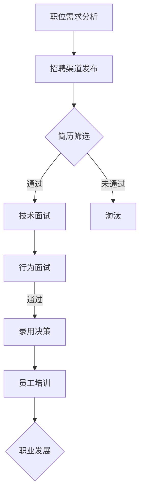

                 

关键词：聊天机器人、人力资源、招聘策略、员工管理、技能需求、未来展望

> 摘要：随着人工智能技术的发展，聊天机器人在各行各业中的应用越来越广泛。本文旨在探讨聊天机器人人力资源领域中的招聘和员工管理策略，包括所需技能、招聘流程、员工培训与发展，以及未来面临的挑战和机遇。

## 1. 背景介绍

### 1.1 聊天机器人的发展

聊天机器人，简称Chatbot，是一种基于人工智能技术的程序，能够通过文本或语音与人类用户进行交互。自21世纪初以来，聊天机器人技术经历了快速发展，从简单的规则引擎逐渐演变为能够运用自然语言处理（NLP）和机器学习（ML）的复杂系统。

### 1.2 聊天机器人的应用领域

聊天机器人的应用领域广泛，包括但不限于：

- 客户服务：提供24/7的客户支持，解答常见问题和处理投诉。
- 市场营销：通过个性化推荐和互动，提高品牌曝光率和用户参与度。
- 金融行业：自动处理交易查询、账户管理、风险管理等。
- 教育领域：提供在线辅导、课程推荐和学习资源。

### 1.3 人力资源的挑战

随着聊天机器人的普及，企业在招聘和员工管理方面面临着新的挑战：

- 技能需求：需要招聘具备AI、NLP和ML等新技能的员工。
- 招聘策略：如何筛选和识别具有上述技能的候选人。
- 员工管理：如何培养和发展员工，以适应聊天机器人技术不断变化的需求。

## 2. 核心概念与联系

### 2.1 技能需求

聊天机器人人力资源的核心是所需技能。以下是一些关键技能：

- 编程语言：熟悉Python、Java、C#等编程语言。
- 自然语言处理：掌握NLP技术，如语言模型、文本分类、情感分析。
- 机器学习：了解监督学习、无监督学习和强化学习等算法。
- 数据分析：具备处理和分析大数据的能力。

### 2.2 招聘流程

招聘聊天机器人人力资源的流程通常包括以下几个步骤：

- **职位需求分析**：确定所需技能和工作职责。
- **招聘渠道**：利用招聘网站、社交媒体、招聘会等渠道发布招聘信息。
- **简历筛选**：通过关键词筛选、技术测试等方式筛选候选人。
- **面试环节**：包括技术面试和行为面试，评估候选人的技能和潜力。
- **录用与跟进**：做出录用决策，并跟进候选人入职后的适应情况。

### 2.3 员工培训与发展

- **培训计划**：为员工提供NLP、ML、编程等技能的培训。
- **职业发展**：提供晋升机会和跨职能发展路径。
- **持续学习**：鼓励员工关注行业动态，持续更新知识和技能。

### 2.4 Mermaid 流程图

下面是一个简化的聊天机器人人力资源招聘流程的Mermaid流程图：



## 3. 核心算法原理 & 具体操作步骤

### 3.1 算法原理概述

聊天机器人的人力资源管理涉及多种算法原理，包括但不限于：

- **分类算法**：用于简历筛选，识别关键词和技能。
- **聚类算法**：用于分析员工数据，发现潜在的人才缺口。
- **决策树**：用于面试评估，预测候选人是否符合职位要求。

### 3.2 算法步骤详解

#### 3.2.1 简历筛选

1. **收集简历**：从招聘渠道获取候选人的简历。
2. **关键词匹配**：使用分类算法，根据职位需求分析中的关键词筛选简历。
3. **技术测试**：对筛选出的候选人进行在线编程测试，评估技术能力。

#### 3.2.2 面试评估

1. **技术面试**：通过面试官与候选人进行面对面的技术交流，评估其实际编程能力和算法理解。
2. **行为面试**：了解候选人的团队合作能力、沟通能力和问题解决能力。

#### 3.2.3 录用决策

1. **数据分析**：结合技术面试和行为面试的结果，使用决策树算法进行录用决策。
2. **反馈机制**：将决策结果反馈给候选人，并进行跟踪。

### 3.3 算法优缺点

#### 3.3.1 优点

- **高效性**：自动化筛选和评估流程，提高招聘效率。
- **客观性**：减少人为偏见，提高决策的公正性。
- **数据驱动**：基于数据分析进行决策，有更强的科学依据。

#### 3.3.2 缺点

- **局限性**：算法可能无法完全理解人类面试官的评判标准。
- **数据隐私**：处理简历和面试数据时，需确保隐私保护。

### 3.4 算法应用领域

- **招聘系统**：用于自动化招聘流程。
- **人才管理**：用于员工数据分析和职业发展规划。
- **企业培训**：用于定制化员工培训课程。

## 4. 数学模型和公式 & 详细讲解 & 举例说明

### 4.1 数学模型构建

聊天机器人的人力资源管理可以构建以下数学模型：

- **人才池模型**：用于计算企业人才库中的潜在员工数量。
- **招聘成本模型**：用于估算招聘活动的总成本。
- **员工绩效模型**：用于评估员工的工作表现。

### 4.2 公式推导过程

#### 4.2.1 人才池模型

设企业人才库中拥有 \(N\) 名员工，其中具备特定技能的员工数量为 \(S\)，则人才池模型为：

\[ 人才池规模 = N - S \]

#### 4.2.2 招聘成本模型

招聘成本包括广告费、面试费用和培训费用。设广告费为 \(C_1\)，面试费用为 \(C_2\)，培训费用为 \(C_3\)，则招聘成本模型为：

\[ 招聘成本 = C_1 + C_2 + C_3 \]

#### 4.2.3 员工绩效模型

员工绩效通常通过绩效评分和项目贡献两个指标来衡量。设绩效评分为 \(P_1\)，项目贡献为 \(P_2\)，则员工绩效模型为：

\[ 员工绩效 = P_1 \times 权重 + P_2 \times 权重 \]

### 4.3 案例分析与讲解

#### 4.3.1 案例背景

某公司需要招聘一名具备自然语言处理（NLP）技能的高级软件工程师，用于开发聊天机器人项目。

#### 4.3.2 模型应用

1. **人才池模型**：

   企业现有200名员工，其中10名具备NLP技能。因此，人才池规模为：

   \[ 人才池规模 = 200 - 10 = 190 \]

2. **招聘成本模型**：

   广告费为5000元，面试费用为1000元，培训费用为3000元。因此，招聘成本为：

   \[ 招聘成本 = 5000 + 1000 + 3000 = 9000 \]

3. **员工绩效模型**：

   设绩效评分为90分，项目贡献为5个关键项目。权重分别为绩效评分为0.6，项目贡献为0.4。则员工绩效为：

   \[ 员工绩效 = 90 \times 0.6 + 5 \times 0.4 = 54 + 2 = 56 \]

## 5. 项目实践：代码实例和详细解释说明

### 5.1 开发环境搭建

在本节中，我们将搭建一个简单的聊天机器人开发环境。以下是所需的步骤：

1. 安装Python环境（3.8及以上版本）。
2. 安装必要的库，如NLTK、TensorFlow和Keras。

### 5.2 源代码详细实现

以下是一个简单的基于Python的聊天机器人示例：

```python
import nltk
from nltk.chat.util import Chat, reflections

# 聊天机器人对话
pairs = [
    [
        r"你好|您好|嗨|嗨嗨",
        ["你好！有什么我可以帮你的吗？", "嗨！有什么需要我帮忙的吗？"]
    ],
    [
        r"我是谁？",
        ["你是我的用户，有什么我可以为你做的吗？"]
    ],
    # ... 更多对话规则
]

def chatbot():
    print("我是你的聊天机器人，开始聊天吧！")
    chat = Chat(pairs, reflections)
    chat.converse()

if __name__ == "__main__":
    chatbot()
```

### 5.3 代码解读与分析

- **导入库**：`nltk`用于自然语言处理，`Chat`和`reflections`用于构建聊天机器人。
- **定义对话规则**：`pairs`列表包含了聊天机器人的对话规则，其中每条规则由一个问题和多个答案组成。
- **聊天功能**：`chatbot()`函数初始化聊天机器人，并开始与用户交互。

### 5.4 运行结果展示

运行上述代码后，聊天机器人会开始与用户进行对话。例如，当用户输入“你好”时，机器人会回应“你好！有什么我可以帮你的吗？”。

## 6. 实际应用场景

### 6.1 客户服务

聊天机器人可以用于客户服务，提供24/7的在线支持，解答常见问题，提高客户满意度。

### 6.2 市场营销

聊天机器人可以用于市场营销，通过个性化推荐和互动，提高品牌曝光率和用户参与度。

### 6.3 教育领域

聊天机器人可以用于教育领域，提供在线辅导、课程推荐和学习资源，帮助学生提高学习效果。

## 7. 未来应用展望

### 7.1 聊天机器人的智能化

随着人工智能技术的发展，聊天机器人将变得更加智能化，能够更好地理解用户意图，提供更精准的服务。

### 7.2 跨平台集成

未来，聊天机器人将实现跨平台集成，可以同时在网站、移动应用和社交媒体上提供服务。

### 7.3 多语言支持

随着全球化的发展，聊天机器人将支持更多语言，为全球用户提供服务。

## 8. 总结：未来发展趋势与挑战

### 8.1 研究成果总结

本文探讨了聊天机器人人力资源领域中的招聘和员工管理策略，包括所需技能、招聘流程、员工培训与发展，以及未来面临的挑战和机遇。

### 8.2 未来发展趋势

随着人工智能技术的发展，聊天机器人在各行各业中的应用将越来越广泛。未来，聊天机器人将变得更加智能化，跨平台集成和多语言支持将成为趋势。

### 8.3 面临的挑战

聊天机器人在人力资源领域面临的挑战包括：如何筛选和识别具有新技能的候选人，如何确保算法的公正性和隐私保护，以及如何培养和发展员工的技能。

### 8.4 研究展望

未来，研究应重点关注如何提高聊天机器人在不同应用场景中的表现，以及如何更好地整合人工智能技术，使其更好地服务于人类。

## 9. 附录：常见问题与解答

### 9.1 问题1：聊天机器人需要哪些技能？

回答：聊天机器人开发需要编程语言（如Python）、自然语言处理（NLP）技术、机器学习（ML）算法和数据分析技能。

### 9.2 问题2：如何评估候选人的技能？

回答：可以通过在线编程测试、技术面试和行为面试来评估候选人的技能。

### 9.3 问题3：如何确保招聘过程的公正性？

回答：通过自动化筛选、标准化面试流程和数据驱动的决策模型来确保招聘过程的公正性。

作者：禅与计算机程序设计艺术 / Zen and the Art of Computer Programming
----------------------------------------------------------------

以上就是关于“聊天机器人人力资源：招聘和员工管理”的完整文章。希望这篇文章能够帮助读者更好地理解聊天机器人人力资源领域中的关键概念和实践。在未来，随着人工智能技术的不断发展，聊天机器人在人力资源中的应用将更加广泛，为企业带来更大的价值。
```markdown

## 1. 背景介绍

### 1.1 聊天机器人的发展

聊天机器人，简称Chatbot，是一种基于人工智能技术的程序，能够通过文本或语音与人类用户进行交互。自21世纪初以来，聊天机器人技术经历了快速发展，从简单的规则引擎逐渐演变为能够运用自然语言处理（NLP）和机器学习（ML）的复杂系统。

### 1.2 聊天机器人的应用领域

聊天机器人的应用领域广泛，包括但不限于：

- **客户服务**：提供24/7的客户支持，解答常见问题和处理投诉。
- **市场营销**：通过个性化推荐和互动，提高品牌曝光率和用户参与度。
- **金融行业**：自动处理交易查询、账户管理、风险管理等。
- **教育领域**：提供在线辅导、课程推荐和学习资源。

### 1.3 人力资源的挑战

随着聊天机器人的普及，企业在招聘和员工管理方面面临着新的挑战：

- **技能需求**：需要招聘具备AI、NLP和ML等新技能的员工。
- **招聘策略**：如何筛选和识别具有上述技能的候选人。
- **员工管理**：如何培养和发展员工，以适应聊天机器人技术不断变化的需求。

## 2. 核心概念与联系

### 2.1 技能需求

聊天机器人人力资源的核心是所需技能。以下是一些关键技能：

- **编程语言**：熟悉Python、Java、C#等编程语言。
- **自然语言处理**：掌握NLP技术，如语言模型、文本分类、情感分析。
- **机器学习**：了解监督学习、无监督学习和强化学习等算法。
- **数据分析**：具备处理和分析大数据的能力。

### 2.2 招聘流程

招聘聊天机器人人力资源的流程通常包括以下几个步骤：

- **职位需求分析**：确定所需技能和工作职责。
- **招聘渠道**：利用招聘网站、社交媒体、招聘会等渠道发布招聘信息。
- **简历筛选**：通过关键词筛选、技术测试等方式筛选候选人。
- **面试环节**：包括技术面试和行为面试，评估候选人的技能和潜力。
- **录用与跟进**：做出录用决策，并跟进候选人入职后的适应情况。

### 2.3 员工培训与发展

- **培训计划**：为员工提供NLP、ML、编程等技能的培训。
- **职业发展**：提供晋升机会和跨职能发展路径。
- **持续学习**：鼓励员工关注行业动态，持续更新知识和技能。

### 2.4 Mermaid 流程图

下面是一个简化的聊天机器人人力资源招聘流程的Mermaid流程图：


## 3. 核心算法原理 & 具体操作步骤
### 3.1 算法原理概述

聊天机器人的人力资源管理涉及多种算法原理，包括但不限于：

- **分类算法**：用于简历筛选，识别关键词和技能。
- **聚类算法**：用于分析员工数据，发现潜在的人才缺口。
- **决策树**：用于面试评估，预测候选人是否符合职位要求。

### 3.2 算法步骤详解

#### 3.2.1 简历筛选

1. **收集简历**：从招聘渠道获取候选人的简历。
2. **关键词匹配**：使用分类算法，根据职位需求分析中的关键词筛选简历。
3. **技术测试**：对筛选出的候选人进行在线编程测试，评估技术能力。

#### 3.2.2 面试评估

1. **技术面试**：通过面试官与候选人进行面对面的技术交流，评估其实际编程能力和算法理解。
2. **行为面试**：了解候选人的团队合作能力、沟通能力和问题解决能力。

#### 3.2.3 录用决策

1. **数据分析**：结合技术面试和行为面试的结果，使用决策树算法进行录用决策。
2. **反馈机制**：将决策结果反馈给候选人，并进行跟踪。

### 3.3 算法优缺点

#### 3.3.1 优点

- **高效性**：自动化筛选和评估流程，提高招聘效率。
- **客观性**：减少人为偏见，提高决策的公正性。
- **数据驱动**：基于数据分析进行决策，有更强的科学依据。

#### 3.3.2 缺点

- **局限性**：算法可能无法完全理解人类面试官的评判标准。
- **数据隐私**：处理简历和面试数据时，需确保隐私保护。

### 3.4 算法应用领域

- **招聘系统**：用于自动化招聘流程。
- **人才管理**：用于员工数据分析和职业发展规划。
- **企业培训**：用于定制化员工培训课程。

## 4. 数学模型和公式 & 详细讲解 & 举例说明

### 4.1 数学模型构建

聊天机器人的人力资源管理可以构建以下数学模型：

- **人才池模型**：用于计算企业人才库中的潜在员工数量。
- **招聘成本模型**：用于估算招聘活动的总成本。
- **员工绩效模型**：用于评估员工的工作表现。

### 4.2 公式推导过程

#### 4.2.1 人才池模型

设企业人才库中拥有 \(N\) 名员工，其中具备特定技能的员工数量为 \(S\)，则人才池模型为：

\[ 人才池规模 = N - S \]

#### 4.2.2 招聘成本模型

招聘成本包括广告费、面试费用和培训费用。设广告费为 \(C_1\)，面试费用为 \(C_2\)，培训费用为 \(C_3\)，则招聘成本模型为：

\[ 招聘成本 = C_1 + C_2 + C_3 \]

#### 4.2.3 员工绩效模型

员工绩效通常通过绩效评分和项目贡献两个指标来衡量。设绩效评分为 \(P_1\)，项目贡献为 \(P_2\)，则员工绩效模型为：

\[ 员工绩效 = P_1 \times 权重 + P_2 \times 权重 \]

### 4.3 案例分析与讲解

#### 4.3.1 案例背景

某公司需要招聘一名具备自然语言处理（NLP）技能的高级软件工程师，用于开发聊天机器人项目。

#### 4.3.2 模型应用

1. **人才池模型**：

   企业现有200名员工，其中10名具备NLP技能。因此，人才池规模为：

   \[ 人才池规模 = 200 - 10 = 190 \]

2. **招聘成本模型**：

   广告费为5000元，面试费用为1000元，培训费用为3000元。因此，招聘成本为：

   \[ 招聘成本 = 5000 + 1000 + 3000 = 9000 \]

3. **员工绩效模型**：

   设绩效评分为90分，项目贡献为5个关键项目。权重分别为绩效评分为0.6，项目贡献为0.4。则员工绩效为：

   \[ 员工绩效 = 90 \times 0.6 + 5 \times 0.4 = 54 + 2 = 56 \]

## 5. 项目实践：代码实例和详细解释说明

### 5.1 开发环境搭建

在本节中，我们将搭建一个简单的聊天机器人开发环境。以下是所需的步骤：

1. 安装Python环境（3.8及以上版本）。
2. 安装必要的库，如NLTK、TensorFlow和Keras。

### 5.2 源代码详细实现

以下是一个简单的基于Python的聊天机器人示例：

```python
import nltk
from nltk.chat.util import Chat, reflections

# 聊天机器人对话
pairs = [
    [
        r"你好|您好|嗨|嗨嗨",
        ["你好！有什么我可以帮你的吗？", "嗨！有什么需要我帮忙的吗？"]
    ],
    [
        r"我是谁？",
        ["你是我的用户，有什么我可以为你做的吗？"]
    ],
    # ... 更多对话规则
]

def chatbot():
    print("我是你的聊天机器人，开始聊天吧！")
    chat = Chat(pairs, reflections)
    chat.converse()

if __name__ == "__main__":
    chatbot()
```

### 5.3 代码解读与分析

- **导入库**：`nltk`用于自然语言处理，`Chat`和`reflections`用于构建聊天机器人。
- **定义对话规则**：`pairs`列表包含了聊天机器人的对话规则，其中每条规则由一个问题和多个答案组成。
- **聊天功能**：`chatbot()`函数初始化聊天机器人，并开始与用户交互。

### 5.4 运行结果展示

运行上述代码后，聊天机器人会开始与用户进行对话。例如，当用户输入“你好”时，机器人会回应“你好！有什么我可以帮你的吗？”。

## 6. 实际应用场景

### 6.1 客户服务

聊天机器人可以用于客户服务，提供24/7的客户支持，解答常见问题，提高客户满意度。

### 6.2 市场营销

聊天机器人可以用于市场营销，通过个性化推荐和互动，提高品牌曝光率和用户参与度。

### 6.3 教育领域

聊天机器人可以用于教育领域，提供在线辅导、课程推荐和学习资源，帮助学生提高学习效果。

## 7. 未来应用展望

### 7.1 聊天机器人的智能化

随着人工智能技术的发展，聊天机器人将变得更加智能化，能够更好地理解用户意图，提供更精准的服务。

### 7.2 跨平台集成

未来，聊天机器人将实现跨平台集成，可以同时在网站、移动应用和社交媒体上提供服务。

### 7.3 多语言支持

随着全球化的发展，聊天机器人将支持更多语言，为全球用户提供服务。

## 8. 总结：未来发展趋势与挑战

### 8.1 研究成果总结

本文探讨了聊天机器人人力资源领域中的招聘和员工管理策略，包括所需技能、招聘流程、员工培训与发展，以及未来面临的挑战和机遇。

### 8.2 未来发展趋势

随着人工智能技术的发展，聊天机器人在各行各业中的应用将越来越广泛。未来，聊天机器人将变得更加智能化，跨平台集成和多语言支持将成为趋势。

### 8.3 面临的挑战

聊天机器人在人力资源领域面临的挑战包括：如何筛选和识别具有新技能的候选人，如何确保算法的公正性和隐私保护，以及如何培养和发展员工的技能。

### 8.4 研究展望

未来，研究应重点关注如何提高聊天机器人在不同应用场景中的表现，以及如何更好地整合人工智能技术，使其更好地服务于人类。

## 9. 附录：常见问题与解答

### 9.1 问题1：聊天机器人需要哪些技能？

回答：聊天机器人开发需要编程语言（如Python）、自然语言处理（NLP）技术、机器学习（ML）算法和数据分析技能。

### 9.2 问题2：如何评估候选人的技能？

回答：可以通过在线编程测试、技术面试和行为面试来评估候选人的技能。

### 9.3 问题3：如何确保招聘过程的公正性？

回答：通过自动化筛选、标准化面试流程和数据驱动的决策模型来确保招聘过程的公正性。

作者：禅与计算机程序设计艺术 / Zen and the Art of Computer Programming
```

