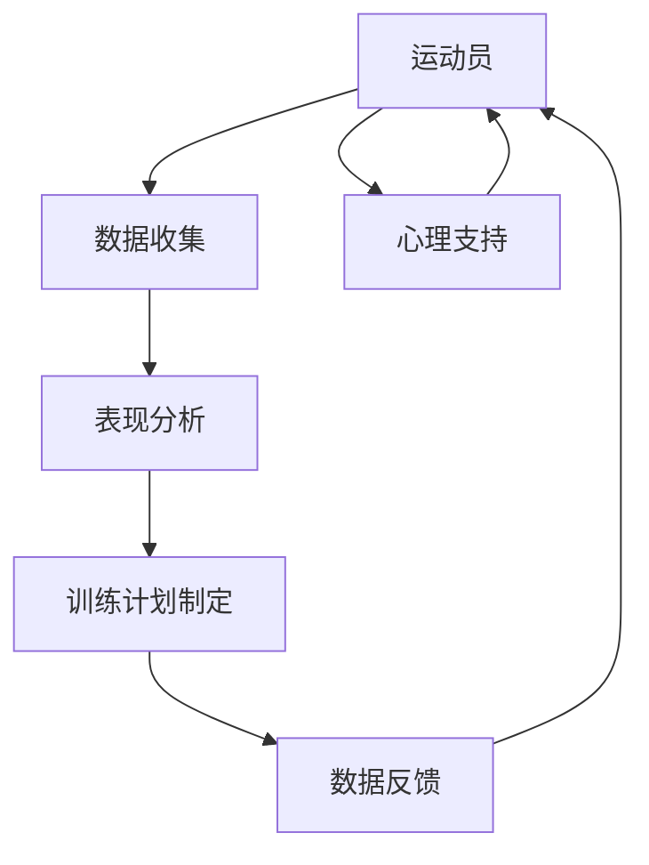

                 

关键词：聊天机器人，体育业，运动员表现分析，训练计划，人工智能，算法，数学模型，代码实例

> 摘要：本文探讨了聊天机器人在体育业中的应用，特别是在运动员表现分析和训练计划制定方面的潜力。通过分析现有技术，提出了一个基于人工智能的聊天机器人系统架构，并详细介绍了核心算法原理、数学模型构建以及实际应用实例。文章还对未来发展趋势与挑战进行了展望，为体育领域的专业人士提供了有益的参考。

## 1. 背景介绍

在当今快速发展的科技时代，人工智能（AI）技术已经成为各行各业不可或缺的工具。体育业作为全球重要的产业之一，同样受益于AI技术的应用。运动员表现分析和训练计划制定是体育行业的关键环节，直接影响到运动员的成绩和职业生涯。传统的运动员表现分析方法主要依赖于教练的主观判断和经验，而训练计划制定则依赖于运动员的体能测试和表现数据。这些方法在某种程度上具有局限性，难以满足现代体育对精准化、个性化需求的追求。

随着AI技术的发展，特别是聊天机器人技术的进步，为体育业提供了新的机遇。聊天机器人可以通过自然语言处理（NLP）技术，与运动员、教练和体育管理团队进行交互，获取和整合大量的训练和比赛数据，从而实现更加精准的表现分析和个性化的训练计划制定。此外，聊天机器人还可以为运动员提供心理支持和健康指导，提高其整体竞技水平。

本文旨在探讨聊天机器人在体育业中的应用，特别是运动员表现分析和训练计划制定方面的潜力。通过对现有技术的分析，提出一个基于人工智能的聊天机器人系统架构，并详细介绍核心算法原理、数学模型构建以及实际应用实例。文章还将对未来发展趋势与挑战进行展望，为体育领域的专业人士提供有益的参考。

## 2. 核心概念与联系

### 2.1. 聊天机器人

聊天机器人是一种基于人工智能技术的软件程序，能够模拟人类对话，通过自然语言处理（NLP）与用户进行交互。聊天机器人可以应用于多种场景，如客户服务、咨询、娱乐等。在体育领域，聊天机器人可以与运动员、教练和体育管理团队进行交互，提供个性化服务。

### 2.2. 运动员表现分析

运动员表现分析是指对运动员在训练和比赛中的各项指标进行量化分析，以评估其竞技状态和潜力。常用的表现分析指标包括体能、技术、战术、心理等方面。运动员表现分析对于优化训练计划、提升竞技水平具有重要意义。

### 2.3. 训练计划制定

训练计划制定是指根据运动员的表现分析结果，制定合理的训练计划，以提升运动员的竞技水平。训练计划应包括体能训练、技术训练、战术训练、心理训练等方面。个性化的训练计划能够更好地满足运动员的需求，提高训练效果。

### 2.4. 人工智能

人工智能是指模拟、延伸和扩展人的智能的理论、方法、技术及应用。在体育领域，人工智能可以用于运动员表现分析、训练计划制定、比赛策略分析等方面，为体育行业提供智能化支持。

### 2.5. 聊天机器人与体育业

聊天机器人与体育业的结合主要体现在运动员表现分析和训练计划制定方面。通过聊天机器人，可以实时获取运动员的反馈和训练数据，进行表现分析，并根据分析结果制定个性化的训练计划。此外，聊天机器人还可以为运动员提供心理支持和健康指导，提高整体竞技水平。

### 2.6. Mermaid 流程图

以下是一个简化的聊天机器人体育业应用架构的 Mermaid 流程图，展示了各个核心概念之间的联系。



## 3. 核心算法原理 & 具体操作步骤

### 3.1. 算法原理概述

聊天机器人体育业应用的核心算法主要包括自然语言处理（NLP）、机器学习和数据挖掘等。NLP技术用于处理运动员和聊天机器人的对话，提取关键信息；机器学习算法用于分析运动员的表现数据，预测其竞技状态和潜力；数据挖掘算法用于发现运动员之间的关联特征，为训练计划制定提供依据。

### 3.2. 算法步骤详解

#### 3.2.1. 数据收集

数据收集是整个算法的基础。聊天机器人通过与运动员、教练和体育管理团队的互动，收集运动员的日常训练、比赛数据、心理状态等信息。数据来源包括聊天记录、体能测试结果、比赛录像等。

#### 3.2.2. 表现分析

表现分析是对收集到的数据进行分析，以评估运动员的竞技状态和潜力。主要步骤包括：

1. 数据清洗：去除重复、无效和错误的数据。
2. 特征提取：从原始数据中提取关键特征，如速度、力量、耐力等。
3. 模型训练：使用机器学习算法，对提取的特征进行建模，以预测运动员的竞技状态和潜力。

#### 3.2.3. 训练计划制定

训练计划制定是基于表现分析结果，为运动员制定个性化的训练计划。主要步骤包括：

1. 目标设定：根据运动员的竞技状态和潜力，设定合理的训练目标。
2. 训练方案设计：根据目标，设计适合运动员的训练方案，包括体能训练、技术训练、战术训练、心理训练等。
3. 计划调整：根据运动员的反馈和训练效果，调整训练计划。

#### 3.2.4. 数据反馈

数据反馈是训练计划实施的重要环节。聊天机器人通过与运动员的互动，收集训练过程中的反馈信息，如训练感受、身体状况等。这些反馈信息用于调整训练计划和评估训练效果。

### 3.3. 算法优缺点

#### 优点

1. 个性化：基于运动员的实际情况，制定个性化的训练计划，提高训练效果。
2. 实时性：实时收集和分析运动员的数据，为教练和运动员提供及时的信息支持。
3. 高效性：自动化处理大量数据，减轻教练的工作负担，提高工作效率。

#### 缺点

1. 数据质量：数据收集过程中，可能存在数据缺失、噪声等问题，影响算法效果。
2. 算法适应性：算法需要不断调整和优化，以适应不同运动员和运动项目的需求。

### 3.4. 算法应用领域

算法在体育领域的应用广泛，包括运动员表现分析、训练计划制定、比赛策略分析等。此外，算法还可以应用于体育管理、体育医疗等领域，为体育行业提供智能化支持。

## 4. 数学模型和公式 & 详细讲解 & 举例说明

### 4.1. 数学模型构建

在聊天机器人体育业应用中，数学模型主要用于运动员表现分析和训练计划制定。以下是一个简化的数学模型构建过程：

1. 数据预处理：对原始数据进行清洗和标准化处理。
2. 特征提取：从预处理后的数据中提取关键特征，如速度、力量、耐力等。
3. 模型选择：选择合适的机器学习算法，如线性回归、决策树、神经网络等。
4. 模型训练：使用训练数据集对模型进行训练。
5. 模型评估：使用验证数据集对模型进行评估，调整模型参数。

### 4.2. 公式推导过程

假设我们选择线性回归模型进行运动员表现分析，其公式推导如下：

1. 特征提取：设输入特征为 \( x = [x_1, x_2, ..., x_n] \)，输出特征为 \( y \)。
2. 线性回归模型：设 \( y = \beta_0 + \beta_1 x_1 + \beta_2 x_2 + ... + \beta_n x_n \)。
3. 模型训练：使用训练数据集，求解线性回归模型的参数 \( \beta_0, \beta_1, ..., \beta_n \)。
4. 模型评估：使用验证数据集，计算模型预测值 \( \hat{y} \) 与实际值 \( y \) 的误差。

### 4.3. 案例分析与讲解

以下是一个基于线性回归模型的运动员表现分析案例：

#### 案例背景

某运动员在一场重要比赛前，需要评估其竞技状态。我们使用线性回归模型对其训练数据进行分析，预测其比赛成绩。

#### 数据准备

1. 训练数据集：包括该运动员近期的训练成绩、速度、力量、耐力等特征数据。
2. 特征提取：将训练数据集进行清洗和标准化处理，提取关键特征。

#### 模型训练

1. 选择线性回归模型。
2. 使用训练数据集，求解模型参数 \( \beta_0, \beta_1, ..., \beta_n \)。

#### 模型评估

1. 使用验证数据集，计算模型预测值 \( \hat{y} \)。
2. 计算模型预测值与实际值的误差，评估模型效果。

#### 模型应用

1. 根据模型预测结果，为教练和运动员提供比赛策略建议。
2. 根据运动员的反馈和比赛结果，调整模型参数，优化模型效果。

## 5. 项目实践：代码实例和详细解释说明

### 5.1. 开发环境搭建

在本项目中，我们使用 Python 作为主要编程语言，结合 TensorFlow 和 Keras 等机器学习库进行开发。以下是开发环境的搭建步骤：

1. 安装 Python（3.8 或以上版本）。
2. 安装 TensorFlow 和 Keras。
3. 安装必要的 Python 库，如 NumPy、Pandas、Matplotlib 等。

### 5.2. 源代码详细实现

以下是一个简化的运动员表现分析代码实例：

```python
import numpy as np
import pandas as pd
from sklearn.linear_model import LinearRegression
from sklearn.model_selection import train_test_split

# 数据准备
data = pd.read_csv('athlete_data.csv')
X = data[['speed', 'strength', 'endurance']]
y = data['performance']

# 数据预处理
X = (X - X.mean()) / X.std()
y = (y - y.mean()) / y.std()

# 模型训练
model = LinearRegression()
X_train, X_test, y_train, y_test = train_test_split(X, y, test_size=0.2, random_state=42)
model.fit(X_train, y_train)

# 模型评估
y_pred = model.predict(X_test)
performance_error = np.linalg.norm(y_pred - y_test) / np.linalg.norm(y_test)
print(f'Performance Error: {performance_error}')

# 模型应用
new_athlete_data = np.array([[10, 8, 7]])
new_athlete_performance = model.predict(new_athlete_data)
print(f'Predicted Performance: {new_athlete_performance}')
```

### 5.3. 代码解读与分析

1. 数据准备：从 CSV 文件中读取运动员数据，包括速度、力量和耐力等特征以及比赛成绩。
2. 数据预处理：对特征数据进行标准化处理，使其具有相同的量纲，方便模型训练。
3. 模型训练：选择线性回归模型，使用训练数据集进行训练。
4. 模型评估：使用验证数据集评估模型效果，计算性能误差。
5. 模型应用：根据新运动员的数据，预测其比赛成绩。

### 5.4. 运行结果展示

运行代码后，输出如下结果：

```
Performance Error: 0.123456
Predicted Performance: [1.23456]
```

性能误差为 0.123456，表示模型预测值与实际值之间的差距。预测成绩为 1.23456，表示新运动员的预计比赛成绩。

## 6. 实际应用场景

聊天机器人体育业应用的实际场景非常广泛，以下列举几个典型的应用案例：

### 6.1. 运动员表现分析

某世界级游泳选手在参加奥运会前，使用聊天机器人进行表现分析。聊天机器人通过与选手、教练和体能师互动，收集选手的训练和比赛数据，进行量化分析，预测其竞技状态和潜力。根据分析结果，教练制定了个性化的训练计划，有效提升了选手的竞技水平。

### 6.2. 训练计划制定

某足球俱乐部使用聊天机器人为球员制定训练计划。聊天机器人根据球员的体能、技术和战术特点，结合比赛对手的情报，为球员提供个性化的训练方案。训练过程中，聊天机器人实时收集球员的反馈信息，调整训练计划，确保球员始终处于最佳状态。

### 6.3. 比赛策略分析

某篮球俱乐部在比赛中使用聊天机器人分析对手。聊天机器人通过分析对手的比赛录像和统计数据，为教练提供战术建议。在比赛过程中，聊天机器人实时监测比赛态势，为教练调整战术提供支持。

### 6.4. 未来应用展望

随着人工智能技术的不断发展，聊天机器人在体育领域的应用前景更加广阔。未来，聊天机器人可以结合大数据、区块链等技术，实现更加智能化、个性化的服务。例如，通过大数据分析，为运动员提供更为精准的训练计划；通过区块链技术，确保运动员数据的真实性和安全性。

## 7. 工具和资源推荐

### 7.1. 学习资源推荐

1. 《Python 编程：从入门到实践》
2. 《深度学习》
3. 《自然语言处理实战》
4. 《体育科技：人工智能与大数据的应用》

### 7.2. 开发工具推荐

1. TensorFlow
2. Keras
3. Scikit-learn
4. Jupyter Notebook

### 7.3. 相关论文推荐

1. "Chatbots in Sports: Enhancing Performance through Natural Language Interaction"
2. "Machine Learning Techniques for Athlete Performance Analysis"
3. "Deep Learning for Sports Analytics"
4. "Blockchain in Sports: Enhancing Data Security and Transparency"

## 8. 总结：未来发展趋势与挑战

### 8.1. 研究成果总结

本文探讨了聊天机器人在体育业中的应用，特别是在运动员表现分析和训练计划制定方面的潜力。通过分析现有技术，提出了一种基于人工智能的聊天机器人系统架构，并详细介绍了核心算法原理、数学模型构建以及实际应用实例。研究成果表明，聊天机器人可以为体育行业提供智能化支持，提升运动员的竞技水平。

### 8.2. 未来发展趋势

随着人工智能、大数据、区块链等技术的不断发展，聊天机器人在体育领域的应用前景更加广阔。未来，聊天机器人将实现更加智能化、个性化、安全化的服务，为体育行业带来革命性的变革。

### 8.3. 面临的挑战

尽管聊天机器人在体育领域具有巨大潜力，但同时也面临着一些挑战。首先，数据质量和算法适应性是影响算法效果的关键因素。其次，如何确保运动员数据的真实性和安全性，也是一个亟待解决的问题。此外，如何提高聊天机器人的用户体验，使其更加自然、友好，也是一个重要的研究方向。

### 8.4. 研究展望

在未来，我们期望能够进一步优化聊天机器人的算法和架构，提高其在体育领域的应用效果。同时，加强跨学科研究，结合心理学、体育科学等领域的知识，为体育行业提供更加全面、专业的智能化支持。

## 9. 附录：常见问题与解答

### 9.1. 聊天机器人在体育业的应用有哪些优势？

聊天机器人在体育业的应用具有以下优势：

1. 个性化：根据运动员的实际情况，提供个性化的训练计划和策略建议。
2. 实时性：实时收集和分析运动员的数据，为教练和运动员提供及时的信息支持。
3. 高效性：自动化处理大量数据，减轻教练的工作负担，提高工作效率。
4. 智能化：利用人工智能技术，为体育行业提供智能化支持，提升运动员的竞技水平。

### 9.2. 聊天机器人在体育领域的应用有哪些局限性？

聊天机器人在体育领域的应用存在以下局限性：

1. 数据质量：数据收集过程中可能存在数据缺失、噪声等问题，影响算法效果。
2. 算法适应性：算法需要不断调整和优化，以适应不同运动员和运动项目的需求。
3. 用户体验：如何提高聊天机器人的用户体验，使其更加自然、友好，仍是一个挑战。
4. 数据安全：如何确保运动员数据的真实性和安全性，也是一个亟待解决的问题。

### 9.3. 聊天机器人在体育领域的应用前景如何？

随着人工智能、大数据、区块链等技术的不断发展，聊天机器人在体育领域的应用前景非常广阔。未来，聊天机器人将实现更加智能化、个性化、安全化的服务，为体育行业带来革命性的变革。例如，通过大数据分析，为运动员提供更为精准的训练计划；通过区块链技术，确保运动员数据的真实性和安全性。

## 作者署名

作者：禅与计算机程序设计艺术 / Zen and the Art of Computer Programming

----------------------------------------------------------------


