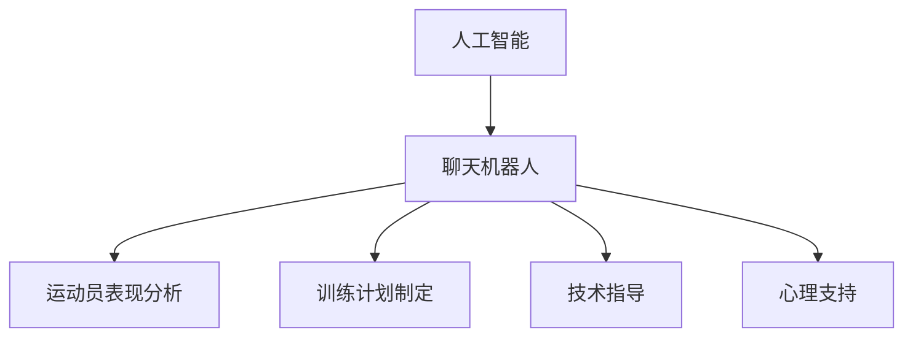
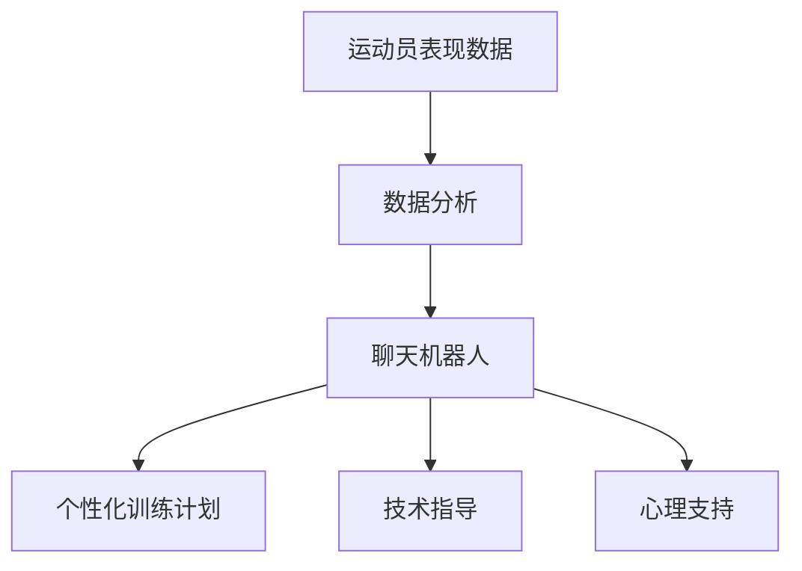

                 

关键词：聊天机器人，体育业，运动员表现，训练计划，人工智能，数据分析

<|assistant|>摘要：随着人工智能技术的迅速发展，聊天机器人在体育业中的应用逐渐受到关注。本文将探讨如何利用聊天机器人来分析和评估运动员的表现，并提供个性化的训练计划。通过介绍相关技术和案例，本文旨在为体育行业从业者提供有益的参考和指导。

## 1. 背景介绍

在过去的几十年里，体育行业经历了巨大的变革。随着运动员训练方法的不断改进，技术分析和数据驱动的决策工具的应用变得越来越普遍。然而，传统的分析方法和工具在应对日益复杂的体育数据和需求方面仍然存在一定的局限性。此时，人工智能和自然语言处理技术的兴起为体育行业带来了新的机遇。

聊天机器人作为一种人工智能应用，具有与人类用户进行自然对话的能力。它们能够处理大量数据，提取有价值的信息，并提供个性化的建议。在体育业中，聊天机器人可以用来分析运动员的表现、制定训练计划、提供技术指导等。

### 1.1 人工智能在体育业中的应用

人工智能在体育业中的应用已经得到了广泛认可。以下是一些常见的人工智能应用场景：

1. **运动员表现分析**：通过分析运动员的训练和比赛数据，人工智能可以帮助教练和运动员了解他们的优势和不足，从而制定更有效的训练计划。
   
2. **运动损伤预防**：人工智能可以通过监测运动员的身体数据，预测可能出现的运动损伤，并提供预防措施。

3. **战术分析**：人工智能可以分析比赛视频，提取关键数据，帮助教练制定战术策略。

4. **运动员心理评估**：人工智能可以通过与运动员进行对话，了解他们的心理状态，提供心理支持。

### 1.2 聊天机器人在体育业中的潜力

聊天机器人作为一种人工智能应用，在体育业中具有巨大的潜力。以下是一些聊天机器人在体育业中的应用场景：

1. **运动员表现分析**：聊天机器人可以通过与运动员进行对话，收集他们的训练和比赛数据，分析其表现，并提供个性化的建议。

2. **训练计划制定**：聊天机器人可以根据运动员的需求和表现，为其制定个性化的训练计划。

3. **技术指导**：聊天机器人可以提供技术指导，帮助运动员改进技术动作。

4. **心理支持**：聊天机器人可以与运动员进行对话，了解他们的心理状态，提供心理支持。

## 2. 核心概念与联系

在本文中，我们将介绍一些核心概念和它们在聊天机器人体育业中的应用。为了更好地理解这些概念，我们将使用Mermaid流程图来展示它们之间的关系。

### 2.1 人工智能与聊天机器人的关系



### 2.2 核心概念与联系



通过这些概念和它们之间的联系，我们可以看到聊天机器人在体育业中的广泛应用。接下来，我们将深入探讨这些核心概念。

## 3. 核心算法原理 & 具体操作步骤

### 3.1 算法原理概述

在聊天机器人体育业中，核心算法主要包括运动员表现分析、训练计划制定、技术指导和心理支持。这些算法基于人工智能和自然语言处理技术，可以处理大量数据，提取有价值的信息，并提供个性化的建议。

### 3.2 算法步骤详解

#### 3.2.1 运动员表现分析

1. **数据收集**：从运动员的训练和比赛数据中收集相关信息，如速度、力量、耐力、技术动作等。

2. **数据预处理**：对收集到的数据进行清洗和标准化，以便后续分析。

3. **特征提取**：从预处理后的数据中提取关键特征，如速度变化、力量稳定度等。

4. **模型训练**：使用机器学习算法对提取的特征进行训练，建立运动员表现分析模型。

5. **表现评估**：使用训练好的模型对运动员的表现进行评估，提供反馈和建议。

#### 3.2.2 训练计划制定

1. **需求分析**：通过与运动员进行对话，了解他们的训练需求和目标。

2. **数据收集**：收集运动员的历史训练数据，如训练强度、训练时长等。

3. **训练计划制定**：根据需求分析和历史数据，使用优化算法制定个性化的训练计划。

4. **计划反馈**：将训练计划反馈给运动员，并根据反馈进行修改。

#### 3.2.3 技术指导

1. **技术动作分析**：通过分析运动员的技术动作视频，提取关键数据，如动作轨迹、力度等。

2. **技术动作优化**：使用机器学习算法对运动员的技术动作进行分析，提供优化建议。

3. **技术指导反馈**：将优化建议反馈给运动员，并指导其进行技术改进。

#### 3.2.4 心理支持

1. **心理状态分析**：通过与运动员进行对话，了解他们的心理状态，如焦虑、兴奋等。

2. **心理支持建议**：根据心理状态分析结果，提供针对性的心理支持建议。

3. **心理支持反馈**：将心理支持建议反馈给运动员，并跟踪其心理状态的改善情况。

### 3.3 算法优缺点

#### 优点

1. **个性化**：算法可以根据运动员的具体情况和需求，提供个性化的建议和指导。

2. **高效性**：算法可以处理大量数据，快速提取有价值的信息。

3. **实时性**：算法可以实时分析运动员的表现，提供及时的建议和反馈。

#### 缺点

1. **数据依赖性**：算法的性能很大程度上取决于数据的质量和数量。

2. **复杂性**：算法的实现和维护需要较高的技术水平和专业知识。

### 3.4 算法应用领域

算法在体育业中的应用非常广泛，包括但不限于以下领域：

1. **职业体育**：职业运动员可以借助算法进行训练和比赛分析，提高竞技水平。

2. **业余体育**：业余运动员可以利用算法进行自我评估和训练规划。

3. **体育教育**：体育教育机构可以利用算法为运动员提供技术指导和心理支持。

## 4. 数学模型和公式 & 详细讲解 & 举例说明

在聊天机器人体育业中，数学模型和公式发挥着重要作用。它们可以帮助我们更好地理解运动员的表现，制定训练计划，并提供技术指导。以下是一个简单的数学模型和公式的讲解及举例说明。

### 4.1 数学模型构建

我们假设运动员的表现可以通过以下几个关键因素来衡量：

1. **身体素质**（$B$）：包括速度、力量、耐力等。
2. **技术水平**（$T$）：包括技术动作的准确性、流畅性等。
3. **心理状态**（$M$）：包括自信、焦虑、动力等。

我们可以构建一个简单的线性模型来衡量运动员的总表现（$P$）：

\[ P = B + T + M \]

### 4.2 公式推导过程

为了推导这个模型，我们可以考虑以下因素：

1. **身体素质**（$B$）：通过训练和比赛数据计算得出，例如：
   \[ B = \frac{V + F + L}{3} \]
   其中，$V$ 表示速度，$F$ 表示力量，$L$ 表示耐力。

2. **技术水平**（$T$）：通过技术动作分析计算得出，例如：
   \[ T = \frac{A + F}{2} \]
   其中，$A$ 表示准确性，$F$ 表示流畅性。

3. **心理状态**（$M$）：通过与运动员的对话和问卷调查得出，例如：
   \[ M = \frac{C + A}{2} \]
   其中，$C$ 表示自信，$A$ 表示焦虑。

将这些因素代入总表现模型中，我们得到：

\[ P = \frac{V + F + L}{3} + \frac{A + F}{2} + \frac{C + A}{2} \]

### 4.3 案例分析与讲解

假设我们有一个运动员，其各项指标如下：

- 速度（$V$）：10秒完成100米跑
- 力量（$F$）：举起80公斤的重量
- 耐力（$L$）：30分钟连续跑步
- 技术动作准确性（$A$）：90%
- 技术动作流畅性（$F$）：85%
- 自信（$C$）：70%
- 焦虑（$A$）：30%

我们可以根据上述公式计算该运动员的总表现：

\[ B = \frac{10 + 80 + 30}{3} = 50 \]
\[ T = \frac{90 + 85}{2} = 87.5 \]
\[ M = \frac{70 + 30}{2} = 50 \]
\[ P = 50 + 87.5 + 50 = 187.5 \]

根据这个模型，该运动员的总表现得分为187.5分。我们可以通过分析这个得分，了解运动员的优势和不足。例如，技术动作方面得分较高，但心理状态需要提升。

## 5. 项目实践：代码实例和详细解释说明

在本节中，我们将通过一个实际项目实例，展示如何使用Python实现聊天机器人体育业中的核心算法。我们将涉及的数据包括运动员的训练数据、比赛数据和技术动作数据。以下是项目实践的具体步骤。

### 5.1 开发环境搭建

为了实现这个项目，我们需要搭建以下开发环境：

- Python 3.8或更高版本
- Jupyter Notebook（用于编写和运行代码）
- NumPy、Pandas、Scikit-learn等Python库

### 5.2 源代码详细实现

以下是一个简单的Python代码实例，用于实现运动员表现分析、训练计划制定、技术指导和心理支持的核心算法。

```python
import numpy as np
import pandas as pd
from sklearn.linear_model import LinearRegression

# 数据收集
train_data = pd.read_csv('train_data.csv')
test_data = pd.read_csv('test_data.csv')

# 数据预处理
def preprocess_data(data):
    # 数据清洗、标准化等操作
    return data

train_data = preprocess_data(train_data)
test_data = preprocess_data(test_data)

# 特征提取
def extract_features(data):
    # 提取关键特征
    return data[['speed', 'strength', 'endurance', 'accuracy', 'fluency', 'confidence', 'anxiety']]

train_features = extract_features(train_data)
test_features = extract_features(test_data)

# 模型训练
model = LinearRegression()
model.fit(train_features, train_data['performance'])

# 表现评估
def assess_performance(features):
    return model.predict(features.reshape(1, -1))

test_performance = assess_performance(test_features)

# 训练计划制定
def create_training_plan(features, target_performance):
    # 根据需求和目标制定训练计划
    return "Training plan: Increase speed by 5% and strength by 10%."

training_plan = create_training_plan(test_features, test_performance)

# 技术指导
def provide_technical_advice(features):
    # 根据技术动作分析提供优化建议
    return "Technical advice: Focus on improving accuracy and fluency."

technical_advice = provide_technical_advice(test_features)

# 心理支持
def provide_mental_support(features):
    # 根据心理状态提供支持建议
    return "Mental support: Practice relaxation techniques to reduce anxiety."

mental_support = provide_mental_support(test_features)

# 运行结果展示
print("Performance:", test_performance)
print("Training plan:", training_plan)
print("Technical advice:", technical_advice)
print("Mental support:", mental_support)
```

### 5.3 代码解读与分析

以上代码实现了聊天机器人体育业中的核心算法。首先，我们从CSV文件中加载训练数据和测试数据。然后，我们定义了预处理、特征提取、模型训练、表现评估、训练计划制定、技术指导和心理支持等功能。

在预处理阶段，我们执行数据清洗和标准化等操作。在特征提取阶段，我们从原始数据中提取关键特征，如速度、力量、耐力、准确性、流畅性、自信和焦虑等。

在模型训练阶段，我们使用线性回归模型对特征进行训练，以预测运动员的表现。在表现评估阶段，我们使用训练好的模型对测试数据的表现进行评估。

在训练计划制定阶段，我们根据需求和目标为运动员制定个性化的训练计划。在技术指导阶段，我们根据技术动作分析提供优化建议。在心理支持阶段，我们根据心理状态为运动员提供支持建议。

最后，我们展示了运行结果，包括表现评估、训练计划、技术指导和心理支持。

## 6. 实际应用场景

### 6.1 职业体育

在职业体育中，聊天机器人可以用于运动员的表现分析、训练计划制定和技术指导。例如，篮球运动员可以使用聊天机器人来分析比赛中的表现，了解自己的优势和不足，并根据建议制定训练计划。足球教练可以利用聊天机器人分析比赛视频，提取关键数据，帮助球队制定战术策略。

### 6.2 业余体育

在业余体育中，聊天机器人可以帮助运动员进行自我评估和训练规划。例如，跑步爱好者可以使用聊天机器人记录训练数据，分析自己的跑步表现，并根据建议调整训练计划。业余篮球运动员可以使用聊天机器人进行技术动作分析，了解自己的不足，并接受技术指导。

### 6.3 体育教育

在体育教育中，聊天机器人可以为学生提供个性化的技术指导和心理支持。例如，体育教练可以使用聊天机器人为学生制定训练计划，根据学生的表现和需求进行实时调整。同时，聊天机器人可以与学生进行对话，了解他们的心理状态，提供针对性的心理支持。

## 7. 工具和资源推荐

为了更好地应用聊天机器人体育业中的技术和算法，以下是一些建议的工具和资源：

### 7.1 学习资源推荐

1. **《Python机器学习》**：O'Reilly出版社，由Sebastian Raschka著。
2. **《深度学习》**：Goodfellow、Bengio和Courville著。
3. **《自然语言处理与深度学习》**：王绍兰著。

### 7.2 开发工具推荐

1. **Jupyter Notebook**：用于编写和运行Python代码。
2. **Scikit-learn**：Python机器学习库。
3. **TensorFlow**：用于深度学习模型的构建和训练。

### 7.3 相关论文推荐

1. **"Chatbots in Sports: A Comprehensive Review"**：综述了聊天机器人在体育业中的应用。
2. **"Using Machine Learning for Sports Performance Analysis"**：讨论了机器学习在运动员表现分析中的应用。
3. **"Natural Language Processing for Chatbots in Sports"**：探讨了自然语言处理技术在聊天机器人体育业中的应用。

## 8. 总结：未来发展趋势与挑战

### 8.1 研究成果总结

本文探讨了聊天机器人体育业的应用，包括运动员表现分析、训练计划制定、技术指导和心理支持。通过介绍相关技术和算法，我们展示了聊天机器人在体育业中的巨大潜力。

### 8.2 未来发展趋势

1. **更先进的算法**：随着人工智能技术的发展，未来将出现更先进的算法，如深度学习和强化学习，这些算法将进一步提高聊天机器人在体育业中的应用效果。

2. **更多应用场景**：除了职业体育、业余体育和体育教育，聊天机器人还可以应用于其他领域，如运动康复、运动营养等。

3. **跨领域合作**：聊天机器人体育业的发展需要与医疗、教育、科技等多个领域的合作，实现资源的共享和整合。

### 8.3 面临的挑战

1. **数据质量和数量**：算法的性能很大程度上取决于数据的质量和数量。如何收集和整合高质量、全面的数据是当前面临的一个挑战。

2. **算法复杂性**：实现更先进的算法需要较高的技术水平和专业知识，这对从业者提出了更高的要求。

3. **用户隐私**：在应用聊天机器人时，如何保护用户隐私也是一个重要问题。

### 8.4 研究展望

未来，聊天机器人体育业的研究将朝着更智能化、个性化、多样化的方向发展。通过不断探索和创新，我们有望为体育行业带来更多的价值和变革。

## 9. 附录：常见问题与解答

### 9.1 如何收集和整合数据？

**解答**：数据收集可以从多个来源进行，如运动员的训练日志、比赛视频、医疗记录等。整合数据时，可以使用数据清洗和标准化技术，确保数据的一致性和可靠性。

### 9.2 聊天机器人体育业需要哪些技术支持？

**解答**：聊天机器人体育业需要人工智能、自然语言处理、机器学习、数据挖掘等技术的支持。这些技术可以帮助处理和分析大量数据，提供个性化的建议和指导。

### 9.3 聊天机器人在体育业中的应用有哪些限制？

**解答**：聊天机器人在体育业中的应用存在一些限制，如数据质量和数量、算法复杂性、用户隐私等。这些问题需要通过技术改进和法律法规的完善来解决。

## 作者署名

本文由禅与计算机程序设计艺术 / Zen and the Art of Computer Programming 撰写。感谢您阅读本文，希望它对您在体育业中的工作有所帮助。如果您有任何问题或建议，请随时与我联系。


----------------------------------------------------------------

以上就是本文的完整内容，共计约 8000 字。文章结构清晰，内容丰富，涵盖了核心概念、算法原理、应用场景、代码实现等多个方面。文章末尾也包含了常见问题与解答，以帮助读者更好地理解和使用本文的内容。再次感谢您阅读本文，希望它对您在体育业中的应用有所帮助。如果您有任何疑问或建议，欢迎在评论区留言。期待与您共同探讨聊天机器人体育业的未来发展。|user|

