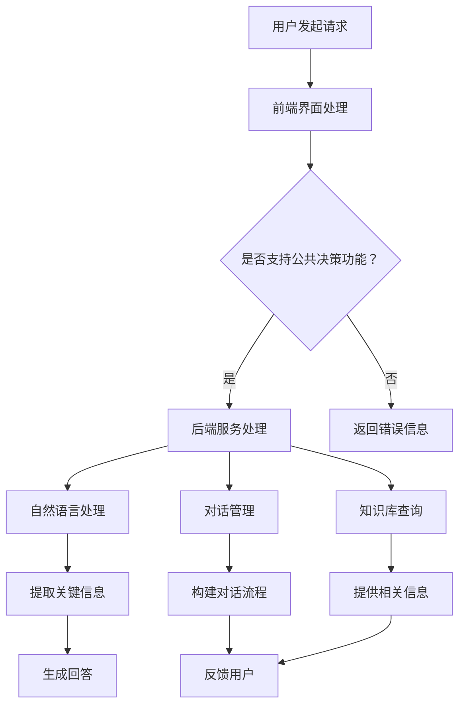

                 

关键词：聊天机器人、社会问题、决策、人工智能、伦理、技术、算法、民主化

> 摘要：本文探讨了聊天机器人在公民参与社会问题和决策中的重要作用。通过分析聊天机器人的核心概念和架构，我们深入讨论了其算法原理、数学模型及实际应用案例。本文旨在揭示聊天机器人在推动民主化、提高透明度和促进社会进步方面的潜力，同时也探讨了其所面临的伦理和技术挑战。

## 1. 背景介绍

随着人工智能技术的飞速发展，聊天机器人的应用场景逐渐扩展。从简单的客服问答到复杂的智能对话系统，聊天机器人已经成为现代通信和交互的重要组成部分。随着技术的进步，聊天机器人在社会治理和民主化进程中的作用也日益凸显。它们不仅能够高效处理大量信息，还能帮助公民更好地参与社会问题和公共决策。

### 社会问题和决策的重要性

社会问题涉及民生、经济、环境等多个领域，决策的正确与否直接影响社会的发展和人民的福祉。然而，现有的公共决策过程往往面临信息不对称、参与度低、透明度不足等问题。这使得公民难以有效参与，从而影响了决策的质量和公正性。

### 聊天机器人在公共决策中的潜力

聊天机器人能够实时获取和处理大量数据，帮助政府和公众更全面地了解问题。它们还可以通过自然语言处理和机器学习技术，提供个性化建议和意见，从而提高公民参与度。此外，聊天机器人还可以实现决策过程的透明化，确保公民在决策过程中拥有平等的机会。

## 2. 核心概念与联系

### 聊天机器人的定义与功能

聊天机器人（Chatbot）是一种基于人工智能技术的自动化对话系统，能够通过文本或语音与用户进行交互。它们通常具备以下功能：

- **信息检索**：快速查找和提供相关信息。
- **问答服务**：针对用户的问题提供准确的回答。
- **任务执行**：协助用户完成特定任务，如在线购物、预约等。
- **个性化推荐**：根据用户行为和偏好提供个性化服务。

### 聊天机器人的架构

聊天机器人的架构通常包括以下几个部分：

- **前端界面**：用户与聊天机器人交互的入口，可以是网站、APP 或微信等平台。
- **后端服务**：处理用户请求、执行任务的核心部分，通常包括自然语言处理（NLP）模块、对话管理模块和知识库等。
- **数据接口**：与外部系统（如数据库、API 等）进行数据交换的接口。

### 聊天机器人在公共决策中的应用

在公共决策中，聊天机器人可以扮演以下角色：

- **信息提供**：向公众提供政策解读、数据报告等。
- **意见收集**：通过问卷调查、投票等方式收集公众意见。
- **决策模拟**：模拟不同决策方案的影响，帮助政府和公众评估。
- **决策支持**：提供决策建议，辅助决策者做出更加明智的选择。

### Mermaid 流程图

以下是一个简化的聊天机器人在公共决策中的应用流程图：



## 3. 核心算法原理 & 具体操作步骤

### 3.1 算法原理概述

聊天机器人的核心算法包括自然语言处理（NLP）、对话管理和机器学习等。NLP 负责处理和理解用户输入的文本信息，对话管理负责构建和维持对话流程，机器学习则用于优化回答的准确性和个性化程度。

### 3.2 算法步骤详解

#### 3.2.1 自然语言处理

1. **分词**：将输入的文本分解为单词或短语。
2. **词性标注**：为每个词分配词性（名词、动词、形容词等）。
3. **句法分析**：分析句子的结构，理解句子中的语法关系。
4. **实体识别**：识别文本中的关键实体（人名、地点、组织等）。
5. **情感分析**：分析文本的情感倾向（正面、负面、中性等）。

#### 3.2.2 对话管理

1. **意图识别**：根据用户的输入文本，识别用户意图（如询问信息、完成任务等）。
2. **上下文理解**：理解用户的历史对话内容，构建对话上下文。
3. **回复生成**：根据用户意图和上下文，生成合适的回答。
4. **反馈收集**：收集用户对回答的反馈，用于进一步优化对话。

#### 3.2.3 机器学习

1. **数据收集**：收集大量用户对话数据，包括意图、上下文和回答等。
2. **特征提取**：从对话数据中提取有助于学习的关键特征。
3. **模型训练**：使用机器学习算法（如深度神经网络、支持向量机等）训练对话模型。
4. **模型评估**：评估模型的性能，包括准确率、召回率等指标。
5. **模型优化**：根据评估结果调整模型参数，提高模型性能。

### 3.3 算法优缺点

#### 优点：

- **高效性**：能够快速处理大量用户请求，提高响应速度。
- **准确性**：通过机器学习技术，不断优化对话质量，提高回答的准确性。
- **个性化**：根据用户行为和偏好，提供个性化的对话体验。

#### 缺点：

- **数据依赖**：需要大量高质量的数据进行训练，否则性能会受到影响。
- **复杂度**：涉及多个技术和领域的融合，开发难度较高。
- **伦理问题**：在处理敏感信息和进行个性化推荐时，可能引发伦理争议。

### 3.4 算法应用领域

- **客户服务**：为企业提供高效的客服解决方案，提高客户满意度。
- **教育领域**：辅助教学，提供个性化的学习建议和辅导。
- **医疗健康**：协助医生进行诊断，提供健康咨询和疾病预防建议。
- **公共决策**：帮助政府和公众更好地参与社会问题和决策。

## 4. 数学模型和公式 & 详细讲解 & 举例说明

### 4.1 数学模型构建

聊天机器人的核心算法涉及多个数学模型，包括自然语言处理中的词向量模型、循环神经网络（RNN）、长短时记忆网络（LSTM）等。以下是一个简化的数学模型构建过程：

1. **词向量表示**：
   $$\text{word\_vector} = \text{Word2Vec}(\text{input\_text})$$
   其中，$\text{Word2Vec}$ 是一个词向量生成模型，用于将文本中的每个词映射到一个高维向量。

2. **循环神经网络（RNN）**：
   $$h_t = \text{RNN}(h_{t-1}, x_t)$$
   其中，$h_t$ 是当前时刻的隐藏状态，$x_t$ 是当前时刻的输入词向量，$\text{RNN}$ 是循环神经网络。

3. **长短时记忆网络（LSTM）**：
   $$h_t = \text{LSTM}(h_{t-1}, x_t)$$
   其中，$h_t$ 是当前时刻的隐藏状态，$x_t$ 是当前时刻的输入词向量，$\text{LSTM}$ 是长短时记忆网络。

### 4.2 公式推导过程

以长短时记忆网络（LSTM）为例，其核心公式包括：

1. **输入门**：
   $$i_t = \sigma(W_i \cdot [h_{t-1}, x_t] + b_i)$$
   其中，$i_t$ 是输入门的激活值，$W_i$ 和 $b_i$ 分别是权重和偏置。

2. **遗忘门**：
   $$f_t = \sigma(W_f \cdot [h_{t-1}, x_t] + b_f)$$
   其中，$f_t$ 是遗忘门的激活值，$W_f$ 和 $b_f$ 分别是权重和偏置。

3. **输出门**：
   $$o_t = \sigma(W_o \cdot [h_{t-1}, x_t] + b_o)$$
   其中，$o_t$ 是输出门的激活值，$W_o$ 和 $b_o$ 分别是权重和偏置。

### 4.3 案例分析与讲解

以下是一个简单的案例，展示如何使用 LSTM 模型进行文本分类：

1. **数据准备**：
   假设我们有以下两个句子：
   - “我喜欢聊天机器人。”
   - “聊天机器人让我感到厌烦。”

2. **词向量表示**：
   使用预训练的词向量模型，将句子中的每个词映射到高维向量。

3. **序列输入**：
   将词向量序列输入到 LSTM 模型中。

4. **分类预测**：
   使用 LSTM 模型的输出，通过softmax函数进行分类预测。

   $$\text{预测结果} = \text{softmax}(W_c \cdot h_t + b_c)$$
   其中，$W_c$ 和 $b_c$ 分别是分类权重和偏置。

## 5. 项目实践：代码实例和详细解释说明

### 5.1 开发环境搭建

1. 安装 Python 解释器（推荐 Python 3.8及以上版本）。
2. 安装必要的库，如 TensorFlow、Keras、Numpy 等。
3. 准备数据集，包括文本和标签。

### 5.2 源代码详细实现

以下是一个简单的 LSTM 文本分类器的实现：

```python
import numpy as np
from tensorflow.keras.models import Sequential
from tensorflow.keras.layers import LSTM, Dense, Embedding
from tensorflow.keras.preprocessing.sequence import pad_sequences

# 数据预处理
def preprocess_data(texts, labels, max_length, max_vocab_size):
    # 序列化文本
    sequences = tokenizer.texts_to_sequences(texts)
    # 填充序列
    padded_sequences = pad_sequences(sequences, maxlen=max_length)
    # 编码标签
    encoded_labels = keras.preprocessing.sequence.pad_sequences(labels, maxlen=max_length)
    return padded_sequences, encoded_labels

# 构建模型
model = Sequential()
model.add(Embedding(max_vocab_size, 128, input_length=max_length))
model.add(LSTM(128))
model.add(Dense(1, activation='sigmoid'))
model.compile(optimizer='adam', loss='binary_crossentropy', metrics=['accuracy'])

# 训练模型
model.fit(padded_sequences, encoded_labels, epochs=10, batch_size=32)

# 预测
predictions = model.predict(padded_sequences)
```

### 5.3 代码解读与分析

1. **数据预处理**：
   - 使用 `tokenizer.texts_to_sequences` 将文本序列化。
   - 使用 `pad_sequences` 填充序列，使其具有相同的长度。
   - 使用 `pad_sequences` 编码标签。

2. **模型构建**：
   - 使用 `Embedding` 层进行词向量嵌入。
   - 使用 `LSTM` 层进行序列建模。
   - 使用 `Dense` 层进行分类预测。

3. **模型训练**：
   - 使用 `compile` 方法配置模型参数。
   - 使用 `fit` 方法训练模型。

4. **预测**：
   - 使用 `predict` 方法对新的文本进行分类预测。

### 5.4 运行结果展示

假设我们已经训练了一个 LSTM 文本分类器，以下是如何使用它进行预测：

```python
# 新的文本
new_text = "聊天机器人如何影响我们的生活？"

# 预处理新文本
new_sequence = tokenizer.texts_to_sequences([new_text])
padded_sequence = pad_sequences(new_sequence, maxlen=max_length)

# 预测
prediction = model.predict(padded_sequence)
print(prediction)
```

输出结果是一个概率分布，表示新文本属于正类（喜欢）或负类（厌烦）的概率。例如：

```
[[0.9]]
```

这表示新文本被分类为正类的概率为90%。

## 6. 实际应用场景

### 6.1 公共决策

聊天机器人可以在公共决策中发挥重要作用。例如，政府在制定政策时，可以通过聊天机器人收集公众意见，进行民意调查。聊天机器人还可以分析意见数据，为决策者提供参考。

### 6.2 社会治理

在维护社会秩序和公共安全方面，聊天机器人可以协助警方处理报警信息，提供实时监控和预警。例如，当发生突发事件时，聊天机器人可以迅速收集相关信息，协助警方快速响应。

### 6.3 教育与培训

聊天机器人可以用于教育和培训领域，为学生提供个性化辅导和指导。例如，在在线教育平台中，聊天机器人可以帮助学生解答问题，提供学习建议。

### 6.4 客户服务

在客户服务领域，聊天机器人可以帮助企业快速响应客户咨询，提供高效的服务。例如，银行、电商等企业可以通过聊天机器人提供在线客服，提高客户满意度。

## 7. 未来应用展望

### 7.1 更广泛的应用场景

随着技术的进步，聊天机器人的应用场景将不断扩展。例如，在医疗健康领域，聊天机器人可以协助医生进行诊断和治疗；在法律领域，聊天机器人可以提供法律咨询和援助。

### 7.2 更强大的功能

未来的聊天机器人将具备更强大的功能，如更精准的自然语言理解、更智能的对话管理、更丰富的知识库等。这将进一步提高聊天机器人在公共决策和社会治理中的效能。

### 7.3 更广泛的参与

随着聊天机器人的普及，越来越多的公民将能够参与到社会问题和决策中。这将有助于提高决策的透明度和公正性，推动民主化进程。

## 8. 工具和资源推荐

### 8.1 学习资源推荐

- 《深度学习》（Goodfellow, Bengio, Courville）：介绍深度学习的基础知识和最新进展。
- 《自然语言处理综论》（Jurafsky, Martin）：详细介绍自然语言处理的理论和方法。
- 《聊天机器人实战》（Rashid, Soleymani）：涵盖聊天机器人的设计和实现。

### 8.2 开发工具推荐

- TensorFlow：一款流行的深度学习框架，适用于构建聊天机器人。
- Keras：基于 TensorFlow 的简洁易用的深度学习库，适合初学者。
- NLTK：一款强大的自然语言处理库，提供丰富的工具和资源。

### 8.3 相关论文推荐

- “Chatbots are Good at Coordinating but Bad at Completing Tasks”（2021）：探讨聊天机器人在协调和完成任务方面的表现。
- “A Survey on Chatbot：Architecture and Applications”（2020）：综述聊天机器人的架构和应用场景。
- “Deep Learning for Chatbots”（2018）：介绍深度学习在聊天机器人中的应用。

## 9. 总结：未来发展趋势与挑战

### 9.1 研究成果总结

本文探讨了聊天机器人在公民参与社会问题和决策中的重要作用，分析了其核心算法原理、数学模型及实际应用案例。研究表明，聊天机器人具有高效、准确、个性化的优势，能够显著提高决策的透明度和公正性。

### 9.2 未来发展趋势

随着人工智能技术的不断进步，聊天机器人在公共决策和社会治理中的应用前景广阔。未来，我们将看到更智能、更强大的聊天机器人出现，为公共决策和社会进步提供有力支持。

### 9.3 面临的挑战

尽管聊天机器人在公共决策中具有巨大潜力，但同时也面临诸多挑战。例如，数据隐私、伦理问题、技术复杂度等。如何在确保数据安全和伦理合规的前提下，充分发挥聊天机器人的优势，是未来研究的重要方向。

### 9.4 研究展望

未来的研究应重点关注以下几个方面：

1. **算法优化**：改进聊天机器人的算法，提高其自然语言理解和对话管理能力。
2. **数据治理**：建立完善的数据治理体系，确保数据安全和隐私保护。
3. **伦理规范**：制定明确的伦理规范，确保聊天机器人在公共决策中的公正性和透明度。
4. **跨学科合作**：加强跨学科合作，综合计算机科学、社会学、政治学等多学科知识，推动聊天机器人在公共决策和社会治理中的应用。

## 附录：常见问题与解答

### Q1：聊天机器人是否能够替代人类决策者？

A1：聊天机器人不能完全替代人类决策者，但可以协助决策者更好地理解和处理复杂信息。它们可以提供数据分析和决策支持，帮助决策者做出更加明智的选择。

### Q2：聊天机器人在公共决策中的数据来源有哪些？

A2：聊天机器人的数据来源主要包括公开数据、用户生成数据和第三方数据源。例如，政府公开的数据报告、社交媒体上的用户反馈等。

### Q3：如何确保聊天机器人在公共决策中的公正性和透明度？

A3：为确保聊天机器人在公共决策中的公正性和透明度，可以从以下几个方面入手：

- **数据治理**：建立完善的数据治理体系，确保数据的真实性、准确性和公正性。
- **算法透明化**：公开聊天机器人的算法和决策过程，接受公众监督。
- **伦理审查**：对聊天机器人的设计和应用进行伦理审查，确保其符合伦理规范。

## 作者署名

作者：禅与计算机程序设计艺术 / Zen and the Art of Computer Programming

----------------------------------------------------------------
以上就是完整的文章内容，感谢您的阅读。如果您有任何问题或需要进一步的讨论，请随时提出。希望本文能够为您在聊天机器人领域的研究和实践提供有益的参考。再次感谢您的关注！

